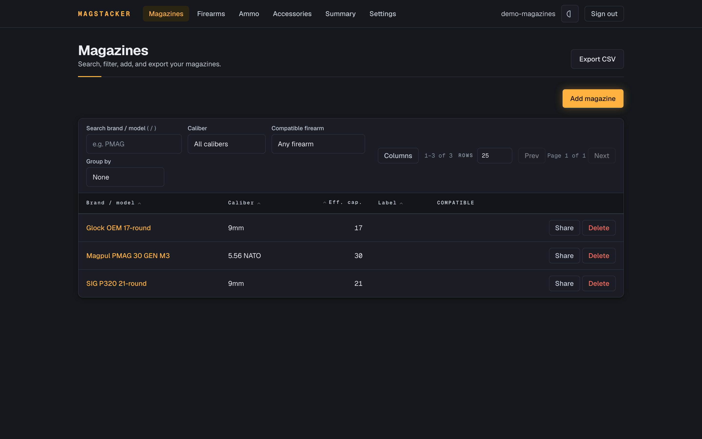
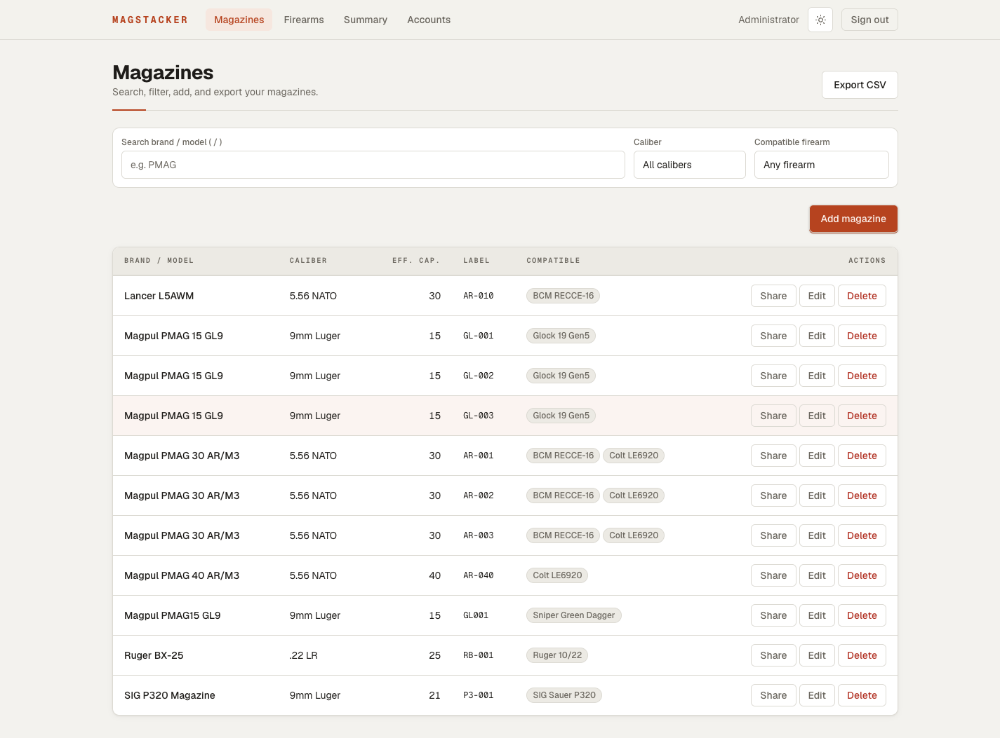

# MagStacker

MagStacker keeps track of your firearms and magazines: what you own, what fits
what, and how much it all holds. It's a self-hosted web app for shooting ranges,
clubs, and individual owners who'd rather not keep their inventory in a
spreadsheet or somebody else's cloud.

You run it on your own server, behind your own login, and the data stays with
you.


It ships a two-mode interface that follows your system by default — a dark
"Field Console" and a light "Machined Instrument":

|                          Dark                           |                          Light                           |
| :-----------------------------------------------------: | :------------------------------------------------------: |
|  |  |

## Who it's for

- **Individuals** keeping a personal collection straight. Label your mags, see
  how many you've got per caliber and per firearm, and pull a copy for your own
  records or insurance.
- **Clubs** that want to share specific club-owned items with members at view or
  edit, without opening up the whole inventory.
- **Ranges** handing fleet hardware to staff. Share items at edit and switch on
  "allow adding records owned by me," so an employee can add new range assets to
  the range's books. A view-only volunteer can see them without changing
  anything.

Everyone sees only what they own or what's been shared with them, and only an
item's owner can delete it. Revoke a share and it's gone on the other person's
next request.

## What you can do

- Add firearms and magazines with the fields that matter: caliber, capacity
  (base plus any extension), labels, acquired date, serial, notes.
- Link each magazine to the firearms it fits. The order you set is the order it
  shows up in everywhere else.
- Bulk-add a labeled batch in one go (say, 60 mags numbered `AR-01` through
  `AR-60`), and the count picks up where it left off the next time you add.
- Filter magazines by brand or model, exact caliber, or which firearm they fit.
- Check a summary: a running total, plus counts per caliber and per firearm,
  over everything you can see.
- Export to CSV for a spreadsheet. Serial numbers stay out of the export, and a
  cell that starts with `=` won't turn into a live formula when someone opens the
  file.
- Share one item with another account at view or edit, optionally let them add
  records on your behalf, and take the access back whenever you want.

There's no public sign-up. Accounts are created by whoever runs the server, and
serial numbers are treated as sensitive everywhere they show up.

## Get it running

You'll need a machine with [Docker](https://www.docker.com/): a home server, a
spare always-on box, the club's back-office PC, whatever you keep running.

```bash
cp .env.example .env
# Fill in .env: a database password, a long random BETTER_AUTH_SECRET
# (try `openssl rand -base64 32`), your first admin email and password, and
# BETTER_AUTH_URL set to the address you'll actually open it at.

docker compose up --build -d                  # starts Postgres and the app
docker compose exec app bun run seed:admin    # creates your first admin account
```

Open `http://<your-server>:3000/login`, sign in, and add the rest of the
accounts (staff, members, family) from the **Accounts** screen.

> Run it behind HTTPS. Logins ride on cookies, so put MagStacker behind a reverse
> proxy that handles TLS (Caddy, nginx, Traefik) and set `BETTER_AUTH_URL` to the
> `https://` address. There's more in [`docs/deployment.md`](docs/deployment.md).

### Backups

Everything lives in Postgres, so a normal `pg_dump` is your backup. Restoring it
brings back every firearm, magazine, compatibility link, and share exactly as
they were:

```bash
docker compose exec db pg_dump -U "$POSTGRES_USER" -Fc -d "$POSTGRES_DB" > magstacker.dump
```

---

## For developers

MagStacker is the original Go/Wails (later Avalonia) desktop app rebuilt as a
multi-user web app. It has to match what the desktop version already did, so the
inventory rules are pinned to a parity spec and tested against it.

Stack: Next.js 16 (App Router), React 19, Bun, Drizzle ORM, Postgres, Better
Auth, Tailwind v4, Biome. Use Bun and Biome, not ESLint/Prettier/pnpm (see
`AGENTS.md`).

```bash
docker compose up -d db        # local Postgres on host port 5544
export DATABASE_URL=postgres://magstacker:<password>@localhost:5544/magstacker
bun install
bun run db:migrate
bun run dev                    # http://localhost:3000

bun run lint                   # biome check
bun run format                 # biome format --write
bun run typecheck              # tsc --noEmit
bun test                       # unit + integration
```

> `mise` (`mise.toml`) pins the toolchain and loads `.env` into your shell, then
> caches it. After you edit `.env`, run `mise cache clear`, or a stale value can
> shadow both your tooling and `docker compose`.

Layout:

```text
app/                 # Next.js routes: login, gated inventory, admin, auth + export APIs
proxy.ts · auth.ts   # auth gate and Better Auth config
components/ui/        # design-system primitives
src/
  db/                # Drizzle schema, client, migrations, idempotency, health
  auth/              # the one server-side scoping/authorization layer
  domain/            # firearms, magazines, summary, csv, bulkadd, reference,
                     #   validation — plain TypeScript, no Next.js imports
  data/              # curated caliber/manufacturer lists
docs/                # deployment guide, architecture decision records, images
```

Authorization is enforced server-side in `src/auth`, and reads are
viewer-relative: anything you can't see drops out of lists, the summary, and
exports before it reaches you. The parity behaviors are pinned to exact values
and covered by the test suite, including two-user tests that try to break the
sharing rules.

## License

MagStacker is licensed under the [Apache License 2.0](LICENSE).
