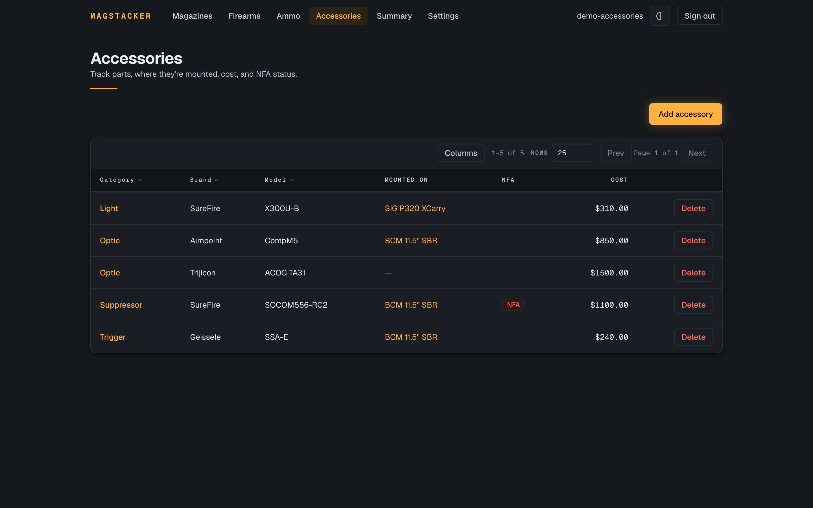
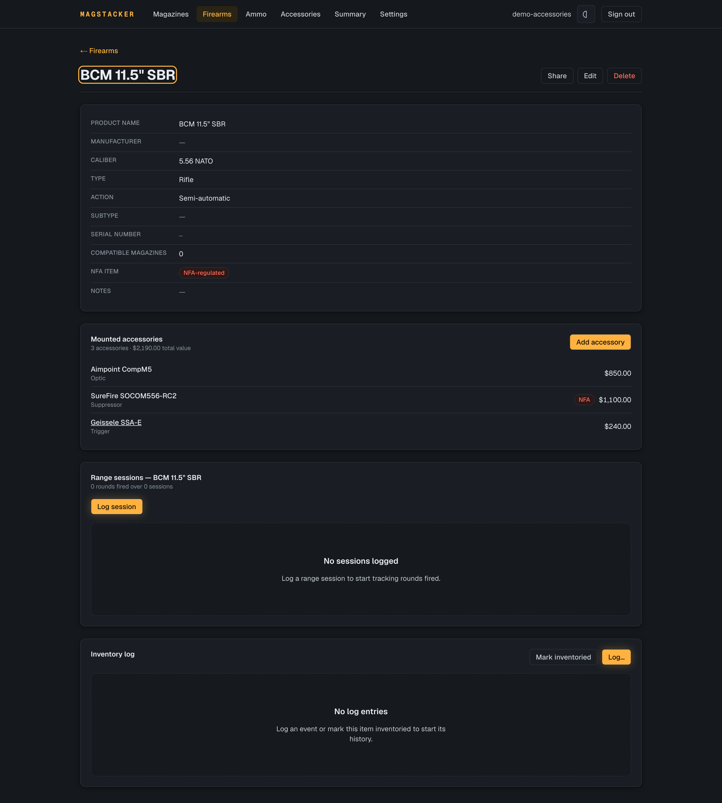

# MagStacker

MagStacker is a self-hosted web app for keeping track of firearms, magazines, ammo, and aftermarket accessories: what you own, which mags fit which guns, and what it's all worth. It's built for individual owners, clubs, and ranges that don't want their inventory living in a spreadsheet or somebody else's cloud.

You run it on your own server, behind your own login, and the data stays with you.


There are two themes, a dark "Field Console" and a light "Machined Instrument", and the app follows your system setting by default:

|                             Dark                              |                              Light                              |
| :-----------------------------------------------------------: | :-------------------------------------------------------------: |
|  |  |

Aftermarket parts (optics, suppressors, triggers, lights) get tracked per firearm with cost, serial, and NFA status, and each firearm's page shows the total value mounted on it:

|                          Accessories                          |                            On a firearm                             |
| :-----------------------------------------------------------: | :-----------------------------------------------------------------: |
|          |  |

## Who it's for

- **Individuals** keeping a personal collection straight. Label your mags, see how many you've got per caliber and per firearm, and pull a copy for insurance or your own records.
- **Clubs** that want to share certain club-owned items with members, read-only or editable, without opening up the whole inventory.
- **Ranges** handing fleet hardware to staff. Share an item at edit and switch on "allow adding records owned by me", and an employee can add new range assets to the range's books. A view-only volunteer can look but not touch.

Everyone sees only what they own or what's been shared with them, and only an item's owner can delete it. Revoke a share and it's gone on the other person's next request.

## What you can do

- Add firearms and magazines with caliber, capacity (base plus any extension), labels, acquired date, serial, and notes.
- Link each magazine to the firearms it fits. The order you set is the order it shows up in everywhere else.
- Bulk-add a labeled batch in one go (say, 60 mags numbered `AR-01` through `AR-60`), and the count picks up where it left off the next time you add.
- Filter magazines by brand or model, exact caliber, or which firearm they fit.
- Track ammo lots by caliber, load, and grain, with a low-stock threshold that flags when you're running short.
- Track the accessories on each firearm (optics, suppressors, triggers, grips) with cost, serial, installed date, and NFA status. Move a part between guns and it keeps its identity, and a firearm's page rolls up the total value mounted on it. Suppressors and other NFA items are flagged, and their serials stay sensitive.
- Check a summary: a running total, plus counts per caliber and per firearm, over everything you can see.
- Export to CSV for a spreadsheet. Serial numbers stay out of the export, and a cell that starts with `=` won't turn into a live formula when someone opens the file.
- Share one item with another account at view or edit, optionally let them add records on your behalf, and take the access back whenever you want.

There's no public sign-up. Accounts are created by whoever runs the server, and serial numbers are treated as sensitive everywhere they show up.

## Quick start

You don't need to clone the repo for this. Grab the two files the stack needs and start it with the published image, on any machine with [Docker](https://www.docker.com/):

```bash
# 1. Grab the compose file and an env template (no checkout required)
curl -O https://raw.githubusercontent.com/unclesp1d3r/mag_stacker/main/docker-compose.yml
curl -o .env https://raw.githubusercontent.com/unclesp1d3r/mag_stacker/main/.env.example

# 2. Fill in .env: your first admin email and password, and BETTER_AUTH_URL
#    set to the address you'll actually open it at.

# 3. Create the two Docker secret files (R16) — the database password and the
#    Better Auth signing secret are NOT set in .env:
mkdir -p secrets
openssl rand -hex 24 > secrets/postgres_password.txt
openssl rand -hex 32 > secrets/better_auth_secret.txt

# 4. Pull the published image and start the stack
docker compose pull
docker compose up -d          # migrates, seeds your first admin, starts the app
```

Once the stack is up, open `http://<your-server>:3000/login` and sign in as the admin you set in `.env`. Compose defaults to the `latest` released image; pin a specific version by setting `MAGSTACKER_VERSION` in `.env` (or use `edge` to track main). When you pin an older version, fetch `docker-compose.yml` and `.env.example` from that release tag too (swap `main` for the tag in the URLs above), since the compose file and env template evolve alongside the image and can drift apart from a pinned release.

On anything other than localhost, run it behind a TLS-terminating reverse proxy and set `BETTER_AUTH_URL` to the `https://` address; see [`docs/deployment.md`](docs/deployment.md).

## Running from a checkout

To build the image yourself instead of pulling the published one, clone the repo on a machine with [Docker](https://www.docker.com/). A home server or the club's back-office PC is plenty.

```bash
cp .env.example .env
# Fill in .env: your first admin email and password, and BETTER_AUTH_URL set
# to the address you'll actually open it at.

# Create the two Docker secret files (R16) — the database password and the
# Better Auth signing secret are NOT set in .env:
mkdir -p secrets
openssl rand -hex 24 > secrets/postgres_password.txt
openssl rand -hex 32 > secrets/better_auth_secret.txt

docker compose up --build -d                  # migrates, seeds your first admin, starts the app
```

The bootstrap runs migrations and creates your first admin account (from the `ADMIN_EMAIL` / `ADMIN_PASSWORD` you set in `.env`) before the app starts; `docker compose logs migrate` shows `Created admin account for <email>.` It's idempotent, so re-running `up` never duplicates the admin.

Open `http://<your-server>:3000/login`, sign in, and add the rest of the accounts (staff, members, family) from the **Accounts** screen.

> Run it behind HTTPS. Logins depend on cookies, so put MagStacker behind a reverse proxy that handles TLS (Caddy, nginx, Traefik) and set `BETTER_AUTH_URL` to the `https://` address. There's more in [`docs/deployment.md`](docs/deployment.md).

### Backups

Everything lives in Postgres, so a normal `pg_dump` is your backup. Restoring it brings back every firearm, magazine, compatibility link, and share exactly as they were:

```bash
docker compose exec db pg_dump -U "$POSTGRES_USER" -Fc -d "$POSTGRES_DB" > magstacker.dump
```

For running the Postgres and upload volumes on an encrypted host disk — and
a rundown of which threats disk encryption covers versus which an encrypted
in-app backup covers — see
[`docs/operations/encryption-at-rest.md`](docs/operations/encryption-at-rest.md).

## Behind a reverse proxy

Sign-in rides on cookies, so on any real network you run MagStacker behind a reverse proxy that terminates TLS rather than exposing port 3000 directly. Point the proxy at the app's published port and set `BETTER_AUTH_URL` in `.env` to the public `https://` address. It **must** match the origin you actually open, or Better Auth rejects the request.

The smallest example is [Caddy](https://caddyserver.com/), which gets you an automatic Let's Encrypt certificate. A whole `Caddyfile` can be two lines:

```caddyfile
magstacker.example.com {
    reverse_proxy localhost:3000
}
```

Then set `BETTER_AUTH_URL=https://magstacker.example.com` in `.env` and restart the stack. nginx and Traefik work the same way: terminate TLS, proxy to the app port, and forward a single trusted client-IP header (e.g. `X-Real-IP`) so the auth rate limiting keys on the real client. Full details, including the header and port notes, are in [`docs/deployment.md`](docs/deployment.md).

## For developers

MagStacker is the original Go/Wails (later Avalonia) desktop app rebuilt as a multi-user web app. It has to match what the desktop version already did, so the inventory rules are pinned to a parity spec and tested against it.

Stack: Next.js 16 (App Router), React 19, Bun, Drizzle ORM, Postgres, Better Auth, Tailwind v4, Biome. Use Bun and Biome, not ESLint/Prettier/pnpm (see `AGENTS.md`).

```bash
mkdir -p secrets                                          # once, if not already created
openssl rand -hex 24 > secrets/postgres_password.txt      # (see secrets/README.md)
docker compose up -d db        # local Postgres on host port 5544
export DATABASE_URL="postgres://magstacker:$(cat secrets/postgres_password.txt)@localhost:5544/magstacker"
bun install
bun run db:migrate
bun run dev                    # http://localhost:3000

bun run lint                   # biome check
bun run format                 # biome format --write
bun run typecheck              # tsc --noEmit
bun test                       # unit + integration
```

> `mise` (`mise.toml`) pins the toolchain and loads `.env` into your shell, then caches it. After you edit `.env`, run `mise cache clear`, or a stale value can shadow both your tooling and `docker compose`.
>
> The db service reads its password from `secrets/postgres_password.txt` (a Docker secret, R16), not from `.env` — see [`secrets/README.md`](secrets/README.md).

The README's demo images and walkthrough gif are generated from the live UI. Regenerate them all before a release with `just demo-images` (needs Docker + ffmpeg). The generators are `e2e/demo-*.spec.ts`, gated behind `DEMO=1` so they stay out of the normal test run, and they share one sample dataset from `e2e/fixtures/demo-seed.ts`.

Layout:

```text
app/                 # Next.js routes: login, gated inventory, admin, auth + export APIs
proxy.ts · auth.ts   # auth gate and Better Auth config
components/ui/        # design-system primitives
src/
  db/                # Drizzle schema, client, migrations, idempotency, health
  auth/              # the one server-side scoping/authorization layer
  domain/            # firearms, magazines, summary, csv, bulkadd, reference,
                     #   validation - plain TypeScript, no Next.js imports
  data/              # curated caliber/manufacturer lists
docs/                # deployment guide, architecture decision records, images
```

Authorization is enforced server-side in `src/auth`, and reads are viewer-relative: anything you can't see drops out of lists, the summary, and exports before it reaches you. The parity behaviors are pinned to exact values in the test suite, including two-user tests that try to break the sharing rules.

## License

MagStacker is licensed under the [Apache License 2.0](LICENSE).

## Contributing

Bug reports, feature requests, and pull requests are welcome. See [CONTRIBUTING.md](CONTRIBUTING.md) for the dev loop, the `just ci-check` gate, and PR guidelines.
