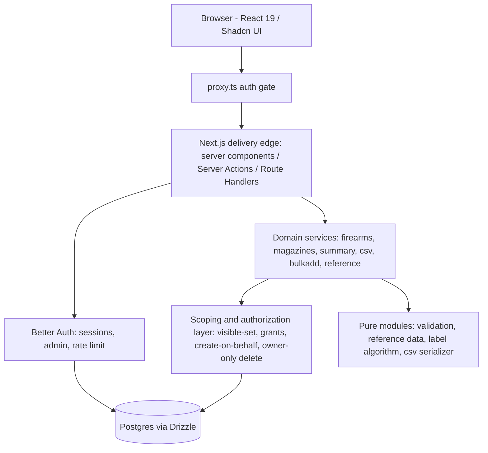
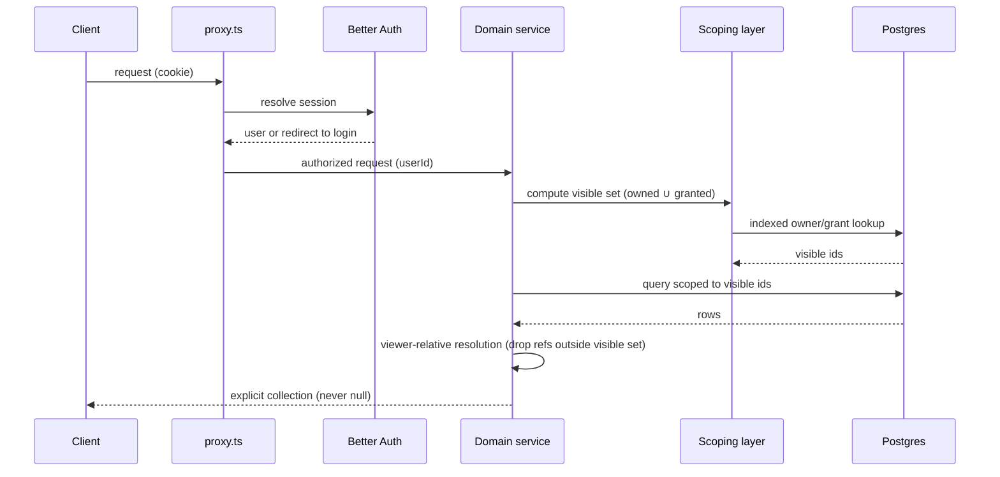
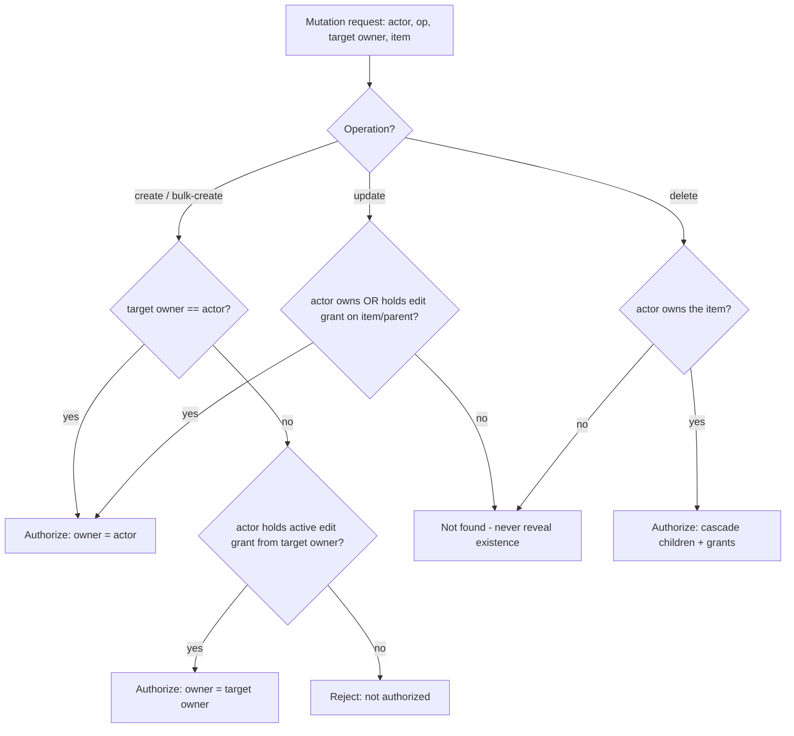

# MagStacker Web — Self-Hosted Re-platform - Plan

Product Contract preservation: carried forward from the origin requirements doc, with R7 and R58 reworded to reflect the resolved open questions; no product scope was rewritten. The three "resolve before planning" questions (OQ2, OQ3, OQ4) plus the two "deferred to planning" questions (OQ5, OQ6) were resolved with the user and are recorded as Key Technical Decisions.

---

## Goal Capsule

- **Objective:** Rebuild MagStacker as a self-hosted web app (Next.js 16 / React 19 / Drizzle / Postgres / Tailwind 4 / Shadcn / Better Auth) running as a Docker stack, preserving the desktop app's inventory behavior and adding per-user accounts, owner-scoped data, and per-item view/edit sharing on a data model shaped for future tracking domains.
- **Authority hierarchy:** The origin requirements doc (`docs/brainstorms/2026-06-27-homelab-web-replatform-requirements.md`) and the behavioral floor in `docs/reference/go-parity-spec.md` + `docs/reference/dotnet-extensions.md` govern behavior. Where this plan and those documents disagree, the source documents win. Repo conventions in `AGENTS.md` (Bun, Biome, Next 16 local docs) override generic stack habits.
- **Execution profile:** Greenfield build on an existing Next.js scaffold. Test-first for domain/parity units (the parity floor gives exact expected values); UI units verified by component + e2e tests.
- **Stop conditions:** All Implementation Units satisfy their Definition of Done, the Verification Contract gates pass, and the Docker stack boots with a working auth + inventory flow. Surface a blocker rather than guess when a decision contradicts the source documents or changes product scope.
- **Tail ownership:** The implementing session owns running migrations, the full test suite, lint/typecheck, and a Docker smoke boot before declaring done.

---

## Product Contract

### Summary

Rebuild MagStacker as a self-hosted web application on Next.js / React / Drizzle / Postgres / Tailwind 4 / Shadcn, deployed as a Docker stack in a homelab. It preserves the existing firearm/magazine/compatibility behavior of the desktop app, adds per-user accounts with owner-scoped data and per-item view+edit sharing between users, and is built on a data model deliberately shaped to grow toward round-count logs, maintenance records, ammunition, and accessories.

The named stack is the established context, not a prescription. The behavioral floor is the desktop app's proven inventory behavior; the new work is the web platform, accounts, ownership, and sharing layered around it.

### Problem Frame

MagStacker shipped as a desktop app — first Go + Wails, then Avalonia/.NET. The desktop form solved distribution, but the actual need is the tool itself: run continuously and reached from any device on a home network. A desktop client also cannot serve multi-user accounts and sharing.

The homelab is the deployment target — a long-running service the owner controls, behind their own network, backed up on their own terms. That reframes three things the desktop app never handled: concurrent users, authentication, and data ownership between people. The core inventory behavior the desktop app already proved correct stays intact.

The behavioral contract lives in `docs/reference/go-parity-spec.md` (Go behavior) and `docs/reference/dotnet-extensions.md` (the three .NET beyond-parity behaviors). That contract is the behavioral floor for this rebuild.

### Actors

- A1. Enthusiast — a casual owner cataloguing a personal collection. Small inventory, infrequent edits, values simplicity.
- A2. Competitive shooter — a power user with many magazines, active labeling, frequent bulk additions, heavy use of summary and export. The heaviest single-user.
- A3. Shared-owner collaborator — a range or club whose fleet/club assets are owned by one account, with employees/members who hold edit grants to manage those assets while keeping their own personal inventory. High volume, multiple staff with shared edit access. Customer-facing rental operations are explicitly out of scope.
- A4. The system — authenticates users and enforces ownership and sharing on every read and write.

### Requirements

#### Platform and deployment

- R1. The application runs as a Docker stack suitable for homelab self-hosting: at minimum the Next.js app and a Postgres database, composable with a single orchestration file.
- R2. Persistent data lives in Postgres; the deployment supports straightforward operator backup and restore of that data.
- R3. The application is reachable over the home network from any modern browser; there is no desktop client and no native mobile app.
- R4. No data access leaves the instance: no cloud dependency, no external data service, no telemetry transmitting inventory off the host.
- R5. Schema changes apply through a repeatable, versioned migration process; the operator upgrades without manual SQL.

#### Authentication and ownership

- R6. Every user authenticates before reaching any inventory. Unauthenticated requests reach no owned data.
- R7. Each user has a distinct account. Provisioning is operator-controlled, not open public signup.
- R7a. Login and account-provisioning endpoints apply rate limiting/throttling against credential-stuffing and brute force.
- R8. Every owned record has exactly one owner, set at creation; ownership is the default basis for visibility.
- R9. A user's default view of any list, summary, search, or export is scoped to records they own plus records shared to them. Others' unshared records are never returned.
- R10. No organization/tenant/group hierarchy. Access is the union of a user's own records and their individual grants — nothing else.

#### Sharing and visibility

- R11. An owner can grant another user access to a specific grantable item at view (read-only) or edit (read-write).
- R12. A grant is per-item, not per-inventory; granting one item exposes no other.
- R13. A grant on a parent cascades to that entity's attached child records at the same permission. Cascade follows only true parent→child attachment (R62); it never follows the magazine↔firearm compatibility link (R37a).
- R14. View permission can read a shared item and its children but not modify; edit permission can read and modify.
- R15. The owner can revoke a grant at any time; revocation immediately removes the grantee's access to the item and its children.
- R16. Ownership does not transfer through sharing. Ownership-only views ("records I own") never list a shared item. Aggregate views (summary, CSV) compute over the viewer's *visible* set (owned + shared) per R41 and R17a.
- R17. Deletion of a shared item follows defined authority — see KTD-3 (owner-only delete).
- R17a. Viewer-relative resolution: every cross-entity computation (compatibility-name resolution, per-firearm magazine counts, per-caliber rollups, CSV columns) evaluates against the requesting user's visible set; a reference outside that set is treated as absent (R40). The same data yields different counts/CSV per viewer by design.
- R17b. Deleting an item removes every grant attached to it in the same operation; no grant outlives its item.

#### Core inventory: firearms

- R18. A firearm has fields `Name` (required), `Manufacturer` (optional), `Caliber` (required), `SerialNumber` (optional), `Notes` (optional). Optional text stores as empty (not null-ambiguous) and round-trips a cleared value. Values persist as entered; whitespace is collapsed to "empty" only for required-field validation, never rewritten into storage.
- R19. `Name` and `Caliber` are required; whitespace-only is empty. No uniqueness on `Name`.
- R20. Firearm validation returns every failure at once, never first-only.
- R21. Invalid input never reaches the database; validation runs at the service/API boundary before any write.
- R22. The firearms list is ordered by name ascending and scoped to the requesting user's visibility (R9).
- R23. Deleting a firearm is never blocked by magazine links; its compatibility links are removed, linked magazines survive with that firearm dropped from their set.

#### Core inventory: magazines

- R24. A magazine has `BrandModel` (required), `Caliber` (required), `BaseCapacity` (required, ≥ 1), `ExtensionRounds` (optional, ≥ 0, default 0), `Label` (optional), `AcquiredDate` (optional date), `Notes` (optional), and an optional set of compatible firearm references.
- R25. `EffectiveCapacity = BaseCapacity + ExtensionRounds`, never stored; computed wherever shown or exported.
- R26. Magazine validation returns every failure at once and enforces non-empty `BrandModel`, non-empty `Caliber`, `BaseCapacity ≥ 1`, `ExtensionRounds ≥ 0`. The DB enforces capacity bounds as a backstop; domain validation is primary.
- R27. The magazines list is ordered by brand/model ascending and scoped to visibility (R9).
- R28. `AcquiredDate` is editable in the web UI (the desktop app never built its editor). It is narrowed to a calendar date with no time component, shown and exported date-only (`YYYY-MM-DD`) — an intentional deviation from parity.
- R29. No uniqueness on `BrandModel` or `Label`.

#### Magazine ↔ firearm compatibility

- R30. A magazine carries zero or more compatible-firearm references forming a many-to-many relationship.
- R31. Creating or updating a magazine replaces its entire compatibility set atomically; updating to empty removes all links.
- R32. A compatibility link must reference an existing firearm; a link to a nonexistent firearm fails and the whole write rolls back. No blank firearm is auto-created.
- R33. The compatibility set preserves user-supplied order (a join ordinal), stable across reads, and drives the CSV "Compatible Firearms" column order.
- R34. A firearm appears at most once in a magazine's set; duplicate references collapse, preserving first-occurrence order.
- R35. Deleting either side removes that relationship's join rows and leaves the other side intact.
- R36. No caliber-matching constraint between a magazine and its linked firearms.
- R37. Compatibility links only span records the acting user can see — see KTD-4 for cross-owner link lifecycle.
- R37a. The compatibility relationship is a peer many-to-many link, not a parent→child attachment, and is not a grant-cascade edge. A grantee may hold a shared magazine while some linked firearms remain invisible to them; those unresolved links are handled by viewer-relative resolution (R17a, R40, R44).

#### Inventory insight: summary

- R38. A summary aggregates the user's visible inventory into total magazine count, magazine count per caliber, summed effective capacity per caliber, and a per-firearm count of how many magazines list that firearm.
- R39. Per-firearm counts are keyed by firearm identity, not name. Same-named firearms produce two entries; a firearm with zero compatible magazines still appears with count 0.
- R40. A magazine referencing a firearm absent from the visible snapshot still contributes to totals and per-caliber counts but creates no phantom per-firearm entry. Under sharing this is routine, not an edge case.
- R41. The summary computes over the requesting user's visible inventory (owned + shared), never the whole instance.
- R42. The summary view presents the total as a headline, a per-caliber breakdown (caliber, magazine count, effective rounds) sorted alphabetically by caliber, and a per-firearm breakdown (name, magazine count) sorted alphabetically by name.

#### Inventory insight: CSV export

- R43. Export produces RFC-4180 CSV of the user's visible magazines (magazines only), with exactly these columns in order: `Brand/Model`, `Caliber`, `Base Capacity`, `Extension Rounds`, `Effective Capacity`, `Label`, `Acquired Date`, `Notes`, `Compatible Firearms`.
- R44. `Effective Capacity` is the computed sum. `Acquired Date` is date-only (`YYYY-MM-DD`) or empty. `Compatible Firearms` is linked firearm names joined by `"; "` in stored order; a reference not resolving to a firearm in the *viewer's* visible set is silently omitted (consistent with R40/R17a), not errored.
- R45. Serial number is never exported.
- R46. Export carries a formula-injection guard: any cell whose first character could trigger spreadsheet formula evaluation is neutralized before quoting. Standard RFC-4180 escaping applies otherwise.
- R47. An empty (or empty-after-scoping) inventory exports a header row with no data rows.
- R48. Export is delivered as a browser file download; the service produces the CSV string and the client triggers the download with a default filename.

#### Inventory insight: search and filter

- R49. The magazine list supports three optional, AND-combined filters: brand/model (case-insensitive substring), caliber (exact match), and compatible-firearm. No filters returns the full visible list.
- R50. Substring matching treats input literally; pattern metacharacters are escaped to match as ordinary characters.
- R51. No search/filter on the firearms list; always the full visible set ordered by name.
- R52. A firearm-filter control disambiguating two same-named firearms uses a stable non-sensitive disambiguator (never the serial number).

#### Inventory insight: bulk add

- R53. Bulk add creates N magazines from one template, N validated to 1–1000, alongside normal magazine field validation, before any write.
- R54. With a non-empty label prefix, generated labels are `<prefix><N>` with zero-padded sequence numbers (pad width ≥ 2, widening to fit the largest number). With an empty/whitespace prefix, labels are empty.
- R55. Repeat bulk adds with the same prefix continue past the highest existing numbered label with that prefix. Bare-prefix, non-numeric-suffix, and zero/negative-numbered labels are ignored when finding the next start.
- R56. Each generated magazine is an independent copy of the template — its own identity and label, and a deep copy of the compatibility set.
- R57. Bulk add is atomic: all N commit or none.
- R58. Newly created magazines are owned per KTD-5 (acting user by default; the inventory owner under create-on-behalf).

#### Reference data

- R59. Curated caliber and manufacturer suggestion lists, available to all users, independent of any inventory. Not owned, not shared, never user-writable. The lists carry the parity contents (≈107 calibers, ≈188 manufacturers), de-duplicated case-sensitively and sorted ascending, excluding blank lines and section headers, exposed as fresh immutable copies.
- R60. The caliber input shows the union of curated calibers and the user's visible inventory calibers, de-duplicated and sorted. The manufacturer input shows curated manufacturers. The caliber filter shows only calibers present in the user's visible inventory.

#### Data model extensibility

- R61. The model is organized around a small set of owned, grantable parent entities. Firearms and magazines are the first two; new parent families must drop in without changing how ownership or sharing work.
- R62. The model supports attached child records that hang off a parent, inherit the parent's owner, and inherit the parent's grants (R13). Future round-count/maintenance logs are this shape.
- R63. Adding a future tracking domain must not require reworking authentication, ownership, sharing, or the existing core entities.
- R64. Identifiers are application-meaningful and stable across a record's lifetime so references remain valid.

#### Security and privacy posture

- R65. Serial number is sensitive: excluded from CSV (R45), never used as a UI disambiguator (R52). A grantee who can see a firearm can see its serial; serial visibility is not separately gated (OQ7 default).
- R66. All ownership and sharing checks are enforced server-side on every read and write. Client-side scoping is convenience, never the enforcement boundary.
- R67. Validation is enforced server-side at the API boundary regardless of mirrored client-side validation.
- R68. Every list-returning operation returns an explicit empty collection, never null/absent.

#### Write semantics and reliability

- R69. Create and bulk-create operations are safe against duplicate submission (idempotency key, short server-side dedup window, or equivalent). Distinct from atomicity (R57): an atomic bulk add run twice still wrongly creates 2N records.
- R70. Updating or deleting a nonexistent record, or one outside the requester's visible set, fails cleanly and never creates a row; no implicit upsert. A write targeting an unseeable record is indistinguishable from not-found.

#### Carried-forward UX behaviors

- R71. These parity UX behaviors carry forward as product intent: brand/model search debounced (parity 250 ms); a keyboard accelerator focuses search when no input is focused (parity `/`); the firearms list shows the serial column only when at least one visible firearm has a non-blank serial; magazine-form defaults (base capacity 10, extension 0, count 2, empty prefix) with a single/bulk toggle and label preview; forms run client-side validation mirroring the server for live feedback (R67).

#### Non-functional expectations

- R72. Responsive at realistic single-instance scale (low tens of accounts, thousands of magazines/firearms per owner for A3). List/summary/search/export stay interactive at that volume, implying indexed visibility/ownership lookups rather than per-request full-instance scans.
- R73. Backup/restore: the entire inventory, ownership, and grant state is recoverable from a standard Postgres backup with no app-specific export step; a restore reproduces visibility and sharing exactly, all-or-nothing and internally consistent.
- R74. When the database is unreachable, store-backed operations fail with a clear, non-leaking error and the app surfaces an unavailable state rather than partial/fabricated data. Purely computational endpoints (reference data, stateless validation) remain available.

### Key Flows

- F1. Sign in and land on inventory — auth required; on success show the user's visible inventory (owned + shared) scoped per R9. Covers R6, R7, R9.
- F2. Add a firearm — client mirrors validation; server validates (all failures), assigns ownership, persists; invalid input rejected before any write. Covers R18, R20, R21, R8.
- F3. Bulk add magazines — server validates the template with count N (1–1000), computes the next label start, generates N independent magazines with cascade-safe copies, commits atomically. Covers R53–R58.
- F4. Share an item with edit access — owner selects item, grantee, permission; the grant records on the parent and applies to children; grantee sees the item at the granted permission. Covers R11–R14.
- F5. Shared-owner collaboration (range fleet / club) — the owning account shares fleet/club items to members at edit; members read/modify shared records and (under create-on-behalf) add new records owned by the owning account; revocation removes access immediately. Customer-facing rental lifecycle is out of scope. Covers R11, R13, R14, R15, and KTD-5.
- F6. Export visible inventory to CSV — server serializes visible magazines into RFC-4180 CSV with fixed columns, applies the injection guard; the client downloads the file; serial absent. Covers R43, R44, R45, R46, R48.

### Acceptance Examples

- AE1. Covers R20, R26. A firearm with empty name and empty caliber returns both failures together. A magazine with blank brand/model, blank caliber, base capacity 0, extension rounds -1 returns all four failures.
- AE2. Covers R25, R44. A magazine with base capacity 15 and extension rounds 2 reports effective capacity 17 in both summary and CSV; the value is never stored.
- AE3. Covers R9, R41. User B's summary and lists reflect only B's owned records plus records shared to B; A's unshared records appear in none of B's totals, lists, search results, or export.
- AE4. Covers R13, R14. When A shares a firearm to B with edit, B can edit it and (once they exist) its attached maintenance/round-count records; with view, B can read but not modify.
- AE5. Covers R15. After A revokes B's grant, B's next request no longer returns the item or its children.
- AE6. Covers R32. Updating a magazine with a link to a nonexistent firearm fails the whole update; other field changes do not persist.
- AE7. Covers R39, R40. Two identically-named firearms with distinct identities produce two separate per-firearm summary entries; a magazine referencing a firearm absent from the visible snapshot counts toward totals but adds no per-firearm entry.
- AE8. Covers R54, R55. First bulk add of 3 with prefix `AR-` yields `AR-01, AR-02, AR-03`; a later add of 2 yields `AR-04, AR-05`; reaching 100 widens the pad to `AR-001 … AR-100`; an empty prefix yields empty labels.
- AE9. Covers R45, R46. A magazine whose notes begin with `=` is neutralized so a spreadsheet does not evaluate it; the serial never appears in any export column.
- AE10. Covers R47. A user with no visible magazines exports a single header row and no data rows.

### Scope Boundaries

#### Deferred for later

- The future tracking domains themselves — usage/round-count logs, maintenance/cleaning logs, ammunition/components, accessories/builds. This plan specifies the data-model *seams* (R61–R63), not the domains' fields, flows, or UI.
- Per-child independent grants (rejected in favor of parent-cascade; reconsider only on concrete need).
- Ownership transfer between users (sharing is the only cross-user mechanism here).

#### Outside this product's identity

- Cloud/SaaS hosting, commercialization, billing. This is a self-hosted homelab tool.
- Multi-tenant organization/tenant hierarchy. Access is owner records plus individual grants — nothing organizational.
- A desktop client or native mobile app. The web app is the only client.
- Customer-facing range operations — rental checkout/return, customer records, reservations, point-of-sale.

#### Deferred to Follow-Up Work

- Fleet-pooling convenience UX beyond create-on-behalf (e.g., a one-click "transfer my personal records to the range account").
- A non-identifying placeholder for unresolved compatibility links (OQ3b) — current behavior is silent omission; revisit only if collaborators report confusion.
- A separate serial-visibility gate among grantees (OQ7) — defaulted to no separate gate.

### Dependencies / Assumptions

- The behavioral contract is vendored in-repo: `docs/reference/go-parity-spec.md` (Go behavior) and `docs/reference/dotnet-extensions.md` (the three .NET beyond-parity behaviors: CSV formula-injection guard R46, join ordinal R33, duplicate-reference collapse R34). Where Go and .NET agree, the parity spec's detail stands; for those three behaviors the .NET extensions doc is authoritative. ADRs in `docs/adr/` inform the service boundary (inventory service for cross-entity reads; join ordinal; service-returns-string/UI-writes-file export split).
- The operator runs and maintains the Docker stack, including Postgres backups and upgrades.
- The user base is small (household, club, single range), which is why owner records + individual grants suffice and no organizational tier is needed.
- Account provisioning is operator-controlled (admin-created), not open public signup.

### Sources / Research

- `docs/reference/go-parity-spec.md` — the behavioral contract (entities, validation semantics, summary, CSV, search/filter, bulk add, label generation, cross-cutting invariants). The exact values in this plan's test scenarios are drawn from it.
- `docs/reference/dotnet-extensions.md` — the three beyond-parity behaviors.
- `docs/adr/0003`–`0006` — cross-entity read service, join ordinal, export split, file-permission posture.
- Better Auth docs (better-auth.com/docs) — Drizzle adapter, `cli generate`, `rateLimit` storage, admin plugin, DB-backed sessions.
- `node_modules/next/dist/docs/` — the authoritative Next.js 16 conventions for this repo (App Router, `proxy.ts` middleware, async request APIs); the implementer reads these before writing framework code (per `AGENTS.md`).

---

## Planning Contract

### Key Technical Decisions

- KTD-1. **Application-layer visibility enforcement, not Postgres RLS.** Every read/write passes through a single ownership+grant scoping layer that computes the requesting user's visible set (owned IDs ∪ edit/view-granted IDs) and filters queries by it. Rationale: keeps enforcement in TypeScript next to Drizzle (one place to test, R66), keeps migrations simple, and gives the create-on-behalf path (KTD-5) a natural home. Postgres RLS was considered (DB-level guarantee) but rejected for the homelab's single-app deployment — it complicates Drizzle schema/migrations and splits authorization across two layers. Indexed `owner_id` and grant lookups satisfy R72. The visible-set computation is memoized per request (React 19 `cache()` or a request-scoped singleton) so multiple server components on one page do not re-issue the grant lookup. Cross-entity reads that resolve compatibility links (summary U7, CSV U8) fetch links for all visible magazines in one batched join, not per-magazine (no N+1 at A3 scale).
- KTD-2. **Domain/service layer is framework-agnostic; Next.js is the delivery edge.** Validation, ownership/grant scoping, summary, CSV, bulk-add, and reference-data logic live in plain TypeScript modules with no Next.js imports, mirroring the desktop app's service boundary (ADR-0003, ADR-0006). Mutations are exposed as Server Actions and reads via server components / Route Handlers; the CSV download is a Route Handler returning the string (UI triggers download, ADR-0006). Rationale: the parity floor is pure logic best unit-tested in isolation; the delivery mechanism can follow Next 16 conventions without entangling domain tests. Implementer confirms Server-Action vs Route-Handler specifics against `node_modules/next/dist/docs/`. Enforcement rule: every Server Action and every Route Handler that touches owned data must resolve the session itself and pass the resolved user id into the domain/authorization layer (U4) before any domain call — `proxy.ts` gating is an optimistic first layer, not the authorization boundary (R66). A missing-or-invalid session is rejected before the domain layer runs.
- KTD-3. **Owner-only delete of shared items (OQ2).** An edit grant permits modify, not delete. Only the item's owner may delete it (cascading children and grants, R17b). Rationale: protects shared fleet/club hardware from a single collaborator's destructive action while keeping edit useful.
- KTD-4. **Cross-owner compatibility links allowed; unresolved links silently omitted (OQ3).** A magazine may link to any firearm currently visible to its owner (owned or shared, R37). If visibility is later lost (grant revoked) the link row remains but resolves to absent under viewer-relative resolution and is omitted from views/CSV (R17a, R40, R44); an actual firearm delete cascades the join row (R35). No placeholder is rendered. Grants never cascade across compatibility links (R37a).
- KTD-5. **Create-on-behalf gated by a per-grant opt-in flag — the shared-owner mechanism (OQ4).** A create/bulk-add carries a target owner defaulting to the acting user. Setting the target to another owner A is authorized iff the actor currently holds an active edit grant from A whose `allow_create_on_behalf` flag is set, checked inside the same transaction as the insert so a concurrent revocation cannot race the create. Edit permission alone grants modify-only; creating records owned by A requires A to have opted in on that grant. This models range/employees, club/members, and household uniformly and with control: the owning account shares fleet/club items at edit and flips on create-on-behalf for staff who should add fleet assets, while a modify-only collaborator cannot expand A's inventory. No new inventory-level grant or organization entity is introduced (R10). Attached child records inherit the parent's owner automatically (R62), which is create-on-behalf for children by construction. The flag bounds the blast radius the security/adversarial review flagged: an edit grant no longer silently delegates unbounded create authority.
- KTD-6. **Better Auth for email+password sessions, operator-managed accounts (OQ5/OQ6).** Better Auth with the Drizzle adapter; `emailAndPassword` enabled; DB-backed sessions (no Redis); the `admin` plugin (explicit admin-role config, not the library default) so an operator creates/manages accounts (no public signup); built-in `rateLimit` with `storage: "database"` on auth endpoints (R7a, no Redis dependency). The auth schema is generated via `better-auth/cli generate` into the Drizzle schema and applied through the same migration workflow (R5). Route handler mounted at the Better Auth base path. `proxy.ts` lives at the project root (Next 16 convention — not under `app/`) and gates with an **optimistic cookie-presence/signature check only** (no DB call, since proxy runs on every route including prefetches per the Next 16 auth guide); full session resolution against the DB happens in server components and Server Actions where U4's scoping layer runs. The matcher covers all gated routes and `/api/export`, and excludes `/api/auth/**`, `/_next/**`, static assets, and the login route. **First-admin bootstrap:** a fresh deployment has zero accounts and no public signup, so U2 provides a one-time seed path (a `bun run seed:admin` script reading `ADMIN_EMAIL`/`ADMIN_PASSWORD` from env and calling the admin create-user API) so the operator can create the first account.
- KTD-7. **`AcquiredDate` stored as a calendar date (R28).** Postgres `date` column, no time component; surfaced and exported as `YYYY-MM-DD`. Intentional deviation from the parity timestamp; acceptable because an acquisition date has no time-of-day semantics.
- KTD-8. **Compatibility order via a join ordinal; duplicates collapsed before ordinal assignment (R33, R34).** The `magazine_firearm` join carries an `ordinal` integer assigned positionally on every set-replace; reads order by `ordinal`. The incoming firearm-id list is de-duplicated preserving first-occurrence order before ordinals are assigned. This is the authoritative .NET extension behavior.
- KTD-9. **Idempotent creates via a short server-side dedup window (R69).** Create and bulk-create accept an idempotency key (client-generated per user action). The dedup store is a Postgres table with a unique constraint on `(user_id, idempotency_key)` so the check is atomic via insert-conflict (not check-then-insert, which would race two concurrent submissions into 2N records). The key space is namespaced per user, so one user's key cannot suppress another's create. A replay within the window (default 5 minutes) returns the original result; expired rows are pruned on read or by a periodic sweep. Distinct from transactional atomicity (R57). For single-record creates (U5/U6), the same key mechanism applies; the client (U14 forms) also guards against double-submit.
- KTD-10. **Mutation rate limiting via `rate-limiter-flexible`.** Beyond Better Auth's auth-endpoint limiting (R7a), apply a lightweight per-user rate limit to mutation endpoints — especially bulk-add (up to 1000 records/request) — to bound Postgres write load. Use the battle-tested `rate-limiter-flexible` library rather than a hand-rolled limiter; it supports an in-memory backend (sufficient for the single-instance homelab deployment) and a Postgres backend if shared state is later needed, with no Redis dependency. Thresholds are generous (the user base is trusted, R72) and configurable. Implementer confirms the current library version and API.

### High-Level Technical Design

**Component topology.** The browser talks to the Next.js app (server components for reads, Server Actions for mutations, a Route Handler for CSV download and the Better Auth endpoints). Every inventory operation flows through the framework-agnostic domain services, which call the scoping layer before touching Drizzle/Postgres. Reference-data and validation are pure (no DB), so they survive a DB outage (R74).



**Data model.** Owned, grantable parents (firearm, magazine) carry `owner_id`. A single polymorphic `grant` table attaches to a parent by type+id and carries a permission. The `magazine_firearm` join carries the ordinal. The child-record seam (R62) is a shape future domains follow: a child table references its parent and inherits owner/grants — no child rows exist yet.

```mermaid
erDiagram
  USER ||--o{ FIREARM : owns
  USER ||--o{ MAGAZINE : owns
  USER ||--o{ GRANT : "grants to / receives"
  FIREARM ||--o{ MAGAZINE_FIREARM : "linked via"
  MAGAZINE ||--o{ MAGAZINE_FIREARM : "links"
  FIREARM ||--o{ GRANT : "granted (polymorphic)"
  MAGAZINE ||--o{ GRANT : "granted (polymorphic)"

  USER { uuid id PK }
  FIREARM { uuid id PK; uuid owner_id FK; text name; text manufacturer; text caliber; text serial_number; text notes }
  MAGAZINE { uuid id PK; uuid owner_id FK; text brand_model; text caliber; int base_capacity; int extension_rounds; text label; date acquired_date; text notes }
  MAGAZINE_FIREARM { uuid magazine_id FK; uuid firearm_id FK; int ordinal }
  GRANT { uuid id PK; uuid owner_id FK; uuid grantee_id FK; text parent_type; uuid parent_id; text permission }
```

**Viewer-relative read (visible set → resolution).** A read computes the requester's visible set once, scopes the primary query, then resolves cross-entity references against that same set so unshared references vanish (R17a, R40, R44).



**Write authorization decision (the create/modify/delete gate).** Every mutation routes through one decision so owner-only delete (KTD-3) and create-on-behalf (KTD-5) are enforced in one place.



### Assumptions

- The Bun toolchain runs Drizzle Kit and the Better Auth CLI in this repo; the implementer confirms `drizzle-kit` and `@better-auth/cli` invoke cleanly under Bun (fall back to documented runners if a tool is Node-only).
- The test runner is Bun's built-in `bun test`; e2e uses the Playwright MCP already available in this environment. No test harness exists yet — the foundation unit establishes it.
- Postgres connection is a long-running pool (not serverless), matching the homelab deployment.

### Sequencing

Phase A (platform foundation) → Phase B (authorization & sharing core) → Phase C (inventory domain parity) → Phase D (UI). Within Phase C the domain units are largely independent once the schema and scoping layer exist; UI units depend on the domain units they surface. U12 (write-safety infra) lands early in Phase C because U10 depends on its idempotency store.

**Early vertical-slice milestone (recommended):** after Phase B, build a thin end-to-end slice — U13 app shell + auth, the firearms-only slice of U5/U14, and the sharing UI (U16) — to exercise the auth + ownership + grant/revoke + visible-set pipeline against a running stack before Phase C adds compatibility links, bulk add, and viewer-relative CSV. This surfaces auth/sharing integration failures (the highest-risk seam) before the hardest domain complexity is built. It reorders delivery, not scope.

---

## Output Structure

Greenfield directories layered onto the existing Next.js scaffold (`app/`). The per-unit Files sections are authoritative; this tree is the intended shape.

```text
proxy.ts                        # Next 16 auth gate at project root (KTD-6)
.dockerignore                   # excludes .env / secrets from build context
app/
  (auth)/login/page.tsx         # login screen
  (admin)/users/page.tsx        # operator account management (admin only)
  (app)/                        # gated inventory routes
    page.tsx                    # redirects to /magazines
    firearms/...
    magazines/...
    summary/page.tsx
    grants/...                  # share/revoke UI (U16)
  api/auth/[...all]/route.ts    # Better Auth handler
  api/export/route.ts           # CSV download (ADR-0006)
src/
  domain/
    firearms/                   # validation, service
    magazines/                  # validation, compatibility, service
    summary/                    # viewer-relative aggregation
    csv/                        # RFC-4180 + injection guard serializer
    bulkadd/                    # label algorithm, idempotency
    reference/                  # curated calibers/manufacturers
  auth/                         # scoping layer, visible-set, create-on-behalf, delete authority
  db/
    schema.ts                   # Drizzle schema (incl. generated auth tables)
    client.ts                   # pool
    migrations/                 # drizzle-kit output
  data/                         # curated caliber/manufacturer source lists
components/ui/                   # Shadcn components
docker-compose.yml
Dockerfile
drizzle.config.ts
auth.ts                         # Better Auth config
```

---

## Implementation Units

### Unit Index

| U-ID | Title | Key files | Depends on |
|---|---|---|---|
| U1 | Platform foundation: Postgres, Drizzle, Docker, migrations | `docker-compose.yml`, `Dockerfile`, `drizzle.config.ts`, `src/db/` | — |
| U2 | Better Auth + operator accounts + login rate limiting | `auth.ts`, `app/api/auth/[...all]/route.ts`, `app/proxy.ts` | U1 |
| U3 | Core schema: firearms, magazines, join+ordinal, grants, child seam | `src/db/schema.ts`, migrations | U1, U2 |
| U4 | Scoping & authorization layer (visible-set, grants, create-on-behalf, delete authority) | `src/auth/` | U3 |
| U5 | Firearms domain (validation, CRUD, list) | `src/domain/firearms/` | U4 |
| U6 | Magazines domain + compatibility (ordinal, dedup, FK-visible scoping) | `src/domain/magazines/` | U4, U5 |
| U7 | Summary (viewer-relative aggregation) | `src/domain/summary/` | U5, U6 |
| U8 | CSV export (RFC-4180 + injection guard + viewer-relative) | `src/domain/csv/`, `app/api/export/route.ts` | U6 |
| U9 | Search & filter (three filters, metacharacter escaping) | `src/domain/magazines/` | U6 |
| U10 | Bulk add (label algorithm, sequence continuation, atomic, create-on-behalf, idempotency) | `src/domain/bulkadd/` | U6, U4, U12 |
| U11 | Reference data (curated lists, distinct-caliber union) | `src/domain/reference/`, `src/data/` | U3, U4 |
| U12 | Write-safety infra (idempotency store, mutation rate limiter, DB-unreachable surface) | `src/db/idempotency.ts`, `src/auth/rate-limit.ts`, `src/db/health.ts` | U4 |
| U13 | App shell + auth UI (login, admin account mgmt, nav, gated layout) | `app/(auth)/`, `app/(admin)/`, `app/(app)/layout.tsx` | U2 |
| U14 | Inventory UI: firearms & magazines forms/lists + carried-forward UX | `app/(app)/firearms/`, `app/(app)/magazines/`, `components/` | U5, U6, U9, U10, U11, U12, U13 |
| U15 | Insight UI: summary view, CSV download, search/filter controls | `app/(app)/summary/`, `app/(app)/magazines/` | U7, U8, U9, U14 |
| U16 | Sharing UI: grant/revoke a specific item to a user | `app/(app)/grants/`, `components/` | U4, U13, U14 |

---

### U1. Platform foundation: Postgres, Drizzle, Docker, migrations

- **Goal:** A bootable Docker stack (Next.js app + Postgres) with Drizzle wired to a long-running pool, a versioned migration workflow, env-based config, and a `bun test` harness.
- **Requirements:** R1, R2, R4, R5, R72 (indexing groundwork), R73.
- **Dependencies:** none.
- **Files:** `docker-compose.yml`, `Dockerfile`, `.dockerignore`, `.env.example`, `drizzle.config.ts`, `src/db/client.ts`, `src/db/schema.ts` (initial empty/placeholder), `package.json` (add drizzle-orm, drizzle-kit, pg, test script), `src/db/__tests__/client.test.ts`.
- **Approach:** Compose file defines `app` and `db` services with a named volume for Postgres data (R2, R73) and no external/cloud services (R4). Drizzle connects via a pooled `pg` client reading `DATABASE_URL`. Migrations are generated by `drizzle-kit generate` and applied by a migrate step run on container start or via an explicit command (R5). Add `bun test` as the test runner. Secrets (`DATABASE_URL`, `BETTER_AUTH_SECRET`) are supplied at runtime via host environment or Docker secrets, never baked into the image or committed to the compose file; `.dockerignore` excludes `.env*` from the build context. Document that home-network exposure should sit behind a TLS-terminating reverse proxy so session cookies and credentials are not sent in cleartext (R3, R4). Confirm Next 16 build/runtime specifics against `node_modules/next/dist/docs/`.
- **Patterns to follow:** `AGENTS.md` (Bun, Biome, no pnpm/ESLint); existing `next.config.ts`/`tsconfig.json`.
- **Test scenarios:**
  - Drizzle client connects to the compose Postgres and runs `select 1` successfully.
  - A generated migration applies cleanly to an empty database and is idempotent on re-run (no error, no duplicate objects).
  - With `DATABASE_URL` unset, client construction fails fast with a clear error (boundary validation).
- **Verification:** `docker compose up` boots both services; migrate step succeeds; `bun test` runs the connection test green; `bun run typecheck` and `bun run lint` pass.

### U2. Better Auth + operator accounts + login rate limiting

- **Goal:** Email+password authentication with DB-backed sessions, operator-managed account creation (no public signup), and rate-limited auth endpoints, gated by Next 16 `proxy.ts`.
- **Requirements:** R6, R7, R7a, R66 (auth half), R10 (no org tier).
- **Dependencies:** U1.
- **Files:** `auth.ts`, `app/api/auth/[...all]/route.ts`, `proxy.ts` (project root), `src/auth/session.ts` (server-side session accessor), `scripts/seed-admin.ts`, `src/auth/__tests__/gating.test.ts`, `.env.example` (add `BETTER_AUTH_SECRET`, `BETTER_AUTH_URL`, `ADMIN_EMAIL`, `ADMIN_PASSWORD`), `src/db/schema.ts` (generated auth tables), `package.json` (add `seed:admin` script).
- **Approach:** Configure Better Auth with the Drizzle adapter, `emailAndPassword` enabled, DB-backed sessions, the `admin` plugin with an explicit admin-role configuration (not the library default) for operator account management, and `rateLimit` with `storage: "database"` on auth endpoints (KTD-6, R7a — no Redis). Generate the auth schema via `better-auth/cli generate` into the Drizzle schema and apply through U1's migration workflow. `proxy.ts` at the project root gates with an optimistic cookie-presence/signature check (no DB call) and an explicit matcher covering gated routes and `/api/export`, excluding `/api/auth/**`, `/_next/**`, static assets, and the login route (KTD-6). Public signup is not exposed; accounts are created by an operator/admin. A `seed:admin` script creates the first admin account from `ADMIN_EMAIL`/`ADMIN_PASSWORD` so a fresh deployment is reachable.
- **Execution note:** Start with a failing gating test asserting an unauthenticated request to a gated route is redirected and reaches no data.
- **Patterns to follow:** Better Auth Drizzle-adapter docs; Next 16 `proxy.ts` convention (per the loaded skill and `node_modules/next/dist/docs/`).
- **Test scenarios:**
  - Covers F1. An unauthenticated request to a gated route is redirected to login and returns no owned data.
  - A valid email+password sign-in establishes a session; a subsequent request resolves the user.
  - Wrong-password attempts beyond the configured threshold are rate-limited within the window (R7a).
  - There is no public sign-up path; account creation requires an admin/operator (R7).
  - An authenticated non-admin user calling a Better Auth admin endpoint (create-user, list-users) is rejected with 403 (admin-role enforcement, R7).
  - The `seed:admin` script creates the first admin account on an empty database, making login reachable on a fresh deployment.
  - `GET` on the Better Auth health route returns ok.
- **Verification:** Sign-in flow works end to end against the compose stack; rate limiting trips under repeated failures; gating test green.

### U3. Core schema: firearms, magazines, join+ordinal, grants, child seam

- **Goal:** The Drizzle schema and migration for owned parents, the compatibility join with ordinal, the polymorphic grant table, and visibility indexes — shaped so future parent families and child records drop in without reworking ownership/sharing.
- **Requirements:** R8, R10, R24 (date type per KTD-7), R30, R33, R34 (storage support), R61, R62, R63, R64, R69 (idempotency table), R72 (indexes), R26 (DB capacity backstop).
- **Dependencies:** U1, U2.
- **Files:** `src/db/schema.ts`, `src/db/migrations/` (generated), `src/db/__tests__/schema.test.ts`.
- **Approach:** `firearm` and `magazine` tables carry `owner_id` (FK to user) and stable UUID PKs (R8, R64). `magazine.acquired_date` is a nullable `date` column — NULL means unset (the empty-not-null rule of R18 applies to text columns; optional date/numeric columns use NULL and serialize as empty at the API boundary) (KTD-7). `magazine` carries CHECK constraints `base_capacity >= 1` and `extension_rounds >= 0` as a backstop (R26). The `magazine_firearm` join carries `(magazine_id, firearm_id, ordinal)` with both FKs `ON DELETE CASCADE` (R35) and a composite PK preventing duplicate pairs (R34). A single `grant` table is polymorphic: `owner_id`, `grantee_id`, `parent_type`, `parent_id`, `permission`, and `allow_create_on_behalf` (boolean, default false, meaningful only on edit grants — KTD-5) (R11, R61); `parent_type` carries a CHECK constraint enumerating the valid parent families (`firearm`, `magazine`) so an unknown type is rejected at the DB layer. Because `parent_id` cannot carry an FK, grant cleanup on item delete (R17b) runs in the *same transaction* as the delete in U4, and a per-parent `ON DELETE` trigger is a DB-layer backstop. An `idempotency` table holds `(user_id, idempotency_key)` unique with the stored result and an expiry column (R69, used by U10/U12). Index `owner_id` on both parents and `(grantee_id, parent_type)` on grants for visibility lookups (R72). Document the child-record seam (R62) without creating child tables.
- **Patterns to follow:** ADR-0004 (join ordinal); the parity entity field list (digest §1–§3).
- **Test scenarios:**
  - Inserting a firearm/magazine without `owner_id` fails (ownership is mandatory, R8).
  - The capacity CHECK constraints reject `base_capacity = 0` and `extension_rounds = -1` at the DB layer (R26 backstop).
  - A duplicate `(magazine_id, firearm_id)` join insert is rejected by the composite PK (R34 backstop).
  - Deleting a firearm cascades its join rows and leaves linked magazines intact; deleting a magazine cascades its join rows and leaves firearms intact (R35).
  - Visibility indexes exist on `owner_id` and grant `(grantee_id, parent_type)`.
- **Verification:** Migration applies; schema tests green; `bun run typecheck` passes with inferred Drizzle types.

### U4. Scoping & authorization layer

- **Goal:** One server-side module that computes a user's visible set, authorizes every read/write (including create-on-behalf and owner-only delete), and provides viewer-relative resolution helpers — the single enforcement boundary (R66).
- **Requirements:** R9, R11–R17b, R37, R37a, R66, R70; KTD-1, KTD-3, KTD-4, KTD-5.
- **Dependencies:** U3.
- **Files:** `src/auth/visibility.ts`, `src/auth/grants.ts`, `src/auth/authorize.ts`, `src/auth/__tests__/visibility.test.ts`, `src/auth/__tests__/authorize.test.ts`, `src/auth/__tests__/grants.test.ts`.
- **Approach:** `visibility` computes the visible parent-id set = owned IDs ∪ grant-target IDs for the requester, via indexed lookups (R9, R72). `grants` creates/revokes grants on a parent and resolves a user's permission on an item (own ⇒ full; edit/view grant ⇒ that level), with revocation immediate (R15) and grant rows removed when their item is deleted (R17b). `authorize` implements the write-decision gate (the write-authorization flowchart in High-Level Technical Design): create/bulk-create default owner = actor, or owner = A iff actor holds an active edit grant from A with `allow_create_on_behalf` set, checked in the same transaction (KTD-5); update requires own-or-edit (R14); delete requires ownership (KTD-3) and cascades children + grants. Reads (including single-record get-by-id) and updates/deletes targeting records outside the visible set return not-found, never revealing existence (R9, R70). Item deletion removes the item, its children, and its grants in a single transaction (R17b). Viewer-relative resolution drops references outside the visible set (R17a) and never follows compatibility links for cascade (R37a).
- **Execution note:** Implement test-first; the authority rules are exact and adversarial (cross-owner access must fail closed).
- **Test scenarios:**
  - Covers AE3. B's visible set excludes A's unshared records; a list scoped by it returns none of them.
  - Covers AE4. A view grant authorizes read but not modify; an edit grant authorizes read and modify of the item and its children.
  - Covers AE5. After revocation, the grantee's permission resolves to none and the item leaves their visible set on the next request.
  - Edit-grantee delete is denied; owner delete succeeds and cascades children and grants (KTD-3, R17b).
  - Create-on-behalf: actor with an active edit grant from A whose `allow_create_on_behalf` is set may create a record owned by A; an edit grant without the flag (modify-only) is denied create-on-behalf; an actor with no grant is denied; child records inherit the parent's owner (R62, KTD-5).
  - Update/delete of a record outside the visible set returns not-found and creates/changes no row (R70).
  - Grant cascade reaches child records but never the magazine↔firearm compatibility link (R13, R37a).
- **Verification:** All authorization tests green, including the fail-closed cross-owner cases; the module has no Next.js imports (framework-agnostic, KTD-2).

### U5. Firearms domain

- **Goal:** Firearm validation (all-failures-at-once) and visibility-scoped CRUD/list behavior to the parity floor.
- **Requirements:** R18, R19, R20, R21, R22, R23, R8 (ownership on create), R67, R68.
- **Dependencies:** U4.
- **Files:** `src/domain/firearms/validate.ts`, `src/domain/firearms/service.ts`, `src/domain/firearms/__tests__/validate.test.ts`, `src/domain/firearms/__tests__/service.test.ts`.
- **Approach:** Validation trims for the empty-check but persists the raw value (R18); returns all failure codes together (`emptyName`, `emptyCaliber`) (R20). The service enforces validation before any write (R21), assigns `owner_id` (or create-on-behalf owner via U4), lists owned+shared ordered by name ascending (R22), and deletes without blocking on magazine links — removing this firearm's join rows while leaving magazines intact (R23, via cascade from U3). Cleared optional fields round-trip as empty (R18). Lists return an explicit empty array (R68).
- **Execution note:** Implement validation test-first against the digest's exact codes and acceptance pairs.
- **Patterns to follow:** Parity digest §1 (exact codes, ordering); ADR-0003 service boundary.
- **Test scenarios:**
  - Covers AE1. `("","")` returns both `emptyName` and `emptyCaliber`; `("Glock 19","9mm")` returns no failures; `("AR-15","  ")` returns `emptyCaliber`.
  - Whitespace-only name/caliber is treated as empty for validation but a non-empty value with surrounding whitespace persists verbatim (R18, R19).
  - Create assigns ownership to the acting user (R8); invalid input never writes a row (R21).
  - List returns owned+shared firearms ordered by name ascending; an empty result is `[]` not null (R22, R68).
  - Deleting a firearm referenced by magazines succeeds; those magazines survive with the firearm dropped from their compatibility set (R23).
  - Clearing `Manufacturer`/`Notes` on update persists the empty value (R18).
  - A get-by-id for a firearm owned by another user and not shared to the requester returns not-found, never the record (R9, R70).
- **Verification:** Validation and service tests green; behavior matches digest §1 exactly.

### U6. Magazines domain + compatibility

- **Goal:** Magazine validation, derived effective capacity, and atomic compatibility-set replacement with ordinal ordering, duplicate collapse, and visible-firearm FK scoping.
- **Requirements:** R24, R25, R26, R27, R28, R29, R30, R31, R32, R33, R34, R35, R36, R37, R37a; KTD-7, KTD-8.
- **Dependencies:** U4, U5.
- **Files:** `src/domain/magazines/validate.ts`, `src/domain/magazines/service.ts`, `src/domain/magazines/compatibility.ts`, `src/domain/magazines/__tests__/validate.test.ts`, `src/domain/magazines/__tests__/compatibility.test.ts`, `src/domain/magazines/__tests__/service.test.ts`.
- **Approach:** Validation returns all failures together (`emptyBrandModel`, `emptyCaliber`, `baseCapacityTooLow`, `negativeExtensionRounds`) (R26). `EffectiveCapacity` is computed, never stored (R25). `AcquiredDate` is a calendar date (KTD-7). Compatibility replacement de-duplicates the incoming firearm-id list preserving first-occurrence order, assigns ordinals `0,1,2,…`, and writes atomically with scalar changes; reads order by ordinal (R31, R33, R34, KTD-8). A link must reference a firearm visible to the acting user (R32, R37) — an unknown or unseeable firearm fails the whole write (rollback). Cross-owner links to shared firearms are allowed (KTD-4). List orders by brand/model ascending, scoped to visibility (R27). No caliber-match enforcement (R36).
- **Execution note:** Implement compatibility-replace test-first; ordinal/dedup/rollback are exact .NET behaviors.
- **Patterns to follow:** Parity digest §2–§3; `docs/reference/dotnet-extensions.md` (ordinal, dedup).
- **Test scenarios:**
  - Covers AE1. A magazine with blank brand/model, blank caliber, base capacity 0, extension rounds -1 returns all four failures.
  - Covers AE2. Base capacity 15 + extension 2 yields effective capacity 17 (computed, not stored).
  - Covers AE6. Updating a magazine with a link to a nonexistent firearm fails the whole update; scalar changes do not persist (R32).
  - Replacing `[A, B]` with `[B, C]` leaves links `[B, C]` in ordinal order; A's join row is gone (R31, R33).
  - A duplicate firearm reference in the input collapses to one, preserving first-occurrence order, before ordinals are assigned (R34).
  - Updating to an empty set removes all links (R31).
  - A link to a firearm the actor cannot see fails and rolls back (R37); a link to a firearm shared to the actor succeeds (KTD-4).
  - List orders by brand/model ascending, scoped to owned+shared (R27); empty result is `[]` (R68).
  - `AcquiredDate` round-trips as `YYYY-MM-DD` with no time component (KTD-7).
  - A get-by-id for a magazine owned by another user and not shared to the requester returns not-found (R9, R70).
- **Verification:** Validation, compatibility, and service tests green; ordinal and dedup match the .NET extensions exactly.

### U7. Summary (viewer-relative aggregation)

- **Goal:** The summary aggregation over the requester's visible inventory, keyed by firearm identity, with phantom-firearm and zero-count handling.
- **Requirements:** R38, R39, R40, R41, R42, R17a, R68.
- **Dependencies:** U5, U6.
- **Files:** `src/domain/summary/summary.ts`, `src/domain/summary/__tests__/summary.test.ts`.
- **Approach:** Compute over the visible inventory snapshot only (R41): total magazines, count per caliber, summed effective capacity per caliber, and per-firearm counts keyed by firearm ID (R38, R39). A firearm with zero matching magazines appears with count 0; a magazine referencing a firearm absent from the visible snapshot contributes to totals/per-caliber but yields no phantom per-firearm entry (R40, R17a). Present per-caliber sorted alphabetically by caliber and per-firearm sorted alphabetically by name (R42). Empty inventory yields an all-zero summary, never null (R68).
- **Patterns to follow:** Parity digest §4 (exact aggregation and the worked example).
- **Test scenarios:**
  - Covers AE2, AE7. The digest's worked example (Glock 19 id g, AR-15 id a; three magazines) yields total 3, `9mm` count 2 / effective 32, `5.56` count 1 / effective 30, per-firearm g=2, a=1.
  - Covers AE7. Two identically-named firearms with distinct IDs produce two distinct per-firearm entries (keyed by identity).
  - A firearm with zero compatible magazines appears with count 0 (R39).
  - A magazine referencing a firearm absent from the visible snapshot counts toward totals/per-caliber but adds no per-firearm entry (R40).
  - Computed only over owned+shared; A's unshared magazines never affect B's summary (R41).
  - Per-caliber rows sort by caliber, per-firearm rows sort by name (R42).
  - Empty visible inventory yields zeros/empty maps, not null (R68).
- **Verification:** Summary tests green against the digest's exact numbers.

### U8. CSV export (RFC-4180 + injection guard + viewer-relative)

- **Goal:** A pure CSV serializer producing the exact parity columns with the formula-injection guard and viewer-relative compatible-firearm resolution, delivered as a browser download.
- **Requirements:** R43, R44, R45, R46, R47, R48, R17a; KTD-2 (export split).
- **Dependencies:** U6.
- **Files:** `src/domain/csv/serialize.ts`, `src/domain/csv/__tests__/serialize.test.ts`, `app/api/export/route.ts`.
- **Approach:** Serialize visible magazines (magazines only) with columns `Brand/Model, Caliber, Base Capacity, Extension Rounds, Effective Capacity, Label, Acquired Date, Notes, Compatible Firearms` in that order (R43). Effective capacity is the computed sum; acquired date is `YYYY-MM-DD` or empty; compatible firearms are visible-resolved names joined by `"; "` in ordinal order, silently omitting references outside the viewer's visible set (R44, R17a). Serial is never a column (R45). Apply the formula-injection guard before RFC-4180 quoting: if a cell's first character is one of `=`, `+`, `-`, `@`, tab, or carriage return, prepend a single apostrophe; then quote fields containing comma, double-quote, CR, or LF with internal quotes doubled (R46). Empty/empty-after-scoping inventory emits the header row only (R47). The Route Handler resolves the session first and returns 401 if absent (it sits at `/api/export`, covered by the proxy matcher and re-checked in-handler per KTD-2), scopes to the requester's visible magazines, returns the string with `Content-Type: text/csv; charset=utf-8` and `Content-Disposition: attachment` and a default filename; the client triggers the download (R48, R66, ADR-0006).
- **Patterns to follow:** Parity digest §5; `docs/reference/dotnet-extensions.md` §1 (guard char set, apostrophe-first ordering).
- **Test scenarios:**
  - Covers AE2. A magazine with base 15 / extension 2 reports effective capacity 17 in the CSV.
  - Covers AE9. A notes value beginning with `=` is prefixed with an apostrophe; the serial never appears in any column.
  - Covers AE10. An empty/empty-after-scoping inventory emits exactly one header row and no data rows.
  - Columns appear in the exact specified order; compatible firearms join with `"; "` in ordinal order (R43, R44).
  - A compatibility reference outside the viewer's visible set is omitted from the column, not errored or leaked (R17a, R44).
  - A field containing a comma/quote/newline is RFC-4180 quoted; a guarded value that also contains a comma is both apostrophe-prefixed and quoted (R46).
  - `Acquired Date` renders `YYYY-MM-DD` or empty when unset (R44).
  - An unauthenticated request to `/api/export` returns 401 with no CSV body; an authenticated request returns only the requester's visible magazines with `Content-Type: text/csv` and `Content-Disposition: attachment` (R66).
- **Verification:** Serializer tests green against digest §5; download delivers a well-formed file with the default filename and an unauthenticated request is rejected.

### U9. Search & filter

- **Goal:** The three AND-combined magazine filters with literal substring matching, plus the firearm-filter disambiguation rule.
- **Requirements:** R49, R50, R51, R52.
- **Dependencies:** U6.
- **Files:** `src/domain/magazines/filter.ts`, `src/domain/magazines/__tests__/filter.test.ts`.
- **Approach:** Build a visibility-scoped magazine query with three optional, AND-combined filters: brand/model case-insensitive substring, caliber exact match, and compatible-firearm (join on the link) (R49). Escape pattern metacharacters in the brand/model query so they match literally — escape `%`, `_`, and the escape character with an explicit `ESCAPE` clause (R50). No filters returns the full visible list (R49). The firearms list has no search (R51). When a firearm-filter control must disambiguate same-named firearms, use a stable non-sensitive disambiguator (a short identity fragment), never the serial (R52).
- **Patterns to follow:** Parity digest §6 (the exact escape set and AND semantics).
- **Test scenarios:**
  - No filters returns the full visible magazine list ordered by brand/model (R49).
  - The three filters combine with AND: brand/model substring + caliber exact + compatible-firearm together narrow correctly.
  - Caliber filter is exact-match, not substring (R49).
  - A brand/model query containing `%` or `_` matches those as literal characters (R50).
  - Brand/model matching is case-insensitive (R49).
  - The firearm-filter disambiguator for two same-named firearms is a non-sensitive identity fragment, never the serial (R52).
- **Verification:** Filter tests green; metacharacter escaping verified against literal-match cases.

### U10. Bulk add

- **Goal:** Bulk creation of N magazines from a template with the parity label algorithm, sequence continuation, deep-copied compatibility, atomicity, create-on-behalf ownership, and idempotency.
- **Requirements:** R53, R54, R55, R56, R57, R58, R69; KTD-5, KTD-9.
- **Dependencies:** U6, U4.
- **Files:** `src/domain/bulkadd/labels.ts`, `src/domain/bulkadd/service.ts`, `src/domain/bulkadd/__tests__/labels.test.ts`, `src/domain/bulkadd/__tests__/service.test.ts`.
- **Approach:** Validate the template with count N, rejecting N < 1 (`addCountTooLow`) and N > 1000 (`addCountTooHigh`) alongside normal field validation, before any write (R53). Label generation: empty/whitespace prefix ⇒ empty labels; otherwise `<prefix><N>` zero-padded to width `max(2, digits(highest N emitted))` (R54). Next-start scan ignores bare-prefix, non-numeric-suffix, and zero/negative-numbered labels and continues past the highest matching numbered label for that prefix (R55). Each generated magazine is an independent copy with a deep-copied compatibility set (R56). All N inserts run in one transaction — all or none (R57). Ownership defaults to the acting user, or the inventory owner under create-on-behalf when the actor holds an active edit grant from that owner (R58, KTD-5). An idempotency key guards against double submission within a short window (R69, KTD-9).
- **Execution note:** Implement the label algorithm test-first against the digest's exact tables.
- **Patterns to follow:** Parity digest §7 (NextLabelStart and label-generation tables).
- **Test scenarios:**
  - Covers AE8. Prefix `AR-`, count 3, start 1 ⇒ `AR-01, AR-02, AR-03`; a later count 2 ⇒ `AR-04, AR-05`; count reaching 100 widens to `AR-001 … AR-100`; empty prefix ⇒ empty labels.
  - Next-start: existing `["AR-01","AR-02","AR-03","","GL9-07"]` with prefix `AR-` ⇒ 4; with `GL9-` ⇒ 8; `["AR-","AR-custom","AR-1a","AR-0","AR-00"]` ⇒ 1 (all ignored).
  - Width: count 2 from start 99 ⇒ `AR-099, AR-100`; count 99 from 1 stays width 2; count 100 from 1 grows to width 3.
  - Count 0 and count 1001 are rejected with `addCountTooLow`/`addCountTooHigh` before any write (R53).
  - Each generated magazine has its own identity and a deep-copied compatibility set (no shared references) (R56).
  - A failure mid-batch rolls back all N (atomicity, R57).
  - Bulk add by an edit-grantee whose grant has `allow_create_on_behalf` set is owned by the inventory owner; an edit-grantee without the flag creates records owned by themselves (R58, KTD-5).
  - Re-submitting the same idempotency key within the window returns the original result without creating a second batch (R69).
- **Verification:** Label and service tests green against digest §7; idempotency replay verified.

### U11. Reference data

- **Goal:** Curated caliber and manufacturer lists plus the distinct-caliber union, pure and immutable.
- **Requirements:** R59, R60, R68, R74 (pure availability).
- **Dependencies:** U3 (for distinct-caliber query).
- **Files:** `src/data/calibers.txt`, `src/data/manufacturers.txt`, `src/domain/reference/reference.ts`, `src/domain/reference/__tests__/reference.test.ts`.
- **Approach:** Parse curated lists (split on newlines, trim, drop blank lines and section headers, de-duplicate case-sensitively, sort ascending), returning a fresh immutable copy each call (R59). The caliber input shows the union of curated calibers and the user's visible inventory calibers, de-duplicated and sorted; the manufacturer input shows curated manufacturers; the caliber filter shows only visible-inventory calibers (R60). The curated/parse path is pure and needs no DB, so it stays available during a DB outage (R74); the distinct-caliber union requires the store.
- **Patterns to follow:** Parity digest §8 (parse rules, counts, immutability).
- **Test scenarios:**
  - Curated calibers parse to the parity set (≈107), de-duplicated case-sensitively, sorted ascending, with section headers and blank lines excluded.
  - Curated manufacturers parse to the parity set (≈188), sorted ascending.
  - Each call returns a fresh copy; mutating the returned array does not corrupt the cached source (R59).
  - The caliber input is the sorted, de-duplicated union of curated calibers and the user's visible-inventory calibers (R60).
  - The caliber filter shows only calibers present in the user's visible inventory; blank calibers excluded (R60).
  - The pure curated lists resolve without a database connection (R74).
- **Verification:** Reference tests green; counts and immutability match digest §8.

### U12. Write-safety infra (idempotency store + DB-unreachable surface)

- **Goal:** The cross-cutting infrastructure the domain/delivery layers depend on: the idempotency dedup store, the per-user mutation rate limiter, and the DB-unreachable error surface. (Not-found/no-upsert semantics R70 are owned by U4; explicit empty collections R68 are enforced per domain unit — U12 does not re-implement them.)
- **Requirements:** R69, R74; KTD-10 (mutation rate limiting).
- **Dependencies:** U4.
- **Files:** `src/db/idempotency.ts`, `src/db/health.ts`, `src/auth/rate-limit.ts`, `src/db/__tests__/idempotency.test.ts`, `src/db/__tests__/health.test.ts`, `src/auth/__tests__/rate-limit.test.ts`, `package.json` (add `rate-limiter-flexible`).
- **Approach:** Provide the idempotency primitive used by U10 and any create — an atomic insert-conflict against the `(user_id, idempotency_key)` unique table, returning the original result on replay within the window (default 5 min) and pruning expired rows (R69, KTD-9). Lands early in Phase C so U10 can depend on it. Provide a per-user mutation rate limiter via `rate-limiter-flexible` (in-memory backend for the single-instance deployment), wrapped around mutation entry points — especially bulk-add — with generous, configurable thresholds (KTD-10). Verify Better Auth's DB-backed rate-limit table has built-in TTL/expiry; if not, add a periodic prune so it does not grow unbounded. When the database is unreachable, store-backed operations return a clear, non-leaking error and the app surfaces an unavailable state; pure endpoints (reference data, validation) remain available (R74).
- **Test scenarios:**
  - A replayed idempotency key within the window returns the original result; outside the window it is treated as a new action (R69).
  - Two concurrent submissions with the same key produce exactly one committed result, not two (atomic insert-conflict, R69).
  - One user's idempotency key cannot suppress another user's create (per-user key namespace).
  - With the database down, a store-backed call returns a clear non-leaking error; a reference-data/validation call still succeeds (R74).
  - A user exceeding the mutation rate limit (e.g., rapid repeated bulk-adds) is throttled with a clear retry signal; a normal usage pattern is never throttled (KTD-10).
- **Verification:** Idempotency, rate-limit, and health tests green; DB-down behavior verified by simulating an unreachable connection.

### U13. App shell + auth UI

- **Goal:** The gated app shell — login, navigation, the post-login landing route, and the operator account-management screen.
- **Requirements:** R3, R6, R7, R7a, F1.
- **Dependencies:** U2.
- **Files:** `app/(auth)/login/page.tsx`, `app/(app)/layout.tsx`, `app/(app)/page.tsx`, `app/(admin)/users/page.tsx`, `components/ui/` (Shadcn primitives), `app/(auth)/login/__tests__/login.e2e.ts`, `app/(admin)/users/__tests__/admin.e2e.ts`.
- **Approach:** A login screen drives Better Auth email+password sign-in. On success the user lands on `app/(app)/page.tsx`, which redirects to `/magazines` (the primary inventory surface for export/search/bulk-add/summary); firearms and summary are secondary nav destinations (F1). Wrong credentials show an inline form error that does not reveal whether the email or password was wrong, using the same error presentation as U14 form validation; a rate-limited login (R7a) shows a distinct "try again later" message. Navigation is a minimal top nav / nav rail across the three destinations (firearms, magazines, summary), not a generic dashboard sidebar, with explicit active/inactive states; account and logout live in the chrome. `app/(admin)/users` (admin-only) lists accounts and offers create-account (email + initial password) and disable-account actions. Accessibility: semantic HTML (`nav`/`main`/`section`/`form`), `aria-label` on icon-only controls, focus moved to the first invalid field on validation failure and to the new/updated item on success, full keyboard operability. Reachable from any modern browser over the home network (R3); responsive layout via Tailwind 4 + Shadcn. **Visual direction:** a functional, tabular/utilitarian direction (dense, high-contrast inventory tables; intentional scale hierarchy; designed hover/focus states) — not unmodified Shadcn defaults or a generic card-grid dashboard, per the repo's anti-template design standards. This direction carries forward to U14/U15/U16.
- **Patterns to follow:** Shadcn component conventions; `frontend-design`, a11y, and design-quality daily skills in `AGENTS.md`.
- **Test scenarios:**
  - Covers F1. Signing in with valid credentials lands on `/magazines`; signing out returns to login.
  - Submitting incorrect credentials shows an inline error without disclosing which field was wrong; a rate-limited login shows the throttle message (R7a).
  - An unauthenticated visit to a gated route redirects to login (mirrors U2 gating at the UI level).
  - No public sign-up control is presented; account creation is admin-only.
  - An admin creates a new account from `app/(admin)/users`; a non-admin cannot reach the admin route.
  - All interactive controls in the shell are reachable and operable by keyboard alone.
  - Layout is usable at a narrow (mobile-width) viewport (R3 responsiveness).
- **Verification:** e2e login/logout, admin account-creation, and keyboard-navigation flows pass against the running stack; gated routes redirect when signed out.

### U14. Inventory UI: firearms & magazines

- **Goal:** Firearms and magazines list/form screens with the carried-forward parity UX behaviors and client-side validation mirroring the server.
- **Requirements:** R22, R23, R24, R27, R28, R51, R52, R67, R71, and the firearm/magazine flows F2.
- **Dependencies:** U5, U6, U9, U10, U11, U12, U13.
- **Files:** `app/(app)/firearms/page.tsx`, `app/(app)/firearms/firearm-form.tsx`, `app/(app)/magazines/page.tsx`, `app/(app)/magazines/magazine-form.tsx`, `components/` (form controls, label preview), `app/(app)/__tests__/inventory.e2e.ts`.
- **Approach:** Firearms list ordered by name with the serial column shown only when at least one visible firearm has a non-blank serial (R71); no firearm search (R51). Magazines list ordered by brand/model. Forms run client-side validation mirroring the server for live feedback (R67, R71) and submit via Server Actions that re-validate server-side (KTD-2). Magazine form defaults: base capacity 10, extension 0, count 2, empty prefix; a single/bulk toggle with a label preview (R71). The `AcquiredDate` editor is a date picker (R28). The compatible-firearm picker lists visible firearms (keyboard-operable, `aria-label`led); same-named firearms are disambiguated by a non-sensitive identity fragment (R52). Caliber/manufacturer inputs use the reference-data suggestions (R60). Forms prevent double submission (mirrors R69) and use the idempotency key. Interaction states are specified, not left to the implementer: a list-loading skeleton; an empty firearms list with a "add your first firearm" CTA; an empty magazines list and a distinct zero-results-after-filter state; in-flight form submit (disabled submit + spinner); and a bulk-add progress indicator showing the count for large batches. Inline validation mirrors the server (R67) and on failure focus moves to the first invalid field. Follows the U13 visual direction (tabular/utilitarian, not card-grid defaults).
- **Patterns to follow:** Parity digest §9 (defaults, serial-column rule, toggle, label preview); `frontend-design`/Shadcn daily skills.
- **Test scenarios:**
  - Covers F2. Submitting a valid firearm creates it and shows it in the list; submitting an empty name and caliber shows both errors inline (mirrors server, R67) and creates nothing.
  - The serial column is hidden when no visible firearm has a serial and appears when at least one does (R71).
  - Magazine form defaults are base capacity 10, extension 0, count 2, empty prefix (R71).
  - The single/bulk toggle switches modes; the label preview reflects the prefix and count (R71).
  - The compatible-firearm picker disambiguates two same-named firearms without showing the serial (R52).
  - The `AcquiredDate` picker round-trips a date and clears to empty (R28).
  - Caliber input suggests the union of curated and visible-inventory calibers (R60).
  - A fresh account shows the empty-firearms CTA and the empty-magazines state; filtering to no matches shows the distinct zero-results state.
  - A 1000-row bulk add shows an in-flight progress indicator and the form cannot be submitted twice.
- **Verification:** e2e create/edit/delete flows pass for both entities; empty/loading/error states and carried-forward UX behaviors verified visually and in e2e.

### U15. Insight UI: summary, export, search/filter

- **Goal:** The summary view, CSV download trigger, and search/filter controls with the parity interaction behaviors.
- **Requirements:** R42, R48, R49, R50, R52, R60, R71, F6.
- **Dependencies:** U7, U8, U9, U14.
- **Files:** `app/(app)/summary/page.tsx`, `app/(app)/magazines/filter-bar.tsx`, `app/(app)/magazines/export-button.tsx`, `app/(app)/__tests__/insight.e2e.ts`.
- **Approach:** The summary view presents the total as a headline, a per-caliber breakdown (caliber, magazine count, effective rounds) sorted by caliber, and a per-firearm breakdown (name, magazine count) sorted by name (R42). The filter bar offers brand/model search (debounced ~250 ms), an exact caliber filter populated from visible-inventory calibers (R60), and a compatible-firearm filter; a keyboard accelerator (`/`) focuses the search box when no input is focused (R71). The export button triggers the CSV download via the Route Handler, showing an in-flight state and a non-leaking error toast on failure (R48, F6). The summary's empty-inventory state shows a zero headline and an "add magazines to see your summary" prompt rather than blank panels; the caliber filter is absent/disabled when the visible inventory has no calibers. Controls are keyboard-operable with semantic markup, following the U13 visual direction.
- **Patterns to follow:** Parity digest §6, §9 (debounce 250 ms, `/` accelerator); ADR-0006 export split.
- **Test scenarios:**
  - Covers F6. Clicking export downloads a CSV of the visible magazines with the default filename.
  - The summary renders the headline total, per-caliber rows sorted by caliber, and per-firearm rows sorted by name (R42).
  - Typing in the brand/model search debounces before querying and narrows the list (R71); pressing `/` with no input focused focuses the search box (R71).
  - The caliber filter lists only visible-inventory calibers and matches exactly (R49, R60).
  - The compatible-firearm filter narrows to magazines linked to the chosen firearm, disambiguated without the serial (R52).
- **Verification:** e2e summary/export/search flows pass against the running stack.

### U16. Sharing UI: grant and revoke item access

- **Goal:** The user-facing surface for the sharing model — grant a specific owned item to another user at view/edit, see active grants, and revoke. Without this, the domain sharing layer (U4) is unreachable and F4/F5 cannot happen.
- **Requirements:** R11, R12, R14, R15, F4, F5; AE4, AE5; KTD-5 (create-on-behalf toggle).
- **Dependencies:** U4, U13, U14.
- **Files:** `app/(app)/grants/share-control.tsx` (entry point on an owned item), `app/(app)/grants/grants-list.tsx`, `app/(app)/grants/__tests__/sharing.e2e.ts`.
- **Approach:** Each owned firearm/magazine exposes a "Share" entry point (on the item row or detail surface) opening a control to pick a grantee (from the instance's users), a permission (view or edit), and — when permission is edit — an "allow adding records owned by me" toggle that sets the grant's `allow_create_on_behalf` flag (KTD-5), invoking U4's grant creation. A per-item list shows active grants (grantee + permission + create-on-behalf state) with a revoke action that immediately removes access (R15). Only the item's owner sees the share/revoke control (edit-grantees do not re-share). The control is keyboard-operable with semantic markup and follows the U13 visual direction. Grant changes are state-changing actions and resolve the session server-side per KTD-2.
- **Patterns to follow:** U4 grant API; U13 visual direction and a11y conventions.
- **Test scenarios:**
  - Covers F4 / AE4. An owner shares a firearm to another user at edit; the grantee then sees and can edit it; sharing at view lets them read but not modify.
  - Covers F5 / AE5. Revoking a grant immediately removes the grantee's access to the item and its children on their next request.
  - The share control appears only for the owner; an edit-grantee viewing a shared item sees no re-share control.
  - Granting one item exposes no other record the owner holds (R12).
  - Sharing at edit with the create-on-behalf toggle on lets the grantee add records owned by the owner; with it off, the grantee can modify the shared item but cannot create records owned by the owner (KTD-5).
  - The grantee picker, permission selector, and create-on-behalf toggle are operable by keyboard alone.
- **Verification:** e2e share/revoke flows across two users pass; AE4 and AE5 are exercised end-to-end, not only at the domain layer.

---

## Verification Contract

| Gate | Command | Applies to | Done signal |
|---|---|---|---|
| Lint | `bun run lint` (biome check) | all units | no errors |
| Format | `bun run format` (biome format) | all units | no diffs |
| Typecheck | `bun run typecheck` (`tsc --noEmit`) | all units | no type errors |
| Unit tests | `bun test` | U1–U12 (incl. U2 gating) | all green; parity scenarios match digest values exactly |
| Migrations | `drizzle-kit generate` + migrate step | U1, U2, U3 | applies cleanly to an empty DB; idempotent re-run |
| e2e | Playwright (MCP) | U13–U16 | login, admin account-create, inventory CRUD, summary, export, search, and two-user share/revoke flows pass |
| Stack smoke | `docker compose up` + `seed:admin` | U1, U2, U13 | both services boot; seeded admin can sign in; inventory reachable over the network |

Parity behaviors (firearms/magazines validation, summary aggregation, CSV serialization, label algorithm, reference data) are proven by unit tests pinned to the exact values in `docs/reference/go-parity-spec.md` and `docs/reference/dotnet-extensions.md`. Ownership and sharing are proven by integration tests exercising two distinct users across owned/shared/revoked states.

---

## Definition of Done

**Global**

- Every Implementation Unit's test scenarios are implemented and green; the Verification Contract gates pass.
- All ten Acceptance Examples (AE1–AE10) are covered by tests and pass.
- Server-side enforcement holds on every read and write (R66): no endpoint returns or mutates data outside the requester's visible set, verified by adversarial two-user tests.
- The Docker stack boots from a clean checkout, applies migrations, seeds the first admin via `seed:admin`, and serves a working auth + inventory flow over the home network (R1–R3, R7).
- Secrets are supplied at runtime (not baked into the image); `.dockerignore` excludes `.env*`; the deployment doc notes TLS termination for network exposure (R4).
- The sharing model is reachable end-to-end through the UI (U16), not only the domain layer — AE4 and AE5 pass as two-user e2e flows.
- A standard Postgres backup/restore reproduces inventory, ownership, and grant state exactly (R73) — verified by a backup/restore round-trip.
- No abandoned-attempt or dead-end code remains in the diff; experimental scaffolding is removed.
- `AGENTS.md` constraints are honored (Bun, Biome, Next 16 local docs; no ESLint/Prettier/pnpm).

**Per-unit:** each unit is done when its listed test scenarios pass, its files match the plan's scope, and the domain units carry no Next.js imports (KTD-2).

---

## Open Questions

All "resolve before planning" questions from the origin are resolved (KTD-3, KTD-4, KTD-5, KTD-6). The deferred questions remain non-blocking:

- OQ3b (deferred). Whether an unresolved compatibility link should render a non-identifying placeholder instead of silent omission. Current decision: silent omission (KTD-4). Revisit only on collaborator confusion.
- OQ7 (deferred). Whether serial visibility warrants a separate gate among grantees. Default: no separate gate (R65). Revisit on a concrete privacy need.
