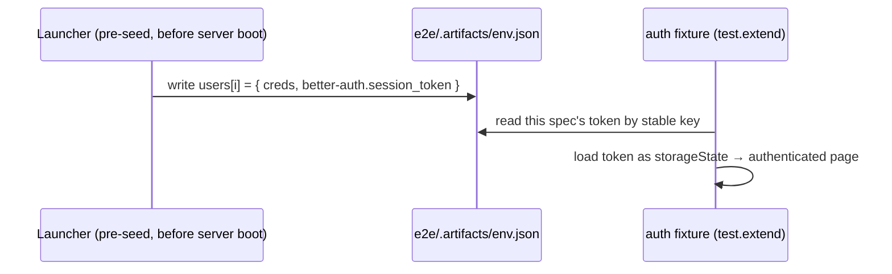

# Playwright E2E Test Suite - Plan

## Goal Capsule

- **Objective:** Stand up a Playwright end-to-end suite, backed by an ephemeral Testcontainers Postgres, covering the inventory UI flows a recent UX pass reworked — so those behaviors stop being protected by manual verification alone.
- **Product authority:** GitHub issue #6 is the origin for the test matrix and the discovered gotchas. This plan preserves that scope and defines the implementation.
- **Execution profile:** Deep — cross-cutting test infrastructure (Testcontainers lifecycle, Better Auth session handling, CI) plus five spec files. Ten dependency-ordered units across three phases.
- **Open blockers:** None. Docker-on-CI is assumed (GitHub-hosted `ubuntu-latest` ships a Docker daemon) rather than confirmed on a runner; the CI unit surfaces it.
- **Product Contract preservation:** Product Contract unchanged — R1–R10 preserved verbatim. The harness *mechanism* is refined in the Planning Contract (KTD1–KTD3) to correct a Playwright ordering constraint the issue's prose missed, without altering any requirement's intent.

---

## Product Contract

### Summary

Deliver a Testcontainers-backed Playwright suite that provisions an isolated Postgres, boots the app, and asserts the inventory surface's auth, onboarding, controls-gating, CRUD-with-feedback, accessible delete, and theme behaviors. The full case matrix ships in one pass with a `bun run test:e2e` entrypoint wired into CI.

### Problem Frame

The app has no end-to-end coverage today. There are 21 Bun unit/integration tests under `src/**/__tests__`, but nothing drives the real UI. A recent design/UX pass added behaviors that break silently under manual-only checking: completion toasts, the armed-gauge row flash, an accessible delete confirmation replacing native `confirm()`, cold-start onboarding, controls-gating on empty inventory, and a three-way theme toggle. Each is currently one refactor away from regressing unnoticed.

### Key Decisions

- **Full matrix in one pass.** This deliverable builds both the harness and all listed test cases, matching the issue's acceptance criteria literally — not a walking skeleton with follow-up expansion.
- **CI wiring is in scope.** `test:e2e` is wired into the existing `.github/workflows/ci.yml`, which currently runs only lint / typecheck / build and executes no tests. Docker availability on the runner is treated as a dependency to confirm, not a blocker.
- **Theme coverage is the three-way cycle.** `components/ui/theme-toggle.tsx` cycles light → dark → system → light. The issue's "two-mode toggle" prose is a wording slip; the suite asserts the three-way cycle and the `data-theme` update.

### Requirements

**Harness & isolation**

- R1. `bun run test:e2e` provisions an ephemeral Postgres via Testcontainers, runs Drizzle migrations and the admin seed against it, boots the app under test, runs the suite, and tears the container down — with no dependency on the dev Docker database.
- R2. Each spec authenticates as its own throwaway user through a reusable fixture, so owner-scoped inventory never leaks across specs and the seed admin stays clean.
- R3. Authentication is established without driving the UI login form on every test, and the app under test runs with its origin / base URL aligned to the Playwright `baseURL`.

**Coverage**

- R4. Auth: valid credentials redirect to `/magazines`; invalid credentials show an inline non-revealing error and stay on `/login`.
- R5. Cold-start onboarding and controls-gating behave correctly on an empty account and once inventory exists.
- R6. CRUD actions surface their completion feedback: magazine create / bulk / edit, firearm create, and CSV export each show the expected toast and result.
- R7. Delete uses the accessible confirmation dialog — `role="alertdialog"`, focus on Cancel, Escape cancels and returns focus to the trigger, confirm removes the row with its toast.
- R8. The theme toggle cycles light → dark → system, updates `data-theme`, and raises no console errors.

The granular cases per spec file:

| Spec file | Cases |
|---|---|
| `e2e/auth.spec.ts` | Valid login → `/magazines`; invalid login → inline error, stays on `/login`. |
| `e2e/onboarding.spec.ts` | Empty `/magazines` shows "Set up your inventory" with dual CTA and no filter bar / Export / toolbar Add; "Add a firearm" → `/firearms` cold-start (single CTA); magazine form "Add a firearm first" is a link. |
| `e2e/inventory-crud.spec.ts` | Once a magazine exists, filter bar + Export + toolbar Add appear; filter → 0 results keeps the bar and shows the no-match state; create magazine → row + "Magazine seated"; bulk add N≥2 → N rows + "Seated N magazines" (singularizes to "Seated 1 magazine" for N=1); edit → "Changes saved"; create firearm → row + "Firearm logged"; export → "Inventory exported" + file download. |
| `e2e/delete-dialog.spec.ts` | Delete opens `alertdialog` with focus on Cancel; Escape cancels and returns focus to trigger; confirm removes the row + "… removed" toast + dialog closes. |
| `e2e/theme.spec.ts` | Toggle cycles light → dark → system; `data-theme` updates; no console errors. |

**CI**

- R9. `test:e2e` is wired into `.github/workflows/ci.yml` and runs green there.

**Docs**

- R10. An `e2e/README.md` (or an AGENTS.md note) documents how to run the suite locally and in CI.

### Success Criteria

- The suite is not flaky across **3 consecutive runs**.
- `bun run test:e2e` is the single named entrypoint that provisions the DB, boots the app, and runs the suite.
- The suite runs green both locally and in CI.

### Scope Boundaries

- Wiring the existing 21 Bun unit/integration tests into CI — adjacent and worth doing, but not this issue.
- Parallelization tuning: start `fullyParallel: false` with `workers: 1`; revisit once the suite is stable.
- Surfaces beyond the inventory flows listed above (e.g. account settings, per-item sharing / grants, admin user management, the summary view).
- Visual-regression / screenshot snapshots — this suite is behavioral e2e only.

#### Deferred to Follow-Up Work

- Coverage for the armed-gauge row-flash animation (`useRowFlash`) and reduced-motion handling — the issue lists these as changed behaviors but not as required cases; add once the core matrix is stable.

---

## Planning Contract

### Key Technical Decisions

- KTD1. **A launcher script owns the container, not `globalSetup`.** Playwright starts `webServer` *before* `globalSetup` runs (verified: the runner sequences `createPluginSetupTasks` ahead of `globalSetups`, and Playwright's own tests assert `globalSetup` can already `fetch` the webServer). So the issue's "container in `globalSetup` + `DATABASE_URL` via `webServer.env`" would boot the server before the DB exists. Instead, `webServer.command` is a launcher that starts the Postgres container, migrates, seeds, pre-seeds the test-user pool, writes a resolved-env artifact, then spawns the Next server as a supervised child. The launcher stays alive and traps SIGINT/SIGTERM to call `container.stop()` for prompt graceful teardown — POSIX `exec` would replace the process and discard that handler, so the child is spawned, not exec'd. Guaranteed cleanup is delegated to Testcontainers' **Ryuk reaper**, which stops and removes the container when the launcher process exits (crash, kill, or normal exit). This is the idiomatic Node.js Testcontainers backstop, so no cross-process container handle or manual `docker stop` is needed; `global-teardown.ts` stays a thin safety net and CI must leave `TESTCONTAINERS_RYUK_DISABLED` unset. R1's intent (ephemeral, isolated, torn-down DB) is unchanged.
- KTD2. **Serve a production build on a dedicated test port.** The launcher ensures a `next build` then runs `next start -p 3210`. `BETTER_AUTH_URL=http://localhost:3210` is set to equal the Playwright `baseURL`, or Better Auth rejects requests with 403 "Invalid origin". Port 3210 avoids clashing with dev (`3000`/`3100`). `reuseExistingServer: !process.env.CI`. The launcher generates a random `BETTER_AUTH_SECRET` and the admin credentials at startup and sets them (with `DATABASE_URL` and `BETTER_AUTH_URL`) *before* the migrate/seed steps — `scripts/seed-admin.ts` imports `auth`, which needs the secret at module load. Nothing is hardcoded in source.
- KTD3. **Per-spec users and their sessions are pre-seeded in-process, not minted over HTTP.** Sign-up is disabled (`disableSignUp: true`), so accounts can't self-register. The launcher pre-creates a fixed pool of N users (one per spec) via `auth.api.createUser` — the same trusted server-side call `scripts/seed-admin.ts` already uses on an empty DB — and mints each user's session in-process (server-side `auth.api` sign-in), writing each user's session token into the artifact under a stable key. The per-spec fixture reads its token and loads it as `storageState`. No admin HTTP endpoint, no UI login, and no HTTP sign-in on the fixture path — this removes the two implementation uncertainties the earlier design carried (that an admin create-user endpoint exists, and that `x-forwarded-for` is honored through `toNextJsHandler`). Adding a spec bumps the pool size N.
- KTD4. **Only the auth spec (U4) exercises the live sign-in endpoint.** Because the fixture path no longer signs in over HTTP (KTD3), the DB-stored `/sign-in/email` rate limit (5 / 60s in `auth.ts`) is hit only by U4's UI-driven login cases. U4 keeps its attempts under the cap — the ephemeral DB resets counts per run and `workers: 1` serializes them — so no `x-forwarded-for` rotation is needed anywhere.
- KTD5. **Isolation is owner-scoping, not shared cleanup.** `firearm` and `magazine` are `owner_id`-scoped to the user; a per-spec user therefore sees only its own data. Start `fullyParallel: false`, `workers: 1`; the ephemeral container is dropped wholesale at teardown, so no per-row cleanup is needed.
- KTD6. **Selectors are ARIA/text, never `data-testid`.** The app has zero `data-testid` attributes. Locate via `getByRole` / `getByLabel` / `getByText`. Toasts render inside `<output aria-live="polite">`; assert on the visible message string (e.g. `getByText('Magazine seated')`). The delete dialog buttons are labelled **Cancel** / **Delete**; delete toasts read "Magazine removed" / "Firearm removed".
- KTD7. **Theme assertion tracks the aria-label cycle plus the resolved attribute.** `next-themes` resolves `data-theme` to only `light` or `dark` (never `system`). So the theme spec pins the OS preference with `page.emulateMedia({ colorScheme: 'light' })` for a deterministic start, then asserts the toggle button's `aria-label` advancing Light → Dark → System → Light (via `NEXT`), and that `data-theme` is `light` or `dark` after each click.

### High-Level Technical Design

Harness startup (the `webServer.command` launcher):

```mermaid
sequenceDiagram
  participant PW as Playwright runner
  participant L as Launcher (e2e/start-test-server.ts)
  participant TC as Testcontainers Postgres
  participant APP as next start :3210
  PW->>L: spawn webServer.command
  L->>L: generate BETTER_AUTH_SECRET + admin creds
  L->>TC: new PostgreSqlContainer().start() (Ryuk reaper armed)
  TC-->>L: getConnectionUri()
  L->>L: run src/db/migrate.ts (DATABASE_URL=uri)
  L->>L: run scripts/seed-admin.ts
  L->>L: pre-seed N users + sessions (auth.api); write tokens to env.json
  L->>APP: next build (if needed) then spawn next start -p 3210<br/>env: DATABASE_URL, BETTER_AUTH_URL=:3210, BETTER_AUTH_SECRET
  APP-->>PW: 200/redirect on http://localhost:3210 (readiness)
  PW->>PW: run specs
  PW->>L: SIGTERM at end
  L->>TC: container.stop() (graceful); Ryuk reaps on process exit
```

Per-spec auth fixture (reads a pre-seeded session token; no HTTP sign-in):



### Assumptions

- GitHub-hosted `ubuntu-latest` runners provide a Docker daemon, so Testcontainers and its Ryuk reaper work in CI. A self-hosted runner would need Docker present and `TESTCONTAINERS_RYUK_DISABLED` left unset.
- `auth.api.createUser` works against the container DB from the launcher without an admin session (verified: `scripts/seed-admin.ts` relies on exactly this).
- The launcher can mint a user session in-process with the server-side Better Auth API — e.g. `auth.api.signInEmail` returning a `Set-Cookie` the launcher parses for the token. Confirm the exact `auth.api` call and token extraction against `better-auth ^1.6.22` at implementation.
- The launcher generates a random `BETTER_AUTH_SECRET` and admin credentials at startup; nothing is hardcoded or committed.
- The session cookie name is `better-auth.session_token` (verified in `src/auth/__tests__/gating.test.ts`); the `storageState` cookie must reproduce its attributes (path, `httpOnly`, `sameSite`) or the browser silently drops it and specs land on `/login`.
- CI installs Playwright browsers (`playwright install --with-deps chromium`) and authenticates or caches the Postgres image pull to avoid Docker Hub's unauthenticated rate limit on shared runner IPs.

### Sequencing

Phase A (harness, U1–U3) is prerequisite to everything, with one exception: U4 (the login-form spec) depends on U2 only — it does not use the U3 auth fixture. Phase B specs (U4–U8) are mutually independent and can land in any order once their dependencies exist. U9 (CI) lands after the suite is green locally; U10 (docs) depends only on U3 and can land any time alongside Phase B.

---

## Output Structure

```text
playwright.config.ts
e2e/
  start-test-server.ts     # webServer command: container + migrate + seed + pre-seed pool + next start
  global-teardown.ts       # thin safety net (Ryuk reaps the container on exit)
  fixtures/
    auth.ts                # test.extend: reads a pre-seeded session token -> storageState
  auth.spec.ts
  onboarding.spec.ts
  inventory-crud.spec.ts
  delete-dialog.spec.ts
  theme.spec.ts
  README.md
  .artifacts/              # gitignored: resolved env for the run
```

The per-unit `**Files:**` lists remain authoritative; the implementer may adjust this layout.

---

## Implementation Units

### Phase A — Harness

### U1. E2E tooling and Playwright config

- **Goal:** Install e2e dependencies, add the `test:e2e` entrypoint, and configure Playwright.
- **Requirements:** R1 (scaffolds the entrypoint), enables all.
- **Dependencies:** none.
- **Files:** `package.json` (devDeps `@playwright/test`, `testcontainers`, `@testcontainers/postgresql`; scripts `test:e2e`, `test:e2e:ui`), `playwright.config.ts` (create), `.gitignore` (add `test-results/`, `playwright-report/`, `e2e/.artifacts/`), `biome.json` (exclude `e2e/.artifacts/` and Playwright output from lint/format if needed).
- **Approach:** `baseURL: 'http://localhost:3210'`; `testDir: 'e2e'`; `fullyParallel: false`; `workers: 1`; `reporter: [['list'], ['html', { open: 'never' }]]`; `globalTeardown`; `webServer: { command: 'bun run e2e/start-test-server.ts', url: 'http://localhost:3210', reuseExistingServer: !process.env.CI, timeout: 300_000 }` (the 5-minute budget covers a cold `next build` plus container start on CI); `use: { baseURL, trace: 'on-first-retry' }`. No global `storageState` — the per-spec fixture supplies it.
- **Patterns to follow:** mirror the existing `bun run …` script style in `package.json`.
- **Leak guard:** add a lightweight pre-commit hook (or CI check) that fails if anything under `e2e/.artifacts/` is staged, so resolved credentials can't be committed even if `.gitignore` is bypassed with `git add -f`.
- **Test scenarios:** Test expectation: none — tooling/config unit; validated when U2+ run.
- **Verification:** `bun run test:e2e --list` enumerates the specs without a config error.

### U2. Test-server launcher and container lifecycle

- **Goal:** The `webServer` command that owns the ephemeral Postgres and serves the built app.
- **Requirements:** R1.
- **Dependencies:** U1.
- **Files:** `e2e/start-test-server.ts` (create), `e2e/global-teardown.ts` (create).
- **Approach:** generate a random `BETTER_AUTH_SECRET` and admin credentials, then set `BETTER_AUTH_SECRET`, `BETTER_AUTH_URL=http://localhost:3210`, and `DATABASE_URL` in the process env *before* any step that imports `auth`. Start the DB with the idiomatic `@testcontainers/postgresql` module — `new PostgreSqlContainer('postgres:17').withDatabase('magstacker_test').start()` — and take `DATABASE_URL = container.getConnectionUri()`; the module's built-in wait strategy handles readiness and the Ryuk reaper handles cleanup on process exit. Run migrations (`bun run src/db/migrate.ts`) then the admin seed (`bun run scripts/seed-admin.ts`). Pre-seed the user pool: for each of the N specs, `auth.api.createUser` a user and mint its session in-process, collecting `{ credentials, sessionToken }`. Write `e2e/.artifacts/env.json` — `baseURL` plus `users[]` with each token under a stable key. Ensure a production build (`next build` when `.next` is absent), then **spawn** (not `exec`) `next start -p 3210` as a supervised child so the `SIGINT`/`SIGTERM` trap that calls `container.stop()` survives. `global-teardown.ts` is a thin safety net; Ryuk is the real backstop.
- **Execution note:** prove the harness boots green (smoke) before writing specs.
- **Patterns to follow:** `scripts/seed-admin.ts` (`auth.api.createUser` on an empty DB, `ADMIN_EMAIL`/`ADMIN_PASSWORD`), `src/db/migrate.ts` (`requireDatabaseUrl()` reads `process.env.DATABASE_URL`, migrations at `src/db/migrations`), and the idiomatic `@testcontainers/postgresql` module (built-in wait, `getConnectionUri()`, Ryuk cleanup).
- **Test scenarios:**
  - Happy path: the launcher brings the container up, migrations apply, the admin and the N-user pool are seeded, and the server answers on `http://localhost:3210` within the timeout; a smoke spec asserts an unauthenticated `/magazines` redirects to `/login`.
  - Failure path: a migration or pre-seed failure exits non-zero and the server never binds the port (Playwright reports webServer startup failure, not a hung run).
  - Covers R1.
- **Verification:** running any spec starts exactly one container; Ryuk removes it after the run (`docker ps` clean).

### U3. Per-spec auth fixture

- **Goal:** A `test.extend` fixture that yields a page authenticated as this spec's pre-seeded user.
- **Requirements:** R2, R3.
- **Dependencies:** U2.
- **Files:** `e2e/fixtures/auth.ts` (create).
- **Approach:** read `e2e/.artifacts/env.json` and select this spec's entry from `users[]` by a stable key (spec filename or index). Construct `storageState` from the pre-seeded `better-auth.session_token` — reproducing the cookie's name, `domain` (`localhost`), `path` (`/`), `httpOnly`, and `sameSite` attributes so the browser keeps it — and expose an authenticated `page`. No HTTP sign-in and no admin calls on this path. A distinct per-spec user gives owner-scoped isolation (R2); `BETTER_AUTH_URL == baseURL` keeps the session valid against the origin check (R3).
- **Patterns to follow:** `src/auth/__tests__/gating.test.ts` — the `better-auth.session_token` cookie name and shape.
- **Test scenarios:**
  - The fixture yields a `page` where `/magazines` renders the authenticated shell (no redirect to `/login`).
  - Two specs' fixtures see disjoint inventory (no cross-user leakage).
  - Covers R2, R3.
- **Verification:** a fixture self-check spec loads the pre-seeded token and lands on `/magazines`.

### Phase B — Coverage specs

### U4. Auth spec

- **Goal:** Cover the login form itself (the one flow that must not use the auth fixture).
- **Requirements:** R4.
- **Dependencies:** U2 (needs the seeded admin), not U3.
- **Files:** `e2e/auth.spec.ts` (create).
- **Approach:** valid login drives `getByLabel('Email')` / `getByLabel('Password')` / `getByRole('button', { name: 'Sign in' })` → `expect(page).toHaveURL(/\/magazines/)`. Invalid login → `getByRole('alert')` reads "Incorrect email or password." and the URL stays `/login`. Keep total sign-in attempts under 5 within the spec (the UI form can't rotate `x-forwarded-for`; the ephemeral DB resets the limiter per run, and `workers: 1` serializes attempts).
- **Patterns to follow:** `app/(auth)/login/login-form.tsx` error strings; redirect default `/magazines`.
- **Test scenarios:**
  - Valid credentials → redirected to `/magazines`; authenticated shell visible.
  - Wrong password → `role="alert"` "Incorrect email or password.", still on `/login`, inputs `aria-invalid`.
  - Covers R4.
- **Verification:** both cases pass; no 429.

### U5. Onboarding cold-start spec

- **Goal:** Cover the empty-account onboarding and firearms cold-start.
- **Requirements:** R5.
- **Dependencies:** U3.
- **Files:** `e2e/onboarding.spec.ts` (create).
- **Approach:** on a fresh user, `/magazines` shows the heading "Set up your inventory" and buttons "Add a firearm" / "Start with a magazine"; assert the filter bar (`getByLabel(/Search brand \/ model/)`), "Export CSV", and toolbar "Add magazine" are absent. "Add a firearm" → `/firearms` showing "No firearms yet" + "Add your first firearm", with no "Add firearm" toolbar button. Open the magazine form via "Start with a magazine" and assert the "Add a firearm" link (`getByRole('link')`) targets `/firearms` with the trailing text "first to link compatibility."
- **Patterns to follow:** `app/(app)/magazines/magazines-view.tsx`, `app/(app)/firearms/firearms-view.tsx`, `app/(app)/magazines/page.tsx` (`showControls = items.length > 0 || filtered`).
- **Test scenarios:** empty-magazines heading; both CTAs visible; filter bar absent; Export absent; toolbar Add absent; "Add a firearm" navigates to `/firearms`; firearms cold-start single CTA; no firearms header add button; magazine-form firearm hint is a link to `/firearms`. Covers R5.
- **Verification:** all assertions pass on a fresh user.

### U6. Inventory CRUD, feedback, and controls-gating spec

- **Goal:** Cover controls-gating once inventory exists, plus CRUD with toast feedback and CSV export.
- **Requirements:** R5, R6.
- **Dependencies:** U3.
- **Files:** `e2e/inventory-crud.spec.ts` (create).
- **Approach:** seed a firearm through the UI first (compat needs one). Controls-gating: after creating a magazine, the filter bar, "Export CSV", and toolbar "Add magazine" appear; applying a filter that matches nothing keeps the filter bar and shows the no-match empty state. CRUD + feedback: create magazine → new row + `getByText('Magazine seated')`; bulk add 3 → 3 rows + "Seated 3 magazines" (exercise with N≥2 — the toast singularizes to "Seated 1 magazine" for N=1); edit → "Changes saved"; create firearm → row + "Firearm logged"; export → `page.waitForEvent('download')` on clicking "Export CSV", filename `magstacker-inventory.csv`, + "Inventory exported" toast.
- **Patterns to follow:** toast strings in `magazine-form.tsx`, `firearm-form.tsx`, `export-button.tsx`; the `<output aria-live="polite">` toast region in `components/ui/toast.tsx`.
- **Test scenarios:** controls appear once a magazine exists; filter → 0 results keeps the bar + no-match state; create → row + "Magazine seated"; bulk (N≥2) → N rows + "Seated N magazines"; edit → "Changes saved"; firearm create → row + "Firearm logged"; export → download event with `magstacker-inventory.csv` + "Inventory exported". Covers R5, R6.
- **Verification:** all cases pass; the download event fires with the correct filename.

### U7. Delete confirmation dialog spec

- **Goal:** Cover the accessibility-critical delete confirmation.
- **Requirements:** R7.
- **Dependencies:** U3.
- **Files:** `e2e/delete-dialog.spec.ts` (create).
- **Approach:** seed a magazine, trigger delete → `getByRole('alertdialog')` visible; the "Cancel" button is focused on open (`toBeFocused`); pressing Escape closes the dialog and returns focus to the trigger; reopening and clicking "Delete" removes the row + shows `getByText('Magazine removed')` + closes the dialog.
- **Patterns to follow:** `components/ui/confirm-dialog.tsx` (role, `cancelRef` focus, Escape handler, `restoreRef` focus-return), delete toast in `hooks/use-delete-confirmation.ts`.
- **Test scenarios:** delete opens `role="alertdialog"` (not native `confirm`); Cancel is focused on open; Escape cancels and returns focus to the trigger; Delete removes the row + "Magazine removed" toast + dialog closes. Covers R7.
- **Verification:** focus assertions pass; the panel is `role="alertdialog"`.

### U8. Theme toggle spec

- **Goal:** Cover the three-way theme cycle.
- **Requirements:** R8.
- **Dependencies:** U3 (the toggle lives in the authenticated shell).
- **Files:** `e2e/theme.spec.ts` (create).
- **Approach:** attach the `console` error listener in `beforeEach` *before* navigating (so hydration-time errors are caught), and call `page.emulateMedia({ colorScheme: 'light' })` before load so the initial resolved theme is deterministically `light`. Wait for `getByRole('button', { name: /Theme:/ })` (rendered only after mount), then click through the cycle, asserting the button `aria-label` advances Light → Dark → System → Light and that `html[data-theme]` is `light` or `dark` after each click (never `system`). Assert no console errors were captured.
- **Patterns to follow:** `components/ui/theme-toggle.tsx` (`NEXT`/`LABEL` maps, `aria-label`), `components/theme-provider.tsx` (`attribute="data-theme"`, `themes={["light","dark"]}`).
- **Test scenarios:** toggle cycles the `aria-label` through the three states; `data-theme` is `light|dark` after each click; no console errors during cycling. Covers R8.
- **Verification:** passes; the console-error listener is empty.

### Phase C — Integration

### U9. CI wiring

- **Goal:** Run the suite green in CI.
- **Requirements:** R9.
- **Dependencies:** U4–U8 green locally.
- **Files:** `.github/workflows/ci.yml` (modify).
- **Approach:** add an `e2e` job on `ubuntu-latest` (Docker daemon present for Testcontainers): `jdx/mise-action` setup, `bun install --frozen-lockfile`, `bunx playwright install --with-deps chromium`, a `docker login` step (Docker Hub token secret) or a cached `docker pull postgres:17` to avoid the unauthenticated pull limit on shared runner IPs, an explicit `bun run build` (so the launcher finds `.next` and skips the cold build inside the webServer timeout), then `bun run test:e2e` (CI=true → `reuseExistingServer: false`). Upload the `playwright-report/` artifact on failure. Keep it a separate job alongside the existing `ci` job.
- **Patterns to follow:** the existing `.github/workflows/ci.yml` job (pinned action SHAs, mise + `bun install --frozen-lockfile`).
- **Test scenarios:** Test expectation: none — CI configuration; validated by the workflow running green on the PR.
- **Verification:** the PR's `e2e` job is green; the report artifact uploads on failure.

### U10. Docs

- **Goal:** Document running the suite.
- **Requirements:** R10.
- **Dependencies:** U3 (all local run commands are known once the fixture exists); can land alongside Phase B, with the CI job name updated during U9 if it differs.
- **Files:** `e2e/README.md` (create); optional one-line pointer in `AGENTS.md`.
- **Approach:** document `bun run test:e2e`, the Docker prerequisite (Testcontainers needs a running Docker daemon), how the harness works (ephemeral container, per-spec users, port 3210), the required env, and the CI job.
- **Test scenarios:** Test expectation: none — documentation.
- **Verification:** `e2e/README.md` is present and accurate.

---

## Verification Contract

| Gate | Command / signal | Applies to |
|---|---|---|
| Suite green locally | `bun run test:e2e` (Docker running) | U2–U8 |
| Non-flaky | 3 consecutive `bun run test:e2e` runs all green | all |
| No leaked containers | `docker ps` clean after a run | U2 |
| Lint / format | `bun run lint` (Biome) clean on new files | all |
| Type-check | `bun run typecheck` clean | all |
| CI green | the `e2e` job on the PR passes | U9 |

---

## Definition of Done

- R1–R10 satisfied; every case in the coverage matrix implemented and green.
- The suite passes 3 consecutive runs with no flake.
- `bun run test:e2e` provisions the container, boots the app, runs the suite, and tears the container down.
- `test:e2e` is wired into `.github/workflows/ci.yml` and green.
- `e2e/README.md` documents running the suite locally and in CI.
- `bun run lint` and `bun run typecheck` pass on the new files.

---

## Sources & Research

- GitHub issue #6 — origin for the test matrix and the manual-verification gotchas.
- Verified repo seams: `auth.ts` (rate limit `/sign-in/email` 5/60, `disableSignUp`, `admin` plugin), `src/auth/__tests__/gating.test.ts` (`better-auth.session_token` cookie shape, `POST /api/auth/sign-in/email`), `scripts/seed-admin.ts` (server-side `auth.api.createUser` on an empty DB — the pre-seed pattern), `src/db/migrate.ts` + `src/db/env.ts` (`requireDatabaseUrl`, migrations at `src/db/migrations`), `src/db/inventory-schema.ts` (`owner_id`-scoped `firearm`/`magazine`), `app/api/export/route.ts` (`GET /api/export`, CSV download).
- Verified UI selectors: `app/(auth)/login/login-form.tsx`, `app/(app)/magazines/*` (`magazines-view.tsx`, `magazine-form.tsx`, `filter-bar.tsx`, `export-button.tsx`, `page.tsx`), `app/(app)/firearms/firearms-view.tsx`, `components/ui/confirm-dialog.tsx`, `components/ui/toast.tsx`, `components/ui/theme-toggle.tsx`, `components/theme-provider.tsx` — no `data-testid` anywhere.
- API shapes (Context7): idiomatic `@testcontainers/postgresql` — `new PostgreSqlContainer().withDatabase().start()` → `getConnectionUri()` → `stop()`, with built-in wait strategy and the Ryuk reaper for cleanup on process exit (drives the KTD1 teardown); Playwright `webServer` starts before `globalSetup` (drives the launcher-owns-container decision), `storageState`, `test.extend` fixtures.
