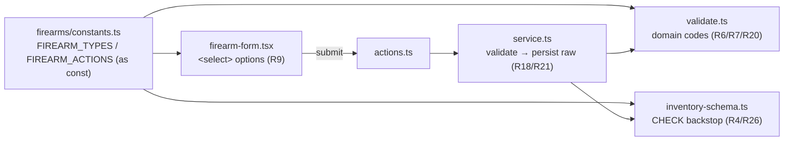

# Firearms Taxonomy - Plan

## Goal Capsule

- **Objective:** Add a controlled `type` / `action` classification plus a free-text `subtype` to each firearm so owners can group, filter, and report on their collection consistently instead of relying on free text.
- **Product authority:** The firearm owner (owner-scoped inventory). Origin: GitHub issue #17.
- **Open blockers:** None. Ready for planning.

---

## Product Contract

### Summary

Classify each `firearm` with a controlled `type` and `action`, plus an optional free-text `subtype`, both required on every write and backfilled to `unspecified` for existing rows. Surface the categories on the firearm list and let owners filter the list by `type`. `caliber` stays free text.

### Problem Frame

Today a `firearm` records only free-text `caliber` and `manufacturer` with no classification. Owners can't group or filter their collection by category, and inconsistent free-text values fragment the data. The pain is organizational: as a collection grows, "show me my pistols" or "show me my bolt guns" is impossible, and rollups per owner are noisy. A small, controlled taxonomy fixes the grouping and consistency problem directly, and incidentally lays groundwork for later platform-aware features — but consistency and organization are the reason to build it now, not the downstream features.

### Key Decisions

- **Fixed, code-defined category sets — no user-defined categories.** The allowed `type`/`action` values are a controlled set enforced in the domain layer with a DB constraint as backstop (mirroring the existing magazine/grant check-constraint pattern). The lists evolve through migrations, not a UI. Rationale: the driver is consistency, and user-editable category lists would re-introduce the fragmentation the taxonomy exists to remove. A lookup table is deferred until a real need for user-defined categories appears (KISS/YAGNI).
- **`action` models the operating mechanism only.** Trigger / fire-control details (striker-fired, DA/SA, SAO) do **not** live in `action` — they go in free-text `subtype` when the owner cares. This keeps `action` orthogonal to `type` and avoids the "a Glock is both semi-auto and striker" collision that a single flat mixed list forces.
- **`type` and `action` are required on every write (create and edit); existing rows backfill to `unspecified`.** `unspecified` is a valid *stored* value so backfilled rows pass the DB constraint, but the domain layer rejects `unspecified` (and empty) on write, forcing a real selection. This means editing any legacy firearm forces classifying it at that moment — an accepted, deliberate forced-cleanup behavior that serves the consistency goal.
- **Lean three-field spine only (`type`, `action`, `subtype`).** The broader forensic classification axes (bore, loading mechanism, use) are rejected as controlled fields: each extra controlled axis would sit at `unspecified` on most rows, which works *against* the consistency goal. `subtype` absorbs any edge classification ad hoc.
- **`subtype` is free text (empty-not-null, R18) with datalist suggestions**, reusing the same UX as the existing `caliber` / `manufacturer` inputs.

### Requirements

**Data model**

- R1. Each `firearm` carries a `type` drawn from the controlled set: `pistol`, `revolver`, `rifle`, `shotgun`, `pcc`, `other`, `unspecified`.
- R2. Each `firearm` carries an `action` drawn from the controlled set: `semi-auto`, `bolt`, `lever`, `pump`, `break`, `single-shot`, `unspecified`.
- R3. Each `firearm` carries an optional `subtype` free-text field (empty-not-null default `''`, per R18).
- R4. The database enforces the allowed `type` and `action` sets as a backstop (check-constraint style, matching the magazine/grant precedent); domain validation is the primary enforcement surface.
- R5. `caliber` remains free text and unchanged.

**Validation**

- R6. Create and edit reject any `type` or `action` value outside its allowed set.
- R7. Create and edit reject `unspecified` (and empty) for `type` and `action` — a real category must be chosen on every write, including when editing a previously-backfilled row.
- R8. Validation returns all failing codes together (R20 convention) with a clear, field-specific message for each.

**UI and filtering**

- R9. The firearm create/edit form exposes `type` and `action` selectors (ARIA-labeled by accessible name, no `data-testid`) and a `subtype` free-text input with suggestions.
- R10. The firearm row and/or detail view shows the firearm's `type` (and `action` where layout allows).
- R11. The inventory list can be filtered by `type`.

**Migration and backfill**

- R12. A migration adds the columns and backfills every existing `firearm` to `type = unspecified`, `action = unspecified`, and `subtype = ''`, leaving no row invalid under the new constraints.
- R13. All classification stays owner-scoped with no cross-owner leakage (unchanged invariant).

**Testing**

- R14. Integration coverage for the new fields: accepted values, rejected out-of-set values, required-on-write (including edit of a backfilled row), and post-backfill validity. Testcontainers-backed.
- R15. E2E coverage for the taxonomy selectors on the form and for filtering the list by `type`. Testcontainers-backed per the e2e harness.

### Acceptance Examples

- AE1. Covers R7.
  - **Given** a legacy firearm with `type = unspecified` (backfilled),
  - **When** the owner opens the edit form and saves without choosing a real `type`,
  - **Then** the save is rejected with a message prompting a `type` selection, and nothing persists.
- AE2. Covers R7.
  - **Given** the create form with no `type`/`action` chosen,
  - **When** the owner submits,
  - **Then** the submit is rejected before persistence with per-field messages.
- AE3. Covers R6.
  - **Given** a submission carrying a `type` or `action` value outside the allowed set (e.g. via a crafted request),
  - **When** it reaches the domain and DB layers,
  - **Then** both reject it.
- AE4. Covers R11, R13.
  - **Given** an owner with firearms of mixed types,
  - **When** they filter the list by `type = pistol`,
  - **Then** only their own pistols are shown (owner-scoped).
- AE5. Covers R12.
  - **Given** existing firearms created before this feature,
  - **When** the migration runs,
  - **Then** every row has `type = unspecified`, `action = unspecified`, `subtype = ''`, and passes the new DB constraints.

### Scope Boundaries

**Deferred for later**

- Caliber normalization / a caliber taxonomy — `caliber` stays free text.
- Filtering by `action` or `subtype` — v1 filters by `type` only; an `action` filter is a cheap follow-up on the same mechanism.
- Magazine-compatibility-by-platform and other downstream uses — the taxonomy is a foundation for them but none are built here.

**Outside this feature's identity**

- Additional controlled classification axes (bore, loading mechanism, use) and NFA-style categories (SBR, AOW, suppressor) — not modeled as controlled fields; `subtype`/`notes` cover them ad hoc.
- User-defined / UI-editable category lists — lists evolve in code via migration, not through the UI.

### Outstanding Questions

**Deferred to Planning**

- Whether to introduce a reusable select component or use a styled native `<select>` (the form currently uses `Input`/`datalist` only).
- Exact placement and interaction of the `type` filter control on the list (no filtering UI exists yet).
- Whether `subtype` suggestions are sourced from existing values per owner (like `caliber`/`manufacturer`) or a static seed list.

### Sources / Research

- `src/db/inventory-schema.ts` (`firearm` table) — current shape: free-text `caliber`/`manufacturer`, no classification columns.
- `src/db/inventory-schema.ts` (`magazine` capacity checks; `grant` `parent_type`/`permission` checks) — the check-constraint backstop pattern (R26) to mirror for `type`/`action`.
- `src/db/inventory-schema.ts` header note — empty-not-null rule (R18) governing `subtype`.
- `src/domain/firearms/validate.ts` — pure validator returning all codes (R20); extend with taxonomy codes.
- `app/(app)/firearms/firearm-form.tsx` — form using the `datalist` suggestion pattern for `caliber`/`manufacturer`; reuse for `subtype`, add `type`/`action` selectors.
- `app/(app)/firearms/firearms-view.tsx` — list table; no filtering exists yet, so the `type` filter is net-new UI.
- Value sets (`type`, `action`) and the required-on-write + `unspecified` backfill behavior were confirmed with the owner during brainstorm dialogue.
- Codebase patterns confirmed during planning:
  - `src/domain/magazines/constants.ts` — `as const` value/regex constants shared by validator, messages, and form. Pattern to mirror for the taxonomy value sets.
  - `src/db/inventory-schema.ts` (`grant_parent_type_valid`, `grant_permission_valid`) — `check("name", sql\`${t.col} in ('a','b')\`)` idiom for the `type`/`action` backstops (R4/R26).
  - `src/domain/reference/reference.ts` (`distinctCalibers`, `calibersForInput`, `calibersForFilter`) — per-owner distinct-value pattern; `distinctSubtypes` mirrors it for subtype suggestions (R9), and the filter-path split (`*ForFilter`) informs the type filter source (R11).
  - `src/domain/firearms/validate.ts` / `service.ts` — pure validator returning all codes (R20), service persists raw values (R18/R19) and calls the validator before any write (R21).
  - `app/(app)/firearms/firearm-form.tsx` / `firearms-view.tsx` / `page.tsx` — `Input`/`datalist` form (no `<select>` component exists), `DataTable` list, server-side data fetch wiring.

---

## Planning Contract

**Product Contract preservation:** Product Contract unchanged. Planning enriches this artifact in place (HOW), preserving the Goal Capsule, Summary, Problem Frame, Key Decisions, R1–R15, and AE1–AE5 above.

### Key Technical Decisions

- **KTD-A — Value sets live in one `as const` module.** `src/domain/firearms/constants.ts` exports `FIREARM_TYPES` and `FIREARM_ACTIONS` (readonly tuples including the `unspecified` sentinel), their derived string-literal union types, and a helper that decides whether a value is a *real* (non-`unspecified`, in-set) selection. This single module feeds the domain validator, the DB check constraint expression, and the form option lists — no value set is duplicated. Mirrors `src/domain/magazines/constants.ts`. Rationale: satisfies R1/R2 and prevents the three enforcement surfaces (domain, DB, UI) from drifting.
- **KTD-B — Backfill rides the `ADD COLUMN` default; no separate backfill script.** The migration adds `type`/`action` as `text NOT NULL DEFAULT 'unspecified'` and `subtype` as `text NOT NULL DEFAULT ''`. Postgres populates existing rows with the column default at `ADD COLUMN` time, so R12 is satisfied by the column definition itself. Check constraints (R4) are added in the same migration. Generated with `bun run db:generate`, applied with `bun run db:migrate`. Rationale: KISS — the default *is* the backfill, and every existing row lands on the valid stored sentinel `unspecified`.
- **KTD-C — Four validation codes; all-codes-together.** `validateFirearm` gains `invalidType` / `invalidAction` (value outside the allowed set, R6 — reachable only via a crafted request) and `typeRequired` / `actionRequired` (value is the `unspecified` sentinel, R7). An empty or typo'd value falls into `invalid*`. Codes accumulate with the existing `emptyName` / `emptyCaliber` and return together (R20). Rationale: keeps R6 (out-of-set) and R7 (must-choose) as distinct, separately-messaged failures.
- **KTD-D — Native `<select>` for `type`/`action`; `<datalist>` for `subtype`.** No reusable select component exists (the form uses `Input`/`datalist` only). Use styled native `<select>` elements labeled via the existing `Field`/`controlId` pattern (ARIA by accessible name, no `data-testid`, R9); `subtype` reuses the caliber `datalist` UX. Resolves Outstanding Question 1. Rationale: YAGNI — a shared select abstraction is not yet earned.
- **KTD-E — Type filter is client-side over the already-loaded list.** `listFirearms` already returns the full owner-scoped visible set; the filter is a client-side control in `firearms-view.tsx` over that in-memory array. Owner-scoping (AE4/R13) is therefore inherent — no query change, no cross-owner surface. Resolves Outstanding Question 2. Rationale: KISS; the list is small and already fully materialized.
- **KTD-F — Subtype suggestions are per-owner distinct in-use values.** Add `distinctSubtypes(db, userId)` to `reference.ts`, mirroring `distinctCalibers`; there is no curated seed list for subtype, so the suggestion source is only what the owner has already typed. Resolves Outstanding Question 3. Rationale: consistency with the caliber/manufacturer suggestion model without inventing a static taxonomy the brainstorm explicitly rejected.

### High-Level Technical Design

The value set is defined once and fans out to three enforcement/consumption surfaces; the request flows through the same validator on the server that the form runs on the client.

Directional guidance for reviewers — the prose above and the unit definitions below are authoritative where they disagree.

---

## Implementation Units

Units are dependency-ordered. Data-model foundation (U1–U2) precedes enforcement (U3–U4), which precedes UI (U5–U6), which precedes end-to-end proof (U7).

### U1. Taxonomy value-set constants

- **Goal:** Establish the single source of truth for the `type` and `action` value sets and the "is this a real selection" predicate.
- **Requirements:** R1, R2 (advances R4, R6, R7, R9).
- **Dependencies:** none.
- **Files:** `src/domain/firearms/constants.ts` (new); `src/domain/firearms/__tests__/constants.test.ts` (new).
- **Approach:** Export `FIREARM_TYPES = ['pistol','revolver','rifle','shotgun','pcc','other','unspecified'] as const` and `FIREARM_ACTIONS = ['semi-auto','bolt','lever','pump','break','single-shot','unspecified'] as const`, plus derived union types (`FirearmType`, `FirearmAction`) and `Set`-backed membership helpers. Add `UNSPECIFIED = 'unspecified'` and predicates `isRealFirearmType` / `isRealFirearmAction` (in-set AND not `unspecified`). Include a display-label map covering every value in both sets, including the sentinel: `semi-auto` → "Semi-automatic", `pcc` → "PCC", and `unspecified` → "Unspecified" (so the list column and filter render a friendly label for backfilled rows, not the raw slug).
- **Patterns to follow:** `src/domain/magazines/constants.ts` (as-const + derived helpers).
- **Test scenarios:**
  - Membership helper returns true for each in-set value and false for an unknown slug.
  - `isRealFirearmType('unspecified')` is false; `isRealFirearmType('pistol')` is true; `isRealFirearmType('')` is false.
  - Same three cases for `isRealFirearmAction`.
  - The display-label map returns a presentation label for every `type` and `action` value, including `unspecified` → "Unspecified".
- **Verification:** `bun test src/domain/firearms/__tests__/constants.test.ts` green; `bun run typecheck` clean.

### U2. Schema columns, check constraints, and migration

- **Goal:** Add `type`, `action`, `subtype` columns with the DB backstop and backfill existing rows.
- **Requirements:** R1, R2, R3, R4, R5 (unchanged), R12.
- **Dependencies:** U1 (value sets referenced by the check expressions).
- **Files:** `src/db/inventory-schema.ts` (modify `firearm` table); `src/db/migrations/` (generated SQL + `meta` snapshot via `bun run db:generate`).
- **Approach:** Add to the `firearm` table: `type: text("type").notNull().default("unspecified")`, `action: text("action").notNull().default("unspecified")`, `subtype: text("subtype").notNull().default("")`. Add two check constraints in the table's callback, building the `in (...)` list from `FIREARM_TYPES` / `FIREARM_ACTIONS` (name them `firearm_type_valid`, `firearm_action_valid`), mirroring `grant_parent_type_valid`. Run `bun run db:generate` to emit the migration; confirm the generated `ADD COLUMN ... DEFAULT ... NOT NULL` backfills existing rows and the `ADD CONSTRAINT ... CHECK` clauses are present. Do not hand-edit the generated SQL beyond what drizzle-kit produces.
- **Execution note:** After generating, inspect the migration SQL to confirm the defaults and both check constraints landed before moving on. The backfill *outcome* (R12 — legacy rows read back `unspecified`/`''` and satisfy the new constraints) is exercised by U4's integration test, which inserts a row using the column defaults as a proxy for a pre-column row (the Testcontainers harness always migrates a fresh DB, so it cannot replay an ADD COLUMN against pre-existing rows); the migration is applied end-to-end by `bun run db:migrate` in the Verification Contract.
- **Patterns to follow:** `magazine`/`grant` check-constraint blocks in `src/db/inventory-schema.ts`; header comment's R18 empty-not-null rule for `subtype`.
- **Test scenarios:** `Test expectation: none` — schema/migration scaffolding; behavior is proven by U4's integration tests (backfill validity, constraint rejection).
- **Verification:** `bun run db:generate` produces exactly one new migration touching only the `firearm` table; `bun run db:migrate` applies cleanly against a Testcontainers Postgres; `bun run typecheck` clean.

### U3. Domain validation and user-facing messages

- **Goal:** Reject out-of-set and `unspecified` `type`/`action` on every write, with clear per-field messages.
- **Requirements:** R6, R7, R8 (R20 convention).
- **Dependencies:** U1.
- **Files:** `src/domain/firearms/validate.ts` (modify); `src/domain/validation-messages.ts` (modify); `src/domain/firearms/__tests__/validate.test.ts` (modify).
- **Approach:** Extend `FirearmValidationCode` with `invalidType | invalidAction | typeRequired | actionRequired`. Add `type: string` and `action: string` to `FirearmInput`. In `validateFirearm`, after the existing checks: if `type` not in `FIREARM_TYPES` → `invalidType`, else if `type === UNSPECIFIED` → `typeRequired`; same for `action`. Preserve all-codes-together accumulation (R20). Add message strings: `invalidType`/`invalidAction` → "Select a valid firearm type/action", `typeRequired`/`actionRequired` → "Choose a firearm type/action".
- **Patterns to follow:** existing `validateFirearm` accumulation; `src/domain/validation-messages.ts` map.
- **Test scenarios:**
  - `Covers AE2.` Missing selection (`type: 'unspecified'`, `action: 'unspecified'`) with valid name/caliber → `['typeRequired','actionRequired']`, nothing else.
  - `Covers AE3.` Out-of-set value (`type: 'blaster'`) → includes `invalidType`.
  - Valid real selections (`type: 'pistol'`, `action: 'semi-auto'`) plus empty name/caliber → returns only `['emptyName','emptyCaliber']` (taxonomy adds no codes).
  - All-fields-invalid input returns every applicable code together, not first-only (R20).
  - `messageForCode` returns a non-default string for each of the four new codes.
- **Existing-test migration:** `FirearmInput` now requires `type`/`action`, so the pre-existing `validate.test.ts` call sites (e.g. `validateFirearm({ name, caliber })`) must add real `type`/`action` to keep typechecking and to isolate the code they assert; their expected code lists are otherwise unaffected.
- **Verification:** `bun test src/domain/firearms/__tests__/validate.test.ts` green.

### U4. Service persistence and input types

- **Goal:** Carry `type`/`action`/`subtype` through create/update, persisting raw values after validation.
- **Requirements:** R3, R6, R7, R12, R13 (unchanged owner-scoping).
- **Dependencies:** U2, U3.
- **Files:** `src/domain/firearms/service.ts` (modify); `src/domain/firearms/__tests__/service.test.ts` (modify).
- **Approach:** Add `type: string`, `action: string`, `subtype?: string` to `FirearmCreateInput` (subtype optional → empty-not-null). Extend `persistableFields` to include `type: input.type`, `action: input.action`, `subtype: input.subtype ?? ""`. Validation already runs at the top of `createFirearm`/`updateFirearm`, so the new codes gate writes automatically — confirm the validator receives `type`/`action`. `FirearmUpdateInput` keeps omitting `ownerId` only.
- **Execution note:** Integration test-first for the required-on-edit path — it is the subtle behavior (editing a backfilled row must be rejected until reclassified).
- **Patterns to follow:** existing `persistableFields`, `createFirearm`, `updateFirearm`; Testcontainers `live` gate + `factories.ts`.
- **Test scenarios (integration, `DATABASE_URL`-gated / Testcontainers):**
  - `Covers AE2.` `createFirearm` with `type/action = 'unspecified'` throws `ValidationError` and writes no row.
  - Create with real `type`/`action` persists the exact slugs and `subtype` verbatim (raw-value R18/R19); omitted `subtype` persists as `''`.
  - `Covers AE3.` Create with an out-of-set `type` throws `ValidationError` (domain) — and a direct DB insert of an out-of-set value is rejected by the check constraint (backstop R4).
  - `Covers AE5.` A row inserted with the column defaults (simulating a pre-feature/backfilled row) reads back `type='unspecified'`, `action='unspecified'`, `subtype=''` and satisfies the constraints.
  - `Covers AE1.` `updateFirearm` on a backfilled row still carrying `unspecified` throws `ValidationError` (required-on-edit) unless a real value is supplied.
  - Owner-scoping unchanged: a non-owner cannot update another owner's firearm (existing authorize path still holds).
- **Existing-test migration:** pre-existing `service.test.ts` `createFirearm`/`updateFirearm` call sites must pass real `type`/`action`. `src/test-support/factories.ts` `makeFirearm` inserts via `$inferInsert`, which keeps `type`/`action`/`subtype` optional because they have DB defaults, so factory-based callers (auth/visibility/grants/magazines/csv/reference/summary tests) are unaffected.
- **Verification:** `bun test src/domain/firearms/__tests__/service.test.ts` green under Testcontainers.

### U5. Form UI — type/action selects and subtype input

- **Goal:** Let owners choose `type`/`action` and enter a `subtype` on create and edit.
- **Requirements:** R9 (advances R6, R7).
- **Dependencies:** U1, U3, U4. (Shares edits to `app/(app)/firearms/page.tsx` with U6; land U5 before U6 so the extended `FirearmFormValues` shape that U6's `FirearmListItem` inherits already exists.)
- **Files:** `app/(app)/firearms/firearm-form.tsx` (modify); `app/(app)/firearms/page.tsx` (modify — pass `subtypeSuggestions`); `src/domain/reference/reference.ts` (add `distinctSubtypes`); `src/domain/reference/__tests__/*` (add subtype coverage if a reference test file exists, else co-locate).
- **Approach:** Extend `FirearmFormValues` with `type`, `action`, `subtype`; default `EMPTY` to `type: 'unspecified'`, `action: 'unspecified'`, `subtype: ''`. Render two `Field`-wrapped native `<select>` controls populated from `FIREARM_TYPES`/`FIREARM_ACTIONS` (label each option via the display-label map; the `unspecified` option renders as a placeholder-style "Select…" entry). Add a `subtype` `Input` with `list="firearm-subtypes"` and a `<datalist>` fed by a new `subtypeSuggestions` prop. Wire client-side validation to surface the new codes via `firstMessage`. Generalize the current two-way focus branch (`found.includes("emptyName") ? nameId : calId`) into a code→field-id lookup that focuses the first failing field in document order (name → caliber → type → action → subtype), so the new required selects are reachable on submit-fail (R9 accessibility) — six codes can now co-occur. In `page.tsx`, fetch `subtypeSuggestions` with a new `subtypesForInput`/`distinctSubtypes` call in the existing `Promise.all`. Add `distinctSubtypes(db, userId)` to `reference.ts` mirroring `distinctCalibers` (owner-visible distinct non-blank `firearm.subtype`).
- **Patterns to follow:** existing `Field`/`Input`/`datalist` usage in `firearm-form.tsx`; `distinctCalibers` in `reference.ts`; `calibersForInput` wiring in `page.tsx`.
- **Test scenarios:**
  - `distinctSubtypes` returns owner-visible distinct non-blank subtypes, sorted ascending, excluding other owners' values (integration, Testcontainers).
  - `distinctSubtypes` returns `[]` when the owner has no subtypes.
  - Form-level behaviors (select renders all options, missing selection blocks submit) are proven in U7 e2e rather than markup assertions.
- **Verification:** `bun run typecheck` clean; `bun test` green for the reference helper; form behavior covered by U7.

### U6. List Type column and client-side type filter

- **Goal:** Show each firearm's `type` in the list and let owners filter the list by `type`.
- **Requirements:** R10, R11 (AE4, R13 owner-scoping inherent).
- **Dependencies:** U4 (rows now carry `type`), U5 (`FirearmListItem` extends U5's extended `FirearmFormValues`; both units edit `page.tsx`, so U6 lands after U5).
- **Files:** `app/(app)/firearms/firearms-view.tsx` (modify); `app/(app)/firearms/page.tsx` (modify — map `type`/`action`/`subtype` into `FirearmListItem`).
- **Approach:** `FirearmListItem` extends `FirearmFormValues`, so U5's extension already carries `type`/`action`/`subtype` onto the type; map the new fields into the items in `page.tsx`. Add a `Type` column to the `DataTable` rendering the U1 display label (`unspecified` shows as "Unspecified" so backfilled rows read clearly); render an `Action` column too — `DataTable` already wraps in `overflow-x-auto`, so it is always shown rather than gated on a viewport heuristic (R10). Add a labeled filter control (native `<select>`) above the table with an "All types" option plus the types present in the current list (including `unspecified` when present, so unclassified rows stay filterable rather than hidden); filter the rendered rows client-side by matching `type`. When a filter selection matches zero rows, render an inline "No firearms match this filter." message in the table body — distinct from the cold-start `EmptyState`, which stays reserved for the owner having zero firearms (avoids wrongly showing the "Add your first firearm" CTA to an owner who has firearms of other types). Because the list is already the owner's visible set, no query changes and no cross-owner exposure (AE4/R13).
- **Patterns to follow:** existing `DataTable`/`TH`/`TD` usage and the `showSerial` conditional-column pattern in `firearms-view.tsx`; label map from U1.
- **Test scenarios:**
  - `Covers AE4.` Filter behavior (select a type → only matching rows shown; "All" restores) proven in U7 e2e.
  - Zero-match filter shows the inline "no match" message, not the cold-start empty state — proven in U7 e2e.
  - Display-label mapping is unit-covered by U1's display-label test; column rendering is covered by U7.
- **Verification:** `bun run typecheck` clean; visual/behavioral coverage in U7.

### U7. End-to-end coverage

- **Goal:** Prove the taxonomy selectors on the form and the list type-filter end to end.
- **Requirements:** R14 (via U3/U4 integration), R15.
- **Dependencies:** U5, U6.
- **Files:** `e2e/firearm-taxonomy.spec.ts` (new); `e2e/inventory-crud.spec.ts` (modify — its firearm-create step fills only Name/Caliber and asserts the "Firearm logged" toast; with type/action now required it must select a real Type and Action before submitting, or the client blocks the submit and the spec fails).
- **Approach:** Add a Playwright spec following the existing harness (`start-test-server.ts`, Testcontainers-backed, ARIA/accessible-name targeting — no `data-testid`). Sign in via the existing fixture, exercise create-with-classification, edit-forces-classification, and list filtering.
- **Patterns to follow:** `e2e/inventory-crud.spec.ts`, `e2e/magpul-mode.spec.ts`; `e2e/README.md` harness notes.
- **Test scenarios:**
  - `Covers AE2.` Open the new-firearm form, fill name + caliber, leave type/action at the placeholder, submit → per-field validation messages appear and no row is created.
  - Create a firearm with `type = Pistol`, `action = Semi-automatic`, a subtype value → it appears in the list with the Type shown.
  - `Covers AE4.` With firearms of mixed types, select `Pistol` in the type filter → only pistols remain visible; "All types" restores the full list.
  - `Covers AE1.` Edit an existing firearm whose type is unset (placeholder) and attempt to save without choosing → save is blocked with a prompt to choose a type.
  - Filtering to a type with no matching firearms shows the inline "No firearms match this filter." message and does not show the "Add your first firearm" cold-start CTA.
- **Verification:** `bun run test:e2e` passes for `firearm-taxonomy.spec.ts`, and the updated `inventory-crud.spec.ts` still passes (Docker required).

---

## Verification Contract

Gates that must pass before the work is considered complete:

- `bun run lint` (Biome) clean on changed files.
- `bun run typecheck` clean.
- `bun test src` green, including the new/extended `constants`, `validate`, `service`, and `reference` tests (integration tests run against Testcontainers Postgres via the `DATABASE_URL` gate).
- `bun run db:migrate` applies the generated migration cleanly and existing rows read back the `unspecified`/`''` defaults (AE5).
- `bun run test:e2e` passes for `e2e/firearm-taxonomy.spec.ts`.
- Every acceptance example AE1–AE5 is exercised by at least one named test scenario above.

## Definition of Done

- `firearm` rows carry controlled `type`/`action` and free-text `subtype`; existing rows backfilled to `unspecified`/`unspecified`/`''` (R1–R3, R12).
- Domain validation rejects out-of-set and `unspecified` `type`/`action` on create and edit, returning all codes together; DB check constraints backstop it (R4, R6–R8).
- The firearm form exposes type/action selects and a subtype suggestion input; the list shows Type and can be filtered by type, owner-scoped (R9–R11, R13).
- All Verification Contract gates pass; AE1–AE5 covered.
- Product Contract unchanged; scope boundaries (deferred: caliber taxonomy, action/subtype filtering, platform features; outside: extra controlled axes, user-defined categories) respected.
