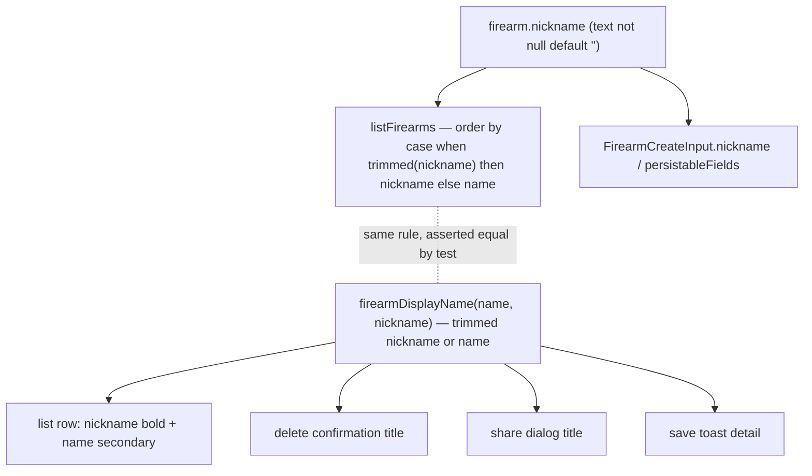

# Firearm Nickname - Plan

## Goal Capsule

- **Objective:** Let a firearm carry an optional owner nickname alongside its existing required product name, and surface the nickname as the primary label wherever the owner sees the firearm named.
- **Product authority:** GitHub issue #18.
- **Product Contract preservation:** unchanged — R1–R8 and the Acceptance Examples carry forward verbatim from the requirements-only artifact; planning added the sections below.
- **Open blockers:** None. Firearm-list search across the two fields is split to issue #32 and is out of scope here.
- **Definition of done:** all of R1–R8 satisfied, `bun run typecheck` / `bun run lint` / `bun test src` / `bun run test:e2e` green, migration applies cleanly on a database with existing firearm rows.

---

## Product Contract

### Summary

Add an optional `nickname` to the firearm record, keeping the existing `name` as the required product/model name. The nickname leads in the list and detail views — product name shown as a quieter secondary line, or alone when no nickname — and the list sorts by whichever label each row shows.

### Problem Frame

A firearm today has a single `name`, which conflates two things owners hold separately: the canonical product/model name used for records, identification, and sharing ("Glock 19 Gen 5"), and the personal nickname an owner actually thinks in ("Nightstand gun"). Storing only one forces the owner to choose, and the record loses whichever the other view needed. The magazine record already learned this lesson — it separates a canonical `brandModel` from a friendly `label` — and the firearm record has not yet followed.

### Key Decisions

- **Additive, not a rename.** Keep `name` as the canonical product name (already `notNull`) and add `nickname`. The migration becomes a pure add-column with a `''` default, existing rows backfill for free with no data movement, and none of the form, view, validation, service, factory, or test call sites that reference `name` have to change. A rename to `productName` is cosmetic and would touch every one of them.
- **Nickname-primary display.** When a nickname exists it is the bold primary label and the product name is the secondary line; with no nickname the product name stands alone. This follows the issue's rationale that owners think in nicknames first, and is chosen over product-primary and over the magazine two-column style.
- **What-you-see-is-what-it-sorts-by.** The list sorts on the primary label each row actually displays, so a nicknamed row sorts by its nickname and an un-nicknamed row by its product name. This interleaves the two underlying fields but keeps visible order matching the read order.
- **Term is `nickname`, not `label`.** The firearm's friendly field is named for its intent rather than reusing magazine's `label`, accepting a small cross-entity naming inconsistency for clarity.

### Requirements

**Data model**

- R1. The firearm record keeps a required product name (the existing `name`, `notNull`) and gains an optional `nickname`, stored empty-not-null with a `''` default per the R18 convention already used for `manufacturer`, `serial_number`, and `notes`.
- R2. A migration adds `nickname` as an add-column with a `''` default; existing rows backfill to an empty nickname with no data movement and remain valid.

**Validation**

- R3. Product name stays required (the existing empty-name check is unchanged); nickname is optional. Trimming is applied only for emptiness checks, and the raw value is what persists, consistent with the existing firearm validation behavior.

**Display**

- R4. The list and detail views show the nickname as the primary label when it is present, with the product name as the secondary line; when the nickname is empty, the product name is the sole primary label.
- R5. The firearm list sorts by the displayed primary label — the nickname when present, otherwise the product name.
- R6. The delete confirmation echoes the target firearm's displayed primary label, matching what R4 renders for that row.

**Forms**

- R7. The create and edit forms expose both fields as distinct inputs, labeled for accessibility (ARIA roles / accessible names, no `data-testid`).

**Coverage**

- R8. Integration and e2e coverage exercise the new field, the nickname-primary display with product-name fallback (R4), the displayed-label sort (R5), and the delete-confirmation label (R6).

### Acceptance Examples

- AE1. Nickname-primary display with fallback. **Covers R4.**
  - **Given** a firearm with product name "Glock 19 Gen 5" and nickname "Nightstand gun", **when** it renders in the list or detail, **then** "Nightstand gun" is the primary label and "Glock 19 Gen 5" is the secondary line.
  - **Given** a firearm with product name "M&P Shield Plus" and an empty nickname, **when** it renders, **then** "M&P Shield Plus" is the sole primary label with no secondary line.
- AE2. Displayed-label sort. **Covers R5.**
  - **Given** firearms displaying "Nightstand gun" (nickname), "Glock 19 Gen 5" (no nickname), and "Old Reliable" (nickname), **when** the list orders them, **then** they sort by those shown labels regardless of which underlying field each came from.
- AE3. Delete confirmation label. **Covers R6.**
  - **Given** a firearm displaying "Nightstand gun", **when** the owner triggers delete, **then** the confirmation names "Nightstand gun".

### Scope Boundaries

- Firearm-list search matching product name and nickname — split to issue #32. No firearm search exists today (an explicit design decision, R51), so it is a net-new capability designed on its own.
- Renaming the `name` column to `productName` — rejected in favor of the additive path (see Key Decisions).
- Extending magazine search to match its `label` — left as an open cross-entity consistency question inside #32, not addressed here.

#### Deferred to Follow-Up Work

- None. The full brainstorm scope is implemented by the units below.

### Dependencies / Assumptions

- The empty-not-null (R18) convention for optional TEXT fields is the storage shape for `nickname`; nicknames are per-record and carry no uniqueness or sharing semantics.
- Issue #32 (firearm-list search) depends on this work, since it matches the `nickname` field introduced here.

---

## Planning Contract

### Key Technical Decisions

- KTD-1. **`nickname text not null default ''` on the `firearm` table.** Mirrors the existing empty-not-null optional fields (`manufacturer`, `subtype`, `serial_number`, `notes`) so the drizzle-kit-generated migration is a plain `ADD COLUMN` that backfills existing rows to `''` with no data step.
- KTD-2. **One display-label helper, reused everywhere the firearm is named.** A pure `firearmDisplayName({ name, nickname })` returns the nickname (raw, verbatim) when it is non-empty after trimming, otherwise the product name. It drives the list-row primary label, the delete confirmation, the share-dialog title, and the save toast, so "nickname wins when present" lives in exactly one place on the client. Pair it with a `hasNickname({ nickname })` = `nickname.trim() !== ""` predicate so the row's secondary line and the primary label always agree on presence.
- KTD-3. **Sort stays server-side in `listFirearms`, expressed to mirror KTD-2's rule.** Change `orderBy(asc(firearm.name))` to order by the displayed label (directional: `case when <nickname is non-empty after a [[:space:]] trim> then nickname else name end`) — sorting by the **raw** nickname when present so the key equals `firearmDisplayName` character-for-character, with the trim used only for the presence test. DB order then matches what the helper displays, including any leading/trailing whitespace and the whitespace-only-nickname fallback. A service test asserts the DB order agrees with `firearmDisplayName`.
- KTD-4. **No validation on `nickname`.** Optional, empty allowed, no length cap — consistent with the other optional text fields, which carry none. `validateFirearm` and its `FirearmInput` type are intentionally untouched; `nickname` rides only on the service's `FirearmCreateInput` and the form's `FirearmFormValues`.
- KTD-5. **"Detail" is the list row plus the inline edit form.** No standalone firearm detail page exists, so R4's nickname-primary display lands in the table row and the edit form gains the nickname input; nothing else needs a "detail" treatment.

### High-Level Technical Design

The change is a single field threaded through the existing firearm slice; no new architecture. The one non-obvious shape is that the "nickname wins when present" rule is expressed twice — once in SQL for ordering, once in TypeScript for display — and a test pins them together.

---

## Implementation Units

### U1. Add the `nickname` column and migration

- **Goal:** The `firearm` table carries `nickname` as empty-not-null, and a generated migration adds it (R1, R2).
- **Requirements:** R1, R2.
- **Dependencies:** none.
- **Files:** `src/db/inventory-schema.ts`, `src/db/migrations/0005_*.sql` (generated), `src/db/migrations/meta/*` (generated).
- **Approach:** Add `nickname: text("nickname").notNull().default("")` to the `firearm` table definition next to the other optional-text fields, then run `bun run db:generate` to emit migration `0005`. Confirm the generated SQL is a single `ALTER TABLE "firearm" ADD COLUMN "nickname" text DEFAULT '' NOT NULL` — no data-movement statements.
- **Patterns to follow:** the `subtype` / `serial_number` / `notes` columns in the same table; migration `0004_strange_old_lace.sql` as the shape of a recent add-column.
- **Execution note:** This is schema + generated migration; prefer a migrate-apply smoke check (`bun run db:migrate` against a database that already has firearm rows) over unit coverage.
- **Test scenarios:** `Test expectation: none -- schema/migration unit; behavior is covered by U3 (persistence + sort) and U6 (e2e). Verify by applying the migration to a seeded DB and confirming existing rows read back with nickname `''`.`
- **Verification:** `bun run db:generate` produces exactly one new migration; `bun run db:migrate` applies cleanly on a DB with pre-existing firearms and those rows now have `nickname = ''`.

### U2. Firearm display-name helper

- **Goal:** A pure helper resolves the primary label from `{ name, nickname }` (R4, foundation for R5/R6).
- **Requirements:** R4.
- **Dependencies:** none.
- **Files:** `src/domain/firearms/display.ts`, `src/domain/firearms/__tests__/display.test.ts`.
- **Approach:** `firearmDisplayName(f: { name: string; nickname: string }): string` returns `f.nickname.trim() !== "" ? f.nickname : f.name`. Return the raw (untrimmed) nickname when non-empty, matching how the record persists values verbatim; only the emptiness check trims. Export a paired `hasNickname(f: { nickname: string }): boolean` = `f.nickname.trim() !== ""` so the row (U5) can gate its secondary line on the exact same presence test.
- **Patterns to follow:** the pure, DB-free style of `src/domain/firearms/validate.ts`.
- **Execution note:** Implement test-first — the three cases below fully specify it.
- **Test scenarios:**
  - `Covers AE1.` nickname present → returns the nickname ("Nightstand gun" for name "Glock 19 Gen 5"); `hasNickname` is `true`.
  - `Covers AE1.` nickname empty (`""`) → returns the product name; `hasNickname` is `false`.
  - whitespace-only nickname (`"   "`) → treated as empty, returns the product name; `hasNickname` is `false`.
- **Verification:** `bun test src/domain/firearms/__tests__/display.test.ts` passes.

### U3. Thread `nickname` through the service and switch the list sort

- **Goal:** Create/update persist `nickname`, and `listFirearms` orders by the displayed label (R3, R5; supports R1).
- **Requirements:** R3, R5.
- **Dependencies:** U1, U2 (the sort-order test asserts the DB order matches `firearmDisplayName`).
- **Files:** `src/domain/firearms/service.ts`, `src/domain/firearms/__tests__/service.test.ts`.
- **Approach:** Add optional `nickname?: string` to `FirearmCreateInput`; in `persistableFields`, set `nickname: input.nickname ?? ""` (empty-not-null). Change `listFirearms`'s `orderBy(asc(firearm.name))` to order by the KTD-3 expression (`case when <trimmed nickname non-empty> then nickname else name end`, sorting by the raw nickname) via a `sql` fragment. Leave `validateFirearm` and `FirearmInput` untouched (KTD-4).
- **Patterns to follow:** the existing `persistableFields` empty-not-null defaults; the `sql`-fragment filter style in `src/domain/magazines/filter.ts`.
- **Execution note:** Start with a failing integration test for the new sort order and nickname persistence (gates on `DATABASE_URL` per the repo's live/skip pattern; Testcontainers-backed).
- **Test scenarios:**
  - create with a nickname → row persists `nickname` verbatim; create without → `nickname` is `''`.
  - update sets `nickname` (add, change, and clear-to-empty round-trips).
  - `Covers AE2.` `listFirearms` returns rows ordered by nickname-or-name: given "Nightstand gun" (nickname on "Glock 19 Gen 5"), "Glock 19 Gen 5" (no nickname), "Old Reliable" (nickname), the order matches `firearmDisplayName` applied to each row.
  - a firearm with a whitespace-only nickname sorts by its product name (parity with U2's fallback).
- **Verification:** `bun test src/domain/firearms` passes with `DATABASE_URL` set; sort assertion agrees with `firearmDisplayName`.

### U4. Nickname field in the create/edit form

- **Goal:** The form captures `nickname` and submits it; the save toast names the firearm by its display label (R7).
- **Requirements:** R7.
- **Dependencies:** U2, U3.
- **Files:** `app/(app)/firearms/firearm-form.tsx`.
- **Approach:** Add `nickname: string` to `FirearmFormValues` and `EMPTY`; render a nickname `Field` + `Input` (labeled "Nickname", ARIA via the existing `Field`/`controlId` pattern, optional hint) near the Name field. `values.nickname` flows to `createFirearmAction`/`updateFirearmAction` unchanged since actions pass the whole values object. Change the success toast `detail` from `values.name` to `firearmDisplayName(values)`.
- **Patterns to follow:** the existing "Name" and optional "Subtype" fields in the same file; `useId` control-id wiring.
- **Execution note:** UI wiring; behavior is proven by U6 e2e rather than a component unit test.
- **Test scenarios:** `Test expectation: none -- form wiring; the create/edit/display path is covered end-to-end in U6.`
- **Verification:** `bun run typecheck` and `bun run lint` pass; the form renders a nickname input and submitting persists it (proven via U6).

### U5. Nickname-primary row display and sort-matching delete label

- **Goal:** The list row shows nickname-primary with product-name fallback, and every place that names a firearm uses the display label (R4, R6).
- **Requirements:** R4, R6.
- **Dependencies:** U2, U4.
- **Files:** `app/(app)/firearms/firearms-view.tsx`, `app/(app)/firearms/page.tsx`.
- **Approach:** In `page.tsx`, add `nickname: f.nickname` to the `FirearmListItem` mapping (the interface already inherits `nickname` from `FirearmFormValues` via U4). In `firearms-view.tsx`, render the Name column as `firearmDisplayName(item)` bold, with the product name (`item.name`) on a secondary line gated on `hasNickname(item)` — the same trimmed presence test the helper uses (U2), so a whitespace-only nickname falls back to the product name as the primary label *without* also rendering it on the secondary line (otherwise the row shows the product name twice). Replace `getName: (item) => item.name`, the `ConfirmDialog` title `del.target?.name`, and `ShareControl`'s `itemName={item.name}` with `firearmDisplayName(item)`. Keep the column header `Name` (it still labels the firearm's identity); a rename to `Firearm` is deferred polish, out of scope here.
- **Patterns to follow:** the existing `useDeleteConfirmation` wiring and the table's current `font-medium` primary-cell styling. Note: magazine's `brandModel`/`label` in `app/(app)/magazines/magazines-view.tsx` are two *separate columns*, not a stacked cell — there is no in-repo precedent for the nickname-over-name single-cell stack, so build it explicitly (a wrapper inside the Name `TD` with the product name on a muted secondary line, e.g. `text-xs text-ink-faint`; long values wrap/truncate consistently with the table's other cells, implementer's judgment).
- **Test scenarios:** `Test expectation: none -- presentation wiring; nickname-primary display, fallback (including a whitespace-only nickname that must render the product name exactly once), and the delete-confirmation label are asserted in U6.`
- **Verification:** `bun run typecheck` / `bun run lint` pass; visually, a nicknamed row shows the nickname bold with the product name beneath, and an un-nicknamed row shows only the product name.

### U6. End-to-end coverage

- **Goal:** Prove the field, display fallback, and delete label end-to-end (R8).
- **Requirements:** R8.
- **Dependencies:** U1, U2, U3, U4, U5.
- **Files:** `e2e/inventory-crud.spec.ts` (extend), and the test factory `src/test-support/factories.ts` if a nickname override helps integration setup.
- **Approach:** Extend the existing firearm CRUD flow: create a firearm with a nickname and assert the row shows the nickname as the primary label with the product name as the secondary text; create one without a nickname and assert only the product name shows; trigger delete on the nicknamed firearm and assert the confirmation dialog names it by nickname. Target elements via ARIA roles / accessible names / visible text (no `data-testid`).
- **Patterns to follow:** `e2e/inventory-crud.spec.ts` and `e2e/firearm-taxonomy.spec.ts` (the taxonomy field's e2e pattern from #31); `e2e/delete-dialog.spec.ts` for the confirm-dialog assertion shape.
- **Execution note:** Docker required; runs under the Testcontainers-backed Playwright harness (`bun run test:e2e`).
- **Test scenarios:**
  - `Covers AE1.` create with nickname → list row shows nickname primary + product-name secondary.
  - `Covers AE1.` create without nickname → list row shows product name only.
  - `Covers AE3.` delete a nicknamed firearm → confirmation dialog names it by nickname.
  - edit an existing firearm to add a nickname → row flips to nickname-primary after save.
  - a firearm whose nickname is whitespace-only renders the product name exactly once (falls back to product-name primary, no duplicated secondary line).
- **Note on sort coverage:** the displayed-label sort (R5/AE2) is verified at the integration layer in U3, not e2e — ordering is a data concern and e2e ordering assertions are brittle. U6 covers the field, display, fallback, and delete label; together U3 + U6 satisfy R8's integration-and-e2e coverage.
- **Verification:** `bun run test:e2e` passes with the new assertions.

---

## Verification Contract

| Gate | Command | Applies to |
|---|---|---|
| Types | `bun run typecheck` | all units |
| Lint/format | `bun run lint` | all units |
| Unit + integration | `bun test src` | U2, U3 (integration gates on `DATABASE_URL`) |
| Migration smoke | `bun run db:migrate` on a DB with existing firearms | U1 |
| End-to-end | `bun run test:e2e` (Docker) | U6 |

---

## Definition of Done

- R1–R2: `firearm.nickname` exists as empty-not-null; migration `0005` applies cleanly and backfills existing rows to `''`.
- R3: nickname optional with no validation; product-name empty check unchanged; raw values persisted.
- R4: list row (and edit-form context) shows nickname-primary with product-name fallback.
- R5: `listFirearms` orders by the displayed label, asserted to agree with `firearmDisplayName`.
- R6: the delete confirmation names the firearm by its display label; the share dialog and save toast reuse the same helper for consistency (R6 itself covers the delete confirmation — the share/toast reuse is a consistency touch, not separately asserted).
- R7: create/edit forms expose an accessible nickname input, no `data-testid`.
- R8: integration + e2e cover the field, display fallback, sort, and delete label.
- `bun run typecheck`, `bun run lint`, `bun test src`, and `bun run test:e2e` all green.

---

## Sources & Research

- Origin: this file's Product Contract (from `ce-brainstorm`, issue #18).
- In-repo precedent for the canonical/friendly split: `src/db/inventory-schema.ts` (`magazine.brandModel` + `magazine.label`), `app/(app)/magazines/magazines-view.tsx` (primary/secondary row treatment).
- Empty-not-null (R18) precedent: `firearm.manufacturer` / `subtype` / `serial_number` / `notes` in `src/db/inventory-schema.ts`.
- No-firearm-search decision (R51) informing the #32 split: `src/domain/magazines/filter.ts`.
- Migration tooling: `drizzle.config.ts`, `src/db/migrations/` (drizzle-kit generate → `bun run db:migrate`).
