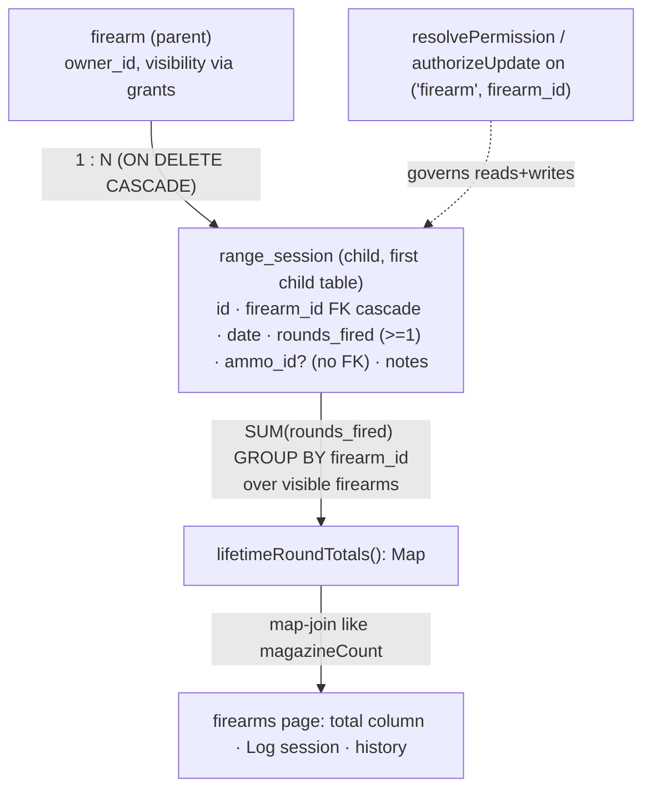

# Shot Count Tracking Per Firearm - Plan

## Goal Capsule

- **Objective:** Let an owner log rounds fired per firearm and see a derived lifetime round total, built as a standalone slice with seams left for later ammo (#7) and service-interval (#10) integration.
- **Product authority:** GitHub issue #11 plus the brainstorm captured in this artifact's Product Contract.
- **Product Contract preservation:** unchanged — R1–R8 preserved verbatim. The two former Deferred-to-Planning questions are resolved in the Planning Contract (KTD4, KTD5); no product scope was rewritten.
- **Stop conditions:** No ammo or service-interval wiring (deferred to #7/#10). No session-grouping entity. Surface a genuine blocker rather than expanding scope.

---

## Product Contract

### Summary

Add a range-session log where each entry records one firearm, a date, rounds fired, and optional notes. A firearm's lifetime round total is derived from its sessions and surfaced on the firearm, alongside session history and a "Log range session" action. Owner-scoped; ammo and service-interval integrations are designed-for but deferred.

### Problem Frame

Round count is a record owners value over a firearm's lifetime and the input that drives maintenance decisions — barrel and spring life, service intervals. Owners today have no place to record it, so the number lives in a notebook or their memory and can't feed any downstream calculation. The referenced integrations (ammo consumption, service-interval reminders) all need a trustworthy per-firearm round total as their foundation, and no such total exists yet.

### Key Decisions

- **Ship the standalone core first; leave seams, don't wire integrations.** Both integration targets — Ammo inventory (#7) and Service intervals (#10) — are open, unbuilt issues. Gating #11 on them would block it indefinitely. This scope delivers logging, the derived total, and history now, and shapes the model so the integrations can attach later without rework.
- **Lifetime total is derived, never a stored counter.** The session log is the single source of truth. Summing sessions on read means an edited or deleted session keeps the total correct automatically, with no counter to drift out of sync.
- **One firearm per session entry.** A range trip with three firearms is three entries. This keeps a firearm's lifetime total a trivial sum of its own sessions and avoids introducing a session-grouping entity that a multi-firearm model would require.

### Requirements

**Logging**

- R1. An owner can log a range session against one of their firearms, recording rounds fired, a date, and optional notes.
- R2. Each session references exactly one firearm; a multi-firearm trip is recorded as one session per firearm.
- R3. A session can be edited and deleted by a user who holds edit rights on the parent firearm.

**Derived total and display**

- R4. A firearm's lifetime round total is derived by summing its sessions' rounds fired — never stored as a mutable counter — so edits and deletes stay consistent without a reconciliation step.
- R5. The lifetime round total appears on the firearm row and detail view; the detail view lists the firearm's session history, most recent first.
- R6. A firearm with no logged sessions shows a lifetime total of zero.

**Ownership and integration seams**

- R7. Sessions are owner-scoped through their parent firearm: a user who can view the firearm can see its sessions and total; a user who can edit the firearm can log, edit, and delete sessions; deleting a firearm removes its sessions.
- R8. The model reserves an optional link from a session to a future ammo record and exposes the firearm's derived lifetime total for future service-interval calculations, without wiring either integration in this scope.

### Acceptance Examples

- AE1. Derived total survives edits and deletes.
  - **Covers R4.**
  - **Given** a firearm with two sessions of 50 and 30 rounds (lifetime total 80).
  - **When** the 30-round session is deleted.
  - **Then** the firearm's lifetime total reads 50 with no separate recalculation action.
- AE2. View-only sharing sees the record but cannot change it.
  - **Covers R7.**
  - **Given** user A owns a firearm shared view-only with user B.
  - **When** user B opens the firearm.
  - **Then** B sees the session history and lifetime total but cannot log, edit, or delete a session.

### Scope Boundaries

**Deferred for later**

- Decrementing ammo on hand when a session is logged — depends on Ammo inventory (#7).
- Feeding round-based service-interval due calculations — depends on Service intervals (#10).

**Outside this scope**

- A single session spanning multiple firearms (a session-grouping entity) — rejected in favor of one firearm per entry.
- Round-count analytics: trend charts, per-caliber breakdowns, cost-per-round tracking — not requested.

### Dependencies and Assumptions

- Ammo inventory (#7) and Service intervals (#10) are open and unbuilt. This scope ships independently of both; R8 only reserves the attachment points.
- This is the first child entity under the `firearm` parent and establishes the child-record pattern the schema already reserves (`src/db/inventory-schema.ts` — R62: children inherit owner and grants from their parent). The grant families stay `firearm`/`magazine` only; sessions do not get their own grant rows.

### Outstanding Questions

Resolved during planning:

- Rounds fired must be an integer ≥ 1 (KTD4). Zero/dry-fire logging is out of v1.
- Session date defaults to today; any valid date is accepted, with no future-date restriction in v1 (KTD5).

---

## Planning Contract

### Key Technical Decisions

- KTD1. **Derived total via SQL aggregation, no stored counter.** Add a `lifetimeRoundTotals(actorId): Promise<Map<firearmId, number>>` domain function that runs `sum(rounds_fired) group by firearm_id` over the actor's visible firearms, then map-join it at the firearms page exactly as `magazineCount` is joined from `inventorySummary.firearmCounts` today (`app/(app)/firearms/page.tsx:30-44`). Satisfies R4/R6; a firearm with no sessions is absent from the map and reads `0`.
- KTD2. **Child authorization flows through the parent firearm.** The table carries no `owner_id` and no new `grant.parent_type`. Reads resolve with `resolvePermission(db, actorId, "firearm", firearmId)`; writes resolve with `authorizeUpdate(tx, actorId, "firearm", firearmId)`. Reuses the single write-auth gate (`src/auth/authorize.ts`) and the visibility layer (`src/auth/visibility.ts`) unchanged. Satisfies R7/R62.
- KTD3. **All three session mutations require only edit on the firearm — including delete.** Session create/update/delete each call `authorizeUpdate` (owner-or-edit), deliberately looser than firearm delete, which stays owner-only via `authorizeDelete`. Consequence (confirmed): a non-owner edit-grantee can delete session rows on a firearm shared to them. Satisfies R3/R7.
- KTD4. **`rounds_fired` is an integer ≥ 1.** Domain validation is the primary surface; a DB `CHECK (rounds_fired >= 1)` constraint is the backstop, mirroring `magazine_base_capacity_min` (`src/db/inventory-schema.ts:118`).
- KTD5. **Ammo seam + date policy.** Add a nullable `ammo_id uuid` column with **no** FK constraint (the `ammo` table does not exist until #7); it is intentionally inert until then. `date` is `NOT NULL`; the form defaults it to today; no future-date guard in v1.
- KTD6. **Migration is generated, not hand-written.** Add the table to `src/db/inventory-schema.ts` (re-exported automatically by the `src/db/schema.ts` barrel), run `drizzle-kit generate` to emit the SQL under `src/db/migrations/`, and apply with `bun run db:migrate`. Mirrors the existing schema workflow.
- KTD7. **The firearms view needs the actor's own per-firearm permission to gate session controls.** No existing signal carries this — `FirearmListItem` exposes only `ownerId`, and `loadShareState` is owner-only, so a grantee cannot learn their own permission level. Add `visibleFirearmPermissions(actorId): Promise<Map<firearmId, Permission>>` to `src/auth/visibility.ts` (owned ⇒ `owner`; else the grant's `view`/`edit`), map-join it at the page like `lifetimeRoundTotals`, and thread a `permission` field into `FirearmListItem`. UI gates log/edit/delete session controls on `permission === "owner" || "edit"`; the server remains the real enforcement point (KTD2). Without this, AE2 and the U6 view-only assertion are unbuildable.

### High-Level Technical Design

Authorization never references the session directly: every read and write resolves against the parent `firearm_id`, so sharing, ownership, and cascade-on-delete are inherited from the firearm with no new grant surface.

### Assumptions

- `inventorySummary` (`src/domain/summary/summary.ts`) is the established per-firearm aggregation the firearms page already map-joins, but it reduces in memory over pre-fetched rows rather than grouping in SQL — so `lifetimeRoundTotals` introduces the codebase's first SQL `GROUP BY` aggregation (KTD1) rather than extending that function's shape. The pg driver returns `SUM(integer)` (bigint) as a string, so the query must cast the sum to a JS number.
- The firearms list is the surface for the lifetime total and the log/history actions (issue #11 says "firearm row/detail"); no separate detail route exists yet, so history renders in-place on the firearms view (a panel/dialog per row), consistent with the current form-in-card pattern.

### Sequencing

U1 → U2 → U3 → U4 → U5 → U6. Schema and pure validation land first; the service composes them; actions wrap the service; UI consumes actions plus the totals function; e2e proves the flow end-to-end.

---

## Implementation Units

### U1. `range_session` schema, migration, and factory

- **Goal:** Create the `range_session` child table, generate its migration, and add a test factory.
- **Requirements:** R1, R2, R7 (cascade), R8 (ammo seam), R4 (aggregation source).
- **Dependencies:** none.
- **Files:**
  - `src/db/inventory-schema.ts` — add the `rangeSession` `pgTable`.
  - `src/db/migrations/` — generated SQL (via `drizzle-kit generate`) + `meta/` snapshot/journal updates.
  - `src/test-support/factories.ts` — add `makeRangeSession(firearmId, overrides?)`.
  - `src/db/__tests__/schema.test.ts` — shape/constraint assertions.
- **Approach:** `uuid` PK `defaultRandom()`; `firearmId uuid` NOT NULL, `references(() => firearm.id, { onDelete: "cascade" })`; `date` (`date`, NOT NULL); `roundsFired integer` NOT NULL; `ammoId uuid` nullable (no `.references`, with a comment marking it the #7 seam); `notes text` NOT NULL default `''`; `createdAt`/`updatedAt` timestamps. Add `index("range_session_firearm_id_idx").on(t.firearmId)` (history + aggregation) and `check("range_session_rounds_fired_min", sql\`${t.roundsFired} >= 1\`)`. No `owner_id` (KTD2). The barrel re-exports via `export *`, so no edit to `src/db/schema.ts`.
- **Patterns to follow:** the `magazine` table and its check constraint (`src/db/inventory-schema.ts:97-121`); the `magazineFirearm` child join for the FK-cascade + index shape (no `owner_id`).
- **Test scenarios:**
  - A row inserted via the factory reads back with the given `firearmId`, `date`, `roundsFired`, `ammoId = null`, `notes = ''`.
  - Deleting the parent firearm removes its `range_session` rows (ON DELETE CASCADE).
  - A raw insert with `rounds_fired = 0` is rejected by the DB check constraint (use the `expectRejects` helper for the Drizzle thenable).
- **Verification:** `bun run db:migrate` applies cleanly against a fresh Testcontainers Postgres; `bun run typecheck` passes with the new inferred types.

### U2. Range-session validation

- **Goal:** Pure validation for session input, returning all failure codes together.
- **Requirements:** R1 (valid rounds/date), R4 (KTD4 ≥ 1).
- **Dependencies:** none (pure; no DB).
- **Files:**
  - `src/domain/range-sessions/validate.ts` — `validateRangeSession(input)` + `RangeSessionValidationCode` + `RangeSessionInput`.
  - `src/domain/range-sessions/__tests__/validate.test.ts`.
  - `src/domain/validation-messages.ts` — add human messages for the new codes.
- **Approach:** Return codes for `invalidRoundsFired` (not a finite integer, or `< 1`) and `emptyDate`/`invalidDate` (missing or unparseable ISO date). Collect all codes, first-only is not the contract. No trimming of `notes` semantics here beyond what the service persists.
- **Patterns to follow:** `src/domain/firearms/validate.ts` (all-codes-together shape, `ValidationCode` union, pure module).
- **Test scenarios:**
  - Rounds `0`, `-3`, `2.5`, `NaN` each yield `invalidRoundsFired`; `1` and `250` pass.
  - Missing/empty date yields `emptyDate`; a non-date string yields `invalidDate`; a valid ISO date passes.
  - Multiple violations return multiple codes in one call.
- **Verification:** `bun test src/domain/range-sessions/__tests__/validate.test.ts` green.

### U3. Range-session service (CRUD + lifetime totals)

- **Goal:** Visibility-scoped session CRUD and the derived per-firearm totals function.
- **Requirements:** R1, R3, R4, R5, R6, R7; enforces KTD1, KTD2, KTD3, KTD7.
- **Dependencies:** U1, U2.
- **Files:**
  - `src/domain/range-sessions/service.ts`.
  - `src/domain/range-sessions/__tests__/service.test.ts`.
  - `src/auth/visibility.ts` — add `visibleFirearmPermissions` (KTD7).
- **Approach:**
  - `createRangeSession(actorId, input)` — validate; `db.transaction`; `authorizeUpdate(tx, actorId, "firearm", input.firearmId)`; insert; return row.
  - `updateRangeSession(actorId, id, input)` — validate; tx; load the session's `firearmId`; `authorizeUpdate` against that firearm; update (set `updatedAt`); `NotFoundError` if absent.
  - `deleteRangeSession(actorId, id)` — tx; load `firearmId`; `authorizeUpdate` (edit suffices, KTD3); delete.
  - `listSessionsForFirearm(actorId, firearmId)` — `resolvePermission(db, actorId, "firearm", firearmId)`; `NotFoundError` if null; select where `firearmId` order by `date desc, createdAt desc`.
  - `lifetimeRoundTotals(actorId)` — `getVisibleIds(db, actorId, "firearm")`; if empty return empty Map; `select firearm_id, sum(rounds_fired)` where `firearm_id in (visible)` group by `firearm_id`; **cast the sum to a JS number** (the pg driver returns bigint as a string); return `Map<firearmId, number>`.
  - `visibleFirearmPermissions(actorId)` (in `src/auth/visibility.ts`, KTD7) — return `Map<firearmId, Permission>` for the actor's visible firearms (owned ⇒ `owner`, else the grant permission), for the U5 control-gating.
- **Patterns to follow:** `src/domain/firearms/service.ts` (transaction + authorize composition, `NotFoundError` on unseen); `src/domain/summary/summary.ts` for the map-join shape (note it reduces in memory, not SQL group-by); `getVisibleIds`/`resolvePermission` in `src/auth/visibility.ts`; the `live`/`expectRejects` harness in `src/domain/firearms/__tests__/service.test.ts`.
- **Test scenarios:**
  - Owner logs two sessions (50, 30); `lifetimeRoundTotals` maps the firearm to `80`, and the map value is a JS `number` (not a string). **Covers AE1** (then delete the 30 → `50`).
  - A firearm with no sessions is absent from the totals map (page reads `0`). **Covers R6.**
  - `listSessionsForFirearm` returns most-recent-first and is `NotFoundError` for a firearm outside the actor's visible set.
  - Edit-grantee (non-owner) can create, update, and delete sessions on a shared firearm. **Covers R3/KTD3.**
  - View-grantee cannot create/update/delete (`NotAuthorizedError`) but `listSessionsForFirearm` succeeds. **Covers AE2.**
  - A user with no visibility on the firearm gets `NotFoundError` on create, list, update, and delete (existence not revealed).
  - `visibleFirearmPermissions` reports `owner` for owned, `edit`/`view` for the matching grant, and omits firearms outside the visible set. **Covers KTD7.**
- **Verification:** `bun test src/domain/range-sessions` green against Testcontainers Postgres.

### U4. Server actions

- **Goal:** `ActionResult`-wrapped server actions for log/update/delete plus an on-demand session-list read for the history panel.
- **Requirements:** R1, R3, R5 (revalidation + history read).
- **Dependencies:** U3.
- **Files:** `app/(app)/firearms/session-actions.ts`.
- **Approach:** `"use server"`; `requireUserId()`; `logRangeSessionAction`, `updateRangeSessionAction`, `deleteRangeSessionAction` each call the matching service method inside `try/catch`, return `toActionError(error)` on failure, and `revalidatePath("/firearms")` on success; `listRangeSessionsAction(firearmId)` wraps `listSessionsForFirearm` and returns the session array in the `ActionResult` data (no revalidate — read-only, powers the on-demand history load in U5). Mirror `app/(app)/firearms/actions.ts` exactly.
- **Patterns to follow:** `app/(app)/firearms/actions.ts` (session resolution, `ActionResult`, `revalidatePath`).
- **Test scenarios:** `Test expectation: none` — thin pass-through over U3, which carries the behavioral coverage; exercised end-to-end in U6. Error-envelope shaping reuses the shared `toActionError` helper unchanged.
- **Verification:** `bun run typecheck` and `bun run lint` pass.

### U5. Firearms UI: lifetime total, Log session, history

- **Goal:** Show the lifetime round total per firearm and expose logging + history, gated by the actor's permission.
- **Requirements:** R1, R3, R5, R6; enforces KTD7.
- **Dependencies:** U4 (and U3's `lifetimeRoundTotals` + `visibleFirearmPermissions`).
- **Files:**
  - `app/(app)/firearms/page.tsx` — add `lifetimeRoundTotals(user.id)` and `visibleFirearmPermissions(user.id)` to the `Promise.all`; map `roundTotal` and `permission` onto each `FirearmListItem`.
  - `app/(app)/firearms/firearms-view.tsx` — add a right-aligned tabular "Rounds" column; add a per-row "Log session" action and a "History" trigger; show log/edit/delete session controls only when `permission` is `owner` or `edit` (KTD7).
  - `app/(app)/firearms/range-session-form.tsx` — new client form (date defaulting to today, rounds-fired number input, notes). Accepts an optional `initial` session value + an `isEdit` branch mirroring `firearm-form.tsx`, submitting via `logRangeSessionAction` (create) or `updateRangeSessionAction` (edit).
  - `app/(app)/firearms/range-session-history.tsx` — new client panel listing sessions most-recent-first, with Edit/Delete controls (gated by `permission`) per row; Edit opens the form prefilled for that session; Delete uses `ConfirmDialog`/`useDeleteConfirmation`.
- **Approach:** Follow the existing form-in-`Card` and `DataTable` patterns in `firearms-view.tsx`. **History loads on demand** via `listRangeSessionsAction` when the panel opens (avoids preloading every firearm's sessions on the list page): render loading, error, and empty states — reuse `EmptyState` (`components/ui/feedback.tsx`) for a firearm with zero sessions. After a successful log/edit/delete, refresh the list (updating the round total via `router.refresh()` + `useRowFlash`) and refetch the open history. Gate write controls on `permission` (`owner`/`edit`); the server enforces the real check regardless. **No `data-testid`** — target via ARIA roles, accessible names, and visible text.
- **Patterns to follow:** `firearms-view.tsx` (`FormState`, `Card`, `DataTable`, `ConfirmDialog`, `useDeleteConfirmation`, `useRowFlash`); `firearm-form.tsx` for the `initial`/`isEdit` form contract; the `magazineCount` column for the numeric right-aligned cell.
- **Test scenarios:**
  - `Test expectation: light` — the round-total column renders `0` for a firearm with no sessions and the summed value otherwise; session write controls are absent when `permission` is `view` (component-level or covered by U6). Primary behavioral proof is the U6 e2e flow.
- **Verification:** `bun run lint`, `bun run typecheck`; visual check that the total, Log-session action, and history render on `/firearms`.

### U6. End-to-end coverage (Playwright, Testcontainers)

- **Goal:** Prove the log → total → history → delete flow and view-only read-only enforcement in the real UI.
- **Requirements:** R1, R4, R5, R6, R7.
- **Dependencies:** U5.
- **Files:** `e2e/range-sessions.spec.ts` (name per the `e2e/` harness convention).
- **Approach:** Follow the existing Playwright harness (`e2e/README.md`). Log a session against a firearm; assert the lifetime total updates and the session appears in history; log a second and assert the total sums; delete one and assert the total decrements (**Covers AE1**); for a firearm shared view-only to a second user, assert no log/edit/delete controls are actionable (**Covers AE2**). Target elements by role/accessible name/visible text — no `data-testid`.
- **Patterns to follow:** existing specs under `e2e/`; Testcontainers-backed setup per `e2e/README.md`.
- **Test scenarios:** the four assertions above (log-updates-total, sum, delete-decrements, view-only-read-only).
- **Verification:** `bun run test:e2e` green (Docker required).

---

## Verification Contract

| Gate | Command | Applies to |
|---|---|---|
| Migration applies | `bun run db:migrate` | U1 |
| Lint (Biome) | `bun run lint` | all units |
| Type check | `bun run typecheck` | all units |
| Unit + integration | `bun test` (integration gated on `DATABASE_URL`, Testcontainers) | U1–U3 (U4/U5 carry no dedicated tests; proven by U6) |
| End-to-end | `bun run test:e2e` (Docker required) | U6 |

Integration and e2e tests use Testcontainers (Ryuk cleanup) per repo policy. Use the `expectRejects` helper for direct Drizzle/pg awaitables rather than `.rejects`.

---

## Definition of Done

**Global**

- R1–R8 satisfied; AE1 and AE2 proven by tests (AE1 in U3 and U6, AE2 in U3 and U6).
- All Verification Contract gates green.
- Product Contract unchanged; the two deferred questions resolved as KTD4/KTD5.
- No abandoned/experimental code left in the diff; the nullable `ammo_id` column is the only intentionally-inert artifact and is commented as the #7 seam.

**Per unit**

- U1: table + generated migration applied; factory added; cascade and check-constraint behavior verified.
- U2: all validation codes covered; messages added.
- U3: CRUD + totals visibility-scoped; `visibleFirearmPermissions` map correct; owner/edit/view/none authorization scenarios pass (incl. no-visibility update/delete); AE1 recompute verified.
- U4: log/update/delete + `listRangeSessionsAction` typecheck/lint clean; mutations revalidate `/firearms`.
- U5: total column, Log-session action, and on-demand history (loading/empty/error) render; session write controls hidden for `view` permission; edit opens the form prefilled; no `data-testid`.
- U6: log/sum/delete/view-only e2e assertions green.
