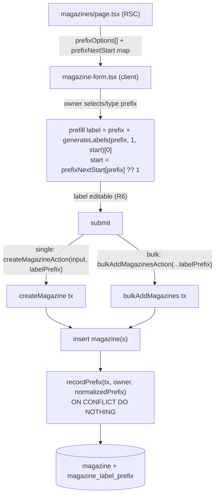

# Magazine Label Prefix Auto-Numbering - Plan

## Goal Capsule

- **Objective:** Let owners auto-number magazine labels from a prefix they choose, so a new magazine's `label` prefills as `prefix + next number` (e.g. `US04`) instead of being hand-typed — feeding the #20 paint-pen dot matrix with consistent marks.
- **Product authority:** Owner (`unclesp1d3r`), via brainstorm. Resolves GitHub issue #22.
- **Execution profile:** Standard depth, ~5 implementation units. Reuses the existing bulk-add numbering (`src/domain/bulkadd/labels.ts`) and the per-owner suggestion-list pattern already used for calibers.
- **Stop conditions:** Definition of Done met; `bun run lint`, `bun run typecheck`, `bun test`, and `bun run test:e2e` green.
- **Product Contract preservation:** unchanged. The two former Deferred-to-Planning questions are now resolved in the Planning Contract (KTD-4 control shape, KTD-1 lifecycle).

---

## Product Contract

### Summary

Owners pick a label prefix; the magazine's `label` prefills as `prefix + next number`, still fully editable. Prefixes are a per-owner list that grows on its own — any new prefix an owner uses is remembered and offered next time. Bulk add keeps its current prefix entry; single add gains a dropdown of the owner's existing prefixes plus free entry. Numbering reuses the existing bulk-add algorithm (continue past the highest `prefix + N`), so no new counter, no schema split of the label.

### Problem Frame

Owners today hand-type each `magazine.label`, which is error-prone and yields inconsistent, sometimes duplicate markings. The label is physically painted onto the floorplate as a dot-matrix mark (#20), so a predictable `PREFIX + number` is exactly what the owner wants to stamp. Bulk add already generates `prefix + N` labels, but single add does not, and there is no memory of the prefixes an owner uses — so every single add re-types the scheme from scratch. This closes that gap with the smallest addition: remember the owner's prefixes and reuse the numbering that already exists.

### Key Decisions (product)

- **Per-owner prefix list, not per-caliber scoping.** Prefixes are a flat list owned by the user, extended whenever the owner uses a prefix that isn't already in it. Matches issue #22's "user-wide first" recommendation.
- **Single overridable label field.** The prefilled value writes straight into the existing `magazine.label`. No separate canonical-number column, no display/nickname split — the label is prefilled and editable, exactly like bulk add works today.
- **Scan-based numbering (reuse existing code).** The next number continues past the highest existing `prefix + <positive integer>` among the owner's magazines. A deleted magazine's number can be reused (gaps close) and two simultaneous creates could race — a deliberate KISS trade that relaxes issue #22's "monotonic (no reuse)" and "atomic under concurrent creates" criteria, acceptable for a single-owner tool.
- **Prefix is opt-in per magazine.** If the owner picks no prefix on single add, the label behaves exactly as today (blank unless typed).
- **Magpul-mode validation is unchanged.** The prefilled `prefix + number` is subject to the shared #21 label check (`A-Z`, `0-9`, `-`, total ≤ `MAX_LABEL_LENGTH`), reusing the existing enforcement.

### Requirements

**Prefix list**

- R1. A per-owner list of label prefixes is persisted, and is extended whenever the owner saves a magazine using a prefix not already in the list (from single or bulk add).
- R2. Single-magazine add offers the owner's existing prefixes as a selectable list (dropdown) and allows entering a new prefix. Choosing none leaves the label blank (today's behavior).
- R3. Bulk add keeps its current prefix entry and records the entered prefix in the list.
- R4. The prefix list is owner-scoped: one owner's prefixes are never visible to or shared with another.

**Auto-numbering**

- R5. Selecting a prefix prefills `magazine.label` with `prefix + next number`, where the next number continues past the highest existing `prefix + <positive integer>` among the owner's magazines (the existing bulk-add algorithm).
- R6. The prefilled label is fully editable — the owner may change or clear it before saving.
- R7. Number width/zero-padding follows the existing bulk-add rule.

**Validation**

- R8. The resulting `prefix + number` label is validated against the shared #21 constants from `src/domain/magazines/constants.ts`. When Magpul mode is on, a prefix that leaves no room for at least one digit (or uses characters outside the allowed set) is rejected, reusing that check rather than redefining it.

### Acceptance Examples

- AE1. **Covers R2, R5.** Owner's prefix list is `[US, AR]`; highest existing `US` label is `US03`. Single add, owner selects `US` → label prefills `US04`; owner saves.
- AE2. **Covers R1, R5.** Single add, owner types a new prefix `MP` (not in the list) → label prefills `MP01`, and `MP` is added to the owner's prefix list.
- AE3. **Covers R3, R5.** Bulk add of 5 with prefix `US` (highest `US04`) → `US05`–`US09`; `US` stays in the list.
- AE4. **Covers R2, R6.** Single add, owner selects no prefix → label is blank, nothing auto-assigned (today's behavior).
- AE5. **Covers R8.** Magpul mode on; owner enters prefix `ABCD` (4 chars, no room for a digit) → rejected with the #21 validation error. (Same path rejects `US` once the sequence would reach `US100`, a 5-char label.)
- AE6. **Covers R5 (scan-based).** Highest `US` label is `US04`; owner deletes `US04`, then adds another `US` magazine → prefills `US04` again (numbers after a delete are reused; gaps close).

### Scope Boundaries

- Per-caliber or firearm-platform (#17) scoping — out; prefixes are a flat per-owner list.
- A separate canonical-number column or a number/display-label split — out; the label is one overridable field.
- A persistent per-prefix counter with monotonic, gap-preserving, atomic allocation — out; numbering is scan-based (see Key Decisions).
- Retroactive changes to existing magazines — out; existing labels are untouched.

#### Deferred to Follow-Up Work

- Pruning or renaming entries in the prefix list — v1 only ever grows the list (see KTD-1). A management UI is a later addition.

### Dependencies / Assumptions

- **Depends on #21 (shipped, PR #26):** reuse `MAX_LABEL_LENGTH`, the allowed-charset regex/description, and `normalizeMagpulLabel()` from `src/domain/magazines/constants.ts`.
- **Reuses existing numbering:** `nextLabelStart` and `generateLabels` in `src/domain/bulkadd/labels.ts` — single add wires into them.
- **Pairs with #20** (dot-matrix rendering) — the `prefix + number` label is what #20 paints.

### Outstanding Questions

Both former Deferred-to-Planning questions are resolved in the Planning Contract:
- Single-add prefix control shape → KTD-4 (text input + `<datalist>` combobox).
- Prefix-list lifecycle → KTD-1 (grows-only in v1; prune/rename deferred).

---

## Planning Contract

### Key Technical Decisions

- **KTD-1. Dedicated owner-scoped prefix table, grows-only.** Persist prefixes in a new `magazine_label_prefix` table (`owner_id` FK cascade, `prefix text`, `unique(owner_id, prefix)`, `owner_id` index), not derived from existing labels — deriving where a prefix ends and a number begins is ambiguous (e.g. `AR15`). The list only ever grows in v1; no delete/rename path (see Deferred to Follow-Up Work).
- **KTD-2. Reuse scan-based numbering.** Compute the next number with the existing pure `nextLabelStart` + `generateLabels` (`src/domain/bulkadd/labels.ts`), the same path bulk add uses. This is the deliberate KISS trade in the Product Contract (reuse-after-delete, non-atomic).
- **KTD-3. Server computes the next-start map; client prefills.** The magazines page (RSC) already threads a per-owner `caliberSuggestions` list into the form. Add two parallel props: `prefixOptions: string[]` (the owner's prefixes) and `prefixNextStart: Record<string, number>` (next start per known prefix, computed from the owner's labels via `nextLabelStart`). The client prefills using the pure functions it already imports, defaulting an unknown (newly typed) prefix's start to `1`. Avoids a per-keystroke server round-trip and avoids shipping every label to the client.
- **KTD-4. Single-add prefix control is a text input + `<datalist>`.** Mirror the existing caliber combobox (`list="magazine-calibers"` in `magazine-form.tsx`): a "Label prefix" input backed by a `<datalist>` of `prefixOptions` gives the "dropdown of existing prefixes with free entry" that R2 asks for, with no new component. The same datalist is offered on the bulk-add prefix input for consistency.
- **KTD-5. Record the prefix inside the create transaction.** On both create paths, after the magazine insert, upsert the normalized non-empty prefix into `magazine_label_prefix` with `ON CONFLICT (owner_id, prefix) DO NOTHING`, in the same transaction (`createMagazine` and `bulkAddMagazines` both already run in `db.transaction`). Keeps the list consistent with actual use and owner-scoped.
- **KTD-6. Magpul validation unchanged.** Reuse the existing constants and the domain's existing label rejection — the single-add label field already masks input via `handleLabelChange`, and the domain already rejects generated labels over the 4-char/charset cap. No new validation code.

### High-Level Technical Design — single-add prefill and prefix recording

### Assumptions

- The magazines page currently loads the owner's magazines and `caliberSuggestions`; adding `prefixOptions` + `prefixNextStart` follows the same RSC data path (verify the exact prop-threading through `magazines-view.tsx` during U3).
- `createMagazine`'s input type (`MagazineCreateInput`) is create-only and distinct from the update path, so adding an optional `labelPrefix` there does not affect edits.

---

## Implementation Units

### U1. Prefix table and domain module

- **Goal:** Persist a per-owner prefix list and expose owner-scoped read/record helpers.
- **Requirements:** R1, R4. **Decisions:** KTD-1.
- **Dependencies:** none.
- **Files:**
  - `src/db/inventory-schema.ts` — add `magazineLabelPrefix` pgTable (`ownerId` text FK → `user.id` cascade, `prefix` text notNull, `unique(owner_id, prefix)`, `index(owner_id)`).
  - `src/db/migrations/` — generated via `bun run db:generate` (drizzle-kit); do not hand-write.
  - `src/domain/magazines/prefixes.ts` — `listPrefixes(ownerId): Promise<string[]>` (alphabetical) and `recordPrefix(tx: DbOrTx, ownerId, prefix): Promise<void>` (normalize, skip empty, upsert `ON CONFLICT DO NOTHING`).
  - `src/domain/magazines/__tests__/prefixes.test.ts`.
- **Approach:** Mirror the owner-scoping and `DbOrTx` typing in `src/domain/magazines/service.ts`. Normalize the prefix with `normalizeMagpulLabel` before storing so casing matches how labels are generated. `recordPrefix` is a no-op on empty/whitespace prefix.
- **Patterns to follow:** existing pgTable definitions and indexes in `inventory-schema.ts`; owner-scoped queries in `service.ts`.
- **Execution note:** Integration tests gate on `DATABASE_URL` and use Testcontainers (`const live = process.env.DATABASE_URL ? describe : describe.skip`); reuse `src/test-support/factories.ts`.
- **Test scenarios:**
  - `Covers R1.` `recordPrefix` inserts a new `(owner, prefix)`; a second call with the same pair is a no-op (no duplicate, no error).
  - `recordPrefix` with an empty or whitespace-only prefix writes nothing.
  - `Covers R4.` `listPrefixes(ownerA)` returns only ownerA's prefixes, never ownerB's.
  - Normalization: `recordPrefix(owner, "us")` and `recordPrefix(owner, "US")` collapse to one entry.
- **Verification:** migration applies cleanly via `bun run db:migrate`; `listPrefixes`/`recordPrefix` pass owner-isolation and dedup tests.

### U2. Record the prefix on both create paths

- **Goal:** Persist the used prefix whenever a magazine is created via single or bulk add.
- **Requirements:** R1, R3. **Decisions:** KTD-5.
- **Dependencies:** U1.
- **Files:**
  - `src/domain/magazines/service.ts` — add optional `labelPrefix?: string` to `MagazineCreateInput`; in `createMagazine`, after the insert and inside the same `tx`, call `recordPrefix(tx, ownerId, input.labelPrefix ?? "")`.
  - `src/domain/bulkadd/service.ts` — after the insert, `recordPrefix(tx, owner, effectivePrefix)` (the already-normalized prefix).
  - `app/(app)/magazines/actions.ts` — thread `labelPrefix` through `createMagazineAction` to `createMagazine`.
  - `src/domain/magazines/__tests__/service.test.ts`, `src/domain/bulkadd/__tests__/service.test.ts`.
- **Approach:** Recording is best-effort-consistent within the create transaction, so a failed insert rolls back the prefix record too. Do not record on the update path (`updateMagazine` / `MagazineInput` unchanged).
- **Patterns to follow:** the existing post-insert side effects in both services (e.g. `replaceCompatibility` in `createMagazine`, the link-row insert in `bulkAddMagazines`).
- **Test scenarios:**
  - `Covers R3.` Bulk add with prefix `US` records `US` in the owner's prefix list exactly once, even for `count > 1`.
  - `Covers R1.` Single `createMagazine` with `labelPrefix: "MP"` records `MP`.
  - Single `createMagazine` with no `labelPrefix` (or empty) records nothing.
  - A create that throws (invalid input) leaves no prefix recorded (transaction rollback).
- **Verification:** after a bulk or single create, `listPrefixes(owner)` reflects the used prefix; owner isolation holds.

### U3. Serve the prefix list and next-start map to the form

- **Goal:** Give the client everything it needs to prefill without a per-keystroke server call.
- **Requirements:** R5, R7. **Decisions:** KTD-3, KTD-2.
- **Dependencies:** U1.
- **Files:**
  - `src/domain/bulkadd/labels.ts` — add a pure `nextStartForPrefixes(existingLabels: string[], prefixes: string[]): Record<string, number>` that maps each prefix to `nextLabelStart(existingLabels, prefix)`.
  - `app/(app)/magazines/page.tsx` — load `listPrefixes(ownerId)`; compute `prefixNextStart` from the owner's labels + prefixes; pass both to the view/form.
  - `app/(app)/magazines/magazines-view.tsx` — thread `prefixOptions` and `prefixNextStart` props into `MagazineForm`.
  - `src/domain/bulkadd/__tests__/labels.test.ts`.
- **Approach:** Keep the map computation pure and unit-tested (no DB). The page already fetches the owner's magazines and `caliberSuggestions`; reuse that label set for the map so no extra query is added beyond `listPrefixes`.
- **Patterns to follow:** how `caliberSuggestions` is derived and threaded from `page.tsx` → `magazines-view.tsx` → `MagazineForm`.
- **Test scenarios:**
  - `Covers R5.` `nextStartForPrefixes(["US01","US03","AR02"], ["US","AR","MP"])` → `{US: 4, AR: 3, MP: 1}`.
  - `Covers R7.` Width/pad follows `generateLabels` (existing behavior) — a prefix crossing 99→100 grows width; assert via `generateLabels(prefix, 1, start)`.
  - Empty prefix maps to start `1` and produces an empty label downstream (no numbering).
- **Verification:** `bun run typecheck` clean on the threaded props; map matches `nextLabelStart` per prefix.

### U4. Single-add prefix control and prefill

- **Goal:** In single mode, offer the owner's prefixes and prefill the editable label.
- **Requirements:** R2, R5, R6, R8. **Decisions:** KTD-4, KTD-6.
- **Dependencies:** U3.
- **Files:**
  - `app/(app)/magazines/magazine-form.tsx` — accept `prefixOptions` + `prefixNextStart` props; in single mode add a "Label prefix" `<Input>` backed by a `<datalist>` of `prefixOptions`; on prefix change, prefill `label` with `prefix + generateLabels(prefix, 1, prefixNextStart[prefix] ?? 1)[0]` (empty prefix → clear/leave label per current behavior); keep the label field editable and its existing Magpul masking (`handleLabelChange`). Pass the chosen prefix as `labelPrefix` to `createMagazineAction`. Offer the same datalist on the bulk-add prefix input.
- **Approach:** Reuse the caliber `<datalist>` pattern already in this file. Prefill is a suggestion — once the user edits the label, do not clobber it on unrelated re-renders (prefill only fires on prefix selection/change, mirroring how bulk `labelPreview` recomputes). Respect no-`data-testid` rule: target via label text / ARIA.
- **Patterns to follow:** the caliber `<Input list="magazine-calibers">` + `<datalist>` block; the bulk-mode `labelPreview`/`handlePrefixChange` logic already in the file.
- **Execution note:** Component behavior is validated primarily through the U5 e2e flow (no `data-testid`); keep any pure prefill helper unit-tested if extracted.
- **Test scenarios:**
  - `Covers AE1.` Existing `US03`; select `US` → label field shows `US04`.
  - `Covers AE2.` Type new `MP` → label shows `MP01`.
  - `Covers AE4.` No prefix selected → label stays blank; `createMagazineAction` receives empty/undefined `labelPrefix`.
  - `Covers R6.` After prefill, editing the label to `SPARE` and saving stores `SPARE`.
- **Verification:** manual/e2e confirm prefill + override; `bun run lint` and `bun run typecheck` clean.

### U5. End-to-end coverage of the prefill flow

- **Goal:** Prove the single-add prefix→prefill→save→list-growth flow in a real browser against a real DB.
- **Requirements:** R1, R2, R5, R6. **Decisions:** all.
- **Dependencies:** U4.
- **Files:**
  - `e2e/` — a new Playwright spec (see `e2e/README.md` harness); Testcontainers-backed, Docker required.
- **Approach:** Drive the magazines page: create a magazine with prefix `US` (label prefills `US01`), create a second (prefills `US02`), then confirm a fresh single-add dropdown lists `US`. Target elements by ARIA role / accessible name / visible text — never `data-testid`.
- **Test scenarios:**
  - `Covers AE1, AE2.` First `US` magazine prefills `US01`; second prefills `US02`.
  - `Covers R1.` After creating with a new prefix, it appears in the single-add prefix options.
  - `Covers R6.` Overriding the prefilled label persists the override.
- **Verification:** `bun run test:e2e` green.

---

## Verification Contract

| Gate | Command | Applies to |
|------|---------|-----------|
| Migration | `bun run db:generate` then `bun run db:migrate` | U1 |
| Lint | `bun run lint` | all |
| Types | `bun run typecheck` | all |
| Unit + integration | `bun test` (integration gates on `DATABASE_URL`, Testcontainers) | U1–U4 |
| E2E | `bun run test:e2e` (Docker) | U5 |

---

## Definition of Done

- A per-owner `magazine_label_prefix` table exists with a migration; `listPrefixes`/`recordPrefix` are owner-scoped and deduped (R1, R4).
- Creating a magazine (single or bulk) with a non-empty prefix records that prefix once (R1, R3).
- Single add offers the owner's prefixes as a datalist combobox with free entry; selecting one prefills the editable `label` with `prefix + next number`; selecting none leaves it blank (R2, R5, R6).
- Numbering continues past the highest existing `prefix + N` and reuses freed numbers after delete, matching bulk add (R5, R7; AE6).
- Magpul-mode labels are validated via the existing #21 path; an over-long or bad-charset `prefix + number` is rejected (R8; AE5).
- All Verification Contract gates pass.
