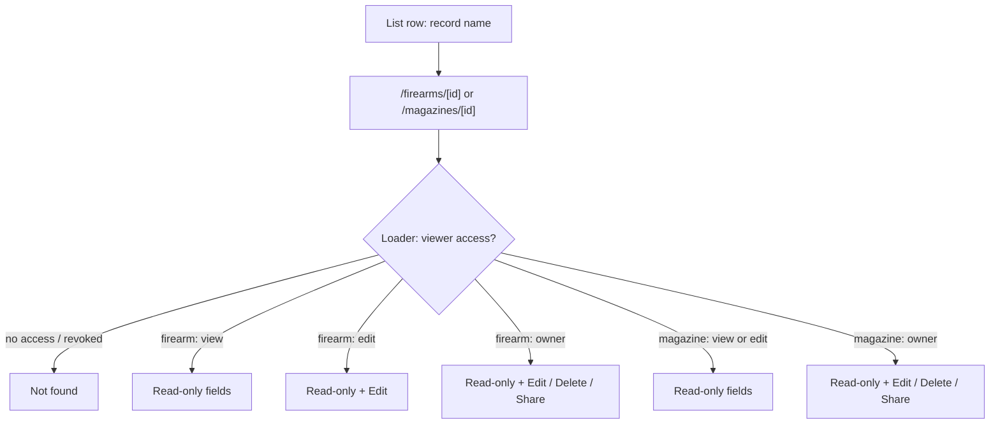

# Firearm & Magazine Detail View - Plan

## Goal Capsule

- **Objective:** Give every firearm and magazine record a dedicated, permission-aware read-only detail page so view-only grantees have a correct destination and owners get a clean "just look at it" surface (GitHub issue #19).
- **Product authority:** Repo owner (@UncleSp1d3r) via issue #19 and this brainstorm.
- **Open blockers:** None — scope questions resolved; ready for planning.

---

## Product Contract

### Summary

Add dedicated read-only detail routes for a single firearm (`/firearms/[id]`) and a single magazine (`/magazines/[id]`) that show every field. The detail page is the single home for one record: it hosts permission-gated Edit / Delete / Share — firearm edit-grantees can edit, magazine actions are owner-only — while view-only grantees reach a read-only page by clicking the record name.

### Problem Frame

The only way to inspect a record's full detail today is to open the Edit form — the list rows show a handful of columns. Two costs follow.

The sharing model grants `view` or `edit` permission, but the list presents an Edit button regardless of permission. A `view`-only grantee who clicks it lands in an editing surface they can never save, with no read-only alternative. Firearm rows already carry a per-viewer `permission`; magazine rows do not, so magazines cannot currently distinguish a view-grantee from an edit-grantee in the UI at all.

Separately, owners often want to read notes, serial, acquired date, and compatibility without the risk of an accidental edit, and no affordance offers that.

### Key Decisions

- **Dedicated route over in-page panel.** Gives a stable, bookmarkable URL for someone who already holds a grant. The link is a bookmark, not a way to grant access — a viewer with no grant gets not-found, so it does not share access with new people. Cost is a new route plus loader; no detail routes exist today. An id-keyed in-page panel was considered and rejected because it yields no stable URL.
- **The detail page hosts each record's actions; the list keeps two quick ones.** Edit and the firearm range-session history move off the list onto the detail page, which hosts Edit / Delete / Share. The list keeps owner-only quick Delete and Share for fast bulk management and drops the rest. The list and detail page reuse one Delete/Share action and confirmation flow, not parallel implementations (R12).
- **Editing reuses the existing form in place.** Edit renders the current firearm/magazine form component on the detail page; there is no separate edit route (KISS). Owner editing of a magazine applies the owner's own Magpul-mode flag exactly as the create form does today.
- **Read-only layout is written per entity.** No shared read-only field renderer is extracted (YAGNI); each entity gets its own layout. Revisit only if a third surface needs it.
- **Magazine actions are owner-only (KISS) — and this removes access edit-grantees have today.** The current magazine list shows Edit to every viewer and the shared write-authorization already lets `edit` grants save, so magazine `edit`-grantees can edit now. Going owner-only is a deliberate regression, accepted for now: existing magazine `edit` grants become read-only in the UI, the share control offers only `view` for magazines going forward, and owner-only is enforced server-side (R13). Firearms honor the full owner/edit distinction, since the firearm loader already computes permission.
- **The firearm detail page always shows the serial.** Serial is shown to any viewer who can open the page — including view-only grantees — and independent of the list's `showSerial` toggle (that toggle governs the list only). Exposing the serial to view-grantees is an accepted call for this collection-management tool.

### Requirements

**Detail surface & fields**

- R1. A dedicated read-only route exists for a single firearm (`/firearms/[id]`) and a single magazine (`/magazines/[id]`), each reachable by a stable URL.
- R2. Each detail page displays every stored field omitted from the list — notes, acquired date, compatibility / linked magazines — plus, for firearms, the round total and the range-session history rendered read-only.
- R3. Sharing state (who else holds a grant on the record) is shown to the owner only; view-only and edit grantees do not see the grant roster.
- R4. The firearm detail page shows the serial number to any viewer who can open the page, including view-only grantees, regardless of the list's `showSerial` toggle.
- R5. Fields introduced by the taxonomy (#17) and product-name/nickname (#18) work appear in the detail view.

**Permission gating & entry points**

- R6. The record name in each list row links to that record's detail page for every viewer.
- R7. A view-only grantee sees a read-only detail page with no Edit, Delete, or Share affordance; the name link is their entry point in place of an Edit control.
- R8. No viewer who cannot save is ever shown an editable surface. Firearm edit-grantees keep edit capability; magazine editing is owner-only (R10).
- R9. A record the viewer cannot access — never shared, or a grant since revoked — resolves as not-found and exposes no field, for both firearms and magazines.

**Action relocation & enforcement**

- R10. The detail page hosts Edit, Delete, and Share, permission-gated: for firearms, Edit for owner/edit and Delete/Share for owner; for magazines, all three are owner-only. The list keeps owner-only quick Delete and Share and drops Edit and Sessions.
- R11. Editing opens the existing firearm/magazine form in place on the detail page (reusing the current form component); there is no separate edit route.
- R12. The list's quick Delete/Share and the detail page's Delete/Share reuse one underlying action and confirmation flow, not parallel implementations.
- R13. Owner-only and edit gating is enforced server-side in each mutation's authorization, not by hidden controls alone; a magazine `edit`-grantee's update, delete, or share request is rejected server-side.
- R14. Range-session history renders read-only for every firearm viewer; only adding or editing session entries is gated to owner/edit.
- R15. Deleting a record (from the detail page or the list quick action) returns the viewer to the corresponding list.

**Accessibility & testing**

- R16. Every page state — the record detail and the not-found/no-access response — announces itself with an accessible heading and is fully keyboard-reachable and operable; client-side route transitions move focus to the destination heading.
- R17. Controls and list-row name links are labeled via ARIA roles, accessible names, or visible text; when multiple rows share a displayed name, each link's accessible name carries a disambiguator (e.g., label or serial suffix). No `data-testid` is introduced.
- R18. Every detail page provides a persistent link back to its list, independent of the delete flow.
- R19. Testcontainers-backed e2e proves: an owner opens the detail view with full actions; a view-only shared user sees a read-only page with no edit/delete/share controls; and a no-access/revoked-grant URL resolves as not-found without exposing fields.

Entry and permission flow the detail routes resolve:

### Acceptance Examples

- AE1. **Covers R7, R10.** **Given** a magazine shared with the viewer at `view` permission, **when** they open its detail page, **then** all fields render and no Edit, Delete, or Share control is present.
- AE2. **Covers R8, R10.** **Given** a firearm the viewer owns, **when** they open its detail page, **then** Edit, Delete, and Share are all available.
- AE3. **Covers R15.** **Given** an owner viewing a record's detail page, **when** they delete it, **then** they are returned to that record's list and the record is gone.
- AE4. **Covers R9, R19.** **Given** a record the viewer has no access to (never shared, or a grant since revoked), **when** they navigate to its detail URL, **then** the page resolves as not found rather than exposing any field.
- AE5. **Covers R4.** **Given** a firearm shared with the viewer at `view` permission, **when** they open its detail page, **then** the serial number is shown along with every other field.
- AE6. **Covers R10, R13.** **Given** a magazine shared with the viewer at `edit` permission, **when** they open its detail page or issue an update request directly, **then** the page renders read-only with no Edit/Delete/Share and the server rejects the update (magazine actions are owner-only).
- AE7. **Covers R2, R14.** **Given** a firearm shared with the viewer at `view` permission, **when** they open its detail page, **then** they see the range-session history read-only with no add-or-edit-session controls.

### Scope Boundaries

- No schema changes, and no per-viewer `permission` threaded into the magazine loader — magazine gating stays owner-only via the existing `ownerId` check plus server-side authorization (R13).
- Magazine `edit`-grantees become read-only (owner-only actions), and the share control stops offering `edit` for magazines. This deliberately removes current edit-grantee capability; accepted for now.
- Create flows ("Add firearm" / "Add magazine") stay on the list pages; only per-record actions move to the detail page.
- No shared read-only field renderer — each entity gets its own layout (YAGNI).

### Sources / Research

- `app/(app)/firearms/firearms-view.tsx` — current firearm list; inline Edit/Delete/Share/Sessions actions and the `permission` field on `FirearmListItem`.
- `app/(app)/magazines/magazines-view.tsx` — current magazine list; `MagazineListItem` carries `ownerId` only, no `permission`.
- `app/(app)/firearms/page.tsx` — firearm loader builds a `permissions` map (`permission: permissions.get(f.id) ?? "view"`); the firearm detail page carries this permission.
- `app/(app)/magazines/page.tsx` — magazine loader sets `ownerId` only; magazines stay owner-only (no permission threading).
- `src/auth/visibility.ts` — `Permission = "owner" | "edit" | "view"`; owner-scoped + grant-based visibility.
- `src/auth/authorize.ts` — `authorizeUpdate()` currently permits `perm === "edit"` for both entities; magazine owner-only must be enforced here (R13), not by hidden UI alone.
- `src/db/inventory-schema.ts` — grant `permission in (view, edit)`.
- `app/(app)/grants/share-control.tsx` — the Share control; must stop offering `edit` for magazines.
- `app/(app)/firearms/range-session-history.tsx` — the Sessions panel that moves to the firearm detail page (read-only for view-grantees; logging gated).
- `AGENTS.md` — no `data-testid`; integration/e2e via Testcontainers; target UI via ARIA/roles/visible text.
