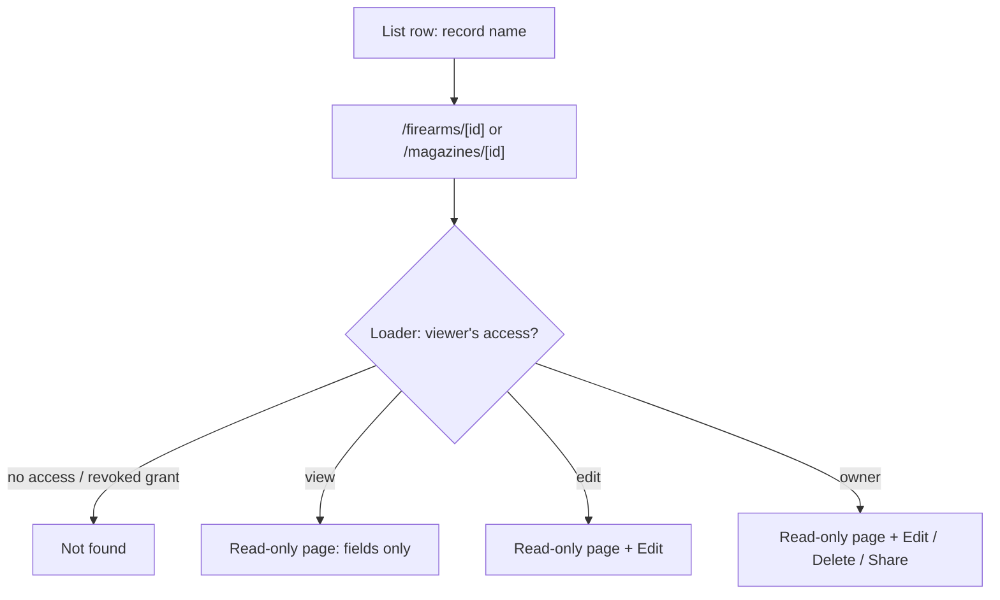

# Firearm & Magazine Detail View - Plan

## Goal Capsule

- **Objective:** Give every firearm and magazine record a dedicated, permission-aware read-only detail page so view-only grantees have a correct destination and owners get a clean "just look at it" surface (GitHub issue #19).
- **Product authority:** Repo owner (@UncleSp1d3r) via issue #19 and this brainstorm.
- **Open blockers:** None — scope questions resolved; ready for planning.

---

## Product Contract

### Summary

Add dedicated read-only detail routes for a single firearm (`/firearms/[id]`) and a single magazine (`/magazines/[id]`) that show every field. The page is the single home for one record: owners and edit-grantees get permission-gated Edit / Delete / Share (and, for firearms, range-session history) on the page; view-only grantees reach a purely read-only page by clicking the record name.

### Problem Frame

The only way to inspect a record's full detail today is to open the Edit form — the list rows show a handful of columns. Two costs follow.

The sharing model grants `view` or `edit` permission, but the list presents an Edit button regardless of permission. A `view`-only grantee who clicks it lands in an editing surface they can never save, with no read-only alternative. Firearm rows already carry a per-viewer `permission`; magazine rows do not, so magazines cannot currently distinguish a view-grantee from an edit-grantee in the UI at all.

Separately, owners often want to read notes, serial, acquired date, and compatibility without the risk of an accidental edit, and no affordance offers that.

### Key Decisions

- **Dedicated route over in-page panel.** A shareable, bookmarkable URL fits the sharing model — a view-only grantee can link straight to a record. The cost is a new route plus loader; no detail routes exist today, so this is net-new surface rather than an extension of the existing form/session panels.
- **The detail page hosts each record's actions; the list keeps two quick ones.** Edit and the firearm range-session history move off the list onto the detail page, which hosts Edit / Delete / Share. The list keeps owner-only quick Delete and Share for fast bulk management and drops the rest.
- **Magazine actions are owner-only for now (KISS).** Only the owner sees Edit / Delete / Share on a magazine; both `view` and `edit` grantees get a read-only magazine detail page. This keeps the existing `ownerId` check and avoids threading a per-viewer `permission` into the magazine loader — a deliberate divergence from the issue's "edit grantees still edit" for magazines. Firearms honor the full owner/edit distinction, since the firearm loader already computes permission.
- **The firearm detail page shows the serial.** Serial is displayed, and the detail page carries the viewer's permission on that firearm (the same permission it uses to gate actions). This reverses the earlier bet to hide serials; planning reconciles it with the list's existing `showSerial` toggle.

### Requirements

**Detail surface & fields**

- R1. A dedicated read-only route exists for a single firearm (`/firearms/[id]`) and a single magazine (`/magazines/[id]`), each reachable by a stable URL.
- R2. Each detail page displays every stored field for the record, including fields omitted from the list — notes, acquired date, compatibility / linked magazines, and sharing state, plus the round total and range-session history for firearms.
- R3. The firearm detail page shows the serial number; the detail page carries the viewer's permission on that firearm (the permission used for action gating).
- R4. Fields introduced by the taxonomy (#17) and product-name/nickname (#18) work appear in the detail view.

**Permission gating & entry points**

- R5. The record name in each list row links to that record's detail page for every viewer.
- R6. A view-only grantee sees the detail page with no Edit, Delete, or Share affordance; the name link is their entry point in place of an Edit control.
- R7. No viewer who cannot save is ever presented an editable surface. Firearm edit-grantees keep edit capability; magazine editing is owner-only for now (R8).

**Action relocation**

- R8. The detail page hosts Edit, Delete, and Share, permission-gated: for firearms, Edit for owner/edit and Delete/Share for owner; for magazines, all three are owner-only. The list keeps owner-only quick Delete and Share and drops Edit and Sessions.
- R9. The firearm range-session history is presented on the firearm detail page alongside the other actions.
- R10. Deleting a record (from its detail page or the list quick action) returns the viewer to the corresponding list.

**Accessibility & testing**

- R11. Each detail page announces its record through a page heading and is fully keyboard-reachable and operable.
- R12. Controls are labeled via ARIA roles, accessible names, or visible text; no `data-testid` is introduced.
- R13. Testcontainers-backed e2e coverage proves an owner opens the detail view and a view-only shared user sees a read-only page with no edit/delete/share controls.

Entry and permission flow the detail routes resolve:

### Acceptance Examples

- AE1. **Covers R6, R8.** **Given** a magazine shared with the viewer at `view` permission, **when** they open its detail page, **then** all fields render and no Edit, Delete, or Share control is present.
- AE2. **Covers R7, R8.** **Given** a firearm the viewer owns, **when** they open its detail page, **then** Edit, Delete, and Share are all available.
- AE3. **Covers R1, R10.** **Given** an owner viewing a record's detail page, **when** they delete it, **then** they are returned to that record's list and the record is gone.
- AE4. **Covers R1.** **Given** a record the viewer has no access to (never shared, or a grant since revoked), **when** they navigate to its detail URL, **then** the page resolves as not found rather than exposing any field.
- AE5. **Covers R3.** **Given** an owner (or firearm edit-grantee) opens a firearm detail page, **when** the page renders, **then** the serial number is shown along with every other field.
- AE6. **Covers R7, R8.** **Given** a magazine shared with the viewer at `edit` permission, **when** they open its detail page, **then** it renders read-only with no Edit/Delete/Share (magazine actions are owner-only for now).

### Scope Boundaries

- No schema changes, and no magazine-loader change — magazine actions stay owner-only via the existing `ownerId` check, so no per-viewer `permission` is threaded in.
- Magazine `edit` grantees are read-only for now (owner-only actions), a deliberate divergence from the issue's "edit grantees still edit" for magazines; revisit if magazine edit-sharing is needed.
- Create flows ("Add firearm" / "Add magazine") stay on the list pages; only per-record actions move to the detail page.
- A shared read-only field renderer (backing both the detail view and the form's disabled state) is optional, left to planning — not required by this contract.

### Outstanding Questions

**Deferred to planning**

- Whether Edit on the detail page renders the existing form in place or as a separate edit route.
- Whether to extract a shared read-only field renderer (DRY) or keep per-entity layouts.
- How the firearm detail page's serial display reconciles with the list's existing `showSerial` toggle.
- How Magpul-mode label masking (owner-only, resolved per-open today) carries to magazine editing from the detail page.

### Sources / Research

- `app/(app)/firearms/firearms-view.tsx` — current firearm list; inline Edit/Delete/Share/Sessions actions and the `permission` field on `FirearmListItem`.
- `app/(app)/magazines/magazines-view.tsx` — current magazine list; `MagazineListItem` carries `ownerId` only, no `permission`.
- `app/(app)/firearms/page.tsx` — firearm loader builds a `permissions` map (`permission: permissions.get(f.id) ?? "view"`); the firearm detail page carries this permission.
- `app/(app)/magazines/page.tsx` — magazine loader sets `ownerId` only; magazines stay owner-only, so it needs no permission change.
- `src/auth/visibility.ts` — `Permission = "owner" | "edit" | "view"`; owner-scoped + grant-based visibility.
- `src/db/inventory-schema.ts` — grant `permission in (view, edit)`.
- `app/(app)/firearms/range-session-history.tsx` — the Sessions panel that moves to the firearm detail page.
- `AGENTS.md` — no `data-testid`; integration/e2e via Testcontainers; target UI via ARIA/roles/visible text.
