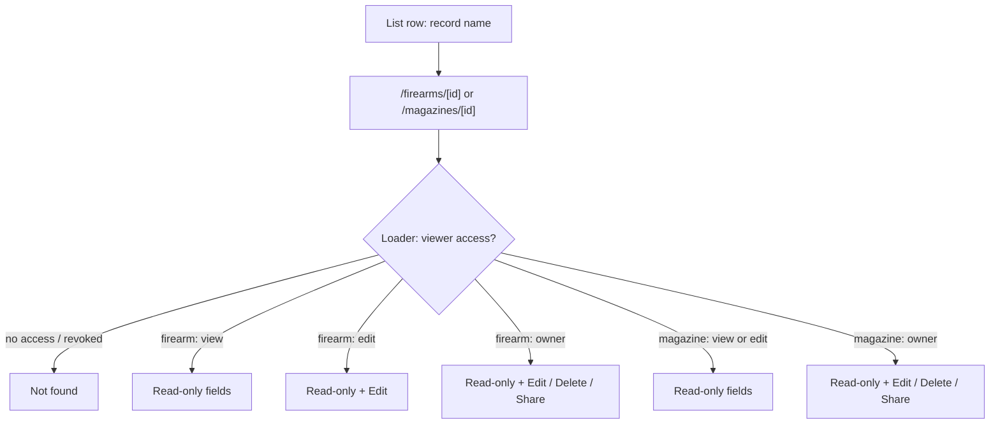
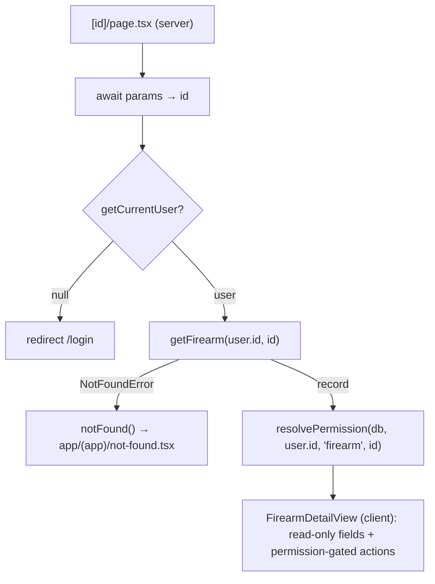

# Firearm & Magazine Detail View - Plan

## Goal Capsule

- **Objective:** Give every firearm and magazine record a dedicated, permission-aware read-only detail page so view-only grantees have a correct destination and owners get a clean "just look at it" surface (GitHub issue #19).
- **Product authority:** Repo owner (@UncleSp1d3r) via issue #19 and this brainstorm.
- **Open blockers:** None — scope questions resolved; ready for planning.

---

## Product Contract

### Summary

Add dedicated read-only detail routes for a single firearm (`/firearms/[id]`) and a single magazine (`/magazines/[id]`) that show every field. The detail page is the single home for one record: it hosts permission-gated Edit / Delete / Share — firearm edit-grantees can edit, magazine actions are owner-only — while view-only grantees reach a read-only page by clicking the record name.

### Problem Frame

The only way to inspect a record's full detail today is to open the Edit form — the list rows show a handful of columns. Two costs follow.

The sharing model grants `view` or `edit` permission, but the list presents an Edit button regardless of permission. A `view`-only grantee who clicks it lands in an editing surface they can never save, with no read-only alternative. Firearm rows already carry a per-viewer `permission`; magazine rows do not, so magazines cannot currently distinguish a view-grantee from an edit-grantee in the UI at all.

Separately, owners often want to read notes, serial, acquired date, and compatibility without the risk of an accidental edit, and no affordance offers that.

### Key Decisions

- **Dedicated route over in-page panel.** Gives a stable, bookmarkable URL for someone who already holds a grant. The link is a bookmark, not a way to grant access — a viewer with no grant gets not-found, so it does not share access with new people. Cost is a new route plus loader; no detail routes exist today. An id-keyed in-page panel was considered and rejected because it yields no stable URL.
- **The detail page hosts each record's actions; the list keeps two quick ones.** Edit and the firearm range-session history move off the list onto the detail page, which hosts Edit / Delete / Share. The list keeps owner-only quick Delete and Share for fast bulk management and drops the rest. The list and detail page reuse one Delete/Share action and confirmation flow, not parallel implementations (R12).
- **Editing reuses the existing form in place.** Edit renders the current firearm/magazine form component on the detail page; there is no separate edit route (KISS). Owner editing of a magazine applies the owner's own Magpul-mode flag exactly as the create form does today.
- **Read-only layout is written per entity.** No shared read-only field renderer is extracted (YAGNI); each entity gets its own layout. Revisit only if a third surface needs it.
- **Magazine actions are owner-only (KISS) — and this removes access edit-grantees have today.** The current magazine list shows Edit to every viewer and the shared write-authorization already lets `edit` grants save, so magazine `edit`-grantees can edit now. Going owner-only is a deliberate regression, accepted for now: existing magazine `edit` grants become read-only in the UI, the share control offers only `view` for magazines going forward, and owner-only is enforced server-side (R13). Firearms honor the full owner/edit distinction, since the firearm loader already computes permission.
- **The firearm detail page always shows the serial.** Serial is shown to any viewer who can open the page — including view-only grantees — and independent of the list's `showSerial` toggle (that toggle governs the list only). Exposing the serial to view-grantees is an accepted call for this collection-management tool.

### Requirements

**Detail surface & fields**

- R1. A dedicated read-only route exists for a single firearm (`/firearms/[id]`) and a single magazine (`/magazines/[id]`), each reachable by a stable URL.
- R2. Each detail page displays every stored field omitted from the list — notes, acquired date, compatibility / linked magazines — plus, for firearms, the round total and the range-session history rendered read-only.
- R3. Sharing state (who else holds a grant on the record) is shown to the owner only; view-only and edit grantees do not see the grant roster.
- R4. The firearm detail page shows the serial number to any viewer who can open the page, including view-only grantees, regardless of the list's `showSerial` toggle.
- R5. Fields introduced by the taxonomy (#17) and product-name/nickname (#18) work appear in the detail view.

**Permission gating & entry points**

- R6. The record name in each list row links to that record's detail page for every viewer.
- R7. A view-only grantee sees a read-only detail page with no Edit, Delete, or Share affordance; the name link is their entry point in place of an Edit control.
- R8. No viewer who cannot save is ever shown an editable surface. Firearm edit-grantees keep edit capability; magazine editing is owner-only (R10).
- R9. A record the viewer cannot access — never shared, or a grant since revoked — resolves as not-found and exposes no field, for both firearms and magazines.

**Action relocation & enforcement**

- R10. The detail page hosts Edit, Delete, and Share, permission-gated: for firearms, Edit for owner/edit and Delete/Share for owner; for magazines, all three are owner-only. The list keeps owner-only quick Delete and Share and drops Edit and Sessions.
- R11. Editing opens the existing firearm/magazine form in place on the detail page (reusing the current form component); there is no separate edit route.
- R12. The list's quick Delete/Share and the detail page's Delete/Share reuse one underlying action and confirmation flow, not parallel implementations.
- R13. Owner-only and edit gating is enforced server-side in each mutation's authorization, not by hidden controls alone; a magazine `edit`-grantee's update, delete, or share request is rejected server-side.
- R14. Range-session history renders read-only for every firearm viewer; only adding or editing session entries is gated to owner/edit.
- R15. Deleting a record (from the detail page or the list quick action) returns the viewer to the corresponding list.

**Accessibility & testing**

- R16. Every page state — the record detail and the not-found/no-access response — announces itself with an accessible heading and is fully keyboard-reachable and operable; client-side route transitions move focus to the destination heading.
- R17. Controls and list-row name links are labeled via ARIA roles, accessible names, or visible text; when multiple rows share a displayed name, each link's accessible name carries a disambiguator (e.g., label or serial suffix). No `data-testid` is introduced.
- R18. Every detail page provides a persistent link back to its list, independent of the delete flow.
- R19. Testcontainers-backed e2e proves: an owner opens the detail view with full actions; a view-only shared user sees a read-only page with no edit/delete/share controls; and a no-access/revoked-grant URL resolves as not-found without exposing fields.

Entry and permission flow the detail routes resolve:

### Acceptance Examples

- AE1. **Covers R7, R10.** **Given** a magazine shared with the viewer at `view` permission, **when** they open its detail page, **then** all fields render and no Edit, Delete, or Share control is present.
- AE2. **Covers R8, R10.** **Given** a firearm the viewer owns, **when** they open its detail page, **then** Edit, Delete, and Share are all available.
- AE3. **Covers R15.** **Given** an owner viewing a record's detail page, **when** they delete it, **then** they are returned to that record's list and the record is gone.
- AE4. **Covers R9, R19.** **Given** a record the viewer has no access to (never shared, or a grant since revoked), **when** they navigate to its detail URL, **then** the page resolves as not found rather than exposing any field.
- AE5. **Covers R4.** **Given** a firearm shared with the viewer at `view` permission, **when** they open its detail page, **then** the serial number is shown along with every other field.
- AE6. **Covers R10, R13.** **Given** a magazine shared with the viewer at `edit` permission, **when** they open its detail page or issue an update request directly, **then** the page renders read-only with no Edit/Delete/Share and the server rejects the update (magazine actions are owner-only).
- AE7. **Covers R2, R14.** **Given** a firearm shared with the viewer at `view` permission, **when** they open its detail page, **then** they see the range-session history read-only with no add-or-edit-session controls.

### Scope Boundaries

- No schema changes, and no per-viewer `permission` threaded into the magazine loader — magazine gating stays owner-only via the existing `ownerId` check plus server-side authorization (R13).
- Editing, deleting, and sharing an **existing** magazine become owner-only, and the share control stops offering `edit` for magazines. This deliberately removes current edit-grantee capability on existing magazines; accepted for now. **Not covered:** bulk create-on-behalf — an `allow_create_on_behalf` grant still lets a grantee create magazines owned by the grantor via `bulkAddMagazines`/`resolveCreateOwner`. That is a separate, pre-existing capability, left intact and out of scope here; the owner-only claim is scoped to editing existing magazines, not to blocking create-on-behalf.
- Create flows ("Add firearm" / "Add magazine") stay on the list pages; only per-record actions move to the detail page.
- No shared read-only field renderer — each entity gets its own layout (YAGNI).

### Sources / Research

- `app/(app)/firearms/firearms-view.tsx` — current firearm list; inline Edit/Delete/Share/Sessions actions and the `permission` field on `FirearmListItem`.
- `app/(app)/magazines/magazines-view.tsx` — current magazine list; `MagazineListItem` carries `ownerId` only, no `permission`.
- `app/(app)/firearms/page.tsx` — firearm loader builds a `permissions` map (`permission: permissions.get(f.id) ?? "view"`); the firearm detail page carries this permission.
- `app/(app)/magazines/page.tsx` — magazine loader sets `ownerId` only; magazines stay owner-only (no permission threading).
- `src/auth/visibility.ts` — `Permission = "owner" | "edit" | "view"`; owner-scoped + grant-based visibility.
- `src/auth/authorize.ts` — `authorizeUpdate()` currently permits `perm === "edit"` for both entities; magazine owner-only must be enforced here (R13), not by hidden UI alone.
- `src/db/inventory-schema.ts` — grant `permission in (view, edit)`.
- `app/(app)/grants/share-control.tsx` — the Share control; must stop offering `edit` for magazines.
- `app/(app)/firearms/range-session-history.tsx` — the Sessions panel that moves to the firearm detail page (read-only for view-grantees; logging gated).
- `AGENTS.md` — no `data-testid`; integration/e2e via Testcontainers; target UI via ARIA/roles/visible text.

---

## Planning Contract

**Product Contract preservation:** Product Contract unchanged — Requirements R1–R19 and AE1–AE7 carried forward verbatim; this enrichment adds only the HOW.

### Key Technical Decisions

- KTD1. **Reuse the existing domain loaders; routes are thin.** `getFirearm(actorId, id)` and `getMagazine(actorId, id)` (`src/domain/{firearms,magazines}/service.ts`) already call `resolvePermission` and throw `NotFoundError` when the viewer has no grant. Each new `[id]/page.tsx` is a thin async server component that awaits `params`, resolves the current user, calls the loader in a `try/catch`, and calls `notFound()` (next/navigation) on `NotFoundError` (R9). No new data-access layer. `notFound()` is not yet used anywhere in the repo — this introduces it.
- KTD2. **Per-record permission comes from `resolvePermission`.** The detail page calls `resolvePermission(db, user.id, "firearm"|"magazine", id)` directly for UI gating. The magazines *list* loader stays unchanged (owner-only via `ownerId`); only the detail page needs the tier.
- KTD3. **Magazine owner-only is enforced in the write path, not the UI.** `authorizeDelete` is already owner-only for both entities, and Share is already owner-gated, so Delete/Share need no change. Magazine **update** currently flows through `authorizeUpdate` (owner + edit); route the magazine update path through an owner-only check so an `edit`-grantee's save is rejected server-side (R13, AE6). `ShareControl` stops offering `edit` when `parentType === "magazine"`. Create-on-behalf bulk-add (`resolveCreateOwner` → `bulkAddMagazines`) is a separate, pre-existing mutation surface not covered by this change — see Scope Boundaries.
- KTD4. **Edit renders the existing form in place; delete redirects.** Editing mounts the existing `FirearmForm` / `MagazineForm` on the detail page (their `onDone`/`onCancel` contract already fits) — no `[id]/edit` route (R11). Delete reuses `delete{Firearm,Magazine}Action` then `router.push(listPath)` (R15); `useDeleteConfirmation` (which hardcodes `router.refresh()`) gains an optional post-delete redirect so list and detail reuse one flow (R12).
- KTD5. **Per-entity detail views, one shared not-found page.** No shared read-only field renderer (Product Contract decision); each entity gets its own view component. A single `app/(app)/not-found.tsx` renders the accessible 404 for both routes (R9, R16).

### High-Level Technical Design

Both detail routes follow one server-component shape (firearm shown; magazine identical with `getMagazine` and owner-only gating):

### Assumptions

- `getFirearm`/`getMagazine` throw `NotFoundError` for any record the viewer cannot see — the not-found path (R9) depends on this and it is verified in `src/domain/*/service.ts`.
- Magazines have no serial field; the serial requirements (R3 sharing-state aside, R4) are firearm-only.
- e2e grants are established by driving the Share UI (no grant factory exists); integration tests create grants via `createGrant` (`src/auth/grants.ts`).

---

## Implementation Units

### U1. Firearm detail route & read-only view

- **Goal:** `/firearms/[id]` renders every field read-only with permission-gated actions and the range-session history; introduces the shared not-found page.
- **Requirements:** R1, R2, R3, R4, R5, R7, R8, R9, R10, R11, R14, R15, R16, R18.
- **Dependencies:** none.
- **Files:** `app/(app)/firearms/[id]/page.tsx` (create), `app/(app)/firearms/firearm-detail-view.tsx` (create), `app/(app)/not-found.tsx` (create), `hooks/use-delete-confirmation.ts` (add optional post-delete redirect), `app/(app)/firearms/__tests__/firearm-detail.test.ts` (create).
- **Approach:** Server component awaits `params`, `getCurrentUser()` (redirect `/login` if absent), `getFirearm(user.id, id)` in try/catch → `notFound()` on `NotFoundError` (R9), `resolvePermission(...)` for the tier. Load the suggestion lists the edit form needs. `FirearmDetailView` shows all fields — including the taxonomy (type/action/subtype) and product-name/nickname fields (R5), the serial to any viewer (R4), and sharing state to the owner only (R3) — a page `<h1>` (R16), a persistent back-to-list link (R18). Actions: owner → Edit/Delete/Share; edit → Edit; view → none (R8). Edit toggles `FirearmForm` in place (R11). Delete → `ConfirmDialog` → `deleteFirearmAction` → `router.push("/firearms")` (R15). Embed `RangeSessionHistory` with `canEdit = perm==="owner"||perm==="edit"` (read-only for viewers, R14). Move focus to the heading on mount (R16).
- **Execution note:** This repo's Next.js 16 has breaking changes (AGENTS.md) — confirm `notFound()` resolution and async `params` shape against `node_modules/next/dist/docs/` before wiring the route.
- **Patterns to follow:** `app/(app)/firearms/page.tsx` (loader + `getCurrentUser`), `firearms-view.tsx` (ShareControl/ConfirmDialog gating), `components/ui/surface.tsx` (`PageHeader`, `Card`).
- **Test scenarios:** Covers AE2 — owner sees Edit/Delete/Share. Covers AE5 — a `view`-grantee sees the serial. Covers AE7 — a `view`-grantee sees range-session history with no add/edit controls. Covers R5 — the taxonomy (type/action/subtype) and product-name/nickname fields render on the detail page. Loader returns record + tier for owner/edit/view; `getFirearm` throwing `NotFoundError` drives `notFound()` (assert via a thrown-error unit or the e2e in U5). Edit toggle mounts the form; delete navigates to `/firearms`.
- **Verification:** Visiting a firearm you own shows all fields and all actions; a `view`-shared firearm shows fields, serial, read-only sessions, and no action controls.

### U2. Magazine owner-only enforcement (server + share UI)

- **Goal:** A magazine `edit`-grantee cannot update, delete, or share a magazine — enforced server-side — and the Share control no longer offers `edit` for magazines.
- **Requirements:** R13; realizes the magazine owner-only decision (R8, R10).
- **Dependencies:** none.
- **Files:** `src/domain/magazines/service.ts` (route `updateMagazine` through an owner-only authorization), `src/auth/authorize.ts` (add an owner-only update helper if cleaner than an inline check), `app/(app)/grants/share-control.tsx` (offer only `view` when `parentType === "magazine"`), `src/domain/magazines/__tests__/authorize-owner-only.test.ts` (create).
- **Approach:** `authorizeDelete` (owner-only) and Share (owner-gated) already cover delete/share. Change only the magazine update authorization from owner+edit to owner-only, mirroring `authorizeDelete`'s shape (owner → proceed; edit/view → `NotAuthorizedError`; unseen → `NotFoundError`). In `ShareControl`, hide/disable the `edit` permission option for magazines so no inert `edit` grant can be created.
- **Execution note:** Add the failing owner-only authorization test first, mirroring `src/auth/__tests__/authorize.test.ts`.
- **Patterns to follow:** `src/auth/authorize.ts` `authorizeDelete`; `src/auth/__tests__/authorize.test.ts` (`createUser`/`createGrant`/`deleteUsers`, `.rejects.toBeInstanceOf(NotAuthorizedError)`).
- **Test scenarios:** Covers AE6 (server half). `live`-gated integration: owner updates a magazine → succeeds; `edit`-grantee update → `NotAuthorizedError`; unrelated user → `NotFoundError`; owner delete still works. Share UI offers no `edit` option for a magazine.
- **Verification:** A user holding a magazine `edit` grant cannot save an update through the action; the Share dialog for a magazine offers only view.

### U3. Magazine detail route & read-only view

- **Goal:** `/magazines/[id]` renders every field read-only with owner-only actions.
- **Requirements:** R1, R2, R3, R7, R8, R9, R10, R11, R15, R16, R18.
- **Dependencies:** U1 (shared `not-found.tsx` and server-component pattern), U2 (so UI gating matches server enforcement).
- **Files:** `app/(app)/magazines/[id]/page.tsx` (create), `app/(app)/magazines/magazine-detail-view.tsx` (create), `app/(app)/magazines/__tests__/magazine-detail.test.ts` (create).
- **Approach:** Same server-component shape as U1 with `getMagazine`, reusing the shared `not-found.tsx` (R9). Load the inputs `MagazineForm` needs — `firearmOptions`, `caliberSuggestions`, `prefixOptions`/`prefixNextStart`, and the owner's Magpul-mode flag — matching `magazines/page.tsx`. Actions gate on `isOwner = perm === "owner"` only (R8): owner → Edit/Delete/Share; view or edit → none. Sharing state is owner-only automatically — non-owners see no Share control (R3). Edit mounts `MagazineForm` in place with the owner's Magpul-mode flag exactly as the create form does today (R11). Delete → `deleteMagazineAction` → `router.push("/magazines")` (R15). Show compatibility/linked firearms; heading + back link + focus (R16, R18).
- **Patterns to follow:** U1; `magazines-view.tsx` (`toFormValues`, Magpul-mode resolution).
- **Test scenarios:** Covers AE1 — a `view`-grantee sees all fields and no actions. Covers AE6 (UI half) — an `edit`-grantee sees a read-only page. Loader not-found for an unshared magazine.
- **Verification:** A magazine you own shows all actions; a `view`- or `edit`-shared magazine is read-only.

### U4. List entry points & action relocation

- **Goal:** Record names become links to the detail routes; Edit and (firearm) Sessions leave the list rows; owner-only quick Delete/Share stay and reuse the detail page's flow.
- **Requirements:** R6, R7, R8 (list side), R10 (list side), R12, R17.
- **Dependencies:** U1, U3 (routes must exist to link to).
- **Files:** `app/(app)/firearms/firearms-view.tsx`, `app/(app)/magazines/magazines-view.tsx`, `hooks/use-delete-confirmation.ts` (shared flow from U1).
- **Approach:** Wrap each row's display name in a link to `/{firearms,magazines}/[id]` (R6). Remove the inline Edit button (both) and the Sessions button (firearm); keep owner-only quick Delete and Share, wired to the same action/confirmation used on the detail page (R12). A `view`-grantee row therefore shows only the name link (R7). Ensure each row link's accessible name carries a disambiguator (label or serial suffix) when displayed names collide (R17); no `data-testid`.
- **Patterns to follow:** existing row rendering and `ShareControl`/`ConfirmDialog` gating in both `-view.tsx` files.
- **Test scenarios:** Covers R6 — clicking a name navigates to the detail route. A `view`-grantee firearm row shows a link and no Edit. Two rows with the same name expose distinct accessible link names. (Primary navigation proof lands in U5 e2e.)
- **Verification:** Lists show names as links, no inline Edit/Sessions, owner-only quick Delete/Share intact.

### U5. End-to-end coverage

- **Goal:** Prove the permission-gated read-only surfaces end to end (R19).
- **Requirements:** R19; exercises AE1–AE7.
- **Dependencies:** U1, U2, U3, U4.
- **Files:** `e2e/detail-view-sharing.spec.ts` (create), `e2e/fixtures/user-pool.ts` (add owner/viewer/editor keys as needed).
- **Approach:** Mirror `e2e/range-sessions-sharing.spec.ts`: owner context via `authTest(...)`, grant created by driving the Share UI, second context via `storageStateFor(...)` for the grantee. Assert: owner opens firearm and magazine detail with full actions; a `view`-grantee sees read-only pages with gated buttons at `toHaveCount(0)`, the firearm serial visible, and session history read-only; a magazine `edit`-grantee sees a read-only page; and for both a firearm and a magazine, navigating to the detail URL of a never-shared record and of a record whose grant was revoked both resolve as not-found with no fields.
- **Test scenarios:** Covers AE1, AE2, AE3, AE4, AE5, AE6, AE7. Owner deletes from the detail page and lands back on the list (AE3).
- **Verification:** `bun run test:e2e` green for the new spec.

---

## Verification Contract

| Gate | Command | Applies to | Done signal |
|---|---|---|---|
| Full CI gate | `just ci-check` | all units | Passes: `lint` (biome), `format-check`, `typecheck` (`tsc --noEmit`), `pre-commit-run`, `test` (`bun test src`), `test-e2e` (playwright). Docker required for integration + e2e. |
| Authorization integration | `bun test src` (with `DATABASE_URL`) | U2 | Magazine `edit`-grantee update → `NotAuthorizedError`; unrelated user → `NotFoundError`; owner update/delete succeed. |
| E2E | `bun run test:e2e` | U1, U3, U4, U5 | AE1–AE7 pass: owner full actions; view-only read-only with no controls; serial + read-only sessions visible to firearm view-grantee; no-access URL → not-found. |

Do not weaken or mock a failing assertion to pass; repair the actual behavior.

---

## Definition of Done

- R1–R19 satisfied; AE1–AE7 each covered by a test (integration and/or e2e).
- Magazine owner-only is enforced server-side (R13) — verified by a `live`-gated authorization test — not by hidden UI alone.
- Firearm and magazine detail routes render every field read-only, permission-gate actions correctly, and resolve not-found for no-access/revoked grants.
- Lists link record names to detail routes and no longer show inline Edit/Sessions; owner-only quick Delete/Share reuse the detail flow.
- No `data-testid` introduced; UI reachable by keyboard and screen reader (heading, focus-on-navigation, back link).
- `just ci-check` passes green.
- Product Contract unchanged.
