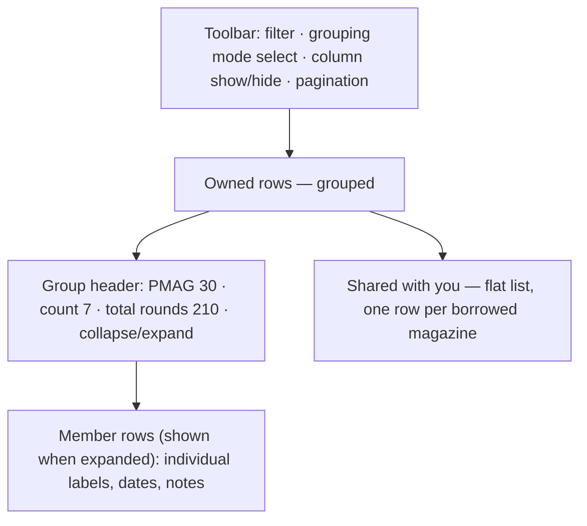

# Shared Data-Table with View Controls and Roll-Up Grouping - Plan

## Goal Capsule

- **Objective:** Replace the app's hand-rolled tables with one shared data-table that gives every table consistent view controls (sort, column show/hide, pagination) and adds owner-scoped roll-up grouping for magazines and firearms.
- **Product authority:** unclesp1d3r.
- **Open blockers:** None on the product side; all product decisions are resolved. One technical unknown to retire during planning: this is the repo's first Shadcn adoption on Next.js 16 / Tailwind v4 / React 19, so a compatibility spike — with a headless-TanStack-Table + hand-styled Tailwind fallback if shadcn's generated components don't integrate cleanly — must precede the migration. This plan consciously replaces issue #36 and intentionally drops its URL-shareability requirement.

---

## Product Contract

### Summary

Adopt a single shared data-table across the whole app (magazines, firearms, users, summary, range-session-history), replacing the hand-rolled table primitive. Every table gains click-to-sort columns, column show/hide, and pagination — plus client-side filter controls on the tables that filter today (magazines and firearms) — with each user's per-table choices remembered in localStorage. Magazines and firearms additionally gain roll-up grouping — collapse owned rows into counted, expandable groups — with magazines grouping by type or label prefix and firearms grouping by type.

### Problem Frame

Two problems sit behind this work. First, inventories with many interchangeable magazines (ten identical PMAGs) render as ten near-duplicate rows, so the flat list buries the signal in repetition and there is no way to scan holdings by kind. Second, the app has five separate tables all built on the same hand-rolled primitive with no shared sorting, no column control, and inconsistent filtering — magazines filter server-side through the URL while firearms already filter client-side — so behavior drifts table to table and every new view affordance would be built five times.

A library-backed table solves both at once: the roll-up is one instance of a general grouping capability, and the view controls land everywhere from one component.

### Key Decisions

- **Shared library data-table over hand-rolling.** Adopt the shadcn/TanStack data-table (the first Shadcn adoption, already on the roadmap). Grouping, sorting, row expansion, and aggregation come from the library, so the app writes grouping *keys*, not grouping *machinery* — there is no accordion/disclosure code in the repo today to reuse.
- **Client-side view operations, persisted in localStorage, not the URL.** Sort, filter, group, paginate, and column visibility run in the browser over the owner-visible row set; the server keeps only owner/grant scoping. Each user's settings persist per table in localStorage and restore on return. This deliberately drops #36's shareable-URL requirement in favor of sticky personal views, fits small owner-scoped inventories, and harmonizes magazines (currently server-filtered) up to match firearms.
- **Prefix grouping matches recorded prefixes, never splits labels.** A magazine joins the longest recorded prefix (the owner's `magazine_label_prefix` list) that its label starts with. This honors #22's deliberate rejection of splitting a label as ambiguous (`AR15001` could start with `AR` or `AR15`).
- **Group owned-only; show borrowed separately.** Roll-ups count only rows the viewer owns; shared-in (borrowed) rows are excluded from groups and listed in a separate flat section. This keeps counts meaningful and preserves per-row owner-gated edit/delete.
- **Group only where items are groupable.** Magazines (interchangeable) and firearms (by their existing `type`) get grouping. Users, summary, and range-session-history get sort, column visibility, and pagination but no grouping.

### Requirements

**Shared data-table adoption**

- R1. A single shared data-table component replaces the hand-rolled table primitive and is used by all five current tables: magazines, firearms, users, summary, and range-session-history.
- R2. Every table provides click-to-sort columns, column show/hide, and pagination. Client-side filtering is a first-class view operation on the tables that filter today — magazines and firearms — and runs in the browser like the other operations (R4); users, summary, and range-session-history are not filtered.
- R3. Each user's per-table view settings — sort, filters, visible columns, page size, and grouping where applicable — persist in localStorage keyed per table and restore on return. Restoration must not cause a visible flash or reflow of columns, sort order, or group collapse-state on load; use a no-flash mechanism (mount-guard or pre-paint read) following the `theme-toggle.tsx` precedent rather than rendering defaults and reapplying saved settings after mount.
- R4. View operations run client-side over the owner-visible row set; the server continues to enforce owner/grant scoping and returns that set.
- R5. Column visibility is a first-class control, and fields not shown today (for example magazine notes and acquired date) can be exposed as optional columns a user opts into.

**Magazine and firearm roll-up grouping**

- R6. The magazines table offers grouping modes None (default), By type, and By label prefix.
- R7. The firearms table offers grouping modes None (default) and By type, using the existing firearm `type` field.
- R8. By type on magazines rolls up rows sharing the same identity — brandModel plus caliber plus baseCapacity plus extensionRounds — into one group.
- R9. By label prefix assigns each magazine to the longest recorded prefix its label starts with; a magazine whose label matches no recorded prefix falls into an "Unprefixed" group.
- R10. Grouping rolls up only rows the viewer owns; shared-in rows are excluded from groups and rendered in a separate flat "Shared with you" section.
- R11. Each group is collapsed by default, shows an accurate member count, and expands to reveal its individual rows.
- R12. Magazine group headers surface total round capacity across members (sum of baseCapacity plus extensionRounds) alongside the count.
- R13. Groups are ordered by count descending, then by name; members within a group are ordered by label by default. While a grouping mode is active, click-to-sort (R2) reorders the members within each group, overriding the default label order; group order stays count-descending/name.
- R14. Grouping applies to the active filtered set — filter first, then group the result. Pagination applies only in the None grouping mode; while a grouping mode is active the grouped view renders all groups on a single page without pagination.

**Accessibility**

- R15. Expand/collapse and all view controls are keyboard operable and exposed via ARIA roles and accessible names; the app uses no `data-testid`.

**Empty states, motion, controls, and responsive behavior**

- R16. The shared table and grouped views specify empty states, reusing the existing `EmptyState` component: an empty "Shared with you" section (no borrowed items), a filter that excludes every row, and — while grouping is active — a filter that leaves a grouping mode with zero groups. Each teaches the interface rather than showing a bare "nothing here".
- R17. Group expand/collapse animates with Motion at roughly 200ms on an ease-out curve (`[0.16, 1, 0.3, 1]`, matching `theme-toggle.tsx` / `toast.tsx`) and honors `prefers-reduced-motion` with an instant fallback.
- R18. The new controls commit to a shared vocabulary inherited by all five tables: column show/hide is a `DropdownMenu` of checkboxes; pagination is prev/next plus a page-size select; and every control's hover, focus, active, and disabled states use the existing DESIGN.md tokens rather than per-table treatments.
- R19. On narrow viewports the table degrades structurally: below the `md` breakpoint, opt-in columns (for example notes and acquired date) auto-collapse out of view, the table scrolls horizontally as a fallback, and expanded group members stack vertically. Column show/hide can still re-reveal an auto-collapsed column.

### Layout

The grouped magazines view composes as a toolbar, the owned grouped table, and a separate borrowed section:

### Key Flows

- F1. Roll up the magazines table.
  - **Trigger:** Owner selects By type on the magazines table.
  - **Steps:** Owned rows collapse into groups keyed by identity, each header showing count and total capacity; borrowed rows drop into the flat "Shared with you" section; the owner expands a group to see its members.
  - **Covered by:** R6, R8, R10, R11, R12, R13.
- F2. Restore a persisted view.
  - **Trigger:** A user who previously sorted, hid columns, or grouped a table returns to it.
  - **Steps:** The table restores the saved per-table settings from localStorage without a visible flash of defaults first (see R3).
  - **Covered by:** R2, R3, R5.

### Acceptance Examples

- AE1. **Covers R9.** Owner has recorded prefixes `AR` and `AR15`; magazine label `AR15001` groups under `AR15` (longest match wins), not `AR`.
- AE2. **Covers R9.** A magazine whose label matches no recorded prefix appears in the "Unprefixed" group.
- AE3. **Covers R10.** Viewer owns 7 identical PMAGs and has 3 more of the same identity shared to them; the By type group shows 7, and the 3 borrowed appear in "Shared with you", not in the count.
- AE4. **Covers R8, R11.** Ten identical magazines collapse into one group whose header count reads 10, and expanding it lists all ten members.
- AE5. **Covers R14.** With a caliber filter active, groups are built only from the magazines that pass the filter.

### Scope Boundaries

- No schema change — grouping keys and prefix assignment are derived at view time; nothing new is persisted per magazine or firearm.
- No shareable or bookmarkable view URLs — this plan replaces issue #36 and intentionally drops its URL-shareability criterion; view state lives in localStorage instead.
- No cross-device sync of view settings — localStorage is per-browser/per-device by design; different viewports warrant different column and layout choices, so settings are intentionally not shared across a user's devices.
- No row selection or bulk-action checkboxes — nothing in the app uses bulk operations today.
- No grouping on the users, summary, or range-session-history tables — those get sort, column visibility, and pagination only.

### Dependencies / Assumptions

- Assumes owner-scoped inventories are small enough to fetch and operate on client-side, so no server-side pagination is required — assumed ceiling ≈ 500 magazines + firearms per owner; revisit server-side pagination if an owner's visible set exceeds that.
- Prefix grouping is only useful when the owner's `magazine_label_prefix` list is populated (from #22); an empty list means every magazine lands in "Unprefixed".
- Introduces a table-library dependency (shadcn/TanStack), the repo's first Shadcn adoption. A pre-implementation spike must confirm shadcn's generated components and TanStack Table integrate with Next.js 16 App Router, React 19, Tailwind v4, and Bun; the fallback is headless TanStack Table with hand-styled Tailwind (dropping the shadcn CLI generation step) if they do not. TanStack Table's own version support (React 18+, TypeScript 5.4+) is already compatible with this repo.

### Outstanding Questions

Deferred to planning:

- Exact optional-column set per table — which currently-hidden fields to expose (for example magazine notes and acquired date).
- Default page size (page size is user-adjustable via the R18 page-size select).
- Whether firearm group headers carry an aggregate beyond count (magazines carry total capacity).
- localStorage key schema and versioning, and which no-flash hydration mechanism satisfies R3 (mount-guard vs. pre-paint cookie/inline-script read).

### Sources / Research

- `app/(app)/magazines/page.tsx`, `app/(app)/magazines/magazines-view.tsx`, `app/(app)/magazines/filter-bar.tsx` — current magazines list, server-side filter, and the `useSearchParams`/`router.replace` URL-filter pattern being retired for magazines.
- `app/(app)/firearms/firearms-view.tsx` — firearms list with an existing client-side `type` filter and `type` field to group on.
- `components/ui/table.tsx` — the hand-rolled table primitive being replaced; also used by `app/(admin)/users/admin-users.tsx`, `app/(app)/summary/page.tsx`, and `app/(app)/firearms/range-session-history.tsx`.
- `src/domain/magazines/prefixes.ts` (`listPrefixes`) and `src/domain/bulkadd/labels.ts` (`generateLabels`, `nextLabelStart`) — recorded-prefix data and the `startsWith` matching logic to reuse for prefix grouping.
- `src/domain/magazines/filter.ts` (`listMagazinesFiltered`) and `src/auth/visibility.ts` (`getVisibleIds`) — owner/grant scoping that produces the visible row set.
