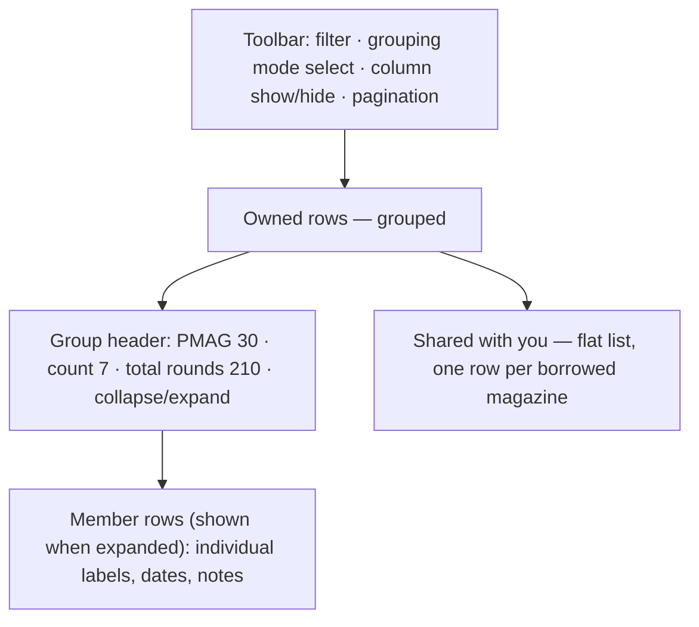
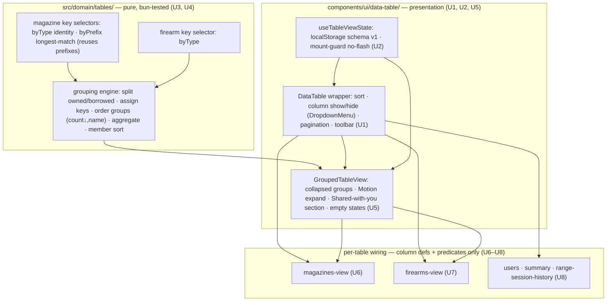
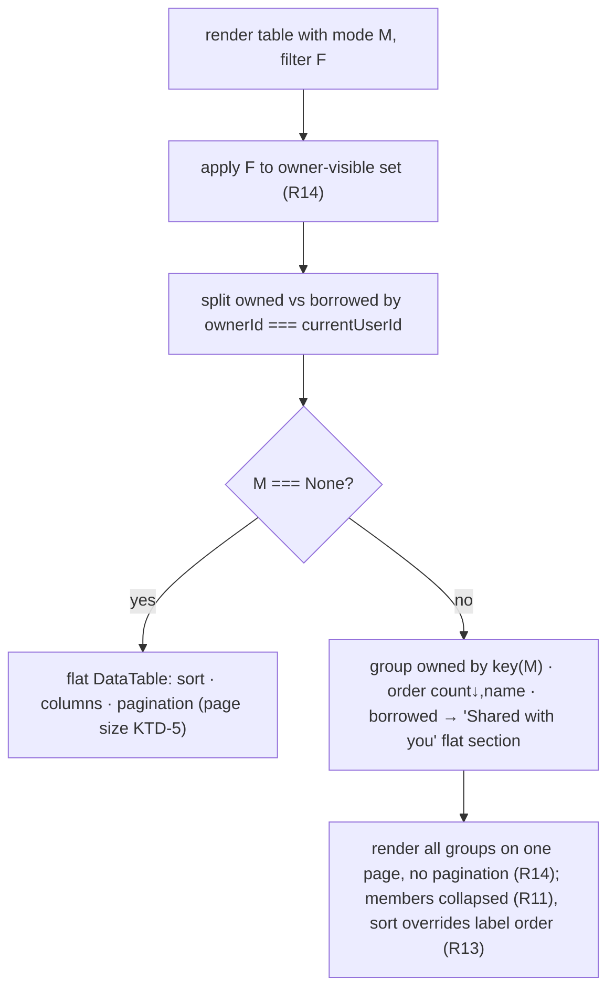

# Shared Data-Table with View Controls and Roll-Up Grouping - Plan

## Goal Capsule

- **Objective:** Replace the app's hand-rolled tables with one shared data-table that gives every table consistent view controls (sort, column show/hide, pagination) and adds owner-scoped roll-up grouping for magazines and firearms.
- **Product authority:** unclesp1d3r.
- **Open blockers:** None on the product side; all product decisions are resolved. One technical unknown to retire during implementation: this is the repo's first Shadcn adoption on Next.js 16 / Tailwind v4 / React 19, so a compatibility spike — with a headless-TanStack-Table + hand-styled Tailwind fallback if shadcn's generated components don't integrate cleanly — is the first implementation unit (U1) and gates the migration. This plan consciously replaces issue #36 and intentionally drops its URL-shareability requirement.

---

## Product Contract

### Summary

Adopt a single shared data-table across the whole app (magazines, firearms, users, summary, range-session-history), replacing the hand-rolled table primitive. Every table gains click-to-sort columns, column show/hide, and pagination — plus client-side filter controls on the tables that filter today (magazines and firearms) — with each user's per-table choices remembered in localStorage. Magazines and firearms additionally gain roll-up grouping — collapse owned rows into counted, expandable groups — with magazines grouping by type or label prefix and firearms grouping by type.

### Problem Frame

Two problems sit behind this work. First, inventories with many interchangeable magazines (ten identical PMAGs) render as ten near-duplicate rows, so the flat list buries the signal in repetition and there is no way to scan holdings by kind. Second, the app has five separate tables all built on the same hand-rolled primitive with no shared sorting, no column control, and inconsistent filtering — magazines filter server-side through the URL while firearms already filter client-side — so behavior drifts table to table and every new view affordance would be built five times.

A library-backed table solves both at once: the roll-up is one instance of a general grouping capability, and the view controls land everywhere from one component.

### Key Decisions

- **Shared library data-table over hand-rolling.** Adopt a shared library data-table (shadcn/TanStack if the U1 compatibility spike succeeds, else headless TanStack Table + hand-styled Tailwind — see KTD-2; the first Shadcn adoption, already on the roadmap). Sorting, row expansion, column visibility, and pagination come from the library; grouping *ordering and aggregation* are hand-rolled (KTD-1), so the app writes grouping *keys* and *ordering*, not accordion/disclosure machinery — there is no such code in the repo today to reuse.
- **Client-side view operations, persisted in localStorage, not the URL.** Sort, filter, group, paginate, and column visibility run in the browser over the owner-visible row set; the server keeps only owner/grant scoping. Each user's settings persist per table in localStorage and restore on return. This deliberately drops #36's shareable-URL requirement in favor of sticky personal views, fits small owner-scoped inventories, and harmonizes magazines (currently server-filtered) up to match firearms.
- **Prefix grouping matches recorded prefixes, never splits labels.** A magazine joins the longest recorded prefix (the owner's `magazine_label_prefix` list) that its label starts with. This honors #22's deliberate rejection of splitting a label as ambiguous (`AR15001` could start with `AR` or `AR15`).
- **Group owned-only; show borrowed separately.** Roll-ups count only rows the viewer owns; shared-in (borrowed) rows are excluded from groups and listed in a separate flat section. This keeps counts meaningful and preserves per-row owner-gated edit/delete.
- **Group only where items are groupable.** Magazines (interchangeable) and firearms (by their existing `type`) get grouping. Users, summary, and range-session-history get sort, column visibility, and pagination but no grouping.

### Requirements

**Shared data-table adoption**

- R1. A single shared data-table component replaces the hand-rolled table primitive and is used by all five current tables: magazines, firearms, users, summary, and range-session-history.
- R2. Every table provides click-to-sort columns, column show/hide, and pagination. Client-side filtering is a first-class view operation on the tables that filter today — magazines and firearms — and runs in the browser like the other operations (R4); users, summary, and range-session-history are not filtered.
- R3. Each user's per-table view settings — sort, filters, visible columns, page size, and grouping where applicable — persist in localStorage keyed per table and restore on return. Restoration must not cause a visible flash or reflow of columns, sort order, or group collapse-state on load; use a no-flash mechanism (mount-guard or pre-paint read) following the `theme-toggle.tsx` precedent rather than rendering defaults and reapplying saved settings after mount.
- R4. View operations run client-side over the owner-visible row set; the server continues to enforce owner/grant scoping and returns that set.
- R5. Column visibility is a first-class control, and fields not shown today (for example magazine notes and acquired date) can be exposed as optional columns a user opts into.

**Magazine and firearm roll-up grouping**

- R6. The magazines table offers grouping modes None (default), By type, and By label prefix.
- R7. The firearms table offers grouping modes None (default) and By type, using the existing firearm `type` field.
- R8. By type on magazines rolls up rows sharing the same identity — brandModel plus caliber plus baseCapacity plus extensionRounds — into one group.
- R9. By label prefix assigns each magazine to the longest recorded prefix its label starts with; a magazine whose label matches no recorded prefix falls into an "Unprefixed" group.
- R10. Grouping rolls up only rows the viewer owns; shared-in rows are excluded from groups and rendered in a separate flat "Shared with you" section.
- R11. Each group is collapsed by default, shows an accurate member count, and expands to reveal its individual rows.
- R12. Magazine group headers surface total round capacity across members (sum of baseCapacity plus extensionRounds) alongside the count.
- R13. Groups are ordered by count descending, then by name; members within a group are ordered by label by default. While a grouping mode is active, click-to-sort (R2) reorders the members within each group, overriding the default label order; group order stays count-descending/name.
- R14. Grouping applies to the active filtered set — filter first, then group the result. Pagination applies only in the None grouping mode; while a grouping mode is active the grouped view renders all groups on a single page without pagination.

**Accessibility**

- R15. Expand/collapse and all view controls are keyboard operable and exposed via ARIA roles and accessible names; the app uses no `data-testid`.

**Empty states, motion, controls, and responsive behavior**

- R16. The shared table and grouped views specify empty states, reusing the existing `EmptyState` component: an empty "Shared with you" section (no borrowed items), a filter that excludes every row, and — while grouping is active — a filter that leaves a grouping mode with zero groups. Each teaches the interface rather than showing a bare "nothing here".
- R17. Group expand/collapse animates with Motion at roughly 200ms on an ease-out curve (`[0.16, 1, 0.3, 1]`, matching `theme-toggle.tsx` / `toast.tsx`) and honors `prefers-reduced-motion` with an instant fallback.
- R18. The new controls commit to a shared vocabulary inherited by all five tables: column show/hide is a `DropdownMenu` of checkboxes; pagination is prev/next plus a page-size select; and every control's hover, focus, active, and disabled states use the existing DESIGN.md tokens rather than per-table treatments.
- R19. On narrow viewports the table degrades structurally: below the `md` breakpoint, opt-in columns (for example notes and acquired date) auto-collapse out of view, the table scrolls horizontally as a fallback, and expanded group members stack vertically. Column show/hide can still re-reveal an auto-collapsed column.

### Layout

The grouped magazines view composes as a toolbar, the owned grouped table, and a separate borrowed section:



### Key Flows

- F1. Roll up the magazines table.
  - **Trigger:** Owner selects By type on the magazines table.
  - **Steps:** Owned rows collapse into groups keyed by identity, each header showing count and total capacity; borrowed rows drop into the flat "Shared with you" section; the owner expands a group to see its members.
  - **Covered by:** R6, R8, R10, R11, R12, R13.
- F2. Restore a persisted view.
  - **Trigger:** A user who previously sorted, hid columns, or grouped a table returns to it.
  - **Steps:** The table restores the saved per-table settings from localStorage without a visible flash of defaults first (see R3).
  - **Covered by:** R2, R3, R5.

### Acceptance Examples

- AE1. **Covers R9.** Owner has recorded prefixes `AR` and `AR15`; magazine label `AR15001` groups under `AR15` (longest match wins), not `AR`.
- AE2. **Covers R9.** A magazine whose label matches no recorded prefix appears in the "Unprefixed" group.
- AE3. **Covers R10.** Viewer owns 7 identical PMAGs and has 3 more of the same identity shared to them; the By type group shows 7, and the 3 borrowed appear in "Shared with you", not in the count.
- AE4. **Covers R8, R11.** Ten identical magazines collapse into one group whose header count reads 10, and expanding it lists all ten members.
- AE5. **Covers R14.** With a caliber filter active, groups are built only from the magazines that pass the filter.

### Scope Boundaries

- No schema change — grouping keys and prefix assignment are derived at view time; nothing new is persisted per magazine or firearm.
- No shareable or bookmarkable view URLs — this plan replaces issue #36 and intentionally drops its URL-shareability criterion; view state lives in localStorage instead.
- No cross-device sync of view settings — localStorage is per-browser/per-device by design; different viewports warrant different column and layout choices, so settings are intentionally not shared across a user's devices.
- No row selection or bulk-action checkboxes — nothing in the app uses bulk operations today.
- No grouping on the users, summary, or range-session-history tables — those get sort, column visibility, and pagination only.

### Dependencies / Assumptions

- Assumes owner-scoped inventories are small enough to fetch and operate on client-side, so no server-side pagination is required — assumed ceiling ≈ 500 magazines + firearms per owner; revisit server-side pagination if an owner's visible set exceeds that.
- Prefix grouping is only useful when the owner's `magazine_label_prefix` list is populated (from #22); an empty list means every magazine lands in "Unprefixed".
- Introduces a table-library dependency (shadcn/TanStack), the repo's first Shadcn adoption. A pre-implementation spike (U1) must confirm shadcn's generated components and TanStack Table integrate with Next.js 16 App Router, React 19, Tailwind v4, and Bun; the fallback is headless TanStack Table with hand-styled Tailwind (dropping the shadcn CLI generation step) if they do not. TanStack Table's own version support (React 18+, TypeScript 5.4+) is already compatible with this repo.

### Sources / Research

- `app/(app)/magazines/page.tsx`, `app/(app)/magazines/magazines-view.tsx`, `app/(app)/magazines/filter-bar.tsx` — current magazines list, server-side filter, and the `useSearchParams`/`router.replace` URL-filter pattern being retired for magazines.
- `app/(app)/firearms/firearms-view.tsx` — firearms list with an existing client-side `type` filter and `type` field to group on.
- `components/ui/table.tsx` — the hand-rolled table primitive being replaced; also used by `app/(admin)/users/admin-users.tsx`, `app/(app)/summary/page.tsx`, and `app/(app)/firearms/range-session-history.tsx`.
- `src/domain/magazines/prefixes.ts` (`listPrefixes`) and `src/domain/bulkadd/labels.ts` (`generateLabels`, `nextLabelStart`) — recorded-prefix data and the `startsWith` matching logic to reuse for prefix grouping.
- `src/domain/magazines/filter.ts` (`listMagazinesFiltered`) and `src/auth/visibility.ts` (`getVisibleIds`) — owner/grant scoping that produces the visible row set.

---

## Planning Contract

> **Product Contract preservation:** Requirement, Flow, and Acceptance-Example IDs (R1–R19, F1–F2, AE1–AE5) are preserved verbatim; enrichment adds HOW (Key Technical Decisions, Implementation Units, Verification Contract, Definition of Done). One clarification to a Key Decision: the "Shared library data-table" bullet was hedged to match the U1 spike gate the Product Contract already states in Dependencies/Assumptions (shadcn is spike-gated, not committed), and to reflect KTD-1 (grouping ordering/aggregation is hand-rolled, not library-provided). No product scope changed. Four questions the Product Contract deferred "to planning" are resolved below as KTD-4 through KTD-7 (optional-column sets, default page size, firearm group aggregate, localStorage schema + no-flash mechanism); KTD-10/KTD-11 resolve UX-decision gaps surfaced in document review.

### Research grounding (repo reality this plan is built on)

- **No existing view-control machinery.** `components/ui/table.tsx` primitives (`DataTable/THead/TH/TRow/TD`) support no sort, hide/show, pagination, or grouping. There is **zero** DropdownMenu / Popover / Combobox / Radix / `class-variance-authority` / `clsx` / `tailwind-merge` in the repo — all must be added. The only menu-like control is the native `<select>` wrapper `components/ui/select.tsx`.
- **shadcn is wired but unused.** `.mcp.json` registers the `shadcn` MCP server and `shadcn@^4.12.0` is a devDependency, but there is **no `components.json`**, no generated components, and **no `@tanstack/react-table`**. `components/ui/cn.ts` is a hand-rolled `classes.filter(Boolean).join(" ")` — **not** clsx+tailwind-merge — so shadcn-generated components need `cn` reconciled. Tailwind v4 is CSS-first: no `tailwind.config.*`; tokens live in `app/globals.css` under `@theme inline` (`--paper`, `--ink`, `--blaze`, `--radius`, `--radius-lg`, …), not shadcn's default `--background`/`--foreground`.
- **Owned vs borrowed is computed inline, not stored.** No `isOwned`/`isShared` field on any row; every view derives it as `item.ownerId === currentUserId`. `getVisibleIds(db, actorId, parentType)` returns owned ∪ granted. `MagazineListItem` = `{ id, ownerId, brandModel, caliber, baseCapacity, extensionRounds, label, acquiredDate, notes, compatibleFirearmIds, compatibleFirearmNames }`. `FirearmListItem` carries `{ id, ownerId, name, nickname, caliber, type, action, subtype, manufacturer, serialNumber, notes, magazineCount, roundTotal }`; `type ∈ FIREARM_TYPES` (`src/domain/firearms/constants.ts`).
- **Test harnesses that exist:** `bun test src` over `src/domain/**/__tests__/*.test.ts` (pure + `DATABASE_URL`-gated integration via `src/test-support/factories.ts`); Playwright `e2e/` (Testcontainers Postgres, `workers: 1`, storageState auth). **There are zero `.test.tsx` component tests and no React Testing Library convention.** Do not invent one — route pure logic to bun `__tests__` and interactive/persistence/a11y behavior to `e2e/` specs (targeting ARIA roles / accessible names / visible text only; **no `data-testid`**, per `AGENTS.md`).
- **Reusable pieces:** `EmptyState` (`components/ui/feedback.tsx`); `motion` (`^12.42.2`, imported `from "motion/react"`) with easing `[0.16, 1, 0.3, 1]`; `theme-toggle.tsx` mount-guard (`useState(false)` → `useEffect(setMounted(true))`, render neutral fallback until mounted); `Button` ghost variant for control triggers; DESIGN.md "Machined Console" table tokens (`--radius-lg` frame, `--paper-sunken` mono-uppercase header, `blaze-soft/45` hover, 2px `--blaze` focus ring, tabular right-aligned numbers, no colored left-border stripes, exponential ease-out only).

### Key Technical Decisions

- **KTD-1 — Grouping logic lives in pure domain functions; the table library is view-only.** Group-key derivation, owned/borrowed split, group ordering (count desc → name), aggregates, and member default-sort are pure functions in `src/domain/tables/` — **not** TanStack's native `getGroupedRowModel`/`aggregationFns`. Rationale: (a) the AE-bearing behavior (AE1–AE5) becomes bun unit tests in the harness that already exists, since the repo has no component-test harness; (b) native grouping cannot express count-descending-then-name group order (R13) or a separate owned-only/borrowed split (R10) without fighting the library. The library (or fallback) supplies sort, column-visibility, and pagination over flat row sets only.
- **KTD-2 — U1 is a spike-and-foundation unit with a branch-agnostic wrapper API.** `ce-plan` runs no code, so the shadcn-vs-fallback unknown is retired in U1, not here. U1 delivers a shared `DataTable` wrapper whose public props are identical in both branches (shadcn-generated primitives **or** headless `@tanstack/react-table` + hand-styled Tailwind). Every later unit references "the shared DataTable wrapper," never shadcn component names, so the spike outcome cannot invalidate downstream units. `@tanstack/react-table` is added regardless of branch (it is the engine in both). The shadcn branch additionally adds `components.json` (pointing `tailwind` at `app/globals.css`), reconciles `cn`, and maps DESIGN.md tokens; the fallback branch skips CLI generation and hand-writes the primitives against existing tokens.
- **KTD-3 — Retire the magazines URL filter; unify on client-side filter state.** `app/(app)/magazines/filter-bar.tsx`'s `useSearchParams`/`router.replace` pattern and `page.tsx`'s `searchParams` filtering are removed; magazines filter client-side over the full owner-visible set like firearms already do. The server page stops reading `searchParams` and returns the unfiltered visible set. Debounced free-text search behavior (250ms) and the `/`-to-focus shortcut are preserved in the new client toolbar. **`listMagazinesFiltered` keeps its filter parameters for API stability but the magazines page calls it with an empty filter**; deletion of the domain filter is out of scope (deferred follow-up).
- **KTD-4 — Optional-column sets (resolves deferred Q1).** Default-visible vs opt-in per table: **Magazines** default `{ brandModel, caliber, effectiveCapacity, label, compatible, actions }`; opt-in `{ notes, acquiredDate }` (auto-collapse below `md`, R19). **Firearms** default `{ name, caliber, type, action, magazineCount, roundTotal, actions }`; opt-in `{ serialNumber, manufacturer, subtype, notes }` (serial keeps its existing owner-gated visibility as the opt-in default-on-when-`showSerial`). **Users** default all `{ email, name, role, status, actions }`; no opt-in columns. **Summary** aggregate tables default all columns; no opt-in. **Range-session-history** default `{ date, rounds, notes, actions }`; no opt-in.
- **KTD-5 — Default page size 25, options {10, 25, 50, 100} (resolves deferred Q2).** 25 fits the assumed ≤500-item ceiling in a few pages without overwhelming first paint. Page-size select (R18) offers the four options; choice persists per table (R3).
- **KTD-6 — Firearm group headers show count only (resolves deferred Q3).** Firearms have no natural capacity analog to magazines' round total; the header carries member count only. (Round-total-across-members was considered and rejected as low-signal — the flat table already sums per-firearm rounds.) Magazine headers carry count **and** total round capacity (R12).
- **KTD-7 — localStorage schema + no-flash mechanism (resolves deferred Q4).** Key `magstacker:table:<tableId>:v1`, one entry per table, value a JSON object `{ version: 1, sort, columnVisibility, pageSize, filters, grouping }`. `tableId ∈ { magazines, firearms, users, summary-caliber, summary-firearm, range-session-history }`. A malformed or wrong-version entry is discarded and defaults apply (fail-safe, never throw). **No-flash mechanism: mount-guard rendering a neutral skeleton shell** (fixed-height table placeholder) until `mounted`, following `theme-toggle.tsx` — the server/first paint renders the skeleton, not the default view, so saved settings are applied on the first real render with no defaults-then-swap flash (R3). Chosen over a pre-paint inline-script cookie read for KISS: the tables are already client components fed server props, and a skeleton avoids both the hydration-mismatch risk and the flash.
- **KTD-8 — Summary adopts the wrapper over its pre-aggregated rows (resolves the R1/Summary mismatch).** `app/(app)/summary/page.tsx` is a server component that hand-aggregates via `computeSummary()` into two roll-up tables (By caliber, By firearm). Those pre-aggregated rows **are** the row set fed to the shared wrapper: Summary keeps server-side aggregation, then gets sort + column-visibility + pagination over the aggregate rows (R1, R2). It gets **no** filter and **no** grouping (R6/R7 do not apply — it is already aggregated). This is surfaced explicitly because R1 ("all five adopt the shared table") does not by itself imply a clean fit for a pre-aggregated surface.
- **KTD-9 — Persistence and grouping are shared modules, consumed by thin per-table wiring.** `useTableViewState` (persistence hook, KTD-7) and the grouping engine (KTD-1) are written once and imported by each table's view. Per-table units (U6–U8) contribute column definitions, filter predicates, and grouping-key selectors only — no re-implemented machinery (DRY).
- **KTD-10 — At least one non-actions column is always visible.** The column-visibility `DropdownMenu` must not let a user hide every column: the last enabled non-actions column's checkbox is disabled (cannot be unchecked), and the actions column is exempt from the menu entirely. Rationale: without a floor, a user can hide all columns, and because the choice persists (KTD-7/R3) they return to a blank, broken-looking table every visit with no obvious recovery. The wrapper (U1) enforces this generically across all five tables; it is not per-table configuration.
- **KTD-11 — Grouping-mode control, filter-to-borrowed, and focus-return (document-review UX gaps).** (a) The grouping-mode selector (None / By type / By label prefix) reuses the existing `components/ui/select.tsx` pattern, matching the page-size select, so U6 and U7 do not invent two different widgets. (b) The active client-side filter applies to **both** the owned/grouped set **and** the borrowed "Shared with you" section — filtering only owned rows would make the two halves of one screen behave inconsistently under the same control (extends R14's filter-first framing to the borrowed section). (c) Collapsing a group whose keyboard focus sits inside a member row returns focus to that group's header/expand control, avoiding a WCAG 2.4.3 focus-loss when the focused element is hidden (U5/R15).

### High-Level Technical Design

Layering — pure logic at the bottom (bun-testable), presentation on top, per-table wiring at the edges:



Grouping-mode → rendering decision (applies to magazines/firearms only):



### Output Structure

New files this plan introduces (per-table wiring modifies existing files in place):

```text
components/ui/data-table/
  data-table.tsx          # U1 — shared wrapper (sort, column-visibility, pagination, toolbar)
  data-table-toolbar.tsx  # U1 — filter slot · grouping-mode select · column menu · pagination
  column-menu.tsx         # U1 — DropdownMenu of column checkboxes (R18)
  pagination.tsx          # U1 — prev/next + page-size select (R18)
  grouped-table-view.tsx  # U5 — grouped rendering: group headers, Motion expand, Shared-with-you, empty states
  types.ts                # U1 — branch-agnostic props, ColumnDef shape, ViewState shape
components/ui/dropdown-menu.tsx   # U1 — DropdownMenu primitive (shadcn-generated or hand-styled fallback)
hooks/use-table-view-state.ts     # U2 — localStorage persistence + mount-guard no-flash
src/domain/tables/
  grouping.ts             # U3 — pure grouping engine (split, order, aggregate, member sort)
  magazine-groups.ts      # U3 — magazine byType identity + byPrefix longest-match key selectors
  firearm-groups.ts       # U4 — firearm byType key selector
  __tests__/
    grouping.test.ts       # U3
    magazine-groups.test.ts # U3 — AE1, AE2, AE3, AE4, AE5
    firearm-groups.test.ts  # U4
components.json           # U1 — only if shadcn branch is chosen
e2e/table-view-controls.spec.ts   # U6/U7/U8 — sort, column show/hide, pagination, persistence, grouping, a11y
```

The tree is a scope declaration, not a constraint; per-unit `Files:` sections are authoritative. `components/ui/table.tsx` primitives are retired once all five tables migrate (U8 removes them if no consumer remains).

---

## Implementation Units

### Phase 1 — Foundation

### U1. Spike + shared DataTable wrapper foundation

- **Goal:** Retire the shadcn-vs-fallback unknown and deliver a branch-agnostic shared `DataTable` wrapper providing sort, column show/hide, and pagination over a flat row set, styled to DESIGN.md and rendering accessible semantic markup.
- **Requirements:** R1, R2, R5, R15, R18, R19.
- **Dependencies:** none.
- **Files:** `components/ui/data-table/data-table.tsx`, `components/ui/data-table/data-table-toolbar.tsx`, `components/ui/data-table/column-menu.tsx`, `components/ui/data-table/pagination.tsx`, `components/ui/data-table/types.ts`, `components/ui/dropdown-menu.tsx`, `components/ui/cn.ts` (reconcile if shadcn branch), `components.json` (shadcn branch only), `app/globals.css` (token mapping if shadcn branch), `package.json` (add `@tanstack/react-table`; shadcn branch also adds Radix/CVA/clsx/tailwind-merge), `e2e/table-view-controls.spec.ts` (first specs).
- **Approach:** First resolve the decision gate — attempt the shadcn CLI data-table generation on Next.js 16 / React 19 / Tailwind v4 / Bun. **Decision gate:** if shadcn's generated components integrate cleanly (build passes, tokens map, `cn` reconciled, `just ci-check` green), take the shadcn branch; otherwise fall back to headless `@tanstack/react-table` + hand-styled Tailwind primitives reusing existing DESIGN.md tokens and the hand-rolled `cn`. Either branch exposes the identical `DataTable` props in `types.ts` (columns, rows, view-state, toolbar slots). Use `@tanstack/react-table` v8 stable (`useReactTable`, `getSortedRowModel`, `getPaginationRowModel`, `flexRender`). Column show/hide is a `DropdownMenu` of checkboxes (R18), enforcing the KTD-10 floor (at least one non-actions column stays visible; the actions column is exempt from the menu). Pagination is prev/next + page-size select (KTD-5). Preserve DESIGN.md table styling: `--radius-lg` frame, `--paper-sunken` mono-uppercase headers, `blaze-soft/45` row hover, 2px `--blaze` focus ring on every control, right-aligned tabular numbers, no colored left-border stripe. Header `flexRender` output must land inside real `<th scope="col">`; every control (sort toggle, column-menu trigger, pagination buttons, page-size select) gets a discoverable accessible name (R15). Below `md`, opt-in columns auto-collapse and the frame scrolls horizontally (R19). Persistence is wired in U2, not here.
- **Execution note:** Start with the spike/decision gate and record the chosen branch in a one-line comment at the top of `data-table.tsx`; then build the wrapper. Verify integration with a runtime smoke (a throwaway page or the first migrated table in U6) plus `just ci-check`, since this is the repo's first library adoption.
- **Patterns to follow:** DESIGN.md §5 Tables/Buttons/Inputs; `components/ui/button.tsx` ghost variant for control triggers; `components/ui/select.tsx` for the page-size select styling; `components/ui/table.tsx` for the exact header typography to preserve.
- **Test scenarios:**
  - Playwright (`e2e/table-view-controls.spec.ts`): clicking a column header sorts ascending then descending, indicated via `aria-sort`; the column-visibility menu (opened by an accessibly-named trigger) hides a checked column and re-reveals it; pagination prev/next moves the page and the page-size select changes rows-per-page; every control is reachable and operable by keyboard (Tab/Enter/Space) and exposes an accessible name (R15).
  - Covers R2, R5, R15, R18. `Test expectation: interactive/DOM behavior is e2e-only — no component-test harness exists (KTD-1 rationale).`
- **Verification:** `bun run typecheck` and `bun run lint` pass; `just ci-check` green; a smoke render of the wrapper shows sortable/paginated columns with the DESIGN.md styling; the chosen branch is recorded.

### U2. View-state persistence hook with no-flash restore

- **Goal:** Persist each table's view settings to localStorage under the KTD-7 schema and restore them without a flash of defaults.
- **Requirements:** R3.
- **Dependencies:** U1.
- **Files:** `hooks/use-table-view-state.ts`, `components/ui/data-table/data-table.tsx` (consume the hook), `e2e/table-view-controls.spec.ts` (persistence specs), `hooks/__tests__/` (only if any pure serialize/migrate helper is extracted; interactive behavior is e2e).
- **Approach:** `useTableViewState(tableId, defaults)` returns `{ viewState, setViewState, mounted }`. Read/write `magstacker:table:<tableId>:v1` (KTD-7). On read, validate shape and `version`; a malformed or wrong-version entry is discarded and defaults returned (fail-safe, never throw — wrap `JSON.parse` in try/catch, log nothing to console per repo rules). No-flash via mount-guard: `mounted` starts `false`, flips `true` in `useEffect`; the `DataTable` renders a fixed-height neutral skeleton shell until `mounted`, then renders with restored settings applied on the first real paint (KTD-7, following `theme-toggle.tsx`). Writes are immutable (spread into a new object, never mutate prior state) per coding-style. Extract any pure serialize/parse/migrate logic into a small module so it can be bun-unit-tested; keep the React hook itself thin.
- **Execution note:** If a pure `parseViewState`/`serializeViewState` helper is extracted, add characterization-style unit tests for the malformed/wrong-version fail-safe path before wiring it into the hook.
- **Patterns to follow:** `components/ui/theme-toggle.tsx` mount-guard.
- **Test scenarios:**
  - Bun unit (if helper extracted): valid v1 JSON round-trips; malformed JSON returns defaults; wrong `version` returns defaults; missing key returns defaults. Names input → expected output explicitly.
  - Playwright: set a sort + hide a column + change page size on the magazines table, reload, and the same sort/columns/page-size are in effect with no visible flash of the default layout (assert post-reload state directly; F2). Covers R3.
- **Verification:** `bun test src` passes any extracted-helper tests; the persistence e2e spec is green; reload shows restored state with no defaults-then-swap.

### Phase 2 — Grouping domain logic (pure, bun-tested)

### U3. Magazine grouping engine and key selectors

- **Goal:** Pure functions that split owned/borrowed, assign magazine group keys (By type identity, By label prefix longest-match), order groups, aggregate capacity, and order members — carrying AE1–AE5.
- **Requirements:** R6, R8, R9, R10, R11, R12, R13, R14, R16.
- **Dependencies:** none (pure; can run in parallel with U1/U2).
- **Files:** `src/domain/tables/grouping.ts`, `src/domain/tables/magazine-groups.ts`, `src/domain/tables/__tests__/grouping.test.ts`, `src/domain/tables/__tests__/magazine-groups.test.ts`.
- **Approach:** `grouping.ts` exports a generic `buildGroups(rows, { ownerId, keyOf, aggregateOf?, memberSort })` that: splits rows into owned (`row.ownerId === ownerId`) and borrowed; assigns each owned row a group key via `keyOf`; builds groups; orders groups by count descending then group name ascending (R13); computes an optional per-group aggregate; orders members by `memberSort` (default label ascending, R13); returns `{ groups: GroupModel[], borrowed: Row[] }`. Grouping consumes an already-filtered row set — the caller filters first (R14). `magazine-groups.ts` exports `magazineByTypeKey(m)` = stable composite of `brandModel|caliber|baseCapacity|extensionRounds` with a human-readable group name (R8); `magazineByPrefixKey(m, prefixes)` = the **longest** recorded prefix in `prefixes` for which `m.label.startsWith(prefix)`, else the sentinel `"Unprefixed"` group (R9) — reuse the `startsWith` semantics from `src/domain/bulkadd/labels.ts` (`nextLabelStart`), matching the longest first by sorting prefixes by length descending; and `magazineCapacityAggregate(members)` = Σ`(baseCapacity + extensionRounds)` (R12). Prefix ties are impossible (a prefix set has one longest match by length; equal-length distinct prefixes cannot both be a prefix of the same string). All functions pure and immutable.
- **Execution note:** Implement test-first — these functions carry the acceptance examples and are the plan's testable core (KTD-1).
- **Patterns to follow:** `src/domain/bulkadd/labels.ts` `nextLabelStart` startsWith matching; `src/domain/magazines/prefixes.ts` `listPrefixes` return shape (`string[]`, alphabetical — re-sort by length for longest-match).
- **Test scenarios (bun `__tests__`):**
  - `Covers AE1.` prefixes `["AR", "AR15"]`, label `AR15001` → group `AR15`, not `AR`.
  - `Covers AE2.` label matching no recorded prefix → `Unprefixed` group.
  - `Covers AE3.` 7 owned + 3 borrowed of same identity → By type group count 7; the 3 borrowed returned in `borrowed`, excluded from the group.
  - `Covers AE4.` 10 identical owned magazines → one group, count 10, all 10 present as members.
  - `Covers AE5.` grouping over a pre-filtered subset builds groups only from passed rows (verify the engine never re-reads an unfiltered set).
  - Group ordering: groups with counts 3, 7, 3 order as 7 then the two 3s by name ascending (R13). Empty prefix list → every magazine in `Unprefixed`. Members default-sorted by label ascending; a supplied `memberSort` overrides it (R13). Capacity aggregate sums `baseCapacity + extensionRounds` across members (R12). Empty owned set → zero groups (feeds the R16 empty-state); empty borrowed → empty `borrowed` array.
- **Verification:** `bun test src` green with all AE-tagged cases passing.

### U4. Firearm grouping key selector

- **Goal:** Reuse the U3 grouping engine for firearms grouped By type on the existing `type` field, count-only header.
- **Requirements:** R7, R10, R11, R13, R14, R16.
- **Dependencies:** U3.
- **Files:** `src/domain/tables/firearm-groups.ts`, `src/domain/tables/__tests__/firearm-groups.test.ts`.
- **Approach:** `firearmByTypeKey(f)` = `f.type` with `firearmTypeLabel(f.type)` as the display name (`src/domain/firearms/constants.ts`), feeding `buildGroups` with no aggregate (count only, KTD-6). Owned/borrowed split and group ordering come from U3 unchanged.
- **Patterns to follow:** `src/domain/firearms/constants.ts` (`FIREARM_TYPES`, `firearmTypeLabel`); U3 `buildGroups`.
- **Test scenarios (bun `__tests__`):** firearms of types pistol×3, rifle×5 → two groups ordered rifle(5), pistol(3); group name is the friendly label; borrowed firearm excluded from groups and returned in `borrowed` (R10); header aggregate is undefined/count-only (KTD-6). Covers R7, R10.
- **Verification:** `bun test src` green.

### Phase 3 — Grouped presentation

### U5. Grouped table view (collapse, Motion, borrowed section, empty states)

- **Goal:** Render owned groups (collapsed by default, count + optional aggregate header, keyboard-operable expand/collapse with Motion), a separate "Shared with you" flat section, and the three grouped empty states.
- **Requirements:** R10, R11, R12, R13, R14, R15, R16, R17, R19.
- **Dependencies:** U1, U3.
- **Files:** `components/ui/data-table/grouped-table-view.tsx`, `components/ui/data-table/types.ts` (extend for group model), `e2e/table-view-controls.spec.ts` (grouped specs).
- **Approach:** Consumes `{ groups, borrowed }` from the U3 engine and the shared column definitions from the U1 wrapper (member rows reuse the same columns). Each group renders a header row (group name, count, magazine capacity aggregate when present per KTD-6/R12) with an accessibly-named expand/collapse control (`aria-expanded`, `aria-controls`; button is keyboard-operable, R15). Collapsed by default (R11). Collapsing a group returns focus to its header control when focus was inside a now-hidden member row (KTD-11c). Expand animates height/opacity with Motion (`from "motion/react"`, `AnimatePresence`, easing `[0.16, 1, 0.3, 1]`, ~200ms) and honors `prefers-reduced-motion` with an instant fallback (R17). While grouping is active, all groups render on one page with no pagination (R14); member sort overrides default label order when a sort is set (R13). Because KTD-1 keeps member sort as a plain comparator (not TanStack row sorting), **`grouped-table-view.tsx` owns the sort bridge**: it translates the shared wrapper's active `{ columnId, direction }` sort state into the `memberSort` comparator passed to `buildGroups` (U3), and if the sorted column is hidden it falls back to the default label order. Below `md`, expanded members stack vertically (R19). Empty states reuse `EmptyState` (R16): empty "Shared with you", filter-excludes-every-row, and grouping-with-zero-groups — each with a teaching message, not a bare blank.
- **Patterns to follow:** `components/ui/theme-toggle.tsx` / `components/ui/toast.tsx` Motion + easing + reduced-motion; `components/ui/feedback.tsx` `EmptyState`; DESIGN.md "lit active row" rule (filled accent dot, never a left-border stripe) for any expanded-group emphasis.
- **Test scenarios (Playwright, ARIA/accessible-name targeted):**
  - `Covers R11.` a group renders collapsed; activating its expand control (click and via keyboard) reveals member rows and flips `aria-expanded`.
  - `Covers AE4.` a 10-member group header reads count 10; expanding lists ten rows.
  - `Covers R12.` a magazine group header shows the total round capacity alongside the count.
  - `Covers R10/AE3.` borrowed rows appear under "Shared with you", never inside a group; count excludes them.
  - `Covers R16.` no-borrowed → "Shared with you" shows its teaching empty state; a filter matching zero rows shows the filter empty state; a grouping mode with zero groups shows the grouped empty state.
  - `Covers R14.` with grouping active, no pagination controls render; toggling back to None restores pagination.
  - `Covers R17.` with `prefers-reduced-motion` emulated, expand is instant (no animated height).
  - `Test expectation: presentation/interaction is e2e-only per KTD-1.`
- **Verification:** grouped e2e specs green; reduced-motion path verified via Playwright media emulation.

### Phase 4 — Migrate the five tables

### U6. Migrate magazines table (client filter + grouping modes)

- **Goal:** Move magazines onto the shared wrapper, retire the URL filter for a client-side filter, and wire grouping modes None / By type / By label prefix with the optional notes + acquired-date columns.
- **Requirements:** R1, R2, R3, R4, R5, R6, R8, R9, R10, R11, R12, R13, R14, R16, R19.
- **Dependencies:** U1, U2, U3, U5.
- **Files:** `app/(app)/magazines/magazines-view.tsx` (adopt wrapper + grouping toolbar), `app/(app)/magazines/page.tsx` (stop reading `searchParams`; return full visible set; keep passing `prefixOptions`), `app/(app)/magazines/filter-bar.tsx` (removed or reduced to the client toolbar filter slot), `e2e/table-view-controls.spec.ts` and existing `e2e/inventory-crud.spec.ts` (update magazines filter assertions).
- **Approach:** Define magazine `ColumnDef`s (KTD-4 defaults + opt-in notes/acquiredDate). Provide a client filter predicate (brand/model substring debounced 250ms, caliber exact, compatible-firearm) inside the wrapper toolbar (R2) — preserving `filter-bar.tsx`'s debounce and `/`-to-focus shortcut but reading from client state, not the URL (KTD-3). Grouping-mode select offers None / By type / By label prefix (R6); By type uses `magazineByTypeKey`, By label prefix uses `magazineByPrefixKey` with the owner's `prefixOptions` (already passed from `page.tsx`). Filter-then-group ordering (R14) is enforced by the wrapper (filter predicate runs before `buildGroups`); the active filter also narrows the borrowed "Shared with you" section, not just the owned groups (KTD-11b). Owner-gated ShareControl/Delete per row unchanged; `useRowFlash`/`useDeleteConfirmation` preserved. `page.tsx` drops the `searchParams` read and the `filtered` boolean; `listMagazinesFiltered` is called with an empty filter (KTD-3). Persist view state under `tableId: "magazines"` (U2).
- **Execution note:** This is the first full consumer of U1's wrapper — treat its runtime smoke as the U1 integration verification. Update, don't delete, the existing magazines-filter e2e assertions in `inventory-crud.spec.ts` to match client-filter behavior (no URL params).
- **Patterns to follow:** `app/(app)/firearms/firearms-view.tsx` existing client-filter shape; `app/(app)/magazines/filter-bar.tsx` debounce + `/` shortcut.
- **Test scenarios (Playwright):** filter by caliber narrows rows client-side with no URL change; `Covers AE5.` with a caliber filter active, switching to By type builds groups only from passing rows; `Covers AE1/AE2.` By label prefix places `AR15001` under `AR15` and an unmatched label under `Unprefixed`; opt-in notes column is hidden by default and re-revealable; below `md` the notes/acquired columns auto-collapse (R19); persisted grouping mode restores on reload (R3). Regression: existing magazine create/edit/delete/share flows still pass.
- **Verification:** `just ci-check` green; magazines e2e (updated) passes; manual smoke shows grouping + client filter + persistence.

### U7. Migrate firearms table (first-class filter + grouping By type)

- **Goal:** Move firearms onto the shared wrapper, promote the existing ephemeral `type` filter to a first-class toolbar filter, and wire grouping None / By type with opt-in columns.
- **Requirements:** R1, R2, R3, R4, R5, R7, R10, R11, R13, R14, R16, R19.
- **Dependencies:** U1, U2, U4, U5.
- **Files:** `app/(app)/firearms/firearms-view.tsx`, `e2e/table-view-controls.spec.ts`, `e2e/inventory-crud.spec.ts` (firearms assertions if affected).
- **Approach:** Define firearm `ColumnDef`s (KTD-4; serial keeps owner-gated visibility). Move the existing `type` filter (`ALL_TYPES` sentinel, `presentTypes` derivation, stale-filter reset) into the shared toolbar filter slot as first-class client filter state (R2). Grouping-mode select offers None / By type using `firearmByTypeKey` (U4); count-only group headers (KTD-6). Preserve `useRowFlash`/`useDeleteConfirmation`/`ShareControl` and session-control gating. Persist under `tableId: "firearms"`.
- **Patterns to follow:** the current `firearms-view.tsx` filter logic (preserve `presentTypes` + stale-reset semantics inside the new toolbar).
- **Test scenarios (Playwright):** type filter narrows rows and never offers an empty-result type; By type groups firearms and orders groups count-desc; `Covers R10.` a borrowed firearm sits in "Shared with you", excluded from group counts; persisted sort/columns restore on reload. Regression: firearm CRUD + range-session flows pass.
- **Verification:** `just ci-check` green; firearms e2e passes.

### U8. Migrate users, summary, and range-session-history; retire old primitive

- **Goal:** Adopt the shared wrapper (sort + column-visibility + pagination, no grouping, no filter) on the three remaining tables and remove `components/ui/table.tsx` once no consumer remains.
- **Requirements:** R1, R2, R3, R4, R15, R18.
- **Dependencies:** U1, U2, U6, U7.
- **Files:** `app/(admin)/users/admin-users.tsx`, `app/(app)/summary/page.tsx` (+ a small client wrapper for the two aggregate tables, since `page.tsx` is a server component), `app/(app)/firearms/range-session-history.tsx`, `components/ui/table.tsx` (remove if unused), `e2e/table-view-controls.spec.ts`.
- **Approach:** **Users** — feed `AdminUserRow[]` into the wrapper; sort/column-visibility/pagination client-side; the Better Auth server sort becomes the initial order (R2, R4). **Summary** — per KTD-8, keep `computeSummary()` server aggregation; introduce a thin client component that takes the two aggregate row sets (By caliber, By firearm) and renders each via the shared wrapper with `tableId: "summary-caliber"` / `"summary-firearm"`; sort + column-visibility + pagination only, no filter, no grouping. **Range-session-history** — reconciliation: unlike the other four, this is an **embedded per-firearm widget** mounted inside `firearm-detail-view.tsx` (a `Card` on the firearm detail page), not a standalone page table. It adopts the shared wrapper in a compact embedded form — sort + pagination over the self-fetched session rows, keeping the `useTransition` self-fetch, inline create/edit form, and `ConfirmDialog` delete — but omits the full toolbar chrome (no filter, no grouping, and column show/hide only if it earns its keep on four columns; otherwise skip the column menu here). Its persisted view state uses `tableId: "range-session-history"` shared across firearms (per-widget, not per-firearm). After all three migrate, delete `components/ui/table.tsx` and confirm no imports remain (`grep`); if any non-migrated consumer exists, keep it and note the residual.
- **Patterns to follow:** existing `admin-users.tsx`, `summary/page.tsx`, `range-session-history.tsx` structure; server→client boundary as in `magazines/page.tsx` wrapping a client view.
- **Test scenarios (Playwright):** users table sorts by email and paginates; summary "By caliber" aggregate table sorts by count and hides a column; range-session-history sorts by date and paginates; all controls keyboard-operable with accessible names (R15). `Test expectation: no grouping/filter on these tables — assert those controls are absent.` Regression: admin enable/disable and range-session CRUD pass.
- **Verification:** `just ci-check` green; the three tables' e2e passes; `grep` confirms `components/ui/table.tsx` is unused before removal (or the residual is documented).

---

## System-Wide Impact

- **New dependencies:** `@tanstack/react-table` (both branches); shadcn branch adds Radix primitives + `class-variance-authority` + `clsx` + `tailwind-merge` and a `components.json`. Dependabot's `bun` ecosystem already tracks `bun.lock`; no config change needed.
- **First shadcn adoption:** `cn` reconciliation and Tailwind-v4 token mapping (`app/globals.css`) are one-time integration costs isolated to U1.
- **Removed surface:** magazines URL-filter params (`?q=&caliber=&firearm=`) — any bookmarks/links using them stop filtering (intended, replaces #36). Update or retire the magazines-filter assertions in `e2e/inventory-crud.spec.ts`.
- **Affected parties:** end users (new view controls + grouping across all tables); no API/schema consumers affected (no schema change, KTD per Scope Boundaries).

## Risks & Mitigation

- **R-A — shadcn fails to integrate on Next.js 16 / React 19 / Tailwind v4 / Bun.** *Mitigation:* U1 decision gate with a fully specified headless-TanStack + hand-styled fallback; the branch-agnostic wrapper API (KTD-2) keeps all downstream units valid either way.
- **R-B — no component-test harness tempts a fragile new one.** *Mitigation:* KTD-1 routes AE-bearing logic to pure bun unit tests and all interactive/persistence/a11y behavior to `e2e/`; the plan explicitly forbids inventing a `.test.tsx` convention.
- **R-C — no-flash restore regresses into a defaults-then-swap flash.** *Mitigation:* KTD-7 commits to the mount-guard skeleton (not defaults) following `theme-toggle.tsx`; U2 e2e asserts post-reload state directly.
- **R-D — large inventories degrade client-side ops, and the ~500 ceiling is already exceedable today.** The Product Contract's "≈500 per owner" assumption understates the reachable maximum: `MAX_BULK_ADD_COUNT = 1000` (`src/domain/magazines/validate.ts`) lets one owner create 1000 magazines in a single bulk-add — reachable now, not a hypothetical 10× growth. *Mitigation:* client-side ops (sort/filter/group over ~1–2k rows) remain acceptable in the browser at this size; pagination (KTD-5) caps rendered rows in None mode; server-side pagination stays an explicit deferred follow-up. Treat ~1000 magazines + firearms per owner as the real design ceiling for U1's smoke and any performance sanity check, not 500.
- **R-E — removing `components/ui/table.tsx` breaks a missed consumer.** *Mitigation:* U8 greps for imports before deletion and keeps + documents any residual.

---

## Verification Contract

- **Gate (every unit):** `just ci-check` must pass before each commit (repo hard gate — no `--no-verify`, no skipping). This runs `bun run lint` (Biome), `bun run typecheck`, and `bun test`.
- **Pure grouping logic (U3, U4):** `bun test src` green with every AE-tagged case (AE1–AE5) passing in `src/domain/tables/__tests__/`.
- **Interactive / persistence / a11y (U1, U2, U5, U6, U7, U8):** Playwright specs in `e2e/table-view-controls.spec.ts` (Docker + Testcontainers, `bun run test:e2e`) green, targeting ARIA roles / accessible names / visible text only — **no `data-testid`**. Covers sort, column show/hide, pagination, client filter, grouping expand/collapse, borrowed section, empty states, reduced-motion, and keyboard operation.
- **Regression:** existing `e2e/inventory-crud.spec.ts` flows (magazine/firearm CRUD, share, delete) pass after migration, with magazines-filter assertions updated to client-filter behavior.
- **Runtime smoke:** U1's wrapper is smoke-verified via its first real consumer (U6 magazines), since this is the repo's first library adoption.

## Definition of Done

- All five tables (magazines, firearms, users, summary's two aggregate tables, range-session-history) render on the single shared `DataTable` wrapper with sort, column show/hide, and pagination (R1, R2).
- Magazines offer None / By type / By label prefix; firearms offer None / By type; grouping is owned-only with borrowed rows in a separate "Shared with you" section; group headers show accurate counts (and magazine capacity totals); groups order count-desc then name; members sort overrides label order when set (R6–R14).
- Per-table view settings persist in localStorage and restore with no flash (R3).
- All view controls and expand/collapse are keyboard-operable with accessible names and no `data-testid`; empty states, Motion (with reduced-motion fallback), the shared control vocabulary, and responsive column-collapse are in place (R15–R19).
- AE1–AE5 pass as bun unit tests; the interactive suite passes as Playwright e2e; `just ci-check` is green; the magazines URL-filter is retired.
- `components/ui/table.tsx` is removed (or any residual consumer is documented).

## Assumptions (headless-mode inferred bets)

Resolved without user confirmation in pipeline mode; flag for review if any is wrong:

- **Default page size 25**, options {10, 25, 50, 100} (KTD-5).
- **Firearm group headers carry count only** — no round-total aggregate (KTD-6).
- **Optional columns per KTD-4** — magazines opt-in notes + acquired date; firearms opt-in serial/manufacturer/subtype/notes; users/summary/range-session-history none.
- **No-flash via mount-guard skeleton**, not a pre-paint cookie/inline-script read (KTD-7).
- **Summary adopts the wrapper over its pre-aggregated rows** with sort/columns/pagination but no filter/grouping (KTD-8).
- **`listMagazinesFiltered` keeps its filter params** (called with an empty filter); deleting the now-unused domain filter is a deferred follow-up, not this plan (KTD-3).

---

## Review Residuals / Open Questions

Document-review judgment calls left for the implementer to resolve during U1/U5/U8 rather than pre-decided here (safe and clearly-correct review fixes were already folded into the sections above):

- **RES-1 — KTD-7 no-flash: skeleton→content transition may still read as a reflow (highest-priority residual).** A mount-guard that renders a neutral skeleton until `useEffect` fires guarantees a skeleton→content swap after first paint. This satisfies R3's letter (a skeleton is not "defaults reapplied") but a reviewer flagged it may still violate R3's "no visible flash or **reflow**" if the skeleton's dimensions don't exactly match the resolved table. **Decide in U2:** either (a) accept the skeleton (size it to the resolved column/row geometry so there is no reflow, only a content fade — the recommended KISS path), or (b) switch to a pre-paint inline-script read of localStorage that applies column visibility/sort before first paint (zero transition, higher complexity, hydration-mismatch care). Verify whichever is chosen with the U2 reload e2e asserting no layout shift.
- **RES-2 — U1 first-consumer ordering.** The wrapper has no standalone page to verify against until U6 migrates magazines — the most complex consumer (grouping + client-filter retrofit + URL-filter removal at once). Two reviewers agreed this maximizes rework if integration surprises appear. **Consider:** validate U1 against a trivial flat consumer first — either add a throwaway harness page to U1, or migrate one of U8's simple flat tables (users or range-session-history) immediately after U1 and before U6, so the library integration is proven on the exact flat surface U1 builds before the magazines retrofit. Reconcile U1's per-unit Verification (currently "smoke render") with the global Verification Contract's e2e-green expectation accordingly.
- **RES-3 — U8 could split for parallelism.** U8 depends on U6/U7 only for its final `components/ui/table.tsx` deletion step, yet that serializes its three independent table migrations behind magazines/firearms. **Optional optimization:** split U8 into a migration unit (users/summary/range-session-history, dependencies U1/U2 — runnable in parallel with U6/U7) and a small closing unit ("retire `components/ui/table.tsx`", dependencies U6/U7 + the migration unit). Not a correctness issue; adopt only if parallel execution is wanted.

FYI (no action required): the grouping-mode control's component was unspecified (resolved in KTD-11a); KTD-1's claim that TanStack native grouping "cannot" express R13's ordering/split is asserted rather than spike-proven, but stands on its independent testability rationale (the pure functions carry AE1–AE5 in the only test harness that exists); hiding the actively-sorted column falls back to default order (RES-1/sort-bridge in U5); page-index overflow on filter/sort shrink is covered by TanStack's `autoResetPageIndex`.
