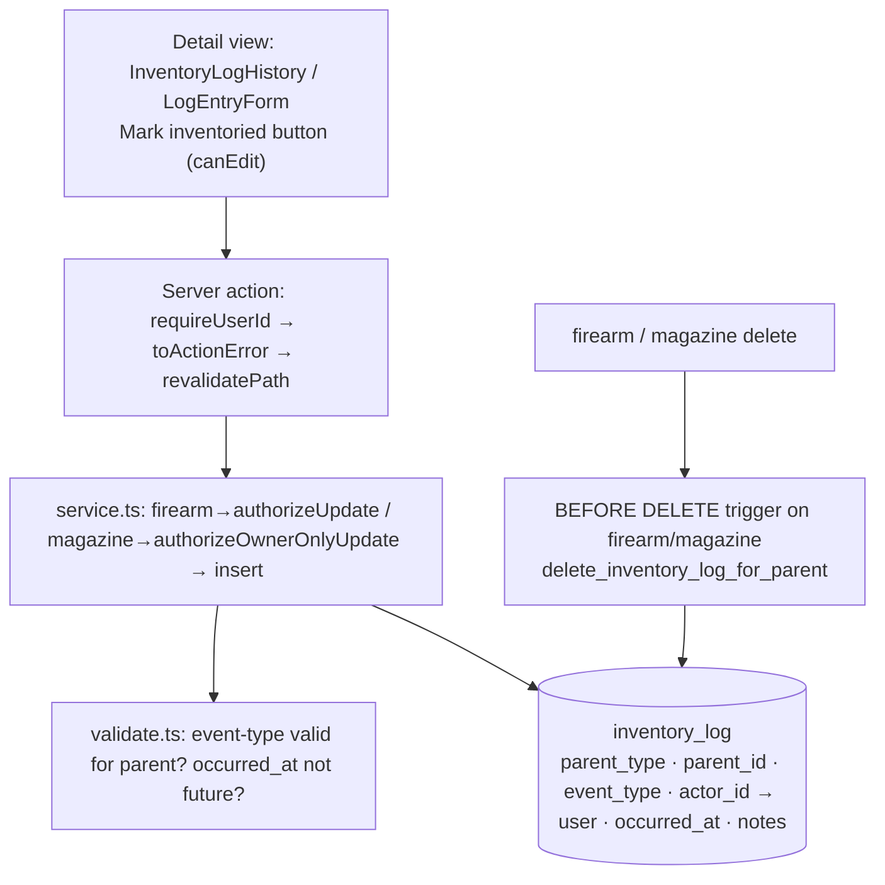

# Inventory Log for Firearms and Magazines - Plan

## Goal Capsule

- **Objective:** Give each firearm and magazine an append-only, per-item log of physical-handling events — recording what happened, who did it, and when — starting with "Inventoried" for both and maintenance events (`cleaned`, `lubed`) for firearms.
- **Product authority:** GitHub issue #46, plus the Product Contract below.
- **Product Contract preservation:** changed — R7 and A2 scope edit-grantee logging to firearms to match the shipped magazine owner-only policy (feasibility review); Key Flows F1–F2 added (present in the brainstorm scope, dropped in the first draft). R1–R6, R8–R14, A1, A3, AE1–AE4 unchanged.
- **Execution profile:** Standard feature mirroring the shipped `rangeSession` child-record stack (#11) end to end. Testcontainers-backed integration + Playwright e2e.
- **Open blockers:** None. The polymorphic-vs-per-parent table question and the `actor_id` on-delete behavior are both resolved (KTD1, KTD6).
- **Stop conditions:** No editing/deleting of entries, no reminders/service-due (#10), no bulk logging, no `inspected` event type. Surface a genuine blocker rather than expanding scope.

---

## Product Contract

### Summary

Add a chronological, append-only log to the firearm and magazine detail views. Each entry records an event type, the acting user, a timestamp (defaulting to now, backdatable to the past), and optional notes. Firearms log `inventoried` / `cleaned` / `lubed`; magazines log `inventoried`. A one-click "Mark inventoried" handles the common case; a "Log…" form covers the rest. Entries follow the established child-record seam — inheriting owner and grant visibility from the parent and cascading on its delete — and lay the groundwork for service-interval reminders (#10).

### Problem Frame

Owners want a lightweight history of physical handling: "when did I last inventory this?", "when was this last cleaned?" Today the only place to record that is the free-text `notes` field on the parent, which overloads one mutable field with an unstructured, unattributed, un-timestamped stream. Shared items make this worse — when a grantee handles a firearm, there's no way to record that they, specifically, did it. A timestamped, attributed, append-only trail answers the history question directly and produces the raw `cleaned` / `lubed` events that a future service-interval feature (#10) can compute "due" state from.

### Key Decisions

- **Append-only in v1.** Entries can be created and listed but not edited or deleted. This matches the audit-trail intent — a handling record you can rewrite isn't a trustworthy history — and keeps the first slice small. Editing and deletion are deferred, not rejected.
- **Follows the child-record seam, not a field on the parent.** Log entries are child records of the firearm or magazine: they carry no owner or grant family of their own, inheriting both from the parent, and they disappear when the parent is deleted. This mirrors the existing per-firearm range-session record.
- **Event types are a controlled set with per-parent validity.** The allowed events differ by parent family — `cleaned` and `lubed` are firearm-only; `inventoried` is shared. The set is defined once as a single source of truth in the domain layer and reused by both domain validation (the primary surface) and a database-level backstop.
- **The event-type field is not named "action."** In this codebase "action" already denotes a firearm's action mechanism (bolt, semi-auto, …). The log's event-type concept takes a distinct name to avoid the collision.

### Actors

- A1. **Owner** — the user who owns the firearm or magazine. Can log events against their own items and see all entries on them.
- A2. **Grantee (edit)** — a user granted `edit` permission on a shared firearm. Can log events against it; the entry records them as the actor, distinct from the owner. Magazines are not shared for editing, so this actor applies to firearms only.
- A3. **Grantee (view)** — a user granted `view` permission on a shared item. Sees the log but cannot add entries.

### Requirements

**Logging & event types**

- R1. A user can add a log entry to a firearm or magazine with an event type, an optional backdated timestamp (defaulting to now), and optional notes.
- R2. Firearm entries support `inventoried`, `cleaned`, and `lubed`; magazine entries support `inventoried`. The set is extensible in future work.
- R3. Event types are a controlled set validated in the domain layer, with a database-level backstop. An event type invalid for the given parent family is rejected.
- R4. Entries are append-only: once created they cannot be edited or deleted in v1.
- R5. Optional notes are stored as empty-not-null free text.

**Actor & visibility**

- R6. Each entry records the acting user as its actor, distinct from the item's owner.
- R7. A grantee with `edit` on a shared firearm can add an entry and is recorded as its actor. Magazine logging is owner-only — magazines are not shared for editing, so magazine entries are authored only by the owner.
- R8. A user sees log entries only for items they own or hold a grant on; owner-scoping and grant visibility from the parent govern the log.

**Display & actions**

- R9. The firearm and magazine detail views show the item's entries in a chronological list, most recent first, surfacing event type, actor, timestamp, and notes.
- R10. A one-click "Mark inventoried" action stamps an `inventoried` entry at the current time.
- R11. A "Log…" affordance lets the user record any event type valid for that item; the firearm view surfaces the maintenance event types.
- R12. UI is targeted via ARIA roles, accessible names, and visible text — no `data-testid`.

**Data lifecycle**

- R13. Deleting a firearm or magazine removes its log entries (cascade).
- R14. The feature adds a new table via the existing Drizzle migration flow and backfills nothing.

### Key Flows

- F1. Quick "Mark inventoried"
  - **Trigger:** A user who can edit the item (owner of either parent; an `edit` grantee on a firearm) clicks "Mark inventoried" on the detail view.
  - **Actors:** A1, A2
  - **Steps:** An `inventoried` entry is created at the current time, attributed to the acting user; the log list refreshes in place with the new entry at the top — no manual reload.
  - **Covered by:** R1, R6, R9, R10

- F2. Log a maintenance event
  - **Trigger:** On a firearm detail view, a user opens the "Log…" affordance.
  - **Actors:** A1, A2
  - **Steps:** The user picks a valid event type (e.g. `cleaned`), optionally backdates the timestamp and adds notes, and submits; the domain layer validates the event type for a firearm; the entry is created and listed newest-first.
  - **Covered by:** R1, R3, R9, R11

### Acceptance Examples

- AE1. Grantee logs against a shared firearm
  - **Covers R7.**
  - **Given** a firearm shared with a grantee holding `edit`, **when** that grantee marks it inventoried, **then** an entry is created recording the grantee as the actor.

- AE2. Event type invalid for parent family
  - **Covers R2, R3.**
  - **Given** a magazine, **when** a `cleaned` event is submitted, **then** it is rejected — `cleaned` is firearm-only. **Given** either a firearm or magazine, **when** `inventoried` is submitted, **then** it is accepted.

- AE3. Non-owner cannot log where editing isn't granted
  - **Covers R7, R8.**
  - **Given** a firearm shared `view`-only, **then** the viewer sees the log but has no way to add an entry, and a direct create attempt is rejected. **Given** a magazine, **then** only its owner can add entries (magazines are never shared for editing).

- AE4. Backdating bounds
  - **Covers R1.**
  - **Given** a new entry, **when** the timestamp is set to an earlier time, **then** it is accepted; **when** set to a future time, **then** it is rejected.

### Scope Boundaries

- Editing or deleting individual log entries — append-only to start.
- Reminders or service-due-date computation — deferred to #10, which consumes the `cleaned` / `lubed` events this feature produces.
- Bulk logging across multiple items at once.
- The `inspected` event type — named in the issue only as a future extensible value, not part of v1.
- Guarding against a double-clicked "Mark inventoried" producing two entries — accepted as-is; with edit/delete out of scope the duplicate cannot be removed, but a guard is not worth its complexity in v1.

### Sources / Research

- Issue #46 — the source requirements, acceptance criteria, and proposed shape.
- `src/db/inventory-schema.ts` — `rangeSession` (per-parent FK cascade child-record, lines 169–191) and `grant` (polymorphic `parent_type` + CHECK, lines 193–226); `inList` (lines 26–34) generates DB CHECK literals from a controlled set.
- `src/domain/firearms/constants.ts` — the single-source-of-truth value-set pattern (`FIREARM_TYPES` / `FIREARM_ACTIONS`) feeding both domain validation and the DB CHECK; also why "action" is unavailable as the event-type field name.
- `src/auth/authorize.ts` — `authorizeUpdate` (owner-or-edit) vs `authorizeOwnerOnlyUpdate` (owner-only); `src/auth/visibility.ts` — `resolvePermission`; `app/(app)/**/share-control.tsx` — `canGrantEdit = parentType === "firearm"` (magazines are view-only shares).
- Epic #24 (inventory roadmap); #11 shot-count tracking (the pattern this follows); #10 service intervals (downstream consumer).

---

## Planning Contract

### Key Technical Decisions

- KTD1. **Single polymorphic `inventory_log` table** (`parent_type` + `parent_id`, mirroring `grant`), not per-parent `firearm_log` / `magazine_log`. It reuses the `parentType`-keyed auth and visibility layer (`resolvePermission`, `getVisibleIds`) and yields one parameterized domain/action/UI stack instead of two parallel ones, with only a per-parent write-authorization branch (KTD2). Cost: `parent_id` cannot carry a foreign key, so cascade (R13) rides on a `BEFORE DELETE` trigger rather than `ON DELETE CASCADE`.
- KTD2. **Write authorization matches each parent family's existing mutation policy.** Firearm log writes call `authorizeUpdate(tx, actorId, "firearm", parentId)` — owner or `edit` grantee passes, mirroring `createRangeSession`. Magazine log writes call `authorizeOwnerOnlyUpdate(tx, actorId, "magazine", parentId)` — owner only, because the shipped codebase makes all magazine mutations owner-only and never issues magazine `edit` grants (`share-control.tsx` offers view-only for magazines). Both throw `NotFoundError` for an unseen parent (existence hidden). No `resolveCreateOwner` is needed — the log has no owner of its own.
- KTD3. **Event-type validity is a per-parent controlled set** in a new `src/domain/inventory-log/constants.ts`, the single source of truth. The pure domain validator is the primary gate (R3); a parent-gated DB `CHECK` generated via the existing `inList` helper is the R3 backstop. This mirrors how `FIREARM_TYPES` feeds both `validate.ts` and the schema `CHECK`.
- KTD4. **`occurred_at` is a timestamp defaulting to now; the validator rejects future values** (past-or-now only, AE4). Backdating to an earlier time is allowed. Modeled as a full timestamp per the issue's "occurred at" wording, rather than the calendar `date` used by `rangeSession`.
- KTD5. **One parameterized UI stack.** An `InventoryLogHistory` card plus a `LogEntryForm`, mirroring `RangeSessionHistory` / `RangeSessionForm`, render on both detail views with the allowed event-type set derived from `parentType`. "Mark inventoried" is a one-click button gated on the view's `canEdit` (owner-or-edit for firearm, owner-only for magazine — the value the detail page already resolves). The magazine detail view gains its first child-record card.
- KTD6. **Cascade via a `BEFORE DELETE` trigger** on `firearm` and `magazine` (`delete_inventory_log_for_parent`), mirroring `src/db/migrations/0002_grant_cleanup_triggers.sql`, since polymorphic `parent_id` cannot carry an FK. `actor_id` carries a real FK to `user` (unlike `parent_id`) with `ON DELETE RESTRICT`: deleting a user who authored entries must not silently erase the owner's audit trail (the append-only guarantee), and keeping `actor_id` not-null preserves R6. If a hard user-delete flow must proceed regardless, the follow-up is a denormalized actor snapshot captured at write time — not needed for v1.

### High-Level Technical Design

The feature is a vertical slice mirroring the range-session stack. The write path validates in the domain layer, authorizes per parent family, then inserts; the read path resolves parent permission before listing. Cascade is enforced at the DB layer by a trigger because the polymorphic `parent_id` cannot carry an FK.

Logical relationship: `inventory_log` points at a `firearm` OR `magazine` via (`parent_type`, `parent_id`) with no FK; `actor_id` is a real FK to `user`. Event-type validity is gated per `parent_type` in both the domain validator and the DB `CHECK`.

### Assumptions

- The v1 event-type set is exactly firearm `{inventoried, cleaned, lubed}` and magazine `{inventoried}`; `inspected` is excluded (Scope Boundaries).
- The migration and cascade triggers follow the generated-then-applied Drizzle flow (`bun run db:generate` → `bun run db:migrate`); triggers are hand-written SQL appended to the generated migration, as `0002_grant_cleanup_triggers.sql` is.

### Sequencing

U1 (constants + validation) → U2 (schema + migration + triggers, imports U1 constants for the `CHECK`) → U3 (service + server actions, needs U1 + U2) → U4 (UI + wiring, needs U3) → U5 (e2e + factory, needs U2 + U4). U1 is self-contained and testable first.

---

## Implementation Units

### U1. Event-type constants and domain validation

- **Goal:** Define the event-type single source of truth and the pure validator.
- **Requirements:** R1, R2, R3, R5.
- **Dependencies:** none.
- **Files:**
  - `src/domain/inventory-log/constants.ts` (new)
  - `src/domain/inventory-log/validate.ts` (new)
  - `src/domain/validation-messages.ts` (add event-type / occurred-at message codes)
  - `src/domain/inventory-log/__tests__/validate.test.ts` (new)
- **Approach:** In `constants.ts`, define per-parent event-type arrays (`FIREARM_LOG_EVENTS = ['inventoried','cleaned','lubed']`, `MAGAZINE_LOG_EVENTS = ['inventoried']`), a combined set for the DB `CHECK`, and an `isValidEventType(parentType, eventType)` helper — mirroring the export shape of `src/domain/firearms/constants.ts`. In `validate.ts`, a pure `validateLogEntry(input)` returning all applicable codes at once (parity with `validateRangeSession`'s multi-code return in the #11 feature): reject an event type not valid for the parent family, reject an `occurredAt` in the future, treat notes as optional. No DB or Next.js imports.
- **Patterns to follow:** `src/domain/firearms/constants.ts` (value-set SSOT + `is*` helpers); `src/domain/range-sessions/validate.ts` (pure validator returning a code array).
- **Test scenarios** (`validate.test.ts`, pure, `bun:test`):
  - Covers AE2. Firearm accepts `inventoried` / `cleaned` / `lubed`; magazine accepts `inventoried`; magazine rejects `cleaned` and `lubed`; an unknown event type is rejected for both parents.
  - Covers AE4. A past `occurredAt` passes; now passes; a future `occurredAt` is rejected.
  - Empty/omitted notes pass; a whitespace-only note is accepted as empty-not-null.
  - Multiple violations return multiple codes together.
- **Verification:** `bun test src/domain/inventory-log/__tests__/validate.test.ts` passes; `bun run typecheck` clean.

### U2. Schema, migration, and cascade triggers

- **Goal:** Add the `inventory_log` table with its constraints, index, and parent-delete cascade triggers.
- **Requirements:** R1, R2, R3 (DB backstop), R5, R6, R13, R14.
- **Dependencies:** U1 (imports the event-type constants for the `CHECK`).
- **Files:**
  - `src/db/inventory-schema.ts` (add `inventoryLog` pgTable)
  - `src/db/migrations/<generated>.sql` + `meta/` snapshot (via `bun run db:generate`)
  - append a hand-written trigger statement to the generated migration (or a follow-on migration), mirroring `src/db/migrations/0002_grant_cleanup_triggers.sql`
- **Approach:** Define `inventoryLog` ("inventory_log"): `id` uuid PK; `parentType` text NOT NULL; `parentId` uuid NOT NULL (no FK — polymorphic, KTD1); `eventType` text NOT NULL; `actorId` text NOT NULL referencing `user.id` with `ON DELETE RESTRICT` (preserve the owner's audit trail — KTD6); `occurredAt` timestamp NOT NULL default now; `notes` text NOT NULL default `''` (R5); `createdAt` timestamp default now. Constraints: `CHECK (parent_type in ('firearm','magazine'))`; a parent-gated event-type `CHECK` built with `inList` over the U1 constants (`(parent_type='firearm' AND event_type in (...)) OR (parent_type='magazine' AND event_type in (...))`); index on (`parent_type`, `parent_id`, `occurred_at`) for the newest-first per-item list. Add a `delete_inventory_log_for_parent()` trigger function and `BEFORE DELETE` triggers on `firearm` and `magazine`.
- **Patterns to follow:** `grant` table (polymorphic `parent_type` + `CHECK`, `src/db/inventory-schema.ts:193`); `inList` (`:26`); `0002_grant_cleanup_triggers.sql` (per-parent BEFORE DELETE trigger).
- **Test scenarios:** `Test expectation: none — schema/migration/triggers; the DB CHECK backstop and cascade behavior are proven by U3 integration tests (raw invalid-insert rejection; parent-delete removes log rows).`
- **Verification:** `bun run db:generate` produces a migration; `bun run db:migrate` applies it against a clean database with no error; `bun run typecheck` clean.

### U3. Domain service and server actions

- **Goal:** Create and list log entries with per-parent authorization, and expose them as server actions.
- **Requirements:** R1, R4, R6, R7, R8, R9, R10, R13.
- **Dependencies:** U1, U2.
- **Files:**
  - `src/domain/inventory-log/service.ts` (new)
  - `app/(app)/inventory-log/log-actions.ts` (new — or co-located per repo convention for shared firearm/magazine actions)
  - `src/domain/inventory-log/__tests__/service.test.ts` (new, integration)
- **Approach:** In `service.ts`: `createLogEntry(actorId, input)` validates first (throws `ValidationError` before any transaction), then in `db.transaction` authorizes **per parent family** (KTD2) — `authorizeUpdate(tx, actorId, "firearm", parentId)` for firearms, `authorizeOwnerOnlyUpdate(tx, actorId, "magazine", parentId)` for magazines — and inserts with `actorId` as the actor. `listLogForParent(actorId, parentType, parentId)` calls `resolvePermission`; `null` → `NotFoundError` (existence hidden); orders `desc(occurredAt), desc(createdAt)`. `markInventoried(actorId, parentType, parentId)` is a thin wrapper over `createLogEntry` with `eventType: 'inventoried'` and `occurredAt: now` — it reuses the same validate + per-parent authorize path, never a separate insert (R10). The service exposes only create/list/markInventoried — no update or delete surface (R4 append-only). Server actions mirror `session-actions.ts`: `requireUserId()`, body wrapped in `try/catch` → `toActionError`, `revalidatePath` on mutations, no revalidate on the read action.
- **Patterns to follow:** `src/domain/range-sessions/service.ts` (validate-then-authorize-then-insert; read via `resolvePermission`); `src/domain/magazines/service.ts` (owner-only mutation via `authorizeOwnerOnlyUpdate`); `app/(app)/firearms/session-actions.ts` (`requireUserId`, `toActionError`, `revalidatePath`); `src/domain/action-result.ts`.
- **Test scenarios** (`service.test.ts`, integration, gated on `DATABASE_URL`, Testcontainers, using `src/test-support/factories.ts` + `expectRejects`):
  - Covers R9. Create entries and list them newest-first for a firearm and for a magazine.
  - Covers AE1, R6, R7. An `edit` grantee on a firearm creates an entry; it is recorded with the grantee as `actor_id`.
  - Covers R7, KTD2. On a magazine, a non-owner with `view` (magazines have no edit grants) is rejected via `authorizeOwnerOnlyUpdate`; only the owner can log.
  - Covers AE3, R8. A `view` grantee on a firearm can list but a create attempt throws `NotAuthorizedError`.
  - A stranger with no visibility gets `NotFoundError` on both create and list (existence hidden).
  - Covers AE2, R3. Creating a `cleaned` entry on a magazine throws `ValidationError` and writes no row.
  - R3 backstop. A raw insert bypassing the domain layer with an invalid `(parent_type, event_type)` pair is rejected by the DB `CHECK`.
  - Covers R13. Deleting the parent firearm removes its log entries; deleting the parent magazine removes its log entries.
  - Covers R10. `markInventoried` creates exactly one `inventoried` entry at approximately now, going through the same authorize path (a view-grantee's `markInventoried` on a firearm is rejected).
  - Covers R4. The service module exports no update or delete function for entries.
- **Verification:** `DATABASE_URL=… bun test src/domain/inventory-log/__tests__/service.test.ts` passes; `bun run typecheck` clean.

### U4. Detail-view UI and quick action

- **Goal:** Render the log and its "Log…" / "Mark inventoried" affordances on both detail views.
- **Requirements:** R9, R10, R11, R12.
- **Dependencies:** U3.
- **Files:**
  - `app/(app)/inventory-log/inventory-log-history.tsx` (new)
  - `app/(app)/inventory-log/log-entry-form.tsx` (new)
  - `app/(app)/firearms/firearm-detail-view.tsx` (wire in the log card + Mark-inventoried button)
  - `app/(app)/magazines/magazine-detail-view.tsx` (wire in the log card + Mark-inventoried button)
- **Approach:** `InventoryLogHistory` is a `Card` client component parameterized by `parentType` / `parentId` / `canEdit` / `onChange`, loading via the list action in a `useTransition`, rendering a `DataTable` (event type · actor · timestamp · notes) or `EmptyState`, with a "Log…" button (gated on `canEdit`) opening an inline `LogEntryForm`. Memoize the data passed to `DataTable` to avoid the TanStack autoreset render loop.
  - **`canEdit` gating (KTD2/KTD5):** the firearm detail view passes `canEdit = owner-or-edit` (the value it already derives for `RangeSessionHistory`); the magazine detail view passes `canEdit = owner-only` (the magazine page already resolves the real permission, so gate on owner). This keeps the UI consistent with the server-side per-parent authorization.
  - **"Mark inventoried" interaction contract:** the button lives inside `InventoryLogHistory` (or receives its `load`/refresh callback) so that after `markInventoried` succeeds the same list reload path runs and the new entry appears at the top **without a manual page reload**. While the action is in flight the button is disabled and shows pending text; on success and on failure it surfaces feedback the way `RangeSessionForm` does (success toast; inline server-error message). This closes the header-button-vs-independent-list-state gap.
  - **`LogEntryForm`:** plain `useState` + the U1 validator for instant client feedback, then the create action; server `ValidationError` codes flow back through `ActionResult.codes` and render via `firstMessage`. The event-type `<select>` options come from the parent-appropriate set. The `occurredAt` field is a single `datetime-local` input defaulting to now; a future value surfaces a field-level error (past-or-now only, KTD4/AE4), and the local value is reconciled to the stored timestamp on submit. This is the one genuinely new control versus `RangeSessionForm`'s date-only field.
- **Patterns to follow:** `app/(app)/firearms/range-session-history.tsx` and `range-session-form.tsx` (structure, `useTransition`, `firstMessage`, ARIA targeting, success/error feedback); the `RangeSessionHistory` composition point in `firearm-detail-view.tsx:198`; `src/domain/validation-messages.ts`.
- **Test scenarios:** `Test expectation: none — UI composition mirroring the range-session components, which carry no isolated unit tests; behavior is proven by the U5 e2e specs.`
- **Verification:** `bun run lint` and `bun run typecheck` clean; the log card renders on both detail views; no `data-testid` introduced (R12).

### U5. End-to-end coverage and test factory

- **Goal:** Prove the full user flows and cascade through the browser and add the shared test factory.
- **Requirements:** R7, R8, R9, R10, R11, R12, R13.
- **Dependencies:** U2, U4.
- **Files:**
  - `src/test-support/factories.ts` (add `makeLogEntry`)
  - `e2e/inventory-log.spec.ts` (new)
  - `e2e/inventory-log-sharing.spec.ts` (new)
- **Approach:** `makeLogEntry(parentType, parentId, overrides)` inserts directly via `db.insert(inventoryLog)` with sensible defaults, mirroring `makeRangeSession`. The single-user spec drives the firearm detail view (Mark inventoried adds a newest-first entry with no manual reload; Log `cleaned` via the form with a backdated timestamp and notes) and the magazine detail view (Mark inventoried; only `inventoried` offered). The sharing spec uses two browser contexts: an `edit` grantee logs on a shared firearm and is shown as the actor; a `view` grantee on a shared firearm sees the log but the "Mark inventoried" / "Log…" controls have `toHaveCount(0)`. Magazines have no edit-grant path, so the magazine sharing case asserts a `view` grantee sees the log without logging controls.
- **Patterns to follow:** `e2e/range-sessions.spec.ts` and `e2e/range-sessions-sharing.spec.ts` (single-user and two-context flows; ARIA-role/label/text targeting, no `data-testid`); `src/test-support/factories.ts:70` (`makeRangeSession`).
- **Test scenarios** (the specs themselves):
  - Covers R9, R10, R11. Firearm: Mark inventoried → entry appears newest-first without reload; Log `cleaned` with backdate + notes → appears above older entries. Magazine: Mark inventoried works; maintenance types are not offered.
  - Covers R7. Shared-firearm `edit` grantee logs an entry, recorded as the actor.
  - Covers R8, R12. Shared `view` grantee sees the log but has no logging controls.
  - Covers R13. (Integration proves cascade; e2e need not re-prove it.)
- **Verification:** `bun run test:e2e` passes (Docker required); the sharing spec confirms UI gating.

---

## Verification Contract

| Gate | Command | Applies to |
|---|---|---|
| Lint (Biome) | `bun run lint` | all units |
| Typecheck | `bun run typecheck` | all units |
| Unit + integration | `bun test` (integration auto-skips without `DATABASE_URL`; Testcontainers supplies it) | U1, U3 |
| Migration applies | `bun run db:generate` then `bun run db:migrate` on a clean DB | U2 |
| End-to-end | `bun run test:e2e` (Docker required) | U5 |
| Pre-commit gate | `just ci-check` must pass before every commit | all |

---

## Definition of Done

**Global**
- R1–R14 satisfied and traced to units; A1–A3, F1–F2, AE1–AE4 honored.
- The new migration generates cleanly and applies via `bun run db:migrate`; the `inventory_log` table, its constraints/index, and the `firearm` + `magazine` `BEFORE DELETE` cascade triggers are present.
- `just ci-check` is green; `bun run test:e2e` is green.
- No `data-testid` anywhere; UI targeted via ARIA roles / accessible names / visible text.
- `CONCEPTS.md` "Inventory Log" and "Event Type" entries are present (already added).
- Any dead-end or experimental code from abandoned approaches is removed from the diff.

**Per unit**
- U1: validator unit tests pass; constants are the sole source of the event-type set.
- U2: migration applies clean; DB `CHECK` and triggers proven by U3 integration.
- U3: integration tests pass under `DATABASE_URL`, covering create/list/validation/per-parent authorization/cascade.
- U4: both detail views render the log card and quick action; firearm gates on owner-or-edit, magazine on owner-only; lint/typecheck clean.
- U5: both e2e specs pass; factory reused from `src/test-support/factories.ts`.
