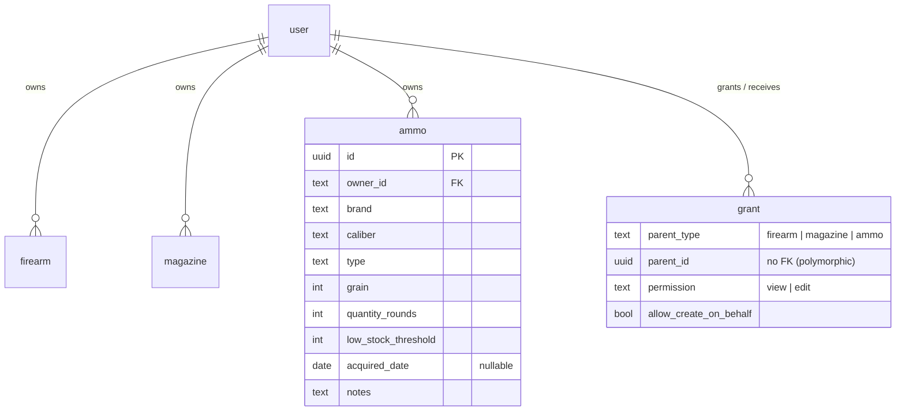
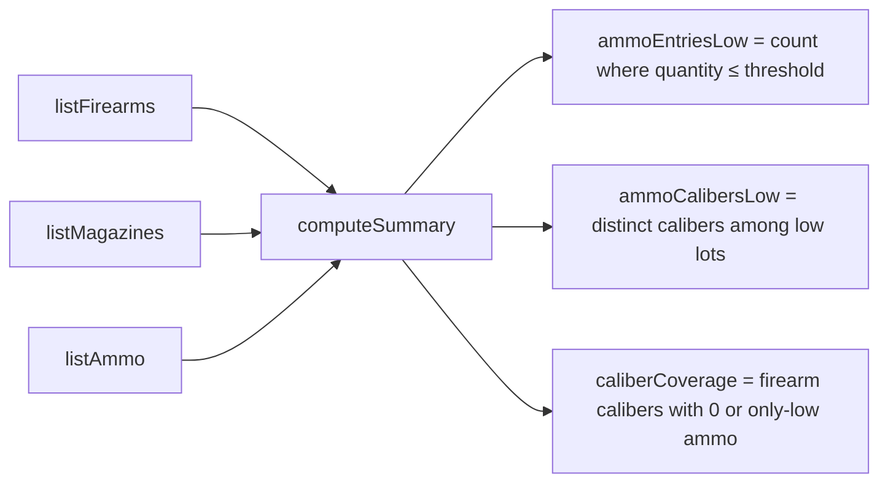

# Ammo Inventory Tracking with Low-Stock Alerts - Plan

## Goal Capsule

- **Objective:** Track ammunition on hand as an owner-scoped, shareable inventory entity — recording stock by brand, caliber, load type, and grain — so an owner can see how much they have per caliber and be flagged before a lot runs low.
- **Product authority:** GitHub issue #7, plus the Product Contract below.
- **Product Contract preservation:** unchanged. Planning resolved two forks the brainstorm left open (ammo sharing is **edit-capable**, matching Actor A2; ammo CSV is a **dedicated export**, not merged into the magazine CSV) and one field-requiredness assumption (AS3) — none alter product scope.
- **Execution profile:** Deep feature mirroring the shipped owned-parent stack (Firearm/Magazine) end to end. Ammo becomes the **third owned parent**. Testcontainers-backed integration + Playwright e2e. `just ci-check` is the pre-commit gate.
- **Open blockers:** None. All four issue-flagged product questions plus the two planning forks are resolved.
- **Stop conditions:** No consumption/"consume rounds" events, no range-session round deduction, no trip reservation/allocation, no lot merging, no per-load analytics. Surface a genuine blocker rather than expanding scope.

---

## Product Contract

### Summary

Add an owner-scoped, shareable `ammo` inventory entity that follows the exact ownership and grant model already used by firearms and magazines. Owners record ammo lots (brand, caliber, load type, grain, round count, low-stock threshold, acquired date, notes) on a dedicated `/ammo` route with the established inventory flows — list, create/edit form, empty state, toasts, and delete-with-`ConfirmDialog`. A lot is flagged low-stock when `quantityRounds <= lowStockThreshold`, both inline in the list and as roll-ups on `/summary`. Ammo is included in CSV export. The design closes the "what can I actually shoot right now" gap and leaves the seam open for future consumption features without a redesign.

### Problem Frame

The app models firearms, magazines, and caliber reference data, but not ammunition on hand. Owners can't see how much ammo they have for a given caliber, can't be warned about low inventory before a range trip, and the summary can't answer cross-cutting questions like "I own firearms in this caliber — do I have ammo for them?" or "which calibers are below my comfort threshold?" Adding ammo inventory closes that gap and lays a foundation for later consumption tracking, range logs, and automated stock deductions.

### Key Decisions

- **Ammo is the third owned parent, mirroring the existing pattern.** It reuses the owner-scoped `pgTable` conventions, the hand-rolled code-array validator style (not zod), the polymorphic `grant` sharing model, the shared `DataTable` UI, and the parent-generic auth (`getVisibleIds` / `resolvePermission`). No new architecture — it extends seams the codebase already left open (notably the FK-less `rangeSession.ammoId` seam labeled "future Ammo inventory (#7)"). This makes ammo the first entity to move the domain from "two owned parents" to three; the `grant.parentType` controlled set and the `ParentType` union gain `'ammo'`, and CONCEPTS.md is updated accordingly.
- **Caliber reuses reference data as suggestions, not a whitelist.** In this codebase caliber is free text validated only for non-empty; the "reference list" is a UI suggestion source (curated list ∪ in-use values), and firearm/magazine caliber already works this way. Ammo caliber wires into the same suggestion union and `distinctCalibers` — consistent behavior, no hard FK or enum. *(Recorded as assumption AS1.)*
- **Load `type` is free text with suggestions.** A combobox seeded with common loads (FMJ, JHP, HP, Match, Soft Point, Subsonic) that accepts any value — the same shape as caliber. Load types proliferate (+P, frangible, tracer, wadcutter); a hard enum would reject real entries until a code change.
- **Records are separate lots, never auto-merged.** Two records sharing brand/caliber/type/grain remain independent lots, each with its own acquired date, quantity, threshold, and notes. A lot is the natural unit for the future "consume rounds" seam. Aggregation happens only in derived summary/caliber views, not by collapsing rows.
- **Low-stock is a derived per-lot flag; summary rolls up both ways.** A lot is low when `quantityRounds <= lowStockThreshold`. The summary shows **both** counts: entries below threshold (count of low lots) and calibers below threshold (distinct calibers among low lots). No caliber-level threshold field exists — both counts derive from the single per-lot flag.
- **CSV export gains an ammo row shape with alert columns.** CSV export today is magazine-only, so ammo needs its own row set regardless. That row set includes all ammo fields plus `lowStockThreshold` and a computed low-stock status column, so the alert data lives in the exported sheet.
- **Caliber-coverage cross-reference (light) is in scope.** The summary surfaces calibers the owner has firearms in but no/low ammo for. Caliber is already the join key and summary already aggregates by caliber, so it is a low-cost, high-value add that directly serves the issue's stated user question. Not one of the issue's acceptance criteria — included by decision.

### Actors

- A1. **Owner** — the user who owns the ammo lot. Full CRUD on their own lots; sees all their lots plus lots shared to them.
- A2. **Grantee (edit)** — a user granted `edit` on a shared ammo lot. Can update it, and (with the create-on-behalf opt-in) create lots on the owner's behalf, mirroring firearms. *(Planning fork resolved: ammo sharing is edit-capable like firearms, not view-only like magazines.)*
- A3. **Grantee (view)** — a user granted `view` on a shared ammo lot. Sees it but cannot change it.

### Requirements

**Data & CRUD**

- R1. A user can create, read, update, and delete ammo lots.
- R2. A lot records: `brand` (optional), `caliber`, `type` (load type, optional), `grain` (integer), `quantityRounds` (integer), `lowStockThreshold` (integer), `acquiredDate` (optional), and `notes` (optional). `caliber` is the only required text field (AS3).
- R3. Lots are owner-scoped: a user sees only their own lots plus lots explicitly shared to them via a grant, and this scoping governs all reads and writes.
- R4. Lots are shareable with the same grant model as firearms — per-item `view`/`edit` grants, re-grant updates in place, and the create-on-behalf opt-in.
- R5. Caliber values draw from the existing caliber reference suggestions and remain consistent with how firearm/magazine caliber behaves (suggestion-backed free text, validated non-empty).
- R6. Load `type` is suggestion-backed free text (common loads offered, any value accepted).
- R7. Records with matching brand/caliber/type/grain remain separate lots; the system never auto-merges them.
- R8. Domain-layer validation rejects invalid input (empty caliber, negative counts) with all failure reasons, following the established validator style; database-level CHECK constraints mirror the critical numeric bounds.

**Low-stock & summary**

- R9. A lot is low-stock when `quantityRounds <= lowStockThreshold`.
- R10. The ammo list shows a visible low-stock indicator on each low lot.
- R11. `/summary` shows both roll-ups: count of ammo entries below threshold and count of calibers below threshold (distinct calibers among low lots — a caliber counts if **any** of its lots is low).
- R12. `/summary` surfaces a caliber-coverage signal: calibers the owner has firearms in but has **no ammo lots, or only low lots** (all lots low) for. Distinct from R11's any-lot rule — a caliber with one low lot and one adequate lot is counted in R11 but is **not** flagged here.

**UI/UX**

- R13. A dedicated `/ammo` route provides list view, create/edit form, empty state, success/error toast feedback, and delete via `ConfirmDialog`, built on the shared `DataTable` and existing inventory hooks — matching the firearm/magazine surfaces.
- R14. UI is targeted via ARIA roles, accessible names, and visible text — no `data-testid` — and meets the project's WCAG 2.2 AA bar.

**Export**

- R15. CSV export includes ammo as its own row shape, carrying all ammo fields plus `lowStockThreshold` and a computed low-stock status column.

### Acceptance Evidence

- AE1. CRUD works end to end for ammo lots, owner-scoped, and shareable via the same grant flow as firearms (integration test).
- AE2. A lot with `quantityRounds <= lowStockThreshold` shows the low-stock indicator in the list; one above threshold does not (e2e).
- AE3. `/summary` reports both the entries-below-threshold and calibers-below-threshold counts, and the caliber-coverage signal, correctly for a mixed fixture (integration + e2e).
- AE4. CSV export contains ammo rows including threshold and low-stock status (integration test).
- AE5. Caliber suggestions and load-type suggestions appear and accept off-list values (e2e).

*(R7, R8, R13, R14 decompose the issue's acceptance criteria and are verified at the unit-test level — see U3/U4 test scenarios — rather than each carrying its own AE ID.)*

### Out of Scope (future-friendly, not built)

- Consumption / "consume rounds" events and deducting ammo after a range session (the `rangeSession.ammoId` seam stays FK-less until then).
- Reservation/allocation of ammo to a trip or event.
- Lot merging in the UI; richer analytics by caliber or load type **beyond the R11 low-stock counts and the R12 caliber-coverage signal** (e.g., per-caliber consumption trends, historical stock charts, per-load breakdowns).
- **Inventory-log participation for ammo** (the append-only handling log, #46). Ammo lots get no log entries in this slice: the `inventory_log_parent_type_valid` CHECK stays `('firearm', 'magazine')` and the ammo detail view omits `InventoryLogHistory`. Deferred, not rejected — a fast-follow can widen that CHECK and add an ammo event-type set.

### Open Questions / Assumptions

*(Assumption IDs use the `AS` prefix to stay distinct from Actor IDs A1–A3.)*

- AS1 (assumption). "Reuse existing caliber reference data" means wiring ammo into the existing suggestion union, not a hard FK/enum. Adopt unless a stakeholder wants enforced caliber values (a cross-cutting change to firearms/magazines too, out of scope here).
- AS2 (assumption). By-caliber low-stock (R11) means "at least one lot of that caliber is at or under its own threshold." A "sum of rounds per caliber vs a caliber-level threshold" model would require a new caliber-level threshold concept and is deferred.
- AS3 (assumption, planning). `caliber` is the only required text field (matching firearm/magazine); `brand`, `type`, `notes` are optional empty-not-null; `grain`, `quantityRounds`, `lowStockThreshold` are non-negative integers. Flag if `brand` should be required.
- AS4 (confirm before shipping). Create-on-behalf is whole-owner trust, not per-parent-type (see KTD7): an existing firearm/magazine create-on-behalf grant will also authorize creating ammo lots for that owner. Confirm this blast-radius widening is intended, or scope `resolveCreateOwner` per parent type.

---

## Planning Contract

### Research Summary

The owned-parent pattern is implemented twice (firearm, magazine) and is the template to mirror exactly:

- **Schema:** `src/db/inventory-schema.ts` — `magazine` (lines ~101-125) is the closest analog: uuid PK `defaultRandom()`, `owner_id` text FK cascade + index, required text (`caliber`), empty-not-null optional text, nullable `date`, integer columns with `check(...)` backstops via the local `inList`/`check` helpers. The `grant` table (lines ~197-230) has `check("grant_parent_type_valid", ... in ('firearm', 'magazine'))`. `rangeSession.ammoId` (line ~184) is an existing FK-less seam for #7 — no change needed.
- **Auth:** `src/auth/visibility.ts` defines `ParentType = "firearm" | "magazine"` (line 14) and `parentTable()` (lines 18-20); `src/auth/authorize.ts` has its own `parentTable()` (lines 13-15). `getVisibleIds`/`resolvePermission`/`authorizeUpdate`/`authorizeAndDeleteParent`/`resolveCreateOwner` are all parent-type-generic — extending the union + both ternaries makes them work for ammo. `src/auth/grants.ts` consumes `ParentType`.
- **Domain:** `src/domain/firearms/{constants,validate,service}.ts` + `__tests__/service.test.ts` is the module template. `validate.ts` returns a code array (all failures, not first). `service.ts` uses `persistableFields`, `db.transaction`, `resolveCreateOwner`, `authorizeUpdate`, `authorizeAndDeleteParent`, `getVisibleIds`, `resolvePermission`.
- **Reference:** `src/domain/reference/reference.ts` — `distinctCalibers` (lines 81-113) unions visible firearm+magazine calibers via `getVisibleIds`; `calibersForInput` (lines 119-126) merges curated ∪ in-use. Ammo calibers join this union.
- **Summary:** `src/domain/summary/summary.ts` — pure `computeSummary(firearms, magazines)`; `FirearmIdentity` is `{id, name}` (no caliber today); `inventorySummary` loads via `Promise.all`. UI: `app/(app)/summary/{page.tsx,summary-tables.tsx}`.
- **CSV:** `src/domain/csv/{build,serialize}.ts` — `serializeMagazinesCsv` is a pure RFC-4180 serializer with a formula-injection guard (apostrophe-first, then quote); `buildInventoryCsv` loads + maps; route `app/api/export/route.ts` → `magstacker-inventory.csv`. Magazine surface has an `export-button.tsx`.
- **UI surface:** `app/(app)/magazines/*` (`page.tsx`, `magazines-view.tsx`, `magazine-form.tsx`, `magazine-detail-view.tsx`, `[id]/page.tsx`, `actions.ts`, `export-button.tsx`) is the route template; shared `components/ui/data-table/*`, `ConfirmDialog`, `EmptyState`/`Badge`, `useDeleteConfirmation`, `useRowFlash`, `useTableViewState`. Nav in `app/(app)/app-shell.tsx` (lines 19-20). Sharing UI `app/(app)/grants/share-control.tsx` gates edit via `canGrantEdit = parentType === "firearm"` (line 106).
- **Tests:** `src/test-support/factories.ts` — `makeFirearm`/`makeMagazine` direct-insert factories; integration tests gate on `DATABASE_URL` (`const live = process.env.DATABASE_URL ? describe : describe.skip`) and use the local `expectRejects` helper (bun `.rejects` vs drizzle thenables). Migrations via `bun run db:generate` (drizzle-kit) into `src/db/migrations/` (next sequence `0010`).
- **Institutional learnings** (`docs/solutions/`): `test-failures/bun-test-misloads-playwright-e2e-specs.md` (run e2e via `bun run test:e2e`, not raw `bun test`); `runtime-errors/tanstack-autoreset-render-loop-unstable-data.md` (memoize data fed to `useReactTable`) — both apply to the `/ammo` UI unit.

### Key Technical Decisions

- **KTD1 — `ParentType` gains `'ammo'` in one place, ternaries updated in two.** Extend the union in `src/auth/visibility.ts` and add the `ammo` branch to `parentTable()` there and in `src/auth/authorize.ts`. This is the minimal change that makes all shared auth work for ammo. The grant CHECK constraint is widened in the same migration as the ammo table.
- **KTD2 — Ammo mirrors `magazine`'s schema shape,** with three integer CHECK backstops (`grain >= 0`, `quantity_rounds >= 0`, `low_stock_threshold >= 0`). No CHECK on `type` (free text). `acquired_date` nullable = unset.
- **KTD3 — Low-stock is derived, never stored.** A pure `isLowStock(ammo)` predicate (`quantityRounds <= lowStockThreshold`) is the single source of truth, consumed by the list badge, summary roll-ups, and CSV status column. Mirrors how `effectiveCapacity`/`Lifetime Total` are derived.
- **KTD4 — Ammo sharing is edit-capable (firearm-model), not view-only (magazine-model).** `share-control.tsx` `canGrantEdit` becomes `parentType === "firearm" || parentType === "ammo"`. Serves the club/range shared-stock use case and matches Actor A2.
- **KTD5 — Ammo exports as a dedicated CSV,** not merged into the magazine CSV. New `serializeAmmoCsv` + `buildAmmoCsv` + `/api/export/ammo` route + an ammo `export-button`, mirroring the magazine export stack. Different column shape makes a shared table wrong; a parallel stack keeps both serializers pure and simple.
- **KTD6 — `computeSummary` is extended, not forked.** It gains an `ammo` parameter and returns `ammoEntriesLow`, `ammoCalibersLow`, and `caliberCoverage`. Firearm caliber is threaded in by adding an **optional** `caliber` field to the `FirearmIdentity` input — optional deliberately, so the existing `summary.test.ts` literals (which pass `{id, name}` only) keep compiling; a required field would redden `just ci-check` on a file this plan doesn't touch. New ammo coverage tests populate `caliber`. Keeping one aggregation function avoids a second load path.
- **KTD7 — create-on-behalf is whole-owner trust, inherited unchanged.** `resolveCreateOwner` (`src/auth/authorize.ts`) authorizes create-on-behalf on *any* active edit grant with `allowCreateOnBehalf` from owner to actor — its query has no `parentType`/`parentId` filter. This is existing firearm/magazine behavior; ammo inherits it, so an existing create-on-behalf grant will also authorize creating ammo lots for that owner. Treated as intentional (create-on-behalf is a per-owner relationship, not per-entity-type) and recorded as AS4 to confirm before shipping, since it widens every existing grant's reach to the new entity. Do not silently rely on "becomes ammo-capable automatically" as if it were safe-by-construction.

### High-Level Technical Design

Data model — ammo as a third owned parent alongside the existing polymorphic grant:



Summary aggregation flow (R11/R12) — all derived in-memory over the viewer-relative visible snapshot:



*Directional guidance for reviewers — not implementation specification.*

### Output Structure

New files (existing files modified in-place are listed per unit, not here):

```text
src/domain/ammo/
├── constants.ts              # COMMON_AMMO_TYPES suggestion list (no CHECK)
├── validate.ts               # validateAmmo (code array) + isLowStock predicate
├── service.ts                # CRUD: create/update/delete/get/listAmmo
└── __tests__/
    └── service.test.ts       # integration (DATABASE_URL-gated)
app/(app)/ammo/
├── page.tsx                  # server component: listAmmo + suggestions + permissions
├── ammo-view.tsx             # client list (DataTable + low-stock badge)
├── ammo-form.tsx             # create/edit form (caliber + load-type datalist inputs)
├── ammo-detail-view.tsx      # detail + share-control + delete
├── export-button.tsx         # hits /api/export/ammo
├── actions.ts                # server actions (create/update/delete)
└── [id]/
    └── page.tsx              # detail route
app/api/export/ammo/
└── route.ts                  # ammo CSV download
src/domain/csv/
├── ammo-serialize.ts         # serializeAmmoCsv (pure, injection-guarded)
└── ammo-build.ts             # buildAmmoCsv (loads visible ammo)
```

---

## Implementation Units

### U1. Ammo table, grant CHECK, and migration

- **Goal:** Add the `ammo` table and widen the `grant` parent-type CHECK so ammo can be owned and shared at the DB layer.
- **Requirements:** R1, R2, R3, R8.
- **Dependencies:** none.
- **Files:** `src/db/inventory-schema.ts` (add `ammo` pgTable; widen `grant_parent_type_valid` CHECK to `in ('firearm', 'magazine', 'ammo')`); new `src/db/migrations/0010_*.sql` (generated).
- **Approach:** Mirror `magazine`. Columns: `id` uuid PK `defaultRandom()`; `ownerId` text FK → `user` cascade + `ammo_owner_id_idx`; `brand`/`type`/`notes` text `notNull().default("")`; `caliber` text `notNull()`; `grain`/`quantityRounds`/`lowStockThreshold` integer `notNull().default(0)`; `acquiredDate` date nullable; `createdAt`/`updatedAt` timestamps. CHECK backstops via `inList`/`check`: `ammo_grain_min` (`>= 0`), `ammo_quantity_min` (`>= 0`), `ammo_threshold_min` (`>= 0`). Generate the migration with `bun run db:generate`; verify it creates the table and alters the grant CHECK (drop+add), then applies with `bun run db:migrate`.
- **Patterns to follow:** `magazine` definition and the `grant` CHECK block in `src/db/inventory-schema.ts`.
- **Test scenarios:** `Test expectation: none — schema/migration unit; behavior is covered by U3 service integration tests and a migrate-clean check.` Verify `bun run db:migrate` applies cleanly against a fresh Testcontainers Postgres.
- **Verification:** Migration applies on a clean DB; the `ammo` table and widened grant CHECK exist; `bun run typecheck` passes.

### U2. Extend `ParentType` to ammo across the auth layer

- **Goal:** Make the shared visibility/authorization functions treat ammo as a first-class owned parent.
- **Requirements:** R3, R4.
- **Dependencies:** U1.
- **Files:** `src/auth/visibility.ts` (union `+ "ammo"`; `parentTable()` ammo branch); `src/auth/authorize.ts` (`parentTable()` ammo branch); new `src/auth/__tests__/visibility-ammo.test.ts` (or extend existing auth test).
- **Approach:** Change `ParentType` to `"firearm" | "magazine" | "ammo"`; both `parentTable()` ternaries return `ammo` for the new case. No other auth logic changes — `getVisibleIds`, `resolvePermission`, `authorizeUpdate`, `authorizeAndDeleteParent`, `resolveCreateOwner` become ammo-capable automatically.
- **Patterns to follow:** existing `parentTable()` in both files.
- **Test scenarios:**
  - `getVisibleIds(db, owner, "ammo")` returns owned ammo IDs. Happy path.
  - A `view`-granted ammo lot appears in the grantee's visible set; a non-granted lot does not. Integration (grant crosses layers).
  - `resolvePermission` returns `owner` for the owner, `edit`/`view` per grant, `null` when outside the visible set. Covers AE1.
  - `authorizeUpdate` for parentType `ammo`: owner and edit-grantee pass; a view-grantee is rejected (`NotAuthorizedError`); an outsider gets `NotFoundError`. Guards the edit-capable-sharing boundary (KTD4/R4).
  - `authorizeAndDeleteParent(actorId, "ammo", id)` deletes the owner's lot; called by a view-grantee's `actorId` it throws `NotAuthorizedError`. Error path. *(Signature: `(actorId, parentType, parentId, database?)` — it manages its own transaction.)*
  - Regression (blast radius): the inventory-log write/validate path still rejects `parentType: "ammo"` (`invalidParentType`) after the `ParentType` union widens — ammo never reaches the firearm/magazine log branches in `src/domain/inventory-log/*`. Guards KTD1.
- **Verification:** Auth tests pass for the `ammo` parent type; firearm/magazine auth tests still pass.

### U3. Ammo domain module (constants, validate, service, factory)

- **Goal:** Full CRUD domain for ammo with validation and low-stock derivation, plus caliber reference wiring.
- **Requirements:** R1, R2, R5, R6, R7, R8, R9.
- **Dependencies:** U1, U2.
- **Files:** new `src/domain/ammo/constants.ts`, `src/domain/ammo/validate.ts`, `src/domain/ammo/service.ts`, `src/domain/ammo/__tests__/service.test.ts`; `src/domain/reference/reference.ts` (union ammo calibers into `distinctCalibers`); `src/test-support/factories.ts` (add `makeAmmo`).
- **Approach:** `constants.ts` exports `COMMON_AMMO_TYPES = ["FMJ","JHP","HP","Match","Soft Point","Subsonic"]` (suggestions only, no CHECK). `validate.ts`: `validateAmmo(input)` returns a code array — `emptyCaliber` when caliber blank, `negativeGrain`/`negativeQuantity`/`negativeThreshold` for `< 0` — plus a pure `isLowStock(ammo)` (`quantityRounds <= lowStockThreshold`, KTD3). `service.ts` mirrors `src/domain/firearms/service.ts`: `Ammo = typeof ammo.$inferSelect`, `AmmoCreateInput` with `ownerId?`, `persistableFields`, `createAmmo`/`updateAmmo`/`deleteAmmo`/`getAmmo`/`listAmmo` using the shared auth helpers with `parentType "ammo"`; `listAmmo` orders by caliber, then brand, then grain. Extend `distinctCalibers` to also union visible ammo calibers via `getVisibleIds(db, userId, "ammo")`.
- **Execution note:** Implement new domain behavior test-first — start with a failing `createAmmo` + `validateAmmo` contract test.
- **Patterns to follow:** `src/domain/firearms/{validate,service}.ts`; `makeMagazine` in `src/test-support/factories.ts`; `distinctCalibers` union in `reference.ts`.
- **Test scenarios:**
  - `validateAmmo` returns `["emptyCaliber"]` for blank caliber; `[]` for a valid lot; all negative-number codes together when grain, quantity, and threshold are all `< 0`. Happy + edge.
  - `isLowStock`: `quantity == threshold` → true; `quantity == threshold + 1` → false; `quantity < threshold` → true. Boundary. Covers AE2.
  - `createAmmo` persists a lot owned by the actor; `getAmmo` returns it with `permission: "owner"`. Covers AE1.
  - Two lots with identical brand/caliber/type/grain both persist as distinct rows. Covers R7.
  - `createAmmo` with an active edit + create-on-behalf grant persists under the owner; without the opt-in it is rejected. Integration, covers R4/AE1.
  - `updateAmmo`/`deleteAmmo` on a non-visible lot raise `NotFoundError`. Error path.
  - `listAmmo` returns only visible lots, ordered by caliber then brand. Happy path.
  - `distinctCalibers` includes a caliber that exists only on an ammo lot. Integration, covers R5.
- **Verification:** `bun test` green for the ammo domain; `just ci-check` passes.

### U4. `/ammo` route and UI

- **Goal:** The full ammo inventory surface — list with low-stock indicator, create/edit form with suggestions, detail with sharing and delete, nav entry.
- **Requirements:** R6, R10, R13, R14, R4.
- **Dependencies:** U3.
- **Files:** new `app/(app)/ammo/{page.tsx,ammo-view.tsx,ammo-form.tsx,ammo-detail-view.tsx,actions.ts,export-button.tsx}` and `app/(app)/ammo/[id]/page.tsx`; `app/(app)/app-shell.tsx` (add `{ href: "/ammo", label: "Ammo" }` nav entry); `app/(app)/grants/share-control.tsx` (`canGrantEdit` includes `"ammo"`, KTD4); `app/(app)/grants/actions.ts` (add `revalidatePath("/ammo")` to `shareItemAction`/`revokeGrantAction`).
- **Approach:** Mirror `app/(app)/magazines/*`. `page.tsx` (server) loads `listAmmo` + `calibersForInput` + `COMMON_AMMO_TYPES` + permissions, builds an `AmmoListItem[]`. `ammo-view.tsx` uses the shared `DataTable`/hooks and renders a low-stock indicator as a `Badge` with `tone="destructive"` **and the visible text "Low stock"** when `isLowStock` — a text label, never color alone, honoring DESIGN.md's One Accent Rule and PRODUCT.md's "color is never the sole carrier of meaning". `ammo-form.tsx` **reuses the exact native `<input list="…"><datalist>` suggestion mechanism from `magazine-form.tsx`** for both caliber and load type (load type seeded with `COMMON_AMMO_TYPES`); suggestions are computed server-side, so no ARIA-combobox widget, async loading, or no-match state is introduced. Both fields accept off-list values. `actions.ts` follows `requireUserId()` → domain call → `revalidatePath("/ammo")` → `ActionResult`. Delete via `useDeleteConfirmation` + `ConfirmDialog`. Toasts use on-voice copy (e.g. "Lot logged" on create, "Changes saved" on edit, "Lot removed" on delete), mirroring `firearm-form.tsx`'s "Firearm logged" / `magazine-form.tsx`'s "Magazine seated"; the empty state gets an on-voice title/description (e.g. "No ammo on hand" / "Add a lot to track rounds and low-stock alerts"). Detail view embeds `share-control` (now edit-capable for ammo). **Deliberately omit `InventoryLogHistory`** (which `magazine-detail-view.tsx` embeds unconditionally) — ammo is out of the inventory-log slice (see Out of Scope). Wiring it would route `parentType="ammo"` into the binary `ParentType` branches in `src/domain/inventory-log/*`, which fall through to the magazine branch (a silent mislabel); and persisting an ammo log entry would additionally violate the `inventory_log_parent_type_valid` CHECK. Neither is wanted — omit the component.
- **Execution note:** Prefer Playwright e2e for list/badge/form behavior over brittle markup assertions; memoize the data fed to `useReactTable` (see `docs/solutions/runtime-errors/tanstack-autoreset-render-loop-unstable-data.md`).
- **Patterns to follow:** `magazines-view.tsx`, `magazine-form.tsx`, `magazine-detail-view.tsx`, `hooks/use-delete-confirmation.ts`, `components/ui/data-table/*`, `components/ui/feedback` (`EmptyState`, `Badge`).
- **Test scenarios:**
  - Empty inventory renders the empty state; adding a lot shows it in the list. e2e, covers R13.
  - A lot with `quantity <= threshold` shows the low-stock indicator; one above threshold does not. e2e, covers AE2/R10.
  - Caliber and load-type suggestion fields show suggestions and accept a typed off-list value. e2e, covers AE5/R5/R6.
  - Delete opens `ConfirmDialog`; confirming removes the lot and toasts success. e2e, covers R13.
  - The form/list are reachable and operable by keyboard, targeted via ARIA roles / accessible names (no `data-testid`). a11y, covers R14.
  - The ammo detail offers an edit grant (share-control), unlike magazines. e2e, covers R4/KTD4.
- **Verification:** `bun run test:e2e` green for the `/ammo` journeys; nav shows Ammo; a11y checks pass.

### U5. Summary roll-ups and caliber-coverage cross-reference

- **Goal:** Extend the summary to report both low-stock roll-ups and the firearm/ammo caliber-coverage signal.
- **Requirements:** R11, R12.
- **Dependencies:** U3.
- **Files:** `src/domain/summary/summary.ts` (extend `computeSummary` + `inventorySummary` + the `Summary` type; add optional `caliber` to `FirearmIdentity`); `src/domain/summary/__tests__/*` (add ammo cases — existing `FirearmIdentity` literals stay valid because `caliber` is optional); `app/(app)/summary/{page.tsx,summary-tables.tsx}` (render new sections); new `e2e/ammo-summary.spec.ts` (Playwright `/summary` roll-ups).
- **Approach (KTD6):** Add an `ammo` parameter to `computeSummary` and thread firearm `caliber` into its firearm input. Compute `ammoEntriesLow` (count of lots where `isLowStock`), `ammoCalibersLow` (distinct calibers among low lots), and `caliberCoverage` (calibers present on the owner's firearms where on-hand ammo for that caliber is zero or only-low). `inventorySummary` adds `listAmmo` to its `Promise.all`. **Update the `/summary` `page.tsx` EmptyState gate** — currently `totalMagazines === 0 && firearmCounts.length === 0` — to also account for ammo, so an **ammo-only** inventory renders the roll-ups instead of the empty state. Render `ammoEntriesLow`/`ammoCalibersLow` as plain `Stat` cards (deliberate — informational counts, no severity color, honoring the One Accent Rule) and render `caliberCoverage` as a `DataTable` with a `Reason` column ("No ammo" vs "Low stock only") so the R12 zero-vs-only-low distinction is visible to the user, not just computed.
- **Patterns to follow:** existing `computeSummary` pure-aggregation shape; `summary-tables.tsx` rendering.
- **Test scenarios:**
  - Mixed fixture: 3 low lots across 2 calibers → `ammoEntriesLow == 3`, `ammoCalibersLow == 2`. Covers AE3/R11.
  - A caliber with a firearm and zero ammo lots appears in `caliberCoverage`; a caliber with ample ammo does not; a caliber whose lots are all low appears. Covers AE3/R12.
  - **Any-vs-all divergence:** a caliber with one low lot AND one adequate lot appears in `ammoCalibersLow` (R11) but is NOT flagged in `caliberCoverage` (R12). Covers R11/R12.
  - Empty ammo inventory yields zero counts and empty coverage (never null). Edge.
  - Ammo-only inventory (zero firearms and magazines) still renders the roll-up section, not the EmptyState. Covers R11/F1.
  - Magazine/firearm summary fields are unchanged by the ammo extension. Regression.
  - e2e: `/summary` renders both roll-up counts and the coverage list for a seeded mixed fixture. Covers AE3 (e2e leg).
- **Verification:** Summary tests pass; `/summary` renders both counts and the coverage list for a seeded mixed fixture.

### U6. Ammo CSV export

- **Goal:** A dedicated ammo CSV export including threshold and computed low-stock status.
- **Requirements:** R15.
- **Dependencies:** U3.
- **Files:** new `src/domain/csv/ammo-serialize.ts`, `src/domain/csv/ammo-build.ts`, `app/api/export/ammo/route.ts`, `src/domain/csv/__tests__/ammo-serialize.test.ts`; wire `app/(app)/ammo/export-button.tsx` (from U4) to `/api/export/ammo`.
- **Approach (KTD5):** `serializeAmmoCsv` mirrors `serializeMagazinesCsv` — pure, RFC-4180, formula-injection guard (apostrophe-first then quote), trailing newline, header-only on empty. Headers: `Brand, Caliber, Type, Grain, Quantity Rounds, Low Stock Threshold, Low Stock, Acquired Date, Notes` — `Low Stock` is `isLowStock(row) ? "Yes" : "No"`. `buildAmmoCsv(actorId)` loads visible ammo via `listAmmo`. Route re-resolves the session in-handler (401 with no body when unauthenticated), returns `text/csv` with `Content-Disposition: attachment; filename="magstacker-ammo.csv"`.
- **Patterns to follow:** `src/domain/csv/serialize.ts`, `src/domain/csv/build.ts`, `app/api/export/route.ts`.
- **Test scenarios:**
  - Empty list emits exactly one header row. Edge, covers R15.
  - A low lot serializes `Low Stock` = `Yes`; an above-threshold lot = `No`. Covers AE4.
  - `notes`/`brand` values beginning with each injection prefix (`=`, `+`, `-`, `@`, tab, CR) are apostrophe-guarded then quoted — full guard parity with the magazine serializer, not just `=`. Security/edge.
  - `threshold` and numeric columns serialize as plain integers. Happy path.
  - Unauthenticated GET to `/api/export/ammo` returns 401. Error path.
- **Verification:** Serializer tests pass; the ammo export button downloads a well-formed CSV with the status column.

### U7. CONCEPTS.md and vocabulary

- **Goal:** Record the Ammo entity and the shift from two owned parents to three in the domain glossary.
- **Requirements:** supports the whole feature's shared vocabulary.
- **Dependencies:** U1–U6 (land the doc change with the feature, not before it is real).
- **Files:** `CONCEPTS.md`.
- **Approach:** Add an **Ammo** entry under "Inventory entities" (an owned lot: brand, caliber, load `type`, grain, `quantityRounds`, `lowStockThreshold`, optional acquired date and notes; separate lots; low-stock is derived when `quantityRounds <= lowStockThreshold`). Update the "Relationships" and Firearm/Magazine framing from "two owned parents" to three, and note ammo joins the grant sharing model. Add **Low Stock** as a derived-value term. Follow the format of existing entries.
- **Test scenarios:** `Test expectation: none — documentation.`
- **Verification:** CONCEPTS.md reads consistently; no stale "two owned parents" phrasing remains.

---

## System-Wide Impact

- **Grant model:** ammo becomes a third shareable parent; `share-control` gains ammo edit grants. Existing firearm/magazine grants are untouched.
- **Reference data:** `distinctCalibers`/`calibersForInput` now span three entities — ammo calibers surface as suggestions everywhere those functions feed.
- **Summary contract:** the `Summary` shape grows new fields; consumers of `computeSummary`/`inventorySummary` (only `app/(app)/summary/*`) must handle them.
- **Export surface:** a new `/api/export/ammo` route joins the existing `/api/export`.
- **Inventory-log:** intentionally NOT extended to ammo this slice — its `parent_type` CHECK and event-type gate stay `firearm | magazine` (see Out of Scope). The widened `ParentType` union is accepted at those binary branches only by the existing runtime guard, locked by a U2 regression test.
- **Docs:** CONCEPTS.md and, on merge, the AGENTS.md Dosu mirror should reflect the new entity if that surface enumerates entities.

## Risks & Dependencies

- **Grant CHECK alteration** (U1): widening `grant_parent_type_valid` is a drop+add in the generated migration — verify drizzle-kit emits a plain `DROP CONSTRAINT` + `ADD CONSTRAINT` (not a table rewrite) and it applies cleanly against a Testcontainers Postgres seeded with pre-existing firearm/magazine grant rows.
- **`ParentType` blast radius** (U2): widening the union does NOT raise a compile error at the inventory-log binary `parentType` branches (`src/domain/inventory-log/{service,constants}.ts`), which would treat `ammo` as `magazine`. The existing runtime `invalidParentType` guard fails closed; U2 adds a regression test locking that in, and U4 omits the inventory-log UI for ammo. Do not wire ammo into inventory-log this slice.
- **Summary input change** (U5): `caliber` is added as an **optional** field on `FirearmIdentity`, so existing `summary.test.ts` literals keep compiling and `just ci-check` stays green; a required field would break it. New coverage tests populate `caliber`.
- **create-on-behalf reach** (KTD7/AS4): existing firearm/magazine create-on-behalf grants gain ammo-creation power on ship. Confirm intended, or scope `resolveCreateOwner` per parent type before merge.
- **e2e harness** (U4): run via `bun run test:e2e` (Docker required), never raw `bun test` — see `docs/solutions/test-failures/bun-test-misloads-playwright-e2e-specs.md`.
- **Dependency chain:** U1 → U2 → U3 gate everything; U4/U5/U6 are parallelizable after U3; U7 lands last.

## Verification Contract

- `just ci-check` passes (biome lint, `bun tsc --noEmit`, `bun test`) — the mandatory pre-commit gate.
- Integration tests (DATABASE_URL-gated, Testcontainers) cover U2/U3/U5/U6 domain behavior and satisfy AE1, AE3, AE4.
- Playwright e2e (`bun run test:e2e`) covers the `/ammo` journeys and the `/summary` roll-ups + coverage list, satisfying AE2, AE3 (e2e leg), AE5.
- `bun run db:migrate` applies the new migration cleanly on a fresh database.
- a11y: `/ammo` surfaces meet WCAG 2.2 AA; UI targeted via ARIA/roles/text, no `data-testid`.

## Definition of Done

- All seven units landed; AE1–AE5 demonstrably satisfied by tests.
- `just ci-check` green; new migration applies clean.
- Ammo is creatable, editable, deletable, owner-scoped, and edit-shareable via the existing grant UI.
- `/summary` shows both low-stock roll-ups and the caliber-coverage signal.
- Ammo CSV export works with threshold + status columns.
- CONCEPTS.md updated; no stale "two owned parents" phrasing.

## Sources & Research

- GitHub issue #7 — acceptance criteria and open questions (all resolved).
- Requirements brainstorm: this file's Product Contract (`product_contract_source: ce-brainstorm`).
- Codebase patterns: `src/db/inventory-schema.ts`, `src/auth/{visibility,authorize,grants}.ts`, `src/domain/{firearms,magazines,reference,summary,csv}/*`, `app/(app)/{magazines,summary,grants}/*`, `src/test-support/factories.ts`.
- Institutional learnings: `docs/solutions/test-failures/bun-test-misloads-playwright-e2e-specs.md`, `docs/solutions/runtime-errors/tanstack-autoreset-render-loop-unstable-data.md`.
- No external research required — the owned-parent pattern is implemented twice locally.
