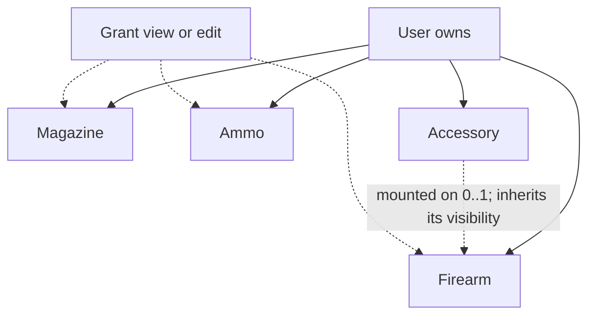

# Accessories Tracker - Plan

## Goal Capsule

- **Objective:** Let an owner track aftermarket parts (triggers, barrels, optics, suppressors, grips, stocks, etc.), which firearm each is mounted on, what it cost, and whether it is an NFA-regulated item — so the collection record supports valuation, insurance, and (later) service scheduling.
- **Product authority:** The individual firearm owner (STRATEGY primary persona) drives scope; accessories serve the "relational domain depth" and "owned data becomes owned insight" tracks.
- **Open blockers:** None block planning. Money storage format, primary-nav placement, and owner-wide valuation rollup are deferred to planning (see Outstanding Questions).

---

## Product Contract

### Summary

Add an **Accessory** as a fourth owner-scoped inventory item alongside Firearm, Magazine, and Ammo. An accessory mounts to one firearm at a time and can be moved between firearms while keeping its identity, cost, serial, and NFA status. A mounted accessory is visible to whoever its firearm is shared with; unmounted accessories are private to the owner. Accessories surface on their own top-level screen and as a mounted-parts section on the firearm detail page, with a per-firearm accessory-value total.

### Problem Frame

Owners customize firearms heavily, and the parts carry real money and, for suppressors and other NFA items, real legal weight. Today none of that is recorded: there is no accessory entity, no place to note what an optic cost or which suppressor is registered to what, and no way to keep that true as parts move between guns. The parts also don't stay put — an optic or a suppressor is routinely swapped across hosts, so a model that nails a part to one firearm drifts out of sync the moment the owner moves it. This is exactly the relational fact a spreadsheet can't hold: one part, changing hosts, retaining its own value and serial.

### Key Decisions

- **Accessory is an owner-scoped entity, but not independently shareable.** It is owned directly by the user (like Ammo) so it can exist unmounted "in the safe" — which rules out a firearm child record, since a child would be removed with its firearm and couldn't stand alone. But it carries no grants of its own: a mounted accessory inherits the visibility and permission of the firearm it is on, and an unmounted accessory is private to its owner. Independent per-accessory sharing was considered and deferred — no goal requires sharing a bare accessory apart from its firearm, and dropping it collapses a grant target, the visibility rules, and the permission model.
- **Mounting is a current-assignment link, with one bounded exception.** An accessory points at the firearm it is currently on (or nothing, when it is unmounted "in the safe"). There is no general timeline of past mounts — the sole exception is that a Range Session records which accessories were mounted for it, so an accessory's rounds fired (e.g., through a suppressor or barrel) can be derived for wear and service tracking, and so the planned range-performance logging can compare how the operator shot across accessory configurations on the same firearm.
- **Category is free-text with suggestions, not an enforced taxonomy.** Accessory kinds keep growing (lights, lasers, slings, magwells, charging handles), so the Ammo load-type pattern fits better than the firearm Type/Action pattern with its CHECK constraint and a migration per new kind.
- **Cost carries a per-firearm valuation rollup.** The insurance/valuation motivation wants a total, not just a field, so a firearm's detail shows the summed value of the accessories mounted on it.
- **NFA is a simple flag in v1, on both the Firearm and the Accessory.** A yes/no marker for regulated items — suppressors and other NFA accessories, and SBR/AOW/machine-gun firearms. Serials on both are treated as sensitive, exactly like existing firearm serials.

### Requirements

**Entity and fields**

- R1. An Accessory is an owned inventory item carrying a category, brand, model, optional serial number, optional installed date, optional cost, notes, and an NFA flag.
- R2. Category is free text with suggested values (trigger, barrel, sight, optic, suppressor, grip, stock, muzzle device, light, laser, sling, magwell, other), not a fixed enforced set.
- R3. Category is required on save; brand, model, serial, installed date, cost, and notes are all optional.

**Mounting and lifecycle**

- R4. An Accessory may be mounted to at most one of the owner's firearms at a time, or left unmounted. When the owner has no firearms yet, the mount control is omitted (or shown disabled) and the Accessory saves as unmounted.
- R5. Moving an Accessory between firearms is a reassignment that preserves its identity, cost, serial, and NFA status — never a delete-and-recreate.
- R6. Installed date records when the current mount began and is optional; reassigning an Accessory to a different firearm resets it to reflect the new mount.
- R19. A Range Session records which accessories were mounted on its firearm at the time of the session. This supports deriving an accessory's rounds fired (summed across the sessions it was attached for) and, for the planned range-performance logging, correlating performance with the accessory configuration (e.g., how the operator shot with one optic vs. another on the same firearm). Later reassigning or removing the accessory does not alter past sessions. This is the only mount history v1 keeps.

**Sharing and visibility**

- R7. An Accessory is owner-scoped and is not shared through its own grant. A mounted Accessory inherits the visibility and permission of the firearm it is on; an unmounted Accessory is visible only to its owner.
- R8. A mounted Accessory is visible to exactly the viewers who can see its firearm and appears in that firearm's mounted-accessories section for all of them. Moving or unmounting the Accessory changes who can see it accordingly.
- R9. Editing or deleting a mounted Accessory requires owner or edit permission on its firearm; an unmounted Accessory can be changed only by its owner. View grantees see accessories read-only.
- R17. Mounting, reassigning, or unmounting an Accessory requires owner or edit permission on every firearm involved (the current one and the target); the firearm picker offers only firearms the actor can edit. A user cannot mount an Accessory onto a firearm they cannot edit.

**Cost and valuation**

- R10. Each Accessory carries an optional cost.
- R11. A firearm's detail shows a derived total of the cost of the accessories currently mounted on it — computed on read, never stored. Because mounted accessories are visible to everyone who can see the firearm, the total is the same for every viewer.

**Serials and NFA**

- R12. An Accessory carries an NFA flag marking regulated items (suppressors especially, which carry their own serial numbers).
- R13. Accessory serial numbers are sensitive and are never written to CSV export, matching the existing "serials never exported" rule for firearm serials.
- R18. The Firearm entity also carries an NFA flag, marking regulated firearms (SBR, AOW, machine gun). It mirrors the Accessory NFA flag; existing firearm serial sensitivity is unchanged.

**Surfaces**

- R14. Accessories have a top-level surface — a list plus a per-accessory detail route — mirroring Firearms, Magazines, and Ammo, so unmounted accessories stay reachable and manageable.
- R15. The firearm detail page gains a mounted-accessories section listing the accessories currently on that firearm.
- R16. Create, edit, and delete reuse the existing confirm-dialog and delete-confirmation patterns for destructive actions.

### Key Flows

- F1. Add an accessory
  - **Trigger:** Owner adds a part, from either the Accessories screen or a firearm's detail.
  - **Steps:** Owner enters category (with suggestions) and optional fields, optionally selects a firearm to mount it on, and saves. When add is launched from a firearm's detail page, the mount target pre-fills to that firearm (still changeable or clearable before save).
  - **Outcome:** Accessory exists, owned by the user, mounted or unmounted.
  - **Covers:** R1, R2, R3, R4, R14, R15

- F2. Move or unmount an accessory
  - **Trigger:** Owner (or an edit grantee) reassigns a part to a different firearm, or removes it to the safe.
  - **Steps:** Owner changes the accessory's mounted firearm to another of the owner's firearms, or clears it.
  - **Outcome:** The accessory keeps its cost, serial, and NFA status; the old firearm's valuation drops and the new one's rises.
  - **Covers:** R4, R5, R11

- F3. Share a firearm's accessories (inherited)
  - **Trigger:** Owner shares a firearm through the existing firearm share control.
  - **Steps:** No accessory-specific action — the firearm's grant governs the accessories mounted on it.
  - **Outcome:** The grantee sees (or, with an edit grant, can change) the accessories mounted on that firearm; unmounted accessories stay private to the owner.
  - **Covers:** R7, R8, R9

### Acceptance Examples

- AE1. **Covers R8.** A firearm is shared view-only to Bob, with an optic mounted on it. **Then** Bob sees the optic (read-only) in the firearm's mounted-accessories list and its cost in the total, because accessory visibility follows the firearm. An accessory the owner leaves unmounted is not visible to Bob.
- AE2. **Covers R11.** A firearm has two visible mounted accessories at $400 and $150 and one with no cost. **Then** the viewer sees an accessory-value total of $550; the costless accessory contributes zero; unmounted accessories are not counted.
- AE3. **Covers R5, R11.** An optic mounted on firearm A is moved to firearm B. **Then** the optic retains its cost and serial, firearm A's accessory-value total drops by the optic's cost, and firearm B's rises by it.
- AE4. **Covers R13.** The owner exports inventory to CSV. **Then** no accessory serial number appears in the file.
- AE5. **Covers R12.** The owner marks an Accessory (e.g., a suppressor) as an NFA item on save. **Then** the NFA marker persists and displays wherever the Accessory's details render, to every viewer who can see the Accessory.

### Scope Boundaries

Deferred for later:

- A general install/remove history timeline (which part was on which firearm, when). v1 keeps only the current mount plus the per-range-session accessory snapshot (R19).
- Independent per-accessory sharing (a fourth grant target). Deferred until a concrete need to share a bare accessory apart from its firearm appears.
- Range-performance logging itself — a separate planned feature. R19 only captures the accessory-to-session linkage it will build on.
- Photos, documents, service intervals, and shot count on firearms or accessories — issue 8 gestures at these, but each is its own feature.
- Accessories as a target of the (not-yet-built) Service Intervals feature.
- Richer NFA data (tax-stamp / Form 4 tracking) beyond the yes/no flag.
- Adding firearms or accessories to CSV export — neither is exported today, so R13 is satisfied by construction rather than by new redaction code.

### Outstanding Questions

Deferred to planning:

- Money storage format (integer minor units vs. numeric) and display formatting.
- Whether the top-level Accessories surface gets its own primary-nav entry or is reached another way.
- Whether valuation also rolls up owner-wide (e.g., on the summary screen) or stays per-firearm in v1.
- The exact seed list of suggested categories.

### Sources / Research

- Owner-scoping, the child-record seam, and the Grant model are codified in `CONCEPTS.md` (Relationships, Child record, Grant). Accessory mirrors Ammo's owner-scoped shape but carries no grants of its own — its visibility follows the firearm it is mounted on, so the Grant model is not extended.
- Ammo table shape to mirror for an owner-scoped entity: `src/db/inventory-schema.ts` (`ammo`, lines ~141–167); the child-record FK+cascade shape is `rangeSession` (~216–238); the Grant model with `parentType` is `grant` (~240+).
- The firearm detail view already exists and is where the mounted-accessories section and valuation total land: `app/(app)/firearms/[id]/page.tsx` and `app/(app)/firearms/firearm-detail-view.tsx` (which already composes `ShareControl`, `RangeSessionHistory`, `InventoryLogHistory`, `ConfirmDialog`, and `useDeleteConfirmation`).
- Serial redaction rule: CSV export is magazines-only and "serial is never a column" in `src/domain/csv/serialize.ts` (R45). Firearms and accessories are absent from CSV entirely — `app/api/export/route.ts`.
- Free-text-with-suggestions precedent (Ammo load type) vs. enforced taxonomy (Firearm Type/Action): `src/domain/ammo/constants.ts` and `src/domain/firearms/constants.ts`.
