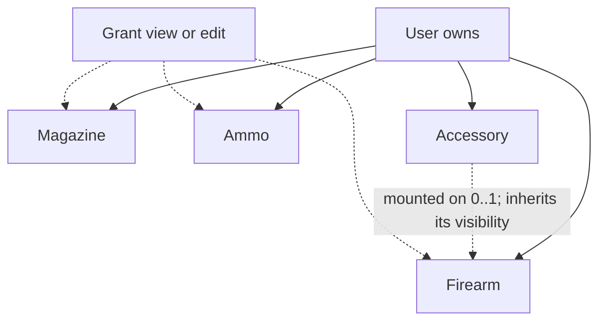
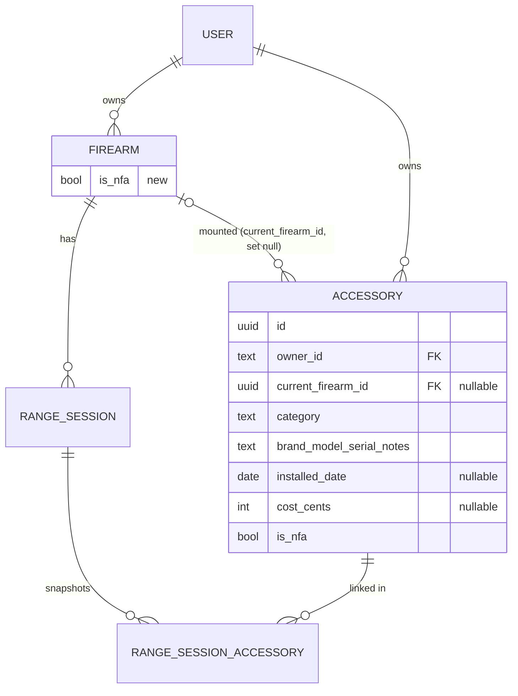
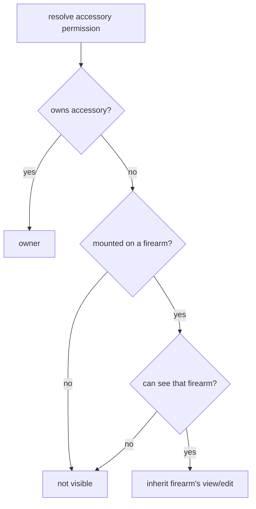

# Accessories Tracker - Plan

## Goal Capsule

- **Objective:** Let an owner track aftermarket parts (triggers, barrels, optics, suppressors, grips, stocks, etc.), which firearm each is mounted on, what it cost, and whether it is an NFA-regulated item — so the collection record supports valuation, insurance, and (later) service scheduling.
- **Product authority:** The individual firearm owner (STRATEGY primary persona) drives scope; accessories serve the "relational domain depth" and "owned data becomes owned insight" tracks.
- **Open blockers:** None. Planning resolved the four deferred questions — money storage (integer cents, KTD2), primary-nav placement (app-shell, U5), category seed list (constants, KTD3), owner-wide valuation (deferred to follow-up, KTD6).

---

## Product Contract

### Summary

Add an **Accessory** as a fourth owner-scoped inventory item alongside Firearm, Magazine, and Ammo. An accessory mounts to one firearm at a time and can be moved between firearms while keeping its identity, cost, serial, and NFA status. A mounted accessory is visible to whoever its firearm is shared with; unmounted accessories are private to the owner. Accessories surface on their own top-level screen and as a mounted-parts section on the firearm detail page, with a per-firearm accessory-value total.

### Problem Frame

Owners customize firearms heavily, and the parts carry real money and, for suppressors and other NFA items, real legal weight. Today none of that is recorded: there is no accessory entity, no place to note what an optic cost or which suppressor is registered to what, and no way to keep that true as parts move between guns. The parts also don't stay put — an optic or a suppressor is routinely swapped across hosts, so a model that nails a part to one firearm drifts out of sync the moment the owner moves it. This is exactly the relational fact a spreadsheet can't hold: one part, changing hosts, retaining its own value and serial.

### Key Decisions

- **Accessory is an owner-scoped entity, but not independently shareable.** It is owned directly by the user (like Ammo) so it can exist unmounted "in the safe" — which rules out a firearm child record, since a child would be removed with its firearm and couldn't stand alone. But it carries no grants of its own: a mounted accessory inherits the visibility and permission of the firearm it is on, and an unmounted accessory is private to its owner. Independent per-accessory sharing was considered and deferred — no goal requires sharing a bare accessory apart from its firearm, and dropping it collapses a grant target, the visibility rules, and the permission model.
- **Mounting is a current-assignment link, with one bounded exception.** An accessory points at the firearm it is currently on (or nothing, when it is unmounted "in the safe"). There is no general timeline of past mounts — the sole exception is that a Range Session records which accessories were mounted for it, so an accessory's rounds fired (e.g., through a suppressor or barrel) can be derived for wear and service tracking, and so the planned range-performance logging can compare how the operator shot across accessory configurations on the same firearm.
- **Category is free-text with suggestions, not an enforced taxonomy.** Accessory kinds keep growing (lights, lasers, slings, magwells, charging handles), so the Ammo load-type pattern fits better than the firearm Type/Action pattern with its CHECK constraint and a migration per new kind.
- **Cost carries a per-firearm valuation rollup.** The insurance/valuation motivation wants a total, not just a field, so a firearm's detail shows the summed value of the accessories mounted on it.
- **NFA is a simple flag in v1, on both the Firearm and the Accessory.** A yes/no marker for regulated items — suppressors and other NFA accessories, and SBR/AOW/machine-gun firearms. Serials on both are treated as sensitive, exactly like existing firearm serials.

### Requirements

**Entity and fields**

- R1. An Accessory is an owned inventory item carrying a category, brand, model, optional serial number, optional installed date, optional cost, notes, and an NFA flag.
- R2. Category is free text with suggested values (trigger, barrel, sight, optic, suppressor, grip, stock, muzzle device, light, laser, sling, magwell, other), not a fixed enforced set.
- R3. Category is required on save; brand, model, serial, installed date, cost, and notes are all optional.

**Mounting and lifecycle**

- R4. An Accessory may be mounted to at most one of the owner's firearms at a time, or left unmounted. When the owner has no firearms yet, the mount control is omitted (or shown disabled) and the Accessory saves as unmounted.
- R5. Moving an Accessory between firearms is a reassignment that preserves its identity, cost, serial, and NFA status — never a delete-and-recreate.
- R6. Installed date records when the current mount began and is optional; reassigning an Accessory to a different firearm resets it to reflect the new mount.
- R19. A Range Session records which accessories were mounted on its firearm at the time of the session. This supports deriving an accessory's rounds fired (summed across the sessions it was attached for) and, for the planned range-performance logging, correlating performance with the accessory configuration (e.g., how the operator shot with one optic vs. another on the same firearm). Later reassigning or removing the accessory does not alter past sessions. This is the only mount history v1 keeps.

**Sharing and visibility**

- R7. An Accessory is owner-scoped and is not shared through its own grant. A mounted Accessory inherits the visibility and permission of the firearm it is on; an unmounted Accessory is visible only to its owner.
- R8. A mounted Accessory is visible to exactly the viewers who can see its firearm and appears in that firearm's mounted-accessories section for all of them. Moving or unmounting the Accessory changes who can see it accordingly.
- R9. Editing or deleting a mounted Accessory requires owner or edit permission on its firearm; an unmounted Accessory can be changed only by its owner. View grantees see accessories read-only.
- R17. Mounting, reassigning, or unmounting an Accessory requires owner or edit permission on every firearm involved (the current one and the target); the firearm picker offers only firearms the actor can edit. A user cannot mount an Accessory onto a firearm they cannot edit.

**Cost and valuation**

- R10. Each Accessory carries an optional cost.
- R11. A firearm's detail shows a derived total of the cost of the accessories currently mounted on it — computed on read, never stored. Because mounted accessories are visible to everyone who can see the firearm, the total is the same for every viewer.

**Serials and NFA**

- R12. An Accessory carries an NFA flag marking regulated items (suppressors especially, which carry their own serial numbers).
- R13. Accessory serial numbers are sensitive and are never written to CSV export, matching the existing "serials never exported" rule for firearm serials.
- R18. The Firearm entity also carries an NFA flag, marking regulated firearms (SBR, AOW, machine gun). It mirrors the Accessory NFA flag; existing firearm serial sensitivity is unchanged.

**Surfaces**

- R14. Accessories have a top-level surface — a list plus a per-accessory detail route — mirroring Firearms, Magazines, and Ammo, so unmounted accessories stay reachable and manageable.
- R15. The firearm detail page gains a mounted-accessories section listing the accessories currently on that firearm.
- R16. Create, edit, and delete reuse the existing confirm-dialog and delete-confirmation patterns for destructive actions.

### Key Flows

- F1. Add an accessory
  - **Trigger:** Owner adds a part, from either the Accessories screen or a firearm's detail.
  - **Steps:** Owner enters category (with suggestions) and optional fields, optionally selects a firearm to mount it on, and saves. When add is launched from a firearm's detail page, the mount target pre-fills to that firearm (still changeable or clearable before save).
  - **Outcome:** Accessory exists, owned by the user, mounted or unmounted.
  - **Covers:** R1, R2, R3, R4, R14, R15

- F2. Move or unmount an accessory
  - **Trigger:** Owner (or an edit grantee) reassigns a part to a different firearm, or removes it to the safe.
  - **Steps:** Owner changes the accessory's mounted firearm to another of the owner's firearms, or clears it.
  - **Outcome:** The accessory keeps its cost, serial, and NFA status; the old firearm's valuation drops and the new one's rises.
  - **Covers:** R4, R5, R11

- F3. Share a firearm's accessories (inherited)
  - **Trigger:** Owner shares a firearm through the existing firearm share control.
  - **Steps:** No accessory-specific action — the firearm's grant governs the accessories mounted on it.
  - **Outcome:** The grantee sees (or, with an edit grant, can change) the accessories mounted on that firearm; unmounted accessories stay private to the owner.
  - **Covers:** R7, R8, R9

### Acceptance Examples

- AE1. **Covers R8.** A firearm is shared view-only to Bob, with an optic mounted on it. **Then** Bob sees the optic (read-only) in the firearm's mounted-accessories list and its cost in the total, because accessory visibility follows the firearm. An accessory the owner leaves unmounted is not visible to Bob.
- AE2. **Covers R11.** A firearm has two visible mounted accessories at $400 and $150 and one with no cost. **Then** the viewer sees an accessory-value total of $550; the costless accessory contributes zero; unmounted accessories are not counted.
- AE3. **Covers R5, R11.** An optic mounted on firearm A is moved to firearm B. **Then** the optic retains its cost and serial, firearm A's accessory-value total drops by the optic's cost, and firearm B's rises by it.
- AE4. **Covers R13.** The owner exports inventory to CSV. **Then** no accessory serial number appears in the file.
- AE5. **Covers R12.** The owner marks an Accessory (e.g., a suppressor) as an NFA item on save. **Then** the NFA marker persists and displays wherever the Accessory's details render, to every viewer who can see the Accessory.

### Scope Boundaries

Deferred for later:

- A general install/remove history timeline (which part was on which firearm, when). v1 keeps only the current mount plus the per-range-session accessory snapshot (R19).
- Independent per-accessory sharing (a fourth grant target). Deferred until a concrete need to share a bare accessory apart from its firearm appears.
- Range-performance logging itself — a separate planned feature. R19 only captures the accessory-to-session linkage it will build on.
- Photos, documents, service intervals, and shot count on firearms or accessories — issue 8 gestures at these, but each is its own feature.
- Accessories as a target of the (not-yet-built) Service Intervals feature.
- Richer NFA data (tax-stamp / Form 4 tracking) beyond the yes/no flag.
- Adding firearms or accessories to CSV export — neither is exported today, so R13 is satisfied by construction rather than by new redaction code.

### Outstanding Questions

Resolved during planning (see Planning Contract):

- Money storage → integer minor units, `cost_cents` (KTD2).
- Primary-nav placement → an app-shell nav entry alongside Firearms/Magazines/Ammo (U5).
- Category seed list → R2's values, in `src/domain/accessories/constants.ts` (KTD3).
- Owner-wide valuation rollup → deferred to follow-up; v1 ships per-firearm only (KTD6).

### Sources / Research

- Owner-scoping, the child-record seam, and the Grant model are codified in `CONCEPTS.md` (Relationships, Child record, Grant). Accessory mirrors Ammo's owner-scoped shape but carries no grants of its own — its visibility follows the firearm it is mounted on, so the Grant model is not extended.
- Ammo table shape to mirror for an owner-scoped entity: `src/db/inventory-schema.ts` (`ammo`, lines ~141–167); the child-record FK+cascade shape is `rangeSession` (~216–238); the Grant model with `parentType` is `grant` (~240+).
- The firearm detail view already exists and is where the mounted-accessories section and valuation total land: `app/(app)/firearms/[id]/page.tsx` and `app/(app)/firearms/firearm-detail-view.tsx` (which already composes `ShareControl`, `RangeSessionHistory`, `InventoryLogHistory`, `ConfirmDialog`, and `useDeleteConfirmation`).
- Serial redaction rule: CSV export is magazines-only and "serial is never a column" in `src/domain/csv/serialize.ts` (R45). Firearms and accessories are absent from CSV entirely — `app/api/export/route.ts`.
- Free-text-with-suggestions precedent (Ammo load type) vs. enforced taxonomy (Firearm Type/Action): `src/domain/ammo/constants.ts` and `src/domain/firearms/constants.ts`.

---

## Planning Contract

**Product Contract preservation:** unchanged by this enrichment. R17/R18/R19 and the inherit-from-mount sharing model were settled during the `ce-doc-review` pass that preceded planning; planning builds on them without altering product scope.

### Key Technical Decisions

- KTD1. **Accessory is owner-scoped but not a grant `ParentType`.** The grant `parent_type` set stays `('firearm','magazine','ammo')`. An `accessory` row carries `owner_id` plus a nullable `current_firearm_id`. A mounted accessory's visibility is derived from its firearm (owned ∪ firearm-granted); an unmounted accessory is owner-only. This is the one seam that does not mirror Ammo — Ammo is a grant target, Accessory is not — because R7/R8 require visibility to follow the firearm and the fourth grant target was dropped.
- KTD2. **Cost is stored as integer minor units (`cost_cents`).** Mirrors the repo's integer-column convention (`grain`, `quantity_rounds`; int4-bounded in #53) and avoids floating-point money; formatting to currency happens at the edge.
- KTD3. **Category is free text with a suggested list, no CHECK constraint.** Mirrors `src/domain/ammo/constants.ts` load-type suggestions, not the firearm Type/Action CHECK. Seed list = R2's values.
- KTD4. **`current_firearm_id` uses `onDelete: set null`.** Deleting a firearm unmounts its accessories (they survive, owner-scoped) rather than cascading them away — an accessory outlives the guns it rides on. Contrast Range Session, which cascades.
- KTD5. **Mount/reassign authorization checks the firearm side and keeps accessories on their owner's guns.** `mountAccessory` requires own-or-edit on the accessory, edit on the target firearm (`authorizeUpdate(tx, actor, "firearm", firearmId)`), AND that the target firearm is owned by the accessory's owner. The same-owner rule stops a shared-firearm edit-grantee from relocating someone else's accessory onto an unrelated third party's gun (which would leak the accessory to that gun's viewers). Closes the cross-tenant-mount gap (R17).
- KTD6. **Per-firearm valuation is a derived read; owner-wide rollup deferred.** R11 sums `cost_cents` over the firearm's mounted accessories at read time (no stored counter), mirroring the firearm Lifetime Total derivation. Owner-wide valuation ships in a follow-up.
- KTD7. **Range Session ↔ Accessory linkage snapshots the mount set at session-create.** A `range_session_accessory` join records which accessories were mounted when the session was logged; per-accessory rounds fired = sum of `rounds_fired` over its linked sessions. Later reassigning/removing the accessory does not alter past sessions (R19). This is the only history v1 keeps, and it seeds the planned range-performance logging.

### High-Level Technical Design

Data model (new/changed in bold):

Accessory permission resolution (KTD1 — not a grant lookup):

### Sequencing

Data layer first (U1), then domain (U2–U4), then UI (U5–U6), then the range-session linkage (U7), then end-to-end tests (U8). U3 (visibility/authz) gates U4 (service); U4 gates the UI units. U7 depends on U1 (join table) and U4 (mount state).

### Assumptions

- Migrations are generated with `drizzle-kit generate` (`drizzle.config.ts`) and applied with `bun run db:migrate`; new files land as `0011_*` (accessory + firearm NFA) and `0012_*` (range-session join).
- No CSV work: accessories are absent from CSV export (Scope Boundaries), so R13 holds by construction — no serializer changes (`src/domain/csv/*` untouched).

---

## Implementation Units

### U1. Accessory + firearm-NFA schema and migration

- **Goal:** Add the `accessory` table, the `is_nfa` firearm column, and generate the migration.
- **Requirements:** R1, R3, R4, R6, R10, R12, R18
- **Dependencies:** none
- **Files:** `src/db/inventory-schema.ts`, `src/db/schema.ts` (re-export `accessory`), `src/db/migrations/0011_*.sql` (generated), `src/db/__tests__/schema.test.ts`
- **Approach:** Add `accessory` pgTable mirroring `ammo`'s owner-scoped shape (inventory-schema.ts ~141): `id` uuid pk, `owner_id` text FK user cascade, `current_firearm_id` uuid FK firearm `onDelete: set null` (nullable, KTD4), `category` text notNull, `brand`/`model`/`serial_number`/`notes` text notNull default `''` (empty-not-null, R18 convention), `installed_date` date nullable, `cost_cents` integer nullable (KTD2), `is_nfa` boolean notNull default false, created/updated timestamps. Indexes on `owner_id` and `current_firearm_id`. Add `is_nfa boolean notNull default false` to `firearm`. Do **not** touch the grant `parent_type` CHECK.
- **Patterns to follow:** `ammo` table for the owner-scoped shape; `rangeSession.firearmId` FK for the firearm reference (but `set null`, not cascade); int4 bounds per #53.
- **Test scenarios:** schema test asserts accessory columns + defaults and firearm `is_nfa` default false; a fresh Testcontainers migrate applies cleanly. `Test expectation: none` for the generated SQL itself — behavior is exercised by U3/U4.
- **Verification:** `bun run db:migrate` applies on a fresh Postgres; `bun run typecheck` green.

### U2. Accessory validation + constants

- **Goal:** Field validation and category suggestions.
- **Requirements:** R2, R3
- **Dependencies:** U1
- **Files:** `src/domain/accessories/validate.ts`, `src/domain/accessories/constants.ts`, `src/domain/accessories/__tests__/validate.test.ts`
- **Approach:** `validateAccessory` returns error codes: category required/non-empty (R3); `cost_cents >= 0` when present; `installed_date` a valid `YYYY-MM-DD` when present. `constants.ts` exports the category suggestion list (R2's values, incl. `suppressor`). Mirror `src/domain/ammo/validate.ts` + `constants.ts`.
- **Test scenarios:** empty category → error; negative cost → error; category-only minimal input → ok; suggestions list contains `suppressor` and `optic`.
- **Verification:** `bun test` unit suite green.

### U3. Accessory visibility & mount authorization

- **Goal:** The inherit-from-mount visibility/permission seam and mount authz (the one non-Ammo seam).
- **Requirements:** R7, R8, R9, R17
- **Dependencies:** U1
- **Files:** `src/auth/accessory-visibility.ts`, `src/auth/__tests__/accessory-visibility.test.ts`
- **Approach:** `listVisibleAccessoryIds(db, userId)` = accessories owned by user ∪ accessories whose `current_firearm_id ∈ getVisibleIds(db, userId, "firearm")`. `resolveAccessoryPermission(db, userId, accessoryId)`: `owner` if owned; else if mounted on a firearm the user can see, return that firearm's permission via `resolvePermission(db, userId, "firearm", current_firearm_id)`; else `null`. `authorizeMount(tx, actorId, accessoryId, targetFirearmId | null)`: require own-or-edit on the accessory AND (target null OR (`authorizeUpdate(tx, actorId, "firearm", targetFirearmId)` AND the target firearm's `owner_id` equals the accessory's `owner_id`)). Reuse `src/auth/visibility.ts` helpers; do **not** extend `ParentType`.
- **Patterns to follow:** `getVisibleIds` / `resolvePermission` (`src/auth/visibility.ts`); `authorizeUpdate` (`src/auth/authorize.ts`).
- **Test scenarios:** owner sees own mounted + unmounted; firearm view-grantee sees the mounted accessory read-only (Covers AE1) but not an unmounted one; firearm edit-grantee gets edit on its mounted accessories; mount onto a non-editable firearm is rejected (Covers R17); mount onto a firearm owned by a different user is rejected even when the actor can edit both firearms (Covers R17 cross-owner); unmount by a non-owner / non-firearm-editor is rejected. Integration tests gate on `DATABASE_URL` (Testcontainers).
- **Verification:** `bun test` green with a live DB.

### U4. Accessory service (CRUD + mount/reassign/unmount)

- **Goal:** Visibility-scoped CRUD plus mount operations.
- **Requirements:** R1, R4, R5, R6, R9, R17
- **Dependencies:** U2, U3
- **Files:** `src/domain/accessories/service.ts`, `src/domain/accessories/__tests__/service.test.ts`
- **Approach:** `create`/`update`/`get`/`list` mirror `src/domain/ammo/service.ts`, but scope through U3's helpers (`listVisibleAccessoryIds`, `resolveAccessoryPermission`) instead of `getVisibleIds("ammo")`. `mountAccessory(actor, accessoryId, firearmId | null)` calls `authorizeMount`, sets `current_firearm_id`, and resets `installed_date` on reassignment (R6). Delete of a mounted accessory follows the same permission as edit — owner or edit on its current firearm (via `resolveAccessoryPermission`); an unmounted accessory is owner-only delete (R9). A bespoke delete path is needed: accessories are not a `ParentType`, so there is no `authorizeAndDeleteParent` reuse, and they have no grants to clean up.
- **Test scenarios:** create mounted and unmounted; move between firearms preserves cost/serial/NFA and resets installed_date (Covers AE3); unmount; `list` returns the visible set; `get` outside the visible set → not-found; edit permission follows the firearm; a firearm edit-grantee can delete a mounted accessory but not an unmounted one (Covers R9).
- **Verification:** service tests pass with a live DB.

### U5. Top-level Accessories surface (list, detail, form, actions, nav)

- **Goal:** The standalone Accessories screens and nav entry, so unmounted accessories stay reachable.
- **Requirements:** R1, R2, R3, R4, R12, R14, R16
- **Dependencies:** U4
- **Files:** `app/(app)/accessories/page.tsx`, `app/(app)/accessories/accessories-view.tsx`, `app/(app)/accessories/accessory-form.tsx`, `app/(app)/accessories/accessory-detail-view.tsx`, `app/(app)/accessories/actions.ts`, `app/(app)/accessories/[id]/page.tsx`, `app/(app)/app-shell.tsx` (nav entry)
- **Approach:** Mirror `app/(app)/ammo/*` (page → view → form → detail + server actions). The form carries category (suggestion datalist), brand, model, serial, installed date, a cost input mapped to `cost_cents`, notes, an NFA checkbox, and a firearm mount selector whose options are the actor's editable firearms — omitted/disabled with a "save unmounted" affordance when the actor has none (R4). Detail view reuses `ConfirmDialog` + `useDeleteConfirmation` for delete (R16) and edit-in-place like `firearm-detail-view.tsx`. Add the nav entry in `app-shell.tsx` alongside Firearms/Magazines/Ammo.
- **Patterns to follow:** `app/(app)/ammo/*`; `app/(app)/firearms/firearm-detail-view.tsx` for edit-in-place + delete.
- **Test scenarios:** behavior covered by U8 e2e. `Test expectation: none` at unit level for the server-component wiring — server actions delegate to U4, which is unit-tested; UI is verified via e2e.
- **Verification:** `bun run typecheck`, `bun run lint`; renders in dev.

### U6. Firearm detail: mounted-accessories section, valuation total, firearm NFA

- **Goal:** Surface accessories on the firearm detail page and add the firearm NFA flag.
- **Requirements:** R8, R11, R15, R18
- **Dependencies:** U4
- **Files:** `app/(app)/firearms/[id]/page.tsx`, `app/(app)/firearms/firearm-detail-view.tsx`, `app/(app)/firearms/firearm-form.tsx`, `app/(app)/firearms/mounted-accessories.tsx` (new), `src/domain/accessories/service.ts` (add `listMountedForFirearm` + valuation helper)
- **Approach:** The page fetches the accessories mounted on the firearm (all firearm-viewers see them, KTD1) and the derived cost total, and passes them to a new mounted-accessories section in the detail view (list + link to each accessory + an add-accessory entry pre-filled to this firearm, F1). Add an NFA checkbox to `firearm-form.tsx` and display it in the detail view (R18). Valuation total is derived on read and currency-formatted (R11).
- **Patterns to follow:** the existing `RangeSessionHistory` / `InventoryLogHistory` sections in `firearm-detail-view.tsx`; `magazineCountForFirearm` for the fetch-and-count shape.
- **Test scenarios:** covered by U8 e2e — valuation sums mounted accessories, costless contributes 0, unmounted excluded (Covers AE2); firearm NFA persists and displays (Covers AE5-adjacent for firearms); mounted section shows accessories to a firearm grantee (Covers AE1).
- **Verification:** `bun run typecheck`; renders in dev.

### U7. Range Session ↔ Accessory linkage

- **Goal:** Capture the mounted accessories per range session; derive per-accessory rounds fired.
- **Requirements:** R19
- **Dependencies:** U1, U4
- **Files:** `src/db/inventory-schema.ts` (`range_session_accessory` join) + `src/db/migrations/0012_*.sql`, `src/db/schema.ts` (re-export), `src/domain/range-sessions/service.ts`, `src/domain/range-sessions/__tests__/service.test.ts`
- **Approach:** Add `range_session_accessory` with a surrogate `id` uuid PK, a unique index on (`range_session_id`, `accessory_id`), `range_session_id` FK cascade, and `accessory_id` FK `onDelete: set null` — **nullable**, because a composite PK cannot hold the set-null side (PK columns are NOT NULL). On range-session create, snapshot the firearm's currently-mounted accessories into the join. Derive per-accessory rounds = sum of `rounds_fired` over its linked sessions. A later accessory delete sets `accessory_id` null (the session row survives, R19). When rendering a session's linked accessories, gate each accessory's fields (serial, cost, NFA, brand/model) through the viewer's current `resolveAccessoryPermission` — a since-unmounted (owner-only) accessory shows a placeholder to other viewers, never its details (R7).
- **Test scenarios:** creating a session links the firearm's mounted accessories (Covers R19); per-accessory rounds sums its linked sessions; deleting an accessory leaves the session row (with `accessory_id` null); reassigning an accessory later does not change past linkage; a firearm view-grantee viewing an old session does not see the fields of an accessory that has since been unmounted (Covers R7).
- **Verification:** service + schema tests pass with a live DB.

### U8. End-to-end tests + factories

- **Goal:** Playwright e2e coverage and a shared accessory factory.
- **Requirements:** R4, R5, R7, R8, R11, R12, R13, R14
- **Dependencies:** U5, U6, U7
- **Files:** `e2e/accessories.spec.ts`, `src/test-support/factories.ts` (accessory factory)
- **Approach:** e2e (Testcontainers/Docker, `bun run test:e2e`): create an accessory (mounted and unmounted); move it between firearms; share a firearm and confirm the grantee sees its mounted accessory read-only but not an unmounted one (Covers AE1); read the per-firearm valuation total (Covers AE2); mark an accessory as NFA and confirm the marker displays to a firearm view-grantee (Covers AE5); export CSV and confirm no accessory serial appears (Covers AE4 — trivially, accessories are absent from CSV). Target UI via ARIA roles / accessible names / visible text — **no `data-testid`**.
- **Execution note:** the sharing-inheritance and cross-tenant-mount paths are the highest-risk behaviors; prove them with integration/e2e coverage, not mocks.
- **Test scenarios:** as above.
- **Verification:** `bun run test:e2e` green.

---

## Verification Contract

| Gate | Command | Applies to |
|---|---|---|
| Types | `bun run typecheck` | all units |
| Lint | `bun run lint` (biome) | all units |
| Unit + integration | `bun test` (integration gates on `DATABASE_URL`, Testcontainers) | U1–U4, U7 |
| Migrations | `bun run db:migrate` on a fresh Postgres | U1, U7 |
| E2E | `bun run test:e2e` (Docker) | U5, U6, U8 |
| Pre-commit gate | `just ci-check` — **MUST pass before every commit** | all |

Acceptance coverage: AE1 in U3/U8, AE2 in U6/U8, AE3 in U4, AE4 in U8, AE5 in U8.

---

## Definition of Done

- R1–R19 satisfied and each traced to a unit; AE1–AE5 covered by tests.
- New `accessory` table, `firearm.is_nfa` column, and `range_session_accessory` join migrated; `bun run db:migrate` clean on a fresh DB.
- Accessories CRUD + mount/move/unmount work owner-scoped; mounted accessories inherit their firearm's visibility; unmounted accessories are owner-only; cross-tenant mount is rejected (R17).
- Per-firearm valuation total renders; firearm and accessory NFA flags persist and display.
- Range-session → accessory linkage captured; per-accessory rounds fired derivable.
- `just ci-check` green; unit, integration, and e2e suites green.
- No `data-testid` added; UI targeted via ARIA roles / accessible names / visible text.
- Abandoned or experimental code removed from the diff.
- Out of scope and untouched: owner-wide valuation, a general mount-history timeline, photos/documents/service-intervals/shot-count, independent per-accessory sharing, and CSV export of accessories.
