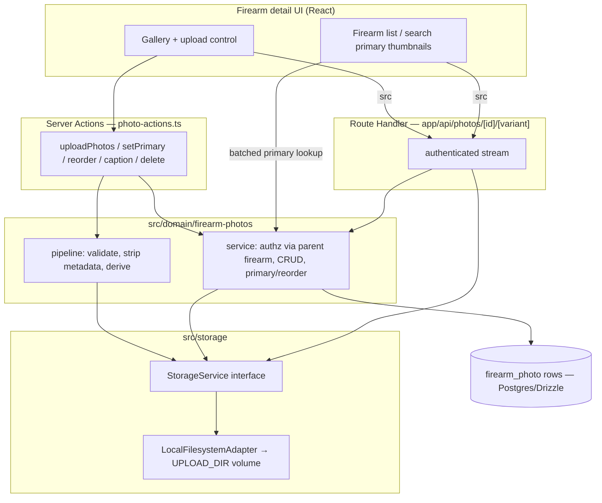

# Firearm Photo Management - Plan

## Goal Capsule

- **Objective:** Add photo management to firearms — upload, gallery, reorder, captions, delete, and a primary image — on a reusable upload/media foundation that issue #12 (document attachments) will reuse.
- **Product authority:** Repo owner (issue #9 author). Product Contract is authoritative for WHAT; this plan owns HOW.
- **Execution profile:** Deep feature, ~8 implementation units, dependency-ordered. Standard test-after with characterization not required (greenfield feature area).
- **Stop conditions:** A blocking product/architecture question surfaces (none open), or `just ci-check` cannot pass. Surface rather than guess.
- **Product Contract preservation:** Changed during planning with user approval — R1 (dropped unused existence-check), R2 (local-filesystem backend replaces bundled SeaweedFS), R4 (narrowed reuse claim to what generalizes); added R21–R26 to resolve deferred review decisions. Core product scope unchanged.

---

## Product Contract

### Summary

Introduce a reusable upload/media layer — an entity-agnostic storage service (local-filesystem adapter behind an interface) plus a shared validate → strip-location-metadata → generate-derivatives pipeline — and build firearm photo management on top of it. Photos are a firearm child family, processed synchronously on upload and served only through authenticated app endpoints. The primary image shows on the firearm detail view and as a list/search thumbnail.

### Problem Frame

A firearm record today is text only. For a collection that has outgrown memory, that leaves real gaps: an owner can't visually confirm which firearm a row refers to, can't capture finish, markings, optics, accessories, or condition-over-time for insurance and record-keeping, and can't recognize an item at a glance in a long list. Photos close that gap, and they're the first of a broader attachment need — issue #12 wants documents attached the same way — so the upload/storage substrate is worth building once and reusing rather than solving twice.

### Requirements

**Storage and media layer**

- R1. A reusable storage service exposes save, read/stream, delete, and stable-key generation, decoupled from any single backend so future attachment features reuse it unchanged.
- R2. The app reads and writes blobs only through the storage interface. The v1 backend is a local-filesystem adapter writing under a configured upload directory (a mounted Docker volume); an S3-compatible adapter can be added later behind the same interface without touching callers.
- R3. Storage keys are generated server-side and are non-guessable; user-supplied filenames never determine the storage path (path-traversal safe).
- R4. The storage service and the generic validate→persist steps are reusable across attachment features; the strip-location-metadata and generate-derivatives steps are image-only stages that non-image features (e.g. #12) skip.

**Photo model and lifecycle**

- R5. A `firearm_photo` record belongs to one firearm and carries: storage key, MIME type, size in bytes, width, height, optional caption, sort order, primary flag, and uploaded-at timestamp. Derivatives (thumbnail/preview) are addressable via a deterministic convention derived from the stored key, so retrieval (R17) and deletion (R8, R19) locate every blob, not just the original.
- R6. Photos carry no independent owner or grants; every read and write inherits the parent firearm's ownership and sharing.
- R7. At most one photo per firearm is primary at a time; setting a new primary clears the previous one.
- R8. Deleting a firearm removes its photo records and deletes their stored blobs (originals and derivatives) from the backend. The row delete and the blob delete are separate operations and not transactionally atomic, so blob deletion is best-effort within the delete flow; any object orphaned by a mid-operation failure is reclaimed by an orphan-sweep path rather than assumed impossible.
- R19. Deleting a single photo while its firearm is kept removes the `firearm_photo` row and deletes its stored blobs — originals and derivatives — under the same best-effort/orphan-sweep guarantee as R8.

**Upload pipeline and security**

- R9. Uploads are validated against an image MIME allow-list (which excludes SVG and other markup- or script-capable formats) and a maximum file-size limit; malformed files are rejected. Decoded image dimensions/pixel count are bounded independent of the compressed file size, so a decompression-bomb image is rejected before it can exhaust memory or CPU.
- R10. All embedded location metadata is stripped before any image is persisted — EXIF GPS, XMP and IPTC location fields, and any GPS carried in an embedded EXIF thumbnail — not the primary EXIF GPS tag alone.
- R11. Image dimensions are captured and thumbnail/preview derivatives are generated server-side, synchronously on upload — not by resizing originals in the browser.
- R26. A single upload request accepts at most a configured number of files, independent of the per-file size limit, so synchronous processing stays within a safe request budget.

**Retrieval and authorization**

- R12. Every photo read and delete is authenticated and authorization-checked against the parent firearm; a user with no visibility of the firearm cannot access its photos.
- R13. Photos are served only through authenticated application endpoints that stream from storage; raw or public object-store URLs are never exposed. The serving endpoint sets the response `Content-Type` from the server-validated type (never client-supplied) and sends `X-Content-Type-Options: nosniff`, so stored bytes cannot execute as script in another user's session.
- R14. Creating, deleting, reordering, captioning, and setting a primary all require edit access on the parent firearm; an edit-grantee may perform them.
- R20. The upload endpoint is rate-limited and bounded by a per-firearm (or per-user) photo-count/storage quota, consistent with the existing in-memory rate-limit primitive, so a low-trust edit-grantee cannot exhaust CPU or disk for the whole instance.

**UI/UX**

- R15. The firearm detail view provides photo management: upload one or multiple photos, a thumbnail gallery, mark one photo primary, reorder photos, edit/remove captions, and delete photos.
- R16. The primary image appears on the firearm detail view and as a compact thumbnail in firearm list rows, cards, and search results.
- R17. Lists and detail views use thumbnail/preview derivatives, never full-size originals; thumbnails lazy-load and reserve explicit space to avoid layout shift.
- R18. List and search views resolve primary thumbnails for the visible firearm set in a single batched lookup, not per-row fetches.
- R21. Multi-file uploads are evaluated per file: valid files persist and appear in the gallery, invalid files are rejected individually with a reason surfaced, and one bad file never blocks the rest of the batch.
- R22. A firearm with no photos (or no primary) renders a fixed-size neutral placeholder — consistent across detail, list rows, cards, and search — never a reflow or a broken image.
- R23. Deleting the primary photo auto-promotes the next photo by sort order to primary; if no photos remain, the firearm has no primary.
- R24. Reorder exposes a keyboard-operable control (not drag-only); an uncaptioned photo's accessible name falls back to the firearm's name plus its gallery position, per the product's WCAG 2.2 AA commitment.
- R25. The upload control shows an in-progress state and disables resubmission for the duration of the synchronous upload+processing request.

### Key Flows

- F1. Upload photos
  - **Trigger:** Owner or edit-grantee uploads one or more images on the firearm detail view.
  - **Steps:** Action authorizes edit on the firearm → each file is validated (MIME allow-list, size limit, pixel cap, not malformed) → location metadata stripped → dimensions captured and derivatives generated → original + derivatives persisted via the storage service → a `firearm_photo` row is recorded per image; invalid files are reported per-file without blocking the batch. The first photo on a firearm with no primary becomes primary.
  - **Outcome:** Valid photos appear in the gallery; the control shows progress and re-enables on completion.
  - **Covered by:** R2, R3, R4, R5, R9, R10, R11, R14, R21, R25, R26.
- F2. Set primary
  - **Trigger:** Owner or edit-grantee marks a gallery photo primary.
  - **Steps:** Authorize edit → clear the existing primary → set the chosen photo primary.
  - **Outcome:** The chosen image represents the firearm on detail and in list/search thumbnails.
  - **Covered by:** R7, R14, R16.
- F3. Reorder, caption, delete
  - **Trigger:** Owner or edit-grantee reorders the gallery, edits/removes a caption, or deletes a photo.
  - **Steps:** Authorize edit → apply the change; on delete, remove the row and its blobs, and if the deleted photo was primary, auto-promote the next by sort order.
  - **Outcome:** Gallery reflects the change; deleted blobs leave no orphan.
  - **Covered by:** R14, R15, R19, R23.
- F4. Firearm delete cascade
  - **Trigger:** A firearm is deleted.
  - **Steps:** Photo rows are removed (DB cascade) and their stored blobs deleted in the delete flow.
  - **Outcome:** No orphaned `firearm_photo` rows; any object left by a partial failure is reclaimed by the orphan-sweep path.
  - **Covered by:** R8, R19.

### Acceptance Examples

- AE1. **Covers R7.** Given a firearm whose photo A is primary, when photo B is set primary, then A is no longer primary and B is the only primary.
- AE2. **Covers R12, R13.** Given a user with no view access to a firearm, when they request one of its photos by any URL, then access is denied and no image bytes are returned.
- AE3. **Covers R14.** Given an edit-grantee on a shared firearm, when they upload and later delete a photo, then both succeed.
- AE4. **Covers R8.** Given a firearm with three photos, when the firearm is deleted, then all three rows are gone and all stored blobs (originals and derivatives) are deleted in the normal case; a blob left by a mid-operation failure is reclaimed by the orphan-sweep path. (R19's single-photo delete is exercised by U4's test scenarios.)
- AE5. **Covers R9, R10.** Given an upload that is a non-image file, an excluded format such as SVG, or one exceeding the size or decoded-pixel limit, then it is rejected; and given a valid JPEG carrying location metadata (EXIF GPS, XMP, or IPTC), when persisted, then the stored image carries none of it.
- AE6. **Covers R16, R18.** Given a firearm list of N firearms with primaries set, when the list renders, then each row shows its primary thumbnail and the primaries are fetched in one batched lookup rather than N per-row requests.
- AE7. **Covers R21.** Given a five-file upload where two files fail validation, when it is processed, then the three valid files persist and appear in the gallery and the two failures are reported with reasons.
- AE8. **Covers R23.** Given a firearm whose primary photo is deleted and other photos remain, when the delete completes, then the next photo by sort order is the new primary.

### Scope Boundaries

**Deferred for later**

- Document attachments (#12) themselves — only the shared storage service and generic validate/persist steps they'll reuse are built now.
- An S3-compatible storage adapter — added later behind the R1 interface; local-filesystem is the v1 backend.
- Asynchronous / background image processing.
- In-app image editing (crop, rotate, adjust).

**Outside this product's identity**

- Public, unauthenticated access to originals — the product is privacy-first and self-hosted; photos are always served through authorized endpoints.

### Dependencies and Assumptions

- Adds `sharp` as an explicit direct dependency (today only Next.js's transitive optional install) and a new `UPLOAD_DIR` env var plus a mounted Docker volume for uploads.
- Photos are mutable child records and do not participate in the append-only Inventory Log.
- Exact MIME allow-list, maximum file size, per-request file cap, and derivative dimensions are constants set at implementation (see Planning Contract → Assumptions for defaults); the plan fixes the shape, not the exact numbers.

---

## Planning Contract

### Key Technical Decisions

- KTD1. **Local-filesystem storage behind a reusable interface** (not SeaweedFS/S3). Repo evidence is decisive: `docker-compose.yml` is deliberately minimal and the stack already refuses Redis "for the single-instance homelab deployment" (`src/auth/rate-limit.ts`); `src/db/env.ts` validates config one hand-rolled function per var (a single `UPLOAD_DIR` extends it, S3 config does not); Testcontainers is wired for Postgres only (`e2e/start-test-server.ts`), so local-FS tests need no new container; the `magstacker-pgdata` named-volume + `USER bun` runner map onto one new uploads volume with zero new services. An S3 adapter is a later drop-in behind the same interface (R2).
- KTD2. **Photos are a firearm child family**, mirroring `src/domain/range-sessions/service.ts`: no `owner_id`/grants on the table, authz resolves through the parent firearm via `authorizeUpdate(tx, actorId, "firearm", firearmId)` (writes) and `resolvePermission(db, actorId, "firearm", firearmId)` (reads), authorize-before-validate to preserve existence-hiding.
- KTD3. **Reuse at the storage-service layer.** `firearm_photo` is its own child table (matching per-family child tables). #12 reuses the storage service (R1) and the generic validate/persist steps; strip-location-metadata and derivative-generation are photo-specific pipeline stages a non-image feature skips (R4).
- KTD4. **Synchronous processing with `sharp`.** Re-encoding through `sharp` drops EXIF/XMP/IPTC by default (satisfies R10 without tag-by-tag stripping); `limitInputPixels` enforces the decoded-pixel cap (R9); a per-request file cap (R26) bounds request time. Async is deferred (no job infra).
- KTD5. **Derivative addressing by deterministic key convention.** One `storageKey` column; derivatives live at derived paths (e.g. `<key>` original, `<key>.thumb`, `<key>.preview`). No manifest column, no separate derivative table.
- KTD6. **Serving via an authenticated Route Handler**, modeled on `app/api/export/route.ts`: re-resolve the session in-handler, `resolvePermission` on the parent firearm, stream the blob with `Content-Type` pinned from the stored `mimeType` + `X-Content-Type-Options: nosniff` (R13). Server Actions can't return binary GETs, so this is a Route Handler, not an action.
- KTD7. **Server-generated storage keys** (uuid-based); user filenames never touch the path (R3). The local-FS adapter resolves keys under `UPLOAD_DIR` and rejects any resolved path escaping that root.
- KTD8. **Firearm-delete blob cleanup in the delete flow.** `deleteFirearm` delegates to the shared `authorizeAndDeleteParent` (`src/auth/authorize.ts`, also used by magazine/ammo delete), so add an optional pre-delete hook to that helper, invoked in-transaction before the row delete and wired only for the `firearm` parent type. The hook enumerates the firearm's photo keys and removes blobs best-effort (R8); DB cascade removes the `firearm_photo` rows. An orphan-sweep utility reclaims blobs whose rows are already gone. The hook stays opt-in so magazine/ammo delete is unaffected.
- KTD9. **Upload rate-limit + quota** via a dedicated `createMutationLimiter({...})` instance (`src/auth/rate-limit.ts`) scoped to uploads with a higher per-file cost, plus a per-firearm/user photo-count/storage quota check in the service (R20).
- KTD10. **Reorder via keyboard-operable move controls** (not drag-only) and caption-as-accessible-name with a firearm-name+position fallback (R24), satisfying WCAG 2.2 AA without a drag-a11y shim.

### High-Level Technical Design

### Assumptions

- `sharp` is added as a direct dependency; without it the pipeline unit cannot proceed.
- Default constants (tunable at implementation): allow-list `image/jpeg`, `image/png`, `image/webp`, `image/avif`; max file size 15 MB; max 10 files/request; derivatives — thumb ~200px, preview ~1024px longest edge.
- The first photo uploaded to a firearm with no primary auto-becomes primary; explicit set-primary governs thereafter.
- No Inventory Log entry is emitted for photo add/remove in v1.

### Open Questions (deferred to implementation)

- Exact tuning of the default constants above once real images are processed.
- Whether the orphan-sweep runs on demand (during a delete-failure) or as a periodic pass — an implementation detail settled when U5 is built.

---

## Implementation Units

### U1. Storage service interface + local-filesystem adapter

- **Goal:** A backend-agnostic storage service with a local-filesystem adapter and its config.
- **Requirements:** R1, R2, R3.
- **Dependencies:** none.
- **Files:** `src/storage/service.ts` (interface + types), `src/storage/local-fs-adapter.ts`, `src/storage/keys.ts` (server-side key generation), `src/storage/env.ts` (`requireUploadDir()` mirroring `src/db/env.ts`), `src/storage/index.ts`, `src/storage/__tests__/local-fs-adapter.test.ts`, `.env.example` (new `# --- Storage ---` section), `docker-compose.yml` (uploads named volume mounted into the app service, mirroring `magstacker-pgdata`).
- **Approach:** Interface exposes `save(key, bytes)`, `read(key)` → stream/buffer, `delete(key)`, `generateKey(ext)`. Adapter resolves keys under `UPLOAD_DIR`, creates parent dirs, and rejects any resolved path escaping the root (traversal guard). Keys are uuid-based; filenames never used. Follow the lazy-fail-at-first-access discipline of `src/db/env.ts`. Document the new uploads volume in backup guidance alongside the existing Postgres dump.
- **Patterns to follow:** `src/db/env.ts:9-17` (env validation), `src/db/client.ts` (lazy singleton).
- **Test scenarios:** save-then-read round-trips bytes; delete removes the file and is idempotent on a missing key; `generateKey` produces unique non-guessable keys; a key crafted to traverse (`../`) resolves inside the root or is rejected; `requireUploadDir` throws a clear error when unset.
- **Verification:** `bun test src/storage` passes against a `mkdtemp()` scratch dir; no new container required.

### U2. `firearm_photo` schema + migration + factory

- **Goal:** The child table and its test factory.
- **Requirements:** R5, R6.
- **Dependencies:** U1 (key shape informs `storageKey`).
- **Files:** `src/db/inventory-schema.ts` (add `firearmPhoto`), generated migration under `src/db/migrations/`, `src/test-support/factories.ts` (`makeFirearmPhoto`).
- **Approach:** Table mirrors `rangeSession` idiom — uuid PK `defaultRandom()`, `firearmId` FK `onDelete: "cascade"`, `storageKey`/`mimeType` text notNull, `sizeBytes`/`width`/`height` integer, `caption` text notNull default `''`, `sortOrder` integer notNull, `isPrimary` boolean notNull default false, `uploadedAt` timestamp. Index on `firearmId`. No `owner_id`, no grant family. Generate via `bun run db:generate`.
- **Patterns to follow:** `src/db/inventory-schema.ts:272-294` (`rangeSession`), `src/test-support/factories.ts`.
- **Test scenarios:** `Test expectation: none -- schema/scaffolding unit; behavior is exercised by U4's service tests`. Migration applies cleanly via `bun run db:migrate`.
- **Verification:** `bun run db:migrate` applies; `bun run typecheck` green.

### U3. Upload pipeline (validate, strip metadata, derive)

- **Goal:** Turn raw uploaded bytes into a validated, metadata-stripped original plus derivatives.
- **Requirements:** R4, R9, R10, R11, R26.
- **Dependencies:** U1.
- **Files:** `src/domain/firearm-photos/constants.ts` (allow-list, size cap, file cap, derivative sizes), `src/domain/firearm-photos/pipeline.ts`, `src/domain/firearm-photos/validate.ts`, `src/domain/firearm-photos/__tests__/pipeline.test.ts`, `package.json` (add `sharp`, unblock its install script).
- **Approach:** Validate MIME against the allow-list (SVG excluded) and size cap; run `sharp` with `limitInputPixels` to reject decompression bombs; re-encode to strip all metadata; capture dimensions; emit thumb + preview derivatives. Keep validate/persist generic and the strip/derive stages image-specific (R4). Reject the batch's per-file failures individually (return a per-file result).
- **Execution note:** Add `sharp` to `dependencies` AND remove `"sharp"` from `package.json` `ignoreScripts` (keep it in `trustedDependencies`) so its native binary install runs in both Docker build stages; verify it loads under the `oven/bun` slim runner before relying on synchronous per-upload calls.
- **Patterns to follow:** `src/domain/firearms/constants.ts` (single-source controlled constants), `src/domain/errors.ts` (`ValidationError`).
- **Test scenarios:** happy path — a valid JPEG yields an original + two derivatives with captured dimensions; a non-image and an SVG are rejected; an over-size file is rejected; a pixel-bomb (small file, huge declared dimensions) is rejected before full decode; a JPEG with EXIF GPS / XMP / IPTC location yields a persisted image carrying none (Covers AE5); a corrupt/truncated file is rejected without throwing past the boundary; a request exceeding the configured per-request file cap is rejected before processing (R26).
- **Verification:** `bun test src/domain/firearm-photos` passes.

### U4. Photo domain service (authz, CRUD, primary, reorder)

- **Goal:** Owner/grant-scoped photo operations resolved through the parent firearm.
- **Requirements:** R5, R6, R7, R12, R14, R19, R20, R21, R23.
- **Dependencies:** U1, U2, U3.
- **Files:** `src/domain/firearm-photos/service.ts`, `src/domain/firearm-photos/__tests__/service.test.ts`.
- **Approach:** Mirror `range-sessions/service.ts`. `create` authorizes edit on the firearm before validation, runs the pipeline, persists blobs then the row; multi-file create returns per-file results (R21). First photo auto-primary. `setPrimary` clears the prior primary in the same transaction (R7). `delete` removes the row + blobs (R19) and auto-promotes the next by sort order if the deleted photo was primary (R23). `reorder`, `setCaption` authorize edit. Reads use `resolvePermission`, throwing `NotFoundError` when null. Enforce the per-firearm photo-count/storage quota (R20). Add a batched `primaryThumbnailsFor(firearmIds)` lookup for U8.
- **Patterns to follow:** `src/domain/range-sessions/service.ts:43-137` (child authz, `firearmIdFor`, transactions), `src/auth/authorize.ts`, `src/auth/visibility.ts`.
- **Test scenarios:** create with edit grant succeeds, with view grant throws NotAuthorized, on invisible firearm throws NotFound (Covers AE3); set-primary clears prior primary (Covers AE1); deleting the primary auto-promotes next by sort order (Covers AE8); deleting a non-primary leaves primary unchanged; single-photo delete removes row + blobs; reorder persists new sort order; quota exceeded is rejected; batched primary lookup returns one row per firearm with a primary. Use `expectRejects()` per the repo's Drizzle-thenable helper.
- **Verification:** `bun test src/domain/firearm-photos` passes against a live `DATABASE_URL`.

### U5. Firearm-delete blob cleanup + orphan sweep

- **Goal:** Deleting a firearm removes its photo blobs, not just rows; orphans are reclaimable.
- **Requirements:** R8.
- **Dependencies:** U1, U2, U4.
- **Files:** `src/auth/authorize.ts` (add optional pre-delete hook to `authorizeAndDeleteParent`), `src/domain/firearms/service.ts` (pass the hook for firearm delete), `src/storage/orphan-sweep.ts`, `src/domain/firearms/__tests__/service.test.ts` (extend).
- **Approach:** `deleteFirearm` delegates to the shared `authorizeAndDeleteParent` in `src/auth/authorize.ts` (also used by magazine/ammo), so add an optional pre-delete callback to that helper, invoked inside the same transaction before the row delete and wired only for `parentType: "firearm"`. The callback enumerates the firearm's photo keys and removes blobs (originals + derivatives) best-effort, logging failures; DB cascade handles the rows. Provide an `orphanSweep` utility that deletes blobs with no owning row. Do not duplicate the helper's authorize/NotFound logic.
- **Patterns to follow:** `authorizeAndDeleteParent` in `src/auth/authorize.ts` — the hook must stay opt-in so magazine/ammo delete is unaffected.
- **Test scenarios:** deleting a firearm with three photos removes all rows and all blobs (Covers AE4); a blob-delete failure mid-operation leaves the row deleted and the orphan reclaimable by the sweep; deleting a firearm with no photos is a no-op for storage; deleting a magazine or ammo (which reuse the shared helper) triggers no photo cleanup and behaves unchanged.
- **Verification:** `bun test src/domain/firearms` passes.

### U6. Server actions + authenticated image-serving route

- **Goal:** Wire the domain to the app: mutations via Server Actions, binary serving via a Route Handler.
- **Requirements:** R12, R13, R14, R20, R25.
- **Dependencies:** U4.
- **Files:** `app/(app)/firearms/photo-actions.ts` (`"use server"`), `app/api/photos/[id]/[variant]/route.ts`, `app/api/photos/__tests__/` or e2e coverage.
- **Approach:** Actions resolve the session (`requireUserId`), delegate to the service, wrap in `toActionError`, and `revalidatePath("/firearms")` + the detail path. The Route Handler re-resolves the session, `resolvePermission` on the parent firearm (401/404 with no body when denied — existence-hiding), streams the requested variant with `Content-Type` from stored `mimeType` + `nosniff` (R13). Apply the upload rate-limiter in the upload action.
- **Patterns to follow:** `app/(app)/firearms/actions.ts:1-57` and `session-actions.ts` (action shape + revalidate), `app/api/export/route.ts:9-21` (authenticated streaming Response), `src/auth/rate-limit.ts` (`createMutationLimiter`).
- **Test scenarios:** upload action rejects an unauthenticated caller; a viewer requesting a photo variant gets denied with no bytes (Covers AE2); the serving handler pins `Content-Type` and sends `nosniff`; the upload action returns a typed per-file result for a mixed-validity batch (Covers AE7); rate-limit rejects a burst.
- **Verification:** e2e/integration coverage green; `bun run typecheck` green.

### U7. Detail-view gallery UI

- **Goal:** The photo management surface on the firearm detail view.
- **Requirements:** R15, R17, R21, R22, R23, R24, R25.
- **Dependencies:** U6.
- **Files:** `app/(app)/firearms/[id]/firearm-photos.tsx` (gallery + upload), wiring into the existing `app/(app)/firearms/firearm-detail-view.tsx`.
- **Approach:** Multi-file upload with an in-progress/disabled state (R25) and per-file success/failure reporting (R21); thumbnail gallery using derivative variants with reserved dimensions and lazy-load (R17); set-primary, keyboard-operable move-up/down reorder controls (R24), caption edit/remove, delete; empty state placeholder (R22). Captions double as accessible names with a firearm-name+position fallback (R24).
- **Patterns to follow:** existing `*-detail-view.tsx` / `*-form.tsx` components under `app/(app)/firearms/`; the `Machined Console` design tokens (hairline borders, tabular figures, anodized-orange accent).
- **Test scenarios:** `Covers F1/F3` via e2e — upload multiple photos and see them in the gallery; a mixed-validity batch shows the failures and keeps the good ones (Covers AE7); mark a photo primary; reorder by keyboard controls; delete a photo; the empty state renders for a firearm with no photos. Keyboard-only path reaches every control.
- **Verification:** `bun run test:e2e` covers the detail-view photo flow; visual check in both `Field Console` and `Machined Instrument` modes.

### U8. Primary thumbnail in firearm list / table / search

- **Goal:** Surface the primary image where firearms are listed.
- **Requirements:** R16, R17, R18, R22.
- **Dependencies:** U4, U6.
- **Files:** `app/(app)/firearms/firearms-view.tsx` (list/table), the firearm search results component, wiring the batched `primaryThumbnailsFor` lookup.
- **Approach:** Resolve primary thumbnails for the visible firearm set in one batched query (R18); render a compact thumbnail with reserved space + lazy-load (R17); show the neutral placeholder when a firearm has no primary (R22). Keep the dense-table rhythm intact.
- **Patterns to follow:** the existing firearms list/table and `app/(app)/firearms/firearms-view.tsx`; `data-table-view-controls` conventions.
- **Test scenarios:** `Covers AE6` — a list of N firearms renders each primary thumbnail with a single batched lookup, not N fetches; a firearm with no primary shows the placeholder with no layout shift; thumbnails use the thumb derivative, never the original.
- **Verification:** `bun run test:e2e` list-view coverage; confirm no N+1 in the batched lookup.

---

## Verification Contract

| Gate | Command | Applies to |
|---|---|---|
| Lint/format | `bun run lint` (Biome) | all units |
| Types | `bun run typecheck` | all units |
| Unit/integration | `bun test` (integration gated on `DATABASE_URL`) | U1, U3, U4, U5, U6 |
| Migration | `bun run db:generate` then `bun run db:migrate` | U2 |
| E2E | `bun run test:e2e` (Playwright, Docker) | U6, U7, U8 |
| Pre-commit gate | `just ci-check` | before every commit (MUST pass) |

- Integration tests reuse `src/test-support/factories.ts` and the `const live = process.env.DATABASE_URL ? describe : describe.skip` gate; storage tests use a `mkdtemp()` scratch dir (no new container).
- Target UI via ARIA roles / accessible names / visible text — no `data-testid`.

## Definition of Done

- Every unit's test scenarios pass and the Verification Contract gates are green, including `just ci-check`.
- A user can upload one or more photos to a firearm they own or hold edit on, view them in a gallery, reorder, caption, mark one primary, and delete; the primary shows on detail and as a list/search thumbnail.
- Uploads are type/size/pixel validated, location metadata is stripped, and photos are served only through authenticated, authz-checked endpoints with pinned `Content-Type` + `nosniff`.
- Deleting a firearm (or a single photo) leaves no orphaned rows or blobs in the normal case; the orphan-sweep covers partial failures.
- `sharp` is a direct dependency; `UPLOAD_DIR` and the uploads volume are documented in `.env.example` and `docker-compose.yml`; backup guidance notes the new volume.
- No abandoned/experimental code left in the diff; the storage interface carries only the methods v1 consumes.
