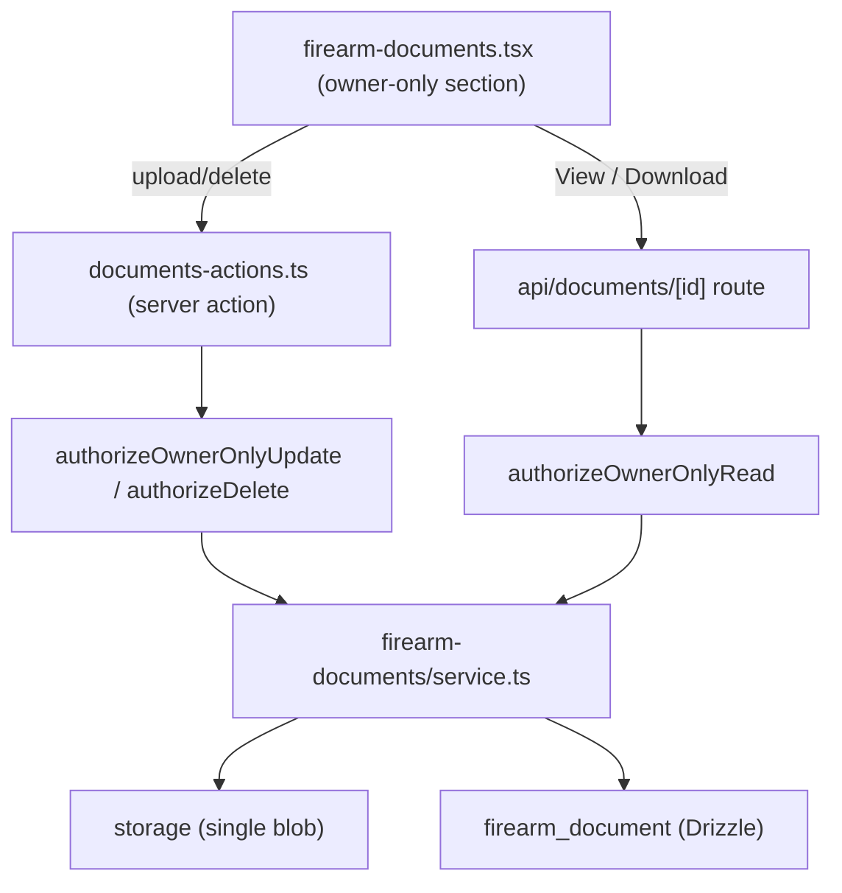

# Firearm Documents - Plan

## Goal Capsule

- **Objective:** Let a firearm's owner attach, view, download, and delete typed documents (receipts, warranties, ATF Form 1/4, manuals, insurance) on the firearm detail view, reusing the storage foundation shipped in #9.
- **Product authority:** GitHub issue #12; owner (`unclesp1d3r`) confirmed the product decisions in this brainstorm.
- **Open blockers:** None. All product decisions are resolved; some config values and UI-interaction mechanics are deferred to planning (see Outstanding Questions and Deferred / Open Questions).

## Product Contract

### Summary

Add a `firearm_document` entity and an owner-scoped documents section to the firearm detail view. The owner can upload typed documents (a controlled `docType` plus free-text notes), view them in an in-app modal, download them, and delete them. Documents are **owner-only on every operation** — unlike photos, they do not follow the firearm's grants — and are never included in CSV export.

### Problem Frame

Firearm ownership generates paperwork that belongs with the firearm it documents: proof of purchase, warranty terms, ATF Form 1/4, manuals, insurance. Today that paperwork lives outside the app, so the records that support a firearm drift apart from the inventory they belong to. ATF forms and receipts are highly sensitive PII — a records feature that leaked them through sharing, guessable URLs, or a data export would be worse than not having the feature. The value is keeping supporting records with the firearm while holding privacy to a strict owner-only line. This is convenient storage for that paperwork, not an audit-grade system of record: documents are immutable and carry no change history, so the app does not attest to when a form was filed or altered.

### Key Decisions

- **Owner-only on every operation, not a child-record.** Photos (#9) are a firearm child that inherits grants — a view-grantee sees a shared firearm's photos. Documents are the opposite: list, upload, view, download, and delete all authorize owner-only via `authorizeOwnerOnly` on the parent firearm. No grant inheritance, on reads or writes.
- **Immutable after upload.** Operations are upload / download / delete only. Metadata (`docType`, `notes`) cannot be edited in place — retagging is delete-and-re-upload. Keeps the surface minimal and matches the issue scope.
- **View · Download split per document.** Every row exposes both actions. Download always forces a save; View opens an in-app modal.
- **Hardened inline viewing.** In the View modal, images render as an `` and PDFs render in a sandboxed `<iframe>` served `Content-Disposition: inline`. This is the highest-risk surface (untrusted bytes in-origin) and is hardened rather than avoided.
- **Off the image pipeline.** Documents are stored as a single blob with no `sharp` decode/re-encode and no derivative variants — they can be PDFs, and even image documents are kept verbatim for records fidelity.
- **Reuse, don't rebuild.** The generic storage layer and the owner-only auth gate already exist from #9; this feature consumes them.

### Requirements

**Data model**

- R1. A `firearm_document` entity carries: `firearmId` (FK to the parent firearm), `storageKey`, `filename`, `mimeType`, `sizeBytes`, `docType`, `notes`, `uploadedAt`.
- R2. `docType` is required, drawn from a controlled set — receipt, warranty, atf-form-1, atf-form-4, manual, insurance, other — defaulting to `other`.
- R3. `filename` stores the sanitized original filename (path separators and control characters stripped, length-capped) and is used as the download filename.

**Upload and validation**

- R4. An owner can upload one or more documents to a firearm they own.
- R5. Each upload is validated against a MIME allow-list (PDF plus the photo image set: jpeg, png, webp, avif) and a per-file size cap, surfacing all failure codes together rather than first-only. The allow-list is checked against the file's actual content (magic-byte/signature detection), not the client-declared Content-Type or filename extension; a file whose sniffed type falls outside the allow-list is rejected.
- R6. A per-firearm document count cap bounds how many documents one firearm can hold.
- R7. A validated document is stored as a single blob through the shared storage foundation (generated key, path-traversal-safe adapter) with no derivative variants and no image re-encoding.

**Authorization and privacy**

- R8. Every document operation — list, upload, view, download, delete — authorizes owner-only on the parent firearm; edit-grantees, view-grantees, and non-visible actors are refused.
- R9. A firearm outside the actor's visible set yields not-found; a visible-but-not-owned firearm yields not-authorized, and neither response reveals whether documents exist.
- R10. Viewing and download go through an authenticated endpoint keyed by document id — no public or guessable URLs, and blob paths resolve only through the storage adapter's traversal guard.
- R11. Document data is never included in CSV export, guarded by a regression test asserting document fields never appear in export output.

**Viewing and download**

- R12. Each document row exposes a split control with distinct View and Download actions.
- R13. Download serves `Content-Disposition: attachment` with the sanitized original filename, for every MIME type.
- R14. View opens an in-app modal: image MIME types render as an ``; PDF renders in a sandboxed `<iframe>` against the endpoint served `Content-Disposition: inline`.
- R15. The inline-serving path is hardened — iframe `sandbox` (an explicit token set that never combines `allow-scripts` with `allow-same-origin`), `X-Content-Type-Options: nosniff`, and a response `Content-Security-Policy: frame-ancestors 'self'` so the document response cannot be framed cross-origin — and inline disposition is permitted only for the whitelisted safe MIME types. The iframe `sandbox` is the binding control for untrusted PDF bytes; the CSP directive is anti-framing hardening on the served response.

**Sharing surface**

- R16. The documents section renders in full only for the firearm's owner.
- R17. On a shared firearm, a non-owner sees a static "documents are private to the owner" panel that renders identically whether or not documents exist — no count, no contents, no existence signal.

**Delete**

- R18. An owner can delete a document: the row is removed, then its single blob is deleted best-effort after the row delete commits.
- R19. Deleting the parent firearm or the owning user account triggers the same best-effort blob cleanup as R18 for every associated document — document blobs are never left to a bare database `ON DELETE CASCADE`.

**Documents section UI**

- R20. Deleting a document requires an explicit destructive confirmation that names the document (filename and docType); there is no undo.
- R21. The View modal shows an explicit error state with a Download fallback when a blob fails to load — missing, corrupt, or a PDF the sandboxed iframe cannot render.
- R22. Each row's View and Download controls carry a unique accessible name incorporating the document (for example, "View receipt.pdf" / "Download receipt.pdf"), so screen readers and ARIA-based tests can disambiguate rows.
- R23. The docType/filetype icon carries a text alternative (an `aria-label` or adjacent visually-hidden text) naming the docType, not a bare decorative glyph.
- R24. When the owner views a firearm that has no documents, they see a distinct empty state ("No documents yet" plus an upload affordance), separate from the non-owner locked panel.
- R25. The document list orders most-recently-uploaded first.

### Key Flows

- F1. Upload a document
  - **Trigger:** Owner picks one or more files in the firearm's documents section and chooses a `docType`.
  - **Steps:** Authorize owner-only on the firearm; validate each file's MIME and size and the per-firearm cap; store each valid blob through the shared adapter; insert one `firearm_document` row per stored blob; return a per-file result.
  - **Covered by:** R2, R3, R4, R5, R6, R7, R8.
- F2. View an image document
  - **Trigger:** Owner clicks View on an image row.
  - **Steps:** Modal opens; endpoint streams the blob `inline` after owner-only authorization; the modal renders it as an ``, or shows an error state with a Download fallback if the blob fails to load.
  - **Covered by:** R8, R10, R14, R15, R21.
- F3. View a PDF document
  - **Trigger:** Owner clicks View on a PDF row.
  - **Steps:** Modal opens with a sandboxed `<iframe>` pointing at the `inline` endpoint; endpoint authorizes owner-only, sets the hardened headers, and streams the PDF; if the iframe cannot render, the modal shows an error state with a Download fallback.
  - **Covered by:** R8, R10, R14, R15, R21.
- F4. Download a document
  - **Trigger:** Owner clicks Download on any row.
  - **Steps:** Endpoint authorizes owner-only and streams the blob `Content-Disposition: attachment` with the sanitized filename.
  - **Covered by:** R8, R10, R13.
- F5. Delete a document
  - **Trigger:** Owner clicks delete on a row and confirms the destructive-confirmation dialog.
  - **Steps:** Authorize owner-only; delete the row in a transaction; after commit, best-effort delete the blob.
  - **Covered by:** R8, R18, R20.
- F6. A non-owner opens a shared firearm
  - **Trigger:** A view- or edit-grantee opens a firearm shared to them.
  - **Steps:** The full documents section is withheld; the static owner-only panel renders in its place regardless of whether documents exist.
  - **Covered by:** R16, R17.

### Acceptance Examples

- AE1. View by type. **Covers R14.** Given a firearm with one JPEG and one PDF document, when the owner clicks View on the JPEG the modal shows an ``; when the owner clicks View on the PDF the modal shows a sandboxed `<iframe>` rendering the PDF.
- AE2. Owner vs grantee. **Covers R16, R17.** Given firearm A shared to user B with an edit grant and holding two documents, when B opens firearm A they see the static "documents are private to the owner" panel with no count and no rows; the owner sees the full section with both documents.
- AE3. Existence-hiding. **Covers R9.** Given a firearm not visible to the actor, every document operation returns not-found; given a firearm visible to the actor but owned by someone else, every document operation returns not-authorized — in neither case is document presence revealed. **Exception (KTD2):** the blob-serving route (view/download, U6) collapses visible-non-owner to not-found (404) as well, since raw bytes are maximally existence-hidden and the section that would surface a 403 is never rendered to a non-owner.
- AE4. Export exclusion. **Covers R11.** Given a firearm with documents, when the owner exports inventory to CSV the output contains no document filename, notes, docType, or storage key.

### Scope Boundaries

- No in-place metadata editing — retagging `docType` or `notes` is delete-and-re-upload (R2, immutability decision).
- No primary/cover selection, no reordering, no caption — those are photo affordances, not document ones.
- No image processing, thumbnails, or derivative variants; documents stay off `sharp`.
- No grant inheritance and no "share documents" opt-in. The issue names an opt-in as a possible future hook; it is out of scope now (YAGNI).
- Documents do not participate in the Inventory Log or any activity/audit trail.
- Documents are never added to CSV export (non-goal, enforced by R11's guard).

### Dependencies / Assumptions

- **Depends on #9 (merged, PR #62).** Consumes `src/storage/` (key generation, `LocalFilesystemAdapter` with path-traversal protection, single-blob save/read/delete) and `authorizeOwnerOnly` in `src/auth/authorize.ts`. No new storage abstraction is built here.
- **Assumption — allow-list:** PDF plus jpeg/png/webp/avif. Adjustable in planning.
- **Assumption — size cap:** 25 MB per file (PDFs run larger than photos). Adjustable in planning.
- **Assumption — per-firearm cap:** 50 documents. Adjustable in planning.
- **Assumption — list rows show a docType/filetype icon**, not an image thumbnail, so the list never loads full-resolution originals.

### Outstanding Questions

Deferred to planning (do not block a plan):

- Exact size cap, per-firearm count cap, and per-request file-count cap values.
- Whether upload is single-file or multi-file in the UI, and how per-file validation results surface.
- The `firearm_document` table's exact column types, indexes, and delete-cascade wiring (mirrors `firearm_photo`, minus variants/primary/caption).

### Sources / Research

- `src/storage/index.ts`, `src/storage/service.ts`, `src/storage/keys.ts`, `src/storage/local-fs-adapter.ts` — the reusable storage foundation; note documents need a single-blob delete rather than `deletePhotoBlobs` (which removes three variants).
- `src/auth/authorize.ts` — `authorizeOwnerOnly` (the exact owner-only gate documents need) and `resolveCreateOwner`; `src/auth/visibility.ts` — `resolvePermission`. Note: `authorizeOwnerOnly` is currently module-private — only `authorizeOwnerOnlyUpdate` (action `"modify"`) and `authorizeDelete` (action `"delete"`) wrap it. The read operations (list/view/download) need it exported, or a couple of thin wrappers added alongside the existing two; a small, compatible extension of the module, not a redesign.
- `src/db/inventory-schema.ts` — `firearm_photo` table to mirror in shape (drop `isPrimary`, `sortOrder`, `caption`, `width`, `height`; add `filename`, `docType`, `notes`).
- `src/domain/firearm-photos/service.ts`, `validate.ts`, `constants.ts` — parallel structure to mirror, simplified (no pipeline, no quota-under-lock complexity beyond a straight cap).
- `app/api/photos/[id]/[variant]/route.ts` — the authenticated serving-route pattern; the document endpoint adapts it to owner-only authz and a disposition switch (inline vs attachment).
- `src/domain/csv/` — export builders documents must stay out of; R11's guard lives against these.

---

## Planning Contract

**Product Contract preservation:** R1–R25, F1–F6, and AE1–AE4 are carried forward with two clarifying edits from the 2026-07-12 doc review, neither a product-scope change: R15's CSP directive was corrected to `frame-ancestors 'self'` (the response-level anti-framing control the "how" always intended — `frame-src`/`object-src` protect the embedding page, not the served blob), and AE3 gained a carve-out noting the blob-serving route collapses visible-non-owner to 404 per KTD2 rather than 403. Planning adds the how below and resolves the deferred config values as explicit assumptions. No product-scope change.

### Key Technical Decisions

- KTD1. **Owner-only via a dedicated auth gate, not the photo child-record path.** Photos authorize through `authorizeUpdate` / `resolvePermission` (`src/domain/firearm-photos/service.ts`), which admit edit- and view-grantees. Documents must not. Writes reuse the existing `authorizeOwnerOnlyUpdate` (`src/auth/authorize.ts`) and `authorizeDelete`; reads (list/view/download) use a **new exported** `authorizeOwnerOnlyRead` wrapping the existing private `authorizeOwnerOnly(..., "view")` — no owner-only read gate exists today. Outcome in all three: owner passes; a visible non-owner gets `NotAuthorizedError`; an unseen firearm gets `NotFoundError` (R8, R9).
- KTD2. **Serving endpoint collapses any auth failure to 404.** The blob route (U6) returns 404 for missing-document, unseen-firearm, and visible-non-owner alike, so raw bytes are maximally existence-hidden and document ids (random UUIDs, R10) reveal nothing on enumeration. This is stricter than R9's firearm-scoped 403, and consistent because the section that would 403 a visible non-owner is never rendered to them (KTD7).
- KTD3. **Content-based MIME validation.** R5's allow-list is checked against magic-byte signatures, not the client-declared `Content-Type` or extension, using the `file-type` library; the sniffed type is reconciled against the declared type and stored. Prefer a vetted library over hand-rolled signature checks. Adds one dependency.
- KTD4. **Single blob, off the image pipeline.** Reuse `generateKey` + `storage.save/read/delete` (`src/storage/`); documents get no `sharp` decode/re-encode and no `deriveKey` thumb/preview variants (R7). Add `deleteDocumentBlob` (single-blob, best-effort) since `deletePhotoBlobs` fans out to three variants; extend `orphanSweep` to union `firearmDocument.storageKey` into its owned-keys set.
- KTD5. **One serving route with a disposition switch.** `app/api/documents/[id]/route.ts` takes `?disposition=inline|attachment`, defaulting to `attachment`. `inline` is honored only for whitelisted safe MIME types (PDF + the image set); everything else is forced to `attachment`. Download always sends `Content-Disposition: attachment; filename="<sanitized>"`; inline sends `inline` plus the hardened headers `X-Content-Type-Options: nosniff` and `Content-Security-Policy: frame-ancestors 'self'` restricting cross-origin framing of the response (R13, R14, R15).
- KTD6. **Filename sanitization does double duty.** R3's sanitizer strips path separators, control characters, and CR/LF, then length-caps — the same pass that prevents path traversal also prevents `Content-Disposition` header injection. The sanitized name is stored and used as the download filename, emitted with RFC 6266 encoding — an ASCII fallback `filename="<ascii>"` plus `filename*=UTF-8''<percent-encoded>` — so non-Latin1 original names (e.g. a scanned CJK import permit) neither throw on header construction nor render as mojibake in the browser save dialog.
- KTD7. **Section visibility gates on `isOwner`, not `canEdit`.** `app/(app)/firearms/firearm-detail-view.tsx` already derives both; the documents section renders in full only when `isOwner`. A non-owner sees a static "documents are private to the owner" panel rendered unconditionally — identical whether or not documents exist, so existence is never leaked (R16, R17).
- KTD8. **Encryption-at-rest (#67) is a design constraint, not build scope.** Document blobs stay behind the `StorageService` seam on the local upload volume, so #67 can add blob encryption later without touching document callers. The `firearm_document` PII-bearing columns (`filename`, `notes`) are recorded here as inputs to #67's column-encryption evaluation. No encryption is implemented in this plan.

### High-Level Technical Design

Request/serve flow across layers (write and serve paths share the owner-only gate):

Authorization outcomes (same matrix for read and write; the serving route in U6 additionally collapses the non-owner rows to 404 per KTD2):

| Actor relationship to parent firearm | Result |
|---|---|
| Owner | Proceed |
| Visible non-owner (view- or edit-grantee) | `NotAuthorizedError` (403) |
| Firearm outside visible set | `NotFoundError` (404) |

### Assumptions & Dependencies

- Depends on #9 (merged, PR #62): `src/storage/`, `src/auth/authorize.ts`, `src/auth/visibility.ts`, `src/auth/session.ts`.
- Adds the `file-type` dependency (KTD3).
- Config caps (resolving the Product Contract's deferred values): `MAX_FILE_SIZE_BYTES` 25 MB, `MAX_DOCUMENTS_PER_FIREARM` 50, `MAX_FILES_PER_REQUEST` 10. Adjustable.
  - **Server Action body limit (resolve in U7):** a full batch is `MAX_FILES_PER_REQUEST` × `MAX_FILE_SIZE_BYTES` = 250 MB, which exceeds `next.config.ts`'s `serverActions.bodySizeLimit` of `160mb` (sized for the 10 × 15 MB photo batch). As written, the first legitimate max-batch document upload is rejected by Next.js before any validation runs. Before U7 ships, resolve one of: raise `bodySizeLimit` to cover ~250 MB + multipart overhead (shared with photo uploads), lower `MAX_FILES_PER_REQUEST`/`MAX_FILE_SIZE_BYTES` to fit 160 MB, or move document upload to a streaming Route Handler off the buffered Server Action path. **Recommended default:** raise `bodySizeLimit` to `270mb` and add a U7 test that uploads a max-size batch. Record the chosen resolution here once decided.
- `UPLOAD_DIR` must be set (existing requirement of the storage layer).
- Relates to #67 (encryption-at-rest spike) per KTD8 — no code dependency, design constraint only.

### Sequencing

U1, U2, and U4 have no cross-dependency and can start in parallel (U2 is a pure validator and U4 an auth wrapper — neither touches the new table); U3 depends on U1 (it unions `firearmDocument.storageKey` into the orphan-sweep query and wires the firearm-delete cleanup). U5 depends on U1–U4. U6 depends on U5. U7 depends on U5 and U6. U8 depends on U5 and U7 — but its CSV-exclusion test needs only U5 and can land ahead of the U7 e2e coverage.

---

## Implementation Units

### U1. `firearm_document` table and migration

- **Goal:** Add the `firearm_document` table as a firearm child record, mirroring `firearm_photo` minus the photo-specific columns, and generate + apply the Drizzle migration.
- **Requirements:** R1, R2, R3.
- **Dependencies:** none.
- **Files:** `src/db/inventory-schema.ts` (add `firearmDocument` after `firearmPhoto`), `src/db/migrations/` (generated SQL + `meta/` snapshot), `src/db/schema.ts` (auto re-exports — no edit), `src/db/__tests__/firearm-document.test.ts` (new — houses the integration test scenarios below; match the repo's existing schema-test location if one differs).
- **Approach:** Columns: `id` uuid pk `defaultRandom`; `firearmId` uuid notNull references `firearm.id` `onDelete: "cascade"`; `storageKey` text notNull; `filename` text notNull; `mimeType` text notNull; `sizeBytes` integer notNull; `docType` text notNull default `'other'`; `notes` text notNull default `''`; `uploadedAt` timestamp `defaultNow` notNull. Constraints mirroring the `firearm_photo` convention: index on `firearmId`; `check` that `mimeType in ('application/pdf','image/jpeg','image/png','image/webp','image/avif')`; `check` that `docType in ('receipt','warranty','atf-form-1','atf-form-4','manual','insurance','other')`; `check` that `sizeBytes > 0`. No `owner_id`, no primary/sortOrder/caption/width/height.
- **Execution note:** Run `bun run db:generate` then `bun run db:migrate`; commit the generated SQL and snapshot.
- **Patterns to follow:** the `firearmPhoto` pgTable block and its child-record doc comment in `src/db/inventory-schema.ts`; migration `0014_perfect_silver_surfer.sql`.
- **Test scenarios:** (integration, `DATABASE_URL`-gated) migration applies cleanly; a row with valid values inserts; a row with `docType` outside the set is rejected by the check constraint; a `mimeType` outside the allow-list is rejected; `sizeBytes <= 0` is rejected; deleting the parent firearm removes its `firearm_document` rows (FK cascade).

### U2. Document constants and upload validation

- **Goal:** Constants and a pure validator for the document allow-list, size, batch, and docType — mirroring `src/domain/firearm-photos/validate.ts`, with no image pipeline.
- **Requirements:** R2, R5, R6.
- **Dependencies:** none.
- **Files:** `src/domain/firearm-documents/constants.ts`, `src/domain/firearm-documents/validate.ts`, `src/domain/firearm-documents/__tests__/validate.test.ts`.
- **Approach:** `constants.ts`: `ALLOWED_MIME_TYPES` (PDF + jpeg/png/webp/avif), `MAX_FILE_SIZE_BYTES` (25 MB), `MAX_FILES_PER_REQUEST` (10), `MAX_DOCUMENTS_PER_FIREARM` (50), `DOC_TYPES` (the 7-value set), `DEFAULT_DOC_TYPE = 'other'`; no pixel/thumb/preview constants. `validate.ts`: `validateDocumentUpload({ mimeType, sizeBytes })` returning all failure codes together (`disallowedMimeType`, `fileTooLarge`); `assertBatchSize(count)`; `isDocType(value)`. The magic-byte sniff (R5) lives in the service where bytes are available (U5), not in this pure module.
- **Patterns to follow:** `src/domain/firearm-photos/validate.ts` and `constants.ts`.
- **Test scenarios:** disallowed MIME → `disallowedMimeType`; oversized → `fileTooLarge`; both → both codes; allowed PDF and allowed image pass; batch over `MAX_FILES_PER_REQUEST` → `tooManyFiles`; `docType` outside the set → not a doc type; `'other'` and each named type recognized.

### U3. Single-blob delete, firearm-delete cleanup, and orphan-sweep extension

- **Goal:** A single-blob delete for documents, eager blob cleanup when the parent firearm (or owning user) is deleted, and an orphan-sweep that treats document blobs as owned.
- **Requirements:** R7, R18, R19.
- **Dependencies:** U1.
- **Files:** `src/storage/document-blobs.ts` (new), `src/storage/orphan-sweep.ts` (extend), `src/domain/firearms/service.ts` (extend `deleteFirearm`'s pre-delete hook), `src/storage/__tests__/document-blobs.test.ts` (new), `src/storage/__tests__/orphan-sweep.test.ts` (extend).
- **Approach:** `deleteDocumentBlob(storageKey)` calls `storage.delete(key)` best-effort (log, never throw), matching `deletePhotoBlobs`' error posture but for one blob. **R19 eager cleanup (do not rely on `orphanSweep`, which has no scheduler):** extend the existing pre-delete hook in `deleteFirearm` (`src/domain/firearms/service.ts`) — which already collects `firearmPhoto.storageKey` inside the transaction and calls `deletePhotoBlobs` after commit — to also collect the firearm's `firearmDocument.storageKey` values and `deleteDocumentBlob` each after commit, so document blobs are never left to the bare `ON DELETE CASCADE`. The owning-user-account clause of R19 rides the same firearm cascade (user delete → firearm delete → this hook); a future dedicated user-delete path must reuse it. Extend `orphanSweep`'s owned-keys query to union `firearmDocument.storageKey` (no thumb/preview expansion) as a defense-in-depth backstop so any blob missed by best-effort cleanup is reclaimable and referenced blobs are never swept.
- **Patterns to follow:** `src/storage/photo-blobs.ts`; the `firearmPhoto.storageKey` collection in `deleteFirearm` (`src/domain/firearms/service.ts`); the owned-keys query in `src/storage/orphan-sweep.ts`.
- **Test scenarios:** (integration) `deleteDocumentBlob` removes a written blob; it is a no-op on a missing key; **deleting the parent firearm removes its document blobs, not just the rows**; orphan sweep does not delete a blob referenced by a `firearm_document` row; orphan sweep deletes an unreferenced blob older than the min-age; a document blob and a photo blob are both preserved when referenced.

### U4. Owner-only read authorization gate

- **Goal:** An exported `authorizeOwnerOnlyRead` enforcing owner-only reads (R8, R9), since none exists today.
- **Requirements:** R8, R9.
- **Dependencies:** none.
- **Files:** `src/auth/authorize.ts` (add exported function), `src/auth/__tests__/authorize.test.ts` (add cases, matching the existing auth test location).
- **Approach:** Add `authorizeOwnerOnlyRead(tx, actorId, parentType, parentId)` that calls the existing private `authorizeOwnerOnly(..., "view")` — owner passes; visible non-owner → `NotAuthorizedError`; unseen → `NotFoundError`. Do not widen the private helper's behavior; only expose a read wrapper alongside `authorizeOwnerOnlyUpdate` and `authorizeDelete`.
- **Patterns to follow:** `authorizeOwnerOnlyUpdate` / `authorizeDelete` in `src/auth/authorize.ts`.
- **Test scenarios:** owner → resolves; edit-grantee → `NotAuthorizedError`; view-grantee → `NotAuthorizedError`; stranger / unseen firearm → `NotFoundError`.

### U5. Document domain service

- **Goal:** `createDocuments`, `listDocuments`, `deleteDocument`, `getServableDocument` — all owner-only, mirroring the photo service minus pipeline/primary/reorder/caption.
- **Requirements:** R3, R4, R5, R6, R7, R8, R9, R16, R18, R25.
- **Dependencies:** U1, U2, U3, U4.
- **Files:** `src/domain/firearm-documents/service.ts`, `src/domain/firearm-documents/urls.ts`, `src/domain/firearm-documents/sanitize-filename.ts`, `src/domain/firearm-documents/__tests__/service.test.ts`, `src/test-support/factories.ts` (add `makeFirearmDocument`).
- **Approach:** `createDocuments(actorId, firearmId, inputs)` — authorize with `authorizeOwnerOnlyUpdate` before any per-file work (existence-hiding); `assertBatchSize`; per file, sniff the MIME with `file-type`, reject on mismatch or allow-list miss (R5), `validateDocumentUpload`, sanitize the filename (KTD6), store one blob via `storage.save(generateKey(ext), bytes)`; enforce `MAX_DOCUMENTS_PER_FIREARM` optimistically then authoritatively under a firearm row lock in a short insert transaction; on rollback, `deleteDocumentBlob` every prepared blob. `listDocuments(actorId, firearmId)` — `authorizeOwnerOnlyRead`, return rows most-recently-uploaded first (R25). `deleteDocument(actorId, documentId)` — resolve parent firearm, `authorizeDelete` (the existing action-`"delete"` owner-only gate named in KTD1, mirroring the photo delete path), delete the row in a transaction, `deleteDocumentBlob` after commit (R18). `getServableDocument(actorId, documentId)` — look up row → firearmId, `authorizeOwnerOnlyRead`, `storage.read`, return `{ bytes, mimeType, filename }`. `urls.ts` (client-safe): `documentViewUrl(id)` / `documentDownloadUrl(id)`. `sanitize-filename.ts`: strip path separators, control chars, CR/LF; length-cap.
- **Patterns to follow:** `src/domain/firearm-photos/service.ts` (authorize-before-validate, optimistic-then-locked quota, blobs-outside-transaction, cleanup-on-rollback, delete-blob-after-commit); `makeFirearmPhoto` in `src/test-support/factories.ts`.
- **Test scenarios:** owner uploads a valid PDF and a valid image → rows created, blobs stored; per-file disallowed MIME rejected while siblings succeed; oversized rejected; batch over cap rejected; over per-firearm cap rejected; edit-grantee upload → `NotAuthorizedError`; view-grantee → `NotAuthorizedError`; unseen firearm → `NotFoundError` (Covers AE3); content-sniff mismatch (bytes are HTML, declared `image/png`) rejected; filename with `../` and control chars stored sanitized (Covers R3); `listDocuments` returns most-recent-first; `listDocuments` by non-owner → `NotAuthorizedError`; delete removes row and blob; delete by non-owner rejected and blob retained; `getServableDocument` returns bytes for owner, throws for non-owner.

### U6. Serving route with disposition switch and hardened headers

- **Goal:** The authenticated, owner-only document blob endpoint with the inline/attachment split and hardened inline headers.
- **Requirements:** R10, R13, R14, R15.
- **Dependencies:** U5.
- **Files:** `app/api/documents/[id]/route.ts`, `src/domain/firearm-documents/__tests__/serving.test.ts`.
- **Approach:** `GET` resolves the session via `getCurrentUser()` (401 if absent), 404s a malformed UUID before any DB hit, reads `?disposition` (default `attachment`), calls `getServableDocument`, and 404s on any thrown auth error or missing document (KTD2). Response: `Content-Type` from the stored `mimeType`; `X-Content-Type-Options: nosniff`; `Content-Disposition: attachment; filename="<ascii-fallback>"; filename*=UTF-8''<percent-encoded-sanitized>` (RFC 6266) for download or `inline` for view; `inline` permitted only for whitelisted safe MIME types (otherwise coerced to `attachment`); on `inline`, add `Content-Security-Policy: frame-ancestors 'self'`. `Cache-Control: private, no-store` (PII — do not persist to disk cache).
- **Patterns to follow:** `app/api/photos/[id]/[variant]/route.ts` (session gate, UUID guard, stored-mime Content-Type, nosniff, null→404).
- **Test scenarios:** owner download → 200, `Content-Disposition: attachment` with sanitized filename; owner inline image → 200, `Content-Disposition: inline`, `nosniff`, CSP present (Covers AE1); owner inline PDF → 200, inline + CSP; `disposition=inline` on a non-whitelisted type → coerced to attachment; non-owner → 404; unauthenticated → 401; malformed id → 404; unknown id → 404.

### U7. Server actions and documents UI section

- **Goal:** Upload/delete server actions and the owner-only documents section on the firearm detail view, with the View·Download split, view modal, delete confirmation, empty state, and accessibility affordances.
- **Requirements:** R4, R12, R13, R14, R16, R17, R20, R21, R22, R23, R24.
- **Dependencies:** U5, U6.
- **Files:** `app/(app)/firearms/documents-actions.ts`, `app/(app)/firearms/[id]/firearm-documents.tsx`, `app/(app)/firearms/[id]/page.tsx` (fetch `listDocuments` for the owner), `app/(app)/firearms/firearm-detail-view.tsx` (render the section gated on `isOwner`; render the locked panel for non-owners), `app/(app)/firearms/__tests__/documents-actions.test.ts` (new — server-action unit tests below, mirroring the `photo-actions.ts` test).
- **Approach:** `documents-actions.ts` (`"use server"`): `requireUserId()` first; `uploadDocumentsAction(firearmId, formData)` reads `formData.getAll("files")` files → `{ bytes, mimeType, filename }`, rate-limited, calls `createDocuments`, `revalidateFirearmPaths()`; `deleteDocumentAction(documentId)` calls `deleteDocument`; both return `ActionResult` via `toActionError`. `firearm-documents.tsx` (`"use client"`): list rows (most-recent-first) each showing a docType/filetype icon with a text alternative (R23) and a per-row split control with accessible names incorporating both docType and filename (e.g. "View purchase receipt — receipt.pdf" / "Download purchase receipt — receipt.pdf") so rows with duplicate filenames stay distinguishable, since `filename` carries no uniqueness constraint (R22); View opens a modal — images as ``, PDFs in a hardened `<iframe sandbox>` (an explicit token set that never combines `allow-scripts` with `allow-same-origin`; validate the chosen tokens actually render the browser PDF viewer, otherwise fall back per R21) pointed at the inline URL — with an error-state + Download fallback when a blob fails to load (R21); Download hits the attachment URL (R13); delete goes through a confirmation dialog naming the document (R20); an owner empty state ("No documents yet" + upload) when the list is empty (R24). In `firearm-detail-view.tsx`, mount the section only when `isOwner`; otherwise render the static owner-only locked panel (R16, R17).
- **Execution note:** Target UI via ARIA roles / accessible names / visible text — no `data-testid`. Use the existing shadcn/Radix primitives (`Button`, `ConfirmDialog`, dialog/modal, `useToast`).
- **Patterns to follow:** `app/(app)/firearms/photo-actions.ts`, `app/(app)/firearms/[id]/firearm-photos.tsx`, and the `isOwner` / `canEdit` derivation in `firearm-detail-view.tsx`.
- **Test scenarios:** server actions reject unauthenticated callers; `uploadDocumentsAction` forwards files and surfaces validation failures as an `ActionResult`; `deleteDocumentAction` calls the service. UI behavior is covered by the e2e spec in U8.

### U8. CSV-exclusion guard and end-to-end coverage

- **Goal:** Prove documents never reach CSV export and exercise the full owner flow plus grantee lockout end to end.
- **Requirements:** R11, and end-to-end coverage of F1–F6, AE1, AE2, AE4.
- **Dependencies:** U5, U7.
- **Files:** `src/domain/csv/__tests__/build.test.ts` (add a case), `e2e/firearm-documents.spec.ts` (new).
- **Approach:** CSV regression: a firearm with attached documents produces export output byte-identical to one without, and no document field (`filename`, `notes`, `docType`, `storageKey`) appears in the output (Covers AE4). E2E (Testcontainers-backed, `bun run test:e2e`): owner uploads a document, sees it listed, opens an image in the view modal and downloads a PDF, deletes one via the confirmation dialog; a grantee on a shared firearm sees the "documents are private to the owner" panel and none of the contents (Covers AE2).
- **Patterns to follow:** `src/domain/csv/__tests__/ammo-build.test.ts` (ammo is likewise excluded from CSV — a precedent); `e2e/firearm-photos.spec.ts` and `e2e/README.md`.
- **Test scenarios:** CSV export omits all document fields for a firearm with documents (Covers AE4); e2e upload → view → download → delete happy path (Covers F1–F5, AE1); e2e grantee sees the locked panel, not the contents (Covers F6, AE2).

---

## Verification Contract

| Gate | Command | Applies to |
|---|---|---|
| Migration applies | `bun run db:migrate` | U1 |
| Lint | `bun run lint` (Biome) | all |
| Type check | `bun run typecheck` | all |
| Unit + integration tests | `bun test` (needs `DATABASE_URL`; Testcontainers) | U1–U8 |
| End-to-end | `bun run test:e2e` (Docker) | U7, U8 |
| Full pre-commit gate | `just ci-check` | all — must pass before every commit |

---

## Definition of Done

- All of R1–R25 are satisfied and traced to a unit above.
- Owner-only authorization is enforced on every operation (list, upload, view, download, delete) with tests proving edit- and view-grantees are refused and unseen firearms 404 (R8, R9).
- The serving route sends `nosniff`, the disposition switch, and CSP-on-inline, permits inline only for whitelisted MIME types, and 404s every non-owner request (R10, R13, R14, R15).
- Uploads are validated by magic-byte content sniffing, size, batch, and per-firearm caps; filenames are sanitized (R3, R5, R6).
- Documents never appear in CSV export, proven by the regression test (R11).
- The documents section renders only for the owner; non-owners see the static locked panel; delete requires confirmation; the view modal has an error state (R16, R17, R20, R21).
- `bun run db:migrate`, `bun run lint`, `bun run typecheck`, `bun test`, and `bun run test:e2e` pass, and `just ci-check` is green.
- Encryption-at-rest is not implemented here; the storage seam and the `filename`/`notes` column inventory are recorded for #67 (KTD8).

---

## Deferred / Open Questions

### From 2026-07-12 review

- [P1] NFA-trust co-owner access to ATF Form 1/4 — owner-only on every operation means a trustee legally bound by an NFA Form 4 cannot view it, so the "records with the firearm" value fails for the population where compliance matters most. Decide before launch: exclude Form 1/4 from the owner-only-only scope until a shared-read path exists, or pull forward a minimal read-only grant-inheritance for co-owners (upload/delete staying owner-only). (adversarial)
- [P2] Document egress and backup coverage — confirm that instance-level backup covers the document blob store and how an owner retrieves all of a firearm's documents in bulk, so irreplaceable ATF paperwork consolidated in-app cannot be permanently lost on storage failure or migration. (product-lens)
- [P2] Upload interaction shape — modal vs drawer vs inline form, whether file selection precedes or follows docType/notes entry, and whether each file in a multi-file upload carries its own docType/notes or shares one set. (design-lens)
- [P2] Upload progress and success states — an in-progress indicator (to prevent double-submit on multi-megabyte PDFs) and an explicit success confirmation for both upload and delete. (design-lens)

### From 2026-07-12 doc-review (ce-doc-review, multi-persona)

Two codebase-verified P0s and one P0 config conflict were **integrated into the plan above** (R19 firearm-delete blob cleanup → U3; Server Action body-limit conflict → Assumptions). Contract/consistency fixes were also integrated (CSP `frame-ancestors` reconciliation on R15/KTD5/U6, AE3 404-collapse carve-out, `deleteDocument` → `authorizeDelete`, RFC 6266 filename encoding, PDF-iframe sandbox token constraint, `no-store` on document responses, sequencing correction, missing test files on U1/U3/U7, F1 R3 trace). The following remain as open decisions and FYIs for implementation:

**Decisions (design-lens, resolve during U7):**

- [P1] Multi-file partial-failure UI — R5 returns all failure codes together and `createDocuments` returns a per-file result, but how a mixed success/failure batch renders (summary toast vs per-file inline errors in a staged list) is unspecified. Ties into the deferred "upload interaction shape" question above.
- [P2] At-cap (50-document) upload UI state — disabled affordance with an explanatory message vs a control that stays enabled and only fails on submit (R6).
- [P2] View-modal loading state — nothing is defined between "modal opens" and image/PDF render or the R21 error state; a multi-megabyte PDF streaming inline needs a spinner/skeleton so latency isn't mistaken for the broken state.

**FYIs (carry into implementation):**

- [P2] Restrict all document-domain logging (upload rejection, sniff mismatch, delete failure) to `documentId`/`storageKey`; never log `filename` or `notes` (both can carry PII, unlike photos).
- [P2] KTD8 retrofit — U1's migration reserves no key-id/versioning column, so if #67 chooses column-level (not blob-level) encryption for `filename`/`notes`, a transition column + backfill is needed. Confirm blob-only encryption, or reserve the path.
- [P2] Consider a streaming Route Handler for document upload (25 MB cap, no image pipeline) as an alternative to the buffered Server Action — would also decouple the body-limit conflict permanently.
- [P2] Consider gating `atf-form-1`/`atf-form-4` docTypes until the NFA-trust access model (the [P1] above) is settled, so the highest-stakes docType doesn't ship under a model already known to be wrong for co-trustees.
- [P3] `file-type` sniffing confirms only the container signature — the iframe `sandbox` is the binding control against active-content/polyglot PDFs; keep KTD3's framing honest.
- [P3] Show docType as visible row text for sighted users, not aria-label-only, so duplicate-filename rows are visually distinguishable too.
- [P3] Define keyboard focus behavior in/out of the sandboxed PDF iframe (Escape/Tab returns focus to the modal, not trapped in the embedded viewer).
- Verify the pinned `file-type` version actually detects AVIF (added in later releases).
