# Encryption at Rest and Encrypted Backups - Plan

## Goal Capsule

- **Objective:** Give MagStacker a coherent data-at-rest story with two complementary layers — an admin-run, password-encrypted whole-instance backup (for the leaked-bundle threat), and an encrypted-host-volume deploy posture delivered through shipped compose config plus operator documentation (for the seized/stolen-disk threat). Keep the live database fully queryable throughout.
- **Product authority:** GitHub issue #67 (encryption-at-rest spike — this brainstorm resolves its direction); owner confirmed the decisions here. Relates to #12 (documents), whose blobs the backup bundles.
- **Open blockers:** None. Bundle format and version-compatibility policy are deferred to planning.

## Product Contract

### Summary

Add an admin-only, on-demand **encrypted backup**: the operator exports the entire instance (full database plus every document blob) as one password-encrypted file they download and keep off-box, and restores it onto a fresh or deliberately-wiped instance. Pair it with an **encrypted-volume deploy posture** — shipped Docker Compose config (secrets, hardening, encrypted-volume-ready mounts) plus operator documentation for running the data on an encrypted host disk. Live column encryption is deliberately excluded so the database stays queryable.

### Problem Frame

The data MagStacker holds is sensitive — owner-scoped inventory including serial numbers, and, with #12, attached receipts, warranties, and ATF forms. STRATEGY frames the product as privacy-first and self-hosted: "owning and running it yourself is what makes a sensitive inventory safe to keep at all." That promise breaks the moment data leaves the trusted box in the clear. Three at-rest threats are in scope, and they need different defenses:

- **A backup or database dump that leaves the running box** (emailed, left on a laptop, uploaded) — the common, high-value leak. Defended by the encrypted backup.
- **A seized or stolen disk** — a drive taken from a powered-off or decommissioned box, including state seizure. Not the owner's top personal worry, but a concrete **trust signal** for the audience. Defended by an encrypted host volume.
- **Another user on the instance** — already handled by owner-scoped authorization; encryption-at-rest does not change it, and it is named here only to rule it out.

The "compromised running host" threat is explicitly not prioritized, which is why live column/`pgcrypto` encryption is rejected: with an app-held key it barely helps that case, and it breaks the server-side querying (serial-number lookup and dedup) the product depends on. The encrypted backup also doubles as a self-host escape hatch — "take your data and leave" — which reinforces the privacy-first identity rather than just satisfying disaster recovery.

### Key Decisions

- **Threat-driven layering, not blanket encryption.** Two mechanisms for two threats: encrypted backups for leaked bundles, encrypted host volumes for seized disks. No single "encrypt everything" control.
- **Live column/`pgcrypto` encryption is rejected.** It breaks indexing/filtering on the fields that need to stay queryable and, with an app-held key, does not meaningfully defend the un-prioritized compromised-host threat.
- **Whole-instance operator DR, not per-user export.** One backup is the entire instance; per-user portability is out of scope.
- **On-demand download, no server-side backup storage.** The operator produces a bundle on demand and keeps it wherever they choose; the app never retains backups, so there is no backup store to secure or expire.
- **Restore is safe by default, destructive only on purpose.** Refuse-unless-empty is the default; a force-replace path exists behind a type-to-confirm guard.
- **No password recovery.** A lost backup password makes that backup unrecoverable, by design; the UI says so at export time.
- **Wrap vetted crypto, never hand-roll.** Encryption uses Argon2id (OWASP parameters) plus authenticated streaming encryption from a vetted library (libsodium `secretstream` / XChaCha20-Poly1305) — the exact pairing Home Assistant adopted and had independently audited by Trail of Bits. `openssl enc` and any custom cipher construction are out.
- **Native backup, but thin.** An in-app encrypted whole-instance backup is the minority pattern among self-hosted apps — most with a database plus a blob store (Immich, Paperless-ngx, Gitea) document external tooling instead. It is the right call for this product's "one password, one file, restorable by a non-expert" shape, but it must be a thin wrapper over vetted primitives that borrows proven safety patterns (snapshot-and-rollback on restore, version-gated bundles) rather than new cryptographic or backup engineering.
- **Disk encryption stays the operator's job.** The app ships compose config and documentation that make the encrypted-volume path turnkey, but it does not (and cannot) encrypt the host disk itself.

### Requirements

**Encrypted backup — export**

- R1. An admin can export the entire instance as a single encrypted backup file, downloaded on demand.
- R2. The export bundles the full database (all users, grants, and inventory including firearm documents) and every document blob from the upload store; ephemeral state such as sessions and rate-limit counters is excluded so a restore is clean.
- R3. The operator supplies a password at export time; the bundle is encrypted with a key derived from that password.
- R4. The bundle records the app/schema version it was produced from.

**Encrypted backup — restore**

- R5. An admin can restore an instance from a backup file by uploading it and entering its password.
- R6. Restore defaults to refuse-unless-empty: when the instance already holds inventory data, a plain restore is refused with a clear message.
- R7. Restore offers an explicit force-replace path, behind a type-to-confirm guard, that snapshots the existing data, wipes it, applies the bundle, and automatically rolls back to the snapshot if the restore fails (Immich's safety pattern).
- R8. Restore refuses a bundle whose recorded version is incompatible with the running instance.
- R9. Restore verifies the bundle's integrity by authenticated decryption and refuses a wrong password or a tampered/corrupt bundle before changing any data.
- R10. A successful restore yields a functionally identical instance — users, grants, inventory, and documents intact.

**Cryptography and data handling**

- R11. Encryption uses a strong password-based KDF and authenticated, tamper-evident encryption from a vetted library; plaintext exists only inside the running app.
- R12. There is no password recovery — a lost password makes the backup unrecoverable — and the export UI states this before the operator commits.
- R13. Export and restore stream the bundle so that a large document blob store does not exhaust memory.

**Access and auditing**

- R14. Only admins can export or restore; non-admin users cannot reach either action.
- R15. Export and restore are recorded as operator events (actor, timestamp, outcome), given how significant a force-replace restore is.

**Deploy hardening — shipped config**

- R16. The shipped Docker Compose supplies the database password (and any key material) through Docker secrets rather than environment variables.
- R17. The compose structures the Postgres data volume and the document upload volume so that placing them on an encrypted host disk is the documented, low-friction path.
- R18. The compose applies baseline container hardening (read-only root filesystem with explicit writable volumes, dropped capabilities, no-new-privileges) where compatible.

**Deploy hardening — operator documentation**

- R19. Operator documentation explains how to run the data and upload volumes on an encrypted host volume (LUKS or an encrypted cloud volume), stated plainly as a host responsibility the app cannot perform.
- R20. The documentation states which threat each layer covers — encrypted volume for a seized/stolen disk, encrypted backup for a leaked bundle — and which it does not (a compromised running host).

### Key Flows

- F1. Export a backup
  - **Trigger:** An admin opens the backup screen and chooses Export.
  - **Steps:** Set and confirm a password (with the no-recovery warning); the app streams the full database plus all document blobs into one authenticated-encrypted bundle stamped with the app version; the browser downloads the file.
  - **Covered by:** R1, R2, R3, R4, R11, R12, R13, R14, R15.
- F2. Restore into a fresh instance
  - **Trigger:** An admin on an empty instance uploads a bundle and enters its password.
  - **Steps:** Authenticated-decrypt and integrity-check the bundle; verify version compatibility; confirm the instance is empty; apply the database rows and write the blobs; report success.
  - **Covered by:** R5, R6, R8, R9, R10, R11, R13, R14, R15.
- F3. Restore into a non-empty instance
  - **Trigger:** An admin uploads a bundle on an instance that already holds data.
  - **Steps:** The default restore is refused; the operator may take the force-replace path, pass the type-to-confirm guard, and the app wipes existing data and applies the bundle.
  - **Covered by:** R6, R7, R9, R14, R15.

### Acceptance Examples

- AE1. Refuse-unless-empty. **Covers R6.** Given an instance with inventory data, when an admin runs a plain restore, it is refused with a message that the instance is not empty and no data changes.
- AE2. Force replace. **Covers R7.** Given the same non-empty instance, when the admin takes the force-replace path and types the confirmation phrase, existing data is wiped and the bundle is applied.
- AE3. Wrong password or tampered bundle. **Covers R9.** Given a bundle with a wrong password or altered bytes, restore fails integrity verification and changes no data.
- AE4. Version mismatch. **Covers R8.** Given a bundle stamped with an incompatible version, restore refuses before applying anything.
- AE5. Round-trip fidelity. **Covers R10.** Given a bundle exported from instance A, when it is restored onto a fresh instance B, B holds the same users, grants, inventory, and documents as A.

### Scope Boundaries

- No live column or `pgcrypto` encryption — the live database stays fully queryable.
- No per-user data export; whole-instance operator DR only.
- No scheduled or automated backups, and no server-side backup storage or retention — export is on-demand download only.
- No migrate-on-restore across incompatible versions beyond the compatibility guard (restore refuses rather than transforming).
- The app does not encrypt the host disk; that stays an operator responsibility guided by documentation.
- No key escrow or password recovery.
- The #12 documents feature is unchanged — its blobs are simply included in the bundle.

### Dependencies / Assumptions

- Gated by the existing Better Auth admin role.
- Depends on the document blob store (`UPLOAD_DIR`, from #12) existing so blobs can be bundled.
- Assumption — crypto primitives: Argon2id KDF (OWASP-recommended parameters) plus libsodium `secretstream` (XChaCha20-Poly1305) for the authenticated, streamed archive — the Home Assistant / OWASP best-practice pairing — with exact parameters and the library binding finalized in planning. The Product Contract fixes the properties (password-based, authenticated, streaming, vetted-library), and planning may substitute an equivalent vetted format (e.g., an `age` binding) if it fits the stack more cleanly.
- Assumption — the bundle is a single self-contained file the operator stores off-box; its safety at rest comes from its own encryption, independent of where it lands.
- Resolves the direction for #67; volume encryption is delivered as compose config plus docs, not app code.

### Outstanding Questions

Deferred to planning:

- Exact bundle format — database dump versus row-level export, archive shape, and how blobs are packed alongside the rows.
- Version-compatibility policy — strict-equal versus a compatible range, and whether forward-migration on restore is ever allowed.
- Whether restore runs fully in-app or leans on a CLI/entrypoint assist for very large instances where an in-app request would be impractical.

### Sources / Research

- Issue #67 — the encryption-at-rest spike whose direction this brainstorm resolves.
- Issue #12 — firearm documents; its ATF/PII blobs are the data that raised the stakes and are bundled by the backup.
- `STRATEGY.md` — the self-hosted, privacy-first identity; the backup doubles as a "take your data and leave" escape hatch.
- Repo state (verified): Postgres + Drizzle, local-volume blob storage under `UPLOAD_DIR`, Better Auth admin plugin, `docker-compose.yml` + `Dockerfile`; no existing backup, export, or encryption code.
- Prior-art scan (web, 2026): native encrypted whole-instance backup is the minority pattern among self-hosted apps (Home Assistant, Standard Notes); DB+blob apps (Immich, Paperless-ngx, Gitea, PhotoPrism, Firefly III) mostly document external tooling (`pg_dump`, `restic`, filesystem copy). Best-practice crypto is Argon2id + libsodium `secretstream` (Home Assistant's Trail-of-Bits-audited SecureTar v3). Restore-safety patterns worth copying: snapshot-before-restore + auto-rollback (Immich) and version-gated bundles that refuse cross-version restore (Paperless-ngx). References: OWASP Password Storage Cheat Sheet; libsodium `secretstream` docs; `age` (C2SP) spec; Home Assistant backup-encryption blog (2026); Immich and Paperless-ngx backup/restore docs; Docker secrets guidance and CIS container-hardening benchmark.

---

## Planning Contract

**Product Contract preservation:** unchanged. R1–R20, F1–F3, and AE1–AE5 are carried forward verbatim; planning adds the how below and resolves the three deferred Outstanding Questions (bundle format, version policy, in-app vs CLI restore) as decisions. R7 is enriched (not changed) with a maintenance lock + both-stores rollback per a code-review note; still refuse-unless-empty by default with force-replace behind type-to-confirm.

**Planning enrichments from document review (2026-07-12):** the following HOW-level decisions were strengthened after a multi-persona review; none alter the Product Contract (WHAT). R9 is mechanized by stage-then-promote (KTD10) so live data is untouched until the whole bundle authenticates — this also closes the empty-instance (F2) rollback gap. R8's compatibility key changed from a strict migration-tag match to an explicit `BACKUP_FORMAT_VERSION` (KTD4) so same-instance DR survives routine migrations while still refusing genuinely incompatible bundles. R15's operator-event store is resolved to a dedicated `operator_audit` table (KTD6); `inventory_log` reuse is foreclosed by its CHECK constraints. Added: bundle path-traversal/zip-slip defense (KTD11), crash-safe durable maintenance flag + pool-safe advisory lock and temp-schema snapshot (KTD5).

### Key Technical Decisions

- KTD1. **libsodium for all crypto — the contract's stated pairing.** Argon2id via `crypto_pwhash` (OWASP `MODERATE`/`SENSITIVE` params, random per-bundle salt) derives the key; `crypto_secretstream_xchacha20poly1305` provides chunked, authenticated, tamper-evident streaming encryption (Home Assistant's audited SecureTar pairing). Binding: prefer `sodium-native` (native, streaming) with `libsodium-wrappers-sumo` (wasm) as the portable fallback — finalize at execution against the Bun/Docker build. No hand-rolled crypto, no `openssl enc`. This resolves the Product Contract's open "may substitute an equivalent vetted format (e.g., an `age` binding)" assumption: `age` is **not** adopted (its scrypt KDF and external-binary dependency fit this stack less cleanly than an in-process libsodium binding) — the Product Contract's fixed properties (password-based, authenticated, streaming, vetted-library) are all satisfied by the libsodium pairing.
- KTD2. **App-level Drizzle NDJSON database export, not `pg_dump`.** Enumerate every *persistent* table in FK-safe (dependency) order and stream rows as NDJSON; restore inserts in the same order. App-native (no postgres-client binary in the runtime image, no Postgres-major-version coupling), and its correctness is guarded by the schema-identity stamp (KTD4). Ephemeral tables — `session`, and any rate-limit/idempotency counters — are excluded so a restore is clean (R2).
- KTD3. **One streaming tar bundle piped through secretstream — never buffered whole (R13).** The bundle is a tar stream of `manifest.json` (versions + metadata), the DB NDJSON, and every blob under `UPLOAD_DIR`, encrypted chunk-by-chunk as it is produced (`tar-stream`/`node:stream` or web streams). Export streams straight to the browser download. Restore streams from the upload through decrypt → tar-extract → **stage** (see KTD10) — it never writes live data mid-stream. Nothing lands whole in memory on the happy path; staged data lands on disk in an isolated staging location, not the live stores.
- KTD10. **Restore stages, then promotes — this is how R9 "before changing any data" is actually met (both F2 and F3).** secretstream authenticates chunk-by-chunk, so a tamper late in a multi-GB bundle is only detected at that chunk — meaning a naive decrypt→apply pipeline would have already mutated live data before catching it. Instead restore imports DB rows into a **staging schema** and writes blobs into a **staging directory** (a sibling of `UPLOAD_DIR`) as it streams; only after the **final** secretstream chunk authenticates (whole-bundle integrity confirmed) does restore **promote** staging → live: DB rows move staging → live tables inside one transaction, and the staging blob directory is atomically swapped into place. A wrong password, tampered byte, or truncation anywhere in the stream fails **before** the promote step, so live data is never touched (R9/AE3) — this holds for the empty-instance path (F2) as well as force-replace (F3). This subsumes the earlier "F2 has no rollback" gap: F2 promote is a plain transaction+swap; F3 adds the wipe-and-snapshot envelope (KTD5) around the same promote.
- KTD4. **Compatibility key = an explicit `BACKUP_FORMAT_VERSION` integer, bumped only on restore-breaking schema changes (Paperless-ngx's version-gated-bundle pattern).** A strict latest-migration-tag match was rejected: the journal advances on nearly every feature PR (18 tags across ~11 PRs already), so tag-equality would refuse an operator restoring their *own* backup onto the *same* instance after any routine migration — breaking R10 and the "take your data and leave" escape-hatch. Instead: a single `BACKUP_FORMAT_VERSION` constant in code is bumped by hand **only** when a schema change would make an older bundle's NDJSON import fail or silently drop data against the new schema (a dropped/renamed column, a new NOT-NULL without default, a type change). The manifest stamps this integer plus the app version and latest migration tag (the latter two informational). Restore refuses when `bundle.backupFormatVersion !== instance.BACKUP_FORMAT_VERSION` (R8) — no migrate-on-restore, no range-guessing — but routine additive migrations don't bump it, so same-instance DR and forward restores across ordinary releases keep working. A doc comment on the constant must instruct: bump this whenever a migration would break restore of a prior bundle.
- KTD5. **Force-restore is atomic across both stores (R7, enriched).** Order: (1) enter maintenance mode — block all writes for the duration; (2) **stage** the incoming bundle and fully authenticate it (KTD10) — if authentication fails, abort here having touched nothing; (3) snapshot the current DB into a **temp schema inside Postgres** (not a filesystem dump — stays in the `db` container's own `pgdata` volume, inherits Postgres's at-rest posture, and avoids the cross-container dump + extra-headroom problem a same-app-volume dump would create) and move the current `UPLOAD_DIR` contents aside on the uploads volume; (4) wipe; (5) promote the already-staged bundle (KTD10); (6) on ANY failure, roll back BOTH the DB snapshot and the blob directory together, then exit maintenance; (7) on success, drop the snapshot, deterministically delete the moved-aside blobs, and exit maintenance. A DB-only rollback or a concurrent write must never leave rows and blobs divergent.
  - **Write-blocking mechanism (maintenance flag + lock).** The maintenance flag must be **durable** (a DB-backed flag row, honored by the write path), not in-memory only — an in-memory flag silently evaporates if the process crashes mid-restore, leaving a half-wiped instance with no record. The concurrency guard uses `pg_advisory_xact_lock` wrapping the promote transaction (or a single explicitly-held `pool.connect()` client released only after unlock): a session-scoped `pg_advisory_lock` issued through the shared `pg` Pool (`src/db/client.ts`) is not safe — the lock belongs to whichever pooled connection acquired it and is dropped when that connection returns to the pool.
  - **Crash safety.** Because the flag is durable and the DB snapshot lives in a temp schema, a process restart mid-restore can detect an interrupted force-restore (flag set, snapshot schema present) and either resume rollback or refuse to serve traffic until an operator resolves it — rather than serving a half-wiped instance.
  - **Transient plaintext.** The temp-schema snapshot and moved-aside `UPLOAD_DIR` are plaintext for the restore window; they live on the same volumes the operator is directed to place on an encrypted host disk (R19), so operator docs (U9) must state the encrypted-volume guidance covers this transient data too. Step (7)'s cleanup must be deterministic even on the failure path.
  - **Blocked-write UX.** While the maintenance flag is set, the write path returns a clear "instance under maintenance, try again shortly" response (a defined status code + message) rather than a generic 500, so another user's blocked write reads as intentional, not broken.
- KTD6. **Admin-gated, and every export/restore is an operator event.** Both actions gate on the repo's actual admin convention — an inline `user.role !== "admin"` check via a shared `requireAdmin()` helper, matching `app/(admin)/users/actions.ts` (the unused `isAdmin()` in `src/auth/session.ts` has zero callers today; the backup routes should not be its sole unverified first caller) — enforced at the route boundary (R14) and re-asserted inside the restore/export services as defense-in-depth. Events are recorded (actor, timestamp, outcome — R15) in a **new dedicated `operator_audit` table**, not `inventory_log`: `inventory_log` carries CHECK constraints pinning `parent_type` to `('firearm','magazine')` and `event_type` to firearm/magazine enums, so an instance-level export/restore event cannot be inserted there without a migration widening both constraints. A small purpose-built table is cleaner and is added to `table-order.ts` (KTD2) so it round-trips in backups.
- KTD7. **In-app streaming for v1; CLI-assisted restore deferred.** Export and restore both run through admin API routes with streaming bodies. A container entrypoint/CLI restore path for instances too large for an in-app request is out of v1 scope (see Deferred) — the risk is recorded, not solved.
- KTD8. **No server-side backup storage.** Export produces the bundle on demand and streams it to the operator's download; the app persists no backup, so there is no backup store to secure, expire, or leak.
- KTD11. **Bundle blob keys are untrusted input — validate every path (zip-slip defense).** A bundle is attacker-influenceable: anyone can craft one from scratch under a password of their choosing, so authenticated decryption proves the bundle wasn't tampered *after creation*, never that its *contents* are safe. Before writing any `blobs/<storageKey>` entry, resolve `path.join(stagingDir, storageKey)`, resolve symlinks, and assert the real path is still strictly under the staging directory; reject any entry that escapes (`../`, absolute paths), any symlink entry, and any non-regular-file entry — refusing the whole restore rather than partially extracting. Also bound per-entry size and total entry count against the manifest's declared counts, and precheck free disk before the force-restore wipe, so a decompression-bomb or entry-flood bundle is refused before it can exhaust the volume. This single choke point lives in the bundle reader (U2).
- KTD9. **Deploy hardening is shipped config + docs; the app never encrypts the host disk.** The compose supplies DB password/key material via Docker secrets (R16), structures the Postgres and `UPLOAD_DIR` volumes for a low-friction encrypted-host-disk mount (R17), and applies read-only rootfs + dropped caps + no-new-privileges where compatible (R18). Operator docs cover the LUKS/encrypted-cloud-volume how-to (R19) and the threat-coverage matrix (R20).

### High-Level Technical Design

Export / restore data flow (both stream; force-restore adds the maintenance-lock + rollback envelope):

```mermaid
flowchart TB
  subgraph Export [F1 Export]
    XUI["admin backup UI (password + no-recovery warning)"] --> XR["/api/admin/backup/export (admin-gated)"]
    XR --> KDF["deriveKey: Argon2id(password, salt)"]
    XR --> DBX["db export: Drizzle → NDJSON (FK order)"]
    XR --> BLOB["blob stream: UPLOAD_DIR files"]
    DBX --> TAR["tar-stream: manifest + db.ndjson + blobs/"]
    BLOB --> TAR
    KDF --> ENC["secretstream encrypt (chunked)"]
    TAR --> ENC --> DL["browser download (one file)"]
  end
  subgraph Restore [F2/F3 Restore]
    RUP["upload bundle + password"] --> DEC["secretstream decrypt + auth (R9)"]
    DEC --> STG["stage: rows→staging schema, blobs→staging dir; path-validate (KTD10/KTD11)"]
    STG --> VER["full-bundle authenticated? · version match? (R8) · instance empty? (R6)"]
    VER -->|empty| PROMO["promote staging→live (txn + dir swap)"]
    VER -->|force-confirmed| MAINT["maintenance lock + snapshot DB & blobs (R7)"]
    MAINT --> WIPE["wipe"] --> PROMO
    PROMO -->|fail| RB["roll back → exit maintenance"]
    PROMO -->|ok| DONE["drop snapshot → exit maintenance"]
  end
```



Bundle layout (inside the encrypted stream):

```text
bundle (secretstream-encrypted tar)
├── manifest.json        # appVersion, migrationTag, createdAt, counts
├── db.ndjson            # one line per row, table-tagged, FK-safe order
└── blobs/<storageKey>   # every file from UPLOAD_DIR, verbatim
```

Restore decision matrix:

| Instance state | Password/integrity | Version | Action |
|---|---|---|---|
| Empty | valid (full-bundle auth) | match | Stage → promote (txn + dir swap), F2 (R10) |
| Non-empty, plain restore | — | — | Refuse: "instance not empty" (R6/AE1) |
| Non-empty, force + type-to-confirm | valid (full-bundle auth) | match | Stage → maintenance → snapshot → wipe → promote → rollback-on-fail (R7/AE2) |
| Any | wrong password / tampered | — | Refuse before promote — live data untouched (R9/AE3) |
| Any | valid | mismatch | Refuse before staging (R8/AE4) |

### Assumptions & Dependencies

- Adds `sodium-native` (or `libsodium-wrappers-sumo`) and a streaming tar dependency (`tar-stream` or equivalent). No `pg_dump`/`age` binaries in the runtime image. If `sodium-native` (native addon) is chosen, it **must** be added to `package.json`'s `trustedDependencies` alongside `sharp`/`unrs-resolver`, or Bun silently skips its postinstall native build and it fails to load in the Docker image.
- Depends on: the `UPLOAD_DIR` blob store and storage adapter (from #12), the `pg` Pool + Drizzle client (`src/db/`), the Drizzle migration journal (`src/db/migrations/meta/_journal.json`), and the admin-gating convention in `app/(admin)/users/actions.ts` (inline role check).
- **No true streaming precedent exists in the repo yet.** The cited `app/api/export/route.ts` buffers its CSV fully in memory and gates on any authenticated user (not admin); `app/api/documents/[id]/route.ts` returns a fully-materialized buffer; no `ReadableStream` is used anywhere today. U4/U5/U6 build the first genuinely streamed Route Handlers (both request and response) in this codebase — treat this as net-new engineering, not pattern-reuse, when estimating effort. A small streaming spike ahead of U4 is advisable.
- Assumption — the operator stores the bundle off-box; its at-rest safety is its own encryption, independent of where it lands.
- Assumption — a backup can be large (GB-scale with many document blobs); every path streams (R13). Very-large-instance restore beyond an in-app request budget is deferred (KTD7).

### Sequencing

U1 (crypto) and U3 (db export/import) are independent and can proceed in parallel. U2 (bundle archive) depends on U1. U4 (export service) depends on U1–U3. U5 (restore service) depends on U1–U3. U6 (routes + audit) depends on U4, U5; note U6 introduces the `operator_audit` table that U3's `table-order.ts` must include, so land U6's schema before U3 finalizes its list (or rely on U3's guard test to catch the omission). U7 (UI) depends on U6. U8 (compose/Dockerfile) and U9 (docs) are independent of the app code and can proceed anytime.

**Recommended: ship U8+U9 as an early, standalone release ahead of the backup engine.** They need zero app code, carry none of the crypto/streaming/rollback risk, and already cover one of the two named threats (seized/stolen disk) plus the self-host trust signal STRATEGY cares about. Delivering them first banks a low-risk win instead of gating it behind U1–U7 (the riskiest engineering in the plan).

---

## Implementation Units

### U1. Crypto module — Argon2id KDF + secretstream

- **Goal:** A vetted-primitive wrapper: derive a key from a password (Argon2id) and encrypt/decrypt a byte stream with authenticated, chunked `secretstream`, plus the bundle crypto header.
- **Requirements:** R3, R9, R11.
- **Dependencies:** none.
- **Files:** `src/backup/crypto.ts`, `src/backup/__tests__/crypto.test.ts`.
- **Approach:** `deriveKey(password, salt, params)` via libsodium `crypto_pwhash` (Argon2id, OWASP params, 16-byte random salt). `createEncryptStream(key)` / `createDecryptStream(key)` over `crypto_secretstream_xchacha20poly1305` push/pull, chunking the input. A small crypto header (magic bytes, format version, salt, KDF params, secretstream header) is written first on encrypt and parsed first on decrypt; a wrong password or tampered bytes fail authentication on the first chunk. No plaintext persisted.
- **Patterns to follow:** the storage adapter's stream handling in `src/storage/`; keep crypto in one module, no crypto elsewhere.
- **Test scenarios:** round-trip encrypt→decrypt returns identical bytes for small and multi-chunk inputs (Covers AE5 at the crypto layer); wrong password fails authenticated decryption and yields no plaintext (Covers AE3); a single flipped byte in the ciphertext fails authentication (Covers AE3); the derived key is deterministic for the same password+salt and differs across salts; header round-trips (salt/params recovered).

### U2. Bundle format — streaming tar writer/reader

- **Goal:** Serialize/deserialize the bundle (manifest + db.ndjson + blobs) as a single tar stream, composed with U1's encrypt/decrypt so nothing is buffered whole (R13).
- **Requirements:** R2, R4, R13.
- **Dependencies:** U1.
- **Files:** `src/backup/bundle.ts`, `src/backup/manifest.ts`, `src/backup/__tests__/bundle.test.ts`.
- **Approach:** `writeBundle({ manifest, dbStream, blobEntries }, encryptStream)` builds a tar stream (`manifest.json` first, then `db.ndjson`, then each `blobs/<key>`) piped through U1's encrypt stream. `readBundle(decryptStream, { stagingDir })` yields the manifest, then the db stream, then blob entries in order. **This is the single choke point for KTD11 blob-key validation:** for every blob entry, resolve `path.join(stagingDir, storageKey)`, resolve symlinks, and assert the real path stays strictly under `stagingDir` — reject `../`, absolute paths, symlink entries, and non-regular-file entries by throwing (refuse the whole restore). Enforce per-entry size and total-entry-count bounds against the manifest counts. `manifest.ts` defines the manifest shape (`backupFormatVersion`, appVersion, migrationTag, createdAt, row/blob counts) and its stamping (R4). Streaming throughout — a large blob set never lands in memory.
- **Patterns to follow:** `src/storage/` stream read/write.
- **Test scenarios:** write→read round-trips a manifest, a multi-row db stream, and several blobs of varying sizes with identical bytes and order; manifest carries `backupFormatVersion` + appVersion + migrationTag (R4); reading a truncated/corrupt bundle surfaces an error rather than partial data (Covers AE3); an empty blob set round-trips (edge); **a bundle with a `blobs/../../etc/x` (path-traversal) entry is refused, not partially extracted (KTD11)**; a bundle with a symlink blob entry is refused (KTD11); a bundle whose entry count/size exceeds its manifest-declared bounds is refused before extraction (KTD11).

### U3. Database export/import — Drizzle NDJSON, FK-safe

- **Goal:** Stream every persistent table's rows out as NDJSON in dependency order, and import them back in the same order; exclude ephemeral tables.
- **Requirements:** R2, R10.
- **Dependencies:** none.
- **Files:** `src/backup/db-export.ts`, `src/backup/db-import.ts`, `src/backup/table-order.ts`, `src/backup/__tests__/db-roundtrip.test.ts`.
- **Approach:** `table-order.ts` lists the persistent tables in FK-safe insert order (users → firearms/magazines/ammo/accessories → children incl. `firearm_photo`/`firearm_document` → grants/joins/logs → `operator_audit` from U6), and the ephemeral exclusion set (`session`, rate-limit/idempotency). Because U6 introduces the new `operator_audit` table, U3's ordered list and its guard test must include it — the guard (below) catches it automatically if a future edit forgets, but land U6's schema before or alongside U3's list so the guard passes. `exportDatabase()` selects each table and emits NDJSON lines tagged by table; `importDatabase(stream)` reads lines and inserts per table in order, inside a transaction. Column types round-trip losslessly (timestamps, uuids, integers, text, booleans). New tables must be added to `table-order.ts` — call this out in its doc comment so a future schema addition isn't silently dropped from backups.
- **Execution note:** Start from a failing round-trip integration test (seed → export → wipe → import → assert equality) so the table list and ordering are proven, not assumed.
- **Patterns to follow:** `src/test-support/factories.ts` for seeding; Drizzle table exports in `src/db/schema.ts`.
- **Test scenarios:** (integration, `DATABASE_URL`) seed a full inventory (users, grants, firearms with photos+documents, magazines, ammo, logs) → export → wipe → import → every table's rows match by content (Covers AE5, R10); FK order lets a firearm_document import after its firearm with no constraint error; ephemeral `session` rows are NOT in the export (R2); a table absent from `table-order.ts` is detected by a guard test comparing the ordered list against the live schema's table set (regression guard against silent omission); timestamp/uuid/boolean columns round-trip exactly.

### U4. Backup export service

- **Goal:** Orchestrate a full export: admin-authorized, derive key, stream DB NDJSON + all `UPLOAD_DIR` blobs into one encrypted, version-stamped bundle.
- **Requirements:** R1, R2, R3, R4, R11, R13.
- **Dependencies:** U1, U2, U3.
- **Files:** `src/backup/export-service.ts`, `src/backup/__tests__/export-service.test.ts`.
- **Approach:** `createBackup(password): ReadableStream` — validate the caller is admin (defense-in-depth; the route also gates), build the manifest (appVersion + current migrationTag), derive the key, and compose U3's db export + a blob stream over `UPLOAD_DIR` into U2's bundle writer through U1's encrypt stream, returning a stream the route pipes to the download. No backup is written server-side (KTD8).
- **Patterns to follow:** `app/api/export/route.ts` (admin export + streaming response).
- **Test scenarios:** (integration) a seeded instance exports to a bundle that, decrypted with the password, contains the manifest, all rows, and all blobs (Covers AE5); the migrationTag in the manifest equals the instance's latest migration (R4); a large blob set streams without buffering the whole bundle (assert via a bounded-memory or chunked-consumption check, R13); the returned stream is consumable exactly once and the app retains no bundle file afterward (KTD8).

### U5. Restore service — verify, guard, atomic force-replace

- **Goal:** Restore from a bundle with full safety: authenticated decrypt, version guard, refuse-unless-empty by default, and an atomic force-replace (maintenance lock + both-store snapshot/rollback).
- **Requirements:** R5, R6, R7, R8, R9, R10.
- **Dependencies:** U1, U2, U3.
- **Files:** `src/backup/restore-service.ts`, `src/backup/maintenance.ts`, `src/backup/__tests__/restore-service.test.ts`.
- **Approach:** `restore(stream, password, { force })` — re-assert `requireAdmin()` internally (defense-in-depth; the route also gates — restore's blast radius warrants it). Refuse on `backupFormatVersion` mismatch (R8/AE4) after reading the manifest. Check instance emptiness — refuse a non-force restore on a non-empty instance (R6/AE1). Then **stage, don't apply** (KTD10): decrypt+authenticate the stream while importing DB rows into a **staging schema** and writing blobs into a **staging directory** (path-validated by U2's reader, KTD11); if authentication fails anywhere (wrong password / tampered / truncated), abort with live data untouched (R9/AE3). Only after the full bundle authenticates do we **promote**: for an empty instance (F2), promote staging→live in one transaction + atomic blob-dir swap; for `force` (F3, route enforces type-to-confirm), run the KTD5 envelope via `maintenance.ts` — set the durable maintenance flag, take a pool-safe advisory lock (`pg_advisory_xact_lock` / single held client), snapshot the DB into a temp schema and move `UPLOAD_DIR` aside, wipe, promote, and on any failure roll back BOTH stores and exit maintenance (AE2). A successful restore yields a functionally identical instance (R10/AE5).
- **Execution note:** Characterize the rollback path with a fault-injection test (make the promote step throw after wipe during force-restore) proving both stores return to their pre-restore state — this is the highest-risk behavior. Also assert the durable-flag crash-recovery contract at least at the unit level (a set flag + present snapshot schema signals an interrupted restore).
- **Patterns to follow:** transaction usage in `src/domain/*/service.ts`; `authorizeAndDeleteParent`'s transactional discipline; `requireAdmin()` in `app/(admin)/users/actions.ts`.
- **Test scenarios:** (integration) empty instance + valid bundle + matching version → promotes, instance equals source (Covers AE5, R10); non-empty instance + plain restore → refused, no data changed (Covers AE1, R6); non-empty + force + confirm → wipes and promotes (Covers AE2, R7); wrong password → refused, live data untouched (Covers AE3, R9); tampered bundle (byte flipped in the LAST chunk, after valid earlier chunks) → refused before promote, live data untouched (Covers AE3 — proves stage-then-promote, KTD10); version mismatch → refused before staging (Covers AE4, R8); **fault injected during promote of a force-restore → both DB and blobs roll back to the pre-restore snapshot** (Covers AE2/R7, the critical path); a concurrent write attempt during maintenance is blocked (KTD5); **a large-bundle restore (decrypt → stage → promote) streams without buffering the whole bundle in memory** (Covers R13); a path-traversal blob entry causes the restore to refuse with no file written outside the staging dir (Covers KTD11); non-admin caller is refused inside the service even if the route gate is bypassed (defense-in-depth, R14).

### U6. Admin backup API routes + operator-event logging

- **Goal:** Admin-gated export and restore endpoints, streaming, with each action recorded as an operator event.
- **Requirements:** R14, R15, R1, R5.
- **Dependencies:** U4, U5.
- **Files:** `app/api/admin/backup/export/route.ts`, `app/api/admin/backup/restore/route.ts`, `src/backup/audit.ts`, `src/db/operator-audit-schema.ts` (new `operator_audit` table) + the generated Drizzle migration, `src/backup/__tests__/routes.test.ts`.
- **Approach:** both routes use the repo's real admin convention — a shared `requireAdmin()` inline role check (mirroring `app/(admin)/users/actions.ts`), not the unused `isAdmin()`. `export` (POST): admin gate → read the password → return `createBackup()` as a streamed `Content-Disposition: attachment` download; a non-admin gets the app's existing not-authorized response (R14). `restore` (POST): admin gate → stream the uploaded bundle + password (+ `force`/confirmation) into `restore()`; return a **discriminated outcome** the UI can branch on (`ok` | `refused_not_empty` | `wrong_password_or_tampered` | `version_mismatch` | `rolled_back`). `audit.ts` writes `{ actor, action: export|restore, outcome, at }` to the new `operator_audit` table for both success and failure (R15). Restore uploads bypass the Server Action body cap (a route handler reading the request stream, not a buffered Server Action).
- **Patterns to follow:** `app/api/documents/[id]/route.ts` (session gating, streamed responses); `app/(admin)/users/actions.ts` (`requireAdmin()` inline check); a new small table schema modeled on the simplest existing table in `src/db/`.
- **Test scenarios:** (integration) non-admin → export and restore both refused (R14); admin export → 200 streamed attachment; admin restore of a valid bundle → success + an operator event recorded with actor/outcome (R15); a failed restore records a failure event (R15); the restore route accepts a large upload stream without the Server Action body-size limit applying.

### U7. Admin backup UI

- **Goal:** The admin backup screen: export (password set/confirm + no-recovery warning) and restore (upload + password + refuse-unless-empty message + force-replace type-to-confirm).
- **Requirements:** R12, R7, R6, R5, R1, R14.
- **Dependencies:** U6.
- **Files:** `app/(app)/admin/backup/page.tsx`, `app/(app)/admin/backup/backup-panel.tsx`, `app/(app)/admin/backup/__tests__/backup-panel.test.tsx` (or e2e in `e2e/backup.spec.ts`).
- **Approach:** Admin-only page (mirror how other admin surfaces gate). **Export:** set + confirm password, an explicit **no password recovery** warning shown before the operator commits (R12); the download is triggered as a **direct streamed response** (a form/navigation-triggered POST, or an anchor to the route) — **not** a client-side `fetch()`+blob, which would re-buffer the whole GB-scale bundle in the browser and undercut the R13 streaming guarantee. Show a pending/in-progress state while the download is being produced and a success confirmation when it starts. **Restore:** file picker + password; a plain restore on a non-empty instance surfaces the refuse message (R6). Force-replace is gated behind a **type-to-confirm phrase** — the literal phrase is the instance hostname (or a fixed sentinel like `REPLACE ALL DATA` if no instance identity is available), chosen so the operator must actively read what they are wiping; specify the exact phrase in code. The restore UI branches on U6's discriminated outcome to show **distinct, actionable messages** for each failure: wrong-password/tampered (AE3 → "check the password / bundle may be corrupt"), version mismatch (AE4 → "bundle is from an incompatible version"), and force-replace rollback (AE2 failure → "restore failed and your data was rolled back"). Show a **progress/pending state** across the multi-minute restore (verifying → applying → done/failed) so a static screen can't be mistaken for a hang and duplicate-submit. On **successful** restore, force session invalidation and redirect to login ("Instance restored — please sign in"), since the `users` table (including the acting admin's own row) was just replaced (R10). ARIA roles / accessible names / visible text only — no `data-testid`. Reuse shadcn/Radix primitives + `ConfirmDialog` for the type-to-confirm.
- **Patterns to follow:** the documents section's confirmation + panel patterns (`app/(app)/firearms/[id]/firearm-documents.tsx`); admin gating from the settings/users admin surface.
- **Test scenarios:** the no-recovery warning is present before export can be triggered (R12); a non-empty-instance plain restore shows the refuse message (Covers AE1); the force-replace action is disabled until the confirmation phrase is typed exactly (Covers AE2, R7); wrong-password, version-mismatch, and rollback outcomes each render their own distinct message (Covers AE3/AE4/AE2); a successful restore invalidates the session and redirects to login; a success state is shown for both export and restore; non-admins never see the page/actions (R14). UI behavior verified via e2e where practical.

### U8. Deploy hardening — compose + Dockerfile

- **Goal:** Ship a compose posture that uses Docker secrets, is encrypted-volume-ready, and applies baseline container hardening.
- **Requirements:** R16, R17, R18.
- **Dependencies:** none.
- **Files:** `docker-compose.yml`, `Dockerfile`, `.env.example` (document secret files).
- **Approach:** Move the DB password (and any key material) to Docker secrets (`secrets:` + `*_FILE` env convention) rather than plain env (R16). Structure the Postgres data volume and the `UPLOAD_DIR` volume as named mounts documented as the encrypted-host-disk attach points (R17). Apply `read_only: true` root filesystem with explicit writable `tmpfs`/volumes, `cap_drop: [ALL]` (+ minimal `cap_add`), and `security_opt: [no-new-privileges:true]` where compatible with Next.js + Postgres (R18).
- **Execution note:** Mostly config; verify by `docker compose config` validity and a boot smoke test (the stack starts, the app serves, uploads still write) rather than unit tests.
- **Patterns to follow:** the existing `docker-compose.yml`/`Dockerfile`.
- **Test scenarios:** `Test expectation: none — config/deploy. Verify: `docker compose config` is valid; the stack boots; the app serves and can read/write `UPLOAD_DIR`; DB connects via the secret; read-only rootfs doesn't break runtime writes.`

### U9. Operator documentation

- **Goal:** Document the encrypted-volume how-to and the threat-coverage matrix.
- **Requirements:** R19, R20.
- **Dependencies:** none.
- **Files:** `docs/operations/encryption-at-rest.md` (or the repo's docs site location), plus a link from `README`/deploy docs.
- **Approach:** A host-responsibility guide for running the Postgres and upload volumes on an encrypted host disk (LUKS or an encrypted cloud volume), stated plainly as something the app cannot do (R19). A matrix stating which layer covers which threat — encrypted volume ⇒ seized/stolen disk; encrypted backup ⇒ leaked bundle; neither ⇒ compromised running host (R20). Reference the backup screen and the no-recovery caveat.
- **Test scenarios:** `Test expectation: none — documentation. Verify: the threat matrix names all three threats and their coverage (R20); the LUKS/encrypted-volume steps are concrete and framed as a host responsibility (R19); links resolve.`

---

## Verification Contract

| Gate | Command | Applies to |
|---|---|---|
| Lint | `bun run lint` (Biome) | all |
| Type check | `bun run typecheck` | all |
| Unit + integration tests | `bun test` (needs `DATABASE_URL`; Testcontainers) | U1–U6 |
| End-to-end | `bun run test:e2e` (Docker) | U7 |
| Deploy smoke | `docker compose config` + boot/serve/upload check | U8 |
| Full pre-commit gate | `just ci-check` | all — must pass before every commit |

---

## Definition of Done

- All of R1–R20 are satisfied and traced to a unit above.
- Crypto is a thin wrapper over libsodium (Argon2id + secretstream); no hand-rolled crypto. Restore stages then promotes (KTD10): a wrong password or tampered bundle — including tampering in the final chunk — fails before any live data changes, on both the empty (F2) and force-replace (F3) paths (R9, R11, AE3). Untrusted blob keys are path-validated (KTD11); a path-traversal bundle is refused with nothing written outside staging.
- Export produces one streamed, password-encrypted, version-stamped bundle of the full DB + all blobs, retaining nothing server-side (R1–R4, R11, R13, KTD8).
- Restore refuses-unless-empty by default; enforces the `BACKUP_FORMAT_VERSION` compatibility gate (KTD4) so incompatible bundles are refused while same-instance DR survives routine migrations; the force-replace path is atomic across DB and blobs with proven both-store rollback on failure and a durable, crash-recoverable maintenance flag (R5–R10, KTD5).
- Both actions are admin-only (real `requireAdmin()` convention) and recorded as operator events in the dedicated `operator_audit` table (R14, R15).
- The shipped compose uses Docker secrets, is encrypted-volume-ready, and applies baseline hardening; operator docs cover the encrypted-volume how-to and the threat matrix (R16–R20).
- `bun run lint`, `bun run typecheck`, `bun test`, `bun run test:e2e` pass, and `just ci-check` is green.

---

## Deferred / Open Questions

- **CLI/entrypoint-assisted restore for very large instances** (KTD7) — v1 is in-app streaming only; an out-of-request restore path is deferred until an instance is genuinely too large. Risk recorded, not solved.
- **libsodium binding choice** — `sodium-native` (native, faster streaming) vs `libsodium-wrappers-sumo` (wasm, portable) to be finalized at execution against the Bun + Docker build; both satisfy the KTD1 primitives. If `sodium-native`, add it to `trustedDependencies` (see Assumptions).
- **In-app maintenance mode vs "stop the container first" (product consideration).** KTD5 builds an in-app write-blocking maintenance subsystem to guard force-replace against concurrent writes. For a single/small-operator self-hosted product an alternative is to document "stop the app container before a force-replace restore," dropping the in-app concurrency infra entirely while keeping the stage-then-promote + snapshot/rollback safety R7 actually requires. Kept in-app for v1 (works when the operator restores from a running instance), but worth revisiting if the maintenance-flag machinery proves costly to maintain.
- **App-level NDJSON export vs orchestrating `pg_dump`** — KTD2's hand-maintained `table-order.ts` is guarded against silent omission by a schema-diff test (U3), but an alternative is orchestrating `pg_dump`/`pg_restore` against the shipped Postgres container so the DB catalog handles FK ordering. Kept app-level for v1 (no postgres-client binary in the image, no PG-major coupling); the guard test mitigates the maintenance risk.
- **Snapshot mechanism resolved to temp-schema** (KTD5) — no longer open; on-volume dump was rejected for the cross-container/headroom cost.
- **Operator-event surface resolved to a dedicated `operator_audit` table** (KTD6) — no longer open; `inventory_log` reuse is foreclosed by its CHECK constraints.
