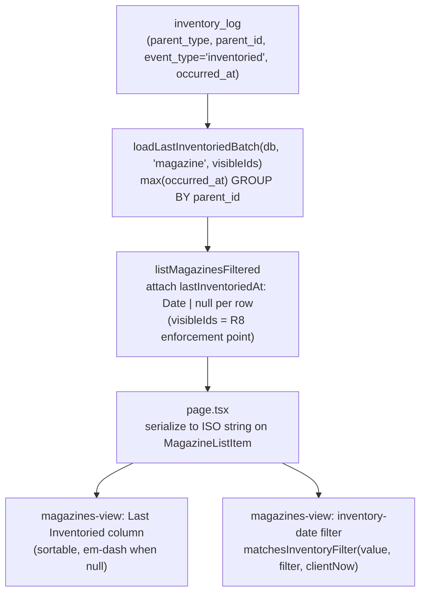

# Magazine Last Inventoried + Inventory-Date Filter - Plan

## Goal Capsule

- **Objective:** Surface a "Last Inventoried" value on the magazines list and let users filter by inventory staleness, so overdue-for-a-count magazines are visible at a glance.
- **Product authority:** Issue #70; scope confirmed via brainstorm and a `ce-doc-review` pass.
- **Execution profile:** Standard feature, 4 dependency-ordered units. Test-first for the new domain loader and pure predicate; e2e for the column and filter UI.
- **Stop conditions:** A genuine product-scope change (anything beyond the Product Contract) is a blocker — surface it rather than expanding scope. No schema migration is expected (the `inventory_log` table and its index already exist).
- **Tail ownership:** Feature branch + PR per repo git workflow; `just ci-check` must pass before commit.
- **Open blockers:** None. The two prior UX questions (preset clock, null sort) are resolved in the Planning Contract; one refinement stays deferred (see Outstanding Questions).

---

## Product Contract

### Summary

Add a **Last Inventoried** column to the magazines list plus an inventory-date filter.
The column shows the most recent `inventoried` inventory-log entry's date, blank when a magazine has never been inventoried.
The filter offers staleness presets (All / Never / 30+ / 90+ / 1yr+ days) with a custom date-range escape hatch, combinable with the existing filters.
The server derives the per-magazine date in one batched query; the view filters client-side alongside today's filters.

### Problem Frame

Magazines already accept `inventoried` inventory-log entries (`MAGAZINE_LOG_EVENTS = ["inventoried"]` in `src/domain/inventory-log/constants.ts`), but the derived "when was this last counted" value is exposed nowhere on the list.
An owner with dozens of magazines cannot see which ones are stale, and cannot narrow the list to items that need a physical count.
The value already exists in the log data — the gap is purely surfacing and filtering it.

### Key Decisions

- **Client-side filtering, honoring KTD-3.** The server derives and attaches the per-magazine last-inventoried date (batched); the view filters it in memory alongside the existing brand/caliber/firearm filters. The issue's text suggested extending the server-side `MagazineFilter` / `listMagazinesFiltered`, but that path is superseded by KTD-3 (`docs/plans/2026-07-04-002-feat-data-table-view-controls-plan.md`), which deliberately retired server-side magazine filtering. `listMagazinesFiltered` keeps receiving an empty filter.
- **Presets plus a custom range.** Staleness presets serve the overdue-scanning job for the common case; a custom date range covers precise needs. Never-inventoried is a first-class state: it has its own preset and is included in the "over N days" presets as maximally stale, but is excluded from custom ranges (it has no date to match).
- **Column is default-visible and sortable.** Unlike the opt-in "Acquired" column, the last-inventoried value is this feature's headline signal, so it ships visible and sortable to support at-a-glance scanning.
- **Absolute date display.** The column renders an absolute date, consistent with the existing "Acquired" column, rather than a relative ("3 months ago") rendering.

### Requirements

**Last Inventoried column**

- R1. The magazines list shows a "Last Inventoried" column whose value is the `occurredAt` of the most recent `inventoried` inventory-log entry for that magazine; it renders blank when the magazine has no `inventoried` entries.
- R2. The column renders an absolute date (same format as the "Acquired" column). For the never-inventoried/blank case it uses an `orDash()`-style em-dash treatment (a per-view local helper, as in the magazine detail view and the accessories/ammo lists), rather than the true-empty cell the magazines "Acquired" column renders. It ships visible by default and is sortable.

**Inventory-date filter**

- R3. The magazines view offers an inventory-date filter with staleness presets: All, Never inventoried, over 30 days, over 90 days, over 1 year.
- R4. The filter is a single control: one Select listing the staleness presets plus a "Custom range…" option that reveals two date inputs (inventoried after / before). Presets and the custom range are mutually exclusive — selecting a preset clears the range, and entering a range clears the preset.
- R5. The inventory-date filter AND-combines with the existing brand/model search, caliber, and compatible-firearm filters.
- R6. The "over N days" presets treat never-inventoried magazines as maximally stale and include them; the threshold is a strict greater-than on elapsed whole days since the last `inventoried` date (day math pinned in KTD-3). A custom date range matches only magazines whose last-inventoried date falls within it — the `after`/`before` day bounds are inclusive, with `before` covering the whole selected day so a same-day entry at any time matches — and excludes never-inventoried magazines (no date to match); those surface via the "Never inventoried" preset (and "All").

**Derivation and scoping**

- R7. The last-inventoried value is batch-loaded — one query across the visible magazines, no per-row query — mirroring the existing `loadCompatibilityBatch` pattern in `src/domain/magazines/`.
- R8. The value respects the owner-scoped / grant visibility model: it is derived only from inventory-log entries the requester can already see through their visible magazines.

**Testing and accessibility**

- R9. The column and filter controls are targeted in tests via ARIA roles, accessible names, or visible text — no `data-testid`.
- R10. Unit coverage exists for the filter predicate and the sort comparator (including the never-inventoried case); integration coverage (Testcontainers) exists for the batched derivation and its visibility scoping; e2e coverage exists for the column and filter UI.

### Acceptance Examples

- AE1. Never inventoried.
  - **Given:** a magazine with no `inventoried` entries.
  - **Then:** the column is blank; the "over N days" presets include it (never counted is maximally stale); a custom range never includes it; the "Never inventoried" preset (and "All") include it.
  - **Covers:** R1, R2, R3, R4, R6.
- AE2. Multiple entries.
  - **Given:** a magazine with several `inventoried` entries on different dates.
  - **Then:** the column shows the most recent `occurredAt`.
  - **Covers:** R1.
- AE3. Combined filters.
  - **Given:** "over 90 days" selected alongside a caliber filter.
  - **Then:** the list returns only magazines that satisfy both.
  - **Covers:** R3, R5.

### Scope Boundaries

- Firearms list — out of scope; a parallel firearms version can follow.
- Editing or deleting inventory-log entries — out of scope; the log stays append-only, unchanged.
- Server-side magazine filtering — out of scope; superseded by KTD-3 of `docs/plans/2026-07-04-002-feat-data-table-view-controls-plan.md`.

### Outstanding Questions

Resolved during planning:

- Preset reference clock — resolved: "over N days" is computed against the client's current time at filter evaluation (KTD-3), consistent with client-side filtering.
- Null sort position — resolved: never-inventoried rows sort as most-stale (KTD-4).

Deferred to follow-up (not this plan):

- Newly-acquired vs. long-neglected never-inventoried rows: a magazine blank because it was acquired last week sorts identically to one uncounted for years. A refinement is to secondary-sort never-inventoried rows by acquired date (oldest-acquired-first). Deferred; the default treats all blanks as equally stale.
- Server-anchored `asOf` clock: KTD-3 uses each viewer's client clock for day math. A stricter option stamps one server `asOf` timestamp (e.g., alongside the batched loader) and passes it as `now`, removing per-viewer clock variance while keeping filtering client-side. Deferred; client "now" is accepted for now.

### Sources

- `app/(app)/magazines/magazines-view.tsx` — list UI and the existing client-side filter row (lines ~321–339 filter in memory).
- `app/(app)/magazines/page.tsx` — loads the list via `listMagazinesFiltered(user.id, {})` with an empty filter.
- `src/domain/magazines/filter.ts`, `src/domain/magazines/service.ts` — list service and the `loadCompatibilityBatch` batching pattern to mirror.
- `src/domain/inventory-log/service.ts`, `src/domain/inventory-log/constants.ts` — `MAGAZINE_LOG_EVENTS = ["inventoried"]`, source of truth for the derived value.
- `docs/plans/2026-07-04-002-feat-data-table-view-controls-plan.md` — KTD-3, the decision to filter magazines client-side.
- `CONCEPTS.md` — Inventory Log / Log Entry / Event Type vocabulary.
- Issue #70.

---

## Planning Contract

**Product Contract preservation:** unchanged by this enrichment. The product-scope sharpening (R2, R4, R6, Key Decision 2, AE1) landed during the `ce-doc-review` pass while the artifact was still requirements-only; planning added no new product scope.

### Key Technical Decisions

- KTD-1. **Server derives, client filters and sorts.** A new batched loader computes the per-magazine last-inventoried date server-side; the magazines view filters and sorts it client-side alongside the existing brand/caliber/firearm filters. This honors KTD-3 of `docs/plans/2026-07-04-002-feat-data-table-view-controls-plan.md` (magazine filtering is client-side; `listMagazinesFiltered` still receives an empty filter) while satisfying R7's no-N+1 requirement. It mirrors the existing `loadCompatibilityBatch` → `attachCompatibility` shape in `src/domain/magazines/`.
- KTD-2. **Derivation attaches in `listMagazinesFiltered`; the visible-id set is the R8 enforcement point.** The loader is called with `rows.map((r) => r.id)`, where `rows` is already scoped by `getVisibleIds(db, actorId, "magazine")`. Like `loadCompatibilityBatch`, the loader trusts its id input and performs no visibility check of its own — the cross-owner guarantee lives in the caller passing only visible ids. The loader must never be called with an unscoped id set.
- KTD-3. **Preset reference clock = client "now"; day math is UTC epoch milliseconds.** Because filtering is client-side, "over N days" is computed against the browser's current time when the predicate runs, not a server timestamp. Elapsed days are computed as `Math.floor((now.getTime() − Date.parse(lastInventoriedAt)) / 86_400_000)` — a fixed 24-hour-block difference, **not** a local-calendar-day diff — so the same shared magazine classifies into the same bucket for a grantee in another timezone (`inventory_log.occurred_at` is a tz-naive timestamp serialized as UTC ISO). The comparison lives in a pure `matchesInventoryFilter(lastInventoriedAt, filter, now)` helper that takes the ISO string and parses it internally, so `now` is injectable and the semantics are unit-testable without a real clock. Resolves the deferred reference-clock question. (A considered-but-deferred alternative — stamping one server `asOf` timestamp and passing it as `now` to remove per-viewer clock variance entirely — is noted in Outstanding Questions.)
- KTD-4. **Never-inventoried sorts as most-stale and renders an em-dash.** The column's `sortingFn` is a Row-level adapter over a pure `compareLastInventoried(a, b)` value comparator (TanStack's `SortingFn` signature is `(rowA, rowB, columnId)`, not a bare value comparator). Null placement needs care: TanStack negates the comparator result for descending sorts (`getSortedRowModel` multiplies by −1 when `isDesc`), and its built-in `sortUndefined` matches only `undefined`, not `null` — so a plain "null is oldest" comparator would flip blanks to the wrong end when the direction toggles. To keep never-inventoried at the stale end in **both** directions, map a missing date to `undefined` and set the column's `sortUndefined` to the stale end, or make the `sortingFn` direction-aware via `column.getIsSorted()`. The blank cell renders an em-dash via a view-local `orDash`-style helper mirroring `app/(app)/magazines/magazine-detail-view.tsx` — `orDash` is a per-view local helper duplicated across views in this codebase, not a shared util, so the list view adds its own. Resolves the deferred null-sort question at the simple default; the acquired-date secondary-sort refinement stays in Outstanding Questions.
- KTD-5. **The loader takes `parentType` as a query parameter (user-confirmed).** `loadLastInventoriedBatch(db, parentType, parentIds)` filters by `parentType` and `eventType = 'inventoried'`. This is a `where`-clause parameter, not a new abstraction layer, kept so the anticipated firearms follow-up reuses it unchanged (confirmed during planning). It mirrors the batching *shape* of `loadCompatibilityBatch`, not its signature — that helper is magazine/firearm-specific and takes no `parentType`. Accepted trade-off: if the firearms follow-up is never filed, the `parentType` parameter is unused flexibility. (For the magazine case the `event_type = 'inventoried'` predicate is trivially true, so it applies as a filter, not an index condition; that is fine at magazine cardinality.)

### High-Level Technical Design

One source of truth (`inventory_log`) fans out through a batched derivation into the list rows, then into the client-side column, sort, and filter:

Prose is authoritative where the diagram is terse: the derivation is a single grouped query (not per-row), and the filter/sort are pure client-side operations over the attached value.

### Sequencing

`U1` (loader) → `U2` (service attach) → `U3` (serialize + column) → `U4` (filter control). `U4` depends on `U3` because the filter predicate needs `lastInventoriedAt` present on the list items.

---

## Implementation Units

### U1. Batched last-inventoried loader

- **Goal:** Add `loadLastInventoriedBatch(db, parentType, parentIds): Promise<Map<string, Date>>` — one grouped `max(occurred_at)` query over `event_type = 'inventoried'` entries, no per-row query. Parents with no inventoried entry are simply absent from the map (the "never" state).
- **Requirements:** R1, R7, R8 (trust model).
- **Dependencies:** none.
- **Files:** `src/domain/inventory-log/last-inventoried.ts` (new); `src/domain/inventory-log/__tests__/last-inventoried.test.ts` (new).
- **Approach:** Drizzle `select({ parentId, last: max(occurredAt) }).from(inventoryLog).where(and(eq(parentType, parentType), eq(eventType, "inventoried"), inArray(parentId, parentIds))).groupBy(inventoryLog.parentId)`. Return an empty `Map` immediately when `parentIds` is empty. The `inventory_log_parent_idx` on `(parent_type, parent_id, occurred_at)` supports the grouped max. Mirror `loadCompatibilityBatch`'s trust model: the loader takes ids as given and performs no visibility check (KTD-2).
- **Execution note:** Start with a failing integration test for the max-per-parent contract, then implement (test-first for new domain behavior).
- **Patterns to follow:** `src/domain/magazines/compatibility.ts` `loadCompatibilityBatch` (batched Map-returning loader).
- **Test scenarios** (integration, Testcontainers, gated on `DATABASE_URL`, reuse `src/test-support/factories.ts`):
  - Covers AE2. A parent with several `inventoried` entries on different dates → map value is the most recent `occurred_at`.
  - A parent with a single `inventoried` entry → map value is that entry's `occurred_at`.
  - Covers AE1. A parent with no `inventoried` entries → parent id absent from the map.
  - Only `inventoried` entries and only the given `parentType` are counted (a firearm entry, or a hypothetical non-`inventoried` event, does not contribute).
  - Empty `parentIds` → empty map, no query issued.
- **Verification:** integration tests green; the derivation is a single grouped statement (assert no per-id iteration in the implementation).

### U2. Attach `lastInventoriedAt` in the list service

- **Goal:** `listMagazinesFiltered` attaches `lastInventoriedAt: Date | null` to each returned row via U1's loader, called with the already-visible magazine ids.
- **Requirements:** R1, R7, R8.
- **Dependencies:** U1.
- **Files:** `src/domain/magazines/filter.ts` (modify); `src/domain/magazines/__tests__/filter.test.ts` (modify).
- **Approach:** After `rows` is built (already scoped by `getVisibleIds`), call `loadLastInventoriedBatch(db, "magazine", rows.map((r) => r.id))` and map `lastInventoriedAt: byId.get(r.id) ?? null` onto each returned item. Extend the returned element type to `MagazineWithCompatibility & { lastInventoriedAt: Date | null }` (export a `MagazineListRow` alias). The existing empty-filter call from `page.tsx` is unchanged. This call site is the R8 enforcement point (KTD-2).
- **Patterns to follow:** `attachCompatibility` in `src/domain/magazines/service.ts` (batch-load then map onto rows).
- **Test scenarios** (integration, Testcontainers, extend `filter.test.ts`):
  - Covers R1, AE2. A magazine with `inventoried` entries → `row.lastInventoriedAt` equals the max `occurred_at`.
  - Covers AE1. A magazine with none → `row.lastInventoriedAt` is `null`.
  - Covers R8. A magazine shared to a grantee carries its date for that grantee; a magazine not visible to the actor never appears in the result (the loader only receives visible ids).
- **Verification:** filter tests green; loader receives exactly the visibility-scoped id set.

### U3. Serialize and render the Last Inventoried column

- **Goal:** Pass `lastInventoriedAt` to the client and add a default-visible, sortable "Last inventoried" column that renders an absolute date, em-dash when never.
- **Requirements:** R1, R2.
- **Dependencies:** U2.
- **Files:** `app/(app)/magazines/page.tsx` (modify); `app/(app)/magazines/magazines-view.tsx` (modify); `app/(app)/magazines/__tests__/last-inventoried-column.test.ts` (new, for the pure sort helper).
- **Approach:** `MagazineListItem` gains `lastInventoriedAt: string | null` (ISO); `page.tsx` maps `m.lastInventoriedAt ? m.lastInventoriedAt.toISOString() : null`. Add a column `{ id: "lastInventoried", accessorFn: (m) => m.lastInventoriedAt, header: "Last inventoried", meta: { label: "Last inventoried" }, sortingFn: <row-adapter>, sortUndefined: <stale-end>, cell: … }` — not `optIn` (default-visible), sortable by default. The cell renders the date in the same format as the "Acquired" column, or an em-dash via a view-local `orDash`-style helper (KTD-4). Extract a pure `compareLastInventoried(a: string | null, b: string | null): number`; wire it into the column via a thin Row adapter (`(rowA, rowB) => compareLastInventoried(rowA.original.lastInventoriedAt, rowB.original.lastInventoriedAt)`) and handle null placement per KTD-4 (map missing → `undefined` + `sortUndefined`, or a direction-aware `sortingFn`) so blanks stay at the stale end in both directions.
- **Patterns to follow:** the existing column defs and `orDash` in `app/(app)/magazines/magazine-detail-view.tsx`; the opt-in "Acquired" column in `magazines-view.tsx` (this column is the visible, non-opt-in counterpart).
- **Test scenarios:**
  - Unit: `compareLastInventoried` orders two real dates chronologically and ranks `null` as oldest; a sort test drives the table's sorted-row-model (not just the bare comparator) and asserts never-inventoried rows stay at the stale end under **both** ascending and descending.
  - Covers R1, R2, AE1, AE2 — e2e (`bun run test:e2e`): the magazines table shows a "Last inventoried" column; a never-inventoried magazine's cell shows the em-dash; a magazine with entries shows its most-recent date; sorting the column places never-inventoried at the stale end. Target via column header role / accessible name / visible text — no `data-testid` (R9).
- **Verification:** column visible by default and sortable; blanks sort as most-stale; `bun run typecheck` and the e2e green.

### U4. Inventory-date filter control and client predicate

- **Goal:** Add the preset-plus-range filter control and client-side filtering per R3–R6, AND-combined with the existing filters.
- **Requirements:** R3, R4, R5, R6.
- **Dependencies:** U3.
- **Files:** `src/domain/magazines/inventory-filter.ts` (new — preset constants + pure predicate); `src/domain/magazines/__tests__/inventory-filter.test.ts` (new); `app/(app)/magazines/magazines-view.tsx` (modify).
- **Approach:** Define the preset union (`all | never | d30 | d90 | d365 | custom`) and `matchesInventoryFilter(lastInventoriedAt, filter, now): boolean` in the new pure module. `MagazineFilters` in the view gains `inventory: { preset: InventoryPreset; after?: string; before?: string }`, persisted in the view state like the existing filters. Add a `Select` (presets + a "Custom range…" option) to `filterSlot`; when `preset === "custom"`, reveal two `<input type="date">` (After / Before). Selecting a preset clears `after`/`before`; entering a range sets `preset = "custom"` (mutually exclusive, R4). Extend the `filtered` `useMemo` to AND in `matchesInventoryFilter(m.lastInventoriedAt, filters.inventory, new Date())` (R5). Semantics (R6): over-N presets include `null` (maximally stale) and use strict greater-than on elapsed days computed as UTC epoch ms (KTD-3); the custom range excludes `null`, treats `before` as end-of-day and `after` as start-of-day so a same-day timestamp is inclusive against the day-precision `<input type="date">` bounds, and uses inclusive bounds; `never` matches only `null`; `all` matches everything. Validate the persisted `inventory` state on load — reject an unknown `preset` or an unparsable `after`/`before` and fall back to `all`. The existing caliber tolerance only re-checks a stored value against live options (it does not validate shape or parseability), and `parseViewState`'s merge is one level deep, so this nested filter needs its own load-time guard to avoid feeding `NaN` dates into the predicate. The predicate lives in its own pure module (rather than inline like the trivial caliber/brand/firearm filters, which the sibling table plan kept in the toolbar) because the date math and R10's DB-free unit-test requirement warrant isolated tests. Keep the `filtered` result memoized (avoids the TanStack autoreset render loop — see `docs/solutions/runtime-errors/tanstack-autoreset-render-loop-unstable-data.md`).
- **Patterns to follow:** the existing caliber/firearm `Select` controls and the `filtered` `useMemo` in `magazines-view.tsx`; the stale-filter tolerance already applied to the caliber filter.
- **Test scenarios:**
  - Unit (`matchesInventoryFilter`, injected `now`): `all` → true for any value; `never` → true only for `null`; `d90` → a date 100 days ago true, exactly 90 days ago false (strict `>`), 30 days ago false, `null` true; custom range with inclusive `after`/`before` → boundary dates true, a same-day timestamp at a non-midnight time true (before = end-of-day), inside true, outside false, `null` false. Covers R3, R4, R6.
  - Unit: an unknown `preset` or an unparsable `after`/`before` from persisted state falls back to `all` (no `NaN`-date behavior).
  - Covers R5, AE3 — e2e (`bun run test:e2e`): the filter offers the presets; choosing "Custom range…" reveals two date inputs; choosing "over 90 days" narrows the list; combining it with a caliber filter narrows to the intersection. Accessible-name / visible-text targeting, no `data-testid` (R9).
  - Regression e2e: the existing brand/caliber/firearm filters still work with the new control present.
- **Verification:** predicate unit tests green; filter e2e green; existing filters unregressed.

---

## Verification Contract

| Gate | Command | Applies to |
|---|---|---|
| Pre-commit gate (mandatory) | `just ci-check` | Every commit — must pass, no `--no-verify` |
| Lint | `bun run lint` (Biome) | All units |
| Typecheck | `bun run typecheck` | All units |
| Unit + integration | `bun test` | U1, U2 (Testcontainers, gated on `DATABASE_URL`); U3, U4 (pure helpers) |
| End-to-end | `bun run test:e2e` (Playwright, Docker) | U3 (column), U4 (filter) — ARIA / accessible-name / text targeting, no `data-testid` |

No database migration is required: the `inventory_log` table and its `inventory_log_parent_idx` already exist. `bun run db:migrate` is not part of this plan.

---

## Definition of Done

Global:

- R1–R10 satisfied; AE1–AE3 have passing coverage at the layers named in their units.
- The derived value is loaded in one grouped query (no N+1) and attached only for visibility-scoped magazine ids (R7, R8).
- The Last Inventoried column ships visible and sortable with never-inventoried rendered as an em-dash and sorted as most-stale; the inventory-date filter offers the presets plus a custom range, AND-combined with the existing filters, with the R6 semantics.
- Pure helpers (`matchesInventoryFilter`, `compareLastInventoried`) are unit-tested; the batched derivation and visibility scoping are integration-tested with Testcontainers; the column and filter are e2e-tested without `data-testid`.
- `just ci-check` is green. No dead-end or experimental code is left in the diff.

Per unit:

| Unit | Done when |
|---|---|
| U1 | `loadLastInventoriedBatch` returns the max `occurred_at` per parent (absent when never); integration tests green |
| U2 | `listMagazinesFiltered` rows carry `lastInventoriedAt` (`null` when never), loaded only for visible ids; filter tests green |
| U3 | Column visible by default, sortable, absolute date or em-dash; sort helper unit-tested; column e2e green |
| U4 | Preset + custom-range control filters client-side per R6, AND-combined; predicate unit-tested; filter e2e green |
