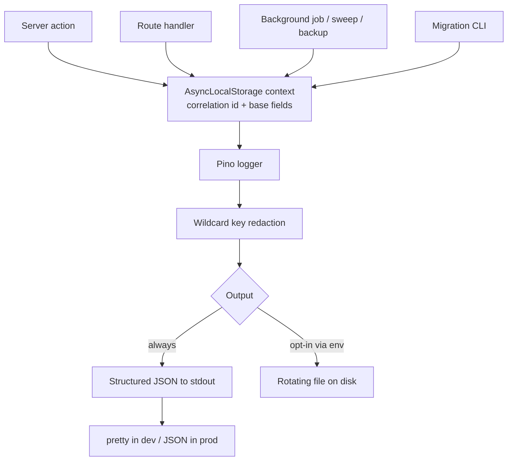
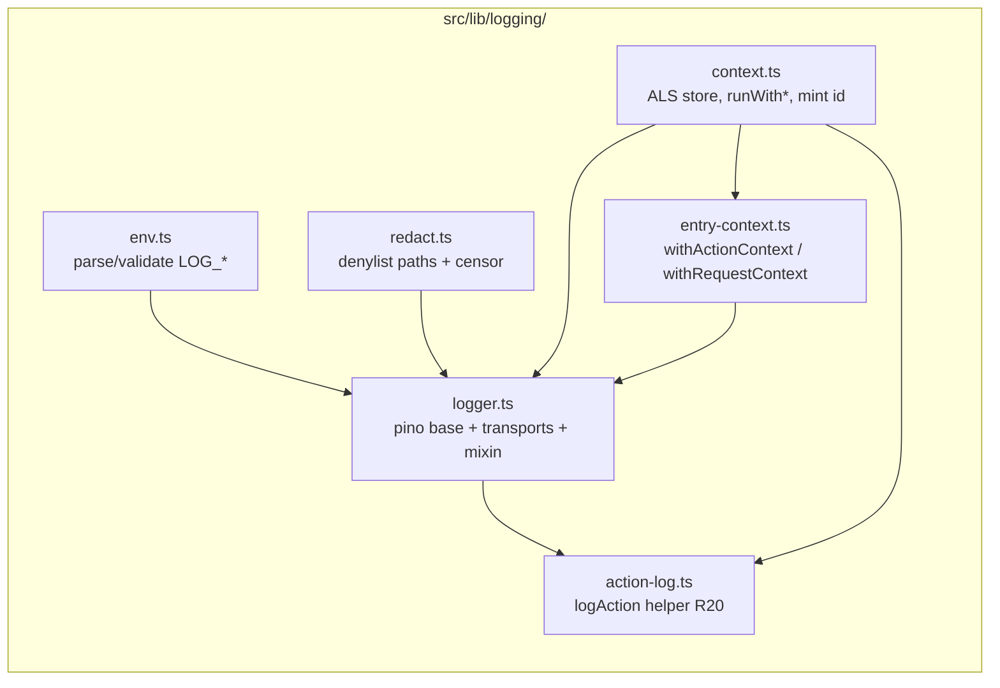

# Structured Logging with Pino - Plan

## Goal Capsule

- **Objective:** Replace ad-hoc `console.*` logging with a single server-side Pino logger that emits structured JSON to stdout by default, supports an opt-in rotating file, controls level and format by env, redacts sensitive fields, auto-threads a correlation id through every server action, route handler, and background job, and emits a human-readable log line for major user actions (object create/delete).
- **Product authority:** GitHub issue #71, plus the Product Contract below.
- **Execution profile:** Standard-to-deep infrastructure change. Net-new logging core module (`src/lib/logging/`), an entry-point context wrapper adopted across **34 server actions + 7 route handlers + 1 boot hook + 1 migration CLI**, migration of **~24 server-side `console.*` call sites** (the `src/` count is 17; add 6 in the backup route handlers and 1 in `instrumentation.ts`), action-log lines at the create/delete seams of the firearms and magazines domain services, a Biome `noConsole` guardrail, docs, and a Docker worker-thread transport verification.
- **Open blockers:** None. All Outstanding Questions were resolved to defaults during planning (see [Planning Assumptions](#planning-assumptions)).
- **Stop conditions:** No hosted aggregator/APM integration, no OpenTelemetry tracing, and no DB-backed audit trail of user actions (owned by the separate `operator-audit` surface). Action logging here is operational log lines only, not a queryable audit record. Surface a genuine blocker rather than expanding scope.

**Product Contract preservation:** Product Contract unchanged. Planning discovered no conflict with the requirements below; it only sharpened counts (call sites, entry points) and resolved the deferred questions into explicit assumptions. R-IDs and AE-IDs are preserved verbatim.

---

## Product Contract

### Summary

Adopt Pino as the logging library, routed through one server-side logger module that every part of the app imports. Structured JSON always goes to stdout for Docker; an opt-in rotating file on disk covers self-hosters without a log collector. Level and format are env-controlled (pretty in dev, raw JSON in prod), a curated set of sensitive keys is redacted from structured fields, and a correlation id is auto-propagated through each server action, route handler, and background job via AsyncLocalStorage so all lines from one unit of work are traceable together. Major user actions — creating and deleting primary domain objects — emit a simple, human-readable log line naming the actor and the object (e.g. `alice created firearm "Glock 19"`).

### Problem Frame

Logging today is unstructured and uncontrolled. Roughly 17 raw `console.log` / `console.error` calls are scattered across `src/storage/`, `src/db/migrate.ts`, `src/backup/`, and `src/domain/*/service.ts`. Output is free-text, so `docker logs` can't be parsed, filtered, or shipped to an aggregator. Everything goes to stdout only — self-hosters who want a durable, rotated file on disk have nothing. There is no level control, so you can't quiet prod or enable debug without editing code. Nothing prevents sensitive data (serial numbers, session tokens, emails) from being logged in the clear. And with no request/action correlation, it is impossible to trace all lines belonging to one server action or job.

MagStacker deploys primarily via Docker, so clean structured stdout is a first-class requirement — but a proper rotating file must remain available for self-hosters who aren't running a collector.

Separately, there is no lightweight record of who created or deleted inventory. A self-hoster who wants to answer "who added this firearm?" or "who deleted that magazine?" today has to query the database directly — the heavyweight, tamper-evident answer lives in the `operator-audit` surface, but nothing emits a simple operational note in the ordinary logs.

### Key Decisions

- **Pino as the logging library.** Fastest structured-JSON logger in the Node/Bun world, with first-class Bun support, simultaneous multi-transport (one call fans out to stdout and a file), built-in wildcard `redact`, and child loggers. Chosen over Winston (heavier, slower, more mutable API) and tslog/bunyan (less momentum). This pick is settled by the issue, not reopened here.
- **AsyncLocalStorage for auto-context.** Correlation id and safe base fields propagate implicitly through each entry point rather than being threaded manually through every function signature. Nothing in the repo uses `AsyncLocalStorage` today, so this is net-new plumbing — accepted as the idiomatic, best-integrated option so correlation is automatic instead of opt-in per call site. Explicit correlation-id threading and Pino's own child-logger pattern were considered and rejected: with 35+ `"use server"` entry points, manual threading is high-friction and easy to omit at a new call site, and a per-call child logger still has to be passed down by hand.
- **stdout is the default sink; the file is opt-in.** Docker-first posture: structured JSON to stdout always. A rotating file is written only when explicitly enabled via env/config; unset means stdout-only.
- **Wildcard key-denylist redaction.** Sensitive fields are redacted by key name at the top level and one level nested via Pino's single-level `*` wildcard (Pino has no recursive `**`; see KTD-3 and R-Risk-1). Deeper objects and message strings remain the call site's responsibility. Emails are fully redacted (no partial-mask variant).
- **`pino` in `serverExternalPackages`.** Mirrors the existing `sodium-native` treatment in `next.config.ts`. Pino's file/pretty transports use worker threads (`thread-stream`); without this, Turbopack bundles the transport code at build time and its worker scripts fail to resolve at runtime in the production image (`next start` over the full `.next` output).
- **Action logging is operational, not an audit trail.** Major mutations emit a plain `info` log line through the same logger — a human-readable note plus structured actor/object fields. It is deliberately not a queryable, tamper-evident audit record; that remains the separate `operator-audit` surface. This keeps the feature KISS: no new tables, no new API, just log lines that inherit the correlation id and redaction already built here. The existing `operator-audit` table could in principle be broadened to carry these events, but it is deliberately security-scoped to admin backup/restore operations; widening it would blur that boundary, so ordinary log lines are the better fit for this lightweight operational visibility.
- **Logs are operator-owned (homelab / self-host trust model).** This is self-hosted software; stdout and any opt-in file belong to the operator running the instance. Log confidentiality is therefore the operator's responsibility, not an app-enforced control — so attaching owner id as a per-line field once the service transaction resolves it (R10/KTD-4, not an ambient base field) and emitting per-object action lines (R17) is accepted rather than a leak. Redaction (R8/R9) and the message-string discipline (R20) still apply, because secrets like session tokens, passwords, and emails should never appear even in operator-owned logs (and those logs may later be shipped to an aggregator).

### Requirements

**Logger core**

- R1. A single server-side logger module is the only logging entry point for application code; no `console.*` remains in `src/` outside CLI scripts and tests.
- R2. The logger emits raw structured JSON in production and human-readable, colorized pretty output in development, selected by environment.
- R3. The logger is server-only and is never imported into client or edge-runtime code.

**Output, levels, and rotation**

- R4. The structured logger's output is always written to stdout; the on-the-wire format — raw JSON in production, pretty in development — is governed by R2.
- R5. A rotating log file is written to disk only when explicitly enabled via env/config; when unset, output is stdout-only. Both sinks are driven from the one logger.
- R6. The minimum emitted level is controlled by an env var (`fatal|error|warn|info|debug|trace`), defaulting to `info` in production and `debug` in development.
- R7. File rotation is size- or time-based and configurable via env/config.

**Redaction**

- R8. A curated denylist of sensitive key names — serial numbers, session tokens, passwords, emails, authorization headers, and similar — is redacted at the top level and one level nested via Pino's single-level `*` wildcard. Pino has no recursive match, so deeper objects and message strings are handled at the call site (see KTD-3, R-Risk-1).
- R9. Redaction operates on structured log fields only; values interpolated into message strings are not scanned. Call sites must pass sensitive data as fields rather than concatenating it into the message.

**Correlation and context**

- R10. Each server action, route handler, and background job establishes a request/action-scoped context carrying a correlation id and safe base fields (module name, and owner id where safe), auto-propagated via AsyncLocalStorage so every log line in that unit of work shares the id without manual passing.
- R11. Non-request entry points that run with no ambient request context — chiefly the migration CLI — generate their own correlation id per invocation. Background sweeps and backup jobs invoked inline from a server action or route handler inherit that request's context and correlation id; they mint a fresh id only when they run with no ambient context.
- R19. A single shared entry-point wrapper (or an equivalent lint/type guard) establishes the correlation context for server actions and route handlers, so a newly added entry point cannot silently run without a correlation id — mirroring R13's role for `console.*`.

**Call-site migration**

- R12. All existing `console.*` calls across `src/storage/`, `src/db/migrate.ts`, `src/backup/`, `src/domain/*/service.ts`, the backup route handlers, and `instrumentation.ts` are replaced with the logger at an appropriate level, passing any sensitive values as redactable fields.

**Guardrails and documentation**

- R13. A Biome `noConsole` lint rule prevents regressions to raw `console.*` in application code, with overrides for CLI scripts and tests.
- R14. `pino` (and its worker-thread transports) is added to `serverExternalPackages` in `next.config.ts` so its worker-thread transports are not bundled by Turbopack.
- R15. All `LOG_*` env vars are documented in `.env.example` and the deployment docs.
- R16. The file/pretty transports (Pino worker threads) are verified to work inside the production Docker image as it actually runs — `next start` against the full `.next` build output — not only in local dev.

**User action logging**

- R17. Creating or deleting a primary domain object (firearms and magazines) emits an `info`-level log line naming the acting user and the object by type and name, e.g. `alice created firearm "Glock 19"`.
- R18. Each action-log line carries the actor and object as structured fields (in addition to the human-readable message) so it is redactable and machine-parsable, and it inherits the request/action correlation id from R10. In the message string the actor is named by display name (`user.name`); email and other sensitive identifiers are never interpolated into the message.
- R20. The logger exposes a typed action-log helper that builds the R17 message from a fixed set of known-safe inputs — action verb, actor display name, object type, and a length-bounded object label sourced from the object's display name (nickname/label). Call sites use the helper rather than hand-concatenating raw objects or dedicated sensitive fields (serial number, etc.) into the message, making R9's message-string rule the ergonomic default instead of a convention. It does not scan the label for secrets a user may have typed into a free-text name — under the operator-owned-logs trust model that residual is accepted.

### Logger fan-out and context flow



### Acceptance Examples

- AE1. Level filtering.
  - **Given** `LOG_LEVEL=info`, **When** a `debug` line is emitted, **Then** it does not appear; **When** an `info`-or-higher line is emitted, **Then** it does.
  - **Covers R6.**
- AE2. Field vs message redaction.
  - **Given** an object with a `serialNumber` field is logged, **Then** the emitted record shows the value redacted. **Given** the same serial is interpolated into the message string, **Then** it is not redacted.
  - **Covers R8, R9.**
- AE3. File opt-in and rotation in Docker.
  - **Given** file logging is unset, **Then** only stdout receives output. **Given** file logging is enabled, **Then** JSON is written to the file and rotates at the configured threshold, verified inside the Docker image.
  - **Covers R5, R7, R16.**
- AE4. Dev vs prod format.
  - **Given** development, **Then** output is pretty and colorized. **Given** production, **Then** output is raw JSON.
  - **Covers R2.**
- AE5. Correlation across a unit of work.
  - **Given** one server action emits multiple log lines, **Then** all share a single correlation id. **Given** the migration CLI runs as a separate invocation, **Then** its lines carry a different id. **Given** a background sweep is invoked inline from that server action, **Then** its lines share the server action's id.
  - **Covers R10, R11.**
- AE6. Major action logging.
  - **Given** a user creates a firearm, **Then** an `info` line names the actor and the firearm (`alice created firearm "Glock 19"`) and carries the same correlation id as the rest of that action. **Given** a user deletes a magazine, **Then** an equivalent delete line is emitted.
  - **Covers R17, R18.**

### Scope Boundaries

**Deferred for later**

- Shipping to a hosted log aggregator or APM (Loki, ELK, Datadog). Structured JSON on stdout makes this a downstream, deployment-side concern.

**Deferred to Follow-Up Work** (plan-local sequencing, not product non-goals)

- Action logging for **edits/updates** and for entities beyond firearms/magazines (documents, photos, range sessions, accessories, ammo, inventory entries). See [Planning Assumptions](#planning-assumptions).
- Wiring a scheduler for `orphanSweep` (`src/storage/orphan-sweep.ts`). It remains on-demand; the R11 "background sweep inherits ambient context / mints its own when standalone" behavior is provided by the context module and exercised where the sweep is actually invoked, but no cron is added here.

**Outside this issue's identity**

- Distributed tracing / OpenTelemetry spans.
- A DB-backed, queryable, tamper-evident audit trail of user actions — owned by the separate, security-scoped `operator-audit` surface that already exists. The operational action-log lines in R17–R18 are not that; they are ordinary log output, not a durable audit record.
- Retroactively scanning or scrubbing free-text message strings for secrets. Redaction is key-scoped by design (R9), so action-log messages (R17) name objects but must keep sensitive values like serial numbers out of the message string.
- Hardening of the opt-in log file on disk — permissions, storage location, and retention beyond what rotation (R7) provides. Under the operator-owned-logs trust model these are deployment concerns owned by the person running the instance, not app-enforced controls.
- The two **client-component** `console.error` calls (`app/(app)/settings/settings-form.tsx`, `components/ui/console-signature.tsx`). R3 keeps the logger server-only; the easter-egg signature is intentional. These are exempted from R12 and R13, not migrated.

### Dependencies / Assumptions

- Deployment docs live at `docs/deployment.md`, which already exists; the LOG_* documentation (R15) lands there now. The forthcoming user-guide site (issue #65) is a later home for the same content, not a blocker.
- Owner id is treated as safe to include in base fields. Serial numbers, session tokens, passwords, and emails are not.
- The `serverExternalPackages` + worker-thread pattern is already proven in this repo for `sodium-native`; Pino follows the same path.

---

## Planning Assumptions

Resolved from the origin document's *Outstanding Questions* during planning (pipeline mode → recommended defaults recorded as explicit assumptions). Each is safe to override before implementation without reshaping the plan.

- **A1. Env var names (final):** `LOG_LEVEL`, `LOG_FILE`, `LOG_FILE_ROTATION`, `LOG_FORMAT`.
  - `LOG_LEVEL` — `fatal|error|warn|info|debug|trace`; default `info` (prod) / `debug` (dev). (R6)
  - `LOG_FILE` — absolute/relative path to the rotating log file. **Unset → stdout-only** (R5).
  - `LOG_FILE_ROTATION` — rotation threshold string passed to `pino-roll` (e.g. `10M`, `daily`). Default `10M`. (R7)
  - `LOG_FORMAT` — `json|pretty`; default derived from `NODE_ENV` (`pretty` in dev, `json` in prod). Explicit override wins. (R2)
- **A2. Rotation default:** size-based `10M`, retaining the **10** most recent rotated files (`pino-roll` `limit: { count: 10 }`, `mkdir: true`). Overridable via `LOG_FILE_ROTATION`.
- **A3. Base-field set (ALS context):** `correlationId`, `module` (per child logger), and — for action logging — the actor's display name and id. `ownerId` is attached per-line where a service/action has resolved it (not an ambient base field — see KTD-4). Email/role are **not** carried.
- **A4. Action logging covers create + delete only** (the floor). Edits/updates are deferred to follow-up.
- **A5. "Primary domain objects" = firearms and magazines only.** Attached/secondary records (documents, photos, range sessions, accessories, ammo, inventory entries) are deferred.

---

## Key Technical Decisions

- **KTD-1 — Pino v10, four packages.** Add `pino` (core), `pino-pretty` (dev transport — kept a regular `dependency`, not dev-only, because transport targets resolve at runtime and a missing module crashes startup), `pino-roll` (size/time rotation), and `thread-stream` **pinned as a direct dependency** to the version `pino` expects. The direct `thread-stream` pin works around a Next 16 Turbopack tracing bug where a transitive-only `thread-stream` fails to resolve for the worker transport.
- **KTD-2 — `serverExternalPackages: ["sodium-native", "pino", "pino-pretty", "pino-roll", "thread-stream"]`.** Extends the existing array; follows the `sodium-native` precedent and its explanatory comment. Pino's transports run in `thread-stream` worker threads; excluding them from Turbopack bundling keeps them normal runtime `require()`s resolved from `node_modules`. (R14)
- **KTD-3 — Redaction is enumerated known-depth paths, not a true recursive wildcard.** Pino's `redact` `*` matches **exactly one** path level; there is **no** `**` recursive match. R8's "anywhere in the tree" is delivered by (a) a curated denylist covering top-level **and** one-level-nested keys in **both** camelCase and snake_case (`serialNumber`, `serial_number`, `*.serialNumber`, `*.serial_number`, `email`, `*.email`, `password`, `*.password`, `token`, `*.token`, `sessionToken`, `session_token`, `*.sessionToken`, `*.session_token`, `accessToken`, `access_token`, `authorization`, `req.headers.authorization`, `req.headers.cookie`) — snake_case matters because Better Auth's own session field is `session_token` (per AGENTS.md), and (b) a logged-object **shape convention**: domain objects are logged under a single known key (e.g. `firearm`, `magazine`) so a sensitive field always sits at a predictable depth. Documented as a convention in the logging module. This is an honest constraint, not full tree redaction — see [Risks](#risks--dependencies).
- **KTD-4 — One entry-point wrapper HOF, adopted everywhere, consolidating existing boilerplate.** A `withActionContext(module, fn)` higher-order function resolves the current user, mints a correlation id, seeds the ALS store with the fields known at entry (`correlationId`, `module`, actor id + display name), runs the body, and funnels errors through the existing `toActionError` chokepoint. **`ownerId` is NOT seeded by the wrapper** — `getCurrentUser()` exposes no owner id, and the true owner is resolved only *inside* the service transaction (`resolveCreateOwner`), where authorized create-on-behalf/grant paths make `actorId !== ownerId` a real case. So R10's "owner id where safe" is satisfied by attaching `ownerId` as a per-line field at the service/action sites that have actually resolved it (e.g. the action-log line in U6), not as an ambient base field. Every server action is rewrapped in it; this *replaces* the per-file `requireUserId()` + `try/catch/toActionError` boilerplate rather than adding to it, so the migration is a net simplification (satisfies R10 + R19 while reducing duplication). Route handlers get a sibling `withRequestContext` wrapper suited to their `Request → Response` shape.
- **KTD-5 — Action-log lines are emitted from the domain service create/delete functions.** The service has the persisted row (hence the object **label**: firearms via the existing `firearmDisplayName`; magazines via a **new** `magazineDisplayName` helper — no equivalent exists today, and `magazine.label` is `text().notNull().default("")`, so the helper must fall back to `brandModel` when `label` is empty, mirroring `firearmDisplayName`'s nickname/name fallback); the **actor display name** is read from the ALS context (seeded by KTD-4's wrapper). A typed `logAction({ verb, objectType, objectLabel })` helper (R20) reads the actor from context and emits the `info` line + structured fields. This avoids threading the session through service signatures and inherits the correlation id automatically. `deleteFirearm`/`deleteMagazine` already read the row in their pre-delete path, so the label is available without an extra query.
- **KTD-6 — Correlation id source.** `node:crypto` `randomUUID()`. No new dependency.
- **KTD-7 — The error funnel `src/domain/action-result.ts#toActionError` becomes the central error-log site.** Migrating its lone `console.error` to `logger.error` means every server-action error is logged once, with the correlation id and actor context already in the ALS store — high leverage from a one-line change.

---

## High-Level Technical Design

### Module layout (net-new `src/lib/logging/`)



### Request → log correlation (server action path)

```mermaid
sequenceDiagram
  participant C as Client
  participant A as createFirearmAction<br/>(withActionContext)
  participant CTX as ALS store
  participant S as createFirearm (service)
  participant L as Pino logger
  C->>A: invoke server action
  A->>CTX: run({correlationId, module, actor})
  Note over CTX: ownerId is NOT seeded here (resolved inside the tx); attached per-line where known
  A->>S: createFirearm(actorId, input)
  S->>L: logAction(create, firearm, label)
  Note over L: mixin() reads CTX → merges correlationId + actor
  L-->>L: redact fields → stdout (+ opt-in file)
  A->>CTX: (on error) toActionError → logger.error (same id)
  A-->>C: ActionResult
```

### Output selection (env decision matrix)

| `LOG_FILE` | `NODE_ENV` / `LOG_FORMAT` | stdout target | file target |
|---|---|---|---|
| unset | dev / (default `pretty`) | `pino-pretty` | — |
| unset | prod / (default `json`) | `pino/file` fd=1 (raw JSON) | — |
| set | dev | `pino-pretty` | `pino-roll` (raw JSON) |
| set | prod | `pino/file` fd=1 | `pino-roll` (raw JSON) |

The stdout target is always present; `pino-roll` is appended to the `targets` array only when `LOG_FILE` is set. `LOG_FORMAT` overrides the `NODE_ENV`-derived default for the stdout target.

---

## Output Structure

```text
src/lib/logging/
├── env.ts               # parse + validate LOG_LEVEL / LOG_FILE / LOG_FILE_ROTATION / LOG_FORMAT
├── redact.ts            # curated redaction paths + censor (KTD-3)
├── context.ts           # AsyncLocalStorage store, runWithContext, mintCorrelationId, getContext
├── logger.ts            # pino base logger: transports (stdout + opt-in file), mixin, level
├── action-log.ts        # logAction() typed helper (R20)
├── entry-context.ts     # withActionContext / withRequestContext wrappers (R19)
├── index.ts             # public surface: logger, logAction, withActionContext, withRequestContext
└── __tests__/
    ├── logger.test.ts   # level, format, redaction, file opt-in (AE1, AE2, AE4)
    ├── context.test.ts  # correlation propagation + mint/inherit (AE5)
    └── action-log.test.ts # action-log message + fields (AE6)
```

The per-unit `**Files:**` lists remain authoritative; the tree is the scope declaration.

---

## Implementation Units

### U1. Dependencies and Turbopack build config

- **Goal:** Install the Pino stack and stop Turbopack from bundling its worker-thread transports.
- **Requirements:** R14. Advances KTD-1, KTD-2.
- **Dependencies:** none.
- **Files:**
  - `package.json` (add `pino`, `pino-pretty`, `pino-roll`, `thread-stream` to `dependencies`; add the four to `trustedDependencies` if postinstall requires; keep `thread-stream` pinned to `pino`'s expected version)
  - `next.config.ts` (extend `serverExternalPackages`)
  - `bun.lock` (regenerated by `bun install`)
- **Approach:** `bun add pino pino-pretty pino-roll thread-stream`, then pin `thread-stream` to the version `pino` depends on. Extend `serverExternalPackages` to `["sodium-native", "pino", "pino-pretty", "pino-roll", "thread-stream"]`, mirroring the existing `sodium-native` comment with a one-line note on why (worker-thread transports).
- **Patterns to follow:** the existing `serverExternalPackages` entry and comment block in `next.config.ts`.
- **Test scenarios:** `Test expectation: none — dependency + config only.` Verified transitively by U9 (Docker build/run) and by `bun run build` succeeding.
- **Verification:** `bun install` clean; `bun run typecheck` and `bun run build` succeed with the new config.

### U2. Logging core module (logger + context + redaction + env)

- **Goal:** The net-new `src/lib/logging/` core: env-driven Pino logger, ALS correlation context, and redaction — the single import surface for all app logging.
- **Requirements:** R1, R2, R3, R4, R5, R6, R7, R8, R9, R10 (mechanism), R11 (mint helper). Advances KTD-3, KTD-6.
- **Dependencies:** U1.
- **Files:**
  - `src/lib/logging/env.ts`
  - `src/lib/logging/redact.ts`
  - `src/lib/logging/context.ts`
  - `src/lib/logging/logger.ts`
  - `src/lib/logging/index.ts`
  - `src/lib/logging/__tests__/logger.test.ts`
  - `src/lib/logging/__tests__/context.test.ts`
- **Approach:**
  - `env.ts` — validate `LOG_LEVEL` against the six levels (fallback `info`/`debug` by `NODE_ENV`); read `LOG_FILE`, `LOG_FILE_ROTATION` (default `10M`), `LOG_FORMAT` (default from `NODE_ENV`).
  - `redact.ts` — export the curated `paths` denylist (KTD-3) + `censor` and document the known-depth shape convention.
  - `context.ts` — `AsyncLocalStorage<LogContext>`, `runWithContext(ctx, fn)`, `mintCorrelationId()` (`randomUUID`), `getContext()`.
  - `logger.ts` — build the `targets` array per the [output matrix](#output-selection-env-decision-matrix): stdout always (`pino-pretty` or `pino/file` fd=1), `pino-roll` appended only when `LOG_FILE` set. `level` from env. `mixin()` merges the ALS store's safe fields onto every line. `redact` from `redact.ts`.
  - Add a server-only guard (`import "server-only"` or a runtime `throw` if imported client-side) to enforce R3.
  - `index.ts` re-exports `logger`, context helpers.
- **Execution note:** Build the core test-first for the observable contracts (level filtering, field-vs-message redaction, format selection) — these are the AE guarantees and are cheap to pin with an in-memory/destination-captured Pino stream.
- **Patterns to follow:** `src/db/client.ts` lazy-singleton export style; `next16-native-addon-serverexternalpackages` learning for the worker-thread rationale.
- **Test scenarios:**
  - Covers AE1. `LOG_LEVEL=info` → a `debug` call produces no output; an `info` call does.
  - Covers AE2. Logging `{ firearm: { serialNumber: "X" } }` → emitted record shows `serialNumber` redacted; the same value interpolated into the message string is **not** redacted.
  - Redaction covers top-level and one-level-nested keys (`email`, `*.email`, `password`, `token`, `authorization`).
  - Covers AE4. `LOG_FORMAT=pretty` → colorized/pretty; `LOG_FORMAT=json` (or prod) → raw JSON line parses as JSON with expected keys.
  - File opt-in: with `LOG_FILE` unset, no file target is constructed (stdout only); with `LOG_FILE` set, a file target is present. (Rotation-in-Docker portion is AE3, verified in U9.)
  - `context.ts`: `runWithContext` makes `getContext()` return the seeded fields inside the callback and `undefined` outside; `mintCorrelationId()` returns distinct ids.
  - Importing the module in a simulated client/edge context throws or is blocked (R3 guard).

### U3. Entry-point context wrapper + server-action adoption

- **Goal:** A `withActionContext` HOF that establishes correlation context for every server action and replaces the duplicated `requireUserId` + `try/catch/toActionError` boilerplate.
- **Requirements:** R10, R19. Advances KTD-4, KTD-7.
- **Dependencies:** U2.
- **Files:**
  - `src/lib/logging/entry-context.ts` (new — `withActionContext`)
  - `src/lib/logging/__tests__/entry-context.test.ts` (new)
  - `src/domain/action-result.ts` (route its `console.error` through `logger.error`, reading ALS context — KTD-7)
  - `app/(app)/firearms/actions.ts`, `app/(app)/firearms/session-actions.ts`, `app/(app)/firearms/documents-actions.ts`, `app/(app)/firearms/photo-actions.ts`
  - `app/(app)/magazines/actions.ts`, `app/(app)/accessories/actions.ts`, `app/(app)/ammo/actions.ts`, `app/(app)/inventory-log/log-actions.ts`, `app/(app)/grants/actions.ts`, `app/(app)/settings/actions.ts`
  - `app/(admin)/users/actions.ts` (admin variant — preserve its `requireAdmin` + `assertWritesAllowed` gates)
- **Approach:** `withActionContext(module, handler)` resolves `getCurrentUser()`, mints a correlation id, seeds the ALS store, runs `handler` inside `runWithContext`, and funnels thrown errors through `toActionError`. Rewrap each of the 34 exported actions. Keep each action's domain-specific gate (auth, admin, maintenance-mode) inside the handler. The admin file keeps `requireAdmin()`/`assertWritesAllowed(db)`.
- **Execution note:** This is a wide, mechanical refactor across 11 files — land it after U2 is green. Preserve each action's exact `ActionResult` return shape; the wrapper changes plumbing, not contract.
- **Patterns to follow:** existing `requireUserId()` + `toActionError` shape in `app/(app)/firearms/actions.ts`; `src/auth/session.ts#getCurrentUser`.
- **Test scenarios:**
  - Covers AE5 (partial). Two log lines emitted within one wrapped action share one correlation id; a second invocation gets a different id.
  - A wrapped action still returns `{ ok: true, data }` on success and `toActionError(...)` on throw (contract preserved).
  - A thrown error inside a wrapped action produces exactly one `logger.error` line carrying the action's correlation id (KTD-7).
  - Admin action path still enforces `requireAdmin` (unauthorized → error result, no context leak).
  - Integration: invoking `createFirearmAction` end-to-end (Testcontainers DB) persists the firearm **and** the emitted lines share the action's id.

### U4. Context adoption for route handlers, boot hook, and migration CLI

- **Goal:** Correlation context at the non-server-action entry points, with fresh-vs-inherited id semantics, plus migrating their `console.*`.
- **Requirements:** R10, R11, R12 (route/boot/CLI subset). Advances KTD-4.
- **Dependencies:** U2 (and `withActionContext` pattern from U3 for consistency).
- **Files:**
  - `src/lib/logging/entry-context.ts` (add `withRequestContext` for `Request → Response`)
  - `app/api/admin/backup/export/route.ts` (4 `console.error` → logger; wrap in context)
  - `app/api/admin/backup/restore/route.ts` (2 `console.error` → logger; wrap in context)
  - `app/api/documents/[id]/route.ts`, `app/api/photos/[id]/[variant]/route.ts`, `app/api/export/route.ts`, `app/api/export/ammo/route.ts`, `app/api/auth/[...all]/route.ts` (wrap in context; no console today)
  - `instrumentation.ts` (1 `console.error` → logger; boot hook mints its own id — no ambient request context, R11)
  - `src/db/migrate.ts` (2 `console.*` → logger; CLI mints its own id per invocation, R11)
- **Approach:** `withRequestContext(module, handler)` mints a correlation id (or honors an inbound `x-request-id`), seeds ALS, and runs the handler. For streaming backup routes, ensure the context spans the full stream lifecycle. `instrumentation.ts#register` and `migrate.ts#main` each call `runWithContext({ correlationId: mintCorrelationId(), module })` around their body — these are the R11 "no ambient context → own id" cases. The migration CLI uses the logger directly (standalone process; transports still resolve from `node_modules`).
- **Execution note:** Verify the Better Auth catch-all route (`app/api/auth/[...all]/route.ts`) still delegates cleanly when wrapped — do not alter its handler contract.
- **Patterns to follow:** existing route-handler structure; `instrumentation.ts` `register()` guard on `NEXT_RUNTIME === "nodejs"`; `src/db/migrate.ts` `main().catch()` shape.
- **Test scenarios:**
  - Covers AE5. Migration CLI invocation carries a correlation id **distinct** from any request; a sweep/job invoked inline from a request inherits that request's id, and mints its own only when run standalone.
  - A wrapped route handler returns the same `Response` it did before (status, body, headers unchanged for a representative export route).
  - Backup export failure path emits a `logger.error` (not `console.error`) carrying the route's correlation id.
  - `instrumentation.ts` boot-hook failure is logged via `logger.error` and still does not throw/block boot.

### U5. Migrate remaining `console.*` in services and storage

- **Goal:** Replace the domain-service and storage `console.*` calls with the logger, passing sensitive values as redactable fields.
- **Requirements:** R12 (services/storage subset), R8/R9 (field discipline).
- **Dependencies:** U2.
- **Files:**
  - `src/backup/maintenance.ts` (2), `src/backup/restore-service.ts` (3)
  - `src/domain/firearm-documents/service.ts` (3), `src/domain/firearm-photos/service.ts` (2)
  - `src/storage/document-blobs.ts` (1), `src/storage/orphan-sweep.ts` (2), `src/storage/photo-blobs.ts` (1)
  - (Note: `src/domain/action-result.ts` is migrated in U3 as KTD-7.)
- **Approach:** Swap each `console.error(msg, error)` for `logger.error({ err: error, ...fields }, msg)` at the module's child logger (`logger.child({ module })`). Pass storage keys / ids as fields, never interpolated secrets. These modules do **not** establish context — they inherit whatever ambient ALS context the calling entry point set (or none, for a standalone script run), which is correct per R11.
- **Execution note:** Behavior-preserving swap — keep the same log level and the same conditions. Where an error object is logged, use Pino's `err` serializer key so stack traces render.
- **Patterns to follow:** the child-logger + `err` key convention established in U2; existing best-effort-failure comments in `orphan-sweep.ts` / `photo-blobs.ts`.
- **Test scenarios:**
  - `orphanSweep` best-effort delete failure emits a `logger.error` with the key as a field and does not throw (behavior preserved).
  - A logged error object renders a stack trace (via `err` serializer) rather than `[object Object]`.
  - `Test expectation:` mostly characterization — assert the failure paths still swallow-and-continue exactly as before, now via the logger.

### U6. Action-log helper + firearm/magazine create & delete lines

- **Goal:** The R20 typed `logAction` helper, wired into the create/delete seams of the firearms and magazines services.
- **Requirements:** R17, R18, R20. Advances KTD-5.
- **Dependencies:** U2, U3 (actor name must be seeded into ALS by the wrapper).
- **Files:**
  - `src/lib/logging/action-log.ts` (new — `logAction({ verb, objectType, objectLabel })`)
  - `src/lib/logging/__tests__/action-log.test.ts` (new)
  - `src/domain/firearms/service.ts` (`createFirearm`, `deleteFirearm`)
  - `src/domain/magazines/service.ts` (`createMagazine`, `deleteMagazine`)
  - `src/domain/magazines/display.ts` (new — `magazineDisplayName`, mirroring `src/domain/firearms/display.ts`)
- **Approach:** `logAction` reads the actor display name from ALS context (KTD-4/KTD-5), takes `verb` (`created`/`deleted`), `objectType` (`firearm`/`magazine`), and an `objectLabel` bounded to **`ACTION_LABEL_MAX = 64` chars** (a plan-local constant in the logging module; the magazines `MAX_LABEL_LENGTH = 4` is Magpul-dot-matrix-specific and must **not** be reused here). It builds the message `` `${actor} ${verb} ${objectType} "${label}"` `` and attaches structured `{ action: { verb, actor, actorId, objectType, objectLabel } }` fields (redaction-safe; no serial/email in message). In `createFirearm`, call it with `firearmDisplayName(row)` after the insert commits. In `deleteFirearm`, read the display-name fields in the existing pre-delete hook (alongside the storage keys) and log after commit. Mirror in the magazines service with the new `magazineDisplayName` (`label` when non-empty, else `brandModel`). Truncate `objectLabel` to `ACTION_LABEL_MAX` before building the message.
- **Execution note:** Emit **after** the mutating transaction commits so a rolled-back create/delete never logs a phantom action.
- **Patterns to follow:** `src/domain/firearms/display.ts#firearmDisplayName`; the post-commit best-effort pattern already used for blob cleanup in `deleteFirearm`.
- **Test scenarios:**
  - Covers AE6. Creating a firearm emits one `info` line `alice created firearm "Glock 19"` carrying the action's correlation id; deleting a magazine emits the equivalent delete line.
  - The message string never contains the serial number even when the firearm has one; the structured fields carry actor + object, and `serialNumber` (if present in any logged object) is redacted (R18/R9).
  - Label longer than the bound is truncated in the message.
  - A create whose transaction rolls back emits **no** action line.
  - Integration (Testcontainers): `createFirearmAction` → persisted row **and** action line share the wrapper's correlation id.

### U7. Biome `noConsole` guardrail

- **Goal:** Prevent regressions to raw `console.*` in application code, with CLI/test carve-outs.
- **Requirements:** R13.
- **Dependencies:** U3, U4, U5, U6 (all app-code `console.*` must be gone first, or `bun run lint` fails).
- **Files:** `biome.json`
- **Approach:** Enable `linter.rules.suspicious.noConsole` (error). Add a `files.overrides`/`overrides` block (per the Biome 2.5 schema) exempting `scripts/**`, `e2e/**`, `**/__tests__/**`, `src/db/migrate.ts`, and the two client easter-egg/settings client components noted in Scope Boundaries. Confirm the exact override key against the pinned Biome 2.5.2 schema before writing.
- **Execution note:** `biome.json` edits are hook-blocked in this repo (see `dependabot-bun-and-biome-dualpin` learning) — expect to apply this change in a way that clears the guard, and re-run `just ci-check`.
- **Patterns to follow:** the existing `linter.rules` structure in `biome.json` (there is no `overrides` block today — this is net-new).
- **Test scenarios:**
  - `Test expectation: none — lint config.` Verified by: `bun run lint` passes on the migrated tree; adding a `console.log` to an app-code file makes `bun run lint` fail; adding one to a `scripts/` or `__tests__/` file does not.

### U8. Documentation — `.env.example` and deployment docs

- **Goal:** Document every `LOG_*` env var and the file/rotation behavior.
- **Requirements:** R15.
- **Dependencies:** U2 (final env names/defaults).
- **Files:** `.env.example`, `docs/deployment.md`
- **Approach:** Add a `# --- Logging ---` block to `.env.example` documenting `LOG_LEVEL`, `LOG_FILE`, `LOG_FILE_ROTATION`, `LOG_FORMAT` with defaults and the stdout-only-when-unset behavior, matching the file's existing commented-block style. In `docs/deployment.md`, add a Logging section: stdout is always structured JSON (Docker-native `docker logs`), the opt-in rotating file for collector-less self-hosters, rotation/retention defaults, and the operator-owned-logs trust note.
- **Patterns to follow:** the existing `# --- App ---` / `# --- Storage ---` commented blocks in `.env.example`.
- **Test scenarios:** `Test expectation: none — documentation.` Sanity: env names in docs match the strings `env.ts` actually reads.

### U9. Docker worker-thread transport verification

- **Goal:** Prove the file/pretty transports actually work inside the production image as it runs (`next start` over the full `.next` output), not just in `next dev`.
- **Requirements:** R16. Closes AE3's Docker portion.
- **Dependencies:** U1, U2 (transports exist and are excluded from bundling).
- **Files:** (verification-only; may add a short note to `docs/deployment.md` or an e2e/smoke script if one fits the existing harness)
- **Approach:** Build the production Docker image, run it with `LOG_FILE` set to a mounted path and `LOG_FILE_ROTATION` at a low threshold, exercise a request, and confirm: (a) structured JSON on `docker logs` (stdout), (b) the rotating file is written and rotates at the threshold, (c) no `thread-stream`/worker-thread resolution error at boot or first log. Repeat unset-`LOG_FILE` to confirm stdout-only.
- **Execution note:** This is a **smoke/runtime verification**, not unit coverage — the whole point is the real image, per the `next16-native-addon-serverexternalpackages` learning (worker/addon bugs only surface in the built image, never in dev).
- **Patterns to follow:** the existing Docker build/run flow in `docs/deployment.md`; Testcontainers usage in the e2e harness if a scripted check fits.
- **Test scenarios:**
  - Covers AE3. In the built image: `LOG_FILE` unset → stdout-only JSON; `LOG_FILE` set → file written + rotates at threshold; no worker-thread module-resolution error. (Manual/scripted smoke — record the result in the PR.)

---

## Verification Contract

- **Gates (every commit):** `just ci-check` must pass — it runs `bun run lint` (Biome), `bun run typecheck` (`tsc --noEmit`), and `bun test`. No `--no-verify`, no skips.
- **Unit/integration:** `bun test src` green, including the new `src/lib/logging/__tests__/*`. Integration tests that touch the DB gate on `DATABASE_URL` and use Testcontainers (per repo policy); the firearm/magazine action-log integration tests (U3, U6) run under that gate.
- **AE coverage map:** AE1/AE2/AE4 → U2; AE5 → U2 (propagation) + U3 (action id) + U4 (mint/inherit); AE6 → U6; AE3 → U9 (Docker smoke).
- **Build:** `bun run build` succeeds with the extended `serverExternalPackages` (U1).
- **Docker (R16/AE3):** production image smoke per U9 — the one gate that cannot be proven in dev.
- **No-console guardrail (R13):** `bun run lint` fails on a new `console.*` in app code, passes on CLI/test code.

## Definition of Done

- All 34 server actions, 7 route handlers, the boot hook, and the migration CLI establish correlation context; a new entry point cannot silently run without an id (wrapper + `noConsole` guard).
- Zero `console.*` remain in `src/` and server-side `app/` code outside CLI scripts, tests, and the two exempted client components; `bun run lint` enforces it.
- Structured JSON to stdout by default; opt-in rotating file works **in the Docker image** (U9).
- Level, format, file, and rotation are env-controlled and documented in `.env.example` + `docs/deployment.md`.
- Sensitive fields (serial, email, password, token, authorization) are redacted in structured output; message strings are the call sites' responsibility (R9 discipline, enforced ergonomically by `logAction`).
- Creating/deleting a firearm or magazine emits an `info` action line naming actor + object, sharing the action's correlation id.
- All AEs verified per the coverage map; `just ci-check` green.

---

## Risks & Dependencies

- **R-Risk-1 — Pino redaction is not truly recursive (KTD-3).** `*` matches one level only; a sensitive key nested deeper than the enumerated paths would log in the clear. **Mitigation:** the known-depth shape convention (log domain objects under a single named key) + a comment in `redact.ts` + a redaction test that pins the covered paths. Accepted residual: arbitrarily deep custom log objects are the call site's responsibility. Under the operator-owned-logs trust model this is a low-severity residual, but it is a real narrowing of R8's literal wording — surfaced here honestly.
- **R-Risk-2 — Worker-thread transports under Next 16 Turbopack + Bun.** Known Turbopack tracing bug can fail to resolve `thread-stream` if it's only transitive; Bun-as-runtime has usable-but-not-full worker-thread parity. **Mitigation:** direct `thread-stream` pin (U1), `serverExternalPackages` (U1), and the mandatory Docker smoke (U9). The repo builds via Next (not `bun build`), so the `bun build` path-hardcoding class of bug does not apply.
- **R-Risk-3 — Wide mechanical refactor (34 actions, 11 files) in U3.** Risk of altering an action's return contract. **Mitigation:** the wrapper preserves `ActionResult` shape; per-action success/error contract tests; the change is a net simplification of existing duplicated boilerplate.
- **R-Risk-4 — `biome.json` edits are hook-blocked in this repo** (`dependabot-bun-and-biome-dualpin` learning). **Mitigation:** apply U7 in a way that clears the guard and re-run `just ci-check`.
- **Dependency ordering:** U1 → U2 → {U3, U4, U5, U6}; U6 needs U3 (actor name in ALS); U7 needs U3+U4+U5+U6 (all app console gone); U8 needs U2 (final env names); U9 needs U1+U2.

---

## Sources & Research

- **Origin:** GitHub issue #71; this document's Product Contract (from `ce-brainstorm`).
- **Pino implementation guidance (Context7 + web, 2026-07-15):** Pino v10 latest; multi-transport via `pino.transport({ targets })` with `pino/file` (`destination: 1`) for stdout + `pino-roll` for rotation; `pino-pretty` as a runtime-resolved dependency; `redact` `*` is one-level (no `**`); AsyncLocalStorage + `mixin()` correlation pattern; `serverExternalPackages: ['pino','pino-pretty','pino-roll','thread-stream']` for Next 16 Turbopack, pinning `thread-stream` as a direct dep. Refs: pinojs/pino transports & redaction docs, mcollina/pino-roll, vercel/next.js#86099/#87341/#84766, pinojs/pino#1841/#1794.
- **Codebase map (2026-07-15):** `app/` at repo root; 11 action files / 34 server actions; 7 `app/api/**/route.ts`; `src/domain/action-result.ts#toActionError` as the error chokepoint; `src/auth/session.ts#getCurrentUser` (`{id,email,name,role,magpulMode}`); `firearmDisplayName` in `src/domain/firearms/display.ts`; no scheduler (`orphanSweep` on-demand); `instrumentation.ts#register` + `src/db/migrate.ts` as the only no-ambient-context entry points; `biome.json` has no `overrides` block today.
- **Repo learnings applied:** `next16-native-addon-serverexternalpackages` (worker/addon bundling → verify in built image), `dependabot-bun-and-biome-dualpin` (biome.json edits hook-blocked), `testcontainers-for-integration-e2e`, `bun-test-vs-playwright-e2e-runner`, `prefers-kiss-reuse-existing` (wrapper consolidates existing boilerplate rather than adding a parallel layer).
