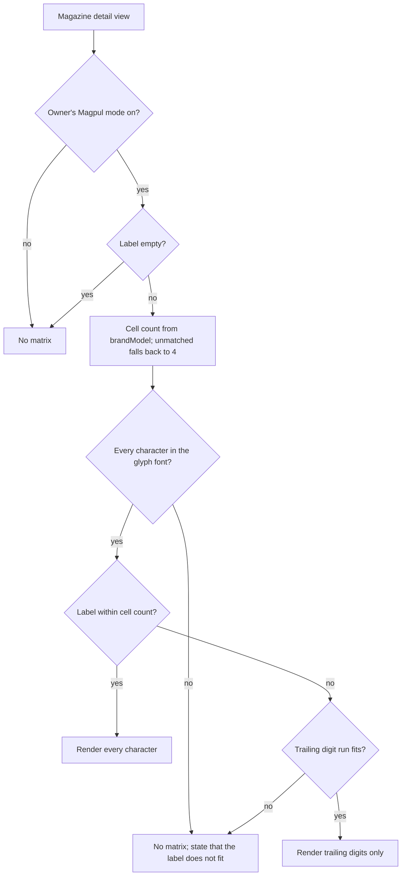
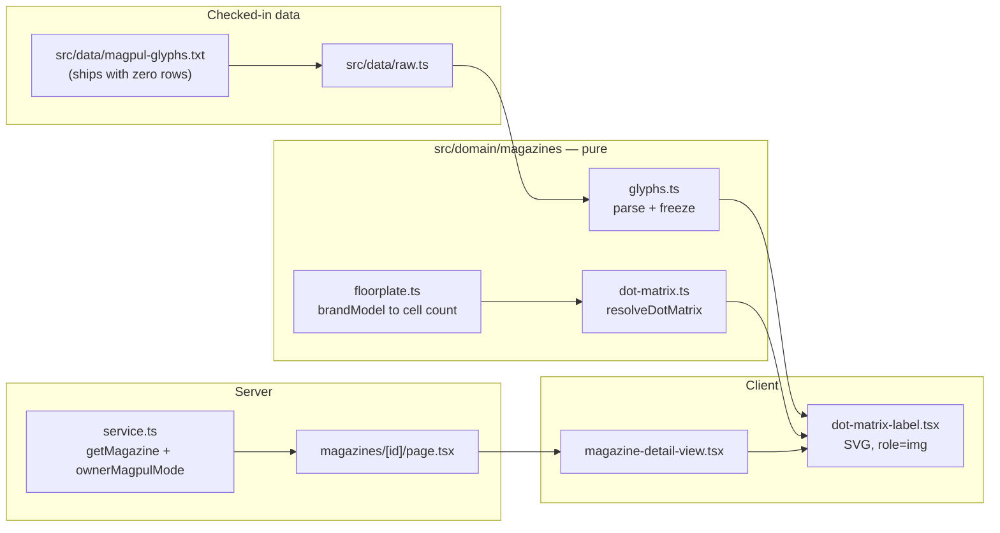

# Magazine Dot-Matrix Label Rendering - Plan

## Goal Capsule

- **Objective:** Render a magazine's `label` in the detail view as Magpul PMAG dot-matrix glyphs, so an owner can copy the mark onto a floorplate with a paint pen and recognize a painted magazine from its record. Resolves GitHub issue #20.
- **Product authority:** Owner (`unclesp1d3r`), via brainstorm. Decisions below are pinned unless planning surfaces a conflict.
- **Ships dark.** The authoritative glyph patterns have not been transcribed from Magpul's diagram, and the model-to-cell-count list covers only the two seed families R5 names. This plan builds the whole machinery against an empty glyph table, which suppresses the matrix (KTD3) — so merging it changes nothing an owner sees. Transcribing `src/data/magpul-glyphs.txt` and extending the model list are follow-ups that turn the feature on; both are data-only *if* the transcription confirms R2's 3-column cell, which the Dependencies section flags as unverified.
- **Stop conditions:** Stop and surface a blocker if the owner's `magpulMode` cannot be resolved server-side without a second round trip, or if `--muted-foreground` fails the 3:1 contrast assertion in U5 (that would mean a token was retuned since planning and R15 needs a new token, which is a product-visible choice).
- **Tail ownership:** The caller owns branch, commit, and PR. Do not open a PR from inside implementation.

---

## Product Contract

### Summary

The magazine detail view renders `label` as Magpul PMAG Gen M3 dot-matrix glyphs — one 3x5 dot cell per character, painted dots solid against faint unpainted positions. How many cells are drawn is derived from the magazine's `brandModel`. When a label is longer than that magazine's floorplate holds, only its trailing digits render.

### Problem Frame

A PMAG Gen M3 floorplate carries a molded dot matrix, and Magpul publishes a diagram mapping each character to a dot pattern. Owners paint those dots to mark a short identifier on each magazine. `magazine.label` is that identifier, and the #22 prefix feature already shapes it as `PREFIX + number` (e.g. `US04`) precisely so it can be painted.

Today both the detail view and the list row show `label` as plain monospace text. An owner holding a paint pen has to translate characters into dot patterns from a separate PDF, and an owner holding an already-painted magazine has to translate the other way to find its record.

Floorplate capacity is not uniform. A 7.62x51 PMAG carries 4 dot cells; a GL9 carries 2. Nothing in the schema distinguishes them — `brandModel` and `caliber` are both free text, and unlike `firearm`, the `magazine` table has no type taxonomy or CHECK constraint on model. So the number of cells a given magazine can hold is not currently derivable from stored data.

### Key Decisions

- **Render-only; input rules are untouched.** The matrix truncates what it draws; the stored label is never altered, shortened, or re-validated. The shipped #21 validator, the form input mask, and #22's auto-numbering all stay exactly as they are. Governs R6, R7, R8, R9.
- **Cell count is derived from `brandModel`.** Chosen over ignoring floorplate variation and over storing an explicit per-magazine cell count, both of which were weighed. Governs R3, R4.
- **An unrecognized model falls back to 4 cells, shown as unverified.** Rendering nothing would disable the feature for every model absent from a deliberately small list, but a silent 4-cell mark is confidently wrong guidance for a permanent painted mark on a smaller floorplate. Marking the fallback unverified keeps the feature useful and puts the uncertainty where the owner acts on it. This is why R5's list carries known 4-cell models rather than only the models that differ: without them a genuinely 4-cell magazine could never be a match, so the caveat would fire on the common case and stop carrying any signal. Governs R4.
- **An over-long label renders its number component only.** The prefix is what an owner drops when the floorplate is short; the number is what distinguishes one magazine from the next. Because numbering runs per prefix, this makes a short-floorplate mark unique within a prefix but not across the whole inventory — `US04` and `EU04` both paint `04`. Accepted as a limitation of the hardware rather than designed around. Governs R8.
- **A label that cannot be represented renders nothing and says so.** Chosen over truncating to leading or trailing characters, either of which would paint a mark that is not the magazine's label. Governs R9.
- **Unpainted dot positions stay visible.** Weighed against drawing painted dots alone and against outlining each character cell. Showing the whole cell is what helps while aiming a paint pen. Governs R11.
- **Rendering the glyphs, rather than linking Magpul's diagram beside the label.** A link is far cheaper and carries none of the matching or transcription risk, but leaves the owner doing the character-to-dot translation by hand in both directions — which is the friction this feature exists to remove. This release removes that friction in the painting direction only. Recognizing an unidentified painted magazine still means opening records one at a time, because the list-row glyph that would let an owner scan for a matching pattern is deferred. Governs R1, R2, R14.
- **A floorplate's cell count means one face.** A magazine that carries a matrix on both faces is marked with the same characters twice, not with one mark split across the two sides — a mark you have to turn the magazine over to finish reading defeats the at-a-glance recognition this feature is for. This matters only where a single face holds fewer than 4 cells, since #21 caps labels at 4 characters and no floorplate of 4 or more is ever the binding constraint. Governs R3, R5. (session-settled: user-directed)
- **The model-to-cell-count list is built in and not owner-editable.** Keeps the surface small; an owner whose model is missing gets the 4-cell fallback rather than a management UI. Governs R5. (session-settled: user-directed)

### Requirements

**Glyph font**

- R1. The glyph font covers `0`-`9`, `A`-`Z`, and hyphen, one glyph per character, transcribed from Magpul's published PMAG Gen M3 dot-matrix diagram.
- R2. Each glyph occupies a fixed dot cell of 3 columns by 5 rows. A hyphen occupies one cell like any other glyph.

**Cell count**

- R3. The number of dot cells drawn for a magazine is derived from its `brandModel`.
- R4. A `brandModel` matching no known entry falls back to 4 cells, and the view states that the model was not recognized and the owner should confirm their floorplate holds 4 cells before painting.
- R5. The model-to-cell-count mapping is a built-in list; owners cannot add to or edit it. A model earns an entry whatever its count, including models that hold 4, so that a match means a confirmed cell count rather than one defaulted by R4. The list starts with the GL9 family at 2 cells and the 7.62x51 PMAG family at 4.

**What renders**

- R6. The matrix renders only when the magazine owner's Magpul mode is on, per R10 of `docs/plans/2026-07-01-001-feat-magpul-mode-label-constraint-plan.md`.
- R7. When the label's length is within the magazine's cell count, every character renders as its glyph.
- R8. When the label exceeds the cell count, only its trailing run of digits renders.
- R9. When the label cannot be represented, no matrix renders and the view states that the label does not fit this magazine's floorplate. A label cannot be represented when it contains a character absent from the glyph font, or when it exceeds the cell count and its trailing digit run is absent or itself exceeds the cell count. When the cell count came from R4's unrecognized-model fallback rather than a matched entry, the message also states that the cell count is unverified, so the owner can tell a true overflow from one inferred off a guessed capacity.
- R10. An empty label renders no matrix and no placeholder grid.

**Presentation and accessibility**

- R11. Painted dots render solid; unpainted dot positions within each cell render faint but visible.
- R12. The matrix is theme-aware in both light and dark themes, using the app's existing tokens.
- R13. The matrix carries an accessible text alternative naming the characters actually drawn, and the `label` remains present in the detail view as readable text. The alternative is phrased so it reads as the pattern to paint rather than as a second copy of the label or a truncation error, since the two differ whenever R8 drops a prefix. Targeted via ARIA roles and accessible names, no `data-testid`.
- R14. The matrix appears in the magazine detail view only.
- R15. Painted dots and unpainted dot positions each meet a 3:1 non-text contrast ratio (WCAG 1.4.11) against the surface behind them, in both themes, and remain visually distinct from one another.

### Acceptance Examples

- AE1. **Covers R3, R7.** Magpul mode on; a 4-cell PMAG labeled `US04` renders four glyphs: `U`, `S`, `0`, `4`.
- AE2. **Covers R3, R8.** Magpul mode on; a 2-cell GL9 labeled `US04` renders two glyphs: `0`, `4`. The prefix is not drawn.
- AE3. **Covers R4, R7.** Magpul mode on; a magazine whose `brandModel` matches no entry, labeled `AR12`, renders four glyphs alongside a statement that the model was not recognized and the floorplate should be confirmed before painting.
- AE4. **Covers R9.** Magpul mode on; a 2-cell GL9 whose stored label is `AR-X` renders no matrix and states that the label does not fit this magazine's floorplate.
- AE5. **Covers R9.** Magpul mode on; a 4-cell PMAG whose stored label is `A.1` (a pre-existing label containing an unsupported character) renders no matrix and states that the label does not fit.
- AE6. **Covers R6.** Magpul mode off; no matrix renders, whatever the label contains.
- AE7. **Covers R10.** Magpul mode on; a magazine with an empty label renders no matrix.
- AE8. **Covers R8, R13.** A 2-cell GL9 labeled `US04` exposes an accessible alternative naming `04` as the pattern to paint, distinguishable from the stored label rather than reading as a bare duplicate of it, and the detail view still shows `US04` as text.
- AE9. **Covers R9.** Magpul mode on; a 2-cell GL9 labeled `1234` renders no matrix and states that the label does not fit this magazine's floorplate. The trailing digit run is the whole label and still exceeds the cell count.

### Scope Boundaries

#### Deferred for later

- The inline dot-matrix glyph on the magazine list row — readability at that size is judged after the detail view ships.
- A print or export of the pattern as a paint-pen guide.
- An owner-editable model-to-cell-count list, or any UI for correcting an unrecognized model.

#### Out of scope

- Any change to label input rules: character set, maximum length, validation, or the form input mask. Those are owned by #21 and stay as shipped.
- Any change to #22's prefix auto-numbering. Because cell count never constrains input, numbering is unaffected.
- Any schema change. This is presentation over the existing `label`.
- Floorplate variants that use a glyph font other than the PMAG Gen M3 matrix. Variants differing only in cell count are covered by R3.

#### Deferred to follow-up work

- **Transcribing the glyph table** into `src/data/magpul-glyphs.txt`. Data-only *provided the diagram confirms a 3-column cell*; a 4-column font instead forces rework of U1's row format, the `GlyphCell` type, and KTD6's geometry. Confirm the column count first.
- **Extending the model-to-cell-count list** in `src/domain/magazines/floorplate.ts` beyond the two seed families. Data-only.
- **E2E assertions on a rendered matrix.** Until the glyph table has rows, no matrix can render in a real browser, so U7 covers the suppressed state. The rendering assertions land with the transcription.

### Dependencies / Assumptions

- **Blocking prerequisite: the transcribed glyph table.** The dot patterns for R1 exist only in Magpul's diagram (`https://magpul.com/media/wysiwyg/Instructions/Magpul_Dot_Matrix.pdf`). The owner transcribes them into a checked-in fixture, which becomes the source of truth. Before the fixture is treated as authoritative it is cross-checked against the community matrix reference listed in Sources, with any discrepancy resolved against the Magpul PDF. This blocks the *feature being visible*, not this plan's implementation — see KTD2 and KTD3.
- **Blocking prerequisite: cell counts, sourced separately.** The Magpul PDF carries only the character font, not per-model floorplate capacity, so R5's list cannot be derived from it. Counts come from counting dot cells on physical floorplates or from a per-model source, and are needed for common 4-cell models as much as for the ones that differ — an unlisted 4-cell model still renders under R4's fallback caveat. An entry taken from a published per-model source is cross-checked against a second independent source before it is treated as authoritative, mirroring the glyph-table cross-check above; a count taken by counting dot cells on the physical floorplate is authoritative on its own. A wrong count on a matched model is worse than an unrecognized one, because R4's unverified caveat attaches only to models that miss the list — a miscounted entry renders as though it were confirmed.
- **Depends on #21 (shipped) and needs new read-path wiring.** Reuses the per-account `magpulMode` flag and the shared constants in `src/domain/magazines/constants.ts`. R6 keys on the magazine **owner's** flag, but `app/(app)/magazines/[id]/page.tsx` currently passes the *viewer's* session flag under the same `magpulMode` name; resolving the owner's flag is a new server-side lookup, not reuse of the existing prop.
- **Grid dimensions are asserted, not verified.** R2's 3x5 follows the shipped #21 plan; issue #20 describes "approximately 4 columns x 5 rows". The transcription settles it, and R2 is corrected if the diagram disagrees. If it comes back 4 columns wide, the transcription is **not** a data-only change: U1's row-width format, the `GlyphCell` type, and KTD6's geometry all assume 3 columns, and a fourth column widens the 4-cell matrix past the viewport budget KTD6 sizes to. Confirming the column count before transcribing the full font is the cheap way to avoid that rework.
- **A trailing digit run that still overflows is treated as unrepresentable** (R9) rather than truncated further. This is reachable by ordinary input, not only by pre-existing labels: #21's length cap is a flat 4 characters and is not scoped per floorplate, so a freshly entered all-digit label such as `1234` on a 2-cell GL9 has a trailing digit run longer than the magazine's cell count.
- **Matching is against a normalized `brandModel`.** Exact normalization and matching are planning decisions — see KTD4. A miss is not harmless — it produces a 4-cell render for a magazine that may hold fewer — which is why R4 marks the fallback unverified rather than presenting it as known.

### Sources / Research

- GitHub issue #20, and the owner's comment recording that cell count varies by magazine type.
- Magpul Dot Matrix Diagram (authoritative glyph source): `https://magpul.com/media/wysiwyg/Instructions/Magpul_Dot_Matrix.pdf`
- Community PMAG M3 matrix reference: `https://www.ar15.com/media/viewFile.html?i=36785`
- `src/domain/magazines/constants.ts` — `MAX_LABEL_LENGTH` (4), `MAGPUL_LABEL_ALLOWED_RE`, `MAGPUL_LABEL_DISALLOWED_CHAR_RE`, `normalizeMagpulLabel`. Its doc comment already names #20 as a future consumer.
- `src/db/auth-schema.ts` — the `magpulMode` column, surfaced through Better Auth `additionalFields`.
- `src/db/inventory-schema.ts` — the `magazine` table; `brandModel` and `caliber` are free text with no model taxonomy or CHECK.
- `app/(app)/magazines/magazine-detail-view.tsx` — renders `label` as monospace text today.
- `app/(app)/magazines/magazines-view.tsx` — renders `label` as monospace text in the list row.
- `docs/plans/2026-07-01-001-feat-magpul-mode-label-constraint-plan.md` — R10 (no rendering when mode is off), R11 (stored nonconforming labels preserved verbatim).
- `docs/plans/2026-07-03-002-feat-magazine-label-prefix-numbering-plan.md` — the `PREFIX + number` label shape this feature paints.
- `docs/adr/0007-magpul-constraint-domain-layer-not-db.md`, `docs/adr/0008-magpul-mode-better-auth-additional-field.md`.
- W3C, *Understanding SC 1.4.11 Non-text Contrast* — the "required to understand what the graphic is conveying" test, and the radio-button precedent that object *states* need contrast against their own background, not against each other. Shapes KTD5.
- `docs/solutions/runtime-errors/tanstack-autoreset-render-loop-unstable-data.md` — freshly-built arrays passed to memoized children break under this repo's `reactCompiler: true`. Shapes KTD9.
- `docs/solutions/best-practices/prefix-collision-safe-token-renaming.md` — Tailwind v4 silently no-ops unknown utility classes, so a wrong token name produces no error. Shapes the U5 contrast test.
- `docs/solutions/test-failures/bun-test-misloads-playwright-e2e-specs.md` — never run bare `bun test`.

---

## Planning Contract

**Product Contract preservation:** unchanged. No R was added, split, reworded, or renumbered; the two settled Key Decisions gained a `(session-settled: user-directed)` provenance annotation and nothing else. One planning-level gate (KTD3) narrows *when* the matrix renders while the glyph table is empty; it is a no-op once the table has rows and alters no R.

### Key Technical Decisions

- KTD1. **Render as inline SVG, one `<circle>` per dot.** Chosen over a CSS grid of rounded `div`s and over canvas. SVG gives a single accessible-name attachment point — `role="img"` prunes the SVG's children from the accessibility tree, so ~60 dots need no per-dot `aria-hidden` — plus proportional scaling from one `viewBox` and `fill` that reads theme custom properties through the normal cascade. Canvas is invisible to assistive tech without hand-built fallback DOM and needs manual `devicePixelRatio` redraw. The cost is more markup per dot; at 4 cells x 15 dots that is irrelevant. Governs R11, R13, R15.
- KTD2. **The glyph table and the cell-count list are arguments to the resolver, not imports inside it.** `resolveDotMatrix` takes the glyph table as a parameter; production wiring supplies the parsed file, tests supply a synthetic table. This is what makes the two blocking prerequisites block only the visible result: every rule in R7-R10 is fully testable today against a three-glyph fixture. Governs R1, R3, R5, R7, R8, R9.
- KTD3. **An empty glyph table suppresses the matrix entirely, exactly as Magpul mode off does.** Not an R9 "does not fit" — that message is about a label whose characters are missing from a *real* font, and firing it for every label while the table is untranscribed would tell owners their labels are wrong when the app simply has no font yet. This is the mechanism by which the feature ships dark. Governs R6, R9.
- KTD4. **`brandModel` matches by required-substring containment against an ordered list; first match wins.** Normalize by uppercasing and removing every character outside `A-Z0-9`, yielding one dense token (`"Magpul PMAG 17 GL9"` -> `MAGPULPMAG17GL9`). Each list entry carries the substrings a model must contain, keyed on a *distinctive Magpul model designation alone* (`["GL9"]` -> 2 cells) — never a brand token, and never a caliber. Requiring `PMAG` would reject the natural shorthand `Magpul GL9`, because `MAGPUL` does not contain the substring `PMAG` — and a miss there is not harmless, since it drops an unambiguous 2-cell magazine to the unverified 4-cell fallback. A caliber token is banned for the opposite failure direction: caliber is brand-agnostic, so a bare `762X51` token matches any manufacturer's magazine carrying that caliber, not just Magpul's — a code review caught `"PTR-91 7.62X51"` (a PTR magazine, no PMAG floorplate) resolving as a *confirmed* 4-cell match under an earlier draft that included such a token. Both directions matter: a brand token under-matches Magpul's own shorthand naming, and a caliber token over-matches every other brand that happens to share the round. Exact matching cannot work on free text, and a regex-per-entry list is harder to audit than a token set. Order the list most-specific-first so a narrow family shadows a broad one. The counts stored in the list are per-face, per the Product Contract's one-face Key Decision (Governs R3, R5). Governs R3, R4, R5.
- KTD5. **Painted dots use `--foreground`; unpainted dots use `--muted-foreground`.** Measured against `--card` in `app/globals.css`: `--border` fails R15's 3:1 floor in both themes (1.26:1 dark, 1.40:1 light) despite being the repo's "faint but present" token, while `--muted-foreground` clears it (5.32:1 dark, 5.15:1 light). The anodized-orange accent was considered — `CONCEPTS.md` gives it the "active / lit / marked" semantic — and rejected because the accent marks interactive state, and a painted dot is static content the owner copies in black ink. **R15's "visually distinct from one another" clause rests on radius, not on colour contrast between the two tokens.** Painted-against-unpainted measures 2.67:1 in the dark theme and 3.30:1 in light — enough to tell apart, but too little headroom in dark to make a colour threshold the guarantee. KTD6's smaller unpainted dot carries the distinction instead, and it survives any future retune of either token. Governs R11, R12, R15.
- KTD6. **Fixed dot geometry, no responsive scaling: 16px pitch, 10px painted diameter, 6px unpainted diameter, 16px gap between cells.** A 4-cell matrix is then 216 x 74 px. The budget it has to fit is 248px: a 320px viewport, less the app shell's horizontal padding, less the 20px-per-side `p-5` on the `Card` in `components/ui/surface.tsx`. The 32px of slack absorbs shell-padding variation. Published guidance for "minimum size to hand-transcribe a dot pattern" does not exist; the floor is derived from dot-peen marking practice (MIL-STD-130 sets ~2mm minimum human-readable character height for exactly this read-and-reproduce task) and from dot-matrix display convention, where dot diameter stays near half the pitch so adjacent lit dots read as discrete marks rather than merging. That yields a floor of roughly 6px diameter and 12-14px pitch; the painted dot sits above it and the unpainted dot sits at it, which is right for a positioning aid rather than the mark being traced. Fluid `vw` scaling is rejected because a component inside a narrow card can breach the floor even on a wide viewport. Governs R11, R15; resolves the deferred minimum-dot-size question.
- KTD7. **The owner's `magpulMode` is resolved by extending `getMagazine`'s return, not by a second call from the page.** The page cannot join a separate owner lookup into its existing `Promise.all` because `ownerId` only exists after `getMagazine` resolves; extending the return keeps one round-trip shape and is additive for existing destructuring callers. Mirrors the write-path lookup already in `src/domain/magazines/service.ts`. Governs R6.
- KTD8. **Copy is defined here, once, and imported.** The accessible alternative names the cell count alongside the characters — `Dot pattern to paint on a 2-cell floorplate: 0 4` — spaced characters, prefixed so it cannot be mistaken for a duplicate of the label or a truncation error, and carrying the cell count because that is the context a sighted owner reads off the magazine in their hand and a screen-reader user otherwise has no way to recover when R8 drops a prefix (R13). The unrecognized-model caveat reads `Model not recognized — confirm this floorplate has 4 dot cells before painting.` (R4). The overflow message reads `This label does not fit this magazine's floorplate.`, extended with `The model was not recognized, so the 4-cell count is unverified.` when the count came from the fallback (R9). Governs R4, R9, R13.
- KTD9. **Resolution runs in the client component inside a `useMemo` keyed on primitives.** Chosen to keep `resolveDotMatrix` a pure call co-located with the only thing that consumes it, rather than threading a resolved result across the RSC boundary for no gain — the parsed table is under a kilobyte, and freshness is not the differentiator, since `magazine-detail-view.tsx` already calls `router.refresh()` on save, which would re-run a server-side resolution just as promptly. This repo runs `reactCompiler: true`, where a freshly-built array handed to a memoized child renders stale — so the memo is keyed on `label`, `brandModel`, and `ownerMagpulMode` (primitives), never on a parent-owned object. Governs R11, R14.

### High-Level Technical Design

Four new modules and one changed read path. Everything left of the client boundary is pure and has no React or DB dependency, matching the `Pure — no DB, no React` convention already carried by `src/domain/magazines/validate.ts` and `display.ts`.

`resolveDotMatrix` returns a discriminated union so the component branches once and every R6-R10 outcome is a named case rather than a chain of nullable fields:

| Case | Meaning | Rs |
|---|---|---|
| `hidden` | Owner's mode off, label empty, or glyph table empty | R6, R10, KTD3 |
| `matrix` | Renderable; carries drawn characters, cells, cell count, and whether the count was verified | R7, R8, R4 |
| `unrepresentable` | Carries cell count and whether it was verified, so the caller picks the R9 wording | R9 |

### Assumptions

- The `magpul-mode` Playwright persona is reusable for U7 without new seed data. Its key is declared in `e2e/fixtures/user-pool.ts` (`SPEC_USER_KEYS`) and its `magpulMode` flag is enabled in `e2e/start-test-server.ts`; `e2e/fixtures/auth.ts` supplies only the generic `authTest()` helper. `e2e/magpul-mode.spec.ts` is the working usage example.
- Adding a field to `getMagazine`'s returned object breaks no caller. The only production call site is `app/(app)/magazines/[id]/page.tsx`, which destructures `{ magazine, permission }`. U4 re-audits rather than assuming.
- The glyph file parses at module load. A malformed transcription is a startup failure, not a silent partial font — U1's test over the shipped file makes that failure land in CI on the transcription PR rather than in production.

### Sequencing

U1, U2, and U4 are independent and can land in any order. U3 needs U1 and U2 for its types. U5 needs U1 for the cell shape and U3 for `resolveDotMatrix` and the `DotMatrixResult` type. U6 needs U3, U4, and U5. U7 needs U6.

---

## Implementation Units

### U1. Glyph table fixture and loader

**Goal:** A checked-in, hand-editable glyph source and a parsed, frozen lookup exposed to the domain layer — shipping with zero glyph rows until the transcription lands.

**Requirements:** R1, R2. Implements KTD2, KTD3.

**Dependencies:** none.

**Files:**
- `src/data/magpul-glyphs.txt` (new) — header comment explaining the format and the transcription source; zero glyph rows.
- `src/data/raw.ts` (modify) — add `MAGPUL_GLYPHS_RAW` alongside `CALIBERS_RAW` and `MANUFACTURERS_RAW`, following the existing embed-as-template-string convention.
- `src/domain/magazines/glyphs.ts` (new) — `GlyphCell` type, `GlyphTable` type, `parseGlyphTable(raw: string): GlyphTable`, and a module-level frozen `MAGPUL_GLYPHS` parsed once from `MAGPUL_GLYPHS_RAW`.
- `src/domain/magazines/__tests__/glyphs.test.ts` (new).

**Approach:**

1. Define the file format as one glyph per line: the character, then five space-separated 3-character rows using `#` for a painted dot and `.` for an unpainted position — e.g. `4 #.# #.# ### ..# ..#`. One line per glyph keeps the file greppable and gives a readable diff when the owner transcribes a correction.
2. Lines that are blank or begin with `#` at column zero are comments. The leading-`#` comment marker cannot collide with a glyph row, because a glyph row's first field is a single character followed by a space.
3. `parseGlyphTable` throws on a malformed row — wrong row count, wrong row width, a character outside `#.`, or a duplicate glyph character. Fail loudly at module load; a silently-dropped glyph would surface later as a spurious R9 "does not fit".
4. Empty input yields an empty table. This is a valid state, not an error — it is how the feature ships dark (KTD3).

**Patterns to follow:** `src/data/raw.ts` and `src/domain/reference/reference.ts` — raw text embedded as a module constant so loading needs no filesystem access in the Next bundle, standalone output, or Docker; parsed once into a module-level cache. Note that `reference.ts` protects its cache by returning a fresh copy per call rather than by `Object.freeze`, and a shallow freeze would not protect a glyph cell's nested row arrays anyway; mirror the existing approach rather than adding a runtime freeze. Carry the `Pure — no DB, no React` doc-comment banner used by `src/domain/magazines/validate.ts`.

**Test scenarios:**
- Parses a well-formed three-glyph table into a lookup keyed by character, with each cell holding five rows of three booleans.
- Throws when a glyph row has four columns instead of three.
- Throws when a glyph declares four rows instead of five.
- Throws when a row contains a character other than `#` or `.`.
- Throws when the same glyph character is declared twice.
- Returns an empty table for input that is entirely comments and blank lines.
- The shipped `src/data/magpul-glyphs.txt` parses without throwing. This is the guard that makes a bad future transcription fail CI.

**Verification:** `bun run test` passes; `MAGPUL_GLYPHS` is empty and importing it does not throw.

---

### U2. Floorplate cell-count lookup

**Goal:** Resolve a free-text `brandModel` to a per-face cell count, reporting whether the count was matched or defaulted.

**Requirements:** R3, R4, R5. Implements KTD4.

**Dependencies:** none.

**Files:**
- `src/domain/magazines/floorplate.ts` (new) — `FALLBACK_CELL_COUNT`, the ordered `MODEL_CELL_COUNTS` list, `normalizeModel`, and `resolveCellCount(brandModel): { cells: number; matched: boolean }`.
- `src/domain/magazines/__tests__/floorplate.test.ts` (new).

**Approach:**

1. `normalizeModel` uppercases and strips every character outside `A-Z0-9`, producing one dense token.
2. Each list entry is `{ name, tokens: readonly string[], cells }`. An entry matches when the normalized model contains every one of its tokens. First match wins, so the list is ordered most-specific-first.
3. Seed the list with the two families R5 names, keyed on a distinctive Magpul model designation alone (KTD4): the GL9 family at 2 cells (`["GL9"]`), and the 7.62x51 PMAG family at 4 cells via `["LRSR"]` for Magpul's `PMAG 20 LR/SR GEN M3` naming. Do not add a `PMAG` token to any entry — `MAGPUL` does not contain the substring `PMAG`, so requiring it would reject `Magpul GL9`. Do not add a caliber-only token (e.g. a bare `762X51`) either — caliber is brand-agnostic, so it would also match a non-Magpul magazine that happens to carry that caliber and confirm a PMAG cell count for a floorplate with no PMAG dot matrix at all. Add a comment recording that the list is expected to grow as counts are sourced, and that a wrong count is worse than a missing one because a matched entry carries no caveat.
4. An empty or whitespace-only `brandModel` returns the fallback with `matched: false` — never an error.

**Patterns to follow:** `src/domain/firearms/constants.ts` — `as const` lists plus `isX`/`xLabel` helpers, documented as evolving through code rather than a UI. Same file shape, same doc-comment style.

**Test scenarios:**
- `"Magpul PMAG 17 GL9"` resolves to 2 cells, matched.
- `"magpul pmag 15 gl9"` resolves to 2 cells, matched — normalization is case-insensitive.
- `"Magpul GL9"` resolves to 2 cells, matched. This is the shorthand a `PMAG`-requiring token set would have silently dropped to the 4-cell fallback, and it is the regression this unit most needs guarded.
- `"Magpul PMAG 20 LR/SR GEN M3"` resolves to 4 cells, matched — a 4-cell model is a *match*, not a fallback, which is the whole point of R5 carrying 4-cell entries.
- `"Magpul PMAG 25 7.62x51"` has no `LR/SR` marker in its model string, so it falls through to the 4-cell *unmatched* fallback rather than a caliber-only match — there is no caliber entry to match against.
- `"PTR-91 7.62X51"` and `"DPMS SR-25 7.62x51"` (non-Magpul magazines whose model strings happen to contain a caliber) resolve to the 4-cell unmatched fallback, never a confirmed match — the regression guard for the caliber-token collision KTD4 rules out.
- `"Some Unknown Brand 30rd"` resolves to 4 cells, unmatched.
- `""` and `"   "` resolve to 4 cells, unmatched, without throwing.
- A model containing punctuation and extra whitespace (`"Magpul  P-MAG   17  GL9"`) still matches the GL9 entry, proving normalization strips separators.
- Every entry in `MODEL_CELL_COUNTS` has at least one token and a positive cell count — a structural guard against a malformed future addition.

**Verification:** `bun run test` passes.

---

### U3. Label-to-matrix resolution

**Goal:** One pure function that turns a magazine's label, model, and owner mode into a rendering decision covering every R6-R10 outcome.

**Requirements:** R6, R7, R8, R9, R10. Implements KTD2, KTD3.

**Dependencies:** U1, U2.

**Files:**
- `src/domain/magazines/dot-matrix.ts` (new) — the `DotMatrixResult` discriminated union and `resolveDotMatrix(input)`.
- `src/domain/magazines/__tests__/dot-matrix.test.ts` (new).

**Approach:**

1. Signature takes `{ label, brandModel, ownerMagpulMode, glyphs }`. The glyph table is a parameter, not an import (KTD2), so the tests below run against a synthetic table today.
2. Resolve in the order the Product Contract's flowchart specifies: mode off -> `hidden`; empty label -> `hidden`; empty glyph table -> `hidden` (KTD3); then cell count via `resolveCellCount`; then font coverage; then length; then trailing-digit fallback.
3. Font coverage is checked against the *whole stored label* before truncation, per R9's first clause — a label containing an unsupported character is unrepresentable even when its trailing digits would have fit.
4. The trailing digit run is the maximal run of `0-9` at the end of the label. Absent, or longer than the cell count, yields `unrepresentable` (AE9) rather than a further truncation.
5. `matrix` and `unrepresentable` both carry `cellCount` and `cellCountVerified`, so the caller can compose R9's two-part wording without re-deriving anything.

**Patterns to follow:** `src/domain/magazines/validate.ts` — pure, exhaustively unit-tested, doc-comment banner, test comments citing the requirement or AE each case covers (`// covers AE2`).

**Test scenarios:**
- Covers AE6. Owner mode off returns `hidden`, whatever the label.
- Covers AE7. Empty label returns `hidden`.
- A label of only whitespace returns `hidden`.
- Covers KTD3. A non-empty label with an empty glyph table returns `hidden`, not `unrepresentable` — this is the ships-dark guarantee and the case most likely to regress.
- Covers AE1. `US04` on a 4-cell model returns `matrix` with drawn characters `U`,`S`,`0`,`4` and `cellCountVerified: true`.
- Covers AE2. `US04` on a 2-cell GL9 returns `matrix` with drawn characters `0`,`4`.
- Covers AE3. `AR12` on an unmatched model returns `matrix` with four characters and `cellCountVerified: false`.
- Covers AE4. `AR-X` on a 2-cell GL9 returns `unrepresentable` — the label is within the font but exceeds 2 cells and has no trailing digit run.
- Covers AE5. `A.1` returns `unrepresentable` because `.` is absent from the font, even on a 4-cell model where the length would have fit.
- Covers AE9. `1234` on a 2-cell GL9 returns `unrepresentable` — the trailing digit run is the whole label and still overflows.
- Combined case, no AE: an *unmatched* model whose label is unrepresentable returns `unrepresentable` with `cellCountVerified: false`, so U6 can add R9's "the 4-cell count is unverified" clause. R9 specifies this but no AE exercises it.
- A label exactly equal to the cell count renders every character — the boundary between R7 and R8.
- A label whose trailing digit run exactly equals the cell count renders that run — the boundary between R8 and R9.
- Lowercase characters in a pre-existing stored label are treated by whatever `normalizeMagpulLabel` in `src/domain/magazines/constants.ts` already does; assert the chosen behavior explicitly rather than leaving it implicit.

**Verification:** `bun run test` passes with every acceptance example above represented by a named test.

---

### U4. Owner-scoped Magpul mode on the detail read path

**Goal:** The detail page resolves the magazine *owner's* Magpul mode instead of the viewer's, and every consumer of that value moves with it.

**Requirements:** R6. Implements KTD7.

**Dependencies:** none.

**Files:**
- `src/domain/magazines/service.ts` (modify) — extend `getMagazine`'s return to `{ magazine, permission, ownerMagpulMode }`.
- `app/(app)/magazines/[id]/page.tsx` (modify) — pass the resolved owner flag instead of `user.magpulMode`.
- `app/(app)/magazines/magazine-detail-view.tsx` (modify) — rename the prop from `magpulMode` to `ownerMagpulMode`.
- `src/domain/magazines/__tests__/service.test.ts` (modify).

**Approach:**

1. In `getMagazine`, after the magazine row resolves, read the owner's flag with the same query already used on the write path — `select({ magpulMode: user.magpulMode }).from(user).where(eq(user.id, ownerId))`. Mirror the write path's loud failure: a missing owner row is corrupt state, not "mode off".
2. Rename the prop rather than silently repointing it. `magpulMode` -> `ownerMagpulMode` forces every call site to be visited, which is the point — the value's meaning changes and a silent repoint would leave the change invisible in review.
3. **The edit form's label mask moves to the same flag, and this changes no behavior today.** `MagazineDetailView` feeds the flag to the mask as well as to the matrix, and server-side validation in `createMagazine`/`updateMagazine` already keys on the owner's mode — but magazine editing is owner-only (`authorizeOwnerOnlyUpdate` in `src/auth/authorize.ts`, and `isOwner = permission === "owner"` gates the edit UI), so whenever the form renders, the viewer *is* the owner and the two flags are already equal. Repointing the mask is therefore inert, not a fix: it removes a latent divergence that would appear only if magazine editing later opened to edit-grantees. Because no mask behavior changes, this does not cross the Product Contract's "form input mask stays as shipped" boundary.
4. Audit every caller of `getMagazine` before changing its return type. There is one production call site today.

**Patterns to follow:** `src/domain/magazines/service.ts` lines ~115-124 and ~186-194 — the existing owner-`magpulMode` lookup, including its comment explaining why a missing row throws.

**Test scenarios:**
- `getMagazine` returns `ownerMagpulMode: true` for a magazine whose owner has the flag on, when read by that owner.
- Integration: a grantee with view permission reading a magazine whose **owner** has Magpul mode on receives `ownerMagpulMode: true` even though the grantee's own flag is off. This is the requirement, and the case the current code gets backwards.
- The inverse: owner's flag off, grantee's flag on, returns `false`.
- `getMagazine` still throws `NotFoundError` for a magazine the actor cannot see — the added query must not open a visibility hole.
- Existing `getMagazine` tests still pass unchanged, proving the return extension is additive.

Give each test its own owner via `src/test-support/factories.ts` rather than asserting over rows left by earlier tests.

**Verification:** `bun run test` passes; `bun run typecheck` passes, which is what proves every call site of the renamed prop was updated.

---

### U5. Dot-matrix tokens and the `DotMatrixLabel` component

**Goal:** An SVG component that draws a resolved matrix, theme-aware and accessible, with the contrast floor locked by a test.

**Requirements:** R11, R12, R13, R15. Implements KTD1, KTD5, KTD6, KTD9.

**Dependencies:** U1, U3.

**Files:**
- `app/globals.css` (modify) — add `--dot-painted` and `--dot-unpainted` to both the `[data-theme="dark"]` and `[data-theme="light"]` blocks, and bridge them in the existing `@theme inline` block.
- `app/(app)/magazines/dot-matrix-label.tsx` (new) — the presentational component.
- `src/domain/magazines/__tests__/dot-matrix-contrast.test.ts` (new) — the R15 guard.

**Approach:**

1. Define the two tokens as aliases of existing tokens rather than new colors: `--dot-painted: var(--foreground)` and `--dot-unpainted: var(--muted-foreground)` in each theme block (KTD5). Naming them separately means a future retune of the dot colors does not require touching text tokens, and the contrast test below has a stable name to assert against. Use the `[data-theme="..."]` attribute selectors this repo already uses — **not** `prefers-color-scheme`, which would bypass the `next-themes` toggle.
2. The component takes the `DotMatrixResult` `matrix` case and renders one `<svg>` with a `viewBox` sized from the cell count, `role="img"`, and `aria-label` built per KTD8. Do not set `aria-hidden` on individual circles; `role="img"` already prunes them.
3. Geometry constants per KTD6 — 16px pitch, 10px painted diameter, 6px unpainted diameter, 16px inter-cell gap — as named constants in the component file, not literals scattered through the JSX. The two diameters are what carry R15's "visually distinct from one another" clause, so a painted and an unpainted circle differ in radius as well as fill.
4. Drive fill from the tokens via Tailwind utilities generated by `@theme inline`. Because Tailwind v4 silently no-ops an unknown utility class, verify visually in both themes; nothing will error on a typo.
5. The component calls `resolveDotMatrix` inside a `useMemo` keyed on `label`, `brandModel`, and `ownerMagpulMode` (KTD9). Do not accept a pre-built cell array as a prop.

**Patterns to follow:** `components/ui/theme-toggle.tsx` and `app/(app)/firearms/[id]/firearm-photos.tsx` for descriptive, dynamic `aria-label` phrasing. Nothing in the repo renders a grid or uses `role="img"` today — this is the first, so keep it conventional rather than clever.

**Test scenarios:**
- Contrast guard: parse `app/globals.css`, extract `--foreground`, `--muted-foreground`, and `--card` for each theme block, compute the WCAG relative-luminance contrast ratio, and assert each dot token clears 3:1 against `--card` in both themes.
- The same test asserts `--dot-painted` and `--dot-unpainted` are declared in *both* theme blocks — a token present in only one theme is the exact failure Tailwind will not report.
- Assert the painted and unpainted dot diameters differ. This is the mechanical guard on R15's "visually distinct from one another" clause; do not assert a contrast ratio between the two tokens, which measures only 2.67:1 in the dark theme (KTD5).

**Test expectation for the component itself:** covered by U7's e2e, not by a component unit test. This repo has no component-test harness, and adding one for a single presentational component is not warranted; the domain logic it renders is already exhaustively covered by U3.

**Verification:** `bun run test` passes including the contrast guard; the component renders correctly in both themes at a 320px viewport width.

---

### U6. Detail-view integration and messaging

**Goal:** The magazine detail view shows the matrix, the R4 caveat, and the R9 messages in the right combinations, without disturbing the existing label text.

**Requirements:** R4, R9, R13, R14. Implements KTD8.

**Dependencies:** U3, U4, U5.

**Files:**
- `app/(app)/magazines/magazine-detail-view.tsx` (modify) — render the matrix near the existing `Label` `DetailRow`.
- `app/(app)/magazines/dot-matrix-label.tsx` (modify) — export the message strings, or add a small sibling module if the component file grows past the repo's file-size convention.

**Approach:**

1. Branch once on the `DotMatrixResult` kind. `hidden` renders nothing at all — no empty grid, no placeholder, no message (R10, KTD3).
2. `matrix` renders the SVG, plus the R4 caveat beneath it when `cellCountVerified` is false.
3. `unrepresentable` renders no SVG and the R9 message, extended with the unverified clause when `cellCountVerified` is false (KTD8).
4. The existing `label` `DetailRow` stays exactly as it is. R13 requires the label to remain readable text, and AE8 asserts both are present.
5. Render nothing on the list row — R14 scopes this to the detail view, and `app/(app)/magazines/magazines-view.tsx` is untouched.

**Patterns to follow:** the existing `DetailRow` usage in `magazine-detail-view.tsx`; `components/ui/detail-row.tsx` for the label/value shape.

**Test scenarios:** covered end-to-end in U7. The branching logic itself is a direct switch over U3's union, which U3's tests already cover exhaustively; duplicating them here as component tests would restate coverage without adding signal.

**Verification:** `bun run typecheck` and `bun run lint` pass; the detail view renders unchanged for a magazine whose owner has Magpul mode off.

---

### U7. End-to-end coverage

**Goal:** Prove in a real browser that the feature is wired correctly and inert while the glyph table is empty, and that the existing Magpul-mode flows still pass.

**Requirements:** R6, R13, R14.

**Dependencies:** U6.

**Files:**
- `e2e/magazine-dot-matrix.spec.ts` (new).

**Approach:**

Assert what is true with an empty glyph table — that is the shipped state, so these are real assertions, not placeholders. Write them so the transcription PR extends this file rather than rewriting it. Reuse the `magpul-mode` persona from `e2e/fixtures/auth.ts`. Select by ARIA role, accessible name, and visible text only; this repo forbids `data-testid`.

**Test scenarios:**
- A magazine detail page for an owner with Magpul mode on shows the label as text and exposes no `img`-role graphic named `Dot pattern to paint`, because the glyph table has no rows. This is the ships-dark guarantee, verified through the real render path.
- The same page renders without a console error and without horizontal overflow at a 320px viewport, asserted the way `e2e/responsive-overflow.spec.ts` already does it — a measured `document.documentElement.scrollWidth` against the viewport width, not a visual judgment. A prose assertion like "no layout break" is not implementable and passes trivially on an empty page.
- A magazine detail page for an owner with Magpul mode off is byte-for-byte unaffected by this feature.
- The existing `e2e/magpul-mode.spec.ts` suite still passes, proving U4's prop rename did not break the label input mask.

**Note on deferred coverage:** assertions on a *rendered* matrix — AE1 through AE9 in a browser — land with the glyph transcription, since no matrix can render before it. They are listed under Scope Boundaries as deferred follow-up work, not skipped tests. Do not add a skipped or conditionally-disabled spec for them.

**Verification:** `bun run test:e2e` passes. Never invoke bare `bun test` — it mis-loads Playwright specs and reports phantom failures.

---

## Verification Contract

**The gate:** `just ci-check` must pass before every commit. This is a hard project rule — no `--no-verify`, no skipping, no deferring a red gate to a follow-up.

| Command | Covers | Notes |
|---|---|---|
| `bun run lint` | Biome. Not ESLint or Prettier. | |
| `bun run typecheck` | `tsc --noEmit`. Proves U4's prop rename reached every call site. | |
| `bun run test` | Unit and integration (`bun:test`). | Requires Docker — Testcontainers starts an ephemeral migrated Postgres via `src/test-support/preload.ts`. |
| `bun run test:e2e` | Playwright, `e2e/`. | Requires Docker. |
| `just ci-check` | All of the above. | The commit gate. |

Never run bare `bun test`: it mis-loads the Playwright specs in `e2e/` and reports phantom failures that look like regressions in this feature.

Requirement-to-proof map:

- R1, R2 — U1's parser tests, plus the test that parses the shipped fixture.
- R3, R4, R5 — U2's lookup tests, including a 4-cell model resolving as *matched*. R4's **caveat wording** is not covered; no test in this plan renders it.
- R6 — U4's integration test where the grantee's flag and the owner's flag disagree.
- R7, R8, R9, R10 — U3's tests, one per acceptance example plus the boundary and combined cases. These prove the resolver's structured output. R9's **message wording** is not covered.
- R11, R12, R15 — U5's contrast guard over `app/globals.css`, in both themes, plus the differing-diameter assertion.
- R13 — **not verified by this plan.** U7 can only assert that no `img`-role graphic exists while the glyph table is empty; the accessible-name wording KTD8 specifies is verifiable only once a matrix can render, and lands with the transcription.
- R14 — verified structurally: `app/(app)/magazines/magazines-view.tsx` appears in no unit's Files list.

The three unverified items above are all message or accessible-name copy, and all become testable in the same follow-up that transcribes the glyph table. Do not read a green `just ci-check` as proof that R4's caveat, R9's message, or R13's alternative reads correctly.

---

## Definition of Done

Global:

- `just ci-check` passes.
- The glyph fixture ships with zero glyph rows, and a fresh detail-view render shows no matrix, no empty grid, and no caption for any magazine.
- No `data-testid` was added anywhere in the app.
- No test was skipped, disabled, or gated behind an environment variable. In particular, no `process.env.DATABASE_URL ? describe : describe.skip` idiom was reintroduced.
- Dead ends from abandoned approaches are removed from the diff, not left commented out.
- No schema migration was added — this feature is presentation over the existing `label`.

Per unit:

- U1 — `parseGlyphTable` throws on every malformed shape listed; the shipped fixture parses; `MAGPUL_GLYPHS` is empty.
- U2 — both seed families resolve as *matched*, and an unknown model resolves to 4 cells *unmatched*.
- U3 — every acceptance example AE1-AE9 has a named test, plus the unverified-and-unrepresentable combination and both R7/R8 and R8/R9 boundaries.
- U4 — `bun run typecheck` passes after the prop rename, and the owner-versus-viewer integration test passes in both directions.
- U5 — the contrast guard asserts ≥3:1 for both dot tokens against `--card` in both themes, fails if either token is missing from either theme block, and asserts the painted and unpainted diameters differ.
- U6 — the `hidden` case renders nothing; the existing label `DetailRow` is unchanged; `magazines-view.tsx` is untouched.
- U7 — the new spec passes and `e2e/magpul-mode.spec.ts` still passes.

---

## Deferred / Open Questions

### From 2026-08-02 review

- **No minimum dot size for a tracing-accuracy feature** — Requirements, presentation and accessibility (P2, design-lens, confidence 75). **Resolved in planning:** KTD6 fixes the geometry at 16px pitch / 10px painted diameter / 6px unpainted diameter / 16px inter-cell gap, above a 6px-diameter, 12-14px-pitch floor derived from dot-peen marking practice and dot-matrix display convention, and sized so the 4-cell case fits the detail card's real 248px content width at a 320px viewport. The width budget the finding flagged as depending on the one-face question is settled with it: one face means at most 4 cells, never eight.

### From 2026-08-02 planning review

- **Fixed geometry leaves desktop width unused** — Planning Contract, KTD6 (P2, design-lens, confidence 75)

  The matrix renders at the same 216x74 px on a 1440px display as on a phone, so the extra room a large screen offers does nothing for the tracing accuracy this feature exists to serve. KTD6's argument against fluid sizing only rules out scaling *down* past the legibility floor; it does not address a floor-anchored rule that grows upward and never shrinks. Deferred rather than resolved: a single fixed size is the simplest thing that is correct at every width, and growth can be added later without changing the resolver, the tokens, or any requirement. Revisit once the glyph transcription lands and there is a real matrix to judge at size.
