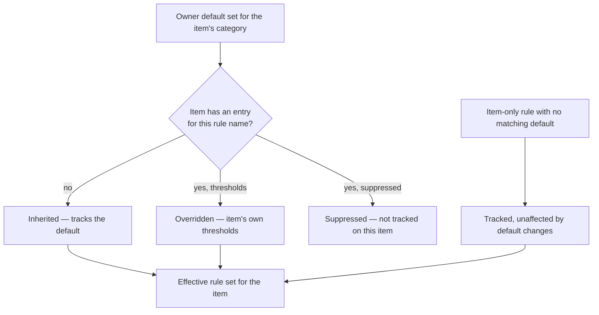
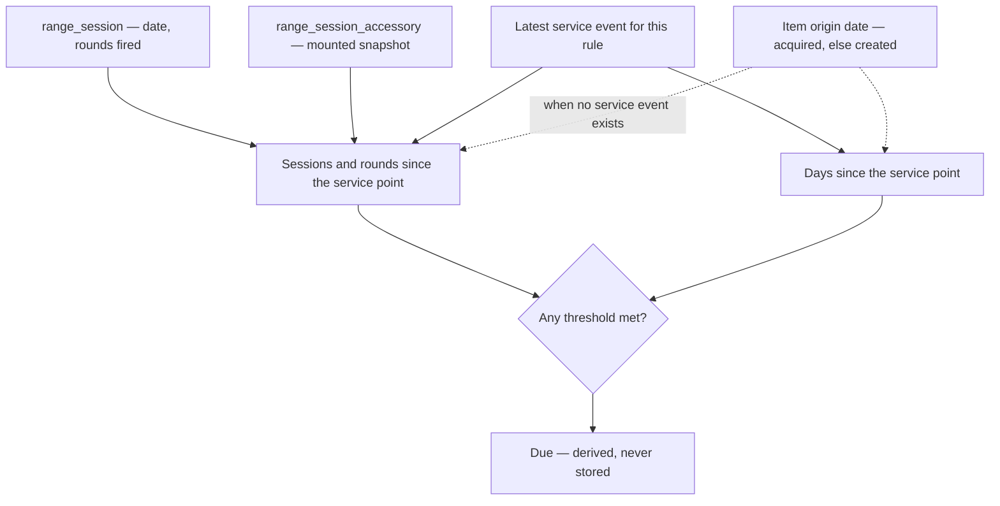
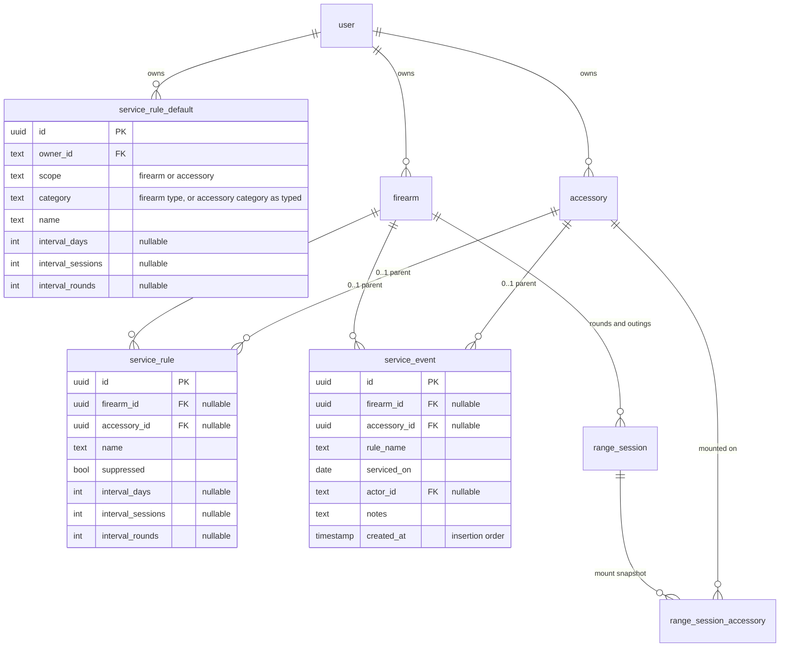
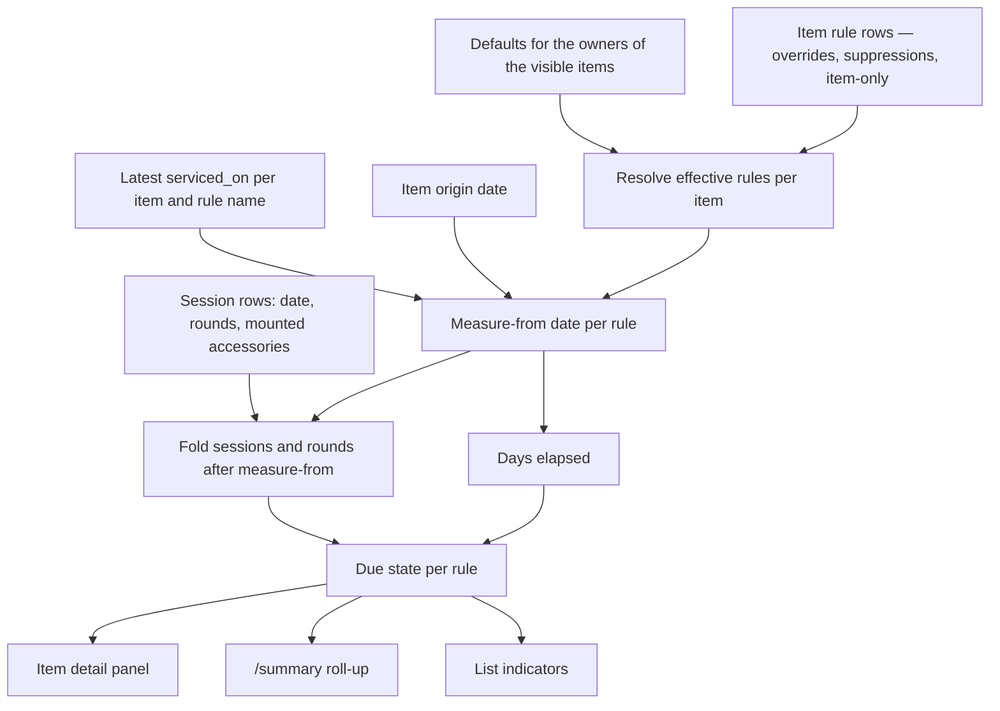

# Service Interval Tracking - Plan

## Goal Capsule

- **Objective:** Give firearms and accessories named service rules that come due on elapsed days, range sessions, or rounds fired, so an owner who currently services on symptom or on recall can see what needs attention. Resolves GitHub issue #10.
- **Product authority:** Owner (`unclesp1d3r`), via brainstorm. The Product Contract below is pinned; Key Technical Decisions own implementation mechanism within it.
- **Open blockers:** None. Every product decision is pinned and every planning question is answered by a Key Technical Decision.
- **Execution profile:** Work units in dependency order. Domain logic is test-first — the pure derivation in U2 is the correctness core and everything above it reads its output. Surfaces (U7–U9) follow the shipped detail-view patterns rather than inventing layout.
- **Stop conditions:** Stop and surface a blocker if the conversion in U5 would lose or duplicate an existing `cleaned`/`lubed` entry, or if a decision here contradicts a Product Contract requirement. Details the plan leaves open are the implementer's call.
- **Tail ownership:** The caller owns branch, commit, and PR. Do not open a PR from inside implementation.

---

## Product Contract

**Preservation note:** Product Contract requirements, key decisions, flows, and acceptance examples are unchanged. The four Deferred-to-Planning questions are resolved and removed — each is now answered by a Key Technical Decision (OQ1 → KTD3, OQ2 → KTD7, OQ3 → KTD6, OQ4 → KTD8). One assumption was added recording that accessories are not a grantable parent type.

### Summary

A firearm or accessory carries named service rules — Cleaning, Barrel, Recoil spring — each due on whichever comes first of elapsed days, range sessions, or rounds fired. Rules inherit live from per-category owner defaults and can be overridden, suppressed, or added one rule at a time. `cleaned` and `lubed` stop being standalone log events and become seeded rules, so there is one way to record service and existing entries become real service points. Every count and every due state is derived on read.

### Problem Frame

The owner services on symptom or on recall — when something stops working right, or when it happens to come to mind. That is not a gap in the record; it is a gap in the prompt. Nothing tells the owner that a rifle has accumulated rounds since it was last touched.

MagStacker already holds what the prompt needs. `range_session` records rounds fired per firearm per trip, and `range_session_accessory` snapshots which accessories were mounted on each one, so rounds and outings are already attributable down to the part. The inventory log already records `cleaned` and `lubed` against firearms with an actor and a timestamp.

None of it connects. A `cleaned` entry is a bare fact with no interval to measure against, so cleaning history accumulates without ever saying whether cleaning is due. The data that would answer the question and the record of the act sit one join apart and have never been introduced.

Firearms also have no acquired date — magazines and ammo both carry one, firearms do not — so the only date a firearm owns is when its record was typed in.

### Key Decisions

- KD1. **Multiple named rules per item.** A rifle needs cleaning, a barrel, and a recoil spring on three separate clocks, and one interval per item cannot express that. (session-settled: user-directed — chosen over one interval per item, and over modeling each part as a separate accessory.) Governs R1, R2.
- KD2. **Live per-rule inheritance from owner category defaults.** Raising the rifle barrel default reaches every rifle that has not overridden that specific rule; a frozen copy would strand them. (session-settled: user-directed — chosen over whole-set detach on first edit, and over apply-on-demand templates.) Governs R3, R4, R5.
- KD3. **Three axes, first to trip wins.** Days, range sessions, and rounds fired are all already derivable from logged data, so the third axis costs nothing to add. (session-settled: user-directed.) Governs R2, R7.
- KD4. **`cleaned` and `lubed` become seeded rules.** One verb for service means one entry, one history, and one vocabulary; keeping both would leave two ways to record a cleaning where only one moves the clock. (session-settled: user-directed — chosen over keeping the event types alongside service events, and over a separate service history.) Governs R13, R14, R15.
- KD5. **Nothing about service state is stored.** Last service point, elapsed counts, and due state are derived on read, matching Lifetime Total, Last Inventoried, and Low Stock. The issue's proposed `lastServicedAt` / `lastServicedRounds` columns are rejected. (session-settled: user-approved.) Governs R12.
- KD6. **Entry into MagStacker is day one.** With no service history to inherit, measurement starts at the item's origin date, which makes day-one totals large and honest rather than zeroed. (session-settled: user-directed.) Governs R10, R16.
- KD7. **Advisory only.** Service state informs and never gates; there is no enforcement, no nagging, and no compliance concept. (session-settled: user-directed.) Governs R21.
- KD8. **Binary due, and the roll-up lands on `/summary`.** A "due soon" tier and a dedicated maintenance view both add surface without adding signal at this size. (session-settled: user-approved.) Governs R11, R19.
- KD9. **Firearms gain an acquired date inside this plan.** It mirrors what magazines and ammo already carry, and it is what makes the day axis measure something real. (session-settled: user-directed.) Governs R22.
- KD10. **Accessory category defaults key on the category string as typed.** Accessory `category` stays free text, so two spellings of one category are two unrelated default sets and an accessory whose category matches no default simply inherits nothing. (session-settled: user-directed — chosen over per-item-only rules for accessories, and over converting category to a controlled list.) Governs R3.

### Requirements

**Service rules and inheritance**

- R1. A firearm or accessory carries zero or more named service rules, each tracking one maintenance concern.
- R2. A rule's name is unique within its item, and the rule sets at least one of three thresholds: elapsed days, range sessions, or rounds fired.
- R3. An owner defines a default rule set per category — firearm type for firearms, accessory category as typed for accessories. An item whose category matches no default set inherits no rules.
- R4. An item inherits its category's default rules live, so changing a default threshold reaches every item that has not overridden that rule.
- R5. Each inherited rule on an item is inherited, overridden with item-specific thresholds, or suppressed; an item may also carry item-only rules no default defines. Overrides reset to inherited and suppressions restore.
- R6. Rules and defaults belong to the item's owner, so a shared item's rules come from its owner's defaults rather than the viewer's.

**Due computation**

- R7. A rule is due when any threshold it sets is met or exceeded, measured since that rule's last service point.
- R8. Days elapse from the last service point's date; sessions and rounds count range sessions dated after it.
- R9. For an accessory, sessions and rounds count only the range sessions on which that accessory was recorded as mounted.
- R10. A rule with no service point measures from its item's origin date: the acquired date when set, otherwise the date the record was created.
- R11. Due state is binary. Distance past a threshold is shown as the raw counts, not as a separate severity level.
- R12. No service state is stored. Last service point, elapsed counts, and due state are derived on read.

**Service events and history**

- R13. `cleaned` and `lubed` stop being standalone inventory-log event types, and logging service against a rule becomes the single way to record either act.
- R14. A service event records one rule, the date it happened, the acting user, and optional notes, and sets that rule's last service point.
- R15. Existing `cleaned` and `lubed` entries convert to service events on seeded Cleaning and Lubrication rules, preserving their date, actor, and notes.
- R16. An owner can mark one or many items serviced as of a date in a single action, so the day-one backlog clears without visiting each item.
- R17. Each item shows its service history — every service event, newest first, naming the rule it serviced.

**Surfaces**

- R18. A firearm or accessory detail view lists its rules with thresholds, elapsed counts, inheritance state, and due state, and offers logging service against any of them.
- R19. `/summary` carries a service roll-up of due rules across the collection, beside the existing ammo low-stock roll-up.
- R20. Firearm and accessory list views indicate that an item has at least one due rule.
- R21. Service state is advisory: it never blocks creating, editing, sharing, or using a record, and raises no interruptions or confirmations.

**Supporting data**

- R22. A firearm carries an optional acquired date, nullable and editable, mirroring what magazines and ammo already hold.

### Key Flows

- F1. Arming the collection from settings
  - **Trigger:** Owner opens service-interval defaults with no rules configured anywhere.
  - **Steps:** Owner sets thresholds for a firearm type; every firearm of that type immediately resolves an inherited rule; the `/summary` roll-up and list indicators populate without touching any item.
  - **Outcome:** A collection-wide due picture from one settings edit.
  - **Covered by:** R3, R4, R10, R19, R20

- F2. Logging service
  - **Trigger:** Owner finishes cleaning a rifle and opens its detail view.
  - **Steps:** Owner logs service against the Cleaning rule with today's date and optional notes; that rule's counts reset to zero and its due state clears; the event joins the item's service history.
  - **Outcome:** One act, one entry, and every rule on the item still measured independently.
  - **Covered by:** R7, R14, R17, R18

- F3. Diverging one rule from its default
  - **Trigger:** One rifle needs a shorter barrel interval than the rifle default.
  - **Steps:** Owner overrides the Barrel rule on that item; its other inherited rules are untouched; a later change to the rifle barrel default leaves the override standing but still reaches every other rifle.
  - **Outcome:** Per-rule divergence without detaching the item from its category.
  - **Covered by:** R4, R5

### Acceptance Examples

- AE1. Inheritance survives an unrelated override
  - **Covers R4, R5.**
  - **Given:** The Rifle default set has Cleaning 500 rounds and Barrel 5000 rounds, and an AR-15 overrides Barrel to 4000.
  - **When:** The owner raises the Rifle Barrel default to 6000.
  - **Then:** The AR-15's Barrel rule stays at 4000, and its Cleaning rule still tracks the Rifle default.

- AE2. First threshold to trip wins
  - **Covers R2, R7.**
  - **Given:** A rule sets 180 days and 500 rounds, and its last service point was 20 days and 640 rounds ago.
  - **When:** Due state is computed.
  - **Then:** The rule is due, on rounds.

- AE3. Cold start counts from the origin date
  - **Covers R10.**
  - **Given:** A firearm has an acquired date, 1,400 rounds logged since, and no service event on its Cleaning rule.
  - **When:** Due state is computed against a 500-round threshold.
  - **Then:** The rule is due, with 1,400 rounds and the days since the acquired date shown as the elapsed counts.

- AE4. Accessory counts only its mounted sessions
  - **Covers R9.**
  - **Given:** A suppressor was recorded as mounted on two of a firearm's five range sessions since its last service point.
  - **When:** Its elapsed counts are computed.
  - **Then:** Only those two sessions and their rounds count, not the firearm's full total for the period.

- AE5. A suppressed rule does not surface
  - **Covers R5, R19, R20.**
  - **Given:** An item suppresses an inherited rule whose thresholds it would otherwise exceed.
  - **When:** The `/summary` roll-up and list indicators are computed.
  - **Then:** That rule appears nowhere, and the item is not marked due on its account.

- AE6. Converted history becomes a real service point
  - **Covers R15.**
  - **Given:** A firearm has a `cleaned` inventory-log entry from three months ago and none since.
  - **When:** The conversion runs and due state is computed against the Cleaning rule.
  - **Then:** The rule measures from that entry's date rather than the item's origin date, and the entry appears in service history as a Cleaning event.

### Scope Boundaries

**Deferred for later**

- Reminders that leave the app — push, email, or anything scheduled. No background job system exists to deliver them; this belongs to its own follow-up issue.
- A "due soon" tier or any severity gradation above binary due.
- Projecting when a rule *will* come due from usage rate.
- Service rules on magazines and ammo. Both are owned parents and could carry rules later; this plan covers firearms and accessories only.
- Parts, cost, or vendor tracking attached to a service event.
- An acquired date on accessories. Firearms get one (R22) because their day-axis cold start is the common case; accessories measure days from record creation, so an accessory owned for years but entered today reads as not-due on day one. Accepted for now — adding a second nullable acquired date and its form field doubles U6 for the smaller half of the feature.

**Outside this plan's identity**

- Any enforcement of service state. Nothing is blocked, gated, escalated, or scored on maintenance compliance. Per R21 this is a prompt, not a policy.

**Deferred to follow-up work**

- Converting accessory `category` to a controlled list, or offering the owner's previously-typed categories in the accessory *form* combobox. KTD8 covers only the defaults surface, which is where a blind-typed category silently costs the owner a default set.
- CSV export of service rules or events. The existing exports in `src/domain/csv/` cover inventory shape, not activity, and this plan adds no export surface.

### Dependencies / Assumptions

- Issue #11 (shot count tracking) and issue #8 (accessories tracker) are both shipped, so rounds, sessions, and mounted-accessory attribution are real data, not planned data.
- Issue #46 (inventory log) is shipped. This plan retires two of its three firearm event types (R13) and converts their existing rows (R15); `inventoried` and the Last Inventoried derivation are untouched.
- `range_session_accessory` rows are snapshotted when a session is created, so accessory attribution exists only for sessions created after #8 shipped. Accessory counts under-report against older sessions, and no backfill is possible.
- `service_event.serviced_on` is the calendar day the work happened; `service_event.created_at` is when the row was inserted. Both exist for the same reason `inventory_log` carries `occurred_at` and `created_at` — history sorts newest-first by `serviced_on`, then by `created_at` so several rules logged on one day have a stable order, and the R15 conversion has somewhere to carry the source row's insertion time.
- Accessory `category` is free text with suggestions only (`src/domain/accessories/constants.ts`), never validated; firearm type is a controlled list (`src/domain/firearms/constants.ts`). Per KD10 the accessory side relies on the owner typing categories consistently, which the existing combobox supports but does not enforce.
- An accessory's `installed_date` is cleared whenever the accessory is unmounted, enforced in the service layer and backed by a CHECK constraint, so it cannot serve as a stable origin date. R10 uses record creation for accessories.
- Accessories are not a grantable parent type — `ParentType` in `src/auth/visibility.ts` is `firearm | magazine | ammo`, and the `grant_parent_type_valid` CHECK matches. R6 is therefore only ever exercised by firearms; accessory rules, defaults, and service are owner-only in practice.
- A firearm whose `type` is still the backfill sentinel `unspecified` resolves defaults against that sentinel like any other category value. It inherits nothing unless the owner deliberately defines an `unspecified` default set.

### Sources / Research

- GitHub issue #10 — original scoping, including the Phase 1 / Phase 2 split this plan preserves.
- `src/db/inventory-schema.ts` — `inventory_log` (polymorphic parent, per-family event-type CHECK), `range_session`, `range_session_accessory`, `accessory`, `grant`, and the absence of an acquired date on `firearm`.
- `src/domain/inventory-log/constants.ts` — `FIREARM_LOG_EVENTS` / `MAGAZINE_LOG_EVENTS`, the single source the DB CHECK is generated from; R13 changes this file.
- `src/domain/inventory-log/last-inventoried.ts` — `loadLastInventoriedBatch`, the batched grouped-`max` shape the last-service-point loader mirrors.
- `src/domain/range-sessions/service.ts` — `lifetimeRoundTotals` and `accessoryRoundsFired`; the latter is the visible-firearm-scoped accessory attribution R9 depends on.
- `src/domain/summary/summary.ts` — `computeSummary`, the pure in-memory aggregation the due roll-up follows.
- `src/backup/table-order.ts` — every persistent table must be registered or it is silently dropped from backups; `src/backup/maintenance.ts` guards the coverage.
- `src/db/migrations/0008_brown_bulldozer.sql` — the hand-written polymorphic cleanup trigger this plan avoids needing (KTD2).
- `docs/solutions/test-failures/timezone-fragile-date-boundary-tests.md` — local-vs-UTC day-boundary drift; governs KTD5 and every date test in this plan.
- `docs/plans/2026-07-06-001-feat-inventory-log-plan.md` — the shipped inventory-log design this plan narrows.
- `docs/plans/2026-07-07-001-feat-accessories-tracker-plan.md` — the mount-snapshot design R9 depends on.
- `CONCEPTS.md` — child record, derived value, and owner-scoping conventions this plan follows.

---

## Planning Contract

### Key Technical Decisions

- KTD1. **A service event names its rule by name, not by reference to a rule row.** A rule's identity is already its name — that is what the Product Contract's inheritance resolution keys on (R5), and what makes a default and an item override the same rule. Events therefore carry `rule_name` and a rule row is never required for an event to exist. (session-settled: user-approved — chosen over a foreign key to a rule row: converting existing `cleaned`/`lubed` entries would then have to invent threshold values for seeded rule rows, which R2 forbids leaving empty.) Trade-off: renaming a rule on an item detaches its history unless the rename re-points its events, so U3 renames the events in the same transaction. Cites R5, R14, R15.
- KTD2. **Service rows attach to a firearm or an accessory through two nullable foreign keys with an exactly-one CHECK**, not the `parent_type`/`parent_id` shape used by `grant` and `inventory_log`. Real foreign keys give native `ON DELETE CASCADE`, so no hand-written cleanup trigger of the kind `0002_grant_cleanup_triggers.sql` and `0008_brown_bulldozer.sql` carry is needed. (session-settled: user-approved — chosen over extending the polymorphic pattern for consistency.) Cites R1.
- KTD3. **An edit-grantee may log service on a shared firearm; configuring rules and defaults is owner-only, and accessories are owner-only throughout.** Logging routes through `authorizeUpdate`, which is exactly what `cleaned` permits today — so the R15 conversion preserves capability an edit-grantee already had rather than silently revoking it. Rules and defaults are configuration of what the *owner* is prompted about, so they take `authorizeOwnerOnlyUpdate`. Accessories are not a grantable parent type at all, so every accessory path is owner-only by construction. (session-settled: user-approved.) Cites R6, R14, R18.
- KTD4. **Elapsed counts are aggregated in memory over loaded session rows, not in SQL.** Each rule measures from its own service point, so a single grouped aggregate cannot serve them; loading `(firearm_id, date, rounds_fired)` for the visible set and folding per rule mirrors how `computeSummary` already aggregates the whole inventory in memory, and it makes the due computation a pure function that tests without a database. Cites R7, R8, R9, R12.
- KTD5. **Every calendar comparison happens in the local frame.** Service dates, session dates, and acquired dates are stored as Postgres `date` (no time component), matching `range_session.date` and `magazine.acquired_date`, and are compared as calendar days rather than instants. Test fixtures construct dates with `new Date(y, monthIndex, d)`, never UTC `...Z` literals, per `docs/solutions/test-failures/timezone-fragile-date-boundary-tests.md`. Cites R8, R10.
- KTD6. **Suppression is a boolean on the item's rule row**, not a separate exclusion list. A suppressed rule and an overridden rule are the same thing — an item-level entry for a rule name — differing only in whether thresholds are set, so one row shape carries both and restoring a suppression is deleting the row. Cites R5.
- KTD7. **The conversion creates service events only; it seeds no rule rows.** Falls out of KTD1: a converted `cleaned` entry becomes a `Cleaning` event that any later Cleaning rule measures from. An owner who never logged `cleaned` or `lubed` gets nothing, and no threshold is invented on the owner's behalf. Cites R15.
- KTD8. **The defaults surface offers the owner's own distinct accessory categories, derived on read.** KD10 makes a typo cost the owner a whole default set, and the defaults screen is where the owner types a category with no accessory in front of them. A `SELECT DISTINCT category` over the owner's accessories is the cheapest way to hold KD10's consistency assumption; no new table, and nothing like `magazine_label_prefix` is introduced. Cites R3.
- KTD9. **Origin date resolves per family:** a firearm's `acquired_date` when set, otherwise its `created_at` as a calendar date; an accessory's `created_at` as a calendar date. Accessories have no acquired date and cannot use `installed_date`, which is force-nulled on unmount. Cites R10, R22.
- KTD10. **Sessions and rounds count strictly after the measure-from date.** R8 says "dated after", so a session on the same calendar day as the service point does not count toward the next interval. The same rule applies to the cold-start case, where the measure-from date is the item's origin date. Cites R8, R10.

### High-Level Technical Design

Three new tables. `service_rule_default` is owner-scoped and keyed by category; `service_rule` and `service_event` are item children reached through whichever of the two nullable foreign keys is set.

The derivation is one pure module fed by four loaders. Nothing above the pure layer decides due state.

### Assumptions and implementation constraints

- New tables must be registered in `src/backup/table-order.ts` in FK-safe order or the coverage guard in `src/backup/maintenance.ts` fails and the tables are silently dropped from backups. Registration lands in the same unit as the schema.
- The conversion casts `inventory_log.occurred_at` (a timestamp) to a calendar date. There is no stored offset to convert against, so an entry logged within a few hours of midnight can land on the neighbouring day. This is a one-time, bounded, unrecoverable-by-design imprecision on historical rows; do not build offset inference to avoid it.
- The `unique(firearm_id, name)` and `unique(accessory_id, name)` constraints rely on Postgres treating NULLs as distinct, so accessory rows do not collide on the firearm-side constraint and vice versa.
- Migrations are generated with `bun run db:generate` and then hand-edited where the generator cannot express the change — the data conversion in U5 and the CHECK replacement it depends on both require hand-written SQL in the generated file, following how `0008_brown_bulldozer.sql` carries its trigger.

### Risks

- **The conversion in U5 is irreversible.** Retired `inventory_log` rows are deleted after their service events are written, and the migration cannot be run backwards. Mitigation: reconcile row counts inside the same migration run and stop on any mismatch, and take a backup export before applying it to a database with real history. The plan does not add a down-migration; the existing backup path is the recovery route.
- **Converted dates can shift a day.** Casting `occurred_at` to a calendar date resolves against the database session timezone, and no offset was ever stored. An entry logged near midnight can land on the neighbouring day. Bounded to historical rows, one time, and accepted rather than mitigated — do not build offset inference.
- **KTD4 loads session rows for the whole visible set.** That is fine at personal-inventory scale and matches how `inventorySummary` already works, but it is unbounded in principle: the cost grows with total sessions, not with items due. Watch it on the `/summary` and list paths. If it ever becomes a problem, the fix is to push the fold into SQL, not to store the derived state — KD5 rules that out.
- **Accessory counts under-report against pre-#8 sessions.** `range_session_accessory` only has rows for sessions created after the accessories tracker shipped, and no backfill is possible. An accessory's first intervals will read low; this is a data-history limit, not a defect to chase.

### Sequencing

U1 → U2 → U3 → U4 are the spine: schema, pure derivation, rule configuration, then events and roll-up loaders. U5 (the retirement and conversion) depends on U4's event writer existing but is otherwise independent of the surfaces. U6 is independent of everything except U1. U7 through U9 are surfaces over the completed service layer and can land in any order among themselves; U10 follows once all three have landed.

---

## Implementation Units

| U-ID | Title | Key files | Depends on |
|---|---|---|---|
| U1 | Schema, migration, backup registration | `src/db/inventory-schema.ts`, `src/db/migrations/`, `src/backup/table-order.ts` | — |
| U2 | Pure derivation core | `src/domain/service-intervals/{constants,validate,derive}.ts` | U1 |
| U3 | Defaults and item-rule service layer | `src/domain/service-intervals/rules-service.ts` | U1, U2 |
| U4 | Service events and batched roll-up loaders | `src/domain/service-intervals/{events-service,due-service}.ts` | U1, U2, U3 |
| U5 | Retire `cleaned`/`lubed` and convert history | `src/domain/inventory-log/constants.ts`, `src/db/migrations/`, `app/(app)/inventory-log/log-entry-form.tsx` | U1, U4 |
| U6 | Firearm acquired date | `src/domain/firearms/{validate,service}.ts`, `app/(app)/firearms/firearm-form.tsx` | U1 |
| U7 | Service defaults settings surface | `app/(app)/settings/service/` | U3 |
| U8 | Item detail surfaces | `app/(app)/firearms/firearm-detail-view.tsx`, `app/(app)/accessories/accessory-detail-view.tsx` | U4, U6 |
| U9 | Roll-up surfaces | `app/(app)/summary/`, `app/(app)/firearms/firearms-view.tsx`, `app/(app)/accessories/accessories-view.tsx` | U4 |
| U10 | Demo seed and end-to-end coverage | `src/demo/inventory.ts`, `e2e/service-intervals.spec.ts` | U7, U8, U9 |

### U1. Schema, migration, and backup registration

- **Goal:** The three service tables and the firearm acquired-date column exist, migrate cleanly, and are covered by backup.
- **Requirements:** R1, R2, R5, R14, R22. Cites KTD2, KTD5, KTD6, KTD9.
- **Dependencies:** none.
- **Files:**
  - `src/db/inventory-schema.ts` — add `serviceRuleDefault`, `serviceRule`, `serviceEvent`; add `acquiredDate` to `firearm`.
  - `src/db/migrations/00NN_*.sql` — generated, then hand-checked for the exactly-one and threshold CHECKs.
  - `src/backup/table-order.ts` — register all three tables in `EXPORT_TABLE_ORDER`.
  - `src/test-support/factories.ts` — makers for the three new tables.
  - `src/db/__tests__/` — schema-constraint tests.
- **Approach:**
  1. `service_rule_default`: owner-scoped, `unique(owner_id, scope, category, name)`, `scope` CHECKed to `('firearm','accessory')`, at least one threshold non-null, each non-null threshold `>= 1`.
  2. `service_rule`: `num_nonnulls(firearm_id, accessory_id) = 1`; `unique(firearm_id, name)` and `unique(accessory_id, name)`; suppressed rows carry no thresholds and unsuppressed rows carry at least one.
  3. `service_event`: same exactly-one parent CHECK; `rule_name` text; `serviced_on` as `date` per KTD5; `created_at` as a not-null defaulted timestamp so same-day events sort stably and the R15 conversion has somewhere to carry the source row's insertion time; `actor_id` FK to `user` with `ON DELETE SET NULL`, mirroring `inventory_log`'s reasoning about deleting a user who acted on someone else's shared item.
  4. Index each table on its parent column and, for events, on `(parent, rule_name, serviced_on)` for the latest-service-point lookup.
  5. Add `firearm.acquiredDate` as nullable `date`, matching `magazine.acquiredDate` and `ammo.acquiredDate`.
  6. Register the three tables in `EXPORT_TABLE_ORDER` after `accessory` and extend the order-rationale comment.
  7. Add factories for the three tables to `src/test-support/factories.ts`, matching the shape of the existing child-table makers, so later units build fixtures through them rather than hand-rolling inserts.
- **Patterns to follow:** `accessory` and `rangeSessionAccessory` in `src/db/inventory-schema.ts` for owner-scoped and child-record shape; `magazine.acquiredDate` for the nullable calendar-date column; `src/backup/table-order.ts`'s existing comment for how new tables are justified in the order.
- **Test scenarios:**
  - A `service_rule` row with both `firearm_id` and `accessory_id` set is rejected by the database.
  - A `service_rule` row with neither parent set is rejected.
  - A `service_rule_default` row with all three thresholds null is rejected.
  - A `service_rule_default` row with a zero or negative threshold is rejected.
  - A suppressed `service_rule` row carrying a threshold is rejected.
  - Two `service_rule` rows with the same name on the same firearm are rejected; the same two names on two different firearms are accepted.
  - Two `service_rule` rows with the same name on two different accessories are accepted, proving the firearm-side unique does not collide across NULL parents.
  - Deleting a firearm removes its `service_rule` and `service_event` rows without a trigger.
  - Deleting the acting user leaves a `service_event` row in place with a null `actor_id`.
  - `EXPORT_TABLE_ORDER` covers every persistent table — the existing backup coverage guard passes.
- **Verification:** `bun run db:generate` produces no further diff, `bun run db:migrate` applies against a fresh database, and `bun test src/db src/backup` passes.

### U2. Pure derivation core

- **Goal:** Effective rule resolution, elapsed counts, and due state exist as pure functions with no database access.
- **Requirements:** R2, R4, R5, R7, R8, R9, R10, R11, R12. Cites KTD4, KTD5, KTD6, KTD9, KTD10.
- **Dependencies:** U1.
- **Files:**
  - `src/domain/service-intervals/constants.ts` — rule-name and threshold bounds, inheritance-state union.
  - `src/domain/service-intervals/validate.ts` — pure validators returning all failure codes together.
  - `src/domain/service-intervals/derive.ts` — `resolveEffectiveRules`, `elapsedCounts`, `isDue`.
  - `src/domain/service-intervals/__tests__/{validate,derive}.test.ts`
  - `CONCEPTS.md` — add Service Rule, Service Event, and Due as domain terms; this unit is where that vocabulary first becomes real.
- **Approach:**
  1. `resolveEffectiveRules(defaults, itemRules)` returns one entry per effective rule carrying name, thresholds, and inheritance state (`inherited` | `overridden` | `item-only`). A suppressed item rule removes the matching default from the result; a suppressed item rule with no matching default contributes nothing.
  2. `elapsedCounts` takes the measure-from date and the item's session rows and folds days, sessions, and rounds. Sessions are counted only when strictly after the measure-from date per KTD10.
  3. `isDue` returns true when any set threshold is met or exceeded, and reports which axis tripped so the surfaces can name it.
  4. Validation rejects an empty or whitespace-only rule name, a duplicate name within one submitted set, and a threshold below 1; a rule with no threshold set is invalid unless it is suppressed.
- **Execution note:** Write these tests first. This module is the correctness core — every surface reads its output, and it is the one layer that can be exhaustively tested without Docker.
- **Patterns to follow:** `src/domain/summary/summary.ts` for the pure-aggregation-plus-thin-loader split; `src/domain/inventory-log/validate.ts` for the all-codes-together validator shape; `src/domain/firearms/constants.ts` for the value-set-plus-label module shape.
- **Test scenarios:**
  - Covers AE1. A default set of Cleaning 500 rounds and Barrel 5000 rounds against an item rule overriding Barrel to 4000 resolves Barrel at 4000 marked overridden and Cleaning at 500 marked inherited; raising the default Barrel to 6000 leaves the resolved Barrel at 4000.
  - Covers AE2. A rule of 180 days and 500 rounds with 20 days and 640 rounds elapsed is due, and the tripped axis is rounds.
  - Covers AE5. A suppressed item rule whose matching default would otherwise be exceeded contributes no entry to the resolved set.
  - An item rule with no matching default resolves as item-only and is unaffected by any default in the set.
  - A suppressed item rule with no matching default contributes nothing and raises no error.
  - Empty defaults and empty item rules resolve to an empty rule set, not an error.
  - A rule setting only days is not due when only rounds have accumulated past a value the rule does not set.
  - A rule exactly at its threshold is due — the comparison is met-or-exceeded, not exceeded.
  - A session dated the same calendar day as the measure-from date does not count toward sessions or rounds; a session one day later does.
  - Elapsed counts computed with fixtures built as `new Date(y, monthIndex, d)` are stable when the suite runs under a non-UTC `TZ`.
  - Validation rejects an empty rule name, a whitespace-only rule name, a duplicate name in one set, a zero threshold, and a negative threshold, returning every applicable code in one call.
- **Verification:** `bun test src/domain/service-intervals` passes, and passes again under `TZ=Asia/Tokyo` and `TZ=America/New_York`.

### U3. Defaults and item-rule service layer

- **Goal:** An owner can create, edit, and delete category defaults and per-item rule overrides, suppressions, and item-only rules, with authorization enforced.
- **Requirements:** R1, R2, R3, R4, R5, R6. Cites KTD1, KTD3, KTD6, KTD8.
- **Dependencies:** U1, U2.
- **Files:**
  - `src/domain/service-intervals/rules-service.ts` — defaults CRUD, item-rule CRUD, owner accessory-category listing.
  - `src/domain/service-intervals/__tests__/rules-service.test.ts`
- **Approach:**
  1. Defaults are owner-scoped with no grant path: every read and write filters on `owner_id = actorId`.
  2. Item-rule writes take `authorizeOwnerOnlyUpdate` for firearms per KTD3; accessory writes resolve the accessory's owner directly, since accessories have no `authorize.ts` gate (`accessories/service.ts` already resolves permission itself).
  3. Reads of a *firearm's* rules resolve through the firearm's own visibility so a view-grantee can see a shared firearm's rules; `NotFoundError` for an unseen item so existence is never revealed. Reads of an *accessory's* rules and history check accessory ownership directly and never route through the shared-item visibility path — accessory permission otherwise inherits from the mounted firearm, which would hand a firearm grantee configuration KTD3 reserves to the owner.
  4. Renaming an item rule re-points that item's `service_event` rows with the old `rule_name` in the same transaction, per KTD1's trade-off. Reject a rename onto a name the same item already uses with the existing duplicate-name `ValidationError` before the write, so the uniqueness constraint is never the thing that surfaces the error.
  5. Expose the owner's distinct accessory categories for the defaults surface per KTD8 — a `SELECT DISTINCT category` over the owner's accessories, ordered alphabetically.
  6. Validate before opening the transaction, matching `createLogEntry`.
- **Patterns to follow:** `src/domain/inventory-log/service.ts` for validate-then-authorize-in-transaction ordering and for the per-parent-family authorization split; `src/domain/accessories/service.ts` for accessory-side permission resolution outside `authorize.ts`.
- **Test scenarios:**
  - Covers AE1. Creating a Rifle default set, overriding Barrel on one AR-15, then raising the Rifle Barrel default leaves that AR-15's Barrel override untouched and every other rifle tracking the new value.
  - Covers R5. Deleting an item's override restores the inherited default; deleting a suppression restores the rule.
  - Suppressing a rule stores a suppressed row rather than deleting the default.
  - A default set defined for one owner is invisible to another owner with an identically-named category.
  - An edit-grantee attempting to create, edit, or delete an item rule on a shared firearm is rejected.
  - A view-grantee reading a shared firearm's rules receives the owner's resolved rules, not their own defaults.
  - A user with no visibility on a firearm receives `NotFoundError` rather than a permission error when reading its rules.
  - Renaming an item rule carries that item's service events to the new name and leaves an identically-named rule on a different item alone.
  - Renaming an item rule onto a name that item already carries throws `ValidationError` and leaves both rules and their events unchanged.
  - A firearm's view-grantee reading an accessory's rules or history is rejected, even when that accessory is mounted on the shared firearm.
  - An invalid rule (empty name, no thresholds and not suppressed) throws `ValidationError` and writes no row.
  - The accessory-category listing returns each of the owner's distinct categories once, alphabetically, and excludes another owner's categories.
- **Verification:** `bun test src/domain/service-intervals` passes; Docker is required because these are Testcontainers integration tests.

### U4. Service events and batched roll-up loaders

- **Goal:** Service can be logged against a rule on one or many items, history reads back, and due state is computable across a whole visible collection in a bounded number of queries.
- **Requirements:** R7, R8, R9, R10, R12, R14, R16, R17, R19, R20. Cites KTD1, KTD3, KTD4, KTD9, KTD10.
- **Dependencies:** U1, U2, U3.
- **Files:**
  - `src/domain/service-intervals/events-service.ts` — log one, log many, list history.
  - `src/domain/service-intervals/due-service.ts` — per-item and collection-wide due resolution.
  - `src/domain/service-intervals/__tests__/{events-service,due-service}.test.ts`
- **Approach:**
  1. Logging a firearm service event takes `authorizeUpdate` (edit-grantee allowed, KTD3); accessory events are owner-only. `actorId` is always the acting user, never caller-supplied.
  2. The bulk mark-serviced path (R16) accepts a set of item-and-rule pairs and a single date, authorizes each item **with the same per-family rules as single logging** — edit-grantee allowed on firearms, owner-only on accessories — and writes in one transaction, rejecting the whole batch if any item fails authorization. Bulk is a convenience over the single path, not a higher-privilege one; giving it a stricter gate than the loop it replaces would be a rule nobody could infer from R16.
  3. `due-service` loads, for a visible set: the owners of those items, their defaults, the items' rule rows, the latest `serviced_on` per item and rule name, and the session rows. It then calls U2's pure functions. Nothing here decides due state.
  4. The latest-service-point loader is a grouped `max(serviced_on)` over the visible ids, mirroring `loadLastInventoriedBatch`. An item and rule with no event is absent from the map, which the caller reads as "measure from origin".
  5. Accessory session attribution joins `range_session_accessory` to `range_session` and restricts to firearms in the requester's visible set, exactly as `accessoryRoundsFired` does — otherwise a remounted accessory leaks rounds from a firearm the actor cannot see.
- **Patterns to follow:** `src/domain/inventory-log/last-inventoried.ts` for the batched grouped-`max` Map return; `src/domain/range-sessions/service.ts`'s `accessoryRoundsFired` for the visible-firearm restriction on accessory attribution; `src/domain/summary/summary.ts`'s `inventorySummary` for the load-then-apply-pure-function split.
- **Test scenarios:**
  - Covers AE3. A firearm with an acquired date, 1,400 rounds logged since, and no service event resolves as due against a 500-round Cleaning threshold, reporting 1,400 rounds and the days since the acquired date.
  - Covers AE4. A suppressor mounted on two of a firearm's five post-service sessions counts only those two sessions and their rounds.
  - Covers AE6. A firearm with a converted `cleaned` service event three months old measures from that date rather than its origin date, and the event appears in its history.
  - Covers R14. Logging service resets that rule's counts to zero and leaves every other rule on the item at its prior counts.
  - Covers R16. A bulk mark-serviced call across several items writes one event per item-and-rule pair with the given date.
  - A bulk mark-serviced call containing one unauthorized item writes nothing at all.
  - An edit-grantee's bulk mark-serviced call across shared firearms succeeds, matching what the single-event path already allows them.
  - An edit-grantee can log service on a shared firearm; the event records the grantee as actor.
  - A non-owner cannot log service on an accessory even when they can see the firearm it is mounted to.
  - A firearm with no acquired date measures from its creation date.
  - An accessory measures from its creation date, not its installed date.
  - Service history returns events newest first and names the rule each serviced.
  - Collection-wide due resolution over an owner with no defaults anywhere returns an empty result, not an error.
  - Collection-wide due resolution includes a shared firearm using its owner's defaults, not the viewer's.
  - Collection-wide due resolution issues a bounded number of queries regardless of how many items are visible — no per-item query.
  - An accessory whose only mounted sessions belong to a firearm the actor cannot see contributes no rounds.
- **Verification:** `bun test src/domain/service-intervals` passes.

### U5. Retire `cleaned` and `lubed` and convert existing history

- **Goal:** `cleaned` and `lubed` no longer exist as inventory-log event types, and every existing entry survives as a service event.
- **Requirements:** R13, R15. Cites KTD1, KTD7.
- **Dependencies:** U1, U4.
- **Files:**
  - `src/domain/inventory-log/constants.ts` — `FIREARM_LOG_EVENTS` narrows to `["inventoried"]`.
  - `src/db/migrations/00NN_*.sql` — hand-written conversion, delete, and CHECK replacement.
  - `app/(app)/inventory-log/log-entry-form.tsx` — event-type options.
  - `src/domain/inventory-log/__tests__/{service,validate}.test.ts` — update assertions.
  - `e2e/inventory-log.spec.ts` — update the spec that selects `cleaned` and `lubed`.
- **Approach:**
  1. Insert one `service_event` per firearm `cleaned` or `lubed` entry, mapping `cleaned` to `Cleaning` and `lubed` to `Lubrication`, preserving `actor_id`, `notes`, and `created_at`, and casting `occurred_at` to a date.
  2. Delete the converted `inventory_log` rows.
  3. Replace `inventory_log_event_type_valid` with the narrowed firearm list. The CHECK replacement must follow the delete or the migration fails on its own historical rows.
  4. Narrow `FIREARM_LOG_EVENTS` and let the schema's generated CHECK follow from it.
  5. Drop the retired options from the log-entry form's event-type select.
- **Execution note:** Verify row counts before and after the conversion in the same migration run — this is the one irreversible data step in the plan. Stop and surface a blocker if any entry would be lost or duplicated.
- **Patterns to follow:** `src/db/migrations/0008_brown_bulldozer.sql` for hand-written SQL living alongside generated statements in one migration file.
- **Test scenarios:**
  - Covers AE6. A firearm with one three-month-old `cleaned` entry ends the migration with one `Cleaning` service event on that date and no `cleaned` log row.
  - A `lubed` entry converts to a `Lubrication` event preserving actor and notes.
  - An `inventoried` entry is untouched by the conversion and still feeds the Last Inventoried derivation.
  - The converted event count equals the pre-migration `cleaned` plus `lubed` count.
  - A magazine's `inventoried` entries are untouched.
  - Creating a log entry with `eventType: "cleaned"` now throws `ValidationError` and writes no row.
  - The database rejects a direct insert of a `cleaned` row after the CHECK is replaced.
  - The log-entry form offers only `inventoried` for a firearm.
- **Verification:** `bun run db:migrate` applies against a database seeded with pre-migration `cleaned` and `lubed` rows; `bun test src/domain/inventory-log` and `bun run test:e2e -- inventory-log` pass.

### U6. Firearm acquired date

- **Goal:** A firearm carries an editable, optional acquired date that the day axis measures from.
- **Requirements:** R22, R10. Cites KTD9.
- **Dependencies:** U1.
- **Files:**
  - `src/domain/firearms/validate.ts` — accept and validate the optional date.
  - `src/domain/firearms/service.ts` — carry it through create and update.
  - `app/(app)/firearms/firearm-form.tsx` — the input.
  - `app/(app)/firearms/firearm-detail-view.tsx` — display when set.
  - `src/domain/firearms/__tests__/` — validation and service coverage.
- **Approach:** Mirror how `magazine.acquiredDate` is validated, stored, and rendered end to end. Null means unset, not "unknown but zero", and a firearm without one is unremarkable rather than incomplete.
- **Patterns to follow:** the magazine acquired-date path across `src/domain/magazines/validate.ts`, `src/domain/magazines/service.ts`, and the magazine form.
- **Test scenarios:**
  - Creating a firearm without an acquired date stores null and the detail view omits the field.
  - Setting an acquired date persists it and the detail view renders it.
  - Clearing a previously-set acquired date stores null.
  - A malformed date string is rejected with a validation code and no row is written.
  - A future acquired date is accepted or rejected consistently with how the magazine path treats one.
  - A firearm with an acquired date reports that date as its origin date; one without reports its creation date.
- **Verification:** `bun test src/domain/firearms` passes and `bun run typecheck` is clean.

### U7. Service defaults settings surface

- **Goal:** An owner configures per-category default rules from settings and sees the effect without visiting an item.
- **Requirements:** R3, R4, R6. Cites KTD8, KTD10.
- **Dependencies:** U3.
- **Files:**
  - `app/(app)/settings/service/page.tsx` — the defaults surface.
  - `app/(app)/settings/service/service-defaults-form.tsx` — per-category rule editing.
  - `app/(app)/settings/service/actions.ts` — server actions.
  - `app/(app)/settings/service/__tests__/actions.test.ts`
  - `app/(app)/settings/page.tsx` — link through to the service-defaults sub-route.
- **Approach:**
  1. A dedicated sub-route rather than an addition to the account-preferences form — `app/(app)/settings/page.tsx` is a thin preferences surface and this is a collection-wide configuration screen. That page gains a link into the sub-route, so the screen that arms the whole feature is reachable without typing a URL.
  2. Firearm categories come from `FIREARM_TYPES` with their existing labels. Accessory categories come from the owner's own distinct categories per KTD8, with free entry still permitted so a category with no accessory yet can be armed in advance.
  3. Editing a default states plainly how many items it reaches, so the live-inheritance consequence in R4 is visible before saving.
  4. Server actions carry the owner-only gate; the page never trusts a client-supplied owner.
- **Patterns to follow:** `app/(app)/settings/actions.ts` and `app/(app)/settings/settings-form.tsx` for the server-action-plus-form shape; `src/domain/firearms/constants.ts`'s label maps for rendering type slugs.
- **Test scenarios:**
  - Covers F1. Setting a rifle default with no rules configured anywhere makes every rifle resolve an inherited rule.
  - Saving a default with an empty rule name surfaces a validation message and writes nothing.
  - Saving a default with no threshold set surfaces a validation message.
  - Saving two rules with the same name in one category surfaces a duplicate-name message.
  - Deleting a default removes the inherited rule from every item that had not overridden it.
  - The accessory-category picker lists the owner's existing categories and accepts a category not yet in use.
  - A signed-out request to the settings action is rejected.
  - The settings page links to the service-defaults screen, and following that link reaches it.
- **Verification:** `bun test app` passes and the surface is reachable and operable in `bun run test:e2e`.

### U8. Item detail surfaces

- **Goal:** A firearm or accessory detail view shows its rules with counts, inheritance state, and due state, and offers logging service and reading history.
- **Requirements:** R5, R11, R14, R17, R18, R21. Cites KTD3, KTD6.
- **Dependencies:** U4, U6.
- **Files:**
  - `app/(app)/firearms/service-rules-panel.tsx` — shared panel for both families.
  - `app/(app)/firearms/log-service-form.tsx` — the log-service action form.
  - `app/(app)/firearms/service-rule-form.tsx` — the rule-editing form behind override and add-item-only.
  - `app/(app)/firearms/service-history.tsx` — history list.
  - `app/(app)/firearms/firearm-detail-view.tsx` and `app/(app)/accessories/accessory-detail-view.tsx` — mount the panel.
  - `app/(app)/firearms/service-actions.ts` and `app/(app)/accessories/actions.ts` — server actions.
- **Approach:**
  1. One panel component serves both families, taking the resolved rules and counts as props — the derivation already produces one shape for both.
  2. Each rule shows its thresholds, its elapsed counts, whether it is inherited, overridden, or item-only, and whether it is due. Being past a threshold shows as the raw counts, with no severity tier per R11.
  3. Override, reset-to-inherited, suppress, restore, and add-item-only are the five rule actions. Override and add-item-only both open `service-rule-form.tsx` — name plus the three threshold fields, with the same validation messages the defaults form surfaces; reset, suppress, and restore need no fields and are direct actions.
  4. The panel renders read-only for a view-grantee; the log-service action shows for an edit-grantee on a firearm and for the owner only on an accessory, per KTD3.
  5. Nothing here interrupts, confirms, or blocks — R21 makes this advisory, so a due rule is a marker, never a modal.
- **Patterns to follow:** `app/(app)/firearms/range-session-history.tsx` and `range-session-form.tsx` for the child-record history-plus-form pair on a detail view; `app/(app)/firearms/mounted-accessories.tsx` for a panel that renders differently by permission.
- **Test scenarios:**
  - Covers F2. Logging service against Cleaning on a rifle clears that rule's due state, zeroes its counts, and adds the event to history while leaving the Barrel rule's counts unchanged.
  - Covers R18. A rule renders its thresholds, its elapsed counts on all three axes, and its inheritance state.
  - Covers R11. A rule 300 rounds past a 500-round threshold shows 800 rounds and a due marker, with no additional severity treatment.
  - Covers R5. Overriding a rule marks it overridden; resetting it returns it to inherited.
  - Suppressing a rule removes it from the panel's active list and offers restoring it.
  - Adding an item-only rule shows it as item-only and it survives a change to the category defaults.
  - A view-grantee on a shared firearm sees the panel with no rule actions and no log-service form.
  - An edit-grantee on a shared firearm sees the log-service form but no rule actions.
  - An accessory detail view shows rule actions only to the owner.
  - An item with no rules shows an empty state pointing at the defaults settings surface rather than a blank panel.
  - The log-service form rejects a future date.
  - Overriding a rule through the rule form with an empty name or no threshold set surfaces the same validation messages the defaults form uses and writes nothing.
- **Verification:** `bun test app` passes; `bun run test:e2e` covers the log-service and override paths through ARIA roles and accessible names, with no `data-testid` introduced.

### U9. Roll-up surfaces

- **Goal:** `/summary` carries a service roll-up, and the firearm and accessory lists mark items with at least one due rule.
- **Requirements:** R19, R20, R21. Cites KTD4.
- **Dependencies:** U4.
- **Files:**
  - `src/domain/summary/summary.ts` — extend `Summary` and `inventorySummary` with the service roll-up.
  - `app/(app)/summary/summary-tables.tsx` — render it beside the ammo low-stock roll-up.
  - `app/(app)/firearms/firearms-view.tsx` and `app/(app)/accessories/accessories-view.tsx` — the due indicator.
  - `src/domain/summary/__tests__/summary.test.ts`
- **Approach:**
  1. The roll-up counts items with at least one due rule and due rules in total, so the owner sees both breadth and volume from one line.
  2. Extend the existing `Summary` shape rather than adding a parallel one — `/summary` already loads the visible inventory once, and the service loaders take the same visible set.
  3. The list indicator is a marker on the row, not a new column of counts, keeping it advisory per R21. It carries visible text — "Service due" — not color or an icon alone, matching the NFA badge and the summary tables' existing never-color-alone treatment. That text is also what the end-to-end specs target, since the repo forbids `data-testid`.
- **Patterns to follow:** `computeAmmoRollups` in `src/domain/summary/summary.ts` for a roll-up folded into the existing `Summary`; the ammo low-stock treatment in `app/(app)/summary/summary-tables.tsx` for placement.
- **Test scenarios:**
  - Covers AE5. An item suppressing a rule it would otherwise exceed is absent from the roll-up and unmarked in the list.
  - Covers R19. An owner with three items due across five rules sees both counts.
  - Covers R20. A firearm with one due rule is marked in the list; one with none is not.
  - The due marker exposes its state as text, so the row is findable by accessible name without a `data-testid`.
  - An owner with no defaults configured anywhere sees a zero roll-up, not an empty state error.
  - A shared firearm that is due appears in the grantee's roll-up using its owner's defaults.
  - An item that is due only because of an accessory mounted to it does not itself get marked — accessory due state marks the accessory.
  - The summary loads without a per-item query as the visible set grows.
- **Verification:** `bun test src/domain/summary app` passes and `/summary` renders both roll-ups.

### U10. Demo seed and end-to-end coverage

- **Goal:** The demo inventory shows the feature, and the settings-to-due-to-logged path is proven end to end.
- **Requirements:** R3, R4, R14, R18, R19, R20.
- **Dependencies:** U7, U8, U9.
- **Files:**
  - `src/demo/inventory.ts` — seed defaults, a couple of overrides, and some service history.
  - `e2e/service-intervals.spec.ts` — the full flow.
  - `e2e/service-intervals-sharing.spec.ts` — the grantee gate.
- **Approach:** Seed the demo so at least one item is due and at least one is not, and so one override and one suppression are visible — a demo where everything is due proves nothing about the resolution. End-to-end specs target ARIA roles, accessible names, and visible text.
- **Patterns to follow:** `e2e/range-sessions.spec.ts` and `e2e/inventory-log-sharing.spec.ts` for the feature-plus-sharing spec pair; `e2e/README.md` for the harness; `src/demo/inventory.ts` for seed shape.
- **Test scenarios:**
  - Covers F1 and F2. Setting a rifle default from settings marks a rifle due on its list row and in the roll-up; logging service from its detail view clears both.
  - Covers F3. Overriding one rifle's Barrel rule and then raising the rifle Barrel default leaves the override standing and moves every other rifle.
  - A view-grantee opening a shared firearm sees rules but no log-service control.
  - An edit-grantee logs service on a shared firearm and the history names them as actor.
  - The demo walkthrough renders the service panel with a mix of due and not-due rules.
  - No route regresses on the responsive-overflow check with the new panel and indicators present.
- **Verification:** `bun run test:e2e` passes with Docker running.

---

## Verification Contract

| Gate | Command | Applies to |
|---|---|---|
| Full pre-commit gate | `just ci-check` | Every commit, mandatory — never bypassed |
| Lint | `bun run lint` | All units |
| Format | `bun run format` | All units |
| Types | `bun run typecheck` | All units |
| Unit and integration tests | `bun test src` | U1–U6, U9 |
| Server-action and page tests | `bun test app` | U7–U9 |
| End-to-end | `bun run test:e2e` | U5, U7–U10 |
| Migration applies clean | `bun run db:migrate` against a fresh database | U1, U5 |
| Schema and migration agree | `bun run db:generate` produces no diff | U1, U5 |
| Timezone robustness | `TZ=Asia/Tokyo bun test src/domain/service-intervals` and `TZ=America/New_York bun test src/domain/service-intervals` | U2 |

Docker is required — integration and end-to-end tests run against Testcontainers-provisioned Postgres, and `src/test-support/preload.ts` provisions it before any test module loads. Never gate a suite on an ambient `DATABASE_URL`. Never run e2e specs through raw `bun test`; they load only under `bun run test:e2e`.

---

## Definition of Done

**Global**

- `just ci-check` passes. No commit lands while it is red, and no check is skipped or bypassed.
- Every requirement R1–R22 is implemented or explicitly traced to the unit that implements it.
- Every acceptance example AE1–AE6 has at least one test naming it.
- The three new tables are registered in `src/backup/table-order.ts` and the backup coverage guard passes.
- No `data-testid` was introduced; end-to-end selectors use ARIA roles, accessible names, or visible text.
- The `cleaned` and `lubed` event types are gone from the domain constants, the database CHECK, the log-entry form, and the tests — with every pre-existing entry converted, none lost, and none duplicated.
- Abandoned or experimental code from approaches that did not pan out is removed from the diff.
- `CONCEPTS.md` gains entries for Service Rule and Service Event once the terms are real in the codebase.

**Per unit**

| Unit | Done signal |
|---|---|
| U1 | Migration applies against a fresh database, constraint tests pass, backup guard green |
| U2 | Pure tests pass under UTC and two non-UTC timezones |
| U3 | Authorization tests cover owner, edit-grantee, view-grantee, and no-visibility on both families |
| U4 | Collection-wide due resolution issues a bounded query count and matches the pure layer's result per item |
| U5 | Pre- and post-migration row counts reconcile, and no `cleaned` or `lubed` row or option remains |
| U6 | Acquired date round-trips through create, edit, and clear, and feeds the origin date |
| U7 | A default set from settings changes due state across the collection with no item visited |
| U8 | Both detail views render the panel, and the five rule actions plus log-service work with correct permission gating |
| U9 | Roll-up and list indicators agree with per-item due state |
| U10 | End-to-end flow green and demo seed shows a mix of due and not-due rules |
