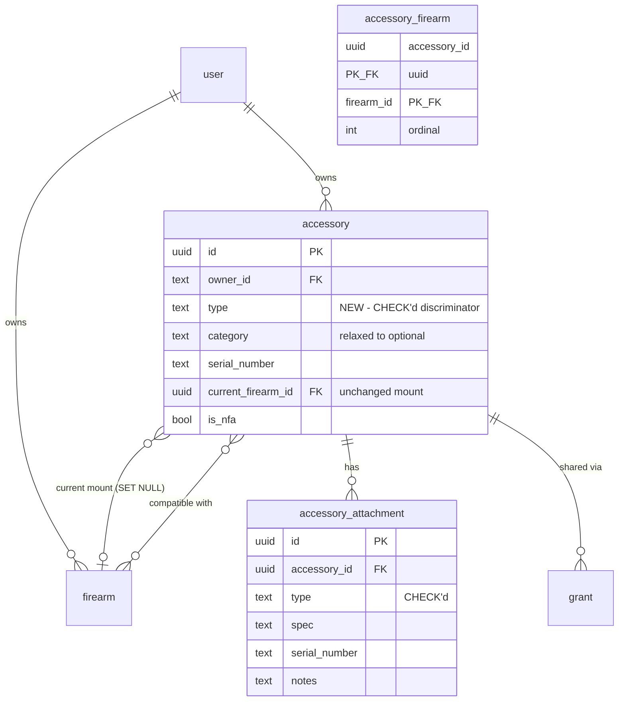
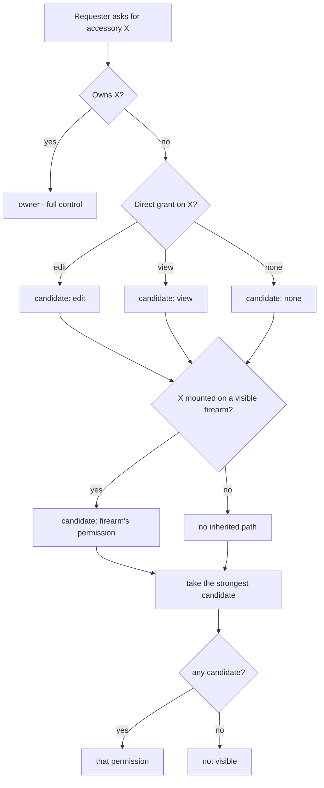

# Serialized Accessories (Suppressors) - Plan

## Goal Capsule

- **Objective:** Let an owner treat a serialized accessory — starting with suppressors — as a first-class, independently shareable item that declares which firearms it *fits* (many-to-many), carries its own mounting hardware as child records, and is classified by a controlled `type` discriminator that later subtypes (optics) can extend.
- **Product authority:** The individual firearm owner (STRATEGY primary persona). Serves the "relational domain depth" track — one can, many hosts, its own paperwork and parts.
- **Open blockers:** None. The one open design question in issue #23 (dedicated `suppressor` table vs. generic discriminator) was settled by the user during planning — see KTD1.

> **Premise correction (read first).** Issue #23 states "the current schema has no home for them" and that `grant.parent_type` is `in (firearm, magazine)`. Both are **stale**. Issue #8 shipped a full `accessory` entity (`src/db/inventory-schema.ts:192`) with `serial_number`, `is_nfa`, `brand`, `model`, `cost_cents`, and a service-intervals integration; `grant.parent_type` is already `in ('firearm', 'magazine', 'ammo')`. This plan therefore **evolves the shipped `accessory`** rather than creating a parallel entity. Three of #23's four asks are genuinely new (compatibility, attachments, independent sharing); the fourth (the parent record) already exists.

---

## Product Contract

### Summary

Evolve the existing owner-scoped **Accessory** into a serialized-accessory model. Add a controlled **`type`** discriminator (suppressor, optic, light, laser, …) alongside the existing free-text `category`; add an **Accessory Compatibility** many-to-many relation to firearms that is distinct from the existing single "currently mounted" link; add **Attachments** as accessory child records describing mounting hardware; and make an Accessory **independently shareable** by extending the polymorphic `grant` parent type.

### Problem Frame

A suppressor is not a part bolted to one gun. It is a serialized, regulated item that moves across a collection — the owner's records need to answer "which of my hosts does this can fit?" and "what mount/piston/end cap makes it fit?", neither of which the current model can express.

The shipped `accessory` (#8) models the *physical present*: `current_firearm_id` says what an accessory is mounted on **right now**, nullable for "in the safe". That is the wrong relation for the question #23 asks. Compatibility is a *capability* claim — a can fits five hosts whether or not it is on any of them today — and it is many-to-many, exactly like `magazine` ↔ `firearm`. These are two different facts about the same accessory and both are worth keeping.

Sharing is the second gap. Issue #8 deliberately decided an accessory carries **no grants of its own** and inherits visibility from the firearm it is mounted to. That decision does not survive contact with a suppressor: an unmounted can is invisible to everyone but the owner, which is exactly backwards for the item most likely to be lent, co-owned through a trust, or shown to an armorer. #23 reverses it.

### Key Decisions

- **KD1. Evolve `accessory` with a `type` discriminator; do not add a `suppressor` table.** *(session-settled: user-directed — chosen over a dedicated `suppressor` table: a discriminator absorbs the next serialized subtype (optics) without a second parent entity and a second compatibility graph.)* The user's steer also named the *subclass* path for subtype-specific fields; this plan takes the discriminator now and leaves per-type detail tables as the sanctioned extension point (KTD2). **Governs R1, R2, R3.**
- **KD2. Compatibility and mount are different relations and both persist.** `current_firearm_id` keeps its shipped meaning ("mounted right now", `ON DELETE SET NULL`); the new `accessory_firearm` join carries "fits" (`ON DELETE CASCADE`). Collapsing them would either destroy #8's mount semantics — which `range_session_accessory` and `installed_date` both depend on — or overload one column with two meanings. **Governs R4, R5, R6.**
- **KD3. Accessories become independently shareable, reversing #8's key decision.** *(session-settled: user-approved — chosen over keeping #8's inherit-only model, and over an independent-grants-only clean break: #23's sharing criterion requires independent grants, and retaining the inherited path avoids silently removing access users have today.)* An accessory gains its own grant family. Its visible set is `owned ∪ directly-granted ∪ mounted-on-a-visible-firearm`, and the effective permission is the strongest of those paths. The inherited path is retained so #8's shipped behavior (a mounted accessory shows up with its firearm) does not regress. **Governs R7, R8, R9, R10.**
- **KD4. `category` survives as free-text detail; `type` is the structural discriminator.** *(session-settled: user-approved — chosen over dropping `category` in favor of `type`, and over adding `type` while leaving `category` required: dropping it flattens genuine long-tail values like bipod/magwell to `other`, and leaving it required makes the form ask for two overlapping required classifications.)* #8's key decision — "category is free-text with suggestions, not an enforced taxonomy" — was correct for the long tail (rail, bipod, red-dot mount) and is not reversed. `type` answers "which subtype's rules apply"; `category` answers "what does the owner call it". `category` relaxes from required to optional so `type` can carry the required classification. **Governs R2, R3.**
- **KD5. NFA modeling stays at the shipped `is_nfa` flag.** Tax stamp, form type, approval date, and trust-vs-individual are **out of scope**, per #23's own instruction not to block core tracking. They pair with #12 (documents). **Governs R20.**

### Requirements

**Classification**

- **R1.** An accessory carries a `type` drawn from a controlled set; `suppressor` is the fully-supported subtype for this slice.
- **R2.** `type` is required. Existing rows backfill from `category` by case-insensitive match against the controlled set, falling back to `other`.
- **R3.** `category` remains free text and becomes optional (empty-not-null), retaining its existing suggestion list.

**Compatibility**

- **R4.** An owner declares which firearms an accessory fits — many accessories to many firearms.
- **R5.** Compatibility is ordered by an ordinal, mirroring `magazine_firearm`.
- **R6.** Declaring compatibility neither sets nor clears the accessory's current mount, and vice versa.

**Sharing and visibility**

- **R7.** An accessory can be granted to another user at `view` or `edit`, through the same grant surface as firearms, magazines, and ammo.
- **R8.** An accessory mounted to a firearm the requester can see remains visible to that requester even with no direct accessory grant (no regression from #8).
- **R9.** When paths disagree, the requester holds the strongest permission any path grants; ownership always wins.
- **R10.** Deleting an accessory removes its grants, compatibility rows, and attachments.

**Attachments**

- **R11.** An accessory carries zero or more attachments, each with a required `type` (mount, piston, end cap, muzzle device, other) from a controlled set.
- **R12.** An attachment carries an optional spec (thread pitch / bore), optional serial, and optional notes.
- **R13.** Attachments are accessory child records: no `owner_id`, no grants of their own, authorized through the parent accessory, `ON DELETE CASCADE`.

**Interface**

- **R14.** The accessory create/edit form captures `type` and manages firearm compatibility.
- **R15.** The accessory detail view lists compatibility and attachments, and offers attachment create/edit/delete to editors.
- **R16.** Accessories appear in the sharing UI as a grantable item type.
- **R17.** A read-only (view-permission) viewer sees compatibility and attachments but is offered no mutating control.
- **R18.** All new UI is targeted by ARIA roles / accessible names / visible text — no `data-testid`.

**Data integrity**

- **R19.** Compatibility pairs are unique; a duplicate (accessory, firearm) pair is impossible at the DB level.
- **R20.** `is_nfa` retains its shipped meaning; no new NFA columns land in this slice.

### Scope Boundaries

**In scope:** the `type` discriminator and its backfill; `accessory_firearm`; `accessory_attachment`; grant extension to `accessory`; the visibility union; form/detail/sharing UI; integration and e2e coverage.

#### Deferred to Follow-Up Work

- **Per-type detail tables (the "subclass" path).** Optics-specific fields (magnification, reticle, zero) land when the optics ticket does, as `accessory_optic` keyed on `accessory_id` — not speculatively now (YAGNI, and the user framed optics as "a later ticket").
- **Attachment-driven compatibility inference.** #23 notes a piston is what makes a can fit a host. Recording attachments is in scope; *deriving* suggested compatibility from them is not.
- **Full NFA modeling** (tax stamp, form type, approval date, trust) — pairs with #12.
- **`inventory_log` for accessories.** Its `parent_type` CHECK stays `('firearm', 'magazine')`; #23 does not ask for it.
- **Consolidating `type` and `category`.** If `category` proves redundant once `type` ships, collapsing them is a later, separately-decided migration.

#### Outside this product's identity

- A regulatory-compliance product. Mag Stacker records what the owner owns; it does not file forms, assert legal status, or advise on transfers.

### Acceptance Examples

- **AE1.** Owner creates an accessory with `type = suppressor`, serial `ABC123`, and marks it compatible with three firearms. All three appear on its detail view; none of them becomes its current mount.
- **AE2.** Owner grants the suppressor to a second user at `view`. That user sees it in their accessories list and can open its detail, including compatibility and attachments, but is offered no edit control.
- **AE3.** An accessory is mounted to a firearm shared with user B, and has no direct grant to B. B can still see the accessory (R8).
- **AE4.** Owner adds a piston attachment (`type = piston`, spec `1/2x28`). It appears on the detail view and survives an unrelated edit to the accessory.
- **AE5.** Owner deletes the accessory. Its grants, compatibility rows, and attachments are gone; the firearms it was compatible with are untouched.
- **AE6.** A pre-existing accessory with `category = "suppressor"` backfills to `type = suppressor`; one with `category = "bipod"` backfills to `type = other` and keeps `category = "bipod"`.

---

## Planning Contract

### Key Technical Decisions

- **KTD1. Extend the shipped `accessory` table.** *(session-settled: user-directed — chosen over a dedicated `suppressor` table: avoids a second parent entity, a second compatibility graph, and a second sharing surface when optics lands.)* Implements KD1.
- **KTD2. Discriminator now, subclass tables later.** `type` is a `text NOT NULL` column with a CHECK sourced from `src/domain/accessories/constants.ts`, following the `firearm_type_valid` / `firearm_action_valid` precedent (`inventory-schema.ts:102`) where the domain validator is primary and the CHECK is the backstop. Subtype-specific columns go in future `accessory_<type>` detail tables keyed on `accessory_id`, never as nullable columns on the parent.
- **KTD3. `accessory_firearm` copies `magazine_firearm` exactly.** Composite PK on `(accessory_id, firearm_id)` (R19 backstop), both FKs `ON DELETE CASCADE`, `ordinal integer NOT NULL`, plus an index on `firearm_id` for the reverse lookup. The domain service mirrors `src/domain/magazines/compatibility.ts` — delete-all-then-reinsert inside a transaction — so the two relations stay behaviorally identical (DRY, per #23's explicit ask).
- **KTD4. Grant extension is a CHECK edit plus one trigger.** `grant_parent_type_valid` gains `'accessory'`; cleanup reuses the already-parameterized `delete_grants_for_parent('accessory')` function from `0002_grant_cleanup_triggers.sql`, a one-line addition exactly like ammo's in `0010_goofy_purifiers.sql`. No new trigger function.
- **KTD5. `ParentType` gains `"accessory"` at one dispatch point.** `src/auth/visibility.ts` defines the union and `parentTable()`; adding the arm there propagates to `authorize.ts` and `reference.ts` through the type system. The compiler surfaces every switch that needs updating — treat a clean `bun run typecheck` as the completeness signal.
- **KTD6. The inherited-visibility path lives in the accessory domain, not in `visibility.ts`.** `getVisibleIds(db, userId, "accessory")` returns owned ∪ directly-granted, staying uniform with the other parent types. The union with "mounted on a visible firearm" (R8) is applied in the accessory service, which already knows about `current_firearm_id`. Pushing firearm-mount knowledge into the generic auth layer would make one parent type special and leak inventory semantics into auth.
- **KTD7. Attachments mirror `firearm_photo`'s child-record shape.** Surrogate `id` PK, `accessory_id` FK `ON DELETE CASCADE`, no `owner_id`, no grants — authorization resolves through the parent (`inventory-schema.ts:361` precedent).
- **KTD8. One migration, generated then hand-edited.** Drizzle generates the DDL; the backfill `UPDATE` (R2), the `category` NOT NULL relaxation, the CHECK swap, and the trigger are appended by hand — the established pattern in this repo (`0008`, `0010`, `0020`). Order matters: add `type` nullable → backfill → set NOT NULL → add CHECK.

> **Migration hazard (learned):** Drizzle runs all pending migrations in one transaction and tracks a high-water-mark timestamp. Do not renumber or rewrite existing migration files — add a new one.

---

## High-Level Technical Design

### Data model after this slice

The two `accessory`↔`firearm` edges are deliberate and non-redundant: the optional one is *present state*, the many-to-many is *capability* (KD2).

### Effective permission resolution (R9)

*Directional guidance for review, not implementation specification.*

---

## Implementation Units

### U1. Accessory `type` discriminator

- **Goal:** Add the controlled `type` column, backfill it, and relax `category`.
- **Requirements:** R1, R2, R3, R20
- **Dependencies:** none
- **Files:**
  - `src/domain/accessories/constants.ts` (add `ACCESSORY_TYPES`, keep `ACCESSORY_CATEGORY_SUGGESTIONS`)
  - `src/db/inventory-schema.ts` (add `type`, relax `category`, add CHECK)
  - `src/db/migrations/0022_*.sql` (generated + hand-edited)
  - `src/domain/accessories/validate.ts`
  - `src/domain/accessories/__tests__/validate.test.ts`
  - `src/db/__tests__/schema.test.ts`
- **Approach:**
  1. Define `ACCESSORY_TYPES = ["suppressor", "optic", "light", "laser", "muzzle device", "other"]` as a const tuple; export the union type.
  2. Add `type: text("type").notNull().default("other")` plus `check("accessory_type_valid", ...)` using the existing `inList()` helper.
  3. Relax `category` to `.notNull().default("")` (empty-not-null, R18-style).
  4. Hand-edit the migration in the KTD8 order: add nullable → `UPDATE accessory SET type = lower(category) WHERE lower(category) IN (...)`, else `'other'` → SET NOT NULL → ADD CHECK → `ALTER COLUMN category DROP NOT NULL` is *not* needed (it stays NOT NULL with a `''` default; existing rows already have values).
  5. Extend the Zod validator: `type` required and enum-constrained, `category` optional.
- **Patterns to follow:** `firearm.type` / `FIREARM_TYPES` in `inventory-schema.ts:102` and `src/domain/firearms/constants.ts`.
- **Execution note:** Write the backfill assertion as a migration test before hand-editing the SQL — the mapping is the part most likely to be wrong, and it runs exactly once in production.
- **Test scenarios:**
  - A new accessory with `type = "suppressor"` persists and reads back.
  - A `type` outside the controlled set is rejected by the validator.
  - A `type` outside the controlled set is rejected by the DB CHECK when the validator is bypassed.
  - Backfill: `category = "suppressor"` → `type = "suppressor"`; `category = "Optic"` (mixed case) → `type = "optic"`; `category = "bipod"` → `type = "other"` with `category` preserved (AE6).
  - An accessory created with no `category` persists with `category = ""`.
- **Verification:** `bun run db:migrate` applies cleanly against a seeded DB; every pre-existing accessory has a non-null `type` in the controlled set.

### U2. Accessory ↔ Firearm compatibility

- **Goal:** Add the many-to-many compatibility relation and its domain service.
- **Requirements:** R4, R5, R6, R19
- **Dependencies:** U1
- **Files:**
  - `src/db/inventory-schema.ts` (`accessoryFirearm`)
  - `src/db/migrations/0022_*.sql`
  - `src/domain/accessories/compatibility.ts` (new)
  - `src/domain/accessories/__tests__/compatibility.test.ts` (new)
  - `src/test-support/factories.ts`
- **Approach:** Copy `magazine_firearm`'s table shape (composite PK, both FKs CASCADE, `ordinal`, `firearm_id` index). Port `src/domain/magazines/compatibility.ts` — `setCompatibility` (delete-all + reinsert in a transaction), `getCompatibleFirearmIds`, and the batch variant for list views. Owner-scope every firearm id against the caller's visible set before insert so an owner cannot link a firearm they cannot see.
- **Patterns to follow:** `src/domain/magazines/compatibility.ts` verbatim in structure; `magazineFirearm` at `inventory-schema.ts:261`.
- **Test scenarios:**
  - Setting three firearms yields three ordered rows; re-setting with two leaves exactly two.
  - Setting the same (accessory, firearm) pair twice does not create a duplicate.
  - Deleting a firearm removes its compatibility rows but leaves the accessory.
  - Deleting an accessory removes its compatibility rows but leaves the firearms.
  - Setting compatibility does not alter `current_firearm_id`, and mounting does not alter compatibility (R6).
  - A firearm id the caller cannot see is rejected.
  - Ordinal ordering is stable across reads.
- **Verification:** Compatibility round-trips for an accessory with several firearms; cascade behavior confirmed from both directions.

### U3. Accessory attachments

- **Goal:** Add the attachment child record and its service.
- **Requirements:** R11, R12, R13
- **Dependencies:** U1
- **Files:**
  - `src/db/inventory-schema.ts` (`accessoryAttachment`)
  - `src/db/migrations/0022_*.sql`
  - `src/domain/accessories/constants.ts` (`ATTACHMENT_TYPES`)
  - `src/domain/accessories/attachments.ts` (new)
  - `src/domain/accessories/__tests__/attachments.test.ts` (new)
  - `src/test-support/factories.ts`
- **Approach:** Surrogate `id` PK; `accessory_id` FK `ON DELETE CASCADE`; `type text NOT NULL` with a CHECK over `ATTACHMENT_TYPES` (`mount`, `piston`, `end cap`, `muzzle device`, `other`); `spec`, `serialNumber`, `notes` empty-not-null; `createdAt`/`updatedAt`; index on `accessory_id`. CRUD authorizes through the parent accessory — every function takes the requester and resolves parent permission first.
- **Patterns to follow:** `firearmPhoto` (`inventory-schema.ts:361`) for the child-record shape; `src/domain/service-intervals/rules-service.ts` for parent-authorized child CRUD.
- **Test scenarios:**
  - Creating an attachment against an owned accessory succeeds and reads back in order.
  - An attachment `type` outside the set is rejected by validator and by CHECK.
  - Optional fields default to `""` when omitted.
  - Deleting the accessory cascades its attachments away (AE5).
  - A user with only `view` on the accessory cannot create, edit, or delete an attachment.
  - A user with no permission on the accessory cannot read its attachments.
- **Verification:** Attachment CRUD works for owner and editor, is refused for viewer, and cascades on parent delete.

### U4. Independent accessory sharing

- **Goal:** Make `accessory` a grantable parent type and define the visibility union.
- **Requirements:** R7, R8, R9, R10
- **Dependencies:** U1
- **Files:**
  - `src/db/inventory-schema.ts` (`grant_parent_type_valid` CHECK)
  - `src/db/migrations/0022_*.sql` (CHECK swap + `accessory_grants_cleanup` trigger)
  - `src/auth/visibility.ts` (`ParentType`, `parentTable`)
  - `src/auth/authorize.ts`
  - `src/domain/accessories/service.ts` (inherited-path union)
  - `src/auth/__tests__/accessory-visibility.test.ts`
  - `src/auth/__tests__/grants.test.ts`
  - `src/domain/accessories/__tests__/service.test.ts`
- **Approach:**
  1. Drop and re-add `grant_parent_type_valid` with `'accessory'` included.
  2. Add `CREATE TRIGGER accessory_grants_cleanup ... EXECUTE FUNCTION delete_grants_for_parent('accessory')` — the function already exists and is parameterized (KTD4).
  3. Add `"accessory"` to the `ParentType` union and the `parentTable()` dispatch; fix every type error the compiler raises (KTD5).
  4. In the accessory service, compute the visible set as `getVisibleIds(…, "accessory") ∪ {accessories whose current_firearm_id ∈ getVisibleIds(…, "firearm")}` and resolve effective permission as the strongest path (KTD6).
- **Execution note:** This is the security-sensitive unit and it *reverses* a shipped decision. Write the visibility tests first, including the no-regression case (AE3), before touching `visibility.ts`.
- **Patterns to follow:** ammo's grant enablement in `0010_goofy_purifiers.sql`; `src/auth/visibility.ts` existing arms.
- **Test scenarios:**
  - Owner sees own accessories regardless of mount state.
  - A `view` grant makes an unmounted accessory visible to the grantee; a `view` grantee cannot mutate it.
  - An `edit` grant permits mutation.
  - AE3 no-regression: an accessory mounted on a firearm shared with B is visible to B with no direct accessory grant.
  - Strongest-path: `view` direct grant + `edit` inherited from the mounted firearm resolves to `edit`.
  - Ownership beats any grant.
  - Unmounting an accessory removes the inherited path but leaves a direct grant intact.
  - Deleting the accessory deletes its grant rows (trigger).
  - Deleting the grantee user deletes the grant without touching the accessory.
- **Verification:** Full visibility matrix passes; `bun run typecheck` is clean (KTD5 completeness signal).

### U5. Accessory form and list UI

- **Goal:** Capture `type` on create/edit and surface it in the list.
- **Requirements:** R14, R18
- **Dependencies:** U1
- **Files:**
  - `app/(app)/accessories/accessory-form.tsx`
  - `app/(app)/accessories/accessories-view.tsx`
  - `app/(app)/accessories/actions.ts`
  - `src/domain/accessories/display.ts`
- **Approach:** Add a required `type` select seeded from `ACCESSORY_TYPES`; keep `category` as the existing free-text combobox, now optional. Surface `type` as a column/badge in the list and make it filterable if the existing table controls make that cheap.
- **Patterns to follow:** the firearm form's `type`/`action` selects; existing accessory form structure.
- **Test scenarios:**
  - The form renders a type control reachable by accessible name and rejects submission when unset.
  - Selecting `suppressor` and submitting persists `type`.
  - Editing an existing accessory pre-selects its current type.
  - The list renders the type for each accessory.
- **Verification:** Create and edit round-trip through the UI with `type` persisted.

### U6. Compatibility management UI

- **Goal:** Attach/detach compatible firearms from the accessory surface.
- **Requirements:** R14, R17, R18
- **Dependencies:** U2, U5
- **Files:**
  - `app/(app)/accessories/accessory-form.tsx`
  - `app/(app)/accessories/accessory-detail-view.tsx`
  - `app/(app)/accessories/actions.ts`
- **Approach:** Reuse the magazine compatibility picker rather than duplicating it (#23's explicit DRY ask). If it is currently magazine-coupled, lift it to a shared component parameterized by parent type and selected ids; if lifting is disproportionate, extract the selection list and keep two thin wrappers. Editors get the control; viewers get a read-only list (R17).
- **Patterns to follow:** `app/(app)/magazines/magazine-form.tsx` and `magazine-detail-view.tsx` compatibility sections.
- **Test scenarios:**
  - Selecting firearms and saving persists compatibility and renders it on the detail view.
  - Deselecting all clears compatibility.
  - Only firearms the requester can see are offered.
  - A viewer sees the compatibility list and no mutating control.
- **Verification:** Compatibility is manageable from the accessory detail and matches the magazine flow's behavior.

### U7. Attachments UI

- **Goal:** List, add, edit, and delete attachments on the accessory detail view.
- **Requirements:** R15, R17, R18
- **Dependencies:** U3, U5
- **Files:**
  - `app/(app)/accessories/accessory-detail-view.tsx`
  - `app/(app)/accessories/attachments-section.tsx` (new)
  - `app/(app)/accessories/actions.ts`
- **Approach:** A section on the detail view listing attachments with type and spec, plus an add/edit dialog and a delete confirm. Mirror the service-rules section's structure on the firearm detail — same parent-authorized child-record shape.
- **Patterns to follow:** the service-intervals rules section; existing detail-view section composition.
- **Test scenarios:**
  - Adding an attachment renders it in the list (AE4).
  - Editing updates the rendered spec.
  - Deleting removes it after confirmation.
  - A viewer sees the list with no add/edit/delete affordance.
  - Controls are reachable by role and accessible name.
- **Verification:** Attachment CRUD works end-to-end from the detail view for an editor and is absent for a viewer.

### U8. Sharing UI and read-only detail

- **Goal:** Offer accessories as a grantable item type and confirm the read-only surface.
- **Requirements:** R16, R17, R18
- **Dependencies:** U4, U6, U7
- **Files:**
  - `app/(app)/grants/` (item-type selection and listing)
  - `app/(app)/accessories/accessory-detail-view.tsx`
- **Approach:** Add accessories to the grant creation flow's parent-type options and to the granted-items listing, following the ammo precedent. Verify the detail view degrades correctly under `view`.
- **Patterns to follow:** how ammo appears in the grants UI.
- **Test scenarios:**
  - An owner can grant an accessory at view and at edit from the sharing UI.
  - The grantee sees it listed among shared items.
  - Revoking removes it from the grantee's view.
  - The accessory detail under `view` shows compatibility and attachments and no mutating controls (AE2).
- **Verification:** A grant created through the UI produces the visibility behavior U4 tests assert.

### U9. End-to-end coverage

- **Goal:** Prove the acceptance examples through the real app.
- **Requirements:** R14–R18, AE1–AE6
- **Dependencies:** U5, U6, U7, U8
- **Files:**
  - `e2e/accessories-serialized.spec.ts` (new)
  - `e2e/README.md` if harness notes change
- **Approach:** Cover AE1 (create + compatibility), AE2 (share at view, read-only detail), AE4 (attachment), and AE5 (delete cascade) as user journeys. Target by ARIA role / accessible name / visible text only.
- **Execution note:** Run via `bun run test:e2e`, never raw `bun test` — the e2e specs mis-load under the unit runner.
- **Test scenarios:**
  - AE1 end-to-end through the UI.
  - AE2 as a two-user journey.
  - AE4 attachment add and persistence across reload.
  - AE5 delete removes the accessory and its children.
- **Verification:** `bun run test:e2e` passes with the new spec included.

---

## Landing Strategy

*(session-settled: user-approved — chosen over splitting into schema/UI/e2e PRs, and over trimming attachments to a follow-up: the units are tightly coupled and intermediate states would ship a schema no UI reaches.)*

**All nine units land in a single PR on one feature branch.** Implications the implementer must honor:

- Branch from `main` (never commit to `main` directly); prefer an isolated worktree — `git worktree add -b ai/serialized-accessories .worktrees/serialized-accessories`.
- Commit per unit (Conventional Commits) for reviewable history, but open **one** PR. Branch commit messages are discarded at squash-merge — the **PR title** is the commit subject on `main` and must be a valid Conventional Commit subject.
- Suggested PR title: `feat(accessories): track serialized accessories with type, compatibility, attachments, and sharing`.
- **Not a breaking change** — no `!` marker and no `BREAKING CHANGE:` footer. The migration is additive plus one non-destructive relaxation; no shipped API or column is removed.
- Watch total diff size. A PR over ~20,000 changed lines is silently skipped by Copilot review entirely — if the branch approaches that, say so rather than opening a PR that gets no automated review.

## Verification Contract

- `just ci-check` passes — the mandatory pre-commit gate; no commit while it is red.
- `bun run lint` (biome), `bun run typecheck`, `bun test`, `bun run test:e2e` all green.
- `bun run db:migrate` applies `0022` cleanly against a database seeded with pre-existing accessories, and every row lands with a valid `type`.
- The U4 visibility matrix passes in full, including the AE3 no-regression case.
- Docker is running — integration and e2e use Testcontainers.

## Definition of Done

- An owner can classify an accessory by `type`, declare many-to-many firearm compatibility, record attachments, and share the accessory independently.
- #8's shipped behavior is intact: current-mount semantics, `range_session_accessory` snapshots, service intervals, and mounted-accessory inheritance all still work.
- Every acceptance example AE1–AE6 is demonstrated by a test.
- No `data-testid` anywhere in the new UI.
- `CONCEPTS.md` gains **Accessory Type**, **Accessory Compatibility**, and **Attachment** entries.

---

## Risks & Dependencies

| Risk | Impact | Mitigation |
|---|---|---|
| The `type` backfill mis-maps existing free-text categories | Wrong classification on live data, one-shot | Migration test written first (U1 execution note); unmapped values fall back to `other` with `category` preserved — lossless |
| Reversing #8's "not independently shareable" decision regresses inherited visibility | A user silently loses access to accessories they could see | AE3 is an explicit no-regression test; the inherited path is kept, not replaced (KD3) |
| Two `accessory`↔`firearm` edges confuse future contributors | Wrong relation used in a later feature | Both edges documented in the schema comment and in `CONCEPTS.md`; R6 tests assert independence |
| `ParentType` widening ripples further than expected | Broad, hard-to-scope diff | KTD5 makes the compiler the completeness oracle; `bun run typecheck` is the gate |
| `type` and `category` overlap confuses users | Redundant-feeling form | KD4 gives each a distinct job; consolidation is a named deferred item |

**Dependencies:** Docker (Testcontainers); no new packages expected.

## Open Questions

- **Deferred to implementation:** whether the magazine compatibility picker can be lifted to a shared component cheaply, or whether extraction is disproportionate (U6 records both paths).
- **Deferred to implementation:** whether `type` becomes a table filter in the accessories list, or only a displayed column — depends on how cheap the existing table controls make it.

## Sources & Research

- GitHub issue #23 — origin (premise corrected above).
- Issue #8 / `docs/plans/2026-07-07-001-feat-accessories-tracker-plan.md` — the shipped accessory model and the key decisions this plan extends and, for sharing, reverses.
- `src/db/inventory-schema.ts` — `accessory` (:192), `magazineFirearm` (:261), `firearmPhoto` (:361), `grant` (:648).
- `src/domain/magazines/compatibility.ts` — the compatibility service this plan ports.
- `src/auth/visibility.ts`, `src/auth/authorize.ts` — the `ParentType` dispatch point.
- `src/db/migrations/0002_grant_cleanup_triggers.sql`, `0010_goofy_purifiers.sql` — the parameterized grant-cleanup trigger pattern.
- `CONCEPTS.md` — Compatibility, Grant, Child record vocabulary.
- No external research was required: every pattern this plan needs has a direct, recent in-repo precedent.
