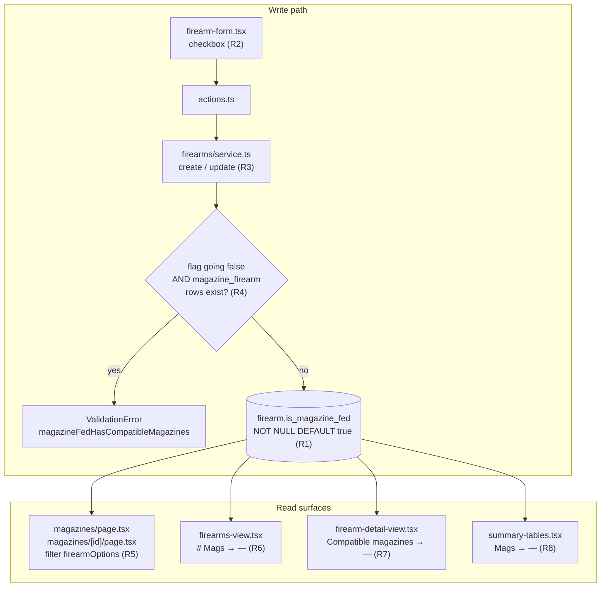

# feat(firearms): mark a firearm as not magazine-fed

**Origin:** GitHub issue [#37](https://github.com/unclesp1d3r/mag_stacker/issues/37) — *Mark a firearm as not magazine-fed (exclude from magazine creation, blank the # Mags column)*

---

## Goal Capsule

Revolvers, break-actions, tube-fed lever guns, and muzzleloaders do not take detachable magazines, but MagStacker currently assumes every **Firearm** does: each one appears in the magazine form's compatible-firearm picker, and its **# Mags** cell reads `0` — which looks like *you are missing magazines* rather than *this gun does not take any*.

Add an explicit per-firearm boolean, `isMagazineFed` (default `true`). When it is off, the firearm is omitted from the magazine form's compatible-firearm options and its magazine-count cells render blank (`—`) instead of `0`. Existing rows backfill to magazine-fed, so today's behavior is preserved exactly.

---

## Problem Frame

**Today.** `firearm` has no notion of magazine feeding. Three consequences:

1. `app/(app)/magazines/page.tsx` and `app/(app)/magazines/[id]/page.tsx` build `firearmOptions` from every visible firearm, so a revolver is offered as a **Compatibility** target — a nonsensical pairing the data model happily accepts.
2. `app/(app)/firearms/firearms-view.tsx` renders `# Mags` straight off `magazineCount`, so a revolver shows `0`. The same `0` shows on the firearm detail view's *Compatible magazines* row and in the summary page's per-firearm **Mags** table.
3. There is no way to record the fact at all, so nothing downstream can key off it.

**Why an explicit flag rather than derivation.** Issue #17 shipped a **Firearm Type** / **Firearm Action** taxonomy, and a revolver *could* be inferred from `action = revolver`. But the mapping is lossy in both directions — a tube-fed lever gun and a break-action shotgun share no single action value, while some bolt-action rifles are magazine-fed and some are not. An owner-set flag is authoritative, simpler, and does not silently change meaning when the taxonomy grows. Taxonomy-driven *defaults* remain a possible follow-up (see Scope Boundaries).

**Non-goals.** This does not touch **Accessory Compatibility** (accessories fit firearms, not magazines) and does not change the compatibility relation's viewer-relative semantics.

---

## Requirements

| ID | Requirement |
|----|-------------|
| R1 | `firearm` carries a boolean `is_magazine_fed`, `NOT NULL DEFAULT true`; a Drizzle migration adds it and backfills every existing row to magazine-fed. |
| R2 | The firearm form exposes a checkbox — *"This firearm uses detachable magazines"* — checked by default on create and reflecting the stored value on edit. |
| R3 | `createFirearm` and `updateFirearm` persist the flag, defaulting to `true` when the input omits it. |
| R4 | Marking a firearm non-magazine-fed while **any** `magazine_firearm` row references it is rejected with a validation error naming the fix. Compatibility rows are counted regardless of the actor's visibility. |
| R5 | A non-magazine-fed firearm is omitted from `firearmOptions` on the magazines list page and the magazine detail page, so it cannot be selected as a compatibility target. |
| R6 | The firearms table's **# Mags** cell renders a muted `—` for a non-magazine-fed firearm. Magazine-fed firearms render their count unchanged, including `0`. |
| R7 | The firearm detail view's *Compatible magazines* row renders `—` for a non-magazine-fed firearm. |
| R8 | The summary page's per-firearm **Mags** column renders `—` for a non-magazine-fed firearm. |
| R9 | Blank rendering is keyed off the flag, never off `count === 0`. |
| R10 | The magazines-list cold-start empty state ("Set up your inventory / Add a firearm") continues to key off whether the user has *any* visible firearm, not off the filtered `firearmOptions` length. |
| R11 | Owner-scoping and the existing immutability patterns are respected: no new visibility path, no in-place mutation of loaded rows. |

---

## Key Technical Decisions

### KTD1. Column name and polarity: `is_magazine_fed`, positive, default `true`

The issue offers `magazineFed` or the inverse `usesMagazines`. Chosen: `isMagazineFed` / `is_magazine_fed` — positive polarity with an `is` prefix.

- Matches the sibling boolean already on this table, `is_nfa` (`src/db/inventory-schema.ts:96`), and the project's boolean naming rule.
- Positive polarity with `DEFAULT true` makes the backfill semantically correct with no data migration: `ADD COLUMN … NOT NULL DEFAULT true` *is* the backfill, exactly as `is_nfa`'s `DEFAULT false` was.
- A negative name (`isNotMagazineFed`) would need `DEFAULT false` and read as a double negative at every call site.

No CHECK constraint and no domain validation constraint — like `is_nfa`, any boolean is legal.

### KTD2. Toggling with existing compatibilities: **block**, do not detach

Issue #37 leaves this open, recommending (a) block or (b) warn-and-detach. Chosen: **(a) block**, as a service-layer guard in `updateFirearm`.

Detaching is actively unsafe here. `src/domain/compatibility/relation.ts` is deliberately viewer-relative on *both* sides: a read drops firearms outside the reader's visible set, and a write only replaces pairings within that set, precisely so a filtered read feeding a wholesale write cannot destroy links the actor was never shown. This repo has already been bitten by that exact class of bug — see `docs/solutions/logic-errors/a-viewer-relative-read-feeding-a-replace-all-write-destroys-hidden-rows.md`. A detach-on-toggle would delete `magazine_firearm` rows belonging to *other users'* magazines that happen to point at a shared firearm, with no notice to those owners. Blocking has none of that failure mode and is the simpler rule.

The guard counts rows in `magazine_firearm` for this firearm **without** a visibility filter. This is deliberate: the invariant being protected ("a non-magazine-fed firearm has no compatibility rows") is a data-integrity property of the whole table, and a visibility-filtered guard would let an editor flip the flag while invisible rows survived. The error message is generic (it names no magazine), so it discloses only that *some* link exists, not whose.

Consequence: the guard is a DB-dependent check, so it cannot live in the pure `validateFirearm`. It runs inside `updateFirearm`'s transaction and throws `ValidationError` with a new code, which the existing `firstMessage` plumbing already surfaces on the form. `createFirearm` needs no guard — a brand-new firearm has no compatibility rows.

### KTD3. Blank rendering keyed off the flag, in the cell renderer

`# Mags` is currently a bare `accessorKey` column with no `cell` (`app/(app)/firearms/firearms-view.tsx:206-211`). It gains a `cell` that reads `row.original.isMagazineFed` and renders a muted `—` when false, otherwise the count. Sorting stays on the underlying numeric `magazineCount`, so non-magazine-fed rows sort as `0` — accepted; a separate sort key is not worth the complexity.

### KTD4. Blank on all three magazine-count surfaces, not only the firearms table

Issue #37's acceptance criteria name only the firearms table, but the identical `0` appears on the firearm detail view (*Compatible magazines*) and the summary page's per-firearm **Mags** table, both rendering the same underlying number for the same firearm. Blanking one and not the others would leave the product self-contradicting on one screen versus another. All three are in scope. The summary surface costs one extra field on `FirearmCount` (`src/domain/summary/summary.ts:52`).

### KTD5. Filtering `firearmOptions` also removes the magazines-list *compatible firearm* filter option

`firearmOptions` feeds three things on the magazines list: the form's compatibility picker, the "Any firearm" filter dropdown (`app/(app)/magazines/magazines-view.tsx:563`), and the cold-start empty-state gate (line 711). Filtering it at the page level removes non-magazine-fed firearms from the filter dropdown too. Accepted — with KTD2's guard in force, such a firearm can never have compatible magazines, so the filter option would always yield zero rows.

The empty-state gate is *not* accepted as collateral (R10): a user whose only firearms are revolvers would otherwise be told "Add a firearm". That gate moves to an explicit `hasFirearms` prop.

### KTD6. `nameById` stays unfiltered

`app/(app)/magazines/page.tsx:27` builds `nameById` from the full firearm list to resolve existing compatibility ids into display names. It must keep using the **unfiltered** list. KTD2's guard makes "a non-magazine-fed firearm with compatibility rows" unreachable through the app, but a restored backup or a direct DB edit could produce one, and in that state the magazine's compatible-firearm name should still render rather than silently vanish.

### KTD7. Backup/restore needs no change

`src/backup/db-export.ts` exports with `db.select().from(table)` and `src/backup/table-order.ts` already lists `firearm`, so the new column flows through automatically. Restoring an *older* backup whose firearm rows lack the column also works: the insert omits it and Postgres applies `DEFAULT true` — the same behavior the column's backfill relies on.

---

## Assumptions

Recorded rather than asked, per headless planning:

- **A1.** KTD4's extension to the detail view and summary table is the right reading of the issue's motivation ("a revolver showing # Mags: 0 is noise"), even though its acceptance criteria name only the firearms table. If the user wants the narrower reading, drop U6 and the detail-view half of U4.
- **A2.** The checkbox label is *"This firearm uses detachable magazines"* (the issue's own wording). It sits next to the existing *"NFA-regulated item"* checkbox in the form.
- **A3.** No demo-data change. Seeding a revolver into `src/demo/inventory.ts` would showcase the feature but is scope creep and would perturb existing demo e2e specs. Deferred.

---

## High-Level Technical Design

Where the flag enters and what reads it:

The write path is the only place the invariant is enforced; every read surface is a pure presentation branch on the flag.

---

## Implementation Units

### U1. Add the `is_magazine_fed` column and migration

**Goal:** The column exists, backfills every existing row to magazine-fed, and round-trips through Drizzle.

**Requirements:** R1

**Dependencies:** none

**Files:**
- `src/db/inventory-schema.ts` — modify
- `src/db/migrations/00NN_*.sql` — generated by `bun run db:generate`
- `src/db/migrations/meta/` — generated
- `src/db/__tests__/schema.test.ts` — modify

**Approach:**
1. Add `isMagazineFed: boolean("is_magazine_fed").notNull().default(true)` to the `firearm` table, immediately after `isNfa` (`src/db/inventory-schema.ts:96`), with a doc comment in the same voice as its neighbors: what it means, and that `DEFAULT true` *is* the R1 backfill.
2. Run `bun run db:generate` to emit the migration; do not hand-write it.
3. Verify the generated SQL is a single `ALTER TABLE "firearm" ADD COLUMN "is_magazine_fed" boolean DEFAULT true NOT NULL` with no unrelated drift.

**Patterns to follow:** `isNfa` on the same table (`src/db/inventory-schema.ts:96`) is the exact shape — a nullable-free boolean whose default is the backfill. `nickname` (line 83) carries the same "ADD COLUMN backfills existing rows" comment convention.

**Test scenarios:**
- Inserting a firearm without specifying `isMagazineFed` yields `isMagazineFed === true` (extend the existing default-assertions test at `src/db/__tests__/schema.test.ts:268`, which already asserts `isNfa === false`).
- Inserting with `isMagazineFed: false` round-trips as `false`.

**Verification:** `bun run db:migrate` applies cleanly against a fresh database, and `bun test src/db` passes.

---

### U2. Persist the flag and guard the non-magazine-fed transition

**Goal:** The service layer carries the flag through create and update, and refuses to mark a firearm non-magazine-fed while any compatibility row points at it.

**Requirements:** R3, R4, R11

**Dependencies:** U1

**Files:**
- `src/domain/firearms/service.ts` — modify
- `src/domain/validation-messages.ts` — modify
- `src/domain/firearms/__tests__/service.test.ts` — modify

**Approach:**
1. Add `isMagazineFed?: boolean` to `FirearmCreateInput` with a doc comment mirroring `isNfa`'s.
2. In `persistableFields`, add `isMagazineFed: input.isMagazineFed ?? true` — note the `?? true`, opposite polarity to `isNfa`'s `?? false`.
3. In `updateFirearm`, inside the existing transaction and **after** `authorizeUpdate`, run the guard only when the incoming value is explicitly `false`: select from `magazineFirearm` where `firearmId` equals the target id, `limit(1)`, with **no** visibility filter (KTD2). If a row comes back, throw `ValidationError(["magazineFedHasCompatibleMagazines"])`. Throwing inside the transaction rolls back cleanly, so no partial scalar update survives — the same property `replaceCompatibility` relies on.
4. Skip the query entirely when the incoming value is not `false`; an update that leaves the firearm magazine-fed must not pay for a round trip.
5. Add `magazineFedHasCompatibleMagazines: "Remove this firearm's compatible magazines before marking it non-magazine-fed"` to `VALIDATION_MESSAGES`. Keep it generic — it must not name a magazine the actor may not be able to see.

**Execution note:** Write the guard's failing test first — the rejection is the load-bearing behavior of this unit, and the cross-owner case is easy to get wrong.

**Patterns to follow:** `isNfa`'s handling in `FirearmCreateInput` (line 38) and `persistableFields` (line 67). `updateFirearm`'s existing transaction shape (lines 105-115) for where the guard slots in. `src/domain/magazines/service.ts`'s use of `magazineFirearm` for the query idiom.

**Test scenarios:**
- Creating a firearm without `isMagazineFed` persists `true`.
- Creating a firearm with `isMagazineFed: false` persists `false`.
- Updating a firearm to `isMagazineFed: false` when it has no compatibility rows succeeds and persists `false`.
- Updating a firearm to `isMagazineFed: false` when one of the *actor's own* magazines lists it as compatible throws `ValidationError` carrying `magazineFedHasCompatibleMagazines`, and the firearm's other fields are unchanged afterward (rollback proof — assert a scalar field submitted in the same call did not take).
- Updating to `isMagazineFed: false` when the only compatible magazine belongs to a **different owner** (firearm shared to that owner, who linked their own magazine) is also rejected — the guard is not visibility-scoped.
- Updating a firearm that already has compatibility rows while leaving `isMagazineFed: true` succeeds, proving the guard does not fire on unrelated edits.
- Updating a non-magazine-fed firearm back to `isMagazineFed: true` always succeeds.

**Verification:** `bun test src/domain/firearms` passes; the new codes appear in `VALIDATION_MESSAGES`.

---

### U3. Add the form checkbox

**Goal:** Owners can set the flag when creating or editing a firearm.

**Requirements:** R2

**Dependencies:** U2

**Files:**
- `app/(app)/firearms/firearm-form.tsx` — modify
- `app/(app)/firearms/actions.ts` — modify if it enumerates fields rather than passing the values object through
- `app/(app)/firearms/[id]/page.tsx` — modify (seed `initial`)

**Approach:**
1. Add `isMagazineFed: boolean` to `FirearmFormValues` and `isMagazineFed: true` to the `EMPTY` default (opposite of `isNfa`'s `false`).
2. Render a checkbox labeled *"This firearm uses detachable magazines"*, placed adjacent to the existing NFA checkbox (`app/(app)/firearms/firearm-form.tsx:345`), wired through the same `setValues((v) => ({ ...v, … }))` immutable-update idiom already in use.
3. Surface the U2 server code on this field via `firstMessage(codes, ["magazineFedHasCompatibleMagazines"])` so the rejection lands next to the control that caused it rather than in the generic server-error banner.
4. Seed `initial.isMagazineFed` from the loaded row in `app/(app)/firearms/[id]/page.tsx` (alongside `isNfa` at line 120).
5. Confirm the action layer forwards the field — if it destructures explicitly, add it there too.

**Patterns to follow:** the `isNfa` checkbox at `app/(app)/firearms/firearm-form.tsx:345-348` is the same control, one line of state, and the same label/`Field` wrapper.

**Test scenarios:** covered by U7's e2e; no unit test — this unit is wiring with no branching logic of its own.

**Verification:** `bun run typecheck` and `bun run lint` pass; the checkbox renders checked by default on the create form and reflects the stored value on edit.

---

### U4. Blank the count on the firearms table and detail view

**Goal:** Non-magazine-fed firearms show `—` instead of `0` on both firearm surfaces.

**Requirements:** R6, R7, R9

**Dependencies:** U1

**Files:**
- `app/(app)/firearms/firearms-view.tsx` — modify
- `app/(app)/firearms/page.tsx` — modify
- `app/(app)/firearms/firearm-detail-view.tsx` — modify
- `app/(app)/firearms/[id]/page.tsx` — modify

**Approach:**
1. Add `isMagazineFed: boolean` to `FirearmListItem` (`app/(app)/firearms/firearms-view.tsx:54`) and populate it in the `items` map at `app/(app)/firearms/page.tsx:78`, next to `isNfa`.
2. Give the `magazineCount` column a `cell` renderer that branches on `row.original.isMagazineFed`, rendering a muted `—` when false and the numeric count otherwise. Leave `accessorKey`, `id`, `header`, and `meta.numeric` untouched so sorting, the column-visibility menu, and numeric alignment are unaffected.
3. On the detail view, branch the *Compatible magazines* `DetailRow` value (`app/(app)/firearms/firearm-detail-view.tsx:195-198`) the same way — `—` when non-magazine-fed, otherwise `<Data>{magazineCount}</Data>`. Thread `isMagazineFed` in via the existing firearm row already passed to the component; add it to the `[id]/page.tsx` projection at line 120 if that projection is explicit.
4. Reuse the existing dash helper (`orDash`, already imported in the detail view) rather than hardcoding an em dash in a second place.

**Approach caution:** `useMemo`'d column definitions plus React Compiler are a known hazard in this repo — the columns array must keep its existing memo dependencies honest, and the new `cell` must read from `row.original` rather than closing over page-level state. See `docs/solutions/runtime-errors/tanstack-autoreset-render-loop-unstable-data.md`.

**Patterns to follow:** the `serviceDue` column immediately above (`firearms-view.tsx:180-184`) is the existing example of a `cell` branching on `row.original`. `orDash` usage at `firearm-detail-view.tsx:185`.

**Test scenarios:**
- A magazine-fed firearm with 3 compatible magazines renders `3` in **# Mags**.
- A magazine-fed firearm with 0 compatible magazines renders `0` — explicitly proving R9's "keyed off the flag, not the count".
- A non-magazine-fed firearm renders `—`, not `0`.
- The detail view's *Compatible magazines* row shows the count for a magazine-fed firearm and `—` for a non-magazine-fed one.

Assert these through rendered output using ARIA roles / accessible names / visible text (no `data-testid`); the firearms-table cases are naturally covered inside U7's e2e rather than duplicated as brittle component tests.

**Verification:** `bun run typecheck` passes; both surfaces show `—` for a non-magazine-fed firearm and are byte-identical to today for magazine-fed ones.

---

### U5. Exclude non-magazine-fed firearms from magazine compatibility options

**Goal:** A non-magazine-fed firearm cannot be picked as a compatibility target, and the cold-start empty state stays truthful.

**Requirements:** R5, R10

**Dependencies:** U1

**Files:**
- `app/(app)/magazines/page.tsx` — modify
- `app/(app)/magazines/[id]/page.tsx` — modify
- `app/(app)/magazines/magazines-view.tsx` — modify

**Approach:**
1. In both pages, derive the option source from `firearms.filter((f) => f.isMagazineFed)` and build `firearmOptions` from that filtered list. Compute the `nameCounts` disambiguation map (`app/(app)/magazines/page.tsx:28-30`) from the **same filtered list**, so the `hint` fragment is only added when two *selectable* firearms collide.
2. Leave `nameById` (line 27) built from the **unfiltered** list, per KTD6. Add a short comment saying why, since the asymmetry is the kind of thing a later reader would "fix".
3. Add a `hasFirearms: boolean` prop to `MagazinesView`, passed as `firearms.length > 0` from the page, and change the cold-start gate at `app/(app)/magazines/magazines-view.tsx:711` from `firearmOptions.length === 0` to `!hasFirearms`. This is R10: an owner whose only firearms are revolvers must not be told to add a firearm.
4. Apply the same filtered-options derivation in `app/(app)/magazines/[id]/page.tsx:47`, which feeds `magazine-detail-view.tsx`. That page has no empty-state gate, so it needs no `hasFirearms`.

**Test scenarios:**
- With one magazine-fed and one non-magazine-fed firearm, the magazine form's compatible-firearm control offers only the magazine-fed one.
- The magazines-list *compatible firearm* filter dropdown likewise offers only magazine-fed firearms (KTD5's accepted consequence, asserted so it is deliberate rather than incidental).
- An owner with firearms — *all* non-magazine-fed — and no magazines sees the "No magazines yet" empty state, **not** the cold-start "Set up your inventory / Add a firearm" state.
- An owner with no firearms at all still sees the cold-start state, unchanged.
- A magazine that already lists a firearm as compatible still renders that firearm's name after the firearm is (via direct DB write, bypassing U2's guard) marked non-magazine-fed — proving `nameById` stayed unfiltered per KTD6.
- The magazine detail page's compatibility editor offers only magazine-fed firearms.

**Verification:** `bun run typecheck` passes; the magazines page renders correctly for the four combinations of (has firearms × has magazines).

---

### U6. Blank the summary page's per-firearm Mags column

**Goal:** The summary table agrees with the firearms table.

**Requirements:** R8, R9

**Dependencies:** U1

**Files:**
- `src/domain/summary/summary.ts` — modify
- `app/(app)/summary/summary-tables.tsx` — modify
- `src/domain/summary/__tests__/` — modify the existing summary test file

**Approach:**
1. Add `isMagazineFed: boolean` to the `FirearmCount` interface (`src/domain/summary/summary.ts:52`) and populate it from the source firearm in the `firearmCounts` map (line 143-149). `inventorySummary` already receives full firearm rows, so no new query.
2. Give the summary table's per-firearm `count` column a `cell` renderer branching on `row.original.isMagazineFed`, matching U4's treatment exactly — same `—`, same muted styling.
3. Leave the caliber-keyed **Mags** column (`summary-tables.tsx:63-67`) alone. It aggregates magazines by caliber, not by firearm, and has no firearm to be non-magazine-fed.

**Patterns to follow:** U4's cell renderer — the two should be visibly the same treatment, ideally the same tiny shared helper if one falls out naturally.

**Test scenarios:**
- `inventorySummary` returns `isMagazineFed: false` on the `FirearmCount` entry for a non-magazine-fed firearm, and `true` otherwise.
- A non-magazine-fed firearm's summary row renders `—`; a magazine-fed firearm with zero magazines still renders `0`.

**Verification:** `bun test src/domain/summary` passes; the summary page and firearms page show the same thing for the same firearm.

---

### U7. End-to-end coverage for the toggle

**Goal:** The whole loop — set the flag, see it excluded from magazine creation, see the blank cell, hit the guard — is proven through the real UI.

**Requirements:** R2, R4, R5, R6

**Dependencies:** U2, U3, U4, U5

**Files:**
- `e2e/firearm-magazine-fed.spec.ts` — create

**Approach:**
1. Follow the harness in `e2e/README.md`; model the spec on `e2e/firearm-taxonomy.spec.ts`, which exercises the same form for the #17 taxonomy fields.
2. Cover, in order: create a firearm with the checkbox **unchecked**; confirm its **# Mags** cell reads `—` on the firearms table; open the magazine form and confirm the firearm is absent from the compatible-firearm control; create a second, magazine-fed firearm, attach a magazine to it, then edit that firearm and try to uncheck the box — assert the guard's message appears and the checkbox stays checked.
3. Target everything via ARIA roles, accessible names, and visible text. No `data-testid`.

**Approach caution:** Playwright's accessible-name matching is substring-based — see `docs/solutions/test-failures/playwright-accessible-name-matches-by-substring.md`. *"This firearm uses detachable magazines"* does not collide with *"NFA-regulated item"*, but use `{ exact: true }` on the checkbox locator so a future label addition cannot silently make it ambiguous.

**Test scenarios:**
- A firearm created with the checkbox unchecked shows `—` in **# Mags** on the firearms list.
- That firearm does not appear among the magazine form's compatible-firearm options.
- A firearm created with the checkbox checked (the default) shows `0` in **# Mags** and *does* appear in the magazine form's options.
- Editing a firearm that has a compatible magazine and unchecking the box shows the guard's message, leaves the checkbox checked, and leaves the firearm magazine-fed after a page reload.
- Removing the magazine's compatibility link and then unchecking the box succeeds.

**Verification:** `bun run test:e2e` passes with Docker running (never raw `bun test` for e2e — see `docs/solutions/test-failures/bun-test-misloads-playwright-e2e-specs.md`).

---

## Scope Boundaries

**In scope:** the schema column and migration; service persistence and the transition guard; the firearm form checkbox; blank rendering on the firearms table, firearm detail view, and summary per-firearm table; magazine compatibility-option filtering on both magazine pages; the empty-state gate fix; unit and e2e coverage.

**Non-goals:**
- **Accessory Compatibility** — accessories fit firearms, not magazines. Untouched.
- Any change to the viewer-relative semantics of `src/domain/compatibility/relation.ts`.
- A CSV column for the flag. The CSV export (`src/domain/csv/`) is magazines-only and carries no `# Mags` column.
- Backup/restore changes — schema-driven export already covers the new column (KTD7).

### Deferred to Follow-Up Work

- **Taxonomy-driven defaults (#17).** Pre-checking or pre-unchecking the box based on `action = revolver` / `type = shotgun`. The explicit flag stays the source of truth either way; this is purely a form-default convenience.
- **Demo data.** Adding a revolver to `src/demo/inventory.ts` to showcase the feature (A3).
- **Bulk toggle.** Marking several firearms non-magazine-fed in one action.
- **A firearms-table filter** for magazine-fed / non-magazine-fed.

---

## Risks & Dependencies

| Risk | Mitigation |
|------|-----------|
| The U2 guard makes an owner feel stuck: they must find and unlink every compatible magazine before flipping the flag. | The error message names the required action explicitly. The situation is rare (it only arises for a firearm that *was* treated as magazine-fed) and the alternative — silent cross-owner data loss — is strictly worse (KTD2). |
| A future contributor "simplifies" the guard by adding a visibility filter, reopening the hole. | The guard carries a comment stating the unfiltered read is deliberate and why, pointing at the viewer-relative learning doc. |
| A future contributor "fixes" the `nameById` / `firearmOptions` asymmetry in U5 by filtering both. | Same treatment — an inline comment at the divergence explaining KTD6. |
| React Compiler + TanStack column-definition instability when editing the columns array. | U4 keeps the existing memo shape and reads only from `row.original`; `docs/solutions/runtime-errors/tanstack-autoreset-render-loop-unstable-data.md` is cited in the unit. |
| Generated migration picks up unrelated schema drift. | U1 verifies the generated SQL is a single `ADD COLUMN` before committing. |

**Dependencies:** none external. Docker must be running for the integration and e2e suites (Testcontainers).

---

## Verification Contract

Run before every commit — `just ci-check` must be green, no exceptions, no `--no-verify`:

- `bun run lint` (Biome)
- `bun run typecheck` (`tsc --noEmit`)
- `bun test` — integration suite via Testcontainers; Docker required
- `bun run test:e2e` — Playwright; Docker required. Never invoke e2e specs through raw `bun test`.
- `bun run db:migrate` applies cleanly against a fresh database.

---

## Definition of Done

- [ ] `firearm.is_magazine_fed` exists, `NOT NULL DEFAULT true`, added by a generated Drizzle migration; existing rows read as magazine-fed (R1).
- [ ] The firearm form has a *"This firearm uses detachable magazines"* checkbox, checked by default, reflecting the stored value on edit (R2).
- [ ] `createFirearm` / `updateFirearm` persist the flag, defaulting to `true` (R3).
- [ ] Marking a firearm non-magazine-fed while any `magazine_firearm` row references it is rejected — including when the referencing magazine belongs to another owner (R4).
- [ ] Non-magazine-fed firearms are absent from `firearmOptions` on both magazine pages (R5).
- [ ] **# Mags** renders `—` for non-magazine-fed firearms and the count (including `0`) for magazine-fed ones, on the firearms table (R6), the firearm detail view (R7), and the summary per-firearm table (R8) — keyed off the flag, never off `count === 0` (R9).
- [ ] The magazines cold-start empty state keys off having any firearm, not off filtered options (R10).
- [ ] Unit coverage for the guard (both owner cases), the persistence defaults, and the summary projection; e2e coverage for the full toggle loop.
- [ ] `just ci-check` is green.

---

## Sources & Research

- GitHub issue [#37](https://github.com/unclesp1d3r/mag_stacker/issues/37) — origin.
- `CONCEPTS.md` — **Firearm**, **Magazine**, **Compatibility**, **Owner-scoping**, **Grant** definitions; the plan uses these names throughout.
- `src/db/inventory-schema.ts:73-119` — the `firearm` table and the `is_nfa` precedent (KTD1).
- `src/domain/compatibility/relation.ts` — the shared viewer-relative compatibility core; the reason KTD2 blocks rather than detaches.
- `docs/solutions/logic-errors/a-viewer-relative-read-feeding-a-replace-all-write-destroys-hidden-rows.md` — the prior incident KTD2 avoids repeating.
- `docs/solutions/runtime-errors/tanstack-autoreset-render-loop-unstable-data.md` — column-definition hazard cited in U4.
- `docs/solutions/test-failures/playwright-accessible-name-matches-by-substring.md` — locator hazard cited in U7.
- `docs/solutions/test-failures/bun-test-misloads-playwright-e2e-specs.md` — why e2e runs via `bun run test:e2e`.
- `docs/plans/2026-07-01-002-feat-firearms-taxonomy-plan.md` — the #17 taxonomy plan; the closest prior art for adding a firearm field end-to-end.

No external research was run: the change is entirely local, the repo has a direct precedent for every layer it touches (`is_nfa` for the column and form, the taxonomy plan for the end-to-end shape), and no third-party API or unsettled option set is involved.
