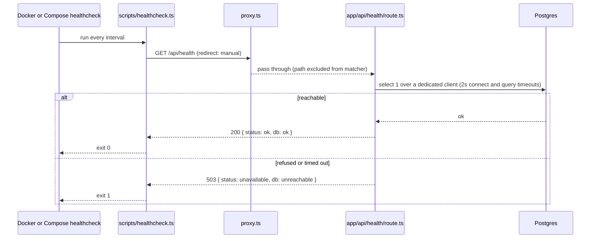

# Application Health Checks - Plan

## Goal Capsule

- **Objective:** An operator, reverse proxy, or orchestrator can tell whether a running MagStacker instance is serving and can reach its database, without logging in. `docker compose ps` reports the app as `healthy` only when that is true.
- **Means:** One unauthenticated `GET /api/health` route that probes the database over a dedicated, timeout-bounded connection, plus a Docker `HEALTHCHECK` and a Compose healthcheck that both run the same probe script (KTD1, KTD2, KTD4, KTD5).
- **Product authority:** GitHub issue #14, plus the Product Contract below.
- **Execution profile:** Small infrastructure change. One new route, one matcher exclusion, one probe script, two container config edits, one docs section, and tests at unit and end-to-end level.
- **Stop conditions:** No separate liveness and readiness endpoints. No auth on the endpoint. No pool-wide connection timeout change in `src/db/client.ts`. No restart-on-unhealthy automation. Surface a blocker rather than widening scope.

---

## Product Contract

### Summary

Add a health surface to the app. A route at `/api/health` answers 200 with a minimal JSON body when the app is serving and Postgres is reachable, and 503 when Postgres is not. The Dockerfile runner stage and the Compose `app` service both probe that route through one small Bun script, so container tooling sees real application health instead of only process liveness.

### Problem Frame

The `app` image has no `HEALTHCHECK` and the app has no HTTP health route. The Compose stack gates startup only on the database healthcheck, so nothing verifies that Next.js itself is up and can reach the database. A self-hosted operator, a reverse proxy, or an orchestrator has no readiness signal. The database-layer check already exists in `src/db/health.ts` as `checkDatabase()`. It is not exposed over HTTP.

Two repo facts make this less trivial than it looks. The Next 16 proxy in `proxy.ts` redirects every path outside its exclusion list to the login page, so a health route would answer 307 to unauthenticated probes. A plain `fetch` follows that redirect and resolves on the login page, so a naive probe would report healthy while checking the wrong page. Separately, the pg Pool in `src/db/client.ts` has no connection or query timeout. A probe that runs through that pool against a database host which accepts connections but never answers would pin one pool slot per probe, and the default pool of 10 would be exhausted by the healthcheck itself in under two minutes.

### Key Decisions

- **One endpoint reports both liveness and readiness.** Enough at this scale. Governs R1, R2. (session-settled: user-directed — chosen over separate `/api/health` and `/api/health/ready` endpoints: the issue judged one endpoint sufficient for a single-container homelab deployment.)
- **The endpoint is unauthenticated and leaks nothing.** Docker and orchestrator probes cannot carry a session. Governs R3, R4. (session-settled: user-directed — chosen over gating the route behind a Better Auth session: health probes cannot authenticate, so the body is minimal and carries no connection details or error text.)
- **The container probe does not depend on curl or wget.** Governs R7. (session-settled: user-directed — chosen over a plain `curl -f` HEALTHCHECK: the `oven/bun` slim image ships neither binary, so such a check would fail on every run.)

### Requirements

**Health route**

- R1. `GET /api/health` returns 200 with a JSON body of the shape `{ status: "ok", db: "ok" }` when the app is serving and the database probe succeeds (KTD2).
- R2. `GET /api/health` returns 503 with a JSON body of the shape `{ status: "unavailable", db: "unreachable" }` when the database probe fails or does not complete within its time bound (KTD2).
- R3. The route answers without a session. An unauthenticated request is not redirected to the login page.
- R4. The response body never contains a connection string, host, port, database name, or error message.
- R5. The route is never cached. It declares itself dynamic and sends a `Cache-Control: no-store` header.
- R6. The route performs no writes and no work beyond the single database probe, and a failed or timed-out probe leaves no connection checked out of the shared pool.

**Container health**

- R7. The Dockerfile runner stage declares a `HEALTHCHECK` that probes `http://127.0.0.1:<PORT>/api/health` using only binaries present in the slim Bun image, and reports unhealthy on a non-200 status, on a redirect, and on a network error.
- R8. The `app` service in `docker-compose.yml` declares a healthcheck running the same probe, so `docker compose ps` reports `healthy` once the app serves and can reach the database, and other services can gate on `condition: service_healthy`.

**Documentation**

- R9. `docs/deployment.md` documents the endpoint, its two responses, and how to read container health.

### Success Criteria

- A fresh `docker compose up --build -d` shows the `app` service as `healthy` in `docker compose ps` within the configured start period.
- Stopping the `db` service flips the route to 503 within one probe interval plus the route time bound, and the container to `unhealthy` after the configured retries. Starting `db` again flips both back without restarting `app`.

### Scope Boundaries

- No pool-wide `connectionTimeoutMillis` or query timeout on the shared pg Pool. The probe runs on its own connection with its own timeouts (KTD2). Changing the pool's timeouts affects every caller and is a separate decision.
- No restart-on-unhealthy behavior. Docker does not restart a container because it is unhealthy. The healthcheck is a signal for operators and dependants, not self-healing.
- No metrics, version, or build info in the health body.

#### Deferred to Follow-Up Work

- Pool-wide connection and query timeouts in `src/db/client.ts`, as a separate hardening decision for application traffic. This plan does not depend on it because the probe never touches the shared pool.
- A Compose `start_interval` for faster first-healthy on Docker 25+, once the minimum supported Docker version is pinned.

### Acceptance Examples

- AE1. **Covers R1, R3.** Given the stack is up and Postgres is reachable, when an unauthenticated client sends `GET /api/health`, then it receives 200, `application/json`, and a body equal to `{ "status": "ok", "db": "ok" }`.
- AE2. **Covers R2, R4.** Given Postgres refuses connections, when a client sends `GET /api/health`, then it receives 503 and a body equal to `{ "status": "unavailable", "db": "unreachable" }` with no host, port, or error text.
- AE3. **Covers R2, R6.** Given the database host accepts TCP connections but never answers, when a client sends `GET /api/health`, then it receives 503 within the probe time bound instead of hanging, and the shared pool has no more clients checked out afterwards than before.
- AE4. **Covers R7, R8.** Given the image is built and the stack started, when the operator runs `docker compose ps`, then the `app` service reports `healthy`.

### Sources

- GitHub issue #14 (product authority).
- `src/db/health.ts` — `checkDatabase()` runs `select 1` and returns a boolean, swallowing the cause.
- `src/db/client.ts` — lazy pg Pool with default `max` of 10; `closePool()` resets the cached connection. pg defaults `connectionTimeoutMillis` to 0 and sets no query timeout, meaning a hung query holds its pool client indefinitely.
- pg `Client` accepts per-connection `connectionTimeoutMillis` and `query_timeout` options, which is what lets the probe bound itself without touching the shared pool.
- `proxy.ts` — matcher excludes only `api/auth`, `login`, Next internals, and static assets.
- `src/lib/logging/entry-context.ts` — `withRequestContext` mints a correlation id and is silent per request.
- `src/backup/__tests__/routes.test.ts` — the pattern for testing a route handler with a repointed `DATABASE_URL` and `closePool()` restoration.
- `node_modules/next/dist/server/route-modules/app-route/helpers/auto-implement-methods.js` — Next auto-implements `HEAD` from an exported `GET`.
- `node_modules/next/dist/docs/01-app/01-getting-started/15-route-handlers.md` — route handlers are not cached by default; a database query makes them dynamic.

---

## Planning Contract

### Key Technical Decisions

- KTD1. **Route file at `app/api/health/route.ts`, wrapped in `withRequestContext("health", ...)`.** Mirrors every other route handler in `app/api/` so probes carry a correlation id. The wrapper logs nothing on its own, so a 10-second probe interval adds no log lines while healthy. Instantiates the first Key Decision.
- KTD2. **The route probes the database over a dedicated, short-lived pg client with 2-second connection and query timeouts, never through the shared pool, and destroys that client when the probe ends or times out.** A new `probeDatabase()` in `src/db/health.ts` owns this; `checkDatabase()` stays as it is for its existing callers and tests. A raced query through the shared pool would bound only the HTTP response: against a host that accepts connections but never answers, each probe would pin one pool client with nothing to release it, and at one probe per 10 seconds the default pool of 10 would be exhausted in under two minutes, starving every other route during the outage the probe exists to detect. One extra TCP connection per probe is the accepted cost.
- KTD3. **Exclude `api/health` in the `proxy.ts` matcher, beside `api/auth`.** Without it every unauthenticated probe is a 307 to the login page. The end-to-end spec in U2 is the regression guard, because the matcher is compiled by Next and is not unit-testable in isolation.
- KTD4. **One probe script at `scripts/healthcheck.ts`, run by Bun, is the single source of probe logic.** It reads `PORT` from the environment, fetches the route with redirects disabled, and exits 0 only on an exact 200. A redirect, any other status, or a thrown network error exits 1. `scripts/` is already copied into the runner stage, and the migrate service already runs TypeScript with Bun under the same read-only rootfs and dropped capabilities, so no new image layer is needed. (session-settled: user-directed — chosen over a `curl -f` HEALTHCHECK: the slim image has no curl or wget.)
- KTD5. **The Dockerfile `HEALTHCHECK` and the Compose `app` healthcheck both run the script in exec form with the same timings.** Exec form avoids the shell-variable expansion problem, since the script reads `PORT` itself. Compose overrides the image healthcheck when both exist, so restating it in Compose makes the timings visible and editable in the file operators actually touch, while the Dockerfile one covers a bare `docker run`. Timings: interval 10s, timeout 5s, retries 3, start period 20s. A comment in each file points at the other to keep them aligned.
- KTD6. **The route logs one `warn` line per failed probe, with no cause text, and nothing on success.** The probe returns only a boolean, and the repo forbids silent failure. One line per 10 seconds during an outage is acceptable volume and needs no transition state.
- KTD7. **`export const dynamic = "force-dynamic"` plus `Cache-Control: no-store`.** Route handlers are not cached by default in Next 16 and the database query already makes this one dynamic, but the explicit declaration matches the issue and the header keeps reverse proxies from caching a stale 200.

### High-Level Technical Design

### Assumptions

- Response strings are `"ok"`, `"unavailable"`, and `"unreachable"`. The issue fixed only the keys.
- The probe's connection and query timeouts are 2 seconds each, so the worst case of about 4 seconds stays inside the 5-second healthcheck timeout.
- Healthcheck timings are interval 10s, timeout 5s, retries 3, start period 20s. `next start` boots in a few seconds; 20 seconds covers a slow host.
- Compose restates the healthcheck rather than inheriting the image one, because the issue lists it as a scope item and its acceptance criterion names the Compose file.
- A closed local TCP port is a sound way to produce a deterministic refused connection in tests, and a listening socket that accepts and never replies is a sound way to produce a hung query.
- The documentation lives in `docs/deployment.md` as a new section after Ports.

### Sequencing

U1 first, since U2 and U3 both exercise the route. U2 and U3 are independent of each other.

---

## Implementation Units

### U1. Health route, proxy exemption, and unit tests

**Goal:** Serve `GET /api/health` per R1 through R6 and let it through the auth proxy.

**Requirements:** R1, R2, R3, R4, R5, R6. Implements KTD1, KTD2, KTD3, KTD6, KTD7.

**Dependencies:** None.

**Files:**
- Create `app/api/health/route.ts`
- Modify `src/db/health.ts` (add the bounded probe from KTD2)
- Modify `proxy.ts` (matcher exclusion only)
- Create `src/db/__tests__/health-route.test.ts`

**Approach:**
1. Add `probeDatabase()` to `src/db/health.ts` per KTD2: open a dedicated pg client from the configured database URL with the connection and query timeouts, run `select 1`, and end or destroy the client on every path, returning a boolean.
2. Add the route module: dynamic declaration, a `GET` handler through `withRequestContext`, a call to the bounded probe, and the two fixed bodies with `no-store`.
3. On the failure branch, emit the single `warn` line from KTD6 through the repo logger.
4. Add `api/health` to the negative lookahead in the `proxy.ts` matcher.
5. Write the test file before the route, following the `DATABASE_URL` repoint and `closePool()` restoration order in `src/backup/__tests__/routes.test.ts`, and using `containerTest` for the cases that wait on a timeout.

**Execution note:** Start with failing tests for the 200 and 503 contracts, then implement.

**Patterns to follow:**
- `app/api/export/route.ts` for the handler shape and the `withRequestContext` wrapper.
- `src/backup/__tests__/routes.test.ts` for importing the handler lazily after repointing `DATABASE_URL`, and for the `afterAll` order: close the pool, then restore or delete the variable.
- `src/test-support/container-test.ts` for the longer timeout on slow cases.
- `e2e/free-port.ts` for reserving a port that is known to be closed.

**Test scenarios:**
- Covers AE1. With the preload database reachable, `GET` returns 200, content type JSON, and body exactly `{ status: "ok", db: "ok" }`.
- The 200 response carries `Cache-Control: no-store`.
- Covers AE2. With `DATABASE_URL` pointed at a reserved closed port and the pool closed first, `GET` returns 503 and body exactly `{ status: "unavailable", db: "unreachable" }`.
- The 503 body serialized as text contains none of: the closed port number, `localhost`, `127.0.0.1`, `postgres`, or `ECONNREFUSED`.
- Covers AE3. With `DATABASE_URL` pointed at a local socket that accepts connections and never replies, `GET` resolves 503 in under 3 seconds.
- Covers AE3. After that hung-probe case, the shared pool reports the same number of total clients as before the request, proving the probe never borrowed from it.
- After the failure cases, the pool is closed and `DATABASE_URL` restored, and a final `GET` against the preload database returns 200 again, proving the singleton recovers.
- The handler does not read the session: the 200 case sends no cookie header.

**Verification:** `bun test src/db` passes with the new file included, and `bun run typecheck` and `bun run lint` are clean.

### U2. End-to-end contract through the real server

**Goal:** Prove R3 against the production build with the compiled proxy matcher active.

**Requirements:** R1, R3. Guards KTD3.

**Dependencies:** U1.

**Files:**
- Create `e2e/health.spec.ts`

**Approach:**
1. Use Playwright's plain `test` and its `request` fixture with no `storageState`, so the request carries no session cookie.
2. Send `GET /api/health` with redirects disabled and assert status and body.

**Patterns to follow:**
- `e2e/auth.spec.ts` for a spec that exercises the unauthenticated path.
- `e2e/README.md` for the harness contract; the launcher already boots a production build against an ephemeral Postgres.

**Test scenarios:**
- Covers AE1. Unauthenticated `GET /api/health` with `maxRedirects: 0` returns 200 and the ok body, never a 3xx.
- A `HEAD /api/health` returns 200 with an empty body, confirming Next's auto-implemented `HEAD`.

**Verification:** `bun run test:e2e e2e/health.spec.ts` passes locally with Docker running, and the full `bun run test:e2e` stays green.

### U3. Probe script, Dockerfile HEALTHCHECK, Compose healthcheck, and docs

**Goal:** Container tooling reports real application health per R7, R8, R9.

**Requirements:** R7, R8, R9. Implements KTD4, KTD5.

**Dependencies:** U1.

**Files:**
- Create `scripts/healthcheck.ts`
- Create `src/db/__tests__/healthcheck-script.test.ts` (under `src/`, so `bun test src` and the pre-commit gate run it)
- Modify `Dockerfile` (runner stage, after `USER bun` and the `PORT` env)
- Modify `docker-compose.yml` (`app` service)
- Modify `docs/deployment.md`

**Approach:**
1. Write the probe script per KTD4: build the URL from `PORT` with a 3000 fallback, fetch with `redirect: "manual"` and a request timeout below the healthcheck timeout, exit 0 only on status 200, exit 1 otherwise. Keep the decision in a small exported function so it is unit-testable without a server; the module runs the probe and sets the exit code only when it is the script being executed directly, so the test can import the function without triggering a fetch.
2. Add the `HEALTHCHECK` instruction in exec form with the KTD5 timings and a comment naming the Compose block.
3. Add the Compose `healthcheck` block to `app` with the same command and timings and a comment naming the Dockerfile instruction.
4. Add a short Health section to `docs/deployment.md` after Ports: the endpoint, the two bodies, `docker compose ps`, and the note that Docker does not restart an unhealthy container.

**Execution note:** This unit is mostly packaging. After the unit test for the exit-code decision, prove it with a runtime smoke: build the image, bring the stack up, watch `docker compose ps` reach `healthy`, stop `db`, watch it go `unhealthy`, start `db`, watch it recover.

**Patterns to follow:**
- The `db` service healthcheck block in `docker-compose.yml` for YAML shape.
- The `migrate` service, which already runs a TypeScript file with Bun under the same hardening, as the precedent for executing `scripts/healthcheck.ts` in the container.

**Test scenarios:**
- Status 200 maps to exit code 0.
- Status 503 maps to exit code 1.
- A 307 response with redirects disabled maps to exit code 1.
- A thrown network error maps to exit code 1.
- `PORT` unset builds a URL on port 3000; `PORT=4100` builds one on 4100.
- Runtime smoke, covers AE4: after `docker compose up --build -d`, `docker compose ps` shows `app` as `healthy` within the start period; stopping `db` makes it `unhealthy` after three retries; starting `db` returns it to `healthy` without an `app` restart.

**Verification:** The unit tests pass under `bun test src`, the image builds, and the smoke sequence above behaves as described.

---

## Verification Contract

| Check | Command | Proves |
|---|---|---|
| Full pre-commit gate | `just ci-check` | Lockfile, Biome lint and format, typecheck, pre-commit hooks, unit and integration tests, e2e |
| Route contract | `bun test src/db` | U1 scenarios including 503 and the time bound |
| Proxy exemption on the real server | `bun run test:e2e e2e/health.spec.ts` | U2 scenarios |
| Probe exit codes | `bun test src` | U3 unit scenarios |
| Container health | `docker compose up --build -d` then `docker compose ps` | AE4, manual smoke |

Docker must be running for every test command. The pre-commit gate is mandatory before each commit.

---

## Definition of Done

- All three units land on the existing issue branch and `just ci-check` is green.
- AE1 through AE4 hold: AE1 to AE3 by automated tests, AE4 by the recorded smoke run.
- The health body never includes connection details in any branch.
- `docs/deployment.md` carries the Health section.
- No abandoned experiments remain in the diff, and no pool-wide timeout change slipped into `src/db/client.ts`.
- The PR title is a Conventional Commit subject and the PR closes issue #14.
