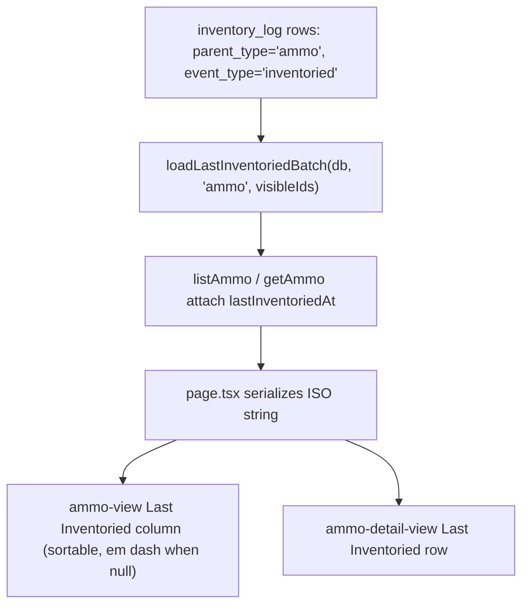

# Ammo Reconciliation Against a Physical Count - Plan

## Goal Capsule

- **Objective:** An owner or editor of an Ammo lot can record what they physically counted, the lot's stored quantity becomes that count, and anyone who can see the lot can later tell when it was last counted, who counted it, what the count was, and how far it was off. Low Stock then rests on the last physical count instead of a number nobody can trace, until someone edits the lot again.
- **Means:** Extend the existing Inventory Log to the `ammo` parent family with a reconciliation entry that stores the counted value and the on-record value and corrects the lot in the same transaction (KTD1, KTD2, KTD3).
- **Product authority:** GitHub issue #100. This plan bootstraps the Product Contract from the issue; the issue's three open questions are resolved under Assumptions and Outstanding Questions.
- **Execution profile:** Standard feature, 6 dependency-ordered units. Test-first for the domain validator and the reconcile transaction; live-schema tests for the migration; Playwright for the reconcile flow, sharing gates, and the Last Inventoried column.
- **Stop conditions:** A change to product scope beyond the Product Contract is a blocker, not an expansion. Any evidence that a reconciliation could land without its quantity update, or vice versa, is a blocker.
- **Tail ownership:** Feature branch + PR per repo git workflow; `just ci-check` must pass before every commit. One migration (`0024`), hand-edited after generation.
- **Open blockers:** None.

---

## Product Contract

### Summary

Ammo joins the Inventory Log. A **Reconcile** action on the ammo detail view takes a counted round figure, an optional back-dated time, and optional notes. Saving it appends an `inventoried` Log Entry that carries the counted rounds and the rounds on record at that moment, and sets the lot's quantity to the counted value in the same transaction. The detail view shows the reconciliation history newest first with the derived variance. The ammo list and detail show **Last Inventoried**, blank when the lot has never been counted. Log entries are child records of the lot: they inherit its owner and grants, are append-only, and are removed with it.

### Problem Frame

An Ammo lot's `quantity_rounds` is a stored counter that only changes when someone edits the lot form. Rounds get shot, boxes get split, lots get miscounted on entry, and none of that leaves a trace. The only fix is overwriting the number, which destroys the evidence: a lot reading 480 might have been counted or guessed. Low Stock and the `/summary` roll-ups are computed straight from that number, so an untrustworthy count makes the one surface the app exists to get right untrustworthy too. Firearms and Magazines already solve this with the Inventory Log and the derived Last Inventoried date. Ammo, the parent whose quantity drifts most, is the one family excluded. Shared inventory feels this hardest: several editors draw from the same lots and nobody can tell who last verified the number.

### Key Decisions

- **Record the observation, derive the delta.** A reconciliation stores the absolute counted value, never a signed adjustment. Governs R4, R5.
- **Reconciliation corrects the lot; quantity stays stored.** The stored quantity remains the single source of truth for Low Stock. This issue does not make quantity derived from a ledger. Governs R6, R14.
- **A variance is recorded, never blocked.** A surprising variance is the signal, not an error. Governs R7.
- **Reconciliation is an edit action.** The owner or an `edit` grantee may reconcile; a `view` grantee sees the history. Governs R8, R9.
- **A count older than the lot's latest recorded count is history, not a correction.** It is appended and attributed but does not replace the current quantity. Governs R5, R13.
- **The lot form stays as it is.** Direct quantity edits remain possible and unlogged; Reconcile is the audited path to a new quantity, not the only one. Governs R5; see Scope Boundaries.
- **Last Inventoried on the CSV export and stale-lot flags on `/summary` are deferred.** See Scope Boundaries.

### Requirements

**Domain and data**

- R1. `ammo` is a valid Inventory Log parent family whose only Event Type is `inventoried`.
- R2. An `ammo` Log Entry carries the counted rounds, a whole number from 0 to the int4 maximum; an entry for any other parent family carries none.
- R3. An `ammo` Log Entry also carries the rounds on record for the lot immediately before the reconciliation was applied.
- R4. The variance of a reconciliation is counted rounds minus rounds on record, derived wherever it is shown and never stored.
- R5. Reconciling a lot appends the Log Entry and, unless a later-dated reconciliation already exists for the lot, sets the lot's quantity to the counted value, in one transaction; the quantity never changes without its entry.
- R6. A lot's Low Stock state reflects the new quantity immediately after a reconciliation, with no change to how Low Stock is derived.
- R7. Any counted value that passes R2 is accepted; no variance magnitude is rejected or requires confirmation beyond the preview in R12.

**Permissions and lifecycle**

- R8. The lot's owner or a grantee holding an `edit` Grant may reconcile; a `view` grantee may not, and an actor who cannot see the lot receives not-found.
- R9. Anyone who can see the lot can list its reconciliation history, with each entry attributed to the acting user by display name.
- R10. Ammo Log Entries are child records: created and listed, never edited or deleted, and removed with the lot.
- R11. A Log Entry's `occurredAt` may be back-dated but not in the future, exactly as for firearm and magazine entries.

**Reconcile UI**

- R12. The ammo detail view offers a Reconcile action to actors who may edit, with a counted-rounds field, an optional date and time, optional notes, and a live variance preview against the quantity currently on record before the user confirms.
- R13. The ammo detail view lists reconciliation history newest first with date and time, actor, counted rounds, variance, and notes, and marks an entry whose count was not applied because a later-dated count already existed.
- R14. After a reconciliation the detail view's quantity and Low Stock indicator, the ammo list, and `/summary` reflect the new quantity without a manual reload.

**Last Inventoried**

- R15. An Ammo lot's Last Inventoried is the `occurredAt` of its most recent `inventoried` Log Entry, blank as a first-class state when it has none, and derived only from entries visible through the lot.
- R16. The ammo list shows a default-visible, sortable Last Inventoried column that renders an absolute date or an em dash, with never-inventoried lots sorting as most stale; the detail view shows the same value as a row.
- R17. Last Inventoried is batch-loaded for the list in one grouped query, never per row.

**Documentation and testing**

- R18. `CONCEPTS.md` records that Ammo has a child record family, that Event Type has an `ammo` parent family, and defines Reconciliation and its variance under derived values; Last Inventoried covers Ammo as well as Magazines.
- R19. UI is targeted in tests via ARIA roles, accessible names, or visible text; no `data-testid`.
- R20. Coverage exists at three layers: unit tests for the validator and pure helpers, Testcontainers integration tests for the transaction, authorization, cascade, and derivation, and Playwright end-to-end tests for the reconcile flow, sharing gates, and the list column.

### Acceptance Examples

- AE1. Reconcile with a shortfall.
  - **Given:** a lot with 500 rounds on record.
  - **When:** the owner reconciles with a count of 480.
  - **Then:** the lot's quantity is 480; one new entry shows counted 480, on record 500, variance −20; Last Inventoried is the entry's time.
  - **Covers:** R2, R3, R4, R5, R13, R15.
- AE2. Zero variance.
  - **Given:** a lot with 100 rounds on record.
  - **When:** an editor reconciles with a count of 100.
  - **Then:** the entry is appended with variance 0 and the quantity is unchanged.
  - **Covers:** R5, R7.
- AE3. Edit between reconciliations.
  - **Given:** a reconciliation counted 100, then the owner edited the lot form down to 80 with no log entry.
  - **When:** a second reconciliation counts 75.
  - **Then:** the second entry shows on record 80 and variance −5, not −25.
  - **Covers:** R3, R4.
- AE4. Low Stock flips.
  - **Given:** a lot with 200 rounds and a threshold of 50.
  - **When:** it is reconciled to 40.
  - **Then:** the detail view, the list, and `/summary` show it as Low Stock without a manual reload.
  - **Covers:** R6, R14.
- AE5. View grantee.
  - **Given:** a lot shared with `view`.
  - **Then:** the grantee sees the reconciliation history and the Last Inventoried value but no Reconcile control, and a direct reconcile call is rejected as not authorized.
  - **Covers:** R8, R9.
- AE6. Edit grantee.
  - **Given:** a lot shared with `edit`.
  - **When:** the grantee reconciles.
  - **Then:** the entry is attributed to the grantee's name, and the owner sees it.
  - **Covers:** R8, R9.
- AE7. Lot deleted.
  - **Given:** a lot with reconciliation entries.
  - **When:** the owner deletes it.
  - **Then:** its Log Entries are gone.
  - **Covers:** R10.
- AE8. Never counted.
  - **Given:** a lot with no entries.
  - **Then:** the list cell and the detail row show an em dash, and the lot sorts as most stale in both sort directions.
  - **Covers:** R15, R16.
- AE9. Back-dated count behind a newer one.
  - **Given:** a lot reconciled today to 300.
  - **When:** an editor adds a count of 320 dated last week.
  - **Then:** the quantity stays 300, the entry lists below today's entry marked as not applied with on record 300 and variance +20, and Last Inventoried stays today.
  - **Covers:** R5, R11, R13, R15.
- AE11. Back-dated count with nothing newer.
  - **Given:** a lot with 300 rounds on record and no entry since last month.
  - **When:** an editor adds a count of 280 dated yesterday.
  - **Then:** the quantity becomes 280 and Last Inventoried is yesterday.
  - **Covers:** R5, R11, R15.
- AE10. Firearm entry cannot smuggle a count.
  - **Given:** a firearm.
  - **When:** a log entry with counted rounds is submitted for it.
  - **Then:** it is rejected by the validator and, if forced, by the database.
  - **Covers:** R2.

### Scope Boundaries

- Editing or deleting Log Entries of any family: out of scope; the log stays append-only.
- Automatic deduction of rounds fired from range sessions: out of scope. The FK-less `range_session.ammo_id` seam stays untouched.
- Making `quantity_rounds` derived from an acquisitions/consumption ledger: out of scope.
- Firearm and magazine log behavior: unchanged, apart from the exhaustive-dispatch refactor in KTD4.
- Direct quantity edits through the lot form: unchanged and unlogged. Reconcile is the audited path to a new quantity, not the only one; a later edit shows as drift only when someone reconciles again.
- Correcting a mistaken count: a new reconciliation. Entries are never edited.

#### Deferred to Follow-Up Work

- A `Last Inventoried` column in the ammo CSV export (issue open question 2). The value is on the list row after U3, so the addition is small, but no CSV in the repo carries a derived date today and it is not needed for the issue's outcome.
- `/summary` flagging lots never reconciled or stale past an age (issue open question 3).
- An inventory-staleness filter on the ammo list, mirroring the magazines preset filter.
- `/summary` revalidation after the existing ammo create, update, and delete actions, which is stale today; this plan adds it for reconcile only.
- A newly-acquired versus long-neglected distinction among never-inventoried lots (carried from the magazine plan).
- An "edited since last count" indicator on the list and detail when the stored quantity no longer equals the latest applied count.
- A stale-preview guard that rejects a reconcile when the previewed on-record value no longer matches the locked quantity; today the stored on-record value is authoritative and visible in the history.

### Outstanding Questions

Resolved during planning:

- Should a variance be blocked or recorded? Recorded, never blocked (Key Decisions, R7).
- CSV export column? Deferred (Scope Boundaries).
- `/summary` stale flags? Deferred (Scope Boundaries).
- Does a back-dated reconciliation overwrite the current quantity? Only when no later-dated reconciliation exists (KTD5).

### Sources

- Issue #100, and related shipped issues #7 (ammo inventory), #11 (shot counts), #46 (inventory log), #70 (magazine Last Inventoried).
- `docs/plans/2026-07-06-001-feat-inventory-log-plan.md` — KTD1 polymorphic table, KTD2 per-family write authorization, KTD3 constants as single source, KTD6 cleanup trigger.
- `docs/plans/2026-07-06-002-feat-ammo-inventory-plan.md` — KTD4 edit-capable sharing, the deliberate exclusion of ammo from the log and its U2 regression test.
- `docs/plans/2026-07-13-001-feat-magazine-last-inventoried-plan.md` — KTD-2 loader trust model, KTD-4 never-sorts-stale, KTD-5 `parentType` loader parameter kept for reuse.
- `docs/solutions/logic-errors/non-exhaustive-union-dispatch-silently-routes-to-wrong-table.md` — the dispatch shape that would give ammo the magazine's owner-only authorization.
- `docs/solutions/architecture-patterns/enforcing-a-cross-table-invariant-at-every-write-path.md` — enumerate every write path; lock before the dependent read.
- `docs/solutions/logic-errors/num-helper-coerces-nan-to-zero-bypassing-ammo-validation.md` — numeric input must not launder NaN into 0.
- `docs/solutions/conventions/migration-tests-are-temporary.md` — additive migrations get live-schema tests, not a temporary migration test.
- `docs/solutions/runtime-errors/tanstack-autoreset-render-loop-unstable-data.md`, `docs/solutions/test-failures/playwright-accessible-name-matches-by-substring.md`, `docs/solutions/test-failures/timezone-fragile-date-boundary-tests.md`.
- `CONCEPTS.md` — Inventory Log, Event Type, Child record, Low Stock, Last Inventoried.

---

## Planning Contract

**Product Contract preservation:** bootstrapped from issue #100; no upstream contract to preserve. One refinement beyond the issue's text: R3 stores the on-record quantity alongside the counted value (KTD2).

### Key Technical Decisions

- KTD1. **Extend `inventory_log`; reuse `inventoried`.** Add `AMMO_LOG_EVENTS = ["inventoried"]` in `src/domain/inventory-log/constants.ts` and widen both DB CHECKs. No new event type: `loadLastInventoriedBatch` filters on `inventoried` and serves ammo unchanged (magazine plan KTD-5). A separate `ammo_count` table would duplicate the polymorphic parent, actor attribution, and cascade machinery.
- KTD2. **Two nullable integer columns: `counted_rounds` and `recorded_rounds`.** `recorded_rounds` snapshots the lot's quantity read under a row lock immediately before the update; variance is `counted − recorded` (R4). Deriving variance from the previous log entry is wrong whenever the edit form changes the quantity between counts (AE3). One CHECK backstops the family rule: for `parent_type = 'ammo'` both columns are non-null and `>= 0`; for every other family both are null. The domain validator is the primary gate.
- KTD3. **One write path; the invariant lives inside it.** `createLogEntry` in `src/domain/inventory-log/service.ts` stays the only insert into `inventory_log`. For an `ammo` parent it runs, inside its transaction: `authorizeUpdate`, `SELECT … FOR UPDATE` on the `ammo` row, snapshot `quantityRounds` into `recordedRounds`, insert the entry, update `quantityRounds` and `updatedAt`. `reconcileAmmo(actorId, ammoId, { countedRounds, occurredAt?, notes? })` is a named wrapper, like `markInventoried`. `markInventoried` on an ammo parent fails validation with `countedRoundsRequired`, so a countless ammo entry is unreachable from every service path. The alternative, a dedicated reconcile function that bypasses `createLogEntry`, leaves the generic path reachable for ammo and moves the rule to convention.
- KTD4. **Every family dispatch becomes exhaustive.** Add `LOG_PARENT_TYPES = ["firearm", "magazine", "ammo"]` and a `LogParentType` union to `constants.ts`. `isValidEventType` reads a `Record<LogParentType, ReadonlySet<string>>`; `validateLogEntry` checks membership in `LOG_PARENT_TYPES`; `authorizeLogWrite` becomes a `switch` with a `never`-typed default: firearm → `authorizeUpdate`, magazine → `authorizeOwnerOnlyUpdate`, ammo → `authorizeUpdate`. Today's if/else would silently give ammo the magazine's owner-only gate, contradicting R8 and ammo plan KTD4. `InventoryLogHistory`'s `parentType` prop narrows to `Exclude<LogParentType, "ammo">` so the generic Log/Mark controls cannot be mounted on a lot.
- KTD5. **The newest-dated count owns the quantity.** Inside the reconcile transaction, after the row lock, the service reads the lot's latest `inventoried` `occurredAt`; when the new entry's `occurredAt` is older, the entry is inserted with its snapshot but the quantity update is skipped (R5, AE9, AE11). History and Last Inventoried are ordered by `occurredAt`, so the quantity and Last Inventoried always describe the same observation. Applying every count in write order would let a late-entered old count silently roll a fresher count back, and the variance column would reveal that only to someone auditing later. The history derives the not-applied mark client-side: an entry is not applied when a later-dated entry was created before it.
- KTD6. **Ammo history is a sibling component, not a branch of `InventoryLogHistory`.** `app/(app)/ammo/reconcile-history.tsx` and `app/(app)/ammo/reconcile-form.tsx` own the ammo columns (Counted, Variance) and the counted-rounds field; they reuse `listLogAction` for reads, the `LogEntryWithActor` shape, and `formatTimestamp` exported from `app/(app)/inventory-log/inventory-log-history.tsx`. The two surfaces differ in columns, header actions, form, and write shape; branching the shared component on family would leak ammo concerns into the firearm and magazine views.
- KTD7. **Last Inventoried attaches in `listAmmo` and `getAmmo`.** Ammo has no `filter.ts` layer, so `listAmmo` in `src/domain/ammo/service.ts` calls `loadLastInventoriedBatch(db, "ammo", visibleIds)` and attaches `lastInventoriedAt: Date | null`; `getAmmo` does the same for one id. The visible-id set is the R15 enforcement point (magazine plan KTD-2). The pure `formatLastInventoried` and `lastInventoriedSortValue` helpers move from `app/(app)/magazines/last-inventoried.ts` to `app/(app)/inventory-log/last-inventoried.ts` with their tests; magazines import the new path.
- KTD8. **One hand-edited migration, live-schema tests only.** `bun run db:generate` emits the two `ADD COLUMN`s; the migration file is then hand-edited to `DROP`/`ADD` the two existing CHECKs, add the counted/recorded CHECK, and add `ammo_inventory_log_cleanup BEFORE DELETE ON "ammo"` wired to the existing `delete_inventory_log_for_parent('ammo')`, mirroring `0008_brown_bulldozer.sql` and `0020_naive_scarlet_spider.sql`. The migration is additive, so assertions live in `src/db/__tests__/schema.test.ts` against the shared container, not in a temporary migration test.
- KTD9. **Reconcile revalidates `/ammo` and `/summary`.** `reconcileAmmoAction` in `app/(app)/inventory-log/log-actions.ts` calls `revalidatePath` for both, and the detail view refreshes the router after the action so quantity and Low Stock update (R14). Backup and restore need no change: export and import are column-agnostic.

### Assumptions

- A back-dated count behind a newer one is recorded but does not change the quantity (KTD5). The opposite rule, every count applied in write order, is a one-branch change in U2 if the owner prefers it.
- The counted-rounds field is required and the Reconcile form has no other event type; ammo offers no bare "Mark inventoried" quick action because a count without a number is meaningless for a lot.
- The reconcile form's date defaults to now, editable to a past time, matching `LogEntryForm`.
- The history card is titled "Reconciliation history" and the control "Reconcile…"; the stored event type is still `inventoried`.

### High-Level Technical Design

The reconcile transaction, the one place the R5 invariant is enforced:

```mermaid
sequenceDiagram
  participant UI as ReconcileForm
  participant A as reconcileAmmoAction
  participant S as createLogEntry (ammo branch)
  participant DB as Postgres
  UI->>A: countedRounds, occurredAt, notes
  A->>S: validateLogEntry (countedRounds required for ammo)
  S->>DB: BEGIN
  S->>DB: authorizeUpdate(ammo, id) — owner or edit grantee
  S->>DB: SELECT quantity_rounds FROM ammo WHERE id FOR UPDATE
  S->>DB: SELECT max(occurred_at) FROM inventory_log for this lot (KTD5)
  S->>DB: INSERT inventory_log (inventoried, counted_rounds, recorded_rounds = locked quantity)
  S->>DB: UPDATE ammo SET quantity_rounds = counted, updated_at = now() — skipped when a later-dated entry exists
  S->>DB: COMMIT
  A->>UI: revalidate /ammo, /summary; router.refresh()
```

Last Inventoried fan-out for ammo, mirroring the magazine path:



### Sequencing

`U1` (constants, validator, schema, migration) → `U2` (service write path) → `U3` (Last Inventoried) and `U4` (Reconcile UI) in either order → `U5` (end-to-end) → `U6` (docs). `U3` and `U4` both depend on `U2` only.

### System-Wide Impact

- **Auth boundary:** ammo log writes go through `authorizeUpdate`; a wrong dispatch arm silently changes who may reconcile (KTD4). Existence stays hidden: an unseen lot yields not-found on both write and read.
- **Data lifecycle:** a new cleanup trigger on `ammo`; user delete cascades to lots, and the trigger then removes their entries. `actor_id` stays `ON DELETE SET NULL`, so a deleted editor's entries survive as "Unknown".
- **Existing test that encodes the exclusion:** the `validate.test.ts` regression "ammo is a valid ParentType but is still rejected as a log parent" must be inverted, not deleted. The exclusion comments in `ammo-detail-view.tsx` and on the `ammo` table in `inventory-schema.ts` are removed.
- **Shared component contract:** `InventoryLogHistory` and its `eventTypes` ternary become firearm/magazine-only by type, and `logEventAction`/`markInventoriedAction` gain no ammo behavior.

---

## Implementation Units

### U1. Domain constants, validator, schema, and migration

- **Goal:** Make `ammo` a valid log parent with a required counted value and on-record snapshot, gated by the domain validator and backstopped by the database, with cascade cleanup on lot delete.
- **Requirements:** R1, R2, R3, R10, R11.
- **Dependencies:** none.
- **Files:** `src/domain/inventory-log/constants.ts`, `src/domain/inventory-log/validate.ts`, `src/domain/inventory-log/__tests__/validate.test.ts`, `src/domain/validation-messages.ts`, `src/db/inventory-schema.ts`, `src/db/migrations/0024_<generated>.sql`, `src/db/migrations/meta/*`, `src/db/__tests__/schema.test.ts`.
- **Approach:**
  1. `constants.ts`: add `AMMO_LOG_EVENTS`, `LOG_PARENT_TYPES`, `LogParentType`; make `isValidEventType` an exhaustive lookup (KTD4).
  2. `validate.ts`: `LogEntryInput` gains optional `countedRounds`; the parent check uses `LOG_PARENT_TYPES`; new codes `countedRoundsRequired`, `countedRoundsNotAllowed`, `negativeCountedRounds`, `invalidCountedRounds` (whole number, at most `MAX_COUNT` from `src/domain/ammo/validate.ts`; export `isStorableCount` there rather than redeclaring it). The validator does not take `recordedRounds`: the service supplies it.
  3. `validation-messages.ts`: messages for the four codes.
  4. `inventory-schema.ts`: add `countedRounds` and `recordedRounds` nullable integer columns; widen `inventory_log_parent_type_valid`; add the ammo arm to `inventory_log_event_type_valid`; add `inventory_log_counts_by_family` per KTD2; update the `ammo` table's doc comment.
  5. Run `bun run db:generate`, then hand-edit the migration for the CHECK drop/add pairs and the `ammo_inventory_log_cleanup` trigger (KTD8).
  6. Invert the `validate.test.ts` regression that asserts ammo is rejected.
- **Execution note:** Write the validator tests first; they are pure and fail immediately.
- **Patterns to follow:** `src/db/migrations/0008_brown_bulldozer.sql` (trigger), `0020_naive_scarlet_spider.sql` (CHECK drop/add), `src/db/__tests__/schema.test.ts` "deleting an ammo lot removes its grant rows" (trigger assertion shape), `src/auth/visibility.ts` `parentTable` (exhaustive switch with compile-time guard).
- **Test scenarios:**
  - Unit: an `ammo` entry with `countedRounds: 480` and event `inventoried` validates clean.
  - Unit: an `ammo` entry without `countedRounds` returns `countedRoundsRequired`.
  - Unit: `countedRounds` of `-1`, `1.5`, `NaN`, and `MAX_COUNT + 1` return `negativeCountedRounds` or `invalidCountedRounds`; `0` and `MAX_COUNT` pass.
  - Unit: Covers AE10. A `firearm` or `magazine` entry with `countedRounds` returns `countedRoundsNotAllowed`.
  - Unit: `accessory` as parent still returns `invalidParentType`; `ammo` with event `cleaned` returns `invalidEventType`.
  - Unit: existing firearm and magazine validations are unchanged (future `occurredAt`, invalid date).
  - Integration (`schema.test.ts`): inserting an `ammo` log row with both counts succeeds; without `counted_rounds` or with a negative value it is rejected by the CHECK.
  - Integration: a `firearm` log row carrying `counted_rounds` is rejected by the CHECK.
  - Integration: Covers AE7. Deleting an `ammo` row removes its `inventory_log` rows via the trigger; firearm and magazine rows for other parents are untouched.
- **Verification:** `bun run db:migrate` applies cleanly on a fresh database and the Testcontainers preload; validator and schema tests green; `bun run typecheck` clean.

### U2. Single write path with the reconcile transaction

- **Goal:** `createLogEntry` handles the ammo family end to end, `reconcileAmmo` names the operation, and authorization dispatch is exhaustive.
- **Requirements:** R3, R5, R7, R8, R9, R10, R11.
- **Dependencies:** U1.
- **Files:** `src/domain/inventory-log/service.ts`, `src/domain/inventory-log/__tests__/service.test.ts`.
- **Approach:**
  1. `authorizeLogWrite` becomes the exhaustive switch in KTD4.
  2. Inside the `createLogEntry` transaction, after authorization, branch on `ammo`: lock the lot row `FOR UPDATE`, read `quantityRounds`, read the lot's latest `inventoried` `occurredAt`, insert with `countedRounds` and `recordedRounds`, then update the lot unless the new `occurredAt` is older than that latest entry (KTD3, KTD5). The `NotFoundError` path for a vanished row stays inside the transaction. `actorId` is always the session user the action passes in; the input carries no actor field.
  3. Add `reconcileAmmo(actorId, ammoId, input)` as a wrapper that fixes `parentType` and `eventType`.
  4. `listLogForParent` needs no change beyond the wider type; returned rows carry both counts.
- **Execution note:** Start with a failing integration test for AE1 and AE3; they pin the snapshot semantics before any code moves.
- **Patterns to follow:** `createLogEntry`'s validate-then-transaction shape; `src/domain/magazines/compatibility.ts` and `src/domain/firearms/service.ts` for `FOR UPDATE` locking before a dependent read; `expectRejects` from `src/test-support/assertions.ts`.
- **Test scenarios:**
  - Integration: Covers AE1. Owner reconciles 500 → 480: the lot reads 480, the entry has counted 480 and recorded 500, `actorId` is the owner.
  - Integration: Covers AE2. Counted equals quantity: entry appended, quantity unchanged, `updatedAt` advanced.
  - Integration: Covers AE3. Reconcile to 100, `updateAmmo` to 80, reconcile to 75: the second entry has recorded 80.
  - Integration: Covers AE9. A reconciliation dated before an existing entry is appended with recorded 300 and counted 320, the quantity stays 300, and `listLogForParent` orders it below the newer entry.
  - Integration: Covers AE11. A reconciliation dated yesterday with no newer entry sets the quantity.
  - Integration: Covers R12, R13. Notes are stored and returned unchanged; an omitted note is stored as an empty string.
  - Integration: Covers AE5, AE6, R8. Edit grantee succeeds and is attributed; view grantee gets `NotAuthorizedError` and no entry or quantity change; stranger gets `NotFoundError`.
  - Integration: `markInventoried` on an ammo lot throws `ValidationError` with `countedRoundsRequired` and writes nothing.
  - Integration: `createLogEntry` for a firearm with `countedRounds` throws `ValidationError`; firearm and magazine authorization behavior is unchanged (magazine view grantee still rejected owner-only).
  - Integration: a validation failure or authorization failure leaves both `inventory_log` and `ammo` untouched (no partial write).
  - Integration: counted 0 is accepted and the lot reads 0.
  - Integration: Covers AE7. `deleteAmmo` on a lot with entries removes them; `listLogForParent` by the owner then throws not-found.
- **Verification:** service tests green; a grep confirms `inventory_log` is inserted from exactly one place.

### U3. Last Inventoried for ammo on list and detail

- **Goal:** Attach the derived date to ammo rows, share the pure helpers with magazines, and render the column and detail row.
- **Requirements:** R15, R16, R17.
- **Dependencies:** U2.
- **Files:** `src/domain/ammo/service.ts`, `src/domain/ammo/__tests__/service.test.ts`, `app/(app)/inventory-log/last-inventoried.ts` (moved from `app/(app)/magazines/last-inventoried.ts`), `app/(app)/inventory-log/__tests__/last-inventoried-column.test.ts` and `last-inventoried-sort.test.ts` (moved from `app/(app)/magazines/__tests__/`), `app/(app)/magazines/magazines-view.tsx` (import path), `app/(app)/ammo/page.tsx`, `app/(app)/ammo/ammo-view.tsx`, `app/(app)/ammo/[id]/page.tsx`, `app/(app)/ammo/ammo-detail-view.tsx`.
- **Approach:**
  1. `listAmmo` batches `loadLastInventoriedBatch(db, "ammo", visibleIds)` after the visibility-scoped select and attaches `lastInventoriedAt`; `getAmmo` attaches it for the single id (KTD7). Export an `AmmoListRow` type.
  2. Move the two pure helpers and their tests; update the magazine import.
  3. `page.tsx` serializes to an ISO string on `AmmoListItem`; `ammo-view.tsx` adds a default-visible, sortable "Last inventoried" column using the shared helpers, with never-inventoried at the stale end in both directions (magazine plan KTD-4 handling).
  4. `[id]/page.tsx` serializes the value to an ISO string; `ammo-detail-view.tsx` adds a "Last inventoried" `DetailRow` rendered through `formatLastInventoried` (em dash when null). Magazines have no such detail row today; the list column is the precedent.
- **Patterns to follow:** `src/domain/magazines/filter.ts` (batch + attach), the magazines "Last inventoried" column definition, `DetailRow`/`orDash` in `components/ui/detail-row.tsx`.
- **Test scenarios:**
  - Integration: Covers AE1, R15. A lot with two entries carries the later `occurredAt`; a lot with none carries `null`.
  - Integration: Covers R15. A lot shared to a grantee carries its date for that grantee; a lot not visible to the actor never appears, so the loader receives only visible ids.
  - Integration: `getAmmo` returns `lastInventoriedAt` alongside the permission.
  - Unit: the moved helper tests pass at the new path unchanged.
  - Unit: sorting the ammo table places never-inventoried rows at the stale end under both ascending and descending.
  - End-to-end (in U5): the column is present by default, shows an em dash before reconciling and a date after; the detail row matches.
- **Verification:** the derivation is one grouped query per list load; magazine list unchanged; typecheck and tests green.

### U4. Reconcile action, form, and history on the ammo detail view

- **Goal:** Let an owner or editor reconcile from the detail view with a live variance preview, and show every viewer the reconciliation history.
- **Requirements:** R6, R8, R9, R12, R13, R14.
- **Dependencies:** U2.
- **Files:** `app/(app)/inventory-log/log-actions.ts`, `app/(app)/inventory-log/inventory-log-history.tsx` (export `formatTimestamp`, narrow `parentType`), `app/(app)/ammo/reconcile-form.tsx`, `app/(app)/ammo/reconcile-history.tsx`, `app/(app)/ammo/variance.ts`, `app/(app)/ammo/__tests__/variance.test.ts`, `app/(app)/ammo/ammo-detail-view.tsx`, `app/(app)/ammo/ammo-form.tsx` (export the NaN-safe numeric parser).
- **Approach:**
  1. `log-actions.ts`: add `reconcileAmmoAction(ammoId, input)` wrapped in `withActionContext` like its siblings, so the actor id comes from the session and never from the client; it calls `reconcileAmmo`, then `revalidatePath("/ammo")` and `revalidatePath("/summary")` (KTD9). `listLogAction` already accepts any visible parent.
  2. `variance.ts`: pure `computeVariance(counted, recorded)`, `formatVariance` (signed, tabular), and `isCountApplied(entry, entries)` (false when a later-dated entry was created before it, KTD5). Used by the form preview and the history columns.
  3. `reconcile-form.tsx`: counted-rounds input starting empty (`inputMode="numeric"`, `min` 0, `max` = `MAX_COUNT`), date and time defaulting to now, notes; parse with the NaN-safe helper exported from `ammo-form.tsx`; validate client-side with `validateLogEntry`, wire every counted-rounds code to the field's error and `aria-invalid`, move focus to the first invalid field. The variance preview reads "Variance: —" until the field parses as a whole number, then "Variance: −20" from the `quantityOnRecord` prop; it lives in an `aria-live="polite"` region linked to the field by `aria-describedby`, mirroring the app's announced validation state. Submit via `reconcileAmmoAction`; toast "Reconciled".
  4. `reconcile-history.tsx`: mirrors `InventoryLogHistory`'s load, error, and retry states; the empty state reads "No reconciliations yet. Reconcile this lot to record its first count." for editors and "No reconciliations have been recorded for this lot." for viewers; header "Reconciliation history" with a "Reconcile…" toggle when `canEdit`; memoized columns Timestamp, Actor, Counted, Variance, Notes, with a "Not applied" mark on the Counted cell per `isCountApplied`; memoized data. After a successful reconcile it reloads its own entries and then calls `onChange`, as `afterMutation` does in `InventoryLogHistory`.
  5. `ammo-detail-view.tsx`: replace the exclusion comment with the history card, passing `canEdit`, `quantityOnRecord`, and `onChange={() => router.refresh()}`.
- **Execution note:** The server snapshot is authoritative; the client preview may be stale under concurrent edits, and the history row shows the stored values.
- **Patterns to follow:** `app/(app)/inventory-log/log-entry-form.tsx` (client validate → action → merge codes, focus management), `inventory-log-history.tsx` (request-supersession ref, memoized columns), the fixed numeric parser in `ammo-form.tsx`.
- **Test scenarios:**
  - Unit: `computeVariance(480, 500)` is −20; `(100, 100)` is 0; `formatVariance` renders a leading sign for non-zero and plain 0.
  - Unit: the numeric parser maps an empty string and non-numeric text to NaN, never 0, so the validator reports `invalidCountedRounds`.
  - Unit: the preview renders an em dash for an empty or unparsable field and the signed variance for a valid one.
  - Unit: `isCountApplied` is false for an entry dated before a later-dated entry that was created earlier, true otherwise.
  - End-to-end (in U5): Covers AE1, AE2, AE4, AE5, AE6, R12, R13, R14.
- **Verification:** form errors render for every code; history refreshes without reload; quantity and Low Stock badge update after reconcile; the action resolves the actor from the session only.

### U5. End-to-end coverage

- **Goal:** Prove the reconcile flow, sharing gates, and Last Inventoried column through the real browser.
- **Requirements:** R19, R20 plus the AEs below.
- **Dependencies:** U3, U4.
- **Files:** `e2e/ammo-reconcile.spec.ts` (new), `e2e/fixtures/user-pool.ts` (keys `ammo-reconcile`, `ammo-reconcile-editor`, `ammo-reconcile-viewer`).
- **Approach:** One sequential owner test plus a two-context sharing test, `retries: 0`, mirroring `e2e/inventory-log.spec.ts` and `e2e/inventory-log-sharing.spec.ts`. Target the history table by its "Counted" column header; use `exact: true` where "Reconcile…" could substring-match. Assert dates with a locale-tolerant pattern, not a fixed string.
- **Patterns to follow:** `e2e/ammo.spec.ts`, `e2e/inventory-log-sharing.spec.ts`, `e2e/magazine-inventory-filter.spec.ts` for column assertions.
- **Test scenarios:**
  - Covers AE8. A new lot shows an em dash in the Last inventoried column and detail row.
  - Covers AE1, R12, R13. Reconcile 500 → 480: the preview reads −20 before confirm; after confirm the history's first row shows 480 and −20, the quantity row reads 480, and the list column shows a date.
  - Covers AE4, R14. Reconcile a lot below its threshold: the Low stock badge appears on the detail and list, and `/summary` counts it.
  - Covers AE2. Reconcile with the same count: a row with variance 0.
  - Covers AE9. A count dated before the newer row lists below it marked "Not applied", the quantity row is unchanged, and the column keeps the newer date.
  - Covers R12, R13. A reconcile with the note "Box damaged" shows the note in the history row.
  - Covers R16. With one dated lot and one never-counted lot, clicking the Last inventoried header ascending and then descending keeps the em-dash row at the stale end.
  - Invalid input: empty and negative counted rounds show the field error and do not submit.
  - Covers AE6. An edit grantee reconciles; the actor column shows the grantee's name to the owner.
  - Covers AE5. A view grantee sees the history and the Last inventoried row but no "Reconcile…" button.
  - Regression: the firearm and magazine log flows in `e2e/inventory-log.spec.ts` still pass.
- **Verification:** `bun run test:e2e` green including the existing inventory-log and ammo specs.

### U6. Documentation and comment hygiene

- **Goal:** Make the glossary and in-code rationale match shipped behavior.
- **Requirements:** R18.
- **Dependencies:** U1, U2, U3, U4.
- **Files:** `CONCEPTS.md`, `src/db/inventory-schema.ts` (doc comments on `ammo` and `inventoryLog`), `src/domain/inventory-log/validate.ts` and `constants.ts` (header comments).
- **Approach:** Update Ammo (gains a child record family), Inventory Log (three parent families), Event Type (`ammo` family), Child record (Ammo now has one), Last Inventoried (Magazine or Ammo lot); add a **Reconciliation** entry under Derived values defining the counted value, rounds on record, variance, and the rule that a count older than the latest is recorded but not applied. Remove every comment that states ammo is excluded from the log.
- **Test expectation:** none -- documentation only; verified by reading each changed comment against the control flow beside it.
- **Verification:** no remaining mention of the exclusion in `CONCEPTS.md`, `inventory-schema.ts`, or `app/(app)/ammo/`.

---

## Verification Contract

| Gate | Command | Applies to |
|---|---|---|
| Pre-commit gate (mandatory) | `just ci-check` | Every commit; no `--no-verify` |
| Lint | `bun run lint` | All units |
| Typecheck | `bun run typecheck` | All units; U1 and U2 rely on it to catch a missing dispatch arm |
| Unit + integration | `bun test` | U1 (validator, schema), U2 (service), U3 (service, helpers), U4 (variance, parser) |
| Migration | `bun run db:migrate` | U1, on a fresh database and via the Testcontainers preload |
| End-to-end | `bun run test:e2e` | U5, plus the existing `inventory-log`, `inventory-log-sharing`, `ammo`, and `magazine-inventory-filter` specs as regressions |

---

## Definition of Done

Global:

- R1–R20 satisfied; AE1–AE11 have passing coverage at the layers named in their units.
- `inventory_log` is inserted from one service path; an ammo entry cannot exist without both counts, the quantity never changes without an entry, and a count dated before a newer one never changes the quantity.
- All three family dispatches in the inventory-log module are exhaustive; the magazine's owner-only gate and the firearm's edit gate are unchanged.
- The migration applies cleanly and the `ammo` cleanup trigger is live-tested.
- No comment, test, or glossary entry still says ammo is excluded from the log.
- `just ci-check` is green; no dead-end or experimental code remains in the diff.

Per unit:

| Unit | Done when |
|---|---|
| U1 | Validator and CHECK reject every invalid combination in the scenarios; trigger removes ammo entries on lot delete |
| U2 | AE1, AE2, AE3, AE9 integration tests green; view grantee and stranger rejected with no partial write |
| U3 | List column and detail row render the derived date or em dash; never-inventoried sorts stale both ways; the list derivation is one grouped query; magazines still import the moved helpers |
| U4 | Reconcile form previews variance (em dash until valid, announced to assistive tech), captures notes, surfaces every validation code, and refreshes quantity, badge, and history without reload |
| U5 | New spec green alongside the existing inventory-log and ammo specs |
| U6 | Glossary and comments match behavior; no exclusion text remains |
